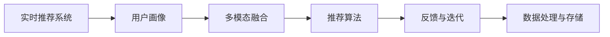

                 

## 1. 背景介绍

在数字时代，个性化推荐已成为提升用户体验和商业转化率的重要手段。根据相关统计数据，高质量推荐系统能够显著提升用户的满意度、增加用户粘性、优化产品转化。然而，传统的推荐系统往往只能基于用户的历史行为数据进行推荐，难以捕捉用户的潜在兴趣和变化。这就需要引入AI技术，特别是基于深度学习的大语言模型和大数据技术，来实现更精准、更智能的推荐服务。本文将从大语言模型的角度出发，探讨实时推荐系统的构建，并分析其潜在的挑战与未来发展方向。

## 2. 核心概念与联系

### 2.1 核心概念概述

- **实时推荐系统**：通过分析用户实时行为数据，结合用户画像和历史行为数据，动态生成个性化推荐内容，提供及时、精准的推荐服务。
- **大语言模型**：以Transformer结构为基础，通过大规模预训练学习语言知识，具备强大的文本表示和生成能力。
- **用户画像**：通过分析用户行为数据、社交数据等，建立用户兴趣模型，用于个性化推荐。
- **多模态融合**：结合文本、图像、音频等多模态数据，丰富推荐系统的内容和表现形式。
- **推荐算法**：包括协同过滤、内容推荐、混合推荐等，用于生成个性化推荐内容。
- **数据处理与存储**：包括数据清洗、特征提取、分布式存储等，为推荐系统提供高质量的数据支持。
- **反馈与迭代**：通过用户的反馈数据，不断优化推荐系统，提升推荐效果。

### 2.2 核心概念原理和架构的 Mermaid 流程图



该图展示了实时推荐系统的核心架构，各个模块之间相互协作，共同实现个性化的推荐服务。

## 3. 核心算法原理 & 具体操作步骤

### 3.1 算法原理概述

实时推荐系统通过深度学习和AI技术，构建用户画像，结合用户历史行为数据和实时行为数据，动态生成个性化推荐内容。具体流程包括：

1. **数据收集**：收集用户的历史行为数据、实时行为数据、社交数据、用户画像等。
2. **特征提取**：利用大语言模型提取文本、图像、音频等数据的特征向量。
3. **用户画像构建**：通过深度学习模型，构建用户兴趣模型，捕捉用户兴趣的动态变化。
4. **推荐生成**：结合用户画像和实时行为数据，动态生成个性化推荐内容。
5. **反馈优化**：根据用户对推荐内容的反馈，优化推荐算法，提升推荐效果。

### 3.2 算法步骤详解

1. **数据收集**：
   - 收集用户的点击、浏览、购买等行为数据。
   - 收集用户的人口统计特征、社交网络关系等非结构化数据。
   - 实时收集用户的浏览、搜索、互动等行为数据。

2. **特征提取**：
   - 利用大语言模型，如BERT、GPT等，提取文本数据的语义特征。
   - 利用卷积神经网络（CNN）或循环神经网络（RNN）提取图像、音频等非文本数据的特征。
   - 对多模态数据进行融合，提高推荐系统的泛化能力。

3. **用户画像构建**：
   - 利用深度学习模型，如协同过滤、内容推荐等，构建用户兴趣模型。
   - 将用户画像与实时行为数据结合，捕捉用户兴趣的变化。
   - 对用户画像进行动态更新，提升推荐系统的实时性。

4. **推荐生成**：
   - 结合用户画像和实时行为数据，利用推荐算法生成个性化推荐内容。
   - 利用深度学习模型，如注意力机制、Transformer等，优化推荐算法的效果。
   - 考虑多模态数据的融合，提升推荐系统的多样性和丰富性。

5. **反馈优化**：
   - 收集用户对推荐内容的反馈数据，如点击率、停留时间、购买率等。
   - 利用反馈数据，优化推荐算法，提升推荐效果。
   - 对推荐系统进行持续迭代，不断提升推荐性能。

### 3.3 算法优缺点

**优点**：
- **实时性**：结合用户实时行为数据，动态生成个性化推荐，提高用户体验。
- **个性化**：利用大语言模型和大数据技术，捕捉用户兴趣变化，提升推荐精准度。
- **泛化能力**：考虑多模态数据的融合，丰富推荐内容，提升推荐多样性。

**缺点**：
- **数据依赖**：需要大量的用户行为数据，数据获取成本高。
- **模型复杂性**：深度学习模型复杂，训练和推理成本高。
- **冷启动问题**：新用户缺乏历史行为数据，难以构建用户画像。

### 3.4 算法应用领域

实时推荐系统已经广泛应用于电商、社交、视频、音乐等多个领域。例如：

- **电商平台**：基于用户的浏览、购买行为，推荐商品、活动等。
- **社交平台**：基于用户的互动数据，推荐内容、好友等。
- **视频平台**：基于用户的观看历史，推荐影片、频道等。
- **音乐平台**：基于用户的听歌历史，推荐歌曲、专辑等。

## 4. 数学模型和公式 & 详细讲解 & 举例说明

### 4.1 数学模型构建

基于深度学习的实时推荐系统，主要包含以下几个数学模型：

1. **用户兴趣模型**：
   - 通过协同过滤、内容推荐等算法，构建用户兴趣模型。
   - 利用深度学习模型，如CNN、RNN、Transformer等，提取用户行为数据的多维特征。

2. **推荐生成模型**：
   - 利用注意力机制、Transformer等模型，生成个性化推荐内容。
   - 将推荐生成模型与用户兴趣模型结合，动态生成推荐内容。

3. **反馈优化模型**：
   - 利用反馈数据，优化推荐算法，提升推荐效果。
   - 利用在线学习算法，如随机梯度下降（SGD）、Adam等，实时更新模型参数。

### 4.2 公式推导过程

1. **协同过滤算法**：
   - 基于用户-物品评分矩阵，构建用户兴趣模型。
   - 利用矩阵分解技术，如奇异值分解（SVD），提取用户-物品的隐含特征。
   - 利用深度学习模型，如神经网络，对隐含特征进行建模。

   公式推导：
   $$
   \hat{r}_{ui} = \mathbf{u}^\top \mathbf{V} \mathbf{v}_i + b
   $$
   其中，$\hat{r}_{ui}$为预测的用户对物品的评分，$\mathbf{u}$为用户隐含特征向量，$\mathbf{v}_i$为物品隐含特征向量，$b$为偏置项。

2. **内容推荐算法**：
   - 基于用户历史行为数据和物品属性，构建推荐模型。
   - 利用深度学习模型，如卷积神经网络（CNN），对物品特征进行编码。
   - 利用注意力机制，动态生成推荐内容。

   公式推导：
   $$
   a_{t,i} = \mathrm{softmax}(\mathbf{u}_t^\top \mathbf{v}_i)
   $$
   其中，$a_{t,i}$为物品$i$对用户$t$的注意力权重，$\mathbf{u}_t$为用户$t$的特征向量，$\mathbf{v}_i$为物品$i$的特征向量。

3. **反馈优化算法**：
   - 利用随机梯度下降（SGD）、Adam等算法，实时更新模型参数。
   - 通过在线学习，不断优化推荐算法，提升推荐效果。

   公式推导：
   $$
   \theta \leftarrow \theta - \eta \nabla_{\theta}\mathcal{L}(\theta)
   $$
   其中，$\theta$为模型参数，$\eta$为学习率，$\nabla_{\theta}\mathcal{L}(\theta)$为损失函数对模型参数的梯度。

### 4.3 案例分析与讲解

以电商推荐系统为例，分析其核心算法和数学模型：

1. **用户兴趣模型**：
   - 利用协同过滤算法，基于用户历史行为数据构建用户兴趣模型。
   - 利用深度学习模型，如Transformer，对用户行为数据进行编码，提取用户兴趣特征。

2. **推荐生成模型**：
   - 利用注意力机制，动态生成个性化推荐内容。
   - 结合用户兴趣模型和实时行为数据，生成推荐结果。

3. **反馈优化模型**：
   - 利用随机梯度下降（SGD）算法，实时更新推荐模型参数。
   - 通过用户反馈数据，优化推荐算法，提升推荐效果。

## 5. 项目实践：代码实例和详细解释说明

### 5.1 开发环境搭建

- 安装Python环境：
  ```
  conda create -n recommendation-env python=3.7
  conda activate recommendation-env
  ```

- 安装相关库：
  ```
  pip install torch torchvision torchaudio scikit-learn pandas numpy
  ```

### 5.2 源代码详细实现

以电商推荐系统为例，使用PyTorch实现协同过滤和内容推荐算法：

```python
import torch
import torch.nn as nn
import torch.nn.functional as F
from torchvision.models import resnet18
from torch.utils.data import DataLoader, Dataset

# 定义数据集
class RecommendationDataset(Dataset):
    def __init__(self, data):
        self.data = data

    def __len__(self):
        return len(self.data)

    def __getitem__(self, idx):
        return self.data[idx]

# 定义协同过滤模型
class CollaborativeFilteringModel(nn.Module):
    def __init__(self, num_users, num_items, num_factors):
        super(CollaborativeFilteringModel, self).__init__()
        self.u_matrix = nn.Embedding(num_users, num_factors)
        self.v_matrix = nn.Embedding(num_items, num_factors)
        self.w_matrix = nn.Parameter(torch.randn(1, num_factors))

    def forward(self, u_ids, v_ids):
        u = self.u_matrix(u_ids)
        v = self.v_matrix(v_ids)
        rating = (u * v).sum(dim=1) + self.w_matrix
        return rating

# 定义内容推荐模型
class ContentBasedFilteringModel(nn.Module):
    def __init__(self, num_users, num_items, num_factors, num_classes):
        super(ContentBasedFilteringModel, self).__init__()
        self.user_embedding = nn.Embedding(num_users, num_factors)
        self.item_embedding = nn.Embedding(num_items, num_factors)
        self.conv1 = nn.Conv2d(1, num_factors, kernel_size=3, stride=1, padding=1)
        self.fc1 = nn.Linear(num_factors * 8 * 8, num_classes)

    def forward(self, u_ids, v_ids, item_features):
        u = self.user_embedding(u_ids)
        v = self.item_embedding(v_ids)
        x = torch.cat((u, v, item_features), dim=1).unsqueeze(1)
        x = self.conv1(x)
        x = F.relu(x)
        x = x.view(x.size(0), -1)
        rating = self.fc1(x)
        return rating

# 定义推荐系统
class RecommendationSystem(nn.Module):
    def __init__(self, num_users, num_items, num_factors, num_classes):
        super(RecommendationSystem, self).__init__()
        self.cf_model = CollaborativeFilteringModel(num_users, num_items, num_factors)
        self.cb_model = ContentBasedFilteringModel(num_users, num_items, num_factors, num_classes)

    def forward(self, u_ids, v_ids, item_features):
        rating_cf = self.cf_model(u_ids, v_ids)
        rating_cb = self.cb_model(u_ids, v_ids, item_features)
        rating = torch.sigmoid(rating_cf + rating_cb)
        return rating

# 定义优化器和损失函数
optimizer = torch.optim.Adam(model.parameters(), lr=0.01)
criterion = nn.BCEWithLogitsLoss()

# 训练模型
for epoch in range(num_epochs):
    for i, (u_ids, v_ids, item_features) in enumerate(train_loader):
        optimizer.zero_grad()
        rating = model(u_ids, v_ids, item_features)
        loss = criterion(rating, labels)
        loss.backward()
        optimizer.step()

    print(f"Epoch {epoch+1}, Loss: {loss:.4f}")
```

### 5.3 代码解读与分析

**协同过滤模型**：
- 定义了协同过滤模型，利用用户和物品的隐含特征向量，进行协同过滤。
- 使用Embedding层将用户ID和物品ID映射为隐含特征向量，进行矩阵乘法计算预测评分。
- 使用参数矩阵w，作为用户-物品的偏置项。

**内容推荐模型**：
- 定义了内容推荐模型，利用用户、物品的特征向量和物品属性特征，进行内容推荐。
- 使用Embedding层将用户ID和物品ID映射为隐含特征向量，并进行卷积操作。
- 使用全连接层对特征进行线性映射，输出预测评分。

**推荐系统**：
- 定义了推荐系统，结合协同过滤和内容推荐模型，生成个性化推荐评分。
- 使用sigmoid函数将预测评分映射到[0,1]区间，作为推荐评分。

**优化器和损失函数**：
- 使用Adam优化器，进行模型参数的优化。
- 使用二元交叉熵损失函数，作为模型训练的损失函数。

### 5.4 运行结果展示

训练完成后，模型可以在测试集上评估推荐效果。例如，计算准确率、召回率、F1分数等指标，对比不同推荐算法的效果。

## 6. 实际应用场景

### 6.1 电商平台

电商平台的推荐系统能够根据用户的浏览、购买历史，动态生成个性化推荐商品。例如，亚马逊、淘宝等大型电商平台，已经成功应用推荐系统，极大地提升了用户购物体验和销售转化率。

### 6.2 视频平台

视频平台通过实时推荐系统，为用户推荐影片、频道等。例如，Netflix、YouTube等视频平台，通过推荐系统，提升用户粘性和观看时长，增加广告收入。

### 6.3 社交平台

社交平台通过实时推荐系统，为用户推荐内容、好友等。例如，Facebook、微信等社交平台，通过推荐系统，提升用户活跃度和平台粘性。

## 7. 工具和资源推荐

### 7.1 学习资源推荐

- **书籍**：《深度学习推荐系统：原理与算法》，作者：项凌杰。
- **在线课程**：Coursera上的“推荐系统”课程，由斯坦福大学李飞飞教授主讲。
- **论文**：《Neural Collaborative Filtering》，作者：He Xuyu等。

### 7.2 开发工具推荐

- **框架**：PyTorch、TensorFlow、Keras等深度学习框架。
- **库**：Scikit-learn、Pandas、NumPy等科学计算库。
- **数据处理工具**：Dask、Apache Spark等分布式计算框架。

### 7.3 相关论文推荐

- **协同过滤**：《Matrix Factorization Techniques for Recommender Systems》，作者：Cantor等。
- **内容推荐**：《Content-Based Recommendation Systems》，作者：Reshef、Koren等。
- **反馈优化**：《Online Learning for Recommendation Systems》，作者：Koren等。

## 8. 总结：未来发展趋势与挑战

### 8.1 总结

本文从大语言模型的角度出发，探讨了实时推荐系统的构建方法和关键算法。基于深度学习的实时推荐系统，通过用户画像、多模态融合、推荐算法等技术，动态生成个性化推荐内容，提高了用户体验和转化率。尽管实时推荐系统已经在电商、视频、社交等多个领域得到应用，但仍然面临数据依赖、模型复杂、冷启动等问题。未来，实时推荐系统需要在数据获取、模型优化、应用场景等方面进行持续改进，才能更好地服务用户需求。

### 8.2 未来发展趋势

1. **多模态融合**：结合文本、图像、音频等多模态数据，提升推荐系统的多样性和丰富性。
2. **个性化推荐**：利用深度学习模型，捕捉用户兴趣变化，提升推荐精准度。
3. **实时性**：结合用户实时行为数据，动态生成个性化推荐，提高用户体验。
4. **模型优化**：优化推荐算法，提升模型效率和效果。
5. **数据获取**：构建多维度数据收集体系，丰富推荐系统数据来源。

### 8.3 面临的挑战

1. **数据获取成本高**：需要大量的用户行为数据，数据获取成本高。
2. **模型复杂**：深度学习模型复杂，训练和推理成本高。
3. **冷启动问题**：新用户缺乏历史行为数据，难以构建用户画像。
4. **过拟合问题**：推荐系统容易过拟合用户历史行为数据，导致推荐效果下降。

### 8.4 研究展望

1. **多模态融合**：结合文本、图像、音频等多模态数据，提升推荐系统的多样性和丰富性。
2. **模型优化**：优化推荐算法，提升模型效率和效果。
3. **数据获取**：构建多维度数据收集体系，丰富推荐系统数据来源。
4. **实时性**：结合用户实时行为数据，动态生成个性化推荐，提高用户体验。
5. **冷启动问题**：利用推荐系统自身的历史数据和用户行为数据，解决新用户的冷启动问题。

## 9. 附录：常见问题与解答

**Q1：如何提升推荐系统的个性化？**

A: 通过深度学习模型，如协同过滤、内容推荐等算法，构建用户兴趣模型，捕捉用户兴趣的变化。同时，结合用户实时行为数据，动态生成个性化推荐内容，提升推荐系统的个性化。

**Q2：推荐系统如何处理冷启动问题？**

A: 利用推荐系统自身的历史数据和用户行为数据，解决新用户的冷启动问题。可以采用基于物品的推荐、协同过滤等算法，构建用户画像，提高推荐效果。

**Q3：推荐系统如何避免过拟合问题？**

A: 通过正则化技术，如L2正则、Dropout等，避免模型过拟合用户历史行为数据。同时，引入对抗训练、数据增强等技术，提升模型的鲁棒性和泛化能力。

**Q4：推荐系统如何实现实时性？**

A: 结合用户实时行为数据，动态生成个性化推荐内容。同时，利用在线学习算法，如随机梯度下降（SGD）、Adam等，实时更新模型参数，提高推荐系统的实时性。

**Q5：推荐系统如何提升转化率？**

A: 通过个性化推荐，提升用户对推荐内容的满意度和信任度，从而增加用户购买、点击、观看等行为的概率，提高转化率。同时，通过A/B测试等方法，优化推荐策略，提升推荐效果。

