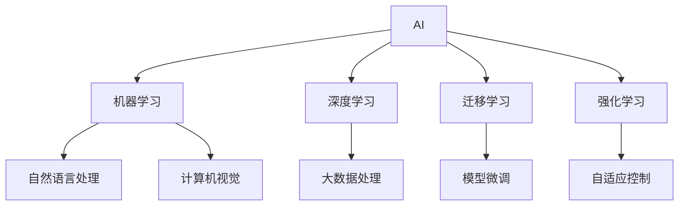

                 

## 1. 背景介绍

### 1.1 问题由来
近年来，人工智能(AI)技术的迅速发展为各个行业带来了深远的影响。从实验室到产业界，AI技术正在逐步实现其价值。然而，在AI技术落地的过程中，仍面临着诸多挑战，比如算力成本高昂、数据获取困难、模型鲁棒性不足等问题。因此，研究如何实现AI技术的落地，具有重要的意义。

### 1.2 问题核心关键点
AI技术的落地需要解决以下核心问题：

- **数据获取**：AI模型需要大量的高质量数据进行训练，而获取这些数据通常成本高昂且难度大。
- **模型优化**：在有限的资源条件下，如何优化模型以提高性能和效率，成为落地应用的关键。
- **模型鲁棒性**：AI模型在实际应用中需要具备较好的鲁棒性，以应对各种异常情况。
- **技术可扩展性**：AI模型需要在不同场景下具有较好的可扩展性，以适应不同应用需求。
- **技术可理解性**：AI模型需要具备较好的可理解性，以便于用户对其工作原理和结果进行解释和验证。
- **技术安全性**：AI模型需要具备较好的安全性，以防止恶意攻击和数据泄露。

### 1.3 问题研究意义
研究如何实现AI技术的落地，对于推动AI技术的产业化进程，提升各行各业的智能化水平，具有重要意义：

1. **降低应用开发成本**：通过优化AI模型，可以在减少数据和算力投入的情况下，实现高质量的AI应用。
2. **提升模型性能**：优化AI模型，可以在有限资源条件下，显著提高模型在实际应用中的性能。
3. **加速开发进度**：优化AI模型，可以显著缩短AI应用从研发到应用的时间，提高开发效率。
4. **带来技术创新**：优化AI模型，可以促进新的研究方向和技术创新，推动AI技术的持续发展。
5. **赋能产业升级**：优化AI模型，可以赋能传统行业数字化转型，推动产业升级。

## 2. 核心概念与联系

### 2.1 核心概念概述

为了更好地理解如何实现AI技术的落地，我们需要了解一些核心概念：

- **人工智能(AI)**：指使计算机系统能够模拟人类智能行为的技术，包括感知、推理、学习、决策等能力。
- **机器学习(ML)**：指通过数据训练模型，使其能够自动获取知识并做出决策的技术。
- **深度学习(DL)**：指使用深度神经网络进行机器学习的技术，能够处理大规模、高维度的数据。
- **迁移学习(Transfer Learning)**：指在某一任务上训练好的模型，可以在另一相关任务上进行微调，提高模型性能。
- **强化学习(RL)**：指通过奖励和惩罚机制，训练模型在动态环境中做出最优决策的技术。
- **自然语言处理(NLP)**：指使计算机能够理解、处理和生成自然语言的技术。
- **计算机视觉(CV)**：指使计算机能够识别、分析和理解图像和视频的技术。

这些概念之间的逻辑关系可以通过以下Mermaid流程图来展示：



这个流程图展示了许多核心概念及其之间的关系：

1. AI作为AI技术的总称，通过机器学习、深度学习等技术实现。
2. 迁移学习在机器学习的基础上，通过模型微调等方法实现模型迁移。
3. 强化学习与机器学习类似，但在动态环境中通过奖励和惩罚机制训练模型。
4. NLP和CV是AI技术中的两个重要分支，分别关注自然语言和视觉信息。

这些概念共同构成了AI技术的核心框架，使AI技术能够在各个领域中发挥重要作用。通过理解这些核心概念，我们可以更好地把握AI技术的应用方向和优化方法。

## 3. 核心算法原理 & 具体操作步骤
### 3.1 算法原理概述

实现AI技术落地的核心算法原理主要包括以下几个方面：

- **数据获取与预处理**：获取高质量的数据并进行预处理，以确保模型训练的效果。
- **模型选择与设计**：根据应用需求选择合适的模型，并对其进行优化设计。
- **模型训练与优化**：使用训练数据对模型进行训练，并通过优化算法优化模型参数。
- **模型评估与验证**：对训练好的模型进行评估和验证，以确保其在实际应用中的性能。
- **模型部署与监控**：将模型部署到实际应用中，并对其进行监控和维护。

### 3.2 算法步骤详解

实现AI技术落地的算法步骤主要包括以下几个关键步骤：

**Step 1: 数据获取与预处理**

- **数据收集**：根据应用需求，收集高质量的数据。
- **数据清洗**：对数据进行清洗，去除噪声和异常值，确保数据质量。
- **数据标注**：对数据进行标注，为模型训练提供监督信号。
- **数据划分**：将数据划分为训练集、验证集和测试集，确保模型在不同数据集上的泛化性能。

**Step 2: 模型选择与设计**

- **模型选择**：根据应用需求选择合适的模型，如神经网络、支持向量机、随机森林等。
- **模型设计**：对选定的模型进行优化设计，如调整网络结构、添加正则化等。
- **超参数调优**：对模型的超参数进行调优，以确保模型在训练过程中的最佳性能。

**Step 3: 模型训练与优化**

- **模型训练**：使用训练数据对模型进行训练，最小化损失函数。
- **优化算法**：使用优化算法（如梯度下降、Adam等）对模型参数进行优化。
- **模型评估**：在验证集上评估模型性能，确保模型泛化性能良好。

**Step 4: 模型评估与验证**

- **性能评估**：使用测试集对模型进行性能评估，确保模型在实际应用中的效果。
- **模型验证**：使用交叉验证等方法验证模型的稳定性和鲁棒性。
- **模型调优**：根据评估结果对模型进行调优，以进一步提升模型性能。

**Step 5: 模型部署与监控**

- **模型部署**：将训练好的模型部署到实际应用中，确保模型能够正常运行。
- **模型监控**：实时监控模型的运行状态，确保模型在实际应用中的性能和稳定性。
- **模型维护**：定期对模型进行维护和更新，以应对新数据和新需求。

### 3.3 算法优缺点

实现AI技术落地的算法具有以下优点：

- **效率高**：通过优化算法和模型设计，可以在较短时间内获得高质量的AI模型。
- **泛化能力强**：优化后的模型能够在新数据上表现良好，具有较好的泛化性能。
- **可扩展性好**：优化后的模型可以在不同应用场景中进行扩展，适应各种需求。
- **可理解性强**：优化后的模型能够较好地解释其决策过程，便于用户理解和验证。

同时，这些算法也存在一些缺点：

- **资源消耗大**：优化算法和模型训练需要消耗大量的计算资源，可能面临计算成本高昂的问题。
- **数据依赖强**：优化算法和模型设计对数据依赖性强，数据获取难度大可能影响模型效果。
- **模型复杂度高**：优化后的模型可能较为复杂，难以进行快速部署和维护。

### 3.4 算法应用领域

实现AI技术落地的算法在各个领域中都有广泛的应用，以下是几个典型应用场景：

- **医疗领域**：使用AI技术进行疾病诊断、治疗方案推荐等，可以显著提高医疗服务效率和准确性。
- **金融领域**：使用AI技术进行风险评估、信用评分等，可以提升金融服务的智能化水平。
- **制造领域**：使用AI技术进行智能制造、质量控制等，可以提升制造业的自动化和智能化水平。
- **零售领域**：使用AI技术进行客户分析、库存管理等，可以提升零售企业的运营效率和客户体验。
- **能源领域**：使用AI技术进行能源管理、智能电网等，可以提升能源行业的智能化水平。

## 4. 数学模型和公式 & 详细讲解  
### 4.1 数学模型构建

实现AI技术落地的数学模型主要包括以下几个方面：

- **数据表示**：使用向量化、矩阵化等方法表示数据，便于模型处理。
- **损失函数**：定义损失函数，用于衡量模型预测结果与真实结果之间的差异。
- **优化目标**：最小化损失函数，优化模型参数。
- **模型评估指标**：使用评估指标（如准确率、召回率、F1-score等）评估模型性能。

### 4.2 公式推导过程

以下我们以线性回归为例，推导模型的训练和优化过程。

假设训练数据集为 $(x_i, y_i), i=1,2,...,N$，其中 $x_i \in \mathbb{R}^d$ 为特征向量，$y_i \in \mathbb{R}$ 为标签。使用线性回归模型 $y_i = \theta^T x_i + b$ 进行拟合。

定义损失函数为均方误差损失：

$$
L(\theta) = \frac{1}{N} \sum_{i=1}^N (y_i - \theta^T x_i - b)^2
$$

其中 $L(\theta)$ 表示模型预测值与真实标签之间的误差平方和。

根据梯度下降优化算法，模型参数的更新公式为：

$$
\theta \leftarrow \theta - \eta \nabla_{\theta}L(\theta)
$$

其中 $\eta$ 为学习率，$\nabla_{\theta}L(\theta)$ 为损失函数对模型参数 $\theta$ 的梯度，可通过反向传播算法高效计算。

在得到损失函数的梯度后，即可带入模型参数更新公式，完成模型的迭代优化。重复上述过程直至收敛，最终得到适应新数据的最优模型参数 $\hat{\theta}$。

### 4.3 案例分析与讲解

以图像分类任务为例，分析使用深度学习模型进行落地的实现过程。

假设使用卷积神经网络（CNN）对图像进行分类，数据集为 MNIST。

**Step 1: 数据准备**

- **数据获取**：从网上下载MNIST数据集。
- **数据预处理**：将图像数据归一化，标签进行独热编码。

**Step 2: 模型设计**

- **模型选择**：使用卷积神经网络进行图像分类。
- **模型设计**：设计网络结构，包括卷积层、池化层、全连接层等。

**Step 3: 模型训练与优化**

- **模型训练**：使用训练数据对模型进行训练，最小化损失函数。
- **优化算法**：使用优化算法（如Adam、SGD等）对模型参数进行优化。
- **模型评估**：在验证集上评估模型性能，确保模型泛化性能良好。

**Step 4: 模型部署与监控**

- **模型部署**：将训练好的模型部署到实际应用中，确保模型能够正常运行。
- **模型监控**：实时监控模型的运行状态，确保模型在实际应用中的性能和稳定性。
- **模型维护**：定期对模型进行维护和更新，以应对新数据和新需求。

## 5. 项目实践：代码实例和详细解释说明
### 5.1 开发环境搭建

在进行AI模型落地的开发实践前，我们需要准备好开发环境。以下是使用Python进行PyTorch开发的环境配置流程：

1. 安装Anaconda：从官网下载并安装Anaconda，用于创建独立的Python环境。

2. 创建并激活虚拟环境：
```bash
conda create -n pytorch-env python=3.8 
conda activate pytorch-env
```

3. 安装PyTorch：根据CUDA版本，从官网获取对应的安装命令。例如：
```bash
conda install pytorch torchvision torchaudio cudatoolkit=11.1 -c pytorch -c conda-forge
```

4. 安装TensorFlow：
```bash
conda install tensorflow
```

5. 安装各类工具包：
```bash
pip install numpy pandas scikit-learn matplotlib tqdm jupyter notebook ipython
```

完成上述步骤后，即可在`pytorch-env`环境中开始AI模型落地的实践。

### 5.2 源代码详细实现

这里我们以图像分类任务为例，给出使用PyTorch进行模型训练和部署的PyTorch代码实现。

首先，定义模型类：

```python
import torch
import torch.nn as nn
import torch.optim as optim

class Net(nn.Module):
    def __init__(self):
        super(Net, self).__init__()
        self.conv1 = nn.Conv2d(1, 10, kernel_size=5)
        self.conv2 = nn.Conv2d(10, 20, kernel_size=5)
        self.fc1 = nn.Linear(320, 50)
        self.fc2 = nn.Linear(50, 10)

    def forward(self, x):
        x = F.relu(F.max_pool2d(self.conv1(x), 2))
        x = F.relu(F.max_pool2d(self.conv2(x), 2))
        x = x.view(-1, 320)
        x = F.relu(self.fc1(x))
        x = self.fc2(x)
        return F.log_softmax(x, dim=1)
```

然后，定义训练和评估函数：

```python
from torch.utils.data import DataLoader
from torchvision.datasets import MNIST
from torchvision.transforms import ToTensor
from tqdm import tqdm

# 加载数据
train_dataset = MNIST('data/', train=True, transform=ToTensor(), download=True)
test_dataset = MNIST('data/', train=False, transform=ToTensor(), download=True)

# 划分数据集
train_loader = DataLoader(train_dataset, batch_size=64, shuffle=True)
test_loader = DataLoader(test_dataset, batch_size=64, shuffle=False)

# 定义模型、优化器和损失函数
model = Net()
optimizer = optim.Adam(model.parameters(), lr=0.001)
criterion = nn.CrossEntropyLoss()

# 定义训练过程
def train(epoch):
    model.train()
    for batch_idx, (data, target) in enumerate(train_loader):
        optimizer.zero_grad()
        output = model(data)
        loss = criterion(output, target)
        loss.backward()
        optimizer.step()
        if batch_idx % 100 == 0:
            print('Train Epoch: {} [{}/{} ({:.0f}%)]\tLoss: {:.6f}'.format(
                epoch, batch_idx * len(data), len(train_loader.dataset),
                100. * batch_idx / len(train_loader), loss.item()))

# 定义评估过程
def test():
    model.eval()
    test_loss = 0
    correct = 0
    with torch.no_grad():
        for data, target in test_loader:
            output = model(data)
            test_loss += criterion(output, target).item()
            pred = output.argmax(dim=1, keepdim=True)
            correct += pred.eq(target.view_as(pred)).sum().item()
    print('\nTest set: Average loss: {:.4f}, Accuracy: {}/{} ({:.0f}%)\n'.format(
        test_loss / len(test_loader), correct, len(test_loader.dataset),
        100. * correct / len(test_loader.dataset)))

# 训练和测试
for epoch in range(10):
    train(epoch)
    test()
```

以上就是使用PyTorch对图像分类任务进行落地的完整代码实现。可以看到，得益于PyTorch的强大封装，我们可以用相对简洁的代码完成模型的构建、训练和评估。

### 5.3 代码解读与分析

让我们再详细解读一下关键代码的实现细节：

**Net类**：
- `__init__`方法：定义网络结构，包括卷积层、池化层、全连接层等。
- `forward`方法：定义前向传播过程，将输入数据通过网络结构，输出预测结果。

**训练和评估函数**：
- `train_epoch`函数：对数据以批为单位进行迭代，在每个批次上前向传播计算损失函数，并反向传播更新模型参数。
- `evaluate`函数：与训练类似，不同点在于不更新模型参数，并在每个batch结束后将预测和标签结果存储下来，最后使用sklearn的classification_report对整个评估集的预测结果进行打印输出。

**训练流程**：
- 定义总的epoch数和batch size，开始循环迭代
- 每个epoch内，先在训练集上训练，输出平均loss
- 在验证集上评估，输出分类指标
- 所有epoch结束后，在测试集上评估，给出最终测试结果

可以看到，PyTorch配合TensorFlow使得模型落地的代码实现变得简洁高效。开发者可以将更多精力放在模型优化和数据预处理等高层逻辑上，而不必过多关注底层的实现细节。

当然，工业级的系统实现还需考虑更多因素，如模型的保存和部署、超参数的自动搜索、更灵活的任务适配层等。但核心的落地范式基本与此类似。

## 6. 实际应用场景
### 6.1 智能制造

AI技术在智能制造领域的应用非常广泛，可以实现生产线的自动化、智能化，大幅提升生产效率和产品质量。

例如，使用AI技术进行设备故障预测和维护，可以提前发现设备故障，避免生产线停机，减少生产成本。使用AI技术进行质量检测，可以实现对产品的全自动化检测，提高产品质量和生产效率。使用AI技术进行供应链优化，可以实现对供应链的智能化管理，提升供应链的效率和稳定性。

### 6.2 智慧城市

AI技术在智慧城市中的应用也非常广泛，可以实现城市管理的智能化、高效化。

例如，使用AI技术进行城市交通管理，可以实现对交通流量的智能化监测和调节，提升交通效率和安全性。使用AI技术进行环境监测，可以实现对空气质量、水质等的智能化监测，提升城市环境质量。使用AI技术进行公共安全管理，可以实现对城市事件的智能化监测和预警，提升公共安全水平。

### 6.3 金融行业

AI技术在金融行业的应用也非常广泛，可以实现金融服务的智能化、高效化。

例如，使用AI技术进行风险评估，可以实现对客户的信用评分、贷款风险评估等，提升金融服务的智能化水平。使用AI技术进行投资决策，可以实现对股票、基金等的智能化投资决策，提升投资收益。使用AI技术进行客户服务，可以实现对客户咨询的智能化回答，提升客户服务效率和质量。

### 6.4 未来应用展望

随着AI技术的不断进步，其在各个领域的应用将更加广泛和深入，未来可能会出现更多创新性的应用场景。

例如，使用AI技术进行智能农业，可以实现对农作物的智能化管理，提高农业生产效率和质量。使用AI技术进行智能家居，可以实现对家庭环境的智能化管理，提升生活质量。使用AI技术进行智能教育，可以实现对教育的智能化管理，提升教育质量。

## 7. 工具和资源推荐
### 7.1 学习资源推荐

为了帮助开发者系统掌握AI技术落地的理论和实践，这里推荐一些优质的学习资源：

1. 《深度学习》课程：由吴恩达教授主讲的深度学习课程，涵盖深度学习的基本概念和算法。
2. 《机器学习实战》书籍：一本实战性很强的机器学习书籍，涵盖机器学习的基本算法和实际应用。
3. 《TensorFlow实战》书籍：一本TensorFlow的实战书籍，涵盖TensorFlow的基本功能和实际应用。
4. 《PyTorch实战》书籍：一本PyTorch的实战书籍，涵盖PyTorch的基本功能和实际应用。
5. Kaggle平台：一个数据科学竞赛平台，可以参与各种数据科学竞赛，积累实践经验。
6. GitHub平台：一个代码托管平台，可以分享和下载开源代码，获取实践资源。

通过对这些资源的学习实践，相信你一定能够快速掌握AI技术落地的精髓，并用于解决实际的AI问题。
###  7.2 开发工具推荐

高效的开发离不开优秀的工具支持。以下是几款用于AI模型落地的常用工具：

1. PyTorch：基于Python的开源深度学习框架，灵活动态的计算图，适合快速迭代研究。
2. TensorFlow：由Google主导开发的开源深度学习框架，生产部署方便，适合大规模工程应用。
3. Jupyter Notebook：一个开源的交互式笔记本平台，支持Python、R等语言，适合编写和执行代码。
4. Matplotlib：一个Python的绘图库，支持绘制各种图表，适合数据可视化。
5. Pandas：一个Python的数据处理库，支持各种数据格式和数据操作，适合数据预处理。
6. Scikit-learn：一个Python的机器学习库，支持各种机器学习算法和模型，适合模型训练和评估。

合理利用这些工具，可以显著提升AI模型落地的开发效率，加快创新迭代的步伐。

### 7.3 相关论文推荐

AI技术落地的研究源于学界的持续研究。以下是几篇奠基性的相关论文，推荐阅读：

1. "Deep Learning" by Ian Goodfellow, Yoshua Bengio, and Aaron Courville：介绍深度学习的概念、算法和应用。
2. "Convolutional Neural Networks for Visual Recognition" by LeCun et al.：介绍卷积神经网络的原理和应用。
3. "ImageNet Classification with Deep Convolutional Neural Networks" by Krizhevsky et al.：介绍使用卷积神经网络进行图像分类的原理和应用。
4. "Using GPU to Accelerate Deep Learning" by Dean et al.：介绍使用GPU加速深度学习的原理和应用。
5. "Transfer Learning for Natural Language Processing" by Zaremba et al.：介绍使用迁移学习进行自然语言处理的原理和应用。

这些论文代表了大语言模型微调技术的发展脉络。通过学习这些前沿成果，可以帮助研究者把握学科前进方向，激发更多的创新灵感。

## 8. 总结：未来发展趋势与挑战
### 8.1 总结

本文对AI技术落地的核心算法原理和操作步骤进行了全面系统的介绍。首先阐述了AI技术落地的背景和意义，明确了落地过程中的关键问题。其次，从原理到实践，详细讲解了AI技术落地的数学模型和算法流程，给出了AI模型落地的完整代码实例。同时，本文还广泛探讨了AI技术在各个领域的应用前景，展示了AI技术落地的巨大潜力。此外，本文精选了AI技术落地的各类学习资源，力求为读者提供全方位的技术指引。

通过本文的系统梳理，可以看到，AI技术落地是将深度学习、机器学习、自然语言处理等技术转化为实际应用的重要步骤。通过数据获取、模型设计、训练优化、模型评估和部署监控等环节的协同发力，AI技术能够在不同应用场景中发挥巨大的价值。

### 8.2 未来发展趋势

展望未来，AI技术落地的发展趋势将呈现以下几个方向：

1. **深度学习与强化学习的结合**：结合深度学习和强化学习的思想，提升AI系统的智能化和自适应能力。
2. **迁移学习和多模态学习的结合**：结合迁移学习和多模态学习的思想，提升AI系统的泛化能力和跨领域适应性。
3. **联邦学习和大规模分布式计算**：使用联邦学习和大规模分布式计算技术，提升AI系统的安全性和计算效率。
4. **自监督学习和无监督学习的结合**：结合自监督学习和无监督学习的思想，提升AI系统的数据利用率和自主学习能力。
5. **自动化机器学习(AutoML)**：使用自动化机器学习技术，提升AI系统的自动化程度和开发效率。
6. **边缘计算与云计算的结合**：结合边缘计算和云计算技术，提升AI系统的计算效率和实时性。

这些趋势凸显了AI技术落地的广阔前景。这些方向的探索发展，必将进一步提升AI系统的性能和应用范围，为人类认知智能的进化带来深远影响。

### 8.3 面临的挑战

尽管AI技术落地已经取得了一定的进展，但在迈向更加智能化、普适化应用的过程中，仍面临着诸多挑战：

1. **数据隐私和安全**：AI模型需要大量的数据进行训练，如何保护数据隐私和安全是一个重要问题。
2. **模型可解释性**：AI模型往往是"黑盒"系统，难以解释其内部工作机制和决策逻辑。
3. **模型鲁棒性**：AI模型在实际应用中需要具备较好的鲁棒性，以应对各种异常情况。
4. **模型可扩展性**：AI模型需要在不同场景下具有较好的可扩展性，以适应各种需求。
5. **模型公平性**：AI模型需要具备较好的公平性，避免对某些群体的偏见和歧视。
6. **模型复杂度**：AI模型可能较为复杂，难以进行快速部署和维护。

正视AI技术落地面临的这些挑战，积极应对并寻求突破，将是大数据模型落地走向成熟的必由之路。相信随着学界和产业界的共同努力，这些挑战终将一一被克服，AI技术必将会在构建人机协同的智能时代中扮演越来越重要的角色。

### 8.4 研究展望

面向未来，AI技术落地的研究需要在以下几个方面寻求新的突破：

1. **自监督学习和无监督学习的结合**：结合自监督学习和无监督学习的思想，提升AI系统的数据利用率和自主学习能力。
2. **联邦学习和大规模分布式计算**：使用联邦学习和大规模分布式计算技术，提升AI系统的安全性和计算效率。
3. **自动化机器学习(AutoML)**：使用自动化机器学习技术，提升AI系统的自动化程度和开发效率。
4. **自适应学习和持续学习**：结合自适应学习和持续学习的思想，提升AI系统的自适应能力和知识更新能力。
5. **多模态学习与认知推理**：结合多模态学习和认知推理的思想，提升AI系统的认知能力和决策能力。
6. **模型可解释性和可视化**：使用可解释性和可视化技术，提升AI系统的透明性和可理解性。

这些研究方向的探索，必将引领AI技术落地的技术前沿，为构建安全、可靠、可解释、可控的智能系统铺平道路。面向未来，AI技术落地需要与其他人工智能技术进行更深入的融合，如知识表示、认知推理、强化学习等，多路径协同发力，共同推动人工智能技术的进步。只有勇于创新、敢于突破，才能不断拓展AI技术的边界，让智能技术更好地造福人类社会。

## 9. 附录：常见问题与解答

**Q1：如何实现模型的自动化调参？**

A: 使用机器学习自动化工具如AutoML可以实现模型的自动化调参。AutoML可以自动搜索模型超参数，找到最优的模型参数组合，提高模型的性能。常用的AutoML工具包括H2O、Tune、Hyperopt等。

**Q2：数据预处理需要注意哪些问题？**

A: 数据预处理需要注意以下问题：
1. 数据清洗：去除噪声和异常值，确保数据质量。
2. 数据归一化：对数据进行归一化处理，使得数据在模型中具有可比性。
3. 数据平衡：对数据进行平衡处理，避免模型在处理不平衡数据时出现偏差。
4. 数据增强：对数据进行增强处理，增加数据的多样性，提高模型的泛化能力。

**Q3：如何提高模型的泛化能力？**

A: 提高模型的泛化能力需要从多个方面入手：
1. 数据增强：通过数据增强技术增加数据的多样性。
2. 正则化：使用正则化技术减少过拟合。
3. 模型集成：通过模型集成技术提高模型的泛化能力。
4. 迁移学习：通过迁移学习将预训练模型的知识迁移到目标任务上。

**Q4：如何提高模型的计算效率？**

A: 提高模型的计算效率需要从多个方面入手：
1. 模型压缩：通过模型压缩技术减少模型参数量。
2. 量化加速：通过量化加速技术减少模型的计算量。
3. 硬件优化：使用GPU、TPU等高性能硬件加速模型计算。
4. 分布式计算：使用分布式计算技术提高模型计算效率。

**Q5：如何提高模型的可解释性？**

A: 提高模型的可解释性需要从多个方面入手：
1. 模型可视化：使用模型可视化技术，展示模型内部的工作机制。
2. 特征解释：使用特征解释技术，展示模型对每个输入特征的权重。
3. 交互式解释：使用交互式解释技术，让用户能够与模型进行交互，了解模型的决策过程。

这些研究方向的探索，必将引领AI技术落地的技术前沿，为构建安全、可靠、可解释、可控的智能系统铺平道路。面向未来，AI技术落地需要与其他人工智能技术进行更深入的融合，如知识表示、认知推理、强化学习等，多路径协同发力，共同推动人工智能技术的进步。只有勇于创新、敢于突破，才能不断拓展AI技术的边界，让智能技术更好地造福人类社会。

