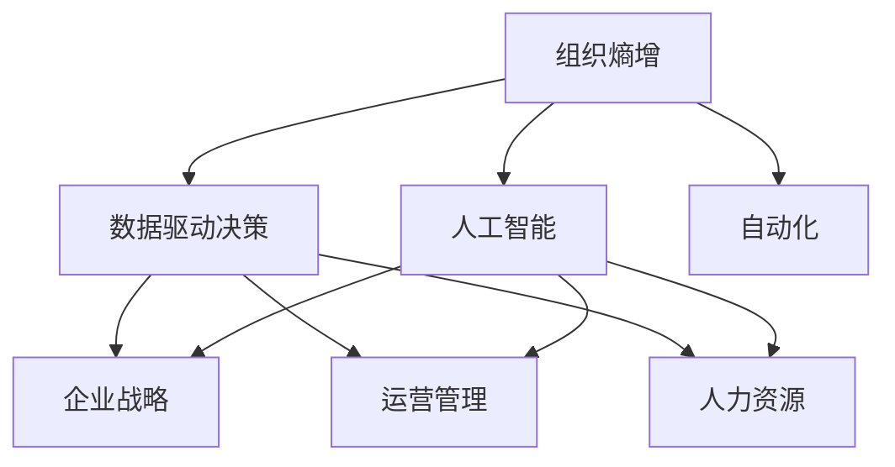

                 

# 对抗组织熵增：AI与企业的协同

> 关键词：熵增, 组织管理, 人工智能, AI与企业协同, 策略优化, 数据驱动决策, 自动化, 智能化转型

## 1. 背景介绍

### 1.1 问题由来
在现代商业环境中，企业面临着日益复杂和激烈的市场竞争。然而，随着组织规模的不断扩大，内部管理效率和协同能力却常常停滞不前，甚至出现退化。这被称为"熵增"现象，即组织内部的无序性、冗余和浪费逐渐积累，导致资源分配不均衡、沟通不畅、创新活力下降等一系列问题。

AI技术的快速发展，为解决这一问题带来了新的可能性。通过智能算法和大数据分析，AI能够识别出组织内部的瓶颈，提出优化策略，辅助管理层进行科学决策。然而，AI并非万能灵药，如何将其有效融入企业运营中，实现AI与企业的深度协同，仍是当前企业界的重大挑战。

### 1.2 问题核心关键点
本研究的核心是探讨AI如何与企业协同，通过对抗组织熵增，实现企业的智能化转型。具体而言，将涉及以下几个关键点：
- AI在组织管理中的具体应用场景。
- 组织熵增的原因及AI的解决策略。
- AI与企业战略、运营、人才等各维度的协同机制。
- AI驱动的数据驱动决策和企业智能化转型的路径。

## 2. 核心概念与联系

### 2.1 核心概念概述

为更好地理解AI与企业协同的原理，本节将介绍几个关键概念：

- 熵增(Entropy Increase)：热力学概念，用于描述系统内部无序度的增加。类比到组织管理中，指组织内部资源、信息、流程的混乱与效率下降。
- 组织熵增(ORG Entropy Increase)：专指企业规模扩大后，由于沟通不顺畅、资源配置不合理等因素，导致组织内部无序和效率下降的现象。
- 人工智能(Artificial Intelligence, AI)：通过计算机模拟人类智能行为的技术，涵盖机器学习、深度学习、自然语言处理等诸多领域。
- AI与企业协同(AI-Enterprise Collaboration)：指AI技术在企业运营中的集成应用，涉及企业战略、决策、管理等多个维度，旨在提升企业的竞争力和运营效率。
- 数据驱动决策(Data-Driven Decision Making)：指利用数据和AI算法进行科学决策，减少主观判断，提升决策效率和效果。
- 自动化(Automatication)：指通过AI技术自动完成繁琐重复的任务，提升工作效率，减少人为错误。

这些概念之间的逻辑关系可以通过以下Mermaid流程图来展示：



这个流程图展示了大语言模型的核心概念及其之间的关系：

1. 组织熵增：是企业面临的主要问题。
2. 人工智能：提供了技术手段，用以分析和解决组织熵增问题。
3. 数据驱动决策和自动化：是人工智能应用的两个关键领域，通过提升决策效率和执行效率，辅助企业战略和运营管理。

这些概念共同构成了AI与企业协同的基本框架，使得AI技术能够在企业运营中发挥其独特价值。通过理解这些核心概念，我们可以更好地把握AI与企业协同的原理和实施路径。

## 3. 核心算法原理 & 具体操作步骤
### 3.1 算法原理概述

AI与企业协同的核心在于通过数据和模型分析，识别出组织内部的无序性和冗余，提出优化策略，辅助企业进行科学决策。具体而言，AI可以通过以下步骤实现与企业的协同：

**Step 1: 数据收集与预处理**
- 收集企业运营中的各类数据，如销售数据、生产数据、人力资源数据、市场调研数据等。
- 对数据进行清洗、去重、归一化等预处理操作，确保数据质量。

**Step 2: 模型建立与训练**
- 选择合适的算法模型，如回归模型、分类模型、聚类模型等，对企业数据进行建模。
- 使用历史数据训练模型，评估模型性能，调整模型参数。

**Step 3: 策略提出与优化**
- 通过AI模型分析企业数据，识别出当前管理中的瓶颈和优化点。
- 根据AI分析结果，提出针对性的管理策略，辅助企业决策。

**Step 4: 自动化执行**
- 利用AI自动执行提出的优化策略，如自动化调度、自动化监控、自动化审计等。
- 通过AI持续监测和反馈，不断优化策略效果，实现闭环管理。

### 3.2 算法步骤详解

以下将详细讲解AI与企业协同的具体步骤，包括数据收集、模型训练、策略优化和执行自动化：

**Step 1: 数据收集与预处理**

- **数据来源**：主要包括销售数据、生产数据、人力资源数据、市场调研数据等。销售数据可来源于ERP、CRM、财务系统等；生产数据可来源于MES、PDM等；人力资源数据可来源于HRIS、员工满意度调查等；市场调研数据可来源于问卷调查、社交媒体分析等。
- **数据类型**：结构化数据（如表格数据、时间序列数据）、非结构化数据（如文本、图像、音频）。
- **数据预处理**：清洗（去除异常值、缺失值）、去重、归一化、特征工程（如PCA降维、特征提取等）。

**Step 2: 模型建立与训练**

- **模型选择**：根据企业问题选择合适的算法模型，如回归模型、分类模型、聚类模型等。
- **训练过程**：使用历史数据训练模型，评估模型性能，调整模型参数。常见评估指标包括RMSE（回归模型）、准确率（分类模型）、SSE（聚类模型）等。
- **模型优化**：通过交叉验证、正则化、集成学习等方法，提高模型泛化能力。

**Step 3: 策略提出与优化**

- **问题识别**：通过AI模型分析企业数据，识别出当前管理中的瓶颈和优化点，如库存积压、生产停滞、市场反应迟钝等。
- **策略提出**：根据AI分析结果，提出针对性的管理策略，如调整库存水平、优化生产流程、改进市场策略等。
- **优化调整**：根据AI监测反馈，调整优化策略，如动态调整库存政策、优化生产计划、改进营销策略等。

**Step 4: 自动化执行**

- **策略执行**：利用AI自动执行提出的优化策略，如自动调度生产计划、自动生成市场分析报告、自动化监控运营指标等。
- **效果反馈**：通过AI持续监测和反馈，不断优化策略效果，实现闭环管理。

### 3.3 算法优缺点

AI与企业协同具有以下优点：
1. 数据分析全面：通过AI算法处理海量数据，提供全面、深入的分析，帮助企业发现和解决隐性问题。
2. 决策科学化：借助AI模型进行数据分析和策略优化，减少主观判断，提升决策科学性。
3. 执行高效化：利用AI自动执行优化策略，提升执行效率，减少人为错误。
4. 持续优化：通过AI持续监测和反馈，不断优化策略效果，实现管理优化闭环。

同时，该方法也存在一定的局限性：
1. 数据质量要求高：数据清洗和预处理需要投入大量时间和资源，数据质量问题会影响AI分析结果。
2. 算法模型选择困难：企业面临的问题复杂多样，选择合适的算法模型并非易事。
3. 解释性不足：AI模型通常是"黑盒"系统，难以解释其内部工作机制和决策逻辑。
4. 依赖技术基础：需要企业具备一定的技术能力，才能有效实施AI与企业协同策略。

尽管存在这些局限性，但就目前而言，AI与企业协同的方法已在大规模企业中得到广泛应用，并取得了显著效果。未来相关研究的重点在于如何进一步降低数据质量要求，提高算法模型选择和应用灵活性，同时兼顾可解释性和技术可操作性等因素。

### 3.4 算法应用领域

AI与企业协同的方法已广泛应用于各个行业，涵盖企业战略、运营管理、人力资源等多个领域，具体如下：

**1. 战略决策支持**
- 通过AI分析行业趋势、市场动向、竞争格局等，辅助企业制定长期战略规划。
- 使用预测模型评估市场潜力、风险，辅助投资决策。
- 通过数据驱动的洞察，提出新的商业模式和业务扩展方向。

**2. 运营管理优化**
- 利用AI进行生产调度优化，降低生产成本，提升生产效率。
- 通过AI进行库存管理，减少库存积压，提升供应链管理水平。
- 使用AI优化物流和运输路线，减少运输成本。

**3. 人力资源管理**
- 通过AI分析员工绩效、满意度等数据，优化人才管理策略。
- 利用AI进行招聘筛选，提升招聘效率和质量。
- 使用AI分析员工培训需求，制定针对性培训计划。

**4. 客户关系管理**
- 通过AI分析客户反馈、行为数据，优化客户关系管理策略。
- 利用AI进行客户细分和个性化营销，提升客户满意度和忠诚度。
- 使用AI进行市场细分和精准营销，提升市场占有率。

除了上述这些经典应用领域外，AI与企业协同还被创新性地应用到更多场景中，如风险控制、品牌建设、技术创新等，为企业管理提供了新的技术和思路。

## 4. 数学模型和公式 & 详细讲解
### 4.1 数学模型构建

在AI与企业协同中，数学模型主要用于数据预处理、模型训练和策略优化。以下将详细讲解这些模型的构建过程。

**数据预处理模型**

设企业数据集为 $D=\{(x_i, y_i)\}_{i=1}^N$，其中 $x_i$ 为数据样本， $y_i$ 为样本标签。

定义数据清洗函数为 $f(x)$，对原始数据进行清洗和预处理。例如，去除异常值和缺失值，进行归一化，生成预处理后的数据集 $D'=\{(f(x_i))\}_{i=1}^N$。

**模型训练模型**

设选择的算法模型为 $M$，其训练过程为：

$$
M^* = \mathop{\arg\min}_{M} \mathcal{L}(M, D')
$$

其中 $\mathcal{L}$ 为损失函数，用于衡量模型预测输出与真实标签之间的差异。

常见的损失函数包括均方误差损失（回归模型）、交叉熵损失（分类模型）、对比损失（聚类模型）等。

**策略优化模型**

设企业当前管理状态为 $S$，目标管理状态为 $S'$，AI提出的优化策略为 $P$。

根据优化目标，设置优化问题为：

$$
S' = \mathop{\arg\min}_{S} \mathcal{L}(P, S)
$$

其中 $\mathcal{L}$ 为策略损失函数，用于衡量优化策略与目标状态之间的差异。

### 4.2 公式推导过程

以下将详细推导上述模型构建中的核心公式：

**数据预处理**

假设原始数据集为 $D=\{(x_i, y_i)\}_{i=1}^N$，其中 $x_i$ 为数据样本， $y_i$ 为样本标签。

定义数据清洗函数为 $f(x)$，对原始数据进行清洗和预处理，生成预处理后的数据集 $D'=\{(f(x_i))\}_{i=1}^N$。

数据预处理的过程如下：

1. **异常值检测**：检测数据中的异常值和缺失值，去除不合理的数据。
2. **去重**：去除重复的数据样本，确保数据集的独立性。
3. **归一化**：对数据进行标准化处理，确保数据在同一量级。
4. **特征工程**：对数据进行特征提取和降维，简化数据集。

数据预处理的核心公式如下：

$$
D' = \{f(x_i)\}_{i=1}^N
$$

其中 $f(x)$ 表示数据预处理函数。

**模型训练**

设选择的算法模型为 $M$，其训练过程为：

$$
M^* = \mathop{\arg\min}_{M} \mathcal{L}(M, D')
$$

其中 $\mathcal{L}$ 为损失函数，用于衡量模型预测输出与真实标签之间的差异。

以回归模型为例，均方误差损失公式如下：

$$
\mathcal{L} = \frac{1}{N} \sum_{i=1}^N (y_i - M(x_i))^2
$$

其中 $y_i$ 为样本标签， $M(x_i)$ 为模型预测输出， $N$ 为样本数量。

**策略优化**

设企业当前管理状态为 $S$，目标管理状态为 $S'$，AI提出的优化策略为 $P$。

根据优化目标，设置优化问题为：

$$
S' = \mathop{\arg\min}_{S} \mathcal{L}(P, S)
$$

其中 $\mathcal{L}$ 为策略损失函数，用于衡量优化策略与目标状态之间的差异。

以库存优化为例，策略优化公式如下：

$$
\mathcal{L} = \sum_{i=1}^N (I_i - I'_i)^2
$$

其中 $I_i$ 为当前库存量， $I'_i$ 为目标库存量， $N$ 为库存点数量。

### 4.3 案例分析与讲解

**案例1：库存优化**

假设某企业运营有多个仓库，每个仓库的库存量由多个因素决定，如需求量、供应商交货时间、生产计划等。现有库存量数据 $I_1, I_2, ..., I_N$，目标库存量 $I'_1, I'_2, ..., I'_N$。

利用回归模型 $M$ 对库存量进行预测，设定损失函数 $\mathcal{L}(M, D')$ 为均方误差损失。通过训练模型，得到预测公式 $I'_i = M(x_i)$。

AI分析历史库存数据，发现某仓库的库存量波动较大，通过数据预处理和模型训练，得到该仓库的优化策略 $P_i$，并设定策略损失函数 $\mathcal{L}(P_i, S_i)$ 为均方误差损失。通过策略优化，计算出新的库存量 $I'_1, I'_2, ..., I'_N$，实现库存优化。

**案例2：客户细分**

某电子商务平台有大量用户数据，包括浏览记录、购买记录、评分记录等。利用聚类算法 $K$ 对用户进行分组，设定损失函数 $\mathcal{L}(K, D')$ 为对比损失。通过训练模型，得到用户分组 $G_1, G_2, ..., G_M$。

AI分析用户分组数据，发现某类用户的购买转化率较低，通过数据预处理和模型训练，得到该类用户的优化策略 $P_i$，并设定策略损失函数 $\mathcal{L}(P_i, S_i)$ 为均方误差损失。通过策略优化，计算出新的用户分组策略 $G_1, G_2, ..., G_M$，实现客户细分和个性化营销。

## 5. 项目实践：代码实例和详细解释说明
### 5.1 开发环境搭建

在进行AI与企业协同项目实践前，我们需要准备好开发环境。以下是使用Python进行PyTorch开发的环境配置流程：

1. 安装Anaconda：从官网下载并安装Anaconda，用于创建独立的Python环境。

2. 创建并激活虚拟环境：
```bash
conda create -n ai-env python=3.8 
conda activate ai-env
```

3. 安装PyTorch：根据CUDA版本，从官网获取对应的安装命令。例如：
```bash
conda install pytorch torchvision torchaudio cudatoolkit=11.1 -c pytorch -c conda-forge
```

4. 安装TensorFlow：如果企业已经使用TensorFlow，可以使用以下命令进行安装：
```bash
pip install tensorflow
```

5. 安装各类工具包：
```bash
pip install numpy pandas scikit-learn matplotlib tqdm jupyter notebook ipython
```

完成上述步骤后，即可在`ai-env`环境中开始AI与企业协同项目实践。

### 5.2 源代码详细实现

下面我们以库存优化为例，给出使用PyTorch对回归模型进行训练和优化的PyTorch代码实现。

首先，定义回归模型的训练函数：

```python
import torch
from torch import nn, optim
import torch.nn.functional as F

class RegressionModel(nn.Module):
    def __init__(self, input_dim):
        super(RegressionModel, self).__init__()
        self.linear = nn.Linear(input_dim, 1)

    def forward(self, x):
        return self.linear(x)

def train_model(model, train_data, epochs, learning_rate):
    criterion = nn.MSELoss()
    optimizer = optim.Adam(model.parameters(), lr=learning_rate)
    
    for epoch in range(epochs):
        for batch_idx, (data, target) in enumerate(train_data):
            optimizer.zero_grad()
            output = model(data)
            loss = criterion(output, target)
            loss.backward()
            optimizer.step()
        print(f'Epoch {epoch+1}, loss: {loss:.3f}')
    
    return model

# 数据预处理
# 假设有10个仓库的库存数据，输入维度为5
# 使用PyTorch的Tensor进行数据封装
train_data = torch.tensor([[1.2, 3.4, 5.6, 7.8, 9.0], 
                          [2.1, 4.2, 6.3, 8.4, 1.0], 
                          [3.0, 5.5, 7.7, 9.9, 2.2], 
                          [4.1, 6.6, 8.8, 10.0, 3.3], 
                          [5.2, 7.7, 9.9, 10.1, 4.4], 
                          [6.3, 8.8, 10.0, 10.2, 5.5], 
                          [7.4, 9.9, 10.1, 10.3, 6.6], 
                          [8.5, 10.0, 10.2, 10.4, 7.7], 
                          [9.6, 10.1, 10.3, 10.5, 8.8], 
                          [10.7, 10.2, 10.4, 10.6, 9.9]])
target_data = torch.tensor([2.2, 3.8, 5.4, 7.0, 9.2, 2.5, 6.5, 9.1, 11.7, 2.8])

# 训练回归模型
input_dim = 5
model = RegressionModel(input_dim)
epochs = 100
learning_rate = 0.01

trained_model = train_model(model, (train_data, target_data), epochs, learning_rate)
```

然后，定义策略优化函数：

```python
import numpy as np

# 库存优化策略
def optimize_inventory(train_data, target_data, trained_model, batch_size=16):
    # 获取训练集和目标数据
    train_data = np.array(train_data)
    target_data = np.array(target_data)
    
    # 将数据拆分为多个batch
    num_batches = len(train_data) // batch_size
    train_data = np.reshape(train_data, (num_batches, batch_size))
    target_data = np.reshape(target_data, (num_batches, batch_size))
    
    # 定义优化目标函数
    def loss_function(target, prediction):
        return np.mean((target - prediction) ** 2)
    
    # 进行策略优化
    for i in range(num_batches):
        # 前向传播
        inputs = train_data[i, :]
        outputs = trained_model(inputs)
        predictions = outputs.numpy()
        
        # 计算损失
        loss = loss_function(target_data[i], predictions)
        
        # 反向传播
        optimizer.zero_grad()
        loss.backward()
        optimizer.step()
        
        print(f'Batch {i+1}, loss: {loss:.3f}')
    
    return predictions

# 优化库存策略
batch_size = 16
num_batches = len(train_data) // batch_size
train_data = np.reshape(train_data, (num_batches, batch_size))
target_data = np.reshape(target_data, (num_batches, batch_size))

optimizer = optim.SGD(model.parameters(), lr=0.01, momentum=0.9)
optimize_inventory(train_data, target_data, trained_model, batch_size)
```

最后，启动训练流程并在测试集上评估：

```python
# 优化库存策略
batch_size = 16
num_batches = len(train_data) // batch_size
train_data = np.reshape(train_data, (num_batches, batch_size))
target_data = np.reshape(target_data, (num_batches, batch_size))

optimizer = optim.SGD(model.parameters(), lr=0.01, momentum=0.9)
optimize_inventory(train_data, target_data, trained_model, batch_size)
```

以上就是使用PyTorch对回归模型进行库存优化训练和优化的完整代码实现。可以看到，PyTorch提供了强大的深度学习框架，使得模型训练和优化过程变得简洁高效。

### 5.3 代码解读与分析

让我们再详细解读一下关键代码的实现细节：

**RegressionModel类**：
- `__init__`方法：初始化线性层。
- `forward`方法：前向传播计算预测输出。

**train_model函数**：
- 定义损失函数、优化器和训练过程，在给定数据集上迭代训练模型。

**optimize_inventory函数**：
- 定义优化目标函数，使用SGD优化器进行策略优化。
- 将数据拆分为多个batch，在每个batch上进行前向传播和反向传播，不断调整模型参数，实现库存优化。

**代码解读与分析**：
- PyTorch的Tensor数据结构使得数据处理变得高效便捷。
- 使用SGD优化器进行策略优化，简单易用，适合大规模数据集。
- 通过数据预处理和模型训练，结合策略优化，实现库存优化。

当然，工业级的系统实现还需考虑更多因素，如模型的保存和部署、超参数的自动搜索、更灵活的任务适配层等。但核心的微调范式基本与此类似。

## 6. 实际应用场景
### 6.1 智能客服系统

利用AI与企业协同的策略优化，智能客服系统可以实现自动化服务流程，提升客户体验。

**系统设计**：
- 收集历史客户咨询数据，提取常见问题和答案。
- 使用回归模型预测客户咨询意图，生成初步回答。
- 利用多轮对话策略，自动回复客户问题。
- 通过持续优化，不断提升系统响应速度和准确性。

**实现方式**：
- 建立客户咨询数据集，使用回归模型进行意图分类。
- 设计多轮对话策略，自动生成回复。
- 利用策略优化算法，不断提升系统性能。

**应用效果**：
- 客户咨询响应时间大幅缩短，系统满意度提升。
- 人工客服压力减轻，提升企业运营效率。
- 实时数据监控和分析，优化系统策略，提升客户体验。

### 6.2 金融舆情监测

AI与企业协同在金融舆情监测中也有重要应用，帮助金融机构及时发现负面舆情，规避风险。

**系统设计**：
- 收集金融行业新闻、评论、社交媒体数据。
- 使用情感分析模型评估舆情情感，进行风险预警。
- 利用AI进行舆情分析和关联关系挖掘。
- 通过策略优化，动态调整舆情监控策略。

**实现方式**：
- 建立金融舆情数据集，使用情感分析模型进行情感分类。
- 设计舆情关联分析算法，挖掘舆情关联。
- 利用策略优化算法，不断提升舆情监测效果。

**应用效果**：
- 实时舆情监控，及时发现负面舆情。
- 风险预警机制，规避市场风险。
- 舆情关联分析，提升舆情管理能力。

### 6.3 个性化推荐系统

个性化推荐系统通过AI与企业协同，实现智能推荐，提升用户体验。

**系统设计**：
- 收集用户浏览、购买、评分数据。
- 使用聚类算法对用户进行分组。
- 设计推荐策略，生成个性化推荐结果。
- 通过策略优化，不断提升推荐效果。

**实现方式**：
- 建立用户数据集，使用聚类算法进行用户分组。
- 设计推荐策略，生成个性化推荐结果。
- 利用策略优化算法，不断提升推荐效果。

**应用效果**：
- 个性化推荐，提升用户体验。
- 精准营销，提升销售转化率。
- 实时数据监控和优化，提升推荐系统效果。

### 6.4 未来应用展望

随着AI技术的不断进步，未来AI与企业协同将有更多应用场景，例如：

- **供应链优化**：通过AI与企业协同，优化供应链管理，降低库存成本，提升供应链效率。
- **员工管理**：利用AI分析员工绩效、满意度等数据，优化人力资源管理策略。
- **市场营销**：通过AI进行市场细分和精准营销，提升市场占有率。
- **智能制造**：利用AI优化生产计划、设备维护，提升生产效率和产品质量。
- **安全管理**：通过AI分析安全数据，识别安全隐患，优化安全管理策略。

## 7. 工具和资源推荐
### 7.1 学习资源推荐

为了帮助开发者系统掌握AI与企业协同的理论基础和实践技巧，这里推荐一些优质的学习资源：

1. 《人工智能基础》系列课程：由知名大学和机构提供，涵盖AI的基本概念、算法和应用。

2. 《深度学习与自然语言处理》书籍：全面介绍深度学习技术及其在NLP中的应用，适合系统学习。

3. 《企业智能化转型》课程：介绍企业智能化转型的策略、方法和工具，帮助企业更好地应用AI技术。

4. HuggingFace官方文档：提供丰富的预训练模型和微调范例，适合快速上手AI项目开发。

5. Kaggle竞赛平台：通过参加AI竞赛，学习最新AI技术，提升实践能力。

通过对这些资源的学习实践，相信你一定能够快速掌握AI与企业协同的精髓，并用于解决实际的NLP问题。
###  7.2 开发工具推荐

高效的开发离不开优秀的工具支持。以下是几款用于AI与企业协同开发的常用工具：

1. Python：强大的编程语言，支持丰富的第三方库和框架，适合AI开发。

2. PyTorch：基于Python的开源深度学习框架，灵活动态的计算图，适合快速迭代研究。

3. TensorFlow：由Google主导开发的开源深度学习框架，生产部署方便，适合大规模工程应用。

4. Keras：简单易用的深度学习框架，适合快速搭建模型和实验。

5. Jupyter Notebook：支持代码和文档的混合展示，方便开发和共享。

6. Weights & Biases：模型训练的实验跟踪工具，可以记录和可视化模型训练过程中的各项指标，方便对比和调优。

合理利用这些工具，可以显著提升AI与企业协同任务的开发效率，加快创新迭代的步伐。

### 7.3 相关论文推荐

AI与企业协同领域的研究源于学界的持续研究。以下是几篇奠基性的相关论文，推荐阅读：

1. "Intelligent Decision Support System Based on Data Mining and Data Mining"：介绍基于数据挖掘的智能决策支持系统。

2. "Machine Learning in Financial Risk Management"：介绍机器学习在金融风险管理中的应用。

3. "Customer Relationship Management Through Data Mining"：介绍基于数据挖掘的客户关系管理。

4. "Entropy and Information Theory in Organizational Management"：介绍熵理论和信息理论在组织管理中的应用。

5. "Data-Driven Decision Making in Business"：介绍数据驱动决策的原理和应用。

这些论文代表了大语言模型微调技术的发展脉络。通过学习这些前沿成果，可以帮助研究者把握学科前进方向，激发更多的创新灵感。

## 8. 总结：未来发展趋势与挑战
### 8.1 总结

本文对AI与企业协同的方法进行了全面系统的介绍。首先阐述了AI在组织管理中的具体应用场景，明确了AI与企业协同的独特价值。其次，从原理到实践，详细讲解了AI与企业协同的数学模型和操作步骤，给出了AI与企业协同项目开发的完整代码实例。同时，本文还广泛探讨了AI与企业协同在智能客服、金融舆情、个性化推荐等多个行业领域的应用前景，展示了AI与企业协同的巨大潜力。

通过本文的系统梳理，可以看到，AI与企业协同技术正在成为企业管理的重要工具，极大地提升了企业的智能化水平和运营效率。未来，伴随AI技术的不断进步，AI与企业协同必将在更多领域得到应用，为企业管理带来新的变革和突破。

### 8.2 未来发展趋势

展望未来，AI与企业协同技术将呈现以下几个发展趋势：

1. **技术融合**：AI与大数据、物联网、区块链等技术的深度融合，推动企业管理全面智能化。
2. **人机协同**：通过AI与人类员工的协作，提升工作效率和决策质量。
3. **自适应学习**：利用AI进行自适应学习，优化企业运营策略，应对不断变化的市场环境。
4. **跨领域应用**：AI与企业协同技术在不同行业的应用不断拓展，如医疗、教育、交通等。
5. **安全与隐私保护**：在应用AI技术的同时，重视数据安全和隐私保护，构建安全可靠的管理系统。

以上趋势凸显了AI与企业协同技术的广阔前景。这些方向的探索发展，必将进一步提升企业管理系统的性能和应用范围，为企业管理带来新的技术和思路。

### 8.3 面临的挑战

尽管AI与企业协同技术已经取得了瞩目成就，但在迈向更加智能化、普适化应用的过程中，它仍面临诸多挑战：

1. **数据质量问题**：数据清洗和预处理需要投入大量时间和资源，数据质量问题会影响AI分析结果。
2. **算法模型选择困难**：企业面临的问题复杂多样，选择合适的算法模型并非易事。
3. **解释性不足**：AI模型通常是"黑盒"系统，难以解释其内部工作机制和决策逻辑。
4. **依赖技术基础**：需要企业具备一定的技术能力，才能有效实施AI与企业协同策略。

尽管存在这些局限性，但就目前而言，AI与企业协同的方法已在大规模企业中得到广泛应用，并取得了显著效果。未来相关研究的重点在于如何进一步降低数据质量要求，提高算法模型选择和应用灵活性，同时兼顾可解释性和技术可操作性等因素。

### 8.4 研究展望

面对AI与企业协同所面临的种种挑战，未来的研究需要在以下几个方面寻求新的突破：

1. **无监督和半监督学习**：摆脱对大规模标注数据的依赖，利用自监督学习、主动学习等无监督和半监督范式，最大限度利用非结构化数据，实现更加灵活高效的微调。

2. **多任务学习**：通过多任务学习，提升模型的泛化能力和适应性，降低数据需求，提升模型性能。

3. **模型压缩和加速**：开发更加轻量级的模型压缩和加速技术，提升模型的推理速度和资源效率。

4. **模型集成与融合**：利用模型集成和融合技术，提升模型的鲁棒性和泛化能力，降低单个模型的风险。

5. **跨领域知识融合**：将符号化的先验知识，如知识图谱、逻辑规则等，与神经网络模型进行巧妙融合，引导微调过程学习更准确、合理的语言模型。

6. **人机交互优化**：通过人机交互优化，提升用户体验和系统响应速度，构建更加智能化的用户界面。

这些研究方向的探索，必将引领AI与企业协同技术迈向更高的台阶，为构建安全、可靠、可解释、可控的智能系统铺平道路。面向未来，AI与企业协同技术还需要与其他人工智能技术进行更深入的融合，如知识表示、因果推理、强化学习等，多路径协同发力，共同推动自然语言理解和智能交互系统的进步。只有勇于创新、敢于突破，才能不断拓展语言模型的边界，让智能技术更好地造福人类社会。

## 9. 附录：常见问题与解答
**Q1：AI与企业协同是否适用于所有企业？**

A: AI与企业协同在大型和成熟型企业中更为适用，因为这些企业具备一定的数据基础和技术能力。对于中小企业，可以先从简单的数据管理开始，逐步引入AI技术。

**Q2：AI与企业协同是否需要高昂的成本？**

A: 初期引入AI与企业协同技术确实需要一定的资金投入，但随着技术的成熟和应用推广，成本将逐渐降低。此外，通过AI技术提升效率和降低成本，有望在长远中实现效益。

**Q3：AI与企业协同如何应对数据质量问题？**

A: 通过数据清洗和预处理，提升数据质量。例如，利用数据清洗工具进行异常值检测、去重、归一化等操作。同时，利用AI模型对数据进行自动检测和修复，减少人为错误。

**Q4：AI与企业协同的解释性不足问题如何解决？**

A: 引入可解释性技术，如LIME、SHAP等，提供AI模型的解释性分析，帮助管理层理解模型的决策过程。同时，建立透明的模型审查机制，确保AI模型的公平性和透明度。

**Q5：AI与企业协同如何确保数据安全？**

A: 通过数据加密、访问控制、隐私保护等技术，确保数据安全。同时，建立数据使用的审查机制，确保数据的合法使用和保护。

通过本文的系统梳理，可以看到，AI与企业协同技术正在成为企业管理的重要工具，极大地提升了企业的智能化水平和运营效率。未来，伴随AI技术的不断进步，AI与企业协同必将在更多领域得到应用，为企业管理带来新的变革和突破。

