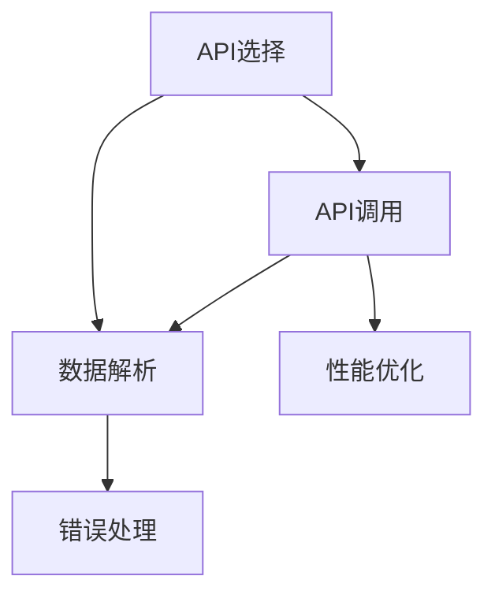

                 

# 工具：调用外部 API 获取额外信息

## 1. 背景介绍

### 1.1 问题由来

在软件开发中，我们常常需要获取一些外部信息，以便更好地完成任务。例如，获取天气信息、股票行情、地理位置、用户画像等。这些信息往往来自于第三方API，因此如何高效、可靠地调用这些API，成为了一个值得探讨的话题。

### 1.2 问题核心关键点

对于软件开发人员而言，调用外部API的过程涉及以下几个关键点：

1. **API的选择**：选择合适的API服务，满足业务需求。
2. **API的调用方式**：通过合适的协议进行数据传输。
3. **数据解析与处理**：对API返回的数据进行解析，并按需处理。
4. **错误处理与异常管理**：确保API调用的稳定性，避免因API问题影响业务。
5. **性能优化**：在保证质量的前提下，提升API调用的效率。

这些核心关键点贯穿于API调用的始终，对于确保API调用的高效性和可靠性至关重要。

## 2. 核心概念与联系

### 2.1 核心概念概述

为更好地理解如何调用外部API获取额外信息，本节将介绍几个密切相关的核心概念：

- **API (Application Programming Interface)**：一组定义明确的函数、方法、协议等，用于应用程序之间的通信和数据交换。API可以分为Web API、桌面API、移动API等，而Web API是本节讨论的重点。
- **RESTful API**：一种基于HTTP协议的API设计风格，强调资源的标识、操作和状态，具有轻量、简单、可扩展等特点。
- **HTTP请求与响应**：API调用的基本协议，通过HTTP协议进行数据的传输。常用的HTTP请求方法有GET、POST、PUT、DELETE等。
- **JSON (JavaScript Object Notation)**：一种轻量级的数据交换格式，常用于Web API的数据传输。
- **SDK (Software Development Kit)**：一种开发工具包，用于简化API的调用，并提供了必要的文档和示例代码。
- **HTTP库与框架**：用于简化HTTP请求和响应的处理，常用的有Requests、Axios等。
- **异常处理与错误码管理**：在API调用过程中，处理可能出现的异常情况，确保程序的健壮性。

这些核心概念之间的逻辑关系可以通过以下Mermaid流程图来展示：



这个流程图展示了一轮API调用过程的核心步骤：

1. 首先选择适合的API。
2. 使用HTTP请求方法调用API。
3. 解析API返回的JSON数据。
4. 处理API调用过程中可能出现的错误。
5. 进行性能优化，确保API调用的效率。

## 3. 核心算法原理 & 具体操作步骤
### 3.1 算法原理概述

调用外部API获取额外信息的核心算法原理基于HTTP协议。以下是对这一过程的详细解释：

1. **API选择**：根据业务需求，选择合适的API服务，并获取其官方文档。
2. **HTTP请求构建**：根据API文档，使用HTTP请求方法（如GET、POST）和URL构造HTTP请求。
3. **数据传输与接收**：通过HTTP协议发送HTTP请求，接收API返回的JSON响应。
4. **数据解析与处理**：解析JSON响应数据，提取出所需信息，并进行后续处理。
5. **错误处理与异常管理**：处理API调用过程中出现的异常情况，确保程序的稳定性。

### 3.2 算法步骤详解

以下是对API调用过程中各个步骤的详细介绍：

**Step 1: API选择与配置**

- 根据业务需求，选择合适的API服务，并获取其官方文档。
- 在文档中查找API的URL、请求方法、请求参数、返回数据格式等信息。
- 配置API服务的开发环境，包括API密钥、请求头、请求体等。

**Step 2: HTTP请求构造**

- 根据API文档构造HTTP请求。
- 设置请求方法、URL、请求头、请求体等信息。
- 对请求体进行编码，确保数据的正确传输。

**Step 3: HTTP请求发送**

- 使用HTTP库（如Requests、Axios等）发送HTTP请求。
- 发送HTTP请求并获取响应结果。

**Step 4: 数据解析与处理**

- 解析API返回的JSON数据。
- 根据业务需求，提取所需信息。
- 对数据进行处理，生成适合业务逻辑的输出。

**Step 5: 错误处理与异常管理**

- 处理API调用过程中可能出现的异常情况，如超时、网络错误、请求失败等。
- 对异常情况进行日志记录，并给出友好的提示信息。
- 对于重试机制，设置合理的重试次数和时间间隔。

### 3.3 算法优缺点

调用外部API获取额外信息的方法具有以下优点：

1. **灵活性高**：API调用方式灵活，可以根据业务需求灵活配置。
2. **数据丰富**：API返回的数据通常包含丰富的信息，能够满足多种业务场景。
3. **易于扩展**：API调用方式易于扩展，可以方便地集成到现有系统中。

同时，该方法也存在一些局限性：

1. **依赖网络**：API调用依赖网络环境，网络中断可能导致API调用失败。
2. **数据隐私**：API调用涉及敏感数据传输，需要确保数据传输的安全性。
3. **延迟问题**：API调用可能存在延迟，影响系统的响应速度。
4. **API变更风险**：API可能随时更新，需要对API变更进行及时跟进。

尽管存在这些局限性，但调用外部API仍是获取额外信息的主要手段之一，特别是在数据丰富的业务场景中。未来相关研究将进一步优化API调用方式，提高其效率和可靠性。

### 3.4 算法应用领域

调用外部API获取额外信息的方法广泛应用于以下几个领域：

- **Web开发**：用于构建各种类型的Web应用，如电商平台、社交网络、在线教育等。
- **移动应用**：用于提供丰富的功能和服务，如地图导航、天气预报、新闻资讯等。
- **物联网**：用于收集和传输各种传感器数据，如智能家居、健康监测等。
- **大数据分析**：用于获取各种结构化和非结构化数据，进行数据挖掘和分析。
- **API开发平台**：用于构建第三方API服务，为开发者提供便捷的API调用方式。

这些领域中的API调用方式多样，但基本遵循相同的原理和步骤，只是具体的实现细节有所不同。

## 4. 数学模型和公式 & 详细讲解 & 举例说明

### 4.1 数学模型构建

本节将使用数学语言对调用外部API获取额外信息的过程进行更加严格的刻画。

假设API返回的数据格式为JSON格式，API返回的数据为 $D$。API返回的数据可以表示为：

$$
D = \{ k_1 : v_1, k_2 : v_2, \dots, k_n : v_n \}
$$

其中 $k_i$ 为字段名，$v_i$ 为字段值。

### 4.2 公式推导过程

假设API返回的JSON数据为：

```json
{
    "name": "张三",
    "age": 30,
    "email": "zhangsan@example.com"
}
```

解析该数据的过程如下：

1. 将JSON数据解析为Python字典对象：

   ```python
   import json
   import requests

   url = "https://example.com/api/user"
   headers = {
       "Authorization": "Bearer your_token",
       "Content-Type": "application/json"
   }
   response = requests.get(url, headers=headers)
   data = response.json()

   name = data["name"]
   age = data["age"]
   email = data["email"]
   ```

2. 根据业务需求，提取所需信息：

   ```python
   if age > 25:
       print(f"{name} 年龄超过 25 岁")
   else:
       print(f"{name} 年龄低于 25 岁")
   ```

### 4.3 案例分析与讲解

以下是一个具体的API调用案例：

假设我们要获取某个天气API的温度信息，API返回的数据格式为：

```json
{
    "city": "北京",
    "temp": 25,
    "humidity": 70,
    "wind_speed": 3
}
```

解析该数据的过程如下：

1. 使用HTTP库发送API请求：

   ```python
   import requests

   url = "https://weatherapi.com/api/v1/current"
   headers = {
       "Authorization": "Bearer your_token"
   }
   response = requests.get(url, headers=headers)

   data = response.json()
   city = data["city"]
   temp = data["temp"]
   ```

2. 解析并处理API返回的数据：

   ```python
   if temp > 30:
       print(f"{city} 气温超过 30°C")
   else:
       print(f"{city} 气温低于 30°C")
   ```

## 5. 项目实践：代码实例和详细解释说明
### 5.1 开发环境搭建

在进行API调用实践前，我们需要准备好开发环境。以下是使用Python进行API调用的环境配置流程：

1. 安装Anaconda：从官网下载并安装Anaconda，用于创建独立的Python环境。

2. 创建并激活虚拟环境：
```bash
conda create -n api-env python=3.8 
conda activate api-env
```

3. 安装相关库：
```bash
pip install requests
```

完成上述步骤后，即可在`api-env`环境中开始API调用实践。

### 5.2 源代码详细实现

下面以天气API调用为例，给出使用Requests库进行API调用的PyTorch代码实现。

```python
import requests
import json

url = "https://weatherapi.com/api/v1/current"
headers = {
    "Authorization": "Bearer your_token"
}

response = requests.get(url, headers=headers)

data = response.json()
city = data["city"]
temp = data["temp"]

if temp > 30:
    print(f"{city} 气温超过 30°C")
else:
    print(f"{city} 气温低于 30°C")
```

可以看到，使用Requests库进行API调用的代码实现相对简洁高效。开发者可以将更多精力放在API选择和数据处理等高层逻辑上，而不必过多关注底层的实现细节。

### 5.3 代码解读与分析

让我们再详细解读一下关键代码的实现细节：

**API选择与配置**：
- `url`：API的URL地址。
- `headers`：请求头信息，包括API密钥等。

**HTTP请求发送**：
- `requests.get(url, headers=headers)`：发送GET请求，并获取响应结果。

**数据解析与处理**：
- `response.json()`：将API返回的JSON数据解析为Python字典对象。
- `data["city"]`：从字典对象中提取所需字段信息。
- `if-else`语句：根据业务需求，处理提取到的信息。

通过上述代码，我们可以看到，调用外部API获取额外信息的实现相对简单，只需要通过HTTP库进行数据传输和处理。

## 6. 实际应用场景
### 6.1 天气预报

天气API是API调用的一个经典案例。在开发天气预报应用时，常常需要实时获取用户的当前天气信息，以便提供准确的数据。

在技术实现上，可以集成天气API，对用户的当前位置进行天气查询。具体而言，API返回的JSON数据中包含当前温度、湿度、风速等信息，可以用于生成天气预警、健康建议等。通过天气API，我们可以在用户出行、体育运动、户外活动等方面提供更具针对性的建议。

### 6.2 金融行情

金融API是另一个常用的API调用场景。在开发股票行情应用时，常常需要实时获取股票的最新行情信息，以便提供实时的股票分析和投资建议。

在技术实现上，可以集成金融API，获取股票的实时行情、历史数据、技术指标等信息。具体而言，API返回的JSON数据中包含股票代码、当前股价、涨跌幅、交易量等信息，可以用于生成股票图表、推荐算法、智能投资系统等。通过金融API，我们可以在股票市场中获得更全面的信息，为用户提供更智能的投资决策。

### 6.3 地理位置

地理位置API在地图、导航、旅游等应用中非常常见。在开发地图导航应用时，常常需要获取用户的当前位置信息，以便提供实时的路线规划和导航建议。

在技术实现上，可以集成地理位置API，获取用户的GPS坐标、IP地址等信息。具体而言，API返回的JSON数据中包含经纬度、国家、城市等信息，可以用于生成地图、推荐景点、提供本地服务等。通过地理位置API，我们可以为用户提供更精准的地理位置服务，提升用户体验。

### 6.4 未来应用展望

随着API技术的不断发展，基于API调用的应用场景也将更加丰富。以下是对未来应用场景的一些展望：

1. **智能家居**：通过API获取家中的各种传感器数据，实现智能控制和自动化管理。
2. **健康监测**：通过API获取各种健康数据，实现健康分析和个性化推荐。
3. **智慧城市**：通过API获取城市各种数据，实现智慧交通、智慧安防、智慧环保等。
4. **供应链管理**：通过API获取供应链各环节数据，实现智能调度、库存管理、物流跟踪等。
5. **金融风控**：通过API获取金融数据，实现风险评估、欺诈检测、信用评分等。

这些应用场景涉及的数据量庞大、种类繁多，API调用技术将发挥更大的作用。未来API调用技术也将更加智能化、自动化，更好地服务于各种业务需求。

## 7. 工具和资源推荐
### 7.1 学习资源推荐

为了帮助开发者系统掌握API调用的理论基础和实践技巧，这里推荐一些优质的学习资源：

1. **《API设计》书籍**：由知名API专家撰写，系统介绍了API设计的各个方面，包括API设计原则、API安全、API治理等。
2. **RESTful API设计指南**：权威的RESTful API设计文档，详细介绍了RESTful API的设计规范和最佳实践。
3. **API Gateway**：介绍了API网关的概念、实现方式和应用场景，帮助开发者构建高效、安全的API中台。
4. **API接口开发**：深入浅出地介绍了API接口的开发技术，包括RESTful API、WebSocket API等。
5. **API安全**：介绍了API安全的各种技术手段，包括OAuth2、API密钥、API限流等。

通过对这些资源的学习实践，相信你一定能够快速掌握API调用的精髓，并用于解决实际的业务问题。
###  7.2 开发工具推荐

高效的API调用离不开优秀的工具支持。以下是几款用于API调用的常用工具：

1. **Postman**：一款流行的API测试工具，支持HTTP请求、响应数据的可视化展示，方便API调用和测试。
2. **Swagger**：一个API文档管理工具，支持API文档的自动生成、版本控制、测试等功能。
3. **Apiary**：一个API开发平台，提供API设计和测试环境，方便API的开发和部署。
4. **RestClient**：一个简单易用的RESTful API客户端，支持多种请求方法和数据格式。
5. **Axios**：一个基于Promise的HTTP库，支持浏览器和Node.js环境，方便API的调用和管理。

合理利用这些工具，可以显著提升API调用的开发效率，加快创新迭代的步伐。

### 7.3 相关论文推荐

API调用技术的发展源于学界的持续研究。以下是几篇奠基性的相关论文，推荐阅读：

1. **《RESTful Web Services》**：提出了RESTful API的设计原则和架构模式，成为RESTful API设计的经典之作。
2. **《RESTful APIs: An Introduction》**：介绍了RESTful API的核心概念和设计方法，帮助开发者构建高效、易维护的API。
3. **《API Design Guide》**：详细介绍了API设计的各个方面，包括API设计规范、API安全、API文档等。
4. **《API Gateway Design Patterns》**：介绍了API网关的设计模式和实现方法，帮助开发者构建高效、可扩展的API中台。

这些论文代表了API调用技术的发展脉络。通过学习这些前沿成果，可以帮助研究者把握学科前进方向，激发更多的创新灵感。

## 8. 总结：未来发展趋势与挑战
### 8.1 总结

本文对调用外部API获取额外信息的原理和实践进行了全面系统的介绍。首先阐述了API调用的背景和重要性，明确了API调用在业务开发中的关键作用。其次，从原理到实践，详细讲解了API调用的数学模型和操作步骤，给出了API调用任务开发的完整代码实例。同时，本文还广泛探讨了API调用在各个行业领域的应用前景，展示了API调用的巨大潜力。此外，本文精选了API调用的各类学习资源，力求为读者提供全方位的技术指引。

通过本文的系统梳理，可以看到，API调用技术在软件开发中具有重要地位，能够极大地提升系统的功能和性能。API调用技术的发展源于学界的持续研究，未来必将在更多领域得到应用，为软件开发带来新的突破。

### 8.2 未来发展趋势

展望未来，API调用技术将呈现以下几个发展趋势：

1. **API标准化**：API标准化的程度将不断提高，API设计更加规范化、易用化。
2. **API自动化**：API调用的自动化程度将不断提高，API测试、管理、监控等将实现自动化。
3. **API集成**：API集成的方式将更加灵活，API中台、微服务架构等将广泛应用。
4. **API安全**：API安全技术将不断进步，API防篡改、防劫持、防泄露等措施将更加完善。
5. **API优化**：API调用的优化技术将更加高效，如缓存机制、负载均衡、限流等将广泛应用。
6. **API创新**：API创新技术将不断涌现，如API聚合、API虚拟化、API增强等将为API调用带来新的突破。

这些趋势凸显了API调用技术的广阔前景。这些方向的探索发展，必将进一步提升API调用的效率和可靠性，为软件系统的稳定运行提供保障。

### 8.3 面临的挑战

尽管API调用技术已经取得了显著进展，但在迈向更加智能化、普适化应用的过程中，仍面临诸多挑战：

1. **API安全性**：API调用涉及敏感数据传输，如何确保数据传输的安全性，防止API被篡改、劫持，是API调用中的重要问题。
2. **API可靠性**：API调用的稳定性和可靠性，受到网络环境、API服务器的状态等因素的影响，如何提高API调用的稳定性和可靠性，是API调用的关键挑战。
3. **API性能**：API调用的性能问题，如延迟、带宽限制等，会影响系统的响应速度和用户体验。
4. **API兼容性**：不同API的兼容性问题，如API版本升级、API兼容性检测等，会增加API调用的复杂性。
5. **API文档管理**：API文档的复杂性和多样性，增加了API调用的难度，如何高效管理API文档，是API调用的重要挑战。
6. **API成本**：API调用涉及网络资源和服务器资源，如何降低API调用的成本，是API调用中的重要问题。

正视API调用面临的这些挑战，积极应对并寻求突破，将是大规模API调用技术走向成熟的必由之路。相信随着学界和产业界的共同努力，这些挑战终将一一被克服，API调用技术必将在构建人机协同的智能系统中共享智慧。

### 8.4 研究展望

面对API调用技术面临的挑战，未来的研究需要在以下几个方面寻求新的突破：

1. **API安全技术**：研究更高效的API安全机制，如OAuth2、API密钥、API限流等，确保API调用的安全性。
2. **API优化技术**：开发更高效的API优化方法，如缓存机制、负载均衡、限流等，提升API调用的性能。
3. **API自动化技术**：探索API调用的自动化技术，如API测试、API管理、API监控等，提升API调用的效率。
4. **API文档管理技术**：研究API文档的自动生成和管理技术，提升API调用的易用性。
5. **API集成技术**：研究API集成的多种方式，如API中台、微服务架构等，提升API调用的灵活性。
6. **API创新技术**：研究API创新的新方向，如API聚合、API虚拟化、API增强等，提升API调用的智能化水平。

这些研究方向的探索，必将引领API调用技术迈向更高的台阶，为构建安全、可靠、可扩展的API调用系统铺平道路。面向未来，API调用技术还需要与其他人工智能技术进行更深入的融合，如机器学习、深度学习等，多路径协同发力，共同推动API调用的进步。只有勇于创新、敢于突破，才能不断拓展API调用的边界，让API调用技术更好地服务于人类社会。

## 9. 附录：常见问题与解答

**Q1：API调用是否只适用于网络应用？**

A: API调用不仅适用于网络应用，也可以用于离线应用。例如，在移动应用中，可以缓存API返回的数据，在离线状态下使用。但需要注意的是，API调用的网络依赖性仍然存在，需要在离线状态下进行必要的检查和处理。

**Q2：API调用是否只适用于Web应用？**

A: API调用不仅适用于Web应用，也可以用于桌面应用和移动应用。通过将API封装成库或框架，可以方便地集成到不同的应用中。

**Q3：API调用是否只适用于HTTP协议？**

A: 虽然HTTP协议是目前最常用的API协议，但API调用也可以基于其他协议，如WebSocket、AMQP等。选择合适的协议需要根据具体的业务需求和技术架构进行决定。

**Q4：API调用是否只适用于Web服务？**

A: API调用不仅适用于Web服务，也可以用于本地服务和单机应用。通过将API封装成库或框架，可以方便地集成到不同的应用中。

**Q5：API调用是否只适用于JavaScript应用？**

A: 虽然API调用在Web开发中非常常见，但也可以用于其他编程语言的应用中。通过将API封装成库或框架，可以方便地集成到不同的应用中。

通过这些问题的解答，可以看出API调用的适用范围非常广泛，几乎可以应用于所有的应用场景。开发者可以根据具体的业务需求和技术架构，选择适合的API调用方式，并结合其他技术手段，实现高效、可靠的API调用。

---

作者：禅与计算机程序设计艺术 / Zen and the Art of Computer Programming

