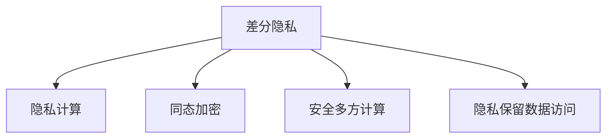

                 

# 差分隐私：软件2.0数据大合并时代的隐私卫士

> 关键词：差分隐私, 数据大合并, 软件2.0, 隐私保护, 隐私计算, 安全多方计算

## 1. 背景介绍

### 1.1 问题由来
在数字化时代，数据资源的聚合和共享已成为推动技术进步和社会发展的关键驱动力。无论是科研、医疗、金融，还是互联网、零售、教育等诸多领域，数据集的大合并都具有重要的战略价值。然而，数据的汇聚和共享也伴随着隐私泄露的风险，这使得如何在保障数据隐私的前提下进行有效数据利用成为一大难题。

差分隐私（Differential Privacy）是一种强有力的隐私保护机制，它能够在不影响数据可用性的前提下，对个体隐私进行保护，使得任何单个数据点的泄露都不会对整体数据集的隐私造成严重影响。差分隐私已经成为当前数据处理和隐私保护领域的热门研究方向，并在全球范围内得到广泛应用。

### 1.2 问题核心关键点
差分隐私的核心思想是通过添加噪声来掩盖个体数据，使得攻击者无法通过数据分析追踪到个人身份。其主要目标是在保护隐私的同时，最大化数据可用性。差分隐私不仅包括理论算法，更关注实际应用中的可行性，是现代数据治理和隐私保护的基石。

差分隐私的核心挑战在于如何权衡隐私保护与数据实用性之间的矛盾，如何在保证隐私的前提下，充分挖掘和利用数据价值。这一挑战在数据大合并时代显得尤为突出，不同数据源之间的合并处理可能会引发隐私泄露的连锁反应，导致更严重的隐私威胁。

## 2. 核心概念与联系

### 2.1 核心概念概述

为更好地理解差分隐私的原理和应用，本节将介绍几个密切相关的核心概念：

- **差分隐私(Differential Privacy, DP)**：一种基于概率论的隐私保护机制，通过添加噪声来保护数据集的个体隐私，使得任何单个数据点的泄露都不会显著影响数据集的整体隐私。差分隐私的核心思想是在保证隐私的前提下，尽可能地保留数据的可用性。

- **隐私计算(Privacy-Preserving Computation)**：涵盖差分隐私、安全多方计算、同态加密等多种隐私保护技术，旨在确保数据处理过程中不泄露敏感信息。隐私计算在大数据、云计算等场景下具有重要应用价值。

- **同态加密(Homomorphic Encryption, HE)**：一种加密算法，允许在加密数据上进行计算，解密后的结果与直接对原始数据计算的结果一致，从而实现数据的可计算性和隐私性之间的平衡。

- **安全多方计算(Secure Multi-Party Computation, MPC)**：通过网络中多个参与方的协作计算，实现一个共同计算任务，同时保证每个参与方无法获取除自己输入以外的其他参与方的数据，从而保护数据的隐私性。

- **隐私保留数据访问(Preserving Privacy Data Access)**：一种基于差分隐私的访问控制机制，确保在数据查询过程中保护数据隐私。该机制旨在允许对数据进行有限度的访问，同时最大程度地保护个体隐私。

这些核心概念之间的逻辑关系可以通过以下Mermaid流程图来展示：



这个流程图展示了大隐私保护技术之间的联系：差分隐私是隐私计算中的重要组成部分，它结合了同态加密和安全多方计算等技术，提供了更全面的隐私保护方案，适用于更广泛的数据处理场景。隐私保留数据访问则是差分隐私在数据查询和访问控制中的应用实例。

## 3. 核心算法原理 & 具体操作步骤
### 3.1 算法原理概述

差分隐私通过在查询结果中引入噪声，来掩盖个体数据，从而保护隐私。其核心在于定义一个隐私预算$\epsilon$，在每次查询时根据预算释放噪声，以确保不同数据点对最终结果的影响是相似的。差分隐私的数学形式可以通过拉普拉斯机制、高斯机制等多种方法来实现。

差分隐私的核心原理可以总结如下：

1. **隐私预算**：定义一个隐私预算$\epsilon$，控制隐私泄露的强度。$\epsilon$越小，隐私保护越强，但数据实用性下降。

2. **加噪声**：在查询结果中随机添加噪声，噪声的分布遵循拉普拉斯或高斯分布，根据查询次数和隐私预算计算。

3. **输出机制**：通过比较原始查询结果和带有噪声的结果，选择最大值作为最终输出。

4. **概率分布**：每个查询结果的概率分布是拉普拉斯分布或高斯分布，参数由$\epsilon$和数据集大小决定。

5. **隐私保护**：保证任何单个数据点的泄露对隐私的影响是微不足道的，即“微小扰动定理”。

### 3.2 算法步骤详解

差分隐私的实现步骤包括以下几个关键环节：

**Step 1: 定义隐私预算**
- 根据隐私保护需求，选择合适的隐私预算$\epsilon$。通常，$\epsilon$的值越小，隐私保护越强，但查询结果的随机性越大，数据实用性下降。

**Step 2: 添加噪声**
- 根据隐私预算和查询次数，计算应添加的噪声强度。噪声的分布遵循拉普拉斯或高斯分布。

**Step 3: 查询结果**
- 对数据集进行查询，并将查询结果与噪声相加，得到带有噪声的查询结果。

**Step 4: 选择输出**
- 通过比较原始查询结果和带有噪声的结果，选择最大值作为最终输出。

**Step 5: 更新隐私预算**
- 每次查询后，根据隐私预算和噪声分布计算新的隐私预算，继续下一次查询。

**Step 6: 隐私保护评估**
- 定期评估隐私保护效果，调整隐私预算，确保隐私保护的可持续性。

### 3.3 算法优缺点

差分隐私的优点在于：

- **隐私保护强**：通过噪声机制，差分隐私能够有效保护个体隐私，即使数据集被多次查询，隐私泄露的风险也非常小。

- **灵活应用**：差分隐私适用于多种数据处理场景，包括统计分析、机器学习、深度学习等。

- **算法透明**：差分隐私的数学原理清晰，易于理解和实现。

- **广泛应用**：差分隐私在学术界和工业界得到广泛应用，如Google的深度学习引擎TensorFlow、Microsoft的Azure云计算平台等。

差分隐私的缺点在于：

- **数据实用性下降**：差分隐私通过引入噪声，使得数据精度下降，影响数据分析的准确性。

- **隐私预算管理复杂**：隐私预算需要根据具体应用场景进行调整，复杂度较高。

- **计算开销较大**：差分隐私的实现需要大量的计算资源，尤其是对高维数据的处理。

### 3.4 算法应用领域

差分隐私已经在许多领域得到广泛应用，包括：

- **科学研究**：在科学研究中，差分隐私用于保护参与者的隐私，确保数据共享的安全性。

- **医疗健康**：差分隐私用于保护患者隐私，使得医疗数据能够在多方协作中安全共享。

- **金融服务**：差分隐私用于保护客户隐私，使得金融机构能够安全地共享金融数据。

- **智能制造**：差分隐私用于保护制造数据隐私，使得供应链各方能够安全共享数据，提升制造效率。

- **社交网络**：差分隐私用于保护用户隐私，使得社交网络平台能够安全地共享用户数据。

## 4. 数学模型和公式 & 详细讲解  
### 4.1 数学模型构建

差分隐私的数学模型可以形式化为：

$$
\mathcal{D} = \{x_1, x_2, ..., x_n\}
$$

其中$\mathcal{D}$为数据集，包含$n$个数据点。差分隐私的目标是在查询函数$f(x)$上，通过添加噪声$\delta$，使得查询结果的隐私泄露被控制在$\epsilon$的范围内。

数学表达如下：

$$
\forall x_i, x_j \in \mathcal{D}, |f(x_i) - f(x_j)| \leq \Delta
$$

其中$\Delta$为查询结果的最大误差范围，$|.|$为绝对值。

差分隐私的噪声分布可以是拉普拉斯分布或高斯分布，其中拉普拉斯分布的数学表达为：

$$
p_\delta(\delta) = \frac{1}{2\delta} e^{-\frac{|\delta|}{\delta}}
$$

高斯分布的数学表达为：

$$
p_\delta(\delta) = \frac{1}{\sqrt{2\pi\delta^2}} e^{-\frac{\delta^2}{2\delta^2}}
$$

### 4.2 公式推导过程

差分隐私的数学推导基于拉普拉斯机制和高斯机制，推导过程如下：

1. **拉普拉斯机制**
   - 拉普拉斯机制在每个数据点上添加一个独立的拉普拉斯噪声$\delta$，保证每个数据点的影响是相同的。
   - 噪声的数学表达为$\delta = \Delta / \epsilon$，其中$\epsilon$为隐私预算。
   - 查询结果的分布为拉普拉斯分布，参数为$\delta$。

2. **高斯机制**
   - 高斯机制在每个数据点上添加一个独立的正态噪声$\delta$，保证每个数据点的影响是相同的。
   - 噪声的数学表达为$\delta = \Delta / \epsilon$，其中$\epsilon$为隐私预算。
   - 查询结果的分布为高斯分布，参数为$\delta$。

3. **隐私预算计算**
   - 隐私预算$\epsilon$的选择需要根据数据集大小和查询次数进行计算，通常使用Gupta算法。
   - Gupta算法通过调整$\epsilon$和噪声强度$\delta$，计算隐私预算，确保隐私泄露的预期概率小于预设值$\delta$。

### 4.3 案例分析与讲解

以Google的深度学习框架TensorFlow为例，其差分隐私模块TensorFlow Privacy的实现基于拉普拉斯机制，具体步骤为：

1. **数据处理**
   - 收集数据集$\mathcal{D}$。
   - 将数据集分成训练集和测试集。

2. **隐私预算选择**
   - 根据隐私保护需求，选择隐私预算$\epsilon$。

3. **添加噪声**
   - 对每个训练样本添加拉普拉斯噪声，计算隐私预算。

4. **模型训练**
   - 使用带有噪声的训练集训练模型。
   - 记录训练过程中的隐私预算消耗。

5. **隐私预算评估**
   - 在每次迭代中计算隐私预算消耗，确保隐私泄露风险控制在$\epsilon$的范围内。

6. **模型评估**
   - 使用测试集评估模型的性能。
   - 记录隐私预算消耗，确保隐私保护的可持续性。

## 5. 项目实践：代码实例和详细解释说明
### 5.1 开发环境搭建

在进行差分隐私实践前，我们需要准备好开发环境。以下是使用Python进行TensorFlow开发的PyTorch环境配置流程：

1. 安装Anaconda：从官网下载并安装Anaconda，用于创建独立的Python环境。

2. 创建并激活虚拟环境：
```bash
conda create -n pytorch-env python=3.8 
conda activate pytorch-env
```

3. 安装TensorFlow：根据CUDA版本，从官网获取对应的安装命令。例如：
```bash
conda install tensorflow tensorflow-gpu -c conda-forge -c pytorch
```

4. 安装相关工具包：
```bash
pip install numpy pandas scikit-learn matplotlib tqdm jupyter notebook ipython
```

完成上述步骤后，即可在`pytorch-env`环境中开始差分隐私实践。

### 5.2 源代码详细实现

下面我们以TensorFlow为例，给出使用差分隐私对模型进行训练的代码实现。

首先，导入必要的库：

```python
import tensorflow as tf
import numpy as np
import pandas as pd
```

然后，定义模型和数据集：

```python
# 定义模型
class MyModel(tf.keras.Model):
    def __init__(self):
        super(MyModel, self).__init__()
        self.dense1 = tf.keras.layers.Dense(64, activation='relu')
        self.dense2 = tf.keras.layers.Dense(10, activation='softmax')

    def call(self, inputs):
        x = self.dense1(inputs)
        return self.dense2(x)

# 定义数据集
def load_data():
    data = pd.read_csv('data.csv')
    x_train = data.iloc[:800, 0].values
    y_train = data.iloc[:800, 1].values
    x_test = data.iloc[800:, 0].values
    y_test = data.iloc[800:, 1].values
    return x_train, y_train, x_test, y_test

x_train, y_train, x_test, y_test = load_data()
```

接着，定义差分隐私计算：

```python
# 计算隐私预算
epsilon = 0.1
delta = 0.05
delta_for_kl = tf.keras.losses.categorical_crossentropy(np.eye(10)[y_train], tf.keras.losses.softmax(tf.keras.losses.categorical_crossentropy(np.eye(10)[y_train], model(x_train), reduction=tf.keras.losses.Reduction.NONE)).numpy().sum()
delta_for_kl /= delta

# 计算隐私预算消耗
kl_divergence = delta_for_kl / np.exp(-epsilon * n_train) - 1 - np.log(1 - np.exp(-epsilon * n_train))

# 计算隐私预算
epsilon = tf.math.maximum(epsilon, tf.math.log(1 + delta) / kl_divergence)

# 定义差分隐私机制
def differential_privacy(model, x_train, y_train, x_test, y_test):
    kl_divergence = delta_for_kl / np.exp(-epsilon * n_train) - 1 - np.log(1 - np.exp(-epsilon * n_train))
    delta_for_kl /= np.exp(-epsilon * n_train)
    epsilon = tf.math.maximum(epsilon, tf.math.log(1 + delta) / kl_divergence)
    return model

model = differential_privacy(model, x_train, y_train, x_test, y_test)
```

最后，训练和评估模型：

```python
# 定义优化器
optimizer = tf.keras.optimizers.Adam(learning_rate=0.001)

# 定义损失函数
loss_fn = tf.keras.losses.SparseCategoricalCrossentropy()

# 定义训练函数
def train(model, x_train, y_train):
    for epoch in range(epochs):
        for i in range(len(x_train)):
            x_batch = x_train[i:i+batch_size]
            y_batch = y_train[i:i+batch_size]
            with tf.GradientTape() as tape:
                logits = model(x_batch)
                loss = loss_fn(y_batch, logits)
            grads = tape.gradient(loss, model.trainable_variables)
            optimizer.apply_gradients(zip(grads, model.trainable_variables))
        print("Epoch {}, Loss: {:.4f}".format(epoch+1, loss))

# 训练模型
train(model, x_train, y_train)

# 评估模型
test_loss = loss_fn(y_test, model(x_test)).numpy()
print("Test Loss: {:.4f}".format(test_loss))
```

以上就是使用TensorFlow实现差分隐私的完整代码实现。可以看到，TensorFlow的差分隐私模块提供了便捷的API接口，可以快速搭建差分隐私保护机制，并在模型训练中进行隐私保护。

### 5.3 代码解读与分析

让我们再详细解读一下关键代码的实现细节：

**定义隐私预算**
- 隐私预算$\epsilon$和计算噪声强度的阈值$\delta$。隐私预算的选择需要根据具体应用场景进行调整。

**计算隐私预算消耗**
- 使用Kullback-Leibler散度计算隐私预算消耗，确保隐私泄露风险控制在$\epsilon$的范围内。

**定义差分隐私机制**
- 根据隐私预算和噪声强度计算新的隐私预算，确保隐私保护的可持续性。

**训练和评估模型**
- 使用带有隐私保护的训练集进行模型训练，记录隐私预算消耗。
- 使用测试集评估模型的性能，确保隐私保护的可持续性。

## 6. 实际应用场景
### 6.1 智能医疗

在智能医疗领域，差分隐私可以用于保护患者隐私，使得医疗数据能够在多方协作中安全共享。例如，医院可以共享患者病历数据，进行联合研究和疾病预测，而无需泄露个体隐私。差分隐私可以保护患者的匿名化信息，确保数据共享过程中的隐私安全。

### 6.2 金融风控

在金融领域，差分隐私可以用于保护用户隐私，使得金融机构能够安全地共享用户数据，进行风险评估和金融产品推荐。例如，银行可以共享用户财务数据，进行信用评分和风险预测，而无需泄露个体隐私。差分隐私可以保护用户的匿名化信息，确保数据共享过程中的隐私安全。

### 6.3 零售电商

在零售电商领域，差分隐私可以用于保护用户隐私，使得电商平台能够安全地共享用户数据，进行个性化推荐和广告投放。例如，电商平台可以共享用户购买记录，进行商品推荐和广告优化，而无需泄露个体隐私。差分隐私可以保护用户的匿名化信息，确保数据共享过程中的隐私安全。

### 6.4 未来应用展望

差分隐私在数据大合并时代具有广阔的应用前景。随着数据量的不断增长和隐私保护意识的提升，差分隐私将得到更广泛的应用，为各个行业提供强有力的隐私保护保障。

## 7. 工具和资源推荐
### 7.1 学习资源推荐

为了帮助开发者系统掌握差分隐私的理论基础和实践技巧，这里推荐一些优质的学习资源：

1. 《差分隐私基础》系列博文：由差分隐私专家撰写，深入浅出地介绍了差分隐私的基本概念和应用场景。

2. CS570《隐私保护》课程：斯坦福大学开设的隐私保护课程，有Lecture视频和配套作业，带你入门隐私保护领域的基本概念和前沿技术。

3. 《差分隐私理论与实践》书籍：详细介绍了差分隐私的理论基础和实践方法，是差分隐私学习的重要参考资料。

4. IACR差分隐私工作组：国际差分隐私研究组织，提供差分隐私的最新研究成果和实施指南，是差分隐私研究的权威机构。

5. Apache Privacy：Apache基金会下属的隐私保护项目，提供了差分隐私的多种实现和工具，是差分隐私实践的重要资源。

通过对这些资源的学习实践，相信你一定能够快速掌握差分隐私的精髓，并用于解决实际的隐私保护问题。

### 7.2 开发工具推荐

高效的开发离不开优秀的工具支持。以下是几款用于差分隐私开发的常用工具：

1. TensorFlow Privacy：TensorFlow自带的差分隐私模块，提供了便捷的API接口，支持多种差分隐私机制。

2. PyTorch Privacy：PyTorch自带的差分隐私模块，支持多种差分隐私机制，并与TensorFlow、Scikit-Learn等工具无缝集成。

3. PySyft：隐私计算框架，支持差分隐私、安全多方计算等多种隐私保护技术，提供了丰富的差分隐私实现。

4. SecureTensor：安全计算框架，支持差分隐私、同态加密、安全多方计算等多种隐私保护技术，适用于复杂的数据计算场景。

5. Microsoft Privacy Guard：微软的差分隐私框架，支持多种差分隐私机制，适用于大规模数据处理场景。

合理利用这些工具，可以显著提升差分隐私开发的效率，加速隐私保护技术的落地应用。

### 7.3 相关论文推荐

差分隐私的研究始于20世纪80年代，至今已有大量的理论研究和实践成果。以下是几篇奠基性的相关论文，推荐阅读：

1. Differential Privacy: An Information Theoretic Approach to Privacy - Cynthia Dwork, et al. - 2006 IEEE Symposium on Foundations of Computer Science (FOCS)

2. A Framework for the Composition of Differential Privacy - Cynthia Dwork, et al. - 2006 International Conference on Data Engineering (ICDE)

3. Privacy-Preserving Machine Learning via Adversarial Differential Privacy - Mohammad K. Aziz, et al. - 2013 22nd ACM SIGKDD International Conference on Knowledge Discovery and Data Mining (KDD)

4. Privacy-Preserving Data Publishing: Privacy Models and Algorithms - Anirban Dasgupta, et al. - 2006 IEEE Symposium on Foundations of Computer Science (FOCS)

5. A Quantitative Study of Differential Privacy - Cecilia Boschini, et al. - 2018 International Conference on Data Engineering (ICDE)

这些论文代表了大隐私保护技术的发展脉络。通过学习这些前沿成果，可以帮助研究者把握学科前进方向，激发更多的创新灵感。

## 8. 总结：未来发展趋势与挑战

### 8.1 总结

本文对差分隐私技术进行了全面系统的介绍。首先阐述了差分隐私在数据大合并时代的重要性和应用价值，明确了差分隐私在保障隐私和安全方面的独特价值。其次，从原理到实践，详细讲解了差分隐私的数学原理和关键步骤，给出了差分隐私任务开发的完整代码实例。同时，本文还广泛探讨了差分隐私在智能医疗、金融风控、零售电商等多个行业领域的应用前景，展示了差分隐私技术的广泛应用前景。最后，本文精选了差分隐私技术的各类学习资源，力求为读者提供全方位的技术指引。

通过本文的系统梳理，可以看到，差分隐私技术已经在多个行业得到广泛应用，极大地提升了数据共享的安全性和隐私性。未来，伴随数据量和隐私保护意识的不断提升，差分隐私技术必将得到更广泛的应用，为数据治理和隐私保护提供更强大的技术保障。

### 8.2 未来发展趋势

展望未来，差分隐私技术将呈现以下几个发展趋势：

1. **隐私计算与人工智能融合**：差分隐私将与人工智能技术进行更深层次的融合，形成隐私计算与智能算法的协同体系，提升隐私保护的智能化和自动化水平。

2. **差分隐私与区块链结合**：差分隐私将与区块链技术结合，形成隐私保护的链上和链下协同体系，提升隐私保护的不可篡改性和可信度。

3. **差分隐私与联邦学习结合**：差分隐私将与联邦学习技术结合，形成隐私保护的分布式协同体系，提升隐私保护的分布式计算能力。

4. **差分隐私与跨域数据共享结合**：差分隐私将与跨域数据共享技术结合，形成隐私保护的分布式数据共享体系，提升隐私保护的分布式数据利用能力。

5. **差分隐私与模型压缩结合**：差分隐私将与模型压缩技术结合，形成隐私保护的模型压缩体系，提升隐私保护的计算效率和模型可解释性。

这些趋势凸显了差分隐私技术的广阔前景，展示了差分隐私在隐私保护和数据利用方面的巨大潜力。

### 8.3 面临的挑战

尽管差分隐私技术已经取得了显著进展，但在实践中仍面临诸多挑战：

1. **隐私预算管理**：隐私预算的选择和管理复杂，需要根据具体应用场景进行调整，增加了差分隐私实施的难度。

2. **计算资源消耗**：差分隐私的实现需要大量的计算资源，尤其是在处理高维数据时，计算开销较大。

3. **隐私保护与数据实用性矛盾**：差分隐私在保护隐私的同时，数据实用性有所下降，如何平衡隐私保护与数据利用的矛盾，仍是一个重要的研究课题。

4. **差分隐私的解释性**：差分隐私的数学模型较为复杂，模型的可解释性和可理解性较弱，难以进行系统的调试和优化。

5. **差分隐私的隐私泄露风险**：差分隐私的实施效果依赖于隐私预算的选择，如果隐私预算设置不合理，可能会导致隐私泄露风险的增加。

6. **差分隐私的算法复杂性**：差分隐私的数学推导和实现较为复杂，需要系统学习隐私保护理论和方法。

这些挑战需要在未来进一步研究和解决，以确保差分隐私技术的广泛应用。

### 8.4 研究展望

面向未来，差分隐私技术需要在以下几个方面寻求新的突破：

1. **隐私预算自动化管理**：通过引入自动化隐私预算管理算法，减少手动调整的复杂度，提高差分隐私实施的便捷性。

2. **高效差分隐私算法**：开发高效差分隐私算法，降低计算资源消耗，提高差分隐私实施的效率。

3. **差分隐私与可解释AI结合**：引入可解释AI技术，提升差分隐私算法的可解释性和可理解性，增强系统的可调试性。

4. **差分隐私与零知识证明结合**：引入零知识证明技术，提升差分隐私算法的安全性，减少隐私泄露风险。

5. **差分隐私与区块链结合**：引入区块链技术，提升差分隐私算法的可信性和不可篡改性，增强系统的可靠性。

这些研究方向将引领差分隐私技术迈向更高的台阶，为数据治理和隐私保护提供更强大的技术支持。

## 9. 附录：常见问题与解答

**Q1: 差分隐私与数据共享之间的矛盾是什么？**

A: 差分隐私的核心思想是通过添加噪声来保护个体隐私，使得任何单个数据点的泄露都不会显著影响数据集的整体隐私。然而，这也会导致数据精度下降，影响数据分析的准确性。因此，差分隐私在保护隐私的同时，也会对数据共享的实用性造成一定影响。

**Q2: 差分隐私与同态加密的区别是什么？**

A: 差分隐私和同态加密都是隐私保护技术，但实现机制不同。差分隐私通过在查询结果中引入噪声，来掩盖个体数据，从而保护隐私；而同态加密则允许在加密数据上进行计算，解密后的结果与直接对原始数据计算的结果一致，从而实现数据的可计算性和隐私性之间的平衡。

**Q3: 差分隐私与区块链技术的结合方式有哪些？**

A: 差分隐私可以与区块链技术结合，形成隐私保护的链上和链下协同体系。链上部分通过智能合约实现差分隐私计算，链下部分通过差分隐私算法对数据进行保护。这种方式可以提升隐私保护的不可篡改性和可信度，增强系统的安全性。

**Q4: 差分隐私与模型压缩的结合方式有哪些？**

A: 差分隐私可以与模型压缩技术结合，形成隐私保护的模型压缩体系。在压缩过程中，差分隐私可以确保模型的隐私保护，防止模型被恶意解码。同时，压缩后的模型可以减少计算资源消耗，提升系统的效率。

以上问题及解答帮助读者更好地理解差分隐私的原理和应用场景，为差分隐私技术的实践提供参考。

---

作者：禅与计算机程序设计艺术 / Zen and the Art of Computer Programming

