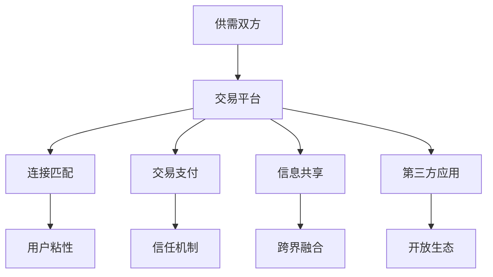

                 

## 1. 背景介绍

随着数字经济和互联网技术的迅猛发展，平台经济作为一种新型商业模式应运而生。平台经济打破了传统产业的边界，通过构建多边市场，提供综合化的服务，实现了资源的高效配置和用户需求的精准匹配。在数字化时代，平台经济已成为推动经济增长、促进就业、创新社会治理的重要力量。本文将系统介绍平台经济的原理、模式、挑战与未来趋势，并探讨其在商业创新和社会变革中的深远影响。

## 2. 核心概念与联系

### 2.1 核心概念概述

平台经济是指通过建立一个在线交易平台，连接供需双方，实现资源和服务的共享与交易，从而创造价值的一种商业模式。其核心在于通过第三方平台的高效连接和匹配能力，降低交易成本，提高市场效率，促进创新和增长。

**关键概念包括：**

- **双边市场（Two-sided Market）**：平台经济通常涉及两组或多组用户群体，通过平台提供交易、服务或信息交换，达到双赢或多赢的目的。
- **网络效应（Network Effects）**：平台的用户越多，对新用户越有吸引力，形成正反馈循环，进一步增强平台的价值。
- **跨界融合（Cross-industry Integration）**：平台经济常常跨多个行业，实现资源和服务的整合，推动跨界创新。
- **开放平台（Open Platform）**：平台通过开放API，让第三方应用和服务接入，扩大平台的生态系统。

### 2.2 核心概念原理和架构的 Mermaid 流程图



此图展示了平台经济的基本架构：平台作为连接供需双方的中介，提供连接、匹配、支付、信息共享和第三方应用接入等功能，通过网络效应和开放平台策略，不断吸引用户和第三方应用，形成生态系统。

## 3. 核心算法原理 & 具体操作步骤

### 3.1 算法原理概述

平台经济的运作核心在于通过算法和数据驱动的决策，实现对供需双方的精准匹配。其算法原理主要包括：

1. **匹配算法（Matching Algorithm）**：根据供需双方的特征（如价格、位置、偏好等）进行匹配，确保交易的效率和公平性。
2. **推荐算法（Recommendation Algorithm）**：通过分析用户行为数据，推荐个性化的产品和服务，提升用户体验。
3. **定价算法（Pricing Algorithm）**：根据市场供需动态调整价格，实现最优定价策略。
4. **风险管理算法（Risk Management Algorithm）**：通过数据分析和模型预测，防范和控制交易风险。

### 3.2 算法步骤详解

平台经济中的算法步骤一般包括以下几个关键环节：

1. **数据采集与处理**：收集平台上的交易、用户行为、市场动态等数据，进行清洗和预处理。
2. **特征提取与建模**：从数据中提取用户和产品的特征，构建预测模型或推荐模型。
3. **算法训练与优化**：通过历史数据训练算法模型，不断优化模型参数和结构。
4. **实时决策与反馈**：将算法模型应用于实时交易和决策，根据反馈结果调整模型。
5. **模型评估与迭代**：定期评估算法模型效果，进行迭代改进。

### 3.3 算法优缺点

**优点：**

- **高效率**：算法驱动的匹配和推荐提高了交易和服务的效率，减少了人工干预。
- **个性化**：通过数据分析，提供个性化的服务和推荐，提升用户体验。
- **规模效应**：平台经济基于大规模数据和用户基础，形成网络效应，不断扩大市场规模。

**缺点：**

- **隐私问题**：算法需要处理大量用户数据，可能引发隐私和数据安全问题。
- **算法偏见**：算法模型可能存在偏见，导致不公平和不合理的匹配结果。
- **复杂度增加**：随着市场复杂度的增加，算法设计和优化难度增大。

### 3.4 算法应用领域

平台经济的应用领域广泛，涵盖金融、电商、交通、教育、医疗等多个行业。以下是几个典型的应用场景：

1. **金融平台**：通过算法实现股票交易、贷款审批、保险理赔等金融服务的精准匹配和风险管理。
2. **电商平台**：通过推荐算法和搜索算法，提升商品展示和购买的效率，增强用户粘性。
3. **交通平台**：通过路径规划和调度算法，优化交通流量，提高出行效率。
4. **教育平台**：通过个性化学习推荐和智能辅导算法，提升教育质量和学习效果。
5. **医疗平台**：通过预约排班和诊疗推荐算法，提高医疗资源利用率，改善就医体验。

## 4. 数学模型和公式 & 详细讲解 & 举例说明

### 4.1 数学模型构建

以金融平台为例，构建一个基于协同过滤的推荐系统。假设平台上有 $N$ 个用户和 $M$ 个商品，用户的偏好矩阵为 $P \in \mathbb{R}^{N \times M}$，商品之间的相似度矩阵为 $S \in \mathbb{R}^{M \times M}$。

### 4.2 公式推导过程

协同过滤算法的基本思想是：根据用户对商品的历史评分，找到与目标商品最相似的商品，然后推荐给用户。假设有用户 $i$ 对商品 $j$ 的评分向量为 $R_i \in \mathbb{R}^{M}$，相似度矩阵 $S$ 的计算公式为：

$$ S_{j,k} = \frac{1}{\sqrt{\sum_{l=1}^M S_{j,l}^2}} \frac{1}{\sqrt{\sum_{l=1}^M S_{k,l}^2}} \sum_{l=1}^M S_{j,l} S_{k,l} $$

用户 $i$ 对商品 $j$ 的预测评分 $R_{i,j}$ 为：

$$ R_{i,j} = \sum_{k=1}^M S_{j,k} \frac{R_{i,k}}{\sqrt{\sum_{l=1}^M S_{k,l}^2}} $$

### 4.3 案例分析与讲解

假设一个电商平台的推荐系统，通过协同过滤算法为用户推荐商品。平台收集了用户的历史评分数据，构建了用户偏好矩阵 $P$ 和商品相似度矩阵 $S$。用户 $i$ 对商品 $j$ 的预测评分 $R_{i,j}$ 可以通过公式计算得到，并将其排序推荐给用户。

## 5. 项目实践：代码实例和详细解释说明

### 5.1 开发环境搭建

开发平台经济相关的推荐系统，需要安装以下工具和库：

1. Python 3.7及以上版本。
2. 安装 TensorFlow、PyTorch、Pandas、NumPy 等库，可以使用 Anaconda 或 pip 安装。
3. 安装 Web 框架 Flask，用于搭建推荐系统的 API 接口。

### 5.2 源代码详细实现

以一个简单的协同过滤推荐系统为例，展示其实现过程：

```python
import numpy as np
import pandas as pd
import tensorflow as tf

# 构建用户偏好矩阵 P 和商品相似度矩阵 S
P = np.random.randn(100, 20)
S = np.random.randn(20, 20)

# 计算用户对商品的预测评分 R
def collaborative_filtering(P, S, user_id):
    user_score = np.dot(S, P[user_id])
    user_score /= np.linalg.norm(S)
    user_score = user_score * np.linalg.norm(P[user_id])
    user_score /= np.linalg.norm(S)
    return user_score

# 创建用户评分数据
user_scores = np.random.randn(100, 20)
user_scores /= np.linalg.norm(user_scores, axis=1)

# 训练模型
with tf.Graph().as_default():
    user_tensor = tf.placeholder(tf.float32, shape=(20, 1))
    score_tensor = tf.matmul(S, user_tensor)
    weight_tensor = tf.placeholder(tf.float32, shape=(20, 1))
    output_tensor = tf.matmul(score_tensor, weight_tensor)
    loss_tensor = tf.reduce_mean(tf.square(output_tensor - user_scores))
    optimizer = tf.train.AdamOptimizer(learning_rate=0.01)
    train_op = optimizer.minimize(loss_tensor)

# 使用 TensorFlow 训练模型
with tf.Session() as sess:
    sess.run(tf.global_variables_initializer())
    for i in range(1000):
        if i % 100 == 0:
            print("Epoch", i)
        sess.run(train_op, feed_dict={user_tensor: P, weight_tensor: user_scores})

# 预测评分
user_id = 0
user_score = collaborative_filtering(P, S, user_id)
print("User", user_id, "predicted score:", user_score)
```

### 5.3 代码解读与分析

在上述代码中，我们首先构建了用户偏好矩阵 $P$ 和商品相似度矩阵 $S$。然后定义了一个 `collaborative_filtering` 函数，用于计算用户对商品的预测评分。接着创建了用户评分数据 `user_scores`，并使用 TensorFlow 训练模型。最后，使用训练好的模型对用户 $i$ 的预测评分进行预测。

## 6. 实际应用场景

### 6.1 智能交通平台

智能交通平台通过算法优化交通流量和路网调度，提升出行效率。例如，城市交通管理部门可以利用大数据和机器学习算法，预测道路拥堵情况，调整信号灯时序，缓解交通压力。同时，通过共享单车和共享汽车等出行方式，提升城市交通的智能化水平。

### 6.2 智能医疗平台

智能医疗平台通过算法辅助诊疗和预约排班，改善就医体验。例如，医院可以利用推荐算法推荐专家和科室，利用路径规划算法优化患者排队和诊疗流程，利用数据分析算法预测疾病流行趋势，提前采取预防措施。

### 6.3 智能教育平台

智能教育平台通过算法个性化推荐学习资源和辅导，提升学习效果。例如，在线教育平台可以利用推荐算法推荐课程和习题，利用智能辅导算法提供个性化学习建议，利用数据分析算法评估学习效果，提供学习路径优化建议。

### 6.4 未来应用展望

未来，平台经济将进一步融合人工智能、大数据、物联网等技术，推动更广泛的应用场景：

1. **智慧城市**：平台经济将推动智慧城市建设，实现城市治理的智能化和精准化，提升城市运行效率和服务质量。
2. **智能制造**：平台经济将推动智能制造发展，通过工业互联网平台实现资源的共享和协作，优化生产流程，提升产品质量。
3. **数字文化**：平台经济将推动数字文化产业发展，通过文化创意平台，促进文化产品的创作和传播，提升文化软实力。
4. **绿色经济**：平台经济将推动绿色经济发展，通过环保交易平台，促进绿色技术和产品的交易和应用，推动可持续发展。

## 7. 工具和资源推荐

### 7.1 学习资源推荐

1. **《平台经济：新时代的商业模式与社会变革》**：本书深入分析了平台经济的原理、模式和挑战，提供了丰富的案例和理论支持。
2. **《数据科学与人工智能导论》**：该书全面介绍了数据科学和人工智能的基础知识，包括机器学习、深度学习、推荐系统等。
3. **Coursera 和 edX**：这些在线学习平台提供了丰富的平台经济相关课程，涵盖算法、数据分析、商业智能等领域。
4. **Kaggle**：Kaggle 是一个数据科学竞赛平台，提供大量的数据集和竞赛任务，帮助开发者提升技能。

### 7.2 开发工具推荐

1. **TensorFlow**：谷歌开源的深度学习框架，支持分布式训练和大规模数据处理。
2. **PyTorch**：Facebook开源的深度学习框架，支持动态图和高效计算。
3. **Pandas**：Python数据分析库，支持大规模数据处理和分析。
4. **Flask**：Python Web框架，用于搭建API接口和实现Web服务。

### 7.3 相关论文推荐

1. **《平台经济：新时代的商业模式与社会变革》**：该论文系统分析了平台经济的原理和应用，提供了丰富的案例和理论支持。
2. **《智能交通平台：基于大数据和机器学习的交通管理》**：该论文探讨了智能交通平台的算法和应用，提供了实用的技术和方法。
3. **《智能医疗平台：基于算法和大数据的医疗服务创新》**：该论文介绍了智能医疗平台的技术和应用，提供了实际案例和分析。
4. **《智能教育平台：基于推荐系统的个性化学习推荐》**：该论文探讨了智能教育平台的算法和应用，提供了实用技术和方法。

## 8. 总结：未来发展趋势与挑战

### 8.1 研究成果总结

平台经济作为一种新型商业模式，在推动经济增长、促进就业、创新社会治理方面发挥了重要作用。通过算法和数据驱动的精准匹配和个性化服务，平台经济提高了资源配置效率，提升了用户体验。然而，平台经济也面临隐私、公平、安全等挑战，需要持续改进和优化。

### 8.2 未来发展趋势

未来，平台经济将继续融合人工智能、大数据、物联网等技术，推动更广泛的应用场景：

1. **智能化**：平台经济将进一步智能化，利用算法和数据驱动决策，提升效率和用户体验。
2. **定制化**：平台经济将实现定制化服务，通过数据分析和机器学习，提供更加个性化的解决方案。
3. **融合化**：平台经济将融合多产业、多领域，形成跨界协同创新。
4. **国际化**：平台经济将实现全球化布局，通过国际合作和市场拓展，提升全球竞争力。

### 8.3 面临的挑战

平台经济面临以下挑战：

1. **隐私保护**：平台经济需要保护用户隐私，防止数据泄露和滥用。
2. **公平性**：平台经济需要避免算法偏见和歧视，实现公平和透明。
3. **安全性**：平台经济需要防范网络攻击和欺诈，保障系统安全。
4. **标准化**：平台经济需要建立行业标准，促进跨平台、跨领域合作。

### 8.4 研究展望

未来，平台经济的研究需要关注以下方向：

1. **隐私保护技术**：发展隐私保护算法，如差分隐私、联邦学习等，保护用户隐私。
2. **公平性算法**：开发公平性评估和调整算法，减少算法偏见。
3. **安全防护机制**：建立安全防护机制，防范网络攻击和欺诈。
4. **跨平台标准**：制定跨平台、跨领域标准，促进合作和互操作性。

## 9. 附录：常见问题与解答

**Q1：平台经济是如何实现精准匹配的？**

A：平台经济通过算法和大数据分析，实现对用户和商品的精准匹配。算法模型根据用户和商品的特征（如位置、偏好、价格等），计算匹配概率，实现最优匹配。例如，推荐算法通过分析用户历史行为，预测用户对商品的兴趣，从而推荐个性化商品。

**Q2：平台经济中的数据隐私和安全如何保障？**

A：平台经济需要严格保护用户数据隐私和安全，防止数据泄露和滥用。常用的隐私保护技术包括差分隐私、联邦学习、加密计算等。同时，平台需要建立严格的数据安全防护机制，防范网络攻击和欺诈。

**Q3：平台经济的未来发展方向是什么？**

A：平台经济的未来发展方向包括智能化、定制化、融合化和国际化。通过算法和数据驱动决策，平台经济将实现智能化和定制化服务。同时，平台经济将融合多产业、多领域，形成跨界协同创新。最后，平台经济将实现全球化布局，通过国际合作和市场拓展，提升全球竞争力。

---

作者：禅与计算机程序设计艺术 / Zen and the Art of Computer Programming

