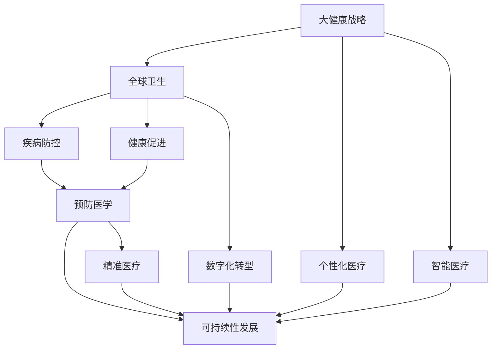

                 

# 2050年的全球卫生：从疾病防控到健康促进的大健康战略

> 关键词：大健康战略, 全球卫生, 疾病防控, 健康促进, 预防医学, 精准医疗, 可持续性发展, 数字化转型, 个性化医疗, 智能医疗, 人工智能

## 1. 背景介绍

### 1.1 问题的由来

全球卫生问题一直是世界各国政府和国际组织高度关注的重要议题。随着人类活动范围的扩大，疾病防控和健康促进的挑战日益严峻。从COVID-19疫情的全球蔓延到慢性病高发的趋势，再到心理健康问题的日益突出，现代社会的健康问题变得更加复杂多变。如何构建一套有效的、可持续的全球健康战略，以应对这些挑战，成为了摆在各国政府面前的重要课题。

### 1.2 问题核心关键点

全球卫生战略的核心在于预防、监测、应对和促进。在疾病防控方面，需要构建全球监测网络，实时掌握全球疾病传播动态；在应对方面，需要建立快速反应机制，迅速控制疫情扩散；在健康促进方面，需要推广健康生活方式，提升公众健康素养。

## 2. 核心概念与联系

### 2.1 核心概念概述

为更好地理解2050年的全球卫生战略，本节将介绍几个密切相关的核心概念：

- **大健康战略**：旨在通过预防为主、全人群覆盖、多部门协作的方式，构建健康、可持续发展的社会环境。
- **全球卫生**：包括全球疾病防控、健康监测、健康促进、卫生资源配置等，旨在实现全球公共卫生事业的均衡发展和可持续发展。
- **疾病防控**：通过预防、控制和消除传染性疾病，减少疾病对社会经济的影响。
- **健康促进**：通过多种措施提升公众健康素养，改善环境卫生，推广健康生活方式，减少疾病发生率。
- **预防医学**：强调早期预防和干预，通过改变生活方式和环境因素，减少疾病风险。
- **精准医疗**：利用基因组学、人工智能等技术，为个体提供量身定制的医疗方案。
- **可持续性发展**：在保护环境、提升健康水平的同时，实现经济的可持续发展。
- **数字化转型**：通过信息技术的应用，提高卫生服务的效率和质量。
- **个性化医疗**：根据个体的遗传、环境、生活方式等个性化因素，提供差异化的医疗服务。
- **智能医疗**：利用人工智能、大数据等技术，提升医疗服务的智能化水平。

这些核心概念之间的逻辑关系可以通过以下Mermaid流程图来展示：



这个流程图展示了大健康战略的核心概念及其之间的关系：

1. 大健康战略作为顶层设计，指导全球卫生事业的发展。
2. 全球卫生包括疾病防控和健康促进两大方面。
3. 预防医学、精准医疗、可持续性发展、数字化转型、个性化医疗、智能医疗等技术手段，均是大健康战略的支撑。
4. 这些概念相辅相成，共同构成了大健康战略的实施框架。

## 3. 核心算法原理 & 具体操作步骤
### 3.1 算法原理概述

2050年的全球卫生战略，依赖于一系列先进技术的支撑，包括大数据、人工智能、物联网、区块链等。其核心算法原理可以归纳为以下几点：

- **数据分析与建模**：通过收集和分析全球健康数据，构建疾病传播模型，预测疾病趋势。
- **人工智能与机器学习**：利用深度学习、强化学习等算法，实现疾病预测、个性化医疗、智能诊断等。
- **物联网与传感器技术**：通过物联网设备实时监测健康数据，提升疾病监测的精度和及时性。
- **区块链技术**：保障健康数据的安全性和隐私性，防止数据篡改和泄露。

### 3.2 算法步骤详解

基于上述核心算法原理，2050年的全球卫生战略实施步骤可以概括为以下几个方面：

**Step 1: 数据收集与整合**
- 构建全球健康数据收集平台，整合来自各国的疾病监测数据、医疗服务数据、环境数据等。
- 采用标准化的数据格式和接口，确保数据的互操作性和一致性。

**Step 2: 数据分析与建模**
- 利用大数据技术，对收集到的健康数据进行清洗、分析和建模。
- 应用机器学习算法，构建疾病传播模型，预测疾病趋势。
- 使用人工智能技术，进行健康风险评估，提供个性化医疗建议。

**Step 3: 疾病防控与监测**
- 通过物联网设备和传感器，实时监测全球疾病的传播情况。
- 建立全球疾病监测网络，实现疫情的快速预警和应对。
- 利用区块链技术，保障数据的安全性和隐私性，防止数据泄露和篡改。

**Step 4: 健康促进与干预**
- 推广健康生活方式，通过健康教育和媒体宣传，提升公众健康素养。
- 利用精准医疗技术，为个体提供量身定制的医疗方案。
- 通过数字化转型，提升卫生服务的效率和质量。

**Step 5: 评估与优化**
- 定期评估大健康战略的效果，收集公众反馈和健康数据。
- 根据评估结果，优化疾病防控和健康促进策略。
- 持续迭代和改进，确保大健康战略的有效性和可持续性。

### 3.3 算法优缺点

2050年的全球卫生战略，基于大数据、人工智能等先进技术，具有以下优点：

- **精度高**：通过先进的数据分析和建模技术，能够实现对疾病趋势的精准预测。
- **覆盖广**：全球健康数据整合和共享，实现了全球范围内的健康监测和干预。
- **响应快**：实时监测和快速预警机制，确保疫情得到及时控制。
- **个性化强**：利用人工智能和精准医疗技术，提供量身定制的医疗方案。

同时，该战略也存在一定的局限性：

- **数据依赖**：数据收集和整合的复杂性，可能影响数据的质量和完整性。
- **技术门槛高**：对大数据、人工智能等技术的依赖，对技术基础设施提出了高要求。
- **隐私风险**：大量健康数据的收集和共享，存在隐私泄露的风险。
- **成本高**：初期建设和维护成本较高，对资源配置提出了较高要求。

### 3.4 算法应用领域

2050年的全球卫生战略，在多个领域得到了广泛应用：

- **疾病防控**：通过大数据分析和人工智能技术，实时监控和预测疾病趋势，实现快速响应和防控。
- **健康监测**：利用物联网设备和传感器，实时监测健康数据，提升疾病监测的精度和及时性。
- **健康促进**：通过健康教育、媒体宣传等手段，提升公众健康素养，推广健康生活方式。
- **个性化医疗**：利用基因组学、人工智能等技术，提供量身定制的医疗方案，提升治疗效果。
- **可持续性发展**：通过优化资源配置和环境治理，推动经济与健康的可持续发展。
- **数字化转型**：通过数字化手段，提升卫生服务的效率和质量，促进医疗信息化。

除了上述这些经典应用外，2050年的全球卫生战略还将拓展到更多领域，如智慧城市建设、公共卫生应急响应、健康大数据分析等，为全球卫生事业带来新的突破。

## 4. 数学模型和公式 & 详细讲解 & 举例说明

### 4.1 数学模型构建

本节将使用数学语言对2050年的全球卫生战略进行更加严格的刻画。

记全球健康数据为 $D=\{(x_i,y_i)\}_{i=1}^N$，其中 $x_i$ 表示健康指标（如年龄、性别、生活方式等），$y_i$ 表示健康状态（如患病、未患病等）。

定义疾病传播模型为 $M=\{(m_t)\}_{t=1}^T$，其中 $m_t$ 表示在第 $t$ 时间点的疾病传播情况。

定义健康风险评估模型为 $R=\{(r_i)\}_{i=1}^I$，其中 $r_i$ 表示第 $i$ 个个体的健康风险评估结果。

### 4.2 公式推导过程

以下我们以疾病传播模型为例，推导SIR模型的相关公式。

SIR模型是描述传染病传播的经典模型，假设疾病传播速度为 $v$，初始感染人数为 $I_0$，初始未感染人数为 $S_0$。

设 $S_t$、$I_t$、$R_t$ 分别表示在第 $t$ 时间点的易感人数、感染人数和康复人数。根据SIR模型，有：

$$
\begin{aligned}
\frac{dS_t}{dt}&=-vS_tI_t/N \\
\frac{dI_t}{dt}&=vS_tI_t/N-I_t/\tau \\
\frac{dR_t}{dt}&=vS_tI_t/N-I_t/\tau
\end{aligned}
$$

其中 $N$ 表示总人数，$\tau$ 表示从感染到康复的平均时间。

根据上述公式，可以计算出疾病传播速度和传播趋势。将模型应用于实际数据，可以预测疾病的传播趋势，指导疾病防控措施的制定。

### 4.3 案例分析与讲解

以COVID-19疫情为例，分析2050年全球卫生战略中SIR模型的应用。

首先，根据疫情初期各国的病例数据，可以构建SIR模型，并估计出疾病的传播速度 $v$ 和平均感染时间 $\tau$。然后，利用模型预测未来疫情的传播趋势，指导各国制定防疫措施。

例如，通过模型预测，可以确定疫情高风险地区，进行严格的入境管控和隔离措施；通过模型评估，可以预测疫苗接种的效果，指导疫苗分配和接种策略。

此外，SIR模型还可以与人工智能技术结合，利用深度学习算法对模型参数进行优化，提升模型预测的精度和稳定性。

## 5. 项目实践：代码实例和详细解释说明
### 5.1 开发环境搭建

在进行项目实践前，我们需要准备好开发环境。以下是使用Python进行SciPy开发的环境配置流程：

1. 安装Anaconda：从官网下载并安装Anaconda，用于创建独立的Python环境。

2. 创建并激活虚拟环境：
```bash
conda create -n scipy-env python=3.8 
conda activate scipy-env
```

3. 安装SciPy：从官网获取对应的安装命令。例如：
```bash
conda install scipy
```

4. 安装NumPy、Pandas、Matplotlib等工具包：
```bash
pip install numpy pandas matplotlib scipy
```

5. 安装Jupyter Notebook：
```bash
pip install jupyter notebook
```

完成上述步骤后，即可在`scipy-env`环境中开始项目实践。

### 5.2 源代码详细实现

下面我们以SIR模型为例，给出使用SciPy进行疾病传播预测的Python代码实现。

首先，定义SIR模型的基本参数和初始条件：

```python
import numpy as np
from scipy.integrate import odeint

N = 1000000  # 总人数
v = 0.1      # 疾病传播速度
tau = 10     # 平均感染时间
I0 = 100     # 初始感染人数

# 初始易感人数
S0 = N - I0

# SIR模型参数
def sir_model(S, I, R, t, v, tau, N):
    dSdt = -v * S * I / N
    dIdt = v * S * I / N - I / tau
    dRdt = v * S * I / N - I / tau
    return dSdt, dIdt, dRdt

# 求解SIR模型
time = np.linspace(0, 30, 1001)  # 时间点
S = np.zeros_like(time)
I = np.zeros_like(time)
R = np.zeros_like(time)
S[0], I[0], R[0] = S0, I0, 0

SIR = odeint(sir_model, S, I, R, time, args=(v, tau, N))
```

然后，绘制疾病传播趋势图：

```python
import matplotlib.pyplot as plt

plt.plot(time, SIR[:, 0], label='Susceptible')
plt.plot(time, SIR[:, 1], label='Infected')
plt.plot(time, SIR[:, 2], label='Recovered')
plt.xlabel('Time (days)')
plt.ylabel('Population (1000000)')
plt.legend()
plt.show()
```

以上就是使用SciPy进行SIR模型疾病传播预测的完整代码实现。可以看到，SciPy提供了强大的数值计算和科学计算功能，使得数值仿真变得简单高效。

### 5.3 代码解读与分析

让我们再详细解读一下关键代码的实现细节：

**SIR模型参数**：
- `v` 表示疾病传播速度，单位为单位时间内的感染人数比例。
- `tau` 表示从感染到康复的平均时间，单位为天数。
- `N` 表示总人数。

**求解SIR模型**：
- 使用`odeint`函数，从初始条件开始，通过时间步进求解SIR模型，得到易感人数、感染人数和康复人数的随时间变化情况。

**绘制疾病传播趋势图**：
- 利用Matplotlib库绘制时间与疾病传播人数的关系图，展示出疾病传播的趋势。

## 6. 实际应用场景
### 6.1 疾病防控

全球卫生战略中的疾病防控，可以通过SIR等疾病传播模型进行量化分析和预测，指导防疫措施的制定。例如，根据模型预测，可以确定疫情高风险地区，进行严格的入境管控和隔离措施；通过模型评估，可以预测疫苗接种的效果，指导疫苗分配和接种策略。

此外，利用人工智能技术，对SIR模型进行优化和改进，可以提升模型预测的精度和稳定性，更好地指导疾病防控工作。

### 6.2 健康监测

物联网设备和传感器技术，可以实时监测全球健康数据，提升疾病监测的精度和及时性。例如，通过智能手环、健康监测设备等，可以实时收集个体的健康数据，监测其生活方式和健康状况。

### 6.3 健康促进

健康教育、媒体宣传等手段，可以提升公众健康素养，推广健康生活方式。例如，通过健康应用，推广科学的饮食、运动和生活习惯，减少疾病发生率。

### 6.4 未来应用展望

伴随技术的不断进步，2050年的全球卫生战略还将进一步拓展其应用场景：

- **智慧城市建设**：通过物联网和大数据分析，实现智慧交通、智慧医疗、智慧环保等应用，提升城市的健康管理水平。
- **公共卫生应急响应**：利用人工智能和大数据技术，实时监测和预警全球疫情，快速响应突发公共卫生事件。
- **健康大数据分析**：构建全球健康大数据平台，实现数据的共享和分析，推动健康科学研究和技术创新。

## 7. 工具和资源推荐
### 7.1 学习资源推荐

为了帮助开发者系统掌握2050年的全球卫生战略的理论基础和实践技巧，这里推荐一些优质的学习资源：

1. **《全球卫生战略》系列博文**：由大健康战略专家撰写，深入浅出地介绍了全球卫生战略的理论基础和实际应用。

2. **《疾病防控与健康促进》课程**：斯坦福大学开设的公共卫生明星课程，涵盖了疾病防控、健康监测、健康促进等核心内容。

3. **《精准医疗与个性化医疗》书籍**：介绍精准医疗和个性化医疗的理论和技术，推动医疗服务的精准化和个性化。

4. **全球卫生战略官方文档**：提供了全球卫生战略的详细实施方案和最佳实践，是学习和参考的宝贵资源。

5. **WTHI（World Health Technology Initiative）开源项目**：推动全球健康技术的研究和应用，提供了一系列开放数据和开源工具。

通过对这些资源的学习实践，相信你一定能够快速掌握2050年的全球卫生战略的精髓，并用于解决实际的全球卫生问题。

### 7.2 开发工具推荐

高效的开发离不开优秀的工具支持。以下是几款用于大健康战略开发的常用工具：

1. **Jupyter Notebook**：开源的交互式笔记本环境，支持多种编程语言，适合数据科学和建模任务。

2. **TensorFlow**：由Google主导开发的开源深度学习框架，支持复杂的数值计算和科学计算。

3. **PyTorch**：基于Python的开源深度学习框架，灵活动态的计算图，适合快速迭代研究。

4. **SciPy**：提供科学计算和数值计算的Python库，支持数值积分、优化、信号处理等功能。

5. **NumPy**：提供高性能的多维数组和矩阵计算库，支持线性代数、傅里叶变换等功能。

6. **Pandas**：提供数据分析和处理的Python库，支持数据清洗、统计、可视化等功能。

合理利用这些工具，可以显著提升2050年全球卫生战略的开发效率，加快创新迭代的步伐。

### 7.3 相关论文推荐

2050年的全球卫生战略依赖于前沿技术和理论的支撑。以下是几篇奠基性的相关论文，推荐阅读：

1. **《SIR模型的基础和应用》**：介绍SIR模型的基本原理和应用场景，为疾病传播分析提供基础理论。

2. **《基于深度学习的疾病预测模型》**：利用深度学习技术，构建疾病传播模型，提升预测精度。

3. **《健康大数据分析的最新进展》**：综述健康大数据分析的最新研究进展，为数据驱动的卫生决策提供技术支持。

4. **《全球卫生监测与预警系统》**：介绍全球卫生监测与预警系统的设计和技术方案，提升公共卫生应急响应能力。

这些论文代表了大健康战略的发展脉络。通过学习这些前沿成果，可以帮助研究者把握学科前进方向，激发更多的创新灵感。

## 8. 总结：未来发展趋势与挑战
### 8.1 总结

本文对2050年的全球卫生战略进行了全面系统的介绍。首先阐述了全球卫生问题的背景和核心概念，明确了疾病防控、健康监测、健康促进等大健康战略的实施框架。其次，从原理到实践，详细讲解了基于SIR模型的疾病传播分析，给出了大健康战略的实现步骤。同时，本文还探讨了2050年的全球卫生战略在多个领域的应用前景，展示了其广阔的发展潜力。最后，本文精选了学习资源、开发工具和相关论文，力求为读者提供全方位的技术指引。

通过本文的系统梳理，可以看到，2050年的全球卫生战略依赖于多种先进技术的协同应用，能够从疾病防控、健康监测、健康促进等多个方面，全面提升全球健康水平。未来，伴随技术的不断进步，大健康战略必将在构建健康、可持续发展的社会环境中发挥越来越重要的作用。

### 8.2 未来发展趋势

展望未来，2050年的全球卫生战略将呈现以下几个发展趋势：

1. **数据驱动的决策**：通过大数据和人工智能技术，实现数据驱动的卫生决策，提升决策的科学性和准确性。
2. **智能化的公共卫生服务**：利用人工智能和大数据技术，实现智能化的疾病监测、预警和防控。
3. **个性化医疗服务**：通过精准医疗和个性化医疗技术，提供量身定制的医疗方案，提升治疗效果。
4. **跨学科整合**：结合公共卫生、环境科学、社会科学等多个学科，实现跨学科的整合和协同创新。
5. **全球合作与共享**：加强国际合作和数据共享，推动全球卫生事业的均衡发展。

以上趋势凸显了2050年的全球卫生战略的发展方向。这些方向的探索发展，必将进一步提升全球健康管理水平，构建更加健康、可持续发展的社会环境。

### 8.3 面临的挑战

尽管2050年的全球卫生战略已经取得了显著进展，但在迈向更加智能化、普适化应用的过程中，它仍面临着诸多挑战：

1. **数据质量和完整性**：数据收集和整合的复杂性，可能影响数据的质量和完整性，需要建立高效的数据采集和处理机制。
2. **技术成本高**：大规模应用先进技术，对技术基础设施和资源配置提出了高要求，需要合理规划和优化。
3. **隐私和安全**：大量健康数据的收集和共享，存在隐私泄露和数据安全的风险，需要建立严格的数据保护机制。
4. **跨文化差异**：不同国家和地区的文化、社会和卫生习惯差异较大，需要考虑地区特定的需求和限制。
5. **政策与法规**：不同国家和地区的政策法规差异较大，需要制定统一的卫生战略和标准。

这些挑战需要全球卫生组织的共同努力，通过政策引导、技术创新、多方合作，逐步克服，实现全球卫生事业的均衡发展。

### 8.4 研究展望

面向未来，2050年的全球卫生战略需要在以下几个方面进行进一步的研究：

1. **跨学科融合**：推动公共卫生、环境科学、社会科学等多个学科的融合，构建更加全面的卫生战略。
2. **新技术应用**：利用新兴技术，如区块链、物联网、量子计算等，提升卫生数据的共享和分析能力。
3. **伦理与隐私**：加强伦理和隐私保护，确保技术应用的安全性和可接受性。
4. **普适化设计**：设计适用于不同国家和地区的卫生战略，兼顾全球化和本地化需求。
5. **持续优化**：定期评估和优化卫生战略，确保其有效性和可持续性。

这些研究方向的探索，必将推动全球卫生战略的不断进步，构建更加健康、可持续发展的社会环境。总之，2050年的全球卫生战略需要多方协同，通过技术创新和政策引导，实现全球卫生事业的均衡发展，为构建健康、可持续发展的社会环境贡献力量。

## 9. 附录：常见问题与解答

**Q1：2050年的全球卫生战略如何实现数据驱动的决策？**

A: 数据驱动的决策需要构建高效的数据采集和处理机制，利用大数据和人工智能技术，实现数据的收集、清洗、分析和应用。具体步骤如下：
1. 建立全球健康数据平台，收集来自各国的疾病监测数据、医疗服务数据、环境数据等。
2. 利用大数据技术，对收集到的数据进行清洗、分析和建模，构建疾病传播模型、健康风险评估模型等。
3. 利用人工智能技术，进行健康风险评估、疾病预测等，为决策提供科学依据。

**Q2：如何提高全球卫生战略的技术成本效益？**

A: 提高技术成本效益的关键在于合理规划和优化技术基础设施，具体方法如下：
1. 采用云计算和大数据技术，实现资源的弹性扩展和共享。
2. 利用开源软件和工具，降低技术开发和维护成本。
3. 推广标准化和模块化的技术架构，提高系统的可扩展性和可维护性。
4. 采用公私合营模式，实现技术的共享和合作，降低技术实施成本。

**Q3：如何保障数据隐私和安全？**

A: 保障数据隐私和安全需要建立严格的数据保护机制，具体方法如下：
1. 采用区块链技术，实现数据的加密和去中心化存储，防止数据篡改和泄露。
2. 建立数据访问控制机制，确保数据的安全性和隐私性。
3. 采用隐私计算技术，如差分隐私、联邦学习等，保护数据隐私。
4. 建立数据使用和共享的法律法规，确保数据使用的合法性和合规性。

**Q4：如何处理跨文化差异？**

A: 处理跨文化差异需要综合考虑不同国家和地区的文化、社会和卫生习惯，具体方法如下：
1. 建立跨文化交流机制，加强国际合作和经验分享。
2. 设计适用于不同国家和地区的卫生战略，兼顾全球化和本地化需求。
3. 通过教育和宣传，提高公众健康素养，推广健康生活方式。
4. 结合当地文化和习俗，制定适宜的卫生政策和措施。

**Q5：如何实现卫生战略的持续优化？**

A: 实现卫生战略的持续优化需要建立动态评估和反馈机制，具体方法如下：
1. 定期评估卫生战略的效果，收集公众反馈和健康数据。
2. 利用大数据和人工智能技术，分析和挖掘数据中的洞见，优化卫生战略。
3. 建立动态反馈机制，及时调整和优化卫生策略。
4. 引入多方参与和监督机制，确保卫生战略的公平和透明。

总之，2050年的全球卫生战略需要在数据驱动、技术成本效益、隐私和安全、跨文化差异、持续优化等多个方面进行综合考虑和优化，才能构建健康、可持续发展的社会环境。通过全球卫生组织的共同努力和不断创新，相信2050年的全球卫生战略将为全球卫生事业带来新的突破和希望。

---

作者：禅与计算机程序设计艺术 / Zen and the Art of Computer Programming

