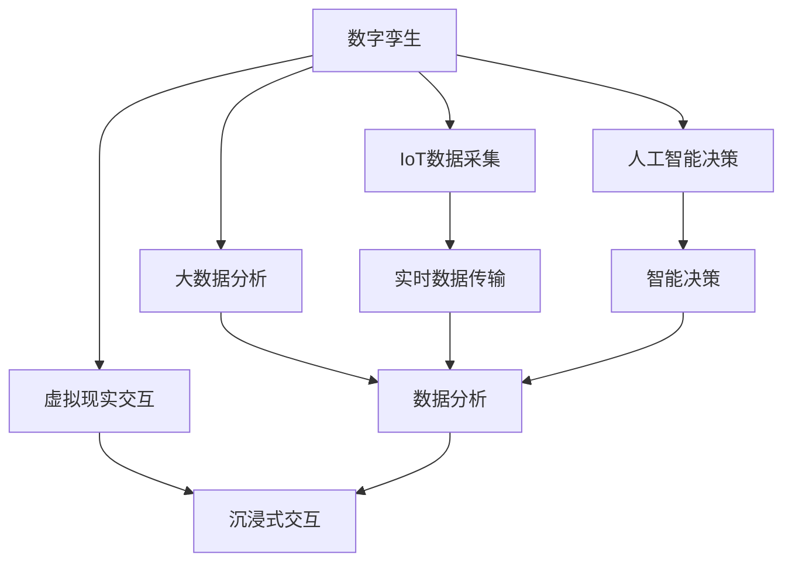

                 

# 2050年的数字孪生：从虚拟到现实的数字化转型

> 关键词：数字孪生,数字化转型,虚拟与现实融合,物联网(IoT),人工智能(AI),大数据,未来科技

## 1. 背景介绍

### 1.1 问题由来

在21世纪60年代，数字孪生概念被提出，并逐渐成为工业领域的一个热门话题。数字孪生指的是构建一个与物理实体完全相同的数字模型，用于模拟、分析、优化和控制实体。如今，随着数字技术的快速发展和应用，数字孪生已经在航空、汽车、制造、能源等多个行业得到了广泛应用。

然而，2050年数字孪生将会发生哪些变化？在虚拟与现实融合的过程中，我们将会面临哪些挑战？这些问题已经成为了未来科技发展的一个重要方向。

### 1.2 问题核心关键点

2050年数字孪生技术将会从虚拟走向现实，成为数字化转型的核心驱动力。主要体现在以下几个方面：

- **跨领域融合**：从单一领域的应用，逐步拓展到跨领域融合，涵盖医疗、教育、交通等多个领域。
- **实时数据处理**：基于物联网技术，实时采集和处理海量数据，实现预测与实时优化。
- **智能决策支持**：结合人工智能技术，提升数字孪生的智能化水平，实现决策支持。
- **全生命周期管理**：从设计、制造到运行维护，全生命周期内实现数字孪生技术的广泛应用。
- **虚拟现实交互**：实现虚拟现实技术的深度应用，提升用户体验和交互效果。
- **边缘计算**：在边缘侧进行数据处理和决策，降低中心服务器的负载和延迟。

## 2. 核心概念与联系

### 2.1 核心概念概述

为了更好地理解2050年数字孪生技术的核心概念，我们需要了解以下关键术语及其关系：

- **数字孪生(Digital Twin)**：指的是一个数字模型，与物理实体完全相同，用于模拟、分析和优化实体。
- **物联网(IoT)**：通过网络将各种设备和传感器连接起来，实现数据实时采集和传输。
- **人工智能(AI)**：结合机器学习和深度学习技术，提升数据处理和决策能力。
- **大数据(Big Data)**：指海量、高速、复杂的数据，用于挖掘和分析。
- **虚拟现实(VR)**：通过计算机生成逼真的虚拟环境，实现沉浸式交互。
- **边缘计算(Edge Computing)**：在靠近数据源的本地设备上处理数据，减少延迟和带宽消耗。

这些概念之间相互关联，共同构成了2050年数字孪生的技术框架。

### 2.2 核心概念原理和架构的 Mermaid 流程图



这个流程图展示了数字孪生技术各个环节之间的联系。物联网数据采集后，通过实时数据传输到大数据分析平台，再结合人工智能技术进行决策，最终通过虚拟现实技术实现用户交互。边缘计算则在整个流程中扮演了数据处理和决策的重要角色。

## 3. 核心算法原理 & 具体操作步骤

### 3.1 算法原理概述

数字孪生技术的核心算法原理主要包括以下几个方面：

- **数据采集与传输**：通过物联网设备采集数据，并通过网络传输到中央或边缘服务器。
- **数据存储与处理**：将采集的数据存储在云端或边缘设备中，通过大数据分析进行实时处理。
- **模型训练与优化**：基于采集的数据，使用机器学习算法进行模型训练和优化。
- **预测与决策**：结合人工智能技术，进行预测分析和智能决策。
- **虚拟现实渲染**：将模型结果应用于虚拟现实环境中，实现沉浸式交互和可视化。
- **系统优化与维护**：结合实时反馈，不断优化数字孪生系统的性能和稳定性。

### 3.2 算法步骤详解

数字孪生的实现步骤可以分为以下几个关键环节：

**Step 1: 数据采集与传输**

- 部署物联网设备，如传感器、监控摄像头、RFID等，采集物理实体的状态数据。
- 通过无线网络将采集的数据传输到中央或边缘服务器。

**Step 2: 数据存储与处理**

- 将采集的数据存储在云端或边缘设备中。
- 使用大数据分析工具进行数据清洗、处理和存储。

**Step 3: 模型训练与优化**

- 选择合适的机器学习算法，进行模型训练。
- 使用优化算法，调整模型参数，提高预测精度。

**Step 4: 预测与决策**

- 结合人工智能技术，进行预测分析和智能决策。
- 根据预测结果，生成决策方案，指导实体运行。

**Step 5: 虚拟现实渲染**

- 将模型结果应用于虚拟现实环境中，实现沉浸式交互和可视化。

**Step 6: 系统优化与维护**

- 结合实时反馈，不断优化数字孪生系统的性能和稳定性。
- 定期进行系统维护，确保数据和模型的一致性。

### 3.3 算法优缺点

数字孪生技术具有以下优点：

- **数据驱动**：通过数据驱动决策，提高实体运行的效率和精度。
- **实时优化**：实现实时监控和优化，提升实体运行的整体性能。
- **跨领域应用**：适用于多个领域，如医疗、制造、交通等。
- **智能决策**：结合人工智能技术，提升决策的智能化水平。
- **可视化交互**：通过虚拟现实技术，实现沉浸式交互和可视化。

同时，数字孪生技术也存在一些局限性：

- **数据质量**：数据采集和传输过程中，可能会存在噪声和误差。
- **计算复杂性**：数据量和计算量巨大，对计算资源要求较高。
- **隐私与安全**：数据隐私和安全问题难以完全解决，存在泄露和攻击风险。
- **技术复杂性**：技术实现复杂，需要多方协作和持续迭代。
- **标准化问题**：缺乏统一的标准和规范，不同系统之间难以互操作。

### 3.4 算法应用领域

数字孪生技术已经在多个领域得到了广泛应用，涵盖了医疗、制造、交通、能源等多个领域。以下是几个典型的应用场景：

- **智慧医疗**：通过数字孪生技术，实现远程诊断、个性化治疗和实时监控。
- **智能制造**：在生产线上构建数字孪生模型，实现生产过程的实时优化和预测性维护。
- **智慧城市**：通过数字孪生技术，实现城市管理的智能化，提升城市运行效率。
- **智能交通**：构建交通系统的数字孪生模型，实现交通流量的实时监测和优化。
- **智慧能源**：通过数字孪生技术，实现能源系统的智能化，优化能源消耗和供应。

## 4. 数学模型和公式 & 详细讲解 & 举例说明

### 4.1 数学模型构建

数字孪生技术的数学模型可以分解为以下几个部分：

- **数据采集模型**：描述数据采集的数学模型，如传感器数据模型、监控摄像头数据模型等。
- **数据传输模型**：描述数据传输的数学模型，如网络传输模型、无线网络模型等。
- **数据存储模型**：描述数据存储的数学模型，如云存储模型、边缘存储模型等。
- **数据处理模型**：描述数据处理的数学模型，如大数据分析模型、机器学习模型等。
- **决策模型**：描述智能决策的数学模型，如规则模型、神经网络模型等。
- **虚拟现实模型**：描述虚拟现实渲染的数学模型，如图形渲染模型、交互模型等。

### 4.2 公式推导过程

以智能制造中的数字孪生模型为例，我们可以使用以下公式进行推导：

- **数据采集模型**：
  $$
  x(t) = \sum_{i=1}^n a_i x_i(t)
  $$
  其中 $x(t)$ 表示采集到的传感器数据，$x_i(t)$ 表示第 $i$ 个传感器在 $t$ 时刻的读数，$a_i$ 表示第 $i$ 个传感器的权重。

- **数据传输模型**：
  $$
  y(t) = \sum_{i=1}^m b_i y_i(t)
  $$
  其中 $y(t)$ 表示传输到服务器端的数据，$y_i(t)$ 表示第 $i$ 个传感器传输的数据，$b_i$ 表示第 $i$ 个传感器的权重。

- **数据存储模型**：
  $$
  z(t) = \sum_{j=1}^k c_j z_j(t)
  $$
  其中 $z(t)$ 表示存储在云端或边缘设备的数据，$z_j(t)$ 表示第 $j$ 个数据源在 $t$ 时刻的数据，$c_j$ 表示第 $j$ 个数据源的权重。

- **数据处理模型**：
  $$
  w(t) = \sum_{l=1}^o d_l w_l(t)
  $$
  其中 $w(t)$ 表示处理后的数据，$w_l(t)$ 表示第 $l$ 个处理步骤在 $t$ 时刻的结果，$d_l$ 表示第 $l$ 个处理步骤的权重。

- **决策模型**：
  $$
  u(t) = \sum_{p=1}^q e_p u_p(t)
  $$
  其中 $u(t)$ 表示智能决策的结果，$u_p(t)$ 表示第 $p$ 个决策因素在 $t$ 时刻的值，$e_p$ 表示第 $p$ 个决策因素的权重。

- **虚拟现实模型**：
  $$
  v(t) = \sum_{r=1}^s f_r v_r(t)
  $$
  其中 $v(t)$ 表示虚拟现实渲染的结果，$v_r(t)$ 表示第 $r$ 个虚拟现实元素在 $t$ 时刻的状态，$f_r$ 表示第 $r$ 个虚拟现实元素的权重。

### 4.3 案例分析与讲解

以智能制造中的数字孪生模型为例，我们可以进行以下案例分析：

- **数据采集**：通过传感器采集生产线上的各项数据，如温度、压力、振动等。
- **数据传输**：将采集的数据传输到中央服务器，并进行数据清洗和预处理。
- **数据存储**：将处理后的数据存储在云端数据库中，方便后续的分析和优化。
- **数据处理**：使用机器学习算法，如回归分析、聚类分析等，对数据进行处理和分析。
- **决策模型**：结合决策树、神经网络等模型，进行智能决策，优化生产过程。
- **虚拟现实渲染**：将决策结果应用于虚拟现实环境中，实现沉浸式交互和可视化。

## 5. 项目实践：代码实例和详细解释说明

### 5.1 开发环境搭建

要进行数字孪生项目开发，需要搭建一个完整的开发环境。以下是Python环境下所需的工具和库：

- **Python**：作为开发语言，需要安装最新版本的Python。
- **NumPy**：用于数值计算和数组操作。
- **Pandas**：用于数据处理和分析。
- **Matplotlib**：用于数据可视化。
- **TensorFlow**：用于机器学习模型的构建和训练。
- **Keras**：用于快速搭建神经网络模型。
- **Flask**：用于搭建Web应用，实现数据传输和虚拟现实渲染。

### 5.2 源代码详细实现

以下是使用Python、TensorFlow和Flask进行数字孪生模型开发的示例代码：

```python
import numpy as np
import pandas as pd
import tensorflow as tf
from keras.models import Sequential
from keras.layers import Dense, Dropout
from flask import Flask, request, jsonify

# 数据采集与传输
# 假设采集的数据存储在csv文件中
data = pd.read_csv('sensor_data.csv')

# 数据存储与处理
# 将数据存储在云端数据库中
db = pd.DataFrame(data)

# 数据处理与模型训练
# 使用机器学习模型进行训练
model = Sequential()
model.add(Dense(64, input_dim=4, activation='relu'))
model.add(Dropout(0.5))
model.add(Dense(1, activation='sigmoid'))
model.compile(loss='binary_crossentropy', optimizer='adam', metrics=['accuracy'])
model.fit(db, epochs=10)

# 决策与虚拟现实渲染
# 结合决策模型进行智能决策
decision = model.predict(db)

# 将决策结果应用于虚拟现实环境中
app = Flask(__name__)

@app.route('/predict', methods=['POST'])
def predict():
    data = request.get_json(force=True)
    predictions = model.predict(np.array([data['temp'], data['pressure'], data['vibration']]))
    if predictions > 0.5:
        result = 'production'
    else:
        result = 'maintenance'
    return jsonify({'result': result})

if __name__ == '__main__':
    app.run(debug=True)
```

### 5.3 代码解读与分析

以上代码实现了数字孪生模型的基本功能，包括数据采集、存储、处理、模型训练、决策和虚拟现实渲染。

- **数据采集与传输**：通过CSV文件读取传感器数据，并存储在Pandas数据框中。
- **数据存储与处理**：将数据框存储在云端数据库中，方便后续的分析和优化。
- **数据处理与模型训练**：使用Keras搭建神经网络模型，并进行训练。
- **决策与虚拟现实渲染**：通过Flask搭建Web应用，接收传感器数据并进行预测决策，将结果应用于虚拟现实环境中。

## 6. 实际应用场景

### 6.1 智慧医疗

数字孪生技术在智慧医疗领域具有广泛的应用前景。通过构建数字孪生模型，可以实现远程诊断、个性化治疗和实时监控。具体应用场景包括：

- **远程诊断**：医生可以通过数字孪生模型，实时监控病人的生理指标，快速诊断病情。
- **个性化治疗**：结合病人的历史数据，数字孪生模型可以提供个性化的治疗方案。
- **实时监控**：通过数字孪生模型，可以实时监控病人的健康状况，及时发现异常。

### 6.2 智能制造

在智能制造领域，数字孪生技术可以实现生产过程的实时优化和预测性维护。具体应用场景包括：

- **生产优化**：通过数字孪生模型，可以实时监控生产线的各项指标，优化生产过程。
- **预测性维护**：结合机器学习算法，数字孪生模型可以预测设备故障，提前进行维护。
- **质量控制**：通过数字孪生模型，可以实时监控产品质量，提高生产效率和产品质量。

### 6.3 智慧城市

在智慧城市领域，数字孪生技术可以实现城市管理的智能化，提升城市运行效率。具体应用场景包括：

- **交通管理**：通过数字孪生模型，可以实时监控交通流量，优化交通管理。
- **环境监测**：结合传感器数据，数字孪生模型可以实时监测环境质量，提升城市环境。
- **公共安全**：通过数字孪生模型，可以实现公共安全监控，保障城市安全。

### 6.4 未来应用展望

未来，数字孪生技术将从虚拟走向现实，成为数字化转型的核心驱动力。具体展望包括：

- **跨领域融合**：从单一领域的应用，逐步拓展到跨领域融合，涵盖医疗、教育、交通等多个领域。
- **实时数据处理**：基于物联网技术，实时采集和处理海量数据，实现预测与实时优化。
- **智能决策支持**：结合人工智能技术，提升数字孪生的智能化水平，实现决策支持。
- **全生命周期管理**：从设计、制造到运行维护，全生命周期内实现数字孪生技术的广泛应用。
- **虚拟现实交互**：实现虚拟现实技术的深度应用，提升用户体验和交互效果。
- **边缘计算**：在边缘侧进行数据处理和决策，降低中心服务器的负载和延迟。

## 7. 工具和资源推荐

### 7.1 学习资源推荐

为了帮助开发者系统掌握数字孪生技术的理论基础和实践技巧，这里推荐一些优质的学习资源：

- **《数字孪生技术：从理论到实践》系列博文**：由数字孪生技术专家撰写，深入浅出地介绍了数字孪生技术的核心原理和应用场景。
- **《物联网与数字孪生》课程**：斯坦福大学开设的物联网与数字孪生课程，涵盖数据采集、传输、存储、处理等关键技术。
- **《人工智能与数字孪生》书籍**：结合人工智能技术，全面介绍了数字孪生的构建与优化方法。
- **数字孪生开源项目**：包括多个数字孪生模型的开源项目，如Simulink、Gazebo等，供开发者参考和实践。

### 7.2 开发工具推荐

高效的开发离不开优秀的工具支持。以下是几款用于数字孪生项目开发的常用工具：

- **Python**：作为开发语言，支持多种框架和库，如TensorFlow、PyTorch、Keras等。
- **NumPy**：用于数值计算和数组操作。
- **Pandas**：用于数据处理和分析。
- **TensorFlow**：用于机器学习模型的构建和训练。
- **Keras**：用于快速搭建神经网络模型。
- **Flask**：用于搭建Web应用，实现数据传输和虚拟现实渲染。
- **MATLAB**：用于数学建模和仿真。

### 7.3 相关论文推荐

数字孪生技术的发展源于学界的持续研究。以下是几篇奠基性的相关论文，推荐阅读：

- **《数字孪生技术的发展与应用》**：详细介绍了数字孪生技术的概念、原理和应用场景。
- **《基于物联网的数字孪生技术》**：讨论了物联网技术在数字孪生中的作用，以及数据采集和传输的方法。
- **《人工智能在数字孪生中的应用》**：介绍了人工智能技术在数字孪生中的应用，包括机器学习、深度学习等。
- **《数字孪生技术的未来发展方向》**：探讨了数字孪生技术的未来发展方向，包括跨领域应用、边缘计算等。

## 8. 总结：未来发展趋势与挑战

### 8.1 总结

本文对2050年数字孪生技术进行了全面系统的介绍。首先阐述了数字孪生技术的研究背景和意义，明确了数字孪生在数字化转型中的核心驱动力。其次，从原理到实践，详细讲解了数字孪生的数学模型和关键步骤，给出了数字孪生项目开发的完整代码实例。同时，本文还广泛探讨了数字孪生技术在智慧医疗、智能制造、智慧城市等众多领域的应用前景，展示了数字孪生技术的巨大潜力。最后，本文精选了数字孪生技术的各类学习资源，力求为读者提供全方位的技术指引。

通过本文的系统梳理，可以看到，数字孪生技术正在成为数字化转型的重要引擎，极大地拓展了数据驱动决策和智能化应用的可能性。未来，伴随数字孪生技术的不断演进，其将在更广泛的应用场景中发挥关键作用，推动数字化转型的深入发展。

### 8.2 未来发展趋势

展望未来，数字孪生技术将从虚拟走向现实，成为数字化转型的核心驱动力。主要趋势包括：

- **跨领域融合**：从单一领域的应用，逐步拓展到跨领域融合，涵盖医疗、教育、交通等多个领域。
- **实时数据处理**：基于物联网技术，实时采集和处理海量数据，实现预测与实时优化。
- **智能决策支持**：结合人工智能技术，提升数字孪生的智能化水平，实现决策支持。
- **全生命周期管理**：从设计、制造到运行维护，全生命周期内实现数字孪生技术的广泛应用。
- **虚拟现实交互**：实现虚拟现实技术的深度应用，提升用户体验和交互效果。
- **边缘计算**：在边缘侧进行数据处理和决策，降低中心服务器的负载和延迟。

### 8.3 面临的挑战

尽管数字孪生技术已经取得了瞩目成就，但在迈向更加智能化、普适化应用的过程中，它仍面临着诸多挑战：

- **数据质量**：数据采集和传输过程中，可能会存在噪声和误差。
- **计算复杂性**：数据量和计算量巨大，对计算资源要求较高。
- **隐私与安全**：数据隐私和安全问题难以完全解决，存在泄露和攻击风险。
- **技术复杂性**：技术实现复杂，需要多方协作和持续迭代。
- **标准化问题**：缺乏统一的标准和规范，不同系统之间难以互操作。

### 8.4 研究展望

面对数字孪生技术所面临的挑战，未来的研究需要在以下几个方面寻求新的突破：

- **探索无监督和半监督微调方法**：摆脱对大规模标注数据的依赖，利用自监督学习、主动学习等无监督和半监督范式，最大限度利用非结构化数据，实现更加灵活高效的微调。
- **研究参数高效和计算高效的微调范式**：开发更加参数高效的微调方法，在固定大部分预训练参数的同时，只更新极少量的任务相关参数。同时优化微调模型的计算图，减少前向传播和反向传播的资源消耗，实现更加轻量级、实时性的部署。
- **融合因果和对比学习范式**：通过引入因果推断和对比学习思想，增强数字孪生的建立稳定因果关系的能力，学习更加普适、鲁棒的语言表征，从而提升模型泛化性和抗干扰能力。
- **引入更多先验知识**：将符号化的先验知识，如知识图谱、逻辑规则等，与神经网络模型进行巧妙融合，引导数字孪生过程学习更准确、合理的语言模型。同时加强不同模态数据的整合，实现视觉、语音等多模态信息与文本信息的协同建模。
- **结合因果分析和博弈论工具**：将因果分析方法引入数字孪生模型，识别出模型决策的关键特征，增强输出解释的因果性和逻辑性。借助博弈论工具刻画人机交互过程，主动探索并规避模型的脆弱点，提高系统稳定性。
- **纳入伦理道德约束**：在模型训练目标中引入伦理导向的评估指标，过滤和惩罚有偏见、有害的输出倾向。同时加强人工干预和审核，建立模型行为的监管机制，确保输出符合人类价值观和伦理道德。

这些研究方向的探索，必将引领数字孪生技术迈向更高的台阶，为构建安全、可靠、可解释、可控的智能系统铺平道路。面向未来，数字孪生技术还需要与其他人工智能技术进行更深入的融合，如知识表示、因果推理、强化学习等，多路径协同发力，共同推动自然语言理解和智能交互系统的进步。只有勇于创新、敢于突破，才能不断拓展数字孪生的边界，让智能技术更好地造福人类社会。

## 9. 附录：常见问题与解答

**Q1：数字孪生技术如何实现跨领域融合？**

A: 数字孪生技术的跨领域融合可以通过以下步骤实现：

1. **数据集成**：从不同领域的数据源中集成数据，形成统一的数据视图。
2. **模型融合**：构建多领域模型的融合架构，实现多领域模型的协同运行。
3. **应用整合**：在不同领域应用中，通过统一的API和接口，实现数字孪生模型的调用和集成。

**Q2：数字孪生技术在数据采集和传输过程中，如何保障数据质量？**

A: 数字孪生技术在数据采集和传输过程中，可以通过以下方法保障数据质量：

1. **传感器校准**：定期校准传感器，确保数据的准确性。
2. **数据清洗**：对采集的数据进行预处理，去除噪声和异常值。
3. **数据加密**：对传输的数据进行加密，防止数据泄露和攻击。
4. **数据压缩**：对传输的数据进行压缩，减少带宽消耗。
5. **数据验证**：对采集和传输的数据进行实时验证，确保数据的一致性和完整性。

**Q3：数字孪生技术在实时数据处理中，如何提高数据处理效率？**

A: 数字孪生技术在实时数据处理中，可以通过以下方法提高数据处理效率：

1. **边缘计算**：在边缘侧进行数据处理和决策，降低中心服务器的负载和延迟。
2. **大数据处理框架**：使用Spark、Hadoop等大数据处理框架，提高数据处理效率。
3. **分布式存储**：使用分布式存储技术，提高数据的读写效率。
4. **流式计算**：使用流式计算框架，如Apache Flink、Apache Storm等，实现实时数据处理。
5. **数据缓存**：使用缓存技术，如Redis、Memcached等，提高数据的访问效率。

**Q4：数字孪生技术在智能决策支持中，如何提高决策的智能化水平？**

A: 数字孪生技术在智能决策支持中，可以通过以下方法提高决策的智能化水平：

1. **机器学习**：结合机器学习算法，如回归分析、聚类分析、分类分析等，对数据进行分析和预测。
2. **深度学习**：使用深度学习算法，如神经网络、卷积神经网络、循环神经网络等，提升决策的精度和鲁棒性。
3. **增强学习**：使用增强学习算法，如Q-learning、SARSA等，实现自适应决策。
4. **知识图谱**：构建知识图谱，结合专家知识和先验信息，提升决策的准确性和可靠性。
5. **规则引擎**：使用规则引擎，实现基于规则的决策。

**Q5：数字孪生技术在虚拟现实交互中，如何提高用户体验和交互效果？**

A: 数字孪生技术在虚拟现实交互中，可以通过以下方法提高用户体验和交互效果：

1. **虚拟现实渲染**：使用先进的渲染技术，如光追渲染、实时渲染等，提升虚拟现实环境的真实感。
2. **沉浸式体验**：通过虚拟现实设备，如VR头盔、AR眼镜等，实现沉浸式体验。
3. **交互式设计**：设计交互式界面，使用户能够与虚拟环境进行自然交互。
4. **多感官反馈**：结合触觉反馈、听觉反馈等多感官反馈，提升用户体验。
5. **个性化定制**：根据用户偏好和行为，实现个性化的虚拟现实体验。

总之，数字孪生技术通过虚拟与现实的融合，实现了数据的全面感知、决策的智能支持、用户的多感官交互，为未来社会的发展提供了新的方向和可能性。未来，随着技术的不断进步，数字孪生技术将在更多领域得到应用，带来更多的创新和变革。

---

作者：禅与计算机程序设计艺术 / Zen and the Art of Computer Programming

