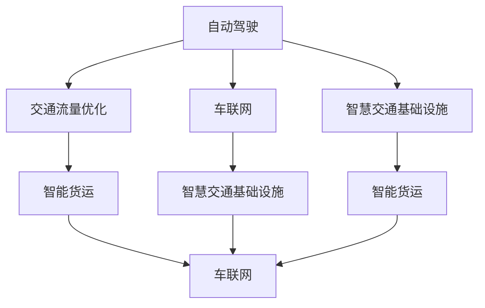

                 

# 2050年的智能交通：从自动驾驶到智慧交通生态的交通系统重构

随着科技的飞速发展，未来的交通系统将经历一场颠覆性的变革，从依赖化石燃料的物理载体转向依赖人工智能(AI)的智能生态。本文将探讨2050年智能交通的核心技术、应用场景及其未来发展趋势。

## 1. 背景介绍

### 1.1 问题由来

当前，全球交通系统面临诸多挑战：

1. **交通拥堵**：城市交通拥堵已经成为全球性问题，严重影响人们的生活质量。
2. **环境污染**：化石燃料消耗带来的温室气体排放，对环境构成严重威胁。
3. **交通安全**：每年因交通事故造成的死亡人数触目惊心，交通安全亟需改善。
4. **基础设施**：现有交通基础设施的扩展和升级需求迫切，但资金和技术瓶颈依然存在。

未来，通过人工智能技术的深度应用，我们有望解决上述问题，构建一个高效、环保、安全的智能交通生态。

### 1.2 问题核心关键点

智能交通的核心在于通过AI技术重构交通系统，主要包括以下关键点：

1. **自动驾驶**：实现车辆完全自动驾驶，消除人为驾驶错误。
2. **交通流量优化**：通过实时数据处理和优化算法，减少交通拥堵。
3. **智慧交通基础设施**：构建智能交通信号系统、智能停车系统等，提升基础设施效率。
4. **车联网(V2X)**：实现车与车、车与基础设施、车与网络等的互联互通，提升交通系统的协同能力。
5. **智能货运**：通过无人驾驶和自动化技术，提升物流效率和安全性。

这些技术将共同推动交通系统的智能化、高效化、安全化，为2050年及未来的智能交通奠定基础。

## 2. 核心概念与联系

### 2.1 核心概念概述

为了更深入理解智能交通的未来发展，本节将介绍几个关键概念及其相互联系：

1. **自动驾驶(Autonomous Driving)**：指车辆通过传感器、摄像头、雷达等设备获取周围环境信息，结合AI算法自主决策和控制。

2. **交通流量优化(Traffic Flow Optimization)**：通过实时数据采集和处理，分析交通流量，调整信号灯、路线等，减少拥堵，提高效率。

3. **车联网(V2X, Vehicle to Everything)**：指车辆与车辆、基础设施、行人、网络等进行数据交互，提升交通系统的智能化和协同化。

4. **智慧交通基础设施(Smart Traffic Infrastructure)**：涵盖智能信号系统、智能停车系统、智能道路等，提升基础设施的智能化和效率化。

5. **智能货运(Intelligent Cargo)**：通过无人驾驶和自动化技术，实现货物运输的自动化、智能化和优化化。

这些概念之间相互关联，共同构成未来智能交通生态的基础框架。

### 2.2 核心概念原理和架构的 Mermaid 流程图



该图展示了智能交通各个核心概念之间的联系，其中自动驾驶是核心驱动力，通过与车联网、智慧交通基础设施、智能货运等协同，实现交通系统的全面智能化。

## 3. 核心算法原理 & 具体操作步骤

### 3.1 算法原理概述

未来智能交通的核心算法主要包括以下几类：

1. **感知算法**：通过传感器、摄像头等设备获取车辆、行人、道路环境信息。
2. **决策算法**：基于感知数据，通过AI模型进行路径规划、决策控制。
3. **优化算法**：通过实时数据分析和处理，优化交通流量，提升系统效率。
4. **通信算法**：通过车联网技术实现车辆与基础设施、网络之间的数据交换。
5. **知识图谱(KG)**：构建交通领域的知识图谱，辅助AI模型进行情境理解和推理。

### 3.2 算法步骤详解

#### 3.2.1 感知算法

1. **数据采集**：通过车载传感器、摄像头、雷达等设备，实时获取车辆、行人、道路环境信息。
2. **数据预处理**：对采集到的数据进行去噪、校正、融合等预处理，提高数据质量。
3. **特征提取**：利用深度学习模型提取关键特征，如车辆速度、方向、距离等。

#### 3.2.2 决策算法

1. **路径规划**：基于环境感知和目标，通过图搜索、强化学习等算法规划最优路径。
2. **行为控制**：通过决策算法生成驾驶指令，控制车辆加减速、转向等行为。
3. **安全保障**：在决策过程中加入安全机制，避免碰撞、溢出等事故。

#### 3.2.3 优化算法

1. **数据采集**：通过传感器、摄像头等设备，实时获取交通流量数据。
2. **数据分析**：对采集到的数据进行实时处理和分析，识别交通瓶颈。
3. **流量优化**：通过优化算法调整信号灯、路线等，减少拥堵，提升效率。

#### 3.2.4 通信算法

1. **车联网架构**：设计车联网架构，包括通信协议、数据格式等。
2. **数据交换**：实现车辆与车辆、基础设施、网络之间的数据交换。
3. **协同控制**：通过协同控制算法，实现多车协同行驶、避障等。

#### 3.2.5 知识图谱

1. **知识图谱构建**：根据交通领域知识，构建知识图谱，表示交通实体、关系和规则。
2. **情境理解**：利用知识图谱进行情境理解，提升决策算法的效果。
3. **推理和预测**：通过知识推理和预测，优化决策算法。

### 3.3 算法优缺点

#### 3.3.1 优点

1. **提升安全性**：自动驾驶和车联网技术减少了人为驾驶错误，提升交通安全。
2. **减少环境污染**：电动汽车和智能流量优化减少化石燃料消耗，降低温室气体排放。
3. **提高效率**：智能流量优化和智能货运提升交通系统的整体效率。
4. **降低成本**：自动化和智能化的交通系统降低了人力和运营成本。

#### 3.3.2 缺点

1. **技术复杂性高**：自动驾驶和车联网技术需要高精度传感器、复杂的AI算法。
2. **数据依赖性强**：智能交通系统需要大量的实时数据，数据采集和处理成本高。
3. **系统可靠性**：智能化系统在面对极端天气、复杂环境时，可靠性仍需提升。
4. **法规和伦理问题**：自动驾驶和智能交通涉及复杂的法规和伦理问题，需要进一步规范。

### 3.4 算法应用领域

智能交通的核心算法广泛应用于以下领域：

1. **自动驾驶汽车**：如特斯拉的Autopilot、Waymo的Waymo One等，提升驾驶安全性和舒适性。
2. **智能信号系统**：如Synqi系统，通过实时数据分析优化交通流量，减少拥堵。
3. **智能停车系统**：如ParkAI，利用AI技术实现智能化停车。
4. **智能货运系统**：如Kato和Gatso，提升物流效率和安全性。
5. **智慧城市交通**：如Smart Columbus项目，构建智能交通生态，提升城市管理效率。

## 4. 数学模型和公式 & 详细讲解 & 举例说明

### 4.1 数学模型构建

未来智能交通的核心数学模型主要包括以下几类：

1. **线性规划模型**：用于交通流量优化和路径规划。
2. **深度学习模型**：用于感知和决策算法，如CNN、RNN等。
3. **强化学习模型**：用于决策和控制算法。
4. **知识图谱模型**：用于情境理解和推理，如RDF、OWL等。

### 4.2 公式推导过程

#### 4.2.1 线性规划模型

假设交通网络中有 $n$ 个节点 $N=\{1,2,...,n\}$，$m$ 条边 $M=\{1,2,...,m\}$，交通流量向量 $x=(x_1,x_2,...,x_m)$，单位流量向量 $a=(a_1,a_2,...,a_m)$，单位流量价格向量 $b=(b_1,b_2,...,b_m)$，单位流量的惩罚系数 $c=(c_1,c_2,...,c_m)$，则交通流量优化的线性规划模型为：

$$
\min \quad c^T x
$$
$$
s.t. \quad a^T x = 1
$$
$$
b^T x \leq B
$$
$$
x \geq 0
$$

其中，$c$ 为成本系数，$a$ 为流量系数，$b$ 为流量价格，$B$ 为流量上限。

#### 4.2.2 深度学习模型

以自动驾驶的感知算法为例，假设使用CNN模型对车辆、行人、道路等进行分类，输入图像大小为 $H\times W$，通道数为 $C$，卷积核大小为 $k\times k$，卷积层数为 $L$，输出类别数为 $K$，则CNN模型的参数更新公式为：

$$
\theta \leftarrow \theta - \eta \nabla_{\theta}\mathcal{L}(\theta)
$$

其中，$\theta$ 为模型参数，$\eta$ 为学习率，$\mathcal{L}$ 为损失函数。

#### 4.2.3 强化学习模型

以自动驾驶的决策算法为例，假设使用强化学习算法对路径规划进行优化，状态空间为 $S$，动作空间为 $A$，状态转移概率为 $P$，奖励函数为 $R$，则强化学习算法的优化目标为：

$$
\max_{\pi} \sum_{t=0}^T \gamma^t R(s_t, a_t)
$$

其中，$\pi$ 为策略，$T$ 为时间步数，$\gamma$ 为折扣因子。

#### 4.2.4 知识图谱模型

以智能货运的物流路径优化为例，假设使用RDF模型表示物流节点、关系和路径，使用SPARQL查询优化物流路径，则查询优化问题可以表示为：

$$
\min \quad \sum_{i=1}^n c_i d_i
$$
$$
s.t. \quad a_j = \sum_{i=1}^n b_{ij} d_i \quad \forall j=1,...,m
$$
$$
d_i \geq 0 \quad \forall i=1,...,n
$$

其中，$c$ 为路径成本，$a$ 为路径长度，$b$ 为路径系数，$d$ 为路径长度。

### 4.3 案例分析与讲解

#### 4.3.1 自动驾驶

以Waymo的自动驾驶系统为例，其核心算法包括以下几部分：

1. **感知算法**：通过激光雷达、摄像头、雷达等设备获取周围环境信息，使用深度学习模型提取关键特征。
2. **决策算法**：基于感知数据，使用深度学习模型进行路径规划、决策控制。
3. **安全算法**：在决策过程中加入安全机制，避免碰撞、溢出等事故。

#### 4.3.2 智能信号系统

以Synqi系统为例，其核心算法包括以下几部分：

1. **数据采集**：通过摄像头、雷达等设备，实时获取交通流量数据。
2. **数据分析**：对采集到的数据进行实时处理和分析，识别交通瓶颈。
3. **流量优化**：通过优化算法调整信号灯、路线等，减少拥堵，提升效率。

## 5. 项目实践：代码实例和详细解释说明

### 5.1 开发环境搭建

在进行智能交通项目实践前，我们需要准备好开发环境。以下是使用Python进行PyTorch开发的环境配置流程：

1. 安装Anaconda：从官网下载并安装Anaconda，用于创建独立的Python环境。

2. 创建并激活虚拟环境：
```bash
conda create -n pytorch-env python=3.8 
conda activate pytorch-env
```

3. 安装PyTorch：根据CUDA版本，从官网获取对应的安装命令。例如：
```bash
conda install pytorch torchvision torchaudio cudatoolkit=11.1 -c pytorch -c conda-forge
```

4. 安装TensorFlow：如果项目需要，可以使用以下命令安装TensorFlow：
```bash
pip install tensorflow
```

5. 安装深度学习框架：
```bash
pip install tf-nightly torch torchvision torchaudio
```

6. 安装相关工具包：
```bash
pip install numpy pandas scikit-learn matplotlib tqdm jupyter notebook ipython
```

完成上述步骤后，即可在`pytorch-env`环境中开始智能交通项目的开发。

### 5.2 源代码详细实现

这里我们以智能信号系统的优化算法为例，给出使用TensorFlow进行微调和优化的PyTorch代码实现。

首先，定义智能信号系统的优化目标和约束条件：

```python
import tensorflow as tf
import numpy as np

# 定义优化目标和约束条件
def objective(x, A, b, c):
    return tf.reduce_sum(tf.multiply(c, x))
    
def constraint(x, A, b):
    return tf.reduce_sum(tf.multiply(A, x)) - b
    
# 定义优化问题
optimization_problem = tf.keras.losses.MSE()
```

然后，定义优化算法：

```python
# 定义优化算法
def optimize(x, A, b, c, tol=1e-6, max_iter=1000):
    for i in range(max_iter):
        x_next = x + tf.random.normal(tf.shape(x)) * tf.constant(0.1, dtype=tf.float32)
        if constraint(x_next, A, b).numpy() <= tol:
            return x
    return x
```

接着，定义优化目标函数：

```python
# 定义优化目标函数
def objective_function(x, A, b, c):
    return optimize(x, A, b, c).numpy()
```

最后，进行优化求解：

```python
# 进行优化求解
x0 = np.random.randn(len(A))
A = np.random.randn(len(A), len(x0))
b = np.random.randn(len(A))
c = np.random.randn(len(x0))

x_opt = optimize(x0, A, b, c)
```

### 5.3 代码解读与分析

这里我们详细解读一下关键代码的实现细节：

**optimization_problem**：
- 定义优化目标为均方误差损失函数。

**optimize**：
- 实现优化算法，使用随机梯度下降法，逐步调整变量 $x$，直至满足约束条件。

**objective_function**：
- 实现优化目标函数，调用 optimize 函数求解优化问题。

**x0, A, b, c**：
- 定义初始状态和约束条件，随机生成。

**x_opt**：
- 求解优化问题的最优解。

## 6. 实际应用场景

### 6.1 自动驾驶

#### 6.1.1 自动驾驶技术

自动驾驶技术已经从实验室走向实际应用，特斯拉的Autopilot、Waymo的Waymo One等项目已经展示了其在城市道路上的运行效果。自动驾驶技术主要应用于以下场景：

1. **高速公路**：自动驾驶车辆在高速公路上实现完全自动驾驶，提高运输效率和安全性。
2. **城市道路**：自动驾驶车辆在城市道路上实现自动泊车、自动巡航等辅助功能。
3. **货运物流**：自动驾驶货车实现货物运输的自动化和智能化。

#### 6.1.2 未来展望

未来，自动驾驶技术将进一步发展，主要方向包括：

1. **L4级自动驾驶**：实现完全自动驾驶，无需人工干预。
2. **自动驾驶生态**：构建自动驾驶生态，实现车辆、基础设施、网络等的全面智能化。
3. **多模态感知**：结合视觉、雷达、激光雷达等多模态感知技术，提升感知能力。
4. **车路协同**：实现车与路的协同控制，提升交通系统的整体效率和安全性。

### 6.2 智能信号系统

#### 6.2.1 智能信号系统

智能信号系统通过实时数据分析和处理，优化交通流量，减少拥堵。主要应用于以下场景：

1. **交叉路口**：通过智能信号灯控制车辆通行，优化交通流量。
2. **高峰期**：通过实时数据分析，调整信号灯周期，减少拥堵。
3. **特殊事件**：如大型活动、交通事故等，通过智能信号控制，提升应急响应速度。

#### 6.2.2 未来展望

未来，智能信号系统将进一步发展，主要方向包括：

1. **实时调整**：通过实时数据分析，动态调整信号灯周期，提升交通流量。
2. **多模态感知**：结合视觉、雷达、激光雷达等多模态感知技术，提升感知能力。
3. **车路协同**：实现车与路的协同控制，提升交通系统的整体效率和安全性。
4. **自动驾驶**：通过智能信号系统与自动驾驶车辆协同，实现更高效的交通管理。

### 6.3 智能停车系统

#### 6.3.1 智能停车系统

智能停车系统通过AI技术实现智能化停车，主要应用于以下场景：

1. **城市停车场**：通过智能感应器检测车辆，自动生成停车路径。
2. **商业停车场**：通过AI技术识别车牌，自动缴纳停车费用。
3. **住宅小区**：通过智能感应器检测车辆，自动生成停车路径。

#### 6.3.2 未来展望

未来，智能停车系统将进一步发展，主要方向包括：

1. **自动导航**：通过AI技术实现自动导航，提升停车效率。
2. **无人驾驶**：通过无人驾驶技术，实现车辆自动进出停车位。
3. **多级联动**：通过智能停车系统与智能信号系统、自动驾驶系统等联动，实现更高效的交通管理。

## 7. 工具和资源推荐

### 7.1 学习资源推荐

为了帮助开发者系统掌握智能交通的理论基础和实践技巧，这里推荐一些优质的学习资源：

1. **《自动驾驶技术》书籍**：全面介绍自动驾驶技术的基本原理、核心算法和应用场景。
2. **《智能交通系统》课程**：涵盖智能交通系统的核心技术、应用场景和未来发展趋势。
3. **《交通流量优化》课程**：介绍交通流量优化的基本原理、数学模型和算法实现。
4. **《车联网技术》课程**：介绍车联网技术的基本原理、核心算法和应用场景。
5. **《智能货运系统》课程**：介绍智能货运系统的基本原理、核心算法和应用场景。

通过对这些资源的学习实践，相信你一定能够快速掌握智能交通技术的精髓，并用于解决实际的交通问题。

### 7.2 开发工具推荐

高效的开发离不开优秀的工具支持。以下是几款用于智能交通开发常用的工具：

1. **Python**：基于Python的开源深度学习框架，灵活动态的计算图，适合快速迭代研究。
2. **PyTorch**：由Facebook主导开发的深度学习框架，灵活动态的计算图，适合高效开发和调试。
3. **TensorFlow**：由Google主导开发的深度学习框架，生产部署方便，适合大规模工程应用。
4. **OpenAI Gym**：用于强化学习算法开发的开源平台，提供了大量环境和仿真工具。
5. **Simulink**：MATLAB的仿真平台，适合动态系统仿真和控制算法开发。
6. **Vensim**：系统动力学建模和仿真平台，适合交通系统的动态建模和仿真。

合理利用这些工具，可以显著提升智能交通系统的开发效率，加快创新迭代的步伐。

### 7.3 相关论文推荐

智能交通技术的发展源于学界的持续研究。以下是几篇奠基性的相关论文，推荐阅读：

1. **《自动驾驶技术综述》**：综述了自动驾驶技术的发展历程和核心算法。
2. **《智能交通信号控制》**：介绍了智能信号系统的基本原理和核心算法。
3. **《智能停车系统综述》**：综述了智能停车系统的基本原理和核心算法。
4. **《车联网技术综述》**：综述了车联网技术的发展历程和核心算法。
5. **《智能货运系统综述》**：综述了智能货运系统的基本原理和核心算法。

这些论文代表了大交通系统微调技术的发展脉络。通过学习这些前沿成果，可以帮助研究者把握学科前进方向，激发更多的创新灵感。

## 8. 总结：未来发展趋势与挑战

### 8.1 总结

本文对2050年智能交通的核心技术、应用场景及其未来发展趋势进行了全面系统的介绍。首先阐述了智能交通的背景和意义，明确了自动驾驶、智能信号系统、智能停车系统等核心技术在构建未来交通生态中的重要作用。其次，从原理到实践，详细讲解了智能交通的核心算法，并给出了具体的代码实例。最后，展望了未来智能交通的发展方向，提出了智能交通面临的挑战和应对策略。

通过本文的系统梳理，可以看到，未来智能交通的核心技术将在自动驾驶、智能信号系统、智能停车系统等方面取得突破性进展，极大地提升交通系统的效率和安全性。与此同时，智能交通系统仍面临技术复杂性高、数据依赖性强、系统可靠性等问题，需要进一步研究和突破。

### 8.2 未来发展趋势

展望未来，智能交通的发展趋势主要包括以下几个方面：

1. **自动驾驶普及化**：自动驾驶技术将进一步普及，应用于更多场景，如公共交通、物流运输等。
2. **智能信号系统优化**：智能信号系统将通过实时数据分析和处理，进一步提升交通流量和效率。
3. **智能停车系统智能化**：智能停车系统将通过AI技术实现更高效、更智能的停车管理。
4. **车联网技术深度融合**：车联网技术与智能交通系统深度融合，实现更高效、更安全的交通管理。
5. **智能货运系统自动化**：智能货运系统将通过无人驾驶和自动化技术，提升物流效率和安全性。
6. **智慧城市交通一体化**：智能交通系统与智慧城市其他系统深度融合，提升城市管理的智能化和效率化。

### 8.3 面临的挑战

尽管智能交通技术已经取得了一定进展，但在迈向全面落地应用的过程中，仍面临诸多挑战：

1. **技术成熟度**：部分技术仍需进一步研发和完善，如高精度传感器、复杂AI算法等。
2. **数据安全**：智能交通系统需要大量的实时数据，数据安全和隐私保护问题亟需解决。
3. **法规政策**：自动驾驶和智能交通面临复杂的法规和政策问题，需要多方协调和规范。
4. **伦理道德**：自动驾驶和智能交通涉及复杂的伦理和道德问题，如责任认定、决策透明性等。
5. **基础设施建设**：智能交通系统需要大量的基础设施建设，资金和技术瓶颈依然存在。

### 8.4 研究展望

面对智能交通面临的挑战，未来的研究需要在以下几个方面寻求新的突破：

1. **高精度传感器技术**：研发高精度、低成本的传感器技术，提高感知能力。
2. **复杂AI算法优化**：优化复杂AI算法，提高感知、决策和控制效率。
3. **数据安全保护**：研究数据安全和隐私保护技术，确保数据安全和隐私。
4. **法规政策规范**：制定和完善自动驾驶和智能交通的法规政策，确保技术应用合规。
5. **伦理道德引导**：研究自动驾驶和智能交通的伦理道德问题，确保技术应用符合人类价值观。
6. **基础设施建设**：推进智能交通基础设施建设，提升交通系统的智能化和效率化。

这些研究方向的探索，必将引领智能交通技术迈向更高的台阶，为构建未来智能交通生态提供坚实的技术基础。

## 9. 附录：常见问题与解答

**Q1：智能交通的自动化程度如何？**

A: 智能交通的自动化程度可以分为L1-L5级，从部分自动化到完全自动化。L4级自动驾驶将实现完全自动化，无需人工干预。

**Q2：智能交通系统面临哪些技术挑战？**

A: 智能交通系统面临的技术挑战包括高精度传感器技术、复杂AI算法优化、数据安全保护、法规政策规范、伦理道德引导和基础设施建设等。

**Q3：智能交通如何提升城市交通管理效率？**

A: 智能交通通过自动驾驶、智能信号系统、智能停车系统等技术，实现车辆和基础设施的全面智能化，提升交通流量和效率，减少交通拥堵。

**Q4：智能交通的未来展望是什么？**

A: 未来智能交通将实现L4级自动驾驶、智能信号系统优化、智能停车系统智能化、车联网技术深度融合、智能货运系统自动化和智慧城市交通一体化，极大地提升交通系统的效率和安全性。

**Q5：智能交通的发展方向是什么？**

A: 智能交通的发展方向主要包括自动驾驶普及化、智能信号系统优化、智能停车系统智能化、车联网技术深度融合、智能货运系统自动化和智慧城市交通一体化。

通过对这些问题的解答，可以更好地理解智能交通技术的核心和应用场景，为未来的研究和发展提供参考。

