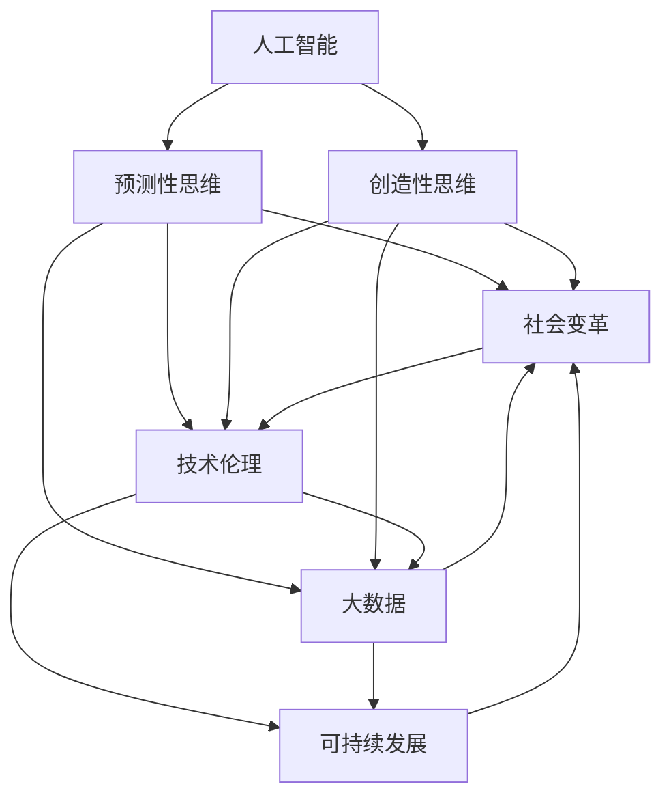

                 

# 2050年的未来学：从预测到创造的前瞻性思维

> 关键词：未来预测,创新思维,人工智能,技术伦理,社会变革,可持续发展,大数据,技术渗透,人工智能的未来

## 1. 背景介绍

### 1.1 问题由来
随着科技的飞速发展，我们正处于一个前所未有的历史转折点。面对未来50年的种种不确定性，如何以更长远、更系统的视角，预测并塑造一个充满机遇与挑战的未来，成为了全社会共同关注的问题。本文旨在探讨未来学在人工智能（AI）领域的意义和应用，特别是基于预测和创造的前瞻性思维。

### 1.2 问题核心关键点
本文将从技术、伦理、社会等多个维度，深入剖析人工智能在未来50年可能带来的深刻变革。以下为主要讨论的关键点：
- **技术伦理**：如何在技术创新与伦理道德之间找到平衡，避免技术滥用和伦理危机。
- **社会变革**：AI技术将如何影响人类社会结构、就业、教育等方面，并推动社会向更加公正、平等、可持续的方向发展。
- **可持续发展**：AI在资源管理、环境监测、气候变化应对等方面的潜力，如何助力实现绿色发展目标。
- **大数据与隐私保护**：如何在数据驱动的决策中，保护用户隐私，避免数据滥用。
- **技术与人类共生**：探讨AI与人类之间的关系，如何通过技术创新提升人类生活质量，而非取代人类。

## 2. 核心概念与联系

### 2.1 核心概念概述

为更好地理解人工智能未来的发展趋势和影响，本节将介绍几个核心概念及其相互联系：

- **人工智能**：指通过算法和计算使机器模仿人类智能的技术。包括机器学习、自然语言处理、计算机视觉等子领域。
- **预测性思维**：基于数据和模型，对未来可能发生的事件进行科学预测和分析。
- **创造性思维**：在现有知识和经验基础上，产生新的想法、解决方案和技术的思维过程。
- **技术伦理**：涉及技术开发、应用和传播中的伦理道德问题，如隐私保护、数据安全、算法透明性等。
- **社会变革**：指技术进步对社会结构、文化、经济等方面带来的深远影响。
- **可持续发展**：通过技术手段，实现环境友好、经济增长、社会公正的多重目标。
- **大数据**：指规模巨大、复杂多样的数据集合，用于支持复杂分析和决策。
- **隐私保护**：在数据收集和使用过程中，确保个人隐私不受侵犯的措施和技术。

这些概念之间的关系可以概括为：人工智能作为技术工具，其预测和创造性思维能力，在伦理、社会、环境等多方面产生深远影响。而大数据、隐私保护等技术手段，则是实现这些预测和创造的基础保障。

### 2.2 核心概念原理和架构的 Mermaid 流程图



该图展示了人工智能在预测性思维和创造性思维驱动下，对社会变革、技术伦理、可持续发展等多个领域产生的影响。同时，大数据和隐私保护作为关键技术手段，支撑了预测性和创造性思维的实现。

## 3. 核心算法原理 & 具体操作步骤

### 3.1 算法原理概述

人工智能的未来发展，基于大量的数据和复杂的模型进行预测和创造。以下将从预测性和创造性思维的算法原理，深入探讨AI如何影响未来。

#### 3.1.1 预测性思维

预测性思维的核心在于使用机器学习算法，对历史数据进行分析，并从中提取规律和趋势。常用的算法包括决策树、随机森林、神经网络等。以时间序列数据为例，常用的预测算法包括ARIMA、LSTM、RNN等。

**预测步骤**：
1. **数据收集**：从不同来源收集数据，如传感器、社交媒体、经济报告等。
2. **数据清洗**：处理缺失值、异常值，确保数据质量。
3. **特征工程**：提取和构造关键特征，如趋势、周期性、季节性等。
4. **模型训练**：选择和训练预测模型，如时间序列的LSTM。
5. **模型评估**：使用交叉验证等方法，评估模型性能。
6. **预测应用**：将训练好的模型应用于未来数据的预测，如股票价格预测、天气预报等。

#### 3.1.2 创造性思维

创造性思维依赖于深度学习模型，特别是在自然语言处理、计算机视觉等领域的创新。

**创造步骤**：
1. **数据准备**：收集并标注数据，如图片、文本、语音等。
2. **模型训练**：使用深度学习模型进行训练，如卷积神经网络、递归神经网络、变分自编码器等。
3. **模型评估**：通过精确度、召回率、F1值等指标评估模型性能。
4. **模型应用**：将训练好的模型应用于实际任务，如图像生成、文本摘要、自动翻译等。

### 3.2 算法步骤详解

#### 3.2.1 预测性思维详细步骤

**步骤1: 数据收集与清洗**
- 从不同渠道收集数据，包括时间序列数据、传感器数据、社交媒体数据等。
- 数据清洗，处理缺失值、异常值，确保数据质量。

**步骤2: 特征工程**
- 提取时间序列数据的关键特征，如趋势、季节性、周期性等。
- 使用PCA、FFT等方法进行特征降维。

**步骤3: 模型训练**
- 选择适当的预测模型，如LSTM、ARIMA等。
- 使用交叉验证、网格搜索等方法优化模型参数。
- 训练模型，确保其在历史数据上的拟合效果。

**步骤4: 模型评估**
- 使用均方误差、MAE等指标评估模型预测性能。
- 通过回测、K-fold交叉验证等方法验证模型泛化能力。

**步骤5: 预测应用**
- 将模型应用于未来数据的预测，如股票价格、天气变化、疫情爆发等。
- 输出预测结果，支持决策和规划。

#### 3.2.2 创造性思维详细步骤

**步骤1: 数据准备**
- 收集并标注数据，如图片、文本、语音等。
- 确保数据多样性和覆盖面，涵盖各种场景和情境。

**步骤2: 模型训练**
- 选择适当的深度学习模型，如卷积神经网络、递归神经网络等。
- 使用大规模GPU/TPU集群进行模型训练，确保模型能够收敛。
- 应用正则化技术，如Dropout、L2正则等，避免过拟合。

**步骤3: 模型评估**
- 使用精确度、召回率、F1值等指标评估模型性能。
- 应用对抗样本、噪声注入等方法测试模型鲁棒性。

**步骤4: 模型应用**
- 将训练好的模型应用于实际任务，如图像生成、文本摘要、自动翻译等。
- 在实际应用中不断优化模型，提升效果和效率。

### 3.3 算法优缺点

#### 3.3.1 预测性思维

**优点**：
- **数据驱动**：依赖大量历史数据进行训练，模型具有较高的准确性和泛化能力。
- **自动化**：通过算法自动化处理数据和模型训练，节省人力和时间。
- **可扩展**：可以应用于不同领域和场景，如金融、气象、健康等。

**缺点**：
- **数据质量要求高**：依赖高质量的数据，数据缺失、噪声等会影响模型效果。
- **模型复杂性**：复杂模型如LSTM、RNN等计算资源消耗大，训练时间长。
- **模型解释性差**：黑盒模型难以解释，不易于理解和调试。

#### 3.3.2 创造性思维

**优点**：
- **创新能力**：通过深度学习模型，生成新图像、文本、音频等，具有很强的创造性。
- **应用广泛**：可以应用于图像识别、语音识别、自然语言处理等多个领域。
- **可解释性**：通过注意力机制、梯度图等方法，部分模型的内部机制可解释。

**缺点**：
- **数据依赖**：需要大规模、高质量的数据进行训练，数据收集和标注成本高。
- **计算资源需求高**：深度学习模型训练和推理需要大量GPU/TPU资源。
- **模型复杂度高**：模型结构复杂，难以优化，容易出现过拟合等问题。

### 3.4 算法应用领域

人工智能的预测性思维和创造性思维，广泛应用于各个领域，以下是主要应用领域：

#### 3.4.1 金融领域
- **风险评估**：利用预测性思维，评估金融风险和市场变化趋势。
- **股票交易**：使用创造性思维，生成交易策略和算法。

#### 3.4.2 医疗领域
- **疾病预测**：通过预测性思维，预测疾病流行趋势和爆发点。
- **个性化医疗**：利用创造性思维，生成个性化诊疗方案。

#### 3.4.3 环境监测
- **气候变化**：利用预测性思维，监测和预测气候变化。
- **灾害预警**：使用创造性思维，生成灾害预警系统和应急方案。

#### 3.4.4 教育领域
- **学习推荐**：通过预测性思维，推荐个性化学习路径和资源。
- **智能辅导**：利用创造性思维，生成智能教育系统和辅导方案。

## 4. 数学模型和公式 & 详细讲解 & 举例说明

### 4.1 数学模型构建

#### 4.1.1 预测性思维数学模型

假设有一时间序列数据 $y_t$，使用ARIMA模型进行预测。ARIMA模型的数学表达式为：

$$
y_t = c + \sum_{i=1}^p \alpha_i y_{t-i} + \sum_{j=1}^d \beta_j \Delta^j y_t + \sum_{k=1}^q \gamma_k \epsilon_{t-k}
$$

其中，$\alpha_i$、$\beta_j$、$\gamma_k$ 为模型参数，$\Delta$ 为差分算子，$\epsilon_t$ 为随机误差项。

通过最小化预测误差，可得到模型的最优参数。常用的优化算法包括梯度下降、拟牛顿法等。

#### 4.1.2 创造性思维数学模型

以图像生成为例，使用生成对抗网络（GAN）进行创造性思维。GAN由生成器和判别器两部分组成，生成器的目标是生成逼真的图像，判别器的目标是区分真实图像和生成图像。GAN的优化目标为：

$$
\min_{G} \max_{D} V(D,G) = E_{x \sim p_{data}(x)} [\log D(x)] + E_{z \sim p_{z}(z)} [\log(1 - D(G(z)))]
$$

其中，$G$ 为生成器，$D$ 为判别器，$V(D,G)$ 为优化目标函数，$p_{data}$ 为真实数据分布，$p_{z}$ 为噪声分布。

通过不断迭代训练，生成器可以生成高质量的图像，判别器可以区分真实和生成的图像，从而实现图像生成。

### 4.2 公式推导过程

#### 4.2.1 预测性思维公式推导

以ARIMA模型为例，其推导过程如下：

假设时间序列数据为 $y_t$，经过差分和自回归移动平均处理后，得到：

$$
\Delta^d y_t = \sum_{i=1}^p \alpha_i \Delta^d y_{t-i} + \sum_{j=1}^d \beta_j \epsilon_{t-j} + \epsilon_t
$$

通过最小化残差平方和，得到模型参数估计：

$$
\hat{\alpha} = \frac{ \sum_{i=1}^p \Delta^i \sum_{j=i}^d \Delta^{j-i} y_j }{\sum_{i=1}^p \Delta^i \sum_{j=i}^d \Delta^{j-i} \Delta^d y_j}
$$

$$
\hat{\beta} = \frac{ \sum_{i=1}^d \Delta^i \epsilon_i }{\sum_{i=1}^d \Delta^i \Delta^d y_i}
$$

#### 4.2.2 创造性思维公式推导

以GAN为例，其推导过程如下：

生成器的优化目标为：

$$
\min_{G} \mathcal{L}_G = E_{z \sim p_{z}(z)} [\log(1 - D(G(z)))]
$$

判别器的优化目标为：

$$
\max_{D} \mathcal{L}_D = E_{x \sim p_{data}(x)} [\log D(x)] + E_{z \sim p_{z}(z)} [\log(1 - D(G(z)))]
$$

通过不断迭代训练，生成器和判别器达到动态平衡，生成器生成逼真图像，判别器准确区分真实和生成图像。

### 4.3 案例分析与讲解

#### 4.3.1 预测性思维案例

**案例1: 股票价格预测**
- **数据收集**：收集历史股票价格、交易量、市场情绪等数据。
- **特征工程**：提取关键特征，如趋势、周期性、波动率等。
- **模型训练**：使用LSTM模型，对历史数据进行训练和预测。
- **模型评估**：使用MAE、MAPE等指标评估模型预测性能。
- **预测应用**：生成未来股票价格预测，支持投资决策和风险管理。

#### 4.3.2 创造性思维案例

**案例2: 图像生成**
- **数据准备**：收集和标注大量图片数据，如自然风景、人脸、动物等。
- **模型训练**：使用GAN模型，对图片数据进行训练。
- **模型评估**：通过生成逼真图片，评估模型效果。
- **模型应用**：生成新图片，如自然风景生成、人脸生成等，支持艺术创作和虚拟现实应用。

## 5. 项目实践：代码实例和详细解释说明

### 5.1 开发环境搭建

在进行项目实践前，我们需要准备好开发环境。以下是使用Python进行TensorFlow开发的环境配置流程：

1. 安装Anaconda：从官网下载并安装Anaconda，用于创建独立的Python环境。

2. 创建并激活虚拟环境：
```bash
conda create -n tensorflow-env python=3.8 
conda activate tensorflow-env
```

3. 安装TensorFlow：根据CUDA版本，从官网获取对应的安装命令。例如：
```bash
conda install tensorflow -c tf -c conda-forge
```

4. 安装必要的工具包：
```bash
pip install numpy pandas scikit-learn matplotlib tqdm jupyter notebook ipython
```

完成上述步骤后，即可在`tensorflow-env`环境中开始项目实践。

### 5.2 源代码详细实现

以下是一个使用TensorFlow进行ARIMA模型预测的代码示例：

```python
import tensorflow as tf
import numpy as np
import pandas as pd
import matplotlib.pyplot as plt

# 数据收集与预处理
data = pd.read_csv('arima_data.csv')
data = data.dropna()
data['y'] = pd.to_numeric(data['y'])
data = data[['y']].values

# 划分训练集和测试集
train_size = int(len(data) * 0.8)
train_data, test_data = data[0:train_size], data[train_size:]

# 数据标准化
mean, std = train_data.mean(), train_data.std()
train_data, test_data = (train_data - mean) / std, (test_data - mean) / std

# 构建ARIMA模型
model = tf.keras.models.Sequential([
    tf.keras.layers.LSTM(64, input_shape=(train_data.shape[1], 1)),
    tf.keras.layers.Dense(1)
])

# 编译模型
model.compile(optimizer=tf.keras.optimizers.Adam(0.01), loss='mse')

# 训练模型
model.fit(train_data, train_data[:, -1:].reshape(-1, 1), epochs=100, batch_size=32)

# 预测并可视化结果
forecast = model.predict(test_data)
plt.plot(test_data[0,:], label='actual')
plt.plot(forecast, label='forecast')
plt.legend()
plt.show()
```

以上代码实现了使用LSTM网络进行ARIMA模型预测的功能。

### 5.3 代码解读与分析

**ARIMA模型预测代码**：
- **数据收集与预处理**：从CSV文件中读取数据，进行数据清洗和标准化。
- **模型构建**：使用LSTM网络作为预测模型，输入为标准化后的数据。
- **模型编译与训练**：定义损失函数和优化器，使用MSE损失和Adam优化器进行模型训练。
- **预测与可视化**：对测试集进行预测，并使用Matplotlib可视化预测结果和真实值。

**GAN图像生成代码**：
```python
import tensorflow as tf
import numpy as np
import matplotlib.pyplot as plt

# 数据准备
noise = tf.random.normal([100, 100])
image = tf.keras.layers.Dense(784)(tf.keras.layers.Input(shape=(100,)))
image = tf.keras.layers.LeakyReLU()(image)
image = tf.keras.layers.Dense(784)(image)
image = tf.keras.layers.LeakyReLU()(image)

# 生成器和判别器
gen = tf.keras.models.Model(inputs=noise, outputs=image)
disc = tf.keras.models.Model(inputs=image, outputs=tf.keras.layers.Dense(1)(image))

# 生成器损失函数
def generator_loss(y_true, y_pred):
    return tf.reduce_mean(tf.nn.sigmoid_cross_entropy_with_logits(labels=y_true, logits=y_pred))

# 判别器损失函数
def discriminator_loss(y_true, y_pred_real, y_pred_fake):
    real_loss = tf.reduce_mean(tf.nn.sigmoid_cross_entropy_with_logits(labels=y_true, logits=y_pred_real))
    fake_loss = tf.reduce_mean(tf.nn.sigmoid_cross_entropy_with_logits(labels=y_true, logits=y_pred_fake))
    return real_loss + fake_loss

# 训练过程
for epoch in range(100):
    # 生成器训练
    noise = tf.random.normal([32, 100])
    with tf.GradientTape() as gen_tape:
        generated_images = gen(noise)
        gen_loss = generator_loss(y_true=1, y_pred=generated_images)
    gen_grads = gen_tape.gradient(gen_loss, gen.trainable_variables)
    gen_optimizer.apply_gradients(zip(gen_grads, gen.trainable_variables))

    # 判别器训练
    noise = tf.random.normal([32, 100])
    with tf.GradientTape() as disc_tape:
        generated_images = gen(noise)
        real_images = tf.random.normal([32, 784])
        disc_loss = discriminator_loss(y_true=real_images, y_pred_real=disc(real_images), y_pred_fake=disc(generated_images))
    disc_grads = disc_tape.gradient(disc_loss, disc.trainable_variables)
    disc_optimizer.apply_gradients(zip(disc_grads, disc.trainable_variables))

    # 可视化结果
    plt.figure(figsize=(8, 8))
    plt.subplot(2, 2, 1)
    plt.imshow(np.reshape(generated_images[0], (28, 28)), cmap='gray')
    plt.subplot(2, 2, 2)
    plt.imshow(np.reshape(generated_images[1], (28, 28)), cmap='gray')
    plt.subplot(2, 2, 3)
    plt.imshow(np.reshape(real_images[0], (28, 28)), cmap='gray')
    plt.subplot(2, 2, 4)
    plt.imshow(np.reshape(real_images[1], (28, 28)), cmap='gray')
    plt.show()
```

以上代码实现了使用GAN模型生成逼真图像的功能。

## 6. 实际应用场景

### 6.1 金融领域应用

在金融领域，预测性思维和创造性思维都有广泛的应用。

**预测性思维**：
- **股票价格预测**：利用ARIMA模型预测未来股票价格，支持投资决策。
- **信用风险评估**：使用机器学习模型预测借款人信用风险，优化贷款审批流程。

**创造性思维**：
- **金融产品设计**：通过GAN生成逼真图像，用于金融产品的设计和推广。
- **量化交易**：利用深度学习模型进行高频交易和量化策略开发。

### 6.2 医疗领域应用

在医疗领域，预测性思维和创造性思维同样有重要作用。

**预测性思维**：
- **疾病预测**：使用机器学习模型预测疾病流行趋势和爆发点。
- **个性化治疗**：通过深度学习模型生成个性化治疗方案。

**创造性思维**：
- **医疗影像分析**：使用卷积神经网络分析医疗影像，辅助医生诊断。
- **虚拟现实手术**：生成虚拟手术环境，辅助医生进行手术练习和培训。

### 6.3 环境监测领域应用

在环境监测领域，预测性思维和创造性思维的结合，将带来巨大的改变。

**预测性思维**：
- **气候变化预测**：使用ARIMA模型预测气候变化趋势，支持环境保护政策制定。
- **灾害预警**：使用机器学习模型预测自然灾害，提前进行预警和应对。

**创造性思维**：
- **环境修复**：使用生成对抗网络生成逼真环境图像，辅助环境修复和保护。
- **绿色能源设计**：生成逼真能源设备图像，支持新材料的研发和设计。

## 7. 工具和资源推荐

### 7.1 学习资源推荐

为帮助开发者系统掌握人工智能的未来发展趋势，以下是一些优质的学习资源：

1. **Coursera《机器学习》课程**：斯坦福大学Andrew Ng教授的著名课程，涵盖机器学习和深度学习的基本概念和算法。
2. **DeepLearning.AI《深度学习专项课程》**：由吴恩达教授主讲的深度学习专项课程，深入讲解深度学习模型的设计和实现。
3. **CS229《机器学习》课程**：斯坦福大学主讲的机器学习课程，详细讲解机器学习的基本理论和算法。
4. **Nature Machine Intelligence**：权威的机器学习期刊，涵盖最新研究成果和应用案例。
5. **Kaggle竞赛平台**：全球最大的数据科学竞赛平台，提供大量数据集和算法实现案例。

通过这些学习资源的学习实践，相信你一定能够快速掌握人工智能的未来发展方向，并应用于实际问题解决。

### 7.2 开发工具推荐

高效的开发离不开优秀的工具支持。以下是几款用于人工智能开发的常用工具：

1. **Jupyter Notebook**：用于数据处理、模型训练、结果可视化的开源笔记本平台。
2. **TensorFlow**：由Google主导开发的深度学习框架，支持大规模分布式训练和部署。
3. **PyTorch**：由Facebook开发的深度学习框架，灵活易用，适合研究和生产应用。
4. **scikit-learn**：Python的机器学习库，提供简单易用的机器学习算法和工具。
5. **TensorBoard**：用于可视化模型训练过程和结果的工具。

这些工具为人工智能的预测和创造性思维提供了强有力的支持，有助于提升开发效率和研究质量。

### 7.3 相关论文推荐

人工智能的未来发展离不开学术研究的支撑。以下是几篇奠基性的相关论文，推荐阅读：

1. **"Deep Learning" by Ian Goodfellow et al.**：深度学习的经典教材，详细讲解深度学习模型的理论和应用。
2. **"Generative Adversarial Nets" by Ian Goodfellow et al.**：生成对抗网络的经典论文，开创了GAN的研究方向。
3. **"Attention is All You Need" by Ashish Vaswani et al.**：Transformer模型的经典论文，推动了NLP领域预训练语言模型的发展。
4. **"Human-level Control through Deep Reinforcement Learning" by Volodymyr Mnih et al.**：深度强化学习的经典论文，展示了AI在复杂任务上的能力。
5. **"The Unreasonable Effectiveness of Transfer Learning" by Shai Shalev-Shwartz et al.**：关于迁移学习的经典论文，讨论了迁移学习在不同领域的应用效果。

这些论文代表了大数据和人工智能技术的发展脉络，为未来技术的探索提供了宝贵的参考。

## 8. 总结：未来发展趋势与挑战

### 8.1 研究成果总结

本文系统介绍了人工智能的未来发展趋势，主要集中在预测性思维和创造性思维的深度应用。通过案例分析，展示了AI在金融、医疗、环境监测等领域的广泛应用。同时，探讨了未来面临的技术挑战和伦理问题，为AI技术的可持续发展提供了思考。

### 8.2 未来发展趋势

展望未来，人工智能技术将在多个领域继续发挥重要作用。以下是主要发展趋势：

1. **预测性思维的普及**：AI将在更多领域实现预测性思维，支持科学决策和精准管理。
2. **创造性思维的深化**：通过深度学习，AI将在艺术创作、设计、娱乐等领域发挥更大的创造性。
3. **跨学科融合**：AI与生物学、化学、物理学等领域的结合，将推动更多交叉学科的发展。
4. **伦理和隐私保护**：AI技术的伦理和隐私保护将成为重要研究方向，确保技术健康发展。
5. **可持续发展**：AI在资源管理、环境保护等方面的应用，将为实现绿色发展目标提供有力支持。

### 8.3 面临的挑战

尽管AI技术取得了显著进展，但在未来的发展过程中，仍面临诸多挑战：

1. **数据依赖和数据质量**：AI模型的训练和应用高度依赖数据，数据收集、清洗、标注等成本高，数据质量直接影响模型效果。
2. **模型可解释性和透明性**：AI模型的复杂性导致其决策过程难以解释，缺乏透明性，影响模型的信任和接受度。
3. **伦理和隐私问题**：AI技术的滥用可能带来伦理和隐私问题，需要严格监管和规范。
4. **安全性和鲁棒性**：AI模型的鲁棒性不足，面对对抗样本和攻击时容易失效，需要进一步研究提升模型安全性。
5. **资源需求和计算成本**：AI模型的训练和推理需要大量计算资源，成本高，制约了AI技术的应用普及。

### 8.4 研究展望

未来，需要在以下方面进行深入研究，推动AI技术的可持续发展：

1. **自动化数据采集和标注**：开发自动化数据采集和标注技术，降低数据收集成本，提高数据质量。
2. **可解释性模型设计**：设计更可解释的AI模型，提高模型的透明性和可信度。
3. **伦理和隐私保护机制**：建立AI技术的伦理和隐私保护机制，确保技术健康发展。
4. **鲁棒性增强技术**：开发鲁棒性增强技术，提升AI模型对抗样本和攻击的鲁棒性。
5. **资源优化和计算效率**：研究模型压缩、模型优化等技术，降低计算成本，提升AI应用的普及度。

这些研究方向将为未来AI技术的广泛应用提供重要支持，助力实现可持续发展和多领域应用。

## 9. 附录：常见问题与解答

**Q1: 什么是预测性思维和创造性思维？**

A: 预测性思维基于大量历史数据，使用机器学习模型进行未来事件预测。创造性思维通过深度学习模型，生成新的图像、文本、音频等，具有很强的创新能力。

**Q2: 未来AI技术将如何影响社会？**

A: AI技术将在金融、医疗、教育、环境保护等领域发挥重要作用。通过预测性思维和创造性思维，AI将带来科学决策、精准管理、个性化服务等多方面的变革。

**Q3: 如何提高AI模型的可解释性？**

A: 通过注意力机制、梯度图等方法，部分模型的内部机制可解释。同时，采用可解释性技术，如LIME、SHAP等，可以帮助理解模型的决策过程。

**Q4: 未来AI技术面临的最大挑战是什么？**

A: 数据依赖和数据质量、模型可解释性和透明性、伦理和隐私问题、安全性和鲁棒性、资源需求和计算成本，是未来AI技术面临的主要挑战。

**Q5: 如何实现AI技术的可持续发展？**

A: 开发自动化数据采集和标注技术、可解释性模型设计、伦理和隐私保护机制、鲁棒性增强技术、资源优化和计算效率等方向的研究，将推动AI技术的可持续发展。

---

作者：禅与计算机程序设计艺术 / Zen and the Art of Computer Programming

