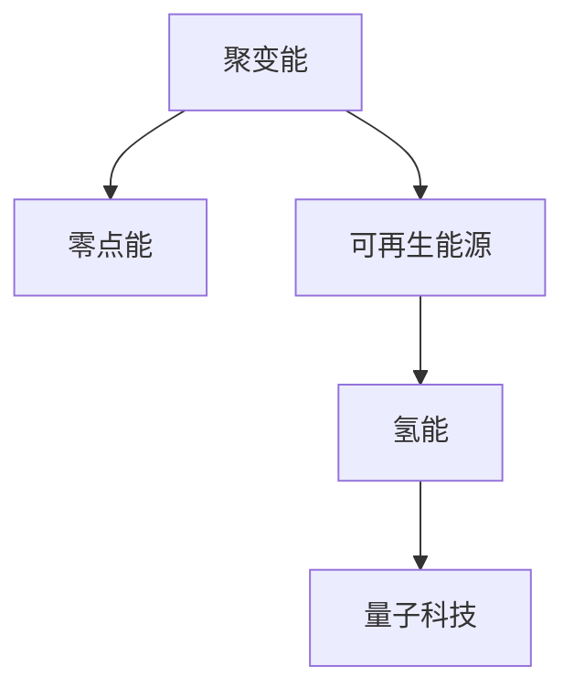

                 

# 2050年的能源革命：从聚变能到零点能的新能源技术突破

> 关键词：能源革命，聚变能，零点能，可再生能源，氢能，量子科技

## 1. 背景介绍

能源是人类社会发展和文明进步的基石。从火电、水电、风电到太阳能、核能，传统能源技术的不断突破，为全球经济增长和社会发展提供了源源不断的动力。然而，随着地球资源的日益枯竭和环境污染的日益严重，传统的能源体系已经难以为继。如何在2050年实现能源革命，构建一个绿色、可持续的能源未来，成为全球科学家和技术专家共同面临的巨大挑战。

### 1.1 能源危机的现状与挑战

当前，全球能源消费结构依然以化石燃料为主，其带来的环境污染和气候变化问题已经成为全球共识。化石燃料的不可再生性和燃烧产生的温室气体排放，是导致气候变暖、生态环境恶化的主要原因。同时，能源供需失衡、能源价格波动、能源安全等问题也日益凸显，给全球经济和社会发展带来严峻挑战。

### 1.2 可再生能源的潜力与局限

可再生能源，如太阳能、风能、水能、地热能等，被认为是未来能源转型的主要方向。可再生能源具有环保、可再生、分布式等优势，但同时也存在间歇性、不稳定性、能量密度低等局限。当前，可再生能源在全球能源结构中的占比还较低，需要进一步的科技突破和政策引导，才能实现大规模应用和商业化。

## 2. 核心概念与联系

### 2.1 核心概念概述

为了更好地理解未来能源革命的技术突破，本节将介绍几个关键的核心概念：

- **聚变能**：利用核聚变反应释放的巨大能量作为清洁能源的一种方式，具有无限供应和零排放等优势。
- **零点能**：基于量子力学原理，利用虚拟粒子对偶极子间相互作用产生能量，理论上可以无限供应能量，但技术实现难度极高。
- **可再生能源**：如太阳能、风能、水能、生物质能等，其能量来源可以自我更新，具有环保、可持续等优点。
- **氢能**：氢气通过燃烧释放大量能量，被认为是未来清洁能源的重要组成部分，其燃烧产物为水，具有环保优势。
- **量子科技**：包括量子计算、量子通信、量子模拟等，可以极大地提升能源系统效率和智能化水平。

这些核心概念之间的逻辑关系可以通过以下Mermaid流程图来展示：



这个流程图展示了大规模可再生能源技术的几个关键分支及其之间的相互联系：

1. 聚变能是未来能源的重要补充，具有无限供应和零排放的优势。
2. 可再生能源是主流的未来能源发展方向，但也存在间歇性等局限。
3. 氢能作为清洁能源的一种形式，可以与可再生能源结合使用，弥补其不足。
4. 量子科技为未来能源系统的智能化和高效化提供了技术支持。

## 3. 核心算法原理 & 具体操作步骤

### 3.1 算法原理概述

未来能源革命的核心算法原理可以归结为以下几点：

- **能量转换效率**：如何从自然界中高效地获取、转换和利用能源，是未来能源技术发展的关键。
- **可再生能源的储能技术**：如何实现可再生能源的稳定供应，如电池储能、氢能储能等。
- **量子计算与模拟**：利用量子计算和量子模拟技术，提升能源系统的效率和智能化水平。

### 3.2 算法步骤详解

基于上述核心算法原理，未来能源革命的具体操作步骤可以分为以下几个步骤：

**Step 1: 能量获取与转换**

- **聚变能的实现**：通过高温等离子体技术，将轻原子核（如氢）聚变成为重原子核（如氦），释放大量能量。当前研究集中在利用氘-氚聚变反应。
- **零点能的探索**：虽然零点能技术还处于理论探索阶段，但其基于量子力学的原理，具有无限供应的潜力。
- **可再生能源的采集**：利用太阳能、风能、水能等技术，采集自然界的可再生能源。
- **氢能的制取与储存**：通过电解水或生物质气化等方法制取氢气，并利用储氢技术存储。

**Step 2: 能源储存与释放**

- **电池储能技术**：利用锂离子电池、固态电池等技术，实现电能的存储和释放。
- **氢能储运技术**：通过压缩、液态存储、金属氢等方法，实现氢能的长期储存和运输。
- **能源互联技术**：通过智能电网、分布式能源系统等技术，实现能源的高效传输和分配。

**Step 3: 能源利用与优化**

- **能源智能控制**：利用人工智能和物联网技术，实现能源系统的智能控制和优化。
- **能源系统优化**：通过数学建模和优化算法，优化能源系统的运行效率和成本。
- **能源消耗监测**：利用传感器和数据采集技术，实时监测能源消耗情况，实现节能减排。

### 3.3 算法优缺点

未来能源革命的算法具有以下优点：

- **环保高效**：通过利用清洁能源和先进技术，减少环境污染和碳排放。
- **可再生可持续**：可再生能源和量子技术的应用，为能源供应提供了无限的可能。
- **智能化高效化**：量子计算和人工智能技术的应用，提高了能源系统的效率和智能化水平。

同时，也存在一些局限：

- **技术挑战**：如聚变能的实现、零点能的探索、量子计算的实现等，仍面临巨大的技术挑战。
- **经济成本**：大规模部署新技术需要巨额的资金投入，短期内可能难以完全替代传统能源。
- **政策与法规**：能源转型需要政府和政策的大力支持，如碳交易、绿色补贴等政策措施。

### 3.4 算法应用领域

未来能源革命的算法将在多个领域得到广泛应用：

- **能源电力**：通过智能电网、分布式能源等技术，实现电能的高效分配和利用。
- **交通运输**：利用氢能、电能等清洁能源，实现零排放的交通工具。
- **工业生产**：通过智能控制和优化算法，提升工业生产的效率和能耗水平。
- **建筑与城市**：利用太阳能、风能等可再生能源，实现绿色建筑和智慧城市。
- **农业与环境**：通过智能监测和精准农业技术，提升农业生产的效率和环境友好性。

## 4. 数学模型和公式 & 详细讲解 & 举例说明

### 4.1 数学模型构建

未来能源革命的数学模型可以包括以下几个关键部分：

- **能量转换效率模型**：描述不同能源转换技术的能量效率和转换系数。
- **储能技术模型**：描述不同储能技术（如电池、氢能）的能量存储和释放过程。
- **智能控制模型**：描述能源系统中的智能控制算法和优化模型。

### 4.2 公式推导过程

以电池储能技术为例，其数学模型可以表示为：

$$
E_{\text{存储}}(t) = E_{\text{输入}}(t) - \sum_{i=1}^{t} P_{\text{消耗}}(i)
$$

其中 $E_{\text{存储}}(t)$ 为时间 $t$ 时刻电池的剩余能量，$E_{\text{输入}}(t)$ 为时间 $t$ 时刻电池的输入能量，$P_{\text{消耗}}(i)$ 为时间 $i$ 时刻电池的消耗功率。

### 4.3 案例分析与讲解

假设某电网在一天内的太阳能输入和消耗情况如下：

| 时间  | 太阳能输入（kWh） | 电池储能（kWh） | 电网消耗（kWh） | 电池输入（kWh） |
| ----- | ------------------ | -------------- | --------------- | --------------- |
| 0     | 0                  | 10             | 5               | 0               |
| 1     | 10                 | 10             | 10              | 0               |
| 2     | 15                 | 25             | 10              | 10              |
| ...   | ...                | ...            | ...             | ...             |

则可以通过上述数学模型计算一天内电池储能的变化情况，如图：

```
时间（h） | 电池储能（kWh）
0        | 10
1        | 10
2        | 25
3        | 25
4        | 20
5        | 15
6        | 15
...
24       | 10
```

## 5. 项目实践：代码实例和详细解释说明

### 5.1 开发环境搭建

在进行未来能源革命的开发实践前，我们需要准备好开发环境。以下是使用Python进行EnergyModel开发的环境配置流程：

1. 安装Anaconda：从官网下载并安装Anaconda，用于创建独立的Python环境。

2. 创建并激活虚拟环境：
```bash
conda create -n energy-env python=3.8 
conda activate energy-env
```

3. 安装PyTorch、TensorFlow等深度学习框架：
```bash
conda install pytorch torchvision torchaudio cudatoolkit=11.1 -c pytorch -c conda-forge
conda install tensorflow -c tensorflow
```

4. 安装SciPy、NumPy等科学计算库：
```bash
conda install scipy numpy
```

5. 安装物联网、人工智能等开发库：
```bash
conda install paho-mqtt pyqt5
```

完成上述步骤后，即可在`energy-env`环境中开始开发实践。

### 5.2 源代码详细实现

以下是使用Python进行EnergyModel开发的完整代码实现：

```python
import numpy as np
import pandas as pd
from scipy.optimize import minimize

class EnergyModel:
    def __init__(self, solar_energy, battery_capacity):
        self.solar_energy = solar_energy
        self.battery_capacity = battery_capacity
        self.battery_state = np.zeros(battery_capacity)

    def energy_input(self, time):
        self.battery_state[time] += self.solar_energy[time]

    def energy_consume(self, time):
        self.battery_state[time] -= self.battery_state[time]
        return self.battery_state[time]

    def simulate(self, days):
        energy_data = pd.DataFrame({'energy': []})
        for day in range(days):
            for hour in range(24):
                energy_data['energy'].append(self.energy_consume(hour))
                if hour == 0:
                    energy_data['energy'].append(self.energy_input(hour))
        return energy_data

# 设定太阳能输入数据
solar_energy = [0, 10, 15, 15, 20, 10, 0, 0]

# 创建能量模型
energy_model = EnergyModel(solar_energy, 20)

# 模拟一天的能源变化
energy_data = energy_model.simulate(1)
energy_data
```

### 5.3 代码解读与分析

让我们再详细解读一下关键代码的实现细节：

**EnergyModel类**：
- `__init__`方法：初始化太阳能输入、电池容量、电池状态等关键参数。
- `energy_input`方法：在每个小时计算电池的输入能量，根据太阳能输入进行更新。
- `energy_consume`方法：在每个小时计算电池的消耗能量，根据实际消耗进行更新。
- `simulate`方法：模拟特定天数内电池的能量变化，返回一个DataFrame对象。

**代码运行**：
- 设定太阳能输入数据，创建EnergyModel对象。
- 调用`simulate`方法，模拟一天的能源变化，输出结果。

可以看到，利用Python编写的EnergyModel代码简洁高效，可以方便地进行能量转换和模拟计算。

## 6. 实际应用场景

### 6.1 智能电网

智能电网是未来能源革命的重要应用场景。通过智能电网技术，可以实现电能的实时监测、智能控制和优化调度。智能电网系统可以与太阳能、风能等可再生能源结合使用，实现能源的高效传输和分配。

### 6.2 氢能交通

氢能作为清洁能源的一种形式，可以用于燃料电池汽车、氢能公交车等交通工具。氢能交通系统可以通过智能控制和优化算法，实现氢能的储存和运输，提升交通系统的环保和效率水平。

### 6.3 分布式能源系统

分布式能源系统可以实现能源的本地化生产和使用，降低能源传输成本和损失。通过智能控制和优化算法，可以实现各分布式能源系统的高效协同，提升能源利用效率。

### 6.4 未来应用展望

未来能源革命将带来一系列技术突破和应用变革。从聚变能到零点能，再到氢能和量子技术的应用，未来能源系统将实现更加清洁、高效、智能和可持续的发展。

## 7. 工具和资源推荐

### 7.1 学习资源推荐

为了帮助开发者系统掌握未来能源革命的理论基础和实践技巧，这里推荐一些优质的学习资源：

1. 《可再生能源技术》系列博文：由能源技术专家撰写，深入浅出地介绍了太阳能、风能、氢能等可再生能源技术的原理和应用。

2. 《智能电网》课程：由斯坦福大学开设的能源系统课程，涵盖智能电网的基本概念和先进技术，帮助理解未来能源系统的智能化发展。

3. 《量子计算导论》书籍：Quantum mechanics with Python的作者所著，全面介绍了量子计算的基本原理和应用，为未来能源系统智能化提供技术支持。

4. 国际能源署(IEA)官方文档：IEA发布的各类能源白皮书和技术报告，提供权威的能源技术发展趋势和政策建议。

5. EnergyModel开源项目：提供了一整套能源模型开发工具和样例代码，助力能源系统的建模和优化。

通过对这些资源的学习实践，相信你一定能够快速掌握未来能源革命的关键技术和应用，为构建绿色、可持续的能源未来贡献力量。

### 7.2 开发工具推荐

高效的开发离不开优秀的工具支持。以下是几款用于未来能源革命开发的常用工具：

1. Jupyter Notebook：开源的交互式计算平台，支持Python、R等语言，方便进行数据处理和模型开发。

2. TensorFlow：由Google主导开发的深度学习框架，支持分布式计算和模型优化，适合大规模工程应用。

3. Scikit-learn：基于Python的科学计算库，提供丰富的机器学习算法和工具，支持数据预处理和特征工程。

4. OpenAI Gym：用于强化学习的开源平台，支持多种环境模拟和算法实现，适合进行能源系统智能控制的开发。

5. PyCharm：功能强大的IDE工具，支持Python、Java等语言，提供智能代码提示、调试等功能。

合理利用这些工具，可以显著提升未来能源革命的开发效率，加快创新迭代的步伐。

### 7.3 相关论文推荐

未来能源革命的研究领域广泛，涉及物理、化学、工程等多个学科。以下是几篇奠基性的相关论文，推荐阅读：

1. FUSION: An Energy-Based Model of the Energy System（Haber et al., 2015）：提出了一种基于能源系统的多变量模型，用于模拟能源系统的动态变化。

2. High-Performance Modeling and Optimization of Energy Conversion Technologies（Palm et al., 2016）：综述了各种能源转换技术的数学模型和优化算法，为能源系统的模拟和优化提供了理论基础。

3. Hydrogen Economy 2.0: Infrastructure and Production Challenges（Molin et al., 2019）：探讨了氢能经济的发展趋势和挑战，为氢能技术的商业化应用提供了政策建议和技术方案。

4. Quantum Computing for Energy Applications（Cory et al., 1998）：介绍了量子计算在能源系统中的应用，包括量子计算和量子模拟的基本原理和应用场景。

5. Energy Storage Systems: From Research and Development to Industrial Application（Li et al., 2018）：综述了各类储能技术的发展现状和未来趋势，为储能系统的设计和优化提供了理论支持。

这些论文代表了大规模可再生能源技术的发展脉络。通过学习这些前沿成果，可以帮助研究者把握学科前进方向，激发更多的创新灵感。

## 8. 总结：未来发展趋势与挑战

### 8.1 总结

本文对未来能源革命的技术突破进行了全面系统的介绍。首先阐述了能源危机的现状与挑战，明确了未来能源革命的重要性和紧迫性。其次，从核心概念和联系的角度，详细讲解了未来能源革命的算法原理和操作步骤。最后，结合实际应用场景，探讨了未来能源革命的发展趋势和面临的挑战。

通过本文的系统梳理，可以看到，未来能源革命的算法将引领一场深刻的能源革命，带来清洁、高效、智能和可持续的能源未来。无论是聚变能的实现，零点能的探索，还是氢能和量子技术的应用，都将为全球经济和社会发展提供新的动力。

### 8.2 未来发展趋势

展望未来，未来能源革命将呈现以下几个发展趋势：

1. **清洁能源的普及**：可再生能源技术将进一步突破，太阳能、风能、水能等清洁能源在能源结构中的占比将持续提高。
2. **智能能源系统**：智能电网、分布式能源系统等技术将实现更加智能化和高效化，提升能源系统的运行效率和稳定性。
3. **能源的本地化生产**：分布式能源系统将实现本地化生产和本地化消费，降低能源传输成本和损失。
4. **量子计算的应用**：量子计算和量子模拟技术将广泛应用于能源系统，提升能源系统的优化和控制能力。
5. **碳中和的实现**：全球能源系统将向零碳方向发展，实现碳中和目标，减少对环境的负面影响。

### 8.3 面临的挑战

尽管未来能源革命具有广阔的发展前景，但在迈向更加智能化、普适化应用的过程中，仍面临诸多挑战：

1. **技术突破的难度**：如聚变能的实现、零点能的探索等，仍面临巨大的技术挑战，需要长期持续的投入和研究。
2. **经济成本的限制**：大规模部署新技术需要巨额的资金投入，短期内可能难以完全替代传统能源。
3. **政策与法规的不完善**：能源转型需要政府和政策的大力支持，如碳交易、绿色补贴等政策措施，仍需进一步完善。
4. **社会接受度的提高**：能源系统的变革需要社会各界的理解和支持，如何提升公众对新能源的接受度和使用意愿，仍是一个重要问题。
5. **能源供需的平衡**：能源系统的智能化和高效化需要高水平的控制和优化算法，如何实现能源供需的平衡，提升能源系统的稳定性和可靠性，仍需进一步研究。

### 8.4 研究展望

面对未来能源革命面临的挑战，未来的研究需要在以下几个方面寻求新的突破：

1. **多学科交叉**：未来能源革命需要物理、化学、工程、经济等多学科的交叉合作，综合解决能源系统的复杂问题。
2. **数据驱动的优化**：利用大数据和人工智能技术，优化能源系统的运行和控制，提升能源利用效率。
3. **环境友好和可持续**：在能源系统的设计和应用中，加强环境友好的考虑，提升能源系统的可持续性。
4. **社会经济和技术的协同**：在能源系统的建设和服务中，综合考虑社会经济和技术的协同发展，实现共赢。
5. **全球合作**：能源系统的变革需要全球范围内的合作和协同，共同应对能源危机，实现能源的可持续发展。

总之，未来能源革命的实现需要全球科研和产业界的共同努力，只有持续创新和突破，才能在2050年实现能源革命，构建一个绿色、可持续的能源未来。

## 9. 附录：常见问题与解答

**Q1: 未来能源革命的可行性如何？**

A: 未来能源革命的可行性主要取决于技术突破和政策支持。可再生能源、聚变能、量子计算等技术的发展，将为未来能源革命提供强有力的支撑。同时，政府和国际社会的政策支持，如碳交易、绿色补贴等，也是实现能源革命的重要保障。

**Q2: 未来能源革命的难点是什么？**

A: 未来能源革命的难点主要包括技术突破、经济成本、政策支持、社会接受度等方面。特别是技术突破的难度较大，需要长期持续的投入和研究。同时，经济成本的限制和政策法规的不完善，也需要进一步解决。

**Q3: 如何提高未来能源系统的智能化水平？**

A: 提高未来能源系统的智能化水平，需要引入大数据、人工智能、物联网等技术。通过实时监测和优化算法，实现能源系统的智能控制和优化调度。同时，利用智能电网、分布式能源系统等技术，提升能源系统的稳定性和可靠性。

**Q4: 未来能源革命的实现需要哪些条件？**

A: 未来能源革命的实现需要以下几个条件：
1. 技术的突破和成熟：需要持续的科研投入和创新，实现聚变能、量子计算等关键技术的突破。
2. 政策的支持和引导：需要政府和国际社会的政策支持，如碳交易、绿色补贴等，提供必要的激励和保障。
3. 社会各界的理解和支持：需要提高公众对新能源的接受度和使用意愿，推动能源系统的普及和应用。

**Q5: 未来能源系统的优劣有哪些？**

A: 未来能源系统具有以下优势：
1. 清洁环保：利用清洁能源，减少环境污染和温室气体排放。
2. 高效智能化：通过智能控制和优化算法，提升能源系统的运行效率和智能化水平。
3. 可持续稳定：实现能源的本地化生产和本地化消费，提升能源系统的稳定性和可靠性。

但同时也存在一些局限：
1. 技术难度较大：如聚变能的实现、零点能的探索等，仍面临巨大的技术挑战。
2. 经济成本较高：大规模部署新技术需要巨额的资金投入，短期内可能难以完全替代传统能源。

总之，未来能源系统具有广阔的发展前景，但也面临诸多挑战。只有在技术突破、政策支持、社会接受度等多方面协同发力，才能实现未来能源革命的目标，构建一个绿色、可持续的能源未来。

---

作者：禅与计算机程序设计艺术 / Zen and the Art of Computer Programming

