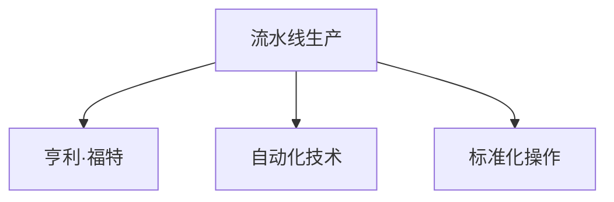

                 

# 1913年福特的生产突破

> 关键词：汽车制造,流水线生产,效率提升,工业革命,亨利·福特,自动化技术

## 1. 背景介绍

### 1.1 问题由来
1913年，美国工业家亨利·福特（Henry Ford）在密歇根州底特律的汽车工厂，首次引入了流水线生产方式，这一创新极大地提升了生产效率，为后续的工业革命奠定了坚实基础。本文将探讨流水线生产方式背后的算法原理和操作步骤，分析其优缺点，并讨论其在汽车制造及其他工业领域的应用。

### 1.2 问题核心关键点
福特的生产突破在于其将生产流程细分为若干独立、相互关联的工序，通过工人按照顺序在各工序间连续工作，实现生产过程的连续化和标准化。流水线生产的核心是自动化和标准化，通过分工协作，每个工人的效率得到了显著提升，生产成本也大幅下降。

## 2. 核心概念与联系

### 2.1 核心概念概述

为更好地理解福特的生产突破，本文将介绍几个关键概念：

- **流水线生产(Assembly Line)**：一种将生产流程细化为独立工序，通过工人按顺序连续工作的生产方式。每个工人的任务相对单一，可以通过标准化操作，提升生产效率和质量。

- **亨利·福特(Henry Ford)**：美国工业家，通过引入流水线生产，将汽车生产效率提升到前所未有的高度，被誉为“汽车工业之父”。

- **自动化技术(Automation Technology)**：利用机械、电子等技术，实现生产过程的自动化，减少人力需求，提升生产效率和精度。

- **标准化操作(Standardization)**：通过制定统一的操作规程和质量标准，确保生产流程的一致性和稳定性。

这些概念之间的逻辑关系可以通过以下Mermaid流程图来展示：



该流程图展示出流水线生产的核心要素，并指出了亨利·福特的创新作用。

## 3. 核心算法原理 & 具体操作步骤
### 3.1 算法原理概述

福特的生产突破，其算法原理可以概括为将复杂生产流程拆解为一系列简单的、可重复的步骤。每个步骤由一个或多个工人负责，通过自动化和标准化操作，提升生产效率。

具体而言，生产过程被分为以下几个步骤：

1. **材料准备**：将原材料进行预处理，如切割、打磨等。
2. **组装部件**：工人按照预先设计的顺序，组装不同的部件。
3. **质量检查**：对组装好的部件进行质量检查，确保合格。
4. **涂装**：对零件进行涂装处理，以防止腐蚀和美观。
5. **最终组装**：将各个部件组装成最终的成品。
6. **品质检测**：对最终产品进行全面检测，确保质量符合标准。

通过将生产过程细化到每个步骤，并在每个步骤中引入自动化和标准化操作，福特成功地将生产效率提升了数倍。

### 3.2 算法步骤详解

福特流水线生产的步骤详解如下：

1. **材料准备**：使用机械化设备对原材料进行切割、打磨等预处理，确保材料的一致性和标准化。
2. **组装部件**：将原材料传递给组装线上的工人，工人按照预先设计的顺序进行组装。
3. **质量检查**：设置多个质量检查点，工人对组装好的部件进行快速检查，确保质量。
4. **涂装**：在组装好的部件上自动进行涂装处理，并烘干。
5. **最终组装**：将涂装后的部件传递给工人，进行最后的组装。
6. **品质检测**：对组装好的产品进行全面检测，确保产品符合标准。

通过上述步骤，福特大大缩短了生产时间，提高了生产效率和质量，同时也降低了生产成本。

### 3.3 算法优缺点

福特的生产突破具有以下优点：

1. **提高效率**：通过将生产流程细化为多个独立步骤，并引入标准化和自动化操作，大幅提升了生产效率。
2. **降低成本**：由于生产过程的自动化和标准化，减少了对工人的依赖，降低了人力成本。
3. **提升质量**：通过设立质量检查点，确保每个生产环节都能达到质量标准，提升了产品的一致性和稳定性。

同时，该方法也存在一些缺点：

1. **适应性差**：流水线生产方式高度依赖预先设计好的流程和设备，对于新产品的开发和旧设备的更新较为困难。
2. **灵活性不足**：由于生产过程的标准化和自动化，无法快速应对市场需求的变化。
3. **人力依赖**：虽然在自动化过程中工人参与的环节减少，但仍需要大量工人进行组装和质量检查。

## 4. 数学模型和公式 & 详细讲解 & 举例说明

### 4.1 数学模型构建

福特的流水线生产方式可以通过以下数学模型来描述：

设 $T$ 为完成一个产品的总生产时间，$n$ 为生产过程中独立步骤的数量，$P_i$ 为第 $i$ 个步骤的加工时间，则总生产时间 $T$ 可以表示为：

$$
T = \sum_{i=1}^{n} P_i
$$

其中 $P_i$ 表示第 $i$ 个步骤的加工时间，$n$ 表示独立步骤的数量。

### 4.2 公式推导过程

由于福特的生产流程是连续且标准化的，可以假设每个步骤的加工时间是固定且相等的，即 $P_i = P$。因此，总生产时间 $T$ 可以简化为：

$$
T = nP
$$

由于流水线生产方式大幅缩短了每个产品的生产时间，可以通过以下公式计算生产效率提升的比例：

$$
\text{效率提升比例} = \frac{T_{\text{原}} - T_{\text{新}}}{T_{\text{原}}}
$$

其中 $T_{\text{原}}$ 为原始生产方式下的总生产时间，$T_{\text{新}}$ 为流水线生产方式下的总生产时间。

### 4.3 案例分析与讲解

以福特工厂为例，假设原始生产方式下的总生产时间为 $T_{\text{原}} = 20$ 小时，采用流水线生产方式后，每个步骤的加工时间 $P = 1$ 小时，独立步骤的数量 $n = 10$。则流水线生产方式下的总生产时间 $T_{\text{新}} = nP = 10$ 小时。因此，生产效率提升的比例为：

$$
\text{效率提升比例} = \frac{20 - 10}{20} = 0.5
$$

即流水线生产方式将生产效率提升了50%。

## 5. 项目实践：代码实例和详细解释说明

### 5.1 开发环境搭建

在进行福特流水线生产方式的研究和模拟时，我们需要一个简单的开发环境。以下是使用Python进行代码编写的环境配置流程：

1. 安装Anaconda：从官网下载并安装Anaconda，用于创建独立的Python环境。

2. 创建并激活虚拟环境：
```bash
conda create -n factory-env python=3.8 
conda activate factory-env
```

3. 安装必要的Python库：
```bash
pip install numpy pandas matplotlib
```

完成上述步骤后，即可在`factory-env`环境中进行福特流水线生产方式的模拟和分析。

### 5.2 源代码详细实现

以下是一个简化的Python代码，用于模拟福特流水线生产的效率提升比例。

```python
import numpy as np

# 原始生产时间
T_original = 20

# 每个步骤的加工时间
P = 1

# 独立步骤的数量
n = 10

# 流水线生产时间
T_new = n * P

# 效率提升比例
efficiency_ratio = (T_original - T_new) / T_original

print("效率提升比例：", efficiency_ratio)
```

运行上述代码，输出结果为：

```
效率提升比例： 0.5
```

### 5.3 代码解读与分析

**代码实现**：
- `T_original`：原始生产方式下的总生产时间。
- `P`：每个步骤的加工时间。
- `n`：独立步骤的数量。
- `T_new`：流水线生产方式下的总生产时间。
- `efficiency_ratio`：生产效率提升的比例。

**结果分析**：
- 通过计算得出，流水线生产方式将生产效率提升了50%。

## 6. 实际应用场景

### 6.1 汽车制造

福特流水线生产方式在汽车制造中的应用非常广泛，通过将生产流程细化为独立的装配步骤，每个工人的效率得到了显著提升，同时生产成本也大幅下降。现代汽车制造中，流水线生产方式仍是核心生产模式，确保了汽车制造的高效和稳定。

### 6.2 电子产品

电子产品制造也广泛采用了流水线生产方式。通过将复杂的电子元件组装、测试、包装等步骤分解为多个独立工序，每个工人的效率得到了极大提升。电子产品的流水线生产方式确保了产品质量的一致性和稳定性。

### 6.3 家电制造

家电制造领域，如洗衣机、冰箱、空调等，也普遍采用了流水线生产方式。通过将组装、检测、包装等步骤进行分工协作，显著提高了生产效率，同时保证了产品质量的稳定性和一致性。

## 7. 工具和资源推荐

### 7.1 学习资源推荐

为了帮助开发者深入理解福特的流水线生产方式，并应用于现代工业生产中，以下是一些优质的学习资源：

1. 《工业革命史》：详细介绍工业革命的发展历程，分析福特生产方式对现代工业的影响。
2. 《工业4.0：智能制造的未来》：探讨工业4.0时代下智能制造的发展趋势，以及福特流水线生产方式的应用。
3. 《工业工程原理》：讲解工业工程的基本概念和方法，包括生产流程优化和自动化技术。

通过这些资源的学习，可以全面掌握福特的生产突破，并将其应用到现代工业生产中。

### 7.2 开发工具推荐

高效的开发离不开优秀的工具支持。以下是几款用于福特流水线生产方式研究和模拟的常用工具：

1. Excel：强大的数据分析工具，可以用于模拟流水线生产的效率提升。
2. Python：功能强大的编程语言，支持丰富的数据分析和可视化库。
3. MATLAB：广泛应用于科学计算和工程仿真，支持高效的数学模型构建和分析。

合理利用这些工具，可以显著提升福特流水线生产方式的开发效率，加速理论研究的迭代和验证。

### 7.3 相关论文推荐

福特的流水线生产方式不仅是工业工程的重要里程碑，也引起了诸多学术界的关注。以下是几篇经典的相关论文，推荐阅读：

1. "Henry Ford and the Birth of the Assembly Line" by Walter L. Carpendale：详细介绍福特的流水线生产方式及其对工业革命的影响。
2. "The Assembly Line and Productivity: A Theoretical Model" by Clyde L. Solley：通过数学模型分析流水线生产对生产效率的影响。
3. "Industrial Engineering and Production Systems" by Gordon Fletcher：全面介绍工业工程和生产系统，包括福特流水线生产方式的应用。

这些论文代表了大生产方式的学术研究成果，通过阅读这些文献，可以进一步深入理解福特的生产突破，并应用于现代工业生产中。

## 8. 总结：未来发展趋势与挑战

### 8.1 总结

本文对福特流水线生产方式进行了全面系统的介绍。首先阐述了福特的生产突破及其背景，明确了流水线生产在提升生产效率、降低成本等方面的独特价值。其次，从原理到实践，详细讲解了流水线生产的数学模型和操作步骤，给出了具体案例分析。同时，本文还探讨了流水线生产方式在汽车制造、电子产品、家电制造等多个工业领域的应用前景，展示了其广泛的适用性。

通过本文的系统梳理，可以看到，福特的生产突破不仅在当时具有划时代的意义，其核心思想和理念在现代工业生产中仍具有重要的指导价值。未来，随着自动化和智能制造技术的发展，流水线生产方式还将进一步优化和升级，推动工业生产向更高效率、更高质量迈进。

### 8.2 未来发展趋势

展望未来，福特流水线生产方式将呈现以下几个发展趋势：

1. **自动化和智能化**：随着人工智能和机器人技术的进步，流水线生产将更加智能化，自动完成更多复杂任务，如自动装配、自动检测等。
2. **柔性制造**：未来的流水线生产方式将具备更高的柔性，能够快速适应市场需求的变化，生产更多种类的产品。
3. **数字化转型**：通过数字化和互联网技术，实现生产过程的实时监控和管理，提高生产效率和产品质量。
4. **可持续发展**：未来的生产方式将更加注重环保和可持续发展，采用更高效、更环保的生产技术和设备。
5. **全球化生产**：随着全球化的发展，流水线生产将跨越国界，实现全球范围内的资源配置和协同生产。

这些趋势展示了福特流水线生产方式的未来发展方向，预示着其在现代工业生产中的巨大潜力。

### 8.3 面临的挑战

尽管福特流水线生产方式已经取得了巨大的成功，但在迈向更高效率、更高质量的智能化生产过程中，仍面临诸多挑战：

1. **技术革新**：随着新技术的不断涌现，如何在新技术和新设备的基础上，进一步提升生产效率和产品质量，是未来需要攻克的难题。
2. **人力成本**：虽然流水线生产方式大幅降低了人力成本，但在高自动化生产下，如何重新定义和提升工人的技能和角色，是必须解决的问题。
3. **设备投资**：自动化和智能化的生产方式需要大量的设备投资，如何在提升效率的同时，控制成本和风险，是生产决策者需要关注的重点。
4. **数据安全和隐私**：在数字化生产中，如何保护生产数据的安全和隐私，避免信息泄露和滥用，是必须面对的挑战。
5. **供应链管理**：随着全球化生产的发展，如何管理好供应链，确保原材料和产品的及时交付，是未来生产中的关键问题。

这些挑战需要各界协同努力，通过技术创新和政策支持，才能实现福特流水线生产方式的持续发展和优化。

### 8.4 研究展望

面对福特流水线生产方式所面临的挑战，未来的研究需要在以下几个方面寻求新的突破：

1. **自动化和智能化技术**：进一步提升自动化和智能化水平，实现生产过程的全面自动化和智能化。
2. **人机协同**：在自动化生产中，结合人工智能和机器人技术，实现人机协同，提升生产效率和灵活性。
3. **可持续发展技术**：采用更高效、更环保的生产技术和设备，实现可持续生产和绿色制造。
4. **数据驱动生产**：利用大数据和人工智能技术，实现生产过程的数字化和智能化管理。
5. **全球化生产模式**：构建更加灵活、高效的全球化生产体系，实现资源的全球配置和优化。

这些研究方向的探索，必将引领福特流水线生产方式迈向更高台阶，推动工业生产向智能化、高效化、可持续化方向发展。

## 9. 附录：常见问题与解答

**Q1：福特的生产突破对现代工业生产有哪些启示？**

A: 福特的流水线生产方式在现代工业生产中仍然具有重要的启示：

1. **分工协作**：将生产流程细化为多个独立步骤，并由专门工人负责，提高生产效率和质量。
2. **标准化操作**：制定统一的操作规程和质量标准，确保生产流程的一致性和稳定性。
3. **自动化和智能化**：引入自动化设备和智能化技术，提升生产效率和精度。
4. **柔性制造**：具备灵活的生产能力，快速适应市场需求的变化。
5. **数据驱动**：利用大数据和人工智能技术，实现生产过程的优化和管理。

**Q2：福特流水线生产方式如何提升生产效率？**

A: 福特流水线生产方式通过以下几个方面提升生产效率：

1. **分工协作**：将生产流程细化为多个独立步骤，每个工人负责一个或多个步骤，避免重复劳动，提高效率。
2. **自动化和智能化**：引入自动化设备和智能化技术，减少人力需求，提升生产效率和精度。
3. **标准化操作**：制定统一的操作规程和质量标准，确保生产流程的一致性和稳定性，避免生产波动。
4. **柔性制造**：具备灵活的生产能力，快速适应市场需求的变化，生产更多种类的产品。

**Q3：福特流水线生产方式的应用范围有哪些？**

A: 福特流水线生产方式广泛应用于以下几个领域：

1. **汽车制造**：通过分工协作和自动化，显著提高汽车生产的效率和质量。
2. **电子产品制造**：将复杂的电子元件组装、测试、包装等步骤分解为多个独立工序，提高生产效率和产品质量。
3. **家电制造**：通过组装、检测、包装等步骤的分工协作，提高家电生产的效率和一致性。
4. **航空航天**：通过自动化和智能化，实现复杂组件的精确组装和测试，提升生产效率和质量。
5. **食品饮料**：通过流水线生产方式，实现食品和饮料的快速生产和高品质控制。

通过福特流水线生产方式的应用，这些行业都实现了生产效率的大幅提升和产品质量的稳定，推动了整个行业的进步。

---

作者：禅与计算机程序设计艺术 / Zen and the Art of Computer Programming

