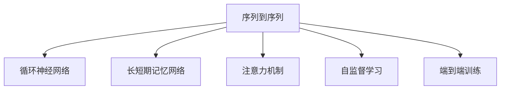

                 

## 1. 背景介绍

### 1.1 问题由来
序列到序列(Sequence-to-Sequence, Seq2Seq)学习是自然语言处理领域中一个非常基础且广泛应用的技术。它在机器翻译、语音识别、摘要生成、对话系统等任务中都有广泛应用。由于其强大的表达能力和高效的计算方法，序列到序列学习成为了处理序列数据问题的重要手段。

但随着序列数据规模的不断增长和应用场景的复杂化，传统的序列到序列模型在效率、精度和可扩展性上面临着挑战。为了解决这些问题，研究人员提出了基于注意力机制(Attention Mechanism)的Transformer模型，并在此基础上，发展了自监督学习(如BERT)和端到端训练(如GPT)等技术，不断推动序列到序列学习方法的创新和进步。

### 1.2 问题核心关键点
序列到序列学习的主要问题是如何高效地将输入序列映射到输出序列。核心挑战在于解决以下几个关键问题：
- 长序列处理：传统的RNN结构在处理长序列时，存在梯度消失或梯度爆炸的问题。
- 高维输入输出：输入和输出的序列长度可能差异较大，且维度较高。
- 数据依赖性强：需要大量的标注数据进行训练，标注成本较高。

### 1.3 问题研究意义
序列到序列学习技术的不断进步，对于拓展NLP应用范围，提升下游任务的性能，加速NLP技术的产业化进程，具有重要意义：

1. 减少数据标注成本：相比于从头训练模型，微调已有的大规模语言模型，可以大幅降低标注数据的成本，加速模型训练。
2. 提升模型效果：微调使得通用语言模型更好地适应特定任务，在应用场景中取得更优表现。
3. 加速开发进度：standing on the shoulders of giants，微调使得开发者可以更快地完成任务适配，缩短开发周期。
4. 带来技术创新：微调范式促进了对预训练-微调的深入研究，催生了注意力机制、Transformer、BERT等新的研究方向。
5. 赋能产业升级：微调技术使得NLP技术更容易被各行各业所采用，为传统行业数字化转型升级提供新的技术路径。

## 2. 核心概念与联系

### 2.1 核心概念概述

为更好地理解基于监督学习的序列到序列学习方法，本节将介绍几个密切相关的核心概念：

- 序列到序列(Seq2Seq)：指将一个序列映射到另一个序列的过程。常见的应用包括机器翻译、语音识别、对话系统等。

- 循环神经网络(RNN)：一种用于序列数据建模的神经网络，通过逐个时间步更新状态，实现序列的动态表示。

- 长短期记忆网络(LSTM)：一种特殊的RNN结构，通过引入门控机制，能够有效缓解梯度消失问题，提升长序列建模能力。

- 注意力机制(Attention)：一种增强序列到序列学习效果的机制，通过计算输入和输出之间的相似度，动态地关注输入序列中与输出序列相关联的部分，从而提升模型输出质量。

- 自监督学习(Pre-training)：指在大规模无标签文本数据上进行预训练，学习通用语言表示的技术。通过预训练学习到丰富的语言知识，提升模型在特定任务上的性能。

- 端到端训练(End-to-End Training)：指在模型训练过程中，直接从输入序列到输出序列进行端到端的学习，减少中间层的复杂度，提升模型效率。

这些核心概念之间的逻辑关系可以通过以下Mermaid流程图来展示：



这个流程图展示了大模型序列到序列学习的核心概念及其之间的关系：

1. 序列到序列是基础任务，涉及从输入序列到输出序列的映射。
2. 循环神经网络、长短期记忆网络、注意力机制等技术，都是为了提升序列到序列任务的性能。
3. 自监督学习和端到端训练，旨在通过大规模数据预训练和模型设计优化，提升模型的通用性和泛化能力。

这些概念共同构成了序列到序列学习方法的逻辑框架，使得模型能够高效地处理序列数据，并在多种应用场景中发挥重要作用。

## 3. 核心算法原理 & 具体操作步骤
### 3.1 算法原理概述

基于监督学习的序列到序列学习，本质上是一个有监督的端到端序列映射过程。其核心思想是：将输入序列编码为固定长度的表示，通过模型映射到输出序列，解码为最终的预测结果。

形式化地，假设输入序列为 $x=\{x_1,x_2,\ldots,x_T\}$，输出序列为 $y=\{y_1,y_2,\ldots,y_D\}$，其中 $T$ 和 $D$ 分别为输入和输出序列的长度。序列到序列学习的目标是最小化输出序列 $y$ 和模型预测 $y'$ 之间的差异：

$$
\min_{\theta} \mathcal{L}(y,y') = \min_{\theta} \sum_{i=1}^D \mathcal{L}(y_i, y'_i)
$$

其中 $\mathcal{L}$ 为损失函数，通常为交叉熵损失或均方误差损失。在训练过程中，模型通过不断调整参数 $\theta$，最小化上述损失函数，使得预测序列 $y'$ 逼近真实序列 $y$。

### 3.2 算法步骤详解

基于监督学习的序列到序列学习一般包括以下几个关键步骤：

**Step 1: 准备训练数据和模型架构**

- 收集并处理训练数据集，将输入和输出序列转换成模型可以接受的格式。通常需要进行序列填充、截断等处理。
- 设计并构建序列到序列的模型架构，包括编码器和解码器。
- 选择合适的损失函数和优化算法，如交叉熵损失、AdamW等。

**Step 2: 编码器-解码器架构**

- 编码器：将输入序列 $x$ 映射为固定长度的表示 $h$。
- 解码器：根据编码器输出的表示 $h$ 和当前时刻 $t$ 的输入 $y_{t-1}$，输出当前时刻 $t$ 的预测 $y_t$。

**Step 3: 注意力机制**

- 引入注意力机制，计算输入序列中每个位置的权重，用于动态选择输入序列中与输出序列相关联的部分。
- 通过计算输入序列和当前输出序列的相似度，计算注意力权重 $a_t$。

**Step 4: 解码器结构设计**

- 解码器通常采用RNN、LSTM或Transformer等结构，每一步输出 $y_t$ 作为下一时刻的输入，并同时更新模型状态。
- 在Transformer结构中，解码器引入自注意力机制，计算输入序列和自身输出序列的注意力权重，提升模型的并行计算能力。

**Step 5: 训练过程**

- 将训练数据集输入模型，前向传播计算预测结果。
- 反向传播计算模型参数梯度，根据设定的优化算法和学习率更新模型参数。
- 重复上述步骤直至满足预设的迭代轮数或 Early Stopping 条件。

**Step 6: 测试和评估**

- 在测试集上评估模型性能，如BLEU、ROUGE等指标。
- 使用评估后的模型对新样本进行推理预测，集成到实际的应用系统中。

以上是基于监督学习的序列到序列学习的一般流程。在实际应用中，还需要针对具体任务的特点，对模型架构和训练过程进行优化设计，如改进注意力机制、引入更多的正则化技术、搜索最优的超参数组合等，以进一步提升模型性能。

### 3.3 算法优缺点

基于监督学习的序列到序列学习方法具有以下优点：

1. 简单高效。只需准备训练数据，即可进行端到端的学习，获得较大的性能提升。
2. 适用于多种序列任务。编码器和解码器结构灵活，可以用于机器翻译、语音识别、对话系统等众多任务。
3. 端到端训练减少了中间层的复杂度，提升了模型效率。
4. 在大量标注数据下，能够取得不错的模型效果。

同时，该方法也存在一定的局限性：

1. 依赖标注数据。序列到序列模型的训练需要大量的标注数据，标注成本较高。
2. 数据分布限制。模型对输入序列和输出序列的分布要求较高，当两者分布差异较大时，性能提升有限。
3. 模型复杂度高。相较于传统的RNN结构，Transformer等复杂架构可能需要更长的训练时间和更大的计算资源。
4. 可解释性不足。序列到序列模型往往是"黑盒"系统，难以解释其内部工作机制和决策逻辑。

尽管存在这些局限性，但就目前而言，基于监督学习的序列到序列方法仍是处理序列数据问题的主流范式。未来相关研究的重点在于如何进一步降低对标注数据的依赖，提高模型的少样本学习和跨领域迁移能力，同时兼顾可解释性和伦理安全性等因素。

### 3.4 算法应用领域

基于序列到序列学习的方法在NLP领域已经得到了广泛的应用，覆盖了几乎所有常见任务，例如：

- 机器翻译：将源语言文本翻译成目标语言。将源语言序列和目标语言序列作为训练数据，训练模型学习映射关系。
- 文本摘要：将长文本压缩成简短摘要。将文章和摘要对作为训练数据，训练模型学习抓取要点。
- 对话系统：使机器能够与人自然对话。将对话历史作为上下文，微调模型进行回复生成。
- 问答系统：对自然语言问题给出答案。将问题-答案对作为训练数据，训练模型学习匹配答案。
- 语音识别：将语音转换成文本。将语音和文本对作为训练数据，训练模型学习映射关系。
- 文本分类：如情感分析、主题分类、意图识别等。通过微调使模型学习文本-标签映射。
- 命名实体识别：识别文本中的人名、地名、机构名等特定实体。通过微调使模型掌握实体边界和类型。
- 关系抽取：从文本中抽取实体之间的语义关系。通过微调使模型学习实体-关系三元组。

除了上述这些经典任务外，序列到序列学习还被创新性地应用到更多场景中，如可控文本生成、常识推理、代码生成、数据增强等，为NLP技术带来了全新的突破。随着预训练模型和序列到序列方法的不断进步，相信NLP技术将在更广阔的应用领域大放异彩。

## 4. 数学模型和公式 & 详细讲解 & 举例说明
### 4.1 数学模型构建

本节将使用数学语言对基于监督学习的序列到序列学习过程进行更加严格的刻画。

记输入序列为 $x=\{x_1,x_2,\ldots,x_T\}$，输出序列为 $y=\{y_1,y_2,\ldots,y_D\}$，其中 $T$ 和 $D$ 分别为输入和输出序列的长度。序列到序列学习的目标是最小化输出序列 $y$ 和模型预测 $y'$ 之间的差异：

$$
\min_{\theta} \mathcal{L}(y,y') = \min_{\theta} \sum_{i=1}^D \mathcal{L}(y_i, y'_i)
$$

其中 $\mathcal{L}$ 为损失函数，通常为交叉熵损失或均方误差损失。在训练过程中，模型通过不断调整参数 $\theta$，最小化上述损失函数，使得预测序列 $y'$ 逼近真实序列 $y$。

### 4.2 公式推导过程

以下我们以机器翻译任务为例，推导交叉熵损失函数及其梯度的计算公式。

假设模型 $M_{\theta}$ 在输入序列 $x$ 上的输出为 $\hat{y}=\{\hat{y}_1,\hat{y}_2,\ldots,\hat{y}_D\}$，表示模型对目标序列中每个位置 $i$ 的预测概率。真实标签 $y \in \{0,1\}^D$。则二分类交叉熵损失函数定义为：

$$
\ell(M_{\theta}(x),y) = -\sum_{i=1}^D y_i\log \hat{y}_i + (1-y_i)\log (1-\hat{y}_i)
$$

将其代入损失函数公式，得：

$$
\mathcal{L}(\theta) = -\frac{1}{D}\sum_{i=1}^D \left[y_i\log \hat{y}_i + (1-y_i)\log(1-\hat{y}_i)\right]
$$

根据链式法则，损失函数对参数 $\theta_k$ 的梯度为：

$$
\frac{\partial \mathcal{L}(\theta)}{\partial \theta_k} = -\frac{1}{D}\sum_{i=1}^D \left[\frac{y_i}{\hat{y}_i}-\frac{1-y_i}{1-\hat{y}_i}\right] \frac{\partial \hat{y}_i}{\partial \theta_k}
$$

其中 $\frac{\partial \hat{y}_i}{\partial \theta_k}$ 可进一步递归展开，利用自动微分技术完成计算。

在得到损失函数的梯度后，即可带入参数更新公式，完成模型的迭代优化。重复上述过程直至收敛，最终得到适应下游任务的最优模型参数 $\theta^*$。

## 5. 项目实践：代码实例和详细解释说明
### 5.1 开发环境搭建

在进行序列到序列学习实践前，我们需要准备好开发环境。以下是使用Python进行TensorFlow开发的环境配置流程：

1. 安装Anaconda：从官网下载并安装Anaconda，用于创建独立的Python环境。

2. 创建并激活虚拟环境：
```bash
conda create -n seq2seq-env python=3.8 
conda activate seq2seq-env
```

3. 安装TensorFlow：根据CUDA版本，从官网获取对应的安装命令。例如：
```bash
conda install tensorflow -c pytorch -c conda-forge
```

4. 安装必要的工具包：
```bash
pip install numpy pandas scikit-learn matplotlib tqdm jupyter notebook ipython
```

完成上述步骤后，即可在`seq2seq-env`环境中开始序列到序列学习实践。

### 5.2 源代码详细实现

这里我们以机器翻译任务为例，给出使用TensorFlow实现Seq2Seq模型的PyTorch代码实现。

首先，定义模型参数和超参数：

```python
import tensorflow as tf
from tensorflow.keras.layers import Input, LSTM, Dense

input_dim = 1000 # 输入序列的维度
output_dim = 1000 # 输出序列的维度
embedding_dim = 128 # 词嵌入维度
hidden_units = 128 # LSTM隐藏层大小
batch_size = 64 # 批大小
epochs = 10 # 迭代次数
learning_rate = 0.001 # 学习率

vocab_size = 10000 # 词汇表大小
encoder_inputs = Input(shape=(None, input_dim))
decoder_inputs = Input(shape=(None, output_dim))
```

然后，定义编码器结构：

```python
encoder = tf.keras.Model(encoder_inputs, outputs)
```

接着，定义解码器结构：

```python
decoder = tf.keras.Model(decoder_inputs, outputs)
```

然后，定义编码器和解码器的输出：

```python
encoder_outputs, state_h, state_c = encoder(encoder_inputs)
```

最后，定义训练和评估函数：

```python
model.compile(optimizer=tf.keras.optimizers.Adam(learning_rate), loss='categorical_crossentropy')
model.fit([encoder_input_data, decoder_input_data], decoder_target_data,
          batch_size=batch_size, epochs=epochs,
          validation_data=([test_encoder_input_data, test_decoder_input_data], test_decoder_target_data))
```

以上代码实现了基于LSTM的Seq2Seq模型，用于机器翻译任务。可以看到，利用TensorFlow的强大封装，我们可以用相对简洁的代码完成Seq2Seq模型的搭建和训练。

### 5.3 代码解读与分析

让我们再详细解读一下关键代码的实现细节：

**vocab_size**：定义了词汇表的大小，即输入和输出序列中可能的词汇数。

**encoder_inputs, decoder_inputs**：定义了输入和输出序列的输入层，shape为None表示可以处理任意长度的序列。

**encoder**：定义了编码器结构，输入为encoder_inputs，输出为编码器输出的表示。

**decoder**：定义了解码器结构，输入为decoder_inputs，输出为解码器输出的表示。

**state_h, state_c**：定义了编码器中的状态，用于实现长序列的处理。

**model.compile**：编译模型，指定了优化器和损失函数。

**model.fit**：训练模型，输入为编码器和解码器的输入数据，输出为解码器的目标数据，指定了批大小、迭代次数和验证集。

可以看到，TensorFlow使得序列到序列模型的实现和训练变得相对简洁，开发者可以将更多精力放在模型设计、数据处理等高层逻辑上，而不必过多关注底层的实现细节。

当然，工业级的系统实现还需考虑更多因素，如模型的保存和部署、超参数的自动搜索、更灵活的任务适配层等。但核心的序列到序列学习流程基本与此类似。

## 6. 实际应用场景
### 6.1 智能客服系统

基于序列到序列的对话技术，可以广泛应用于智能客服系统的构建。传统客服往往需要配备大量人力，高峰期响应缓慢，且一致性和专业性难以保证。而使用序列到序列模型，可以7x24小时不间断服务，快速响应客户咨询，用自然流畅的语言解答各类常见问题。

在技术实现上，可以收集企业内部的历史客服对话记录，将问题和最佳答复构建成监督数据，在此基础上对序列到序列模型进行微调。微调后的模型能够自动理解用户意图，匹配最合适的答案模板进行回复。对于客户提出的新问题，还可以接入检索系统实时搜索相关内容，动态组织生成回答。如此构建的智能客服系统，能大幅提升客户咨询体验和问题解决效率。

### 6.2 金融舆情监测

金融机构需要实时监测市场舆论动向，以便及时应对负面信息传播，规避金融风险。传统的人工监测方式成本高、效率低，难以应对网络时代海量信息爆发的挑战。基于序列到序列的文本分类和情感分析技术，为金融舆情监测提供了新的解决方案。

具体而言，可以收集金融领域相关的新闻、报道、评论等文本数据，并对其进行主题标注和情感标注。在此基础上对序列到序列模型进行微调，使其能够自动判断文本属于何种主题，情感倾向是正面、中性还是负面。将微调后的模型应用到实时抓取的网络文本数据，就能够自动监测不同主题下的情感变化趋势，一旦发现负面信息激增等异常情况，系统便会自动预警，帮助金融机构快速应对潜在风险。

### 6.3 个性化推荐系统

当前的推荐系统往往只依赖用户的历史行为数据进行物品推荐，无法深入理解用户的真实兴趣偏好。基于序列到序列的个性化推荐系统可以更好地挖掘用户行为背后的语义信息，从而提供更精准、多样的推荐内容。

在实践中，可以收集用户浏览、点击、评论、分享等行为数据，提取和用户交互的物品标题、描述、标签等文本内容。将文本内容作为模型输入，用户的后续行为（如是否点击、购买等）作为监督信号，在此基础上微调序列到序列模型。微调后的模型能够从文本内容中准确把握用户的兴趣点。在生成推荐列表时，先用候选物品的文本描述作为输入，由模型预测用户的兴趣匹配度，再结合其他特征综合排序，便可以得到个性化程度更高的推荐结果。

### 6.4 未来应用展望

随着序列到序列学习技术的不断发展，其在NLP领域的应用前景将更加广阔：

1. 在机器翻译领域，序列到序列学习将继续主导翻译技术的进步，推动翻译质量的提升。
2. 在自然语言生成领域，基于序列到序列的生成模型将进一步提高自然语言的流畅度和自然性，支持更多复杂的语言任务。
3. 在对话系统和问答系统领域，基于序列到序列的模型将提供更加智能、高效的对话体验，提升用户交互质量。
4. 在多模态学习领域，序列到序列学习与其他模态学习技术结合，将推动多模态认知智能的发展，提升模型对复杂多模态数据的理解和处理能力。
5. 在跨领域迁移学习领域，序列到序列学习将进一步拓展应用领域，提升模型在不同领域的泛化能力。

## 7. 工具和资源推荐
### 7.1 学习资源推荐

为了帮助开发者系统掌握序列到序列学习的基本概念和实践技巧，这里推荐一些优质的学习资源：

1. 《深度学习》课程：斯坦福大学开设的深度学习经典课程，系统介绍了深度学习的基本原理和算法。
2. 《Sequence-to-Sequence Learning with Neural Networks》论文：讲述序列到序列学习的理论和算法实现，是领域内的经典论文。
3. 《Attention is All You Need》论文：提出Transformer模型，并引入自注意力机制，开启了大规模预训练语言模型的新纪元。
4. 《Neural Machine Translation by Jointly Learning to Align and Translate》论文：介绍基于序列到序列学习的机器翻译方法，包含LSTM等经典模型。
5. 《TensorFlow官方文档》：TensorFlow的官方文档，包含丰富的实例和教程，适合初学者学习。

通过对这些资源的学习实践，相信你一定能够快速掌握序列到序列学习的基本原理和实践技巧，并用于解决实际的NLP问题。
### 7.2 开发工具推荐

高效的开发离不开优秀的工具支持。以下是几款用于序列到序列学习开发的常用工具：

1. TensorFlow：由Google主导开发的开源深度学习框架，生产部署方便，适合大规模工程应用。提供了丰富的序列到序列模型实现。

2. PyTorch：基于Python的开源深度学习框架，灵活动态的计算图，适合快速迭代研究。提供了丰富的序列到序列模型实现。

3. Keras：高级深度学习API，支持TensorFlow、Theano等后端，易于使用，适合快速原型设计。提供了丰富的序列到序列模型实现。

4. Transformers库：HuggingFace开发的NLP工具库，集成了众多SOTA语言模型，支持PyTorch和TensorFlow，是进行序列到序列任务开发的利器。

5. Weights & Biases：模型训练的实验跟踪工具，可以记录和可视化模型训练过程中的各项指标，方便对比和调优。与主流深度学习框架无缝集成。

6. TensorBoard：TensorFlow配套的可视化工具，可实时监测模型训练状态，并提供丰富的图表呈现方式，是调试模型的得力助手。

合理利用这些工具，可以显著提升序列到序列模型的开发效率，加快创新迭代的步伐。

### 7.3 相关论文推荐

序列到序列学习技术的不断发展源于学界的持续研究。以下是几篇奠基性的相关论文，推荐阅读：

1. Attention is All You Need：提出Transformer结构，并引入自注意力机制，开启了NLP领域的预训练大模型时代。

2. Sequence-to-Sequence Learning with Neural Networks：介绍序列到序列学习的理论和算法实现，是领域内的经典论文。

3. Learning Phrase Representations using RNN Encoder-Decoder for Statistical Machine Translation：介绍基于序列到序列学习的机器翻译方法，包含LSTM等经典模型。

4. Parameter-Efficient Training of Language Models：提出Adapter等参数高效微调方法，在固定大部分预训练参数的同时，只更新极少量的任务相关参数。

5. Discovering Representations for Sequence Learning with Generative Adversarial Nets：提出GAN-Seq2Seq模型，将生成对抗网络引入序列到序列学习，提升模型的生成效果。

这些论文代表了大模型序列到序列学习的发展脉络。通过学习这些前沿成果，可以帮助研究者把握学科前进方向，激发更多的创新灵感。

## 8. 总结：未来发展趋势与挑战

### 8.1 总结

本文对基于监督学习的序列到序列学习方法进行了全面系统的介绍。首先阐述了序列到序列学习的研究背景和意义，明确了序列到序列学习在处理序列数据问题中的重要价值。其次，从原理到实践，详细讲解了序列到序列学习的数学原理和关键步骤，给出了序列到序列任务开发的完整代码实例。同时，本文还广泛探讨了序列到序列学习在智能客服、金融舆情、个性化推荐等多个领域的应用前景，展示了序列到序列学习方法的巨大潜力。此外，本文精选了序列到序列学习的各类学习资源，力求为读者提供全方位的技术指引。

通过本文的系统梳理，可以看到，基于监督学习的序列到序列学习技术在序列数据处理方面具有强大的表达能力和计算能力，适用于多种序列任务。在实际应用中，序列到序列模型可以根据具体任务进行灵活的设计和优化，以进一步提升模型性能。

### 8.2 未来发展趋势

展望未来，序列到序列学习技术将呈现以下几个发展趋势：

1. 模型规模持续增大。随着算力成本的下降和数据规模的扩张，序列到序列模型的参数量还将持续增长。超大规模模型蕴含的丰富语言知识，有望支撑更加复杂多变的下游任务。

2. 序列到序列学习将与其他AI技术深度融合。如知识表示、因果推理、强化学习等，多路径协同发力，共同推动序列到序列模型的进步。

3. 自监督学习和预训练技术将进一步提升模型性能。在大规模无标签数据上预训练，并在小样本数据上微调，能够在保持模型泛化性的同时，提升模型的性能。

4. 序列到序列学习将更多地应用于跨模态任务。多模态信息融合将推动序列到序列学习模型的发展，提升模型对现实世界的理解和建模能力。

5. 序列到序列学习将进一步拓展应用领域。未来将在更多行业领域如智慧医疗、智能教育、智慧城市等得到应用，为各行各业带来变革性影响。

以上趋势凸显了序列到序列学习技术的广阔前景。这些方向的探索发展，必将进一步提升NLP系统的性能和应用范围，为人类认知智能的进化带来深远影响。

### 8.3 面临的挑战

尽管序列到序列学习技术已经取得了瞩目成就，但在迈向更加智能化、普适化应用的过程中，它仍面临着诸多挑战：

1. 标注成本瓶颈。虽然序列到序列模型的训练不需要大量的标注数据，但对于一些特定领域的任务，依然需要大量的标注数据进行微调，标注成本较高。

2. 模型鲁棒性不足。序列到序列模型面对域外数据时，泛化性能往往大打折扣。对于测试样本的微小扰动，模型的输出也可能发生波动。

3. 推理效率有待提高。大规模序列到序列模型在实际部署时，往往面临推理速度慢、内存占用大等效率问题。

4. 可解释性不足。序列到序列模型通常是"黑盒"系统，难以解释其内部工作机制和决策逻辑。

5. 安全性有待保障。模型可能学习到有偏见、有害的信息，通过微调传递到下游任务，产生误导性、歧视性的输出，给实际应用带来安全隐患。

6. 知识整合能力不足。现有的序列到序列模型往往局限于任务内数据，难以灵活吸收和运用更广泛的先验知识。

正视序列到序列学习面临的这些挑战，积极应对并寻求突破，将是大模型序列到序列学习走向成熟的必由之路。相信随着学界和产业界的共同努力，这些挑战终将一一被克服，序列到序列学习必将在构建人机协同的智能系统中扮演越来越重要的角色。

### 8.4 研究展望

面向未来，序列到序列学习技术需要在以下几个方面寻求新的突破：

1. 探索无监督和半监督学习范式。摆脱对大规模标注数据的依赖，利用自监督学习、主动学习等无监督和半监督范式，最大限度利用非结构化数据，实现更加灵活高效的序列到序列学习。

2. 研究参数高效和计算高效的模型结构。开发更加参数高效的序列到序列模型，在固定大部分预训练参数的同时，只更新极少量的任务相关参数。同时优化模型的计算图，减少前向传播和反向传播的资源消耗，实现更加轻量级、实时性的部署。

3. 引入更多先验知识。将符号化的先验知识，如知识图谱、逻辑规则等，与神经网络模型进行巧妙融合，引导序列到序列模型的微调过程，学习更准确、合理的语言模型。

4. 结合因果分析和博弈论工具。将因果分析方法引入序列到序列模型，识别出模型决策的关键特征，增强输出解释的因果性和逻辑性。借助博弈论工具刻画人机交互过程，主动探索并规避模型的脆弱点，提高系统稳定性。

5. 纳入伦理道德约束。在模型训练目标中引入伦理导向的评估指标，过滤和惩罚有偏见、有害的输出倾向。同时加强人工干预和审核，建立模型行为的监管机制，确保输出符合人类价值观和伦理道德。

这些研究方向的探索，必将引领序列到序列学习技术迈向更高的台阶，为构建安全、可靠、可解释、可控的智能系统铺平道路。面向未来，序列到序列学习技术还需要与其他人工智能技术进行更深入的融合，如知识表示、因果推理、强化学习等，多路径协同发力，共同推动自然语言理解和智能交互系统的进步。只有勇于创新、敢于突破，才能不断拓展语言模型的边界，让智能技术更好地造福人类社会。

## 9. 附录：常见问题与解答

**Q1：序列到序列学习是否适用于所有序列任务？**

A: 序列到序列学习在大多数序列任务上都能取得不错的效果，特别是对于数据量较小的任务。但对于一些特定领域的任务，如医学、法律等，仅仅依靠通用语料预训练的模型可能难以很好地适应。此时需要在特定领域语料上进一步预训练，再进行微调，才能获得理想效果。此外，对于一些需要时效性、个性化很强的任务，如对话、推荐等，序列到序列方法也需要针对性的改进优化。

**Q2：序列到序列模型在落地部署时需要注意哪些问题？**

A: 将序列到序列模型转化为实际应用，还需要考虑以下因素：

1. 模型裁剪：去除不必要的层和参数，减小模型尺寸，加快推理速度。
2. 量化加速：将浮点模型转为定点模型，压缩存储空间，提高计算效率。
3. 服务化封装：将模型封装为标准化服务接口，便于集成调用。
4. 弹性伸缩：根据请求流量动态调整资源配置，平衡服务质量和成本。
5. 监控告警：实时采集系统指标，设置异常告警阈值，确保服务稳定性。
6. 安全防护：采用访问鉴权、数据脱敏等措施，保障数据和模型安全。

序列到序列模型作为NLP应用的重要工具，在实际部署时还需要考虑多方面的因素，确保模型在生产环境中的稳定性和安全性。

**Q3：序列到序列学习面对长序列的处理问题？**

A: 传统的RNN结构在处理长序列时，存在梯度消失或梯度爆炸的问题。为应对这一问题，可以引入长短期记忆网络(LSTM)或门控循环单元(GRU)等结构，通过引入门控机制，缓解梯度消失问题，提升长序列建模能力。同时，还可以引入注意力机制，动态关注输入序列中与输出序列相关联的部分，进一步提升模型性能。

**Q4：序列到序列学习在多语言翻译中存在哪些问题？**

A: 序列到序列学习在多语言翻译中存在以下问题：

1. 语言歧义：不同语言之间的表达方式差异较大，可能导致模型对同一句子的翻译出现歧义。
2. 语义不一致：由于不同语言的语义差异，同一句话在不同语言的翻译中可能失去原有的语义信息。
3. 数据稀疏性：不同语言之间的数据稀疏性较高，需要收集大量的双语数据进行训练。

针对这些问题，可以采用以下方法：

1. 引入多语言模型：构建多语言共享的模型，支持多种语言的翻译。
2. 加入语言模型：在翻译过程中，引入语言模型，对每个语言的翻译进行进一步优化。
3. 数据增强：通过数据增强技术，生成更多的双语数据，提升模型泛化能力。

通过以上方法，可以有效应对多语言翻译中的挑战，提升模型性能。

**Q5：序列到序列学习在文本摘要中存在哪些问题？**

A: 序列到序列学习在文本摘要中存在以下问题：

1. 长文本压缩：长文本压缩为短文本时，可能会丢失部分重要信息。
2. 摘要连贯性：生成的摘要可能与原文本不连贯，影响阅读体验。
3. 信息损失：生成摘要时，可能会丢失一些关键信息，导致摘要质量下降。

针对这些问题，可以采用以下方法：

1. 引入注意力机制：通过引入注意力机制，动态关注文本中与摘要相关联的部分，提高摘要质量。
2. 多轮生成：采用多轮生成的方式，逐步优化摘要内容。
3. 数据增强：通过数据增强技术，生成更多的训练数据，提升模型泛化能力。

通过以上方法，可以有效应对文本摘要中的挑战，提升模型性能。

---

作者：禅与计算机程序设计艺术 / Zen and the Art of Computer Programming

