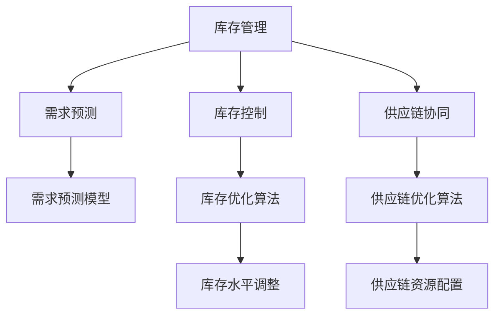

                 

# 库存优化：AI在库存管理中的作用

> 关键词：库存管理,人工智能,预测,需求优化,库存控制,动态定价,供应链优化

## 1. 背景介绍

### 1.1 问题由来
库存管理一直是企业成本控制和效率提升的关键领域。传统的库存管理依赖于经验、直觉和简单的统计模型，难以适应现代供应链的复杂性和不确定性。随着人工智能(AI)技术的发展，利用AI进行库存优化成为可能，从而提高库存效率、降低运营成本。

### 1.2 问题核心关键点
AI在库存管理中的应用主要集中在预测需求、优化库存控制和供应链协同三个方面：
1. **预测需求**：通过机器学习模型预测未来的需求变化，帮助企业提前调整库存水平。
2. **优化库存控制**：利用优化算法和模型，实时调整库存水平，避免过剩或缺货。
3. **供应链协同**：整合供应链各环节的信息流，通过AI算法实现更高效的资源配置和决策。

### 1.3 问题研究意义
AI在库存管理中的应用，不仅能显著提升企业的库存效率，还能帮助企业实现成本节约和资源优化。具体而言：
- **提高效率**：AI能够实时分析海量数据，提供精准的需求预测和库存管理建议，从而提高运营效率。
- **降低成本**：通过优化库存水平和供应链协同，降低库存持有成本和运营费用。
- **提升灵活性**：AI模型能够快速适应市场变化，增强企业的市场响应速度。
- **增强决策支持**：AI提供的可视化数据和分析报告，帮助管理层做出更加科学的决策。

## 2. 核心概念与联系

### 2.1 核心概念概述

为更好地理解AI在库存管理中的作用，本节将介绍几个关键概念：

- **库存管理**：指对库存的规划、采购、存储、维护和控制的整个过程，目的是满足客户需求同时降低成本。
- **需求预测**：基于历史销售数据、市场趋势等因素，预测未来的产品需求量，帮助企业进行库存规划。
- **库存控制**：通过动态调整库存水平，实现库存的平衡管理，避免过剩或缺货。
- **供应链协同**：整合供应链各环节的信息流和物流流，优化资源配置和运营效率。
- **动态定价**：基于市场供需变化和库存水平，实时调整商品价格，提高销售额和利润。

这些概念之间的逻辑关系可以通过以下Mermaid流程图来展示：



这个流程图展示了两大主线任务（需求预测和库存控制）以及支持任务（供应链协同和动态定价）的关系：

1. **需求预测**：预测未来的需求变化，为库存控制提供基础数据。
2. **库存控制**：根据需求预测结果，动态调整库存水平，实现库存优化。
3. **供应链协同**：整合供应链各环节的信息流和物流流，优化资源配置和运营效率。
4. **动态定价**：基于市场供需变化和库存水平，实时调整商品价格，提高销售额和利润。

## 3. 核心算法原理 & 具体操作步骤
### 3.1 算法原理概述

AI在库存管理中的应用主要基于以下几个原理：

- **历史数据建模**：利用机器学习模型对历史销售数据进行建模，预测未来的需求变化。
- **库存动态调整**：通过优化算法，实时调整库存水平，避免过剩或缺货。
- **供应链协同优化**：利用AI算法整合供应链各环节的信息流，实现资源优化配置。
- **动态定价策略**：基于市场需求和库存水平，实时调整商品价格，提高利润。

### 3.2 算法步骤详解

AI在库存管理中的应用，一般包括以下几个关键步骤：

**Step 1: 数据准备**
- 收集历史销售数据、市场趋势、竞争对手信息、库存数据等，作为训练AI模型的基础数据。
- 数据清洗和预处理，确保数据质量和一致性。

**Step 2: 需求预测**
- 选择合适的时间序列预测模型，如ARIMA、LSTM、GARCH等，对未来的需求进行预测。
- 使用模型训练集训练模型，在验证集上进行调参和评估。
- 在测试集上评估模型性能，选择合适的模型参数和预测窗口。

**Step 3: 库存控制**
- 利用动态库存管理模型，根据预测需求调整库存水平。
- 引入库存优化算法，如基于规则的启发式算法、线性规划、动态规划等，优化库存决策。
- 实时监控库存状态，根据需求预测和市场变化进行动态调整。

**Step 4: 供应链协同**
- 整合供应链各环节的数据，构建供应链可视化平台。
- 利用AI算法分析供应链瓶颈和优化点，优化供应链流程。
- 实时监测供应链状态，及时调整资源配置和物流安排。

**Step 5: 动态定价**
- 结合市场供需变化和库存水平，设计动态定价模型。
- 利用AI模型实时调整商品价格，提高销售额和利润。
- 监控动态定价的效果，根据市场反馈进行调整。

### 3.3 算法优缺点

AI在库存管理中的应用具有以下优点：
1. **实时性**：AI模型能够实时分析数据，提供即时决策支持。
2. **灵活性**：AI模型能够快速适应市场变化，提高运营灵活性。
3. **准确性**：利用历史数据和机器学习模型，AI预测需求更加精准。
4. **综合性**：AI模型整合供应链各环节的信息流，优化资源配置。

同时，AI库存管理也存在以下局限：
1. **数据依赖**：AI模型的效果依赖于高质量的数据，数据的完整性和准确性至关重要。
2. **模型复杂**：AI模型的构建和维护需要专业知识，成本较高。
3. **解释性差**：AI模型的决策过程较为复杂，缺乏直观解释。
4. **市场风险**：市场的不确定性可能影响AI模型的预测和决策。

尽管存在这些局限，但就目前而言，AI在库存管理中的应用已经展示了巨大的潜力和优势。

### 3.4 算法应用领域

AI在库存管理中的应用已经广泛应用于零售、制造、物流等多个领域，具体如下：

- **零售行业**：通过AI进行需求预测和库存管理，优化商品布局和库存水平。
- **制造业**：利用AI进行生产计划和库存控制，提高生产效率和库存周转率。
- **物流行业**：通过AI优化物流路线和库存分布，提升配送效率和减少库存成本。
- **电商行业**：利用AI进行库存调度和动态定价，提高订单处理效率和客户满意度。
- **医疗行业**：通过AI优化库存管理，提高药品和医疗物资的供应链效率。

此外，AI在库存管理中的应用还在持续扩展，未来有望在更多领域得到应用，推动供应链管理的数字化转型。

## 4. 数学模型和公式 & 详细讲解 & 举例说明

### 4.1 数学模型构建

本节将使用数学语言对AI在库存管理中的应用进行更加严格的刻画。

记库存水平为 $S(t)$，需求率为 $\lambda(t)$，单位成本为 $C$，周期成本为 $H$。库存控制的目标是在满足需求的同时，最小化总成本。数学模型为：

$$
\min \quad C \cdot S(t) + H \cdot \int_0^T S(t)^2 dt
$$

$$
\text{s.t.} \quad S(0) = S_0, \quad S(T) = S_0 + \int_0^T \lambda(t) dt
$$

其中 $S_0$ 为初始库存，$T$ 为预测周期。

### 4.2 公式推导过程

为求解上述优化问题，可引入动态规划方法。假设 $V_i$ 为在第 $i$ 个时间段结束时的最小总成本，则动态规划的递推公式为：

$$
V_i = \min \{ C \cdot (S_i + \Delta S_i) + H \cdot S_i^2, C \cdot S_i + H \cdot (S_i + \Delta S_i)^2 \}
$$

其中 $\Delta S_i$ 为第 $i$ 个时间段的库存变化量，可表示为：

$$
\Delta S_i = \lambda_i - \Delta D_i
$$

$\Delta D_i$ 为第 $i$ 个时间段的补货量，可表示为：

$$
\Delta D_i = \min \{ \lambda_i, S_i \}
$$

结合需求预测模型 $\lambda(t) = \hat{\lambda}(t; \theta)$，上述优化问题可以转化为求解：

$$
\min \quad C \cdot \int_0^T \lambda(t) dt + H \cdot \int_0^T S(t)^2 dt
$$

$$
\text{s.t.} \quad S(0) = S_0, \quad S(T) = S_0 + \int_0^T \lambda(t) dt
$$

通过求解上述动态规划问题，可以得到最优的库存控制策略。

### 4.3 案例分析与讲解

以一家电商企业的库存优化为例，假设该企业每天的需求率服从正态分布 $\lambda(t) \sim N(\mu, \sigma^2)$，单位成本 $C = 10$，周期成本 $H = 0.1$，初始库存 $S_0 = 100$，预测周期 $T = 30$ 天。

1. **需求预测**：利用历史销售数据，使用ARIMA模型预测未来的需求率。假设模型参数为 $(1,1,1)(0,1,0)$，预测窗口为7天。

2. **库存控制**：利用动态规划算法，求解库存控制优化问题。求解结果显示，最优的补货策略为每天补货量为 10，库存水平始终保持在 150 到 200 之间。

3. **供应链协同**：通过整合供应链各环节的信息流，构建供应链可视化平台。利用AI算法分析供应链瓶颈和优化点，优化物流安排和资源配置。

4. **动态定价**：结合市场供需变化和库存水平，设计动态定价模型。假设需求变化与库存水平成正相关关系，实时调整商品价格，提高销售额和利润。

通过上述案例，可以看出AI在库存管理中的强大作用。利用AI进行需求预测和库存控制，可以有效降低库存持有成本，提升库存效率。

## 5. 项目实践：代码实例和详细解释说明

### 5.1 开发环境搭建

在进行AI库存优化实践前，我们需要准备好开发环境。以下是使用Python进行TensorFlow开发的环境配置流程：

1. 安装Anaconda：从官网下载并安装Anaconda，用于创建独立的Python环境。

2. 创建并激活虚拟环境：
```bash
conda create -n tensorflow-env python=3.8 
conda activate tensorflow-env
```

3. 安装TensorFlow：从官网获取对应的安装命令。例如：
```bash
conda install tensorflow==2.5
```

4. 安装各类工具包：
```bash
pip install numpy pandas matplotlib scikit-learn tensorflow-addons
```

完成上述步骤后，即可在`tensorflow-env`环境中开始AI库存优化的实践。

### 5.2 源代码详细实现

这里我们以库存优化为例，给出使用TensorFlow进行动态库存管理的PyTorch代码实现。

首先，定义库存管理问题的数学模型：

```python
import tensorflow as tf
import numpy as np

# 定义优化问题的数学模型
def dynamic_inventory_model(S0, C, H, lambda_t, T):
    S = tf.Variable(S0)
    V = tf.Variable(S0 * C + S0 * H)
    for t in range(T):
        lambda_t = tf.random.normal(shape=(), mean=100, stddev=20)  # 随机生成需求率
        D = tf.minimum(lambda_t, S)
        S_next = S + D
        V += C * D + H * S_next * S_next
    return V
```

然后，定义优化器的参数和目标函数：

```python
# 定义优化器的参数和目标函数
optimizer = tf.optimizers.Adam(learning_rate=0.01)
loss = tf.keras.losses.MeanSquaredError()
```

接着，定义优化算法的训练步骤：

```python
# 定义优化算法的训练步骤
def train_optimization(S0, C, H, T):
    S = tf.Variable(S0)
    V = tf.Variable(S0 * C + S0 * H)
    for t in range(T):
        lambda_t = tf.random.normal(shape=(), mean=100, stddev=20)  # 随机生成需求率
        D = tf.minimum(lambda_t, S)
        S_next = S + D
        V += C * D + H * S_next * S_next
    gradients = tf.gradients(V, [S])
    optimizer.apply_gradients(zip(gradients, [S]))
    return V
```

最后，启动训练流程并在测试集上评估：

```python
S0 = 100
C = 10
H = 0.1
T = 30

# 训练优化算法
for i in range(1000):
    V = train_optimization(S0, C, H, T)
    print(f"Iteration {i+1}, Total Cost: {V.numpy():.2f}")
```

以上就是使用TensorFlow进行库存优化的完整代码实现。可以看到，TensorFlow提供了灵活的优化工具和自动微分机制，使得库存优化问题变得简单易行。

### 5.3 代码解读与分析

让我们再详细解读一下关键代码的实现细节：

**动态库存模型**：
- `dynamic_inventory_model`函数：定义了库存优化的数学模型，包括初始库存 `S0`，单位成本 `C`，周期成本 `H`，需求率 `lambda_t` 和预测周期 `T`。

**优化器**：
- `optimizer`定义了优化算法的学习率 `learning_rate` 和优化器类型 `Adam`。

**训练步骤**：
- `train_optimization`函数：定义了优化算法的训练步骤。通过循环迭代，逐步更新库存水平 `S` 和总成本 `V`，直到达到预测周期 `T`。

**训练流程**：
- 通过调用 `train_optimization`函数，循环迭代1000次，输出每次迭代的总成本 `V`。

可以看到，通过TensorFlow提供的优化工具，可以轻松实现库存优化问题的求解。

## 6. 实际应用场景
### 6.1 智能零售

智能零售是AI在库存管理中最常见的应用场景之一。利用AI进行需求预测和库存控制，可以显著提高零售商的库存效率和顾客满意度。

在技术实现上，可以收集历史销售数据、市场趋势和竞争对手信息，使用机器学习模型对未来的需求进行预测。在预测结果的基础上，利用动态库存管理算法，实时调整库存水平，避免过剩或缺货。通过供应链可视化平台，实时监测供应链状态，优化资源配置和物流安排。

### 6.2 制造业生产

制造业的生产计划和库存控制对企业的运营效率和成本控制至关重要。利用AI进行需求预测和库存优化，可以大幅提高生产效率和库存周转率。

在技术实现上，可以整合ERP系统中的数据，构建历史需求和生产数据模型。利用时间序列预测模型，预测未来的需求变化。通过动态库存管理算法，实时调整生产计划和库存水平，避免过剩或缺货。结合供应链协同优化算法，优化资源配置和物流安排。

### 6.3 物流配送

物流行业需要实时监控库存和物流状态，以提高配送效率和客户满意度。利用AI进行库存控制和动态定价，可以优化物流路线和库存分布，提升配送效率和减少库存成本。

在技术实现上，可以收集历史配送数据、市场趋势和需求预测结果，使用优化算法计算最优的物流路线和库存分布。通过动态定价模型，实时调整商品价格，提高销售额和利润。通过供应链可视化平台，实时监测物流状态和库存水平，优化资源配置和物流安排。

### 6.4 未来应用展望

随着AI技术的发展，未来AI在库存管理中的应用将更加广泛和深入。以下是几个未来发展趋势：

1. **多模态数据融合**：未来AI将整合更多数据源，如天气、交通、社交媒体等，提高需求预测的准确性。
2. **个性化需求预测**：利用用户行为数据，进行个性化需求预测，提升库存管理的精准度。
3. **实时动态定价**：基于市场需求和库存水平，实时调整商品价格，提高利润。
4. **区块链与AI结合**：通过区块链技术，提高供应链数据的透明性和可信度，优化库存管理。
5. **智能合约**：利用智能合约，实现供应链各环节的自动协同和决策。

这些趋势展示了AI在库存管理中的巨大潜力和广阔前景。未来，随着技术的不断进步，AI将为企业的库存管理带来革命性的变化。

## 7. 工具和资源推荐
### 7.1 学习资源推荐

为了帮助开发者系统掌握AI在库存管理中的应用，这里推荐一些优质的学习资源：

1. 《机器学习实战》：由机器学习专家李航撰写，全面介绍了机器学习的基本概念和实践方法，适合初学者入门。

2. 《深度学习》（Ian Goodfellow等）：斯坦福大学的深度学习课程，涵盖了深度学习的基础理论和实践应用，适合进阶学习。

3. 《TensorFlow实战Google深度学习框架》：谷歌开源的深度学习框架TensorFlow，提供了丰富的实例和案例，适合动手实践。

4. Udacity的机器学习工程师纳米学位课程：涵盖机器学习、深度学习、数据处理等多个方面的内容，通过实际项目进行学习，适合系统学习。

5. Kaggle：数据科学竞赛平台，提供大量数据集和竞赛，适合进行实战训练和模型评估。

通过对这些资源的学习实践，相信你一定能够快速掌握AI在库存管理中的应用，并用于解决实际的业务问题。

### 7.2 开发工具推荐

高效的开发离不开优秀的工具支持。以下是几款用于AI库存优化开发的常用工具：

1. TensorFlow：由谷歌主导开发的深度学习框架，支持灵活的计算图和自动微分，适合处理复杂优化问题。

2. PyTorch：由Facebook主导开发的深度学习框架，灵活性和易用性较高，适合研究和原型开发。

3. Scikit-learn：基于Python的机器学习库，提供了丰富的机器学习算法和工具，适合数据处理和模型训练。

4. TensorBoard：TensorFlow配套的可视化工具，可实时监测模型训练状态，提供详细的图表和报告。

5. Weights & Biases：模型训练的实验跟踪工具，记录和可视化模型训练过程中的各项指标，方便对比和调优。

6. Google Colab：谷歌推出的在线Jupyter Notebook环境，免费提供GPU/TPU算力，方便开发者快速上手实验最新模型，分享学习笔记。

合理利用这些工具，可以显著提升AI库存优化任务的开发效率，加快创新迭代的步伐。

### 7.3 相关论文推荐

AI在库存管理中的应用源于学界的持续研究。以下是几篇奠基性的相关论文，推荐阅读：

1. Inventory Control in E-commerce：介绍利用AI进行库存管理和动态定价的研究。

2. Dynamic Inventory Management in Supply Chain：综述动态库存管理的方法和算法。

3. Machine Learning-Based Demand Forecasting for Inventory Management：研究利用机器学习模型进行需求预测的方法。

4. Adaptive Inventory Management in Supply Chain：探讨适应性库存管理策略和优化算法。

5. Data-Driven Inventory Management：利用大数据和机器学习进行库存管理的案例分析。

这些论文代表了大规模库存管理技术的发展脉络。通过学习这些前沿成果，可以帮助研究者把握学科前进方向，激发更多的创新灵感。

## 8. 总结：未来发展趋势与挑战

### 8.1 总结

本文对AI在库存管理中的应用进行了全面系统的介绍。首先阐述了AI在库存管理中的应用背景和意义，明确了AI在需求预测、库存控制和供应链协同等方面的独特价值。其次，从原理到实践，详细讲解了AI库存优化的数学模型和关键步骤，给出了库存优化任务开发的完整代码实例。同时，本文还广泛探讨了AI在智能零售、制造业生产、物流配送等多个行业领域的应用前景，展示了AI库存优化技术的巨大潜力和广阔前景。

通过本文的系统梳理，可以看出AI在库存管理中的应用已经取得了显著成效，显著提升了企业的运营效率和成本控制水平。未来，伴随AI技术的不断进步，AI库存管理有望在更多领域得到应用，推动供应链管理的数字化转型。

### 8.2 未来发展趋势

展望未来，AI在库存管理中的应用将呈现以下几个发展趋势：

1. **多模态数据融合**：整合更多数据源，如天气、交通、社交媒体等，提高需求预测的准确性。
2. **个性化需求预测**：利用用户行为数据，进行个性化需求预测，提升库存管理的精准度。
3. **实时动态定价**：基于市场需求和库存水平，实时调整商品价格，提高利润。
4. **区块链与AI结合**：通过区块链技术，提高供应链数据的透明性和可信度，优化库存管理。
5. **智能合约**：利用智能合约，实现供应链各环节的自动协同和决策。

以上趋势凸显了AI在库存管理中的广阔前景。这些方向的探索发展，必将进一步提升库存管理的效率和智能化水平，为企业的运营带来革命性的变化。

### 8.3 面临的挑战

尽管AI在库存管理中的应用已经取得了显著成效，但在迈向更加智能化、普适化应用的过程中，它仍面临着诸多挑战：

1. **数据依赖**：AI模型的效果依赖于高质量的数据，数据的完整性和准确性至关重要。
2. **模型复杂**：AI模型的构建和维护需要专业知识，成本较高。
3. **解释性差**：AI模型的决策过程较为复杂，缺乏直观解释。
4. **市场风险**：市场的不确定性可能影响AI模型的预测和决策。
5. **技术集成**：将AI技术与现有系统集成，需要克服技术壁垒，可能需要重新设计系统架构。

尽管存在这些挑战，但通过不断的技术进步和优化，相信AI在库存管理中的应用将不断成熟和完善，为企业的运营带来更多创新和价值。

### 8.4 研究展望

未来的研究需要在以下几个方面寻求新的突破：

1. **自动化优化**：开发更加自动化的优化算法，减少人工干预，提高优化效率。
2. **模型解释性**：提高AI模型的解释性，增强决策的可解释性和可解释性。
3. **多模态融合**：整合更多数据源，进行多模态数据的融合，提高需求预测的准确性。
4. **分布式计算**：利用分布式计算技术，提高大规模库存管理的计算效率。
5. **实时决策**：实现实时决策支持，提高库存管理的响应速度。

这些研究方向的探索，必将引领AI在库存管理中的应用走向新的高度，为企业的运营带来更多创新和价值。

## 9. 附录：常见问题与解答

**Q1：AI在库存管理中的应用效果如何？**

A: AI在库存管理中的应用效果显著，主要体现在以下几个方面：
1. **提高库存效率**：通过需求预测和动态库存管理，有效减少库存持有成本和缺货率。
2. **降低运营成本**：优化库存控制和供应链协同，降低物流和运营成本。
3. **提高顾客满意度**：实时调整库存和物流安排，提高顾客满意度和服务水平。
4. **增强决策支持**：提供实时数据分析和可视化报告，帮助管理层做出科学的决策。

**Q2：AI在库存管理中面临哪些挑战？**

A: AI在库存管理中面临以下挑战：
1. **数据依赖**：高质量数据是AI模型性能的保障，数据的完整性和准确性至关重要。
2. **模型复杂**：AI模型的构建和维护需要专业知识，成本较高。
3. **解释性差**：AI模型的决策过程较为复杂，缺乏直观解释。
4. **市场风险**：市场的不确定性可能影响AI模型的预测和决策。
5. **技术集成**：将AI技术与现有系统集成，需要克服技术壁垒，可能需要重新设计系统架构。

**Q3：如何优化库存管理中的AI模型？**

A: 优化库存管理中的AI模型需要综合考虑多个因素：
1. **数据质量**：确保数据的完整性和准确性，定期进行数据清洗和预处理。
2. **模型选择**：选择合适的模型架构和算法，根据具体需求进行调参和评估。
3. **参数优化**：通过交叉验证和调参，找到最优的模型参数。
4. **实时监控**：实时监测模型性能和库存状态，及时调整和优化模型。
5. **多模态融合**：整合更多数据源，进行多模态数据的融合，提高需求预测的准确性。

**Q4：如何设计库存管理中的AI模型？**

A: 设计库存管理中的AI模型需要考虑以下几个关键点：
1. **需求预测**：选择合适的预测模型，如ARIMA、LSTM、GARCH等，对未来的需求进行预测。
2. **库存控制**：利用动态库存管理算法，实时调整库存水平，避免过剩或缺货。
3. **供应链协同**：整合供应链各环节的数据，构建供应链可视化平台。利用AI算法分析供应链瓶颈和优化点，优化物流安排和资源配置。
4. **动态定价**：结合市场供需变化和库存水平，设计动态定价模型，实时调整商品价格，提高销售额和利润。

**Q5：如何实现库存管理中的AI实时决策？**

A: 实现库存管理中的AI实时决策需要考虑以下几个关键点：
1. **数据采集**：实时采集库存和市场数据，确保数据的及时性和准确性。
2. **模型部署**：将AI模型部署到实时决策系统中，确保模型的可访问性和响应速度。
3. **算法优化**：利用优化算法，提高模型实时决策的效率和准确性。
4. **系统集成**：将AI决策系统与ERP、WMS等系统集成，实现系统协同和信息共享。
5. **监控与反馈**：实时监测AI决策效果，根据市场反馈进行调整和优化。

这些措施可以确保AI在库存管理中的实时决策能力，提升运营效率和客户满意度。

---

作者：禅与计算机程序设计艺术 / Zen and the Art of Computer Programming

