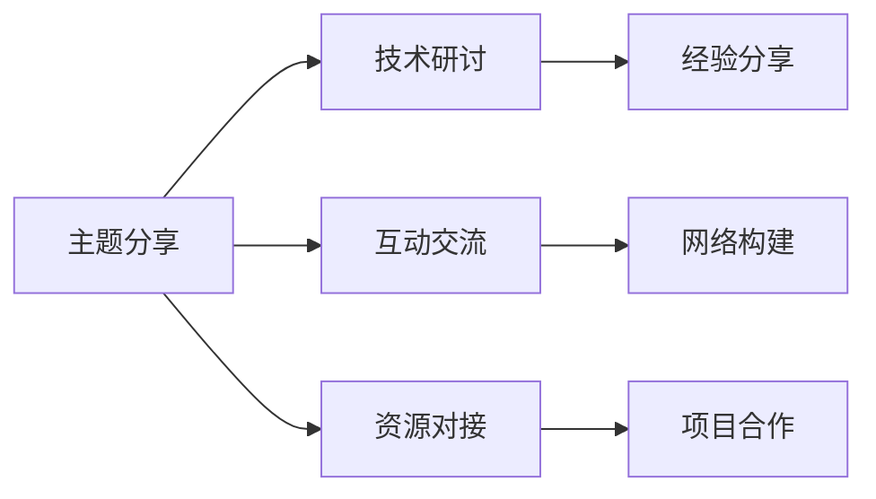

                 

## 1. 背景介绍

在数字化和智能化的浪潮下，个人品牌建设成为了连接个体与市场的桥梁，成为驱动个人职业发展的关键因素。越来越多的专业人士开始意识到个人品牌的重要性，并积极构建个人影响力。然而，如何高效地建立和推广个人品牌，依然是一个挑战性的问题。本文将介绍一种新兴的盛会模式——建立个人品牌年度盛会，通过聚集行业影响力，提升个人品牌价值，促进职业发展。

## 2. 核心概念与联系

### 2.1 核心概念概述

建立个人品牌年度盛会（Yearly Brand Building Summit, YBBS）是指每年定期举办的一系列活动，旨在汇聚行业内的专家学者、企业家、技术爱好者，通过交流、分享、合作，提升参会者的品牌影响力和职业发展。这些活动通常包括：

- **主题分享**：围绕当前热点话题或技术趋势，邀请行业领袖进行深度分享。
- **技术研讨**：聚焦特定技术或应用场景，进行技术研讨和实验展示。
- **互动交流**：通过圆桌讨论、工作坊、Q&A等形式，促进与会者之间的互动与交流。
- **资源对接**：提供项目展示、人才招聘、投资对接等机会，促进资源的高效流动。

通过这些活动的举办，不仅能够提升参与者的个人品牌，还能推动行业发展，形成积极的行业生态。

### 2.2 核心概念原理和架构的 Mermaid 流程图



这个流程图展示了YBBS的核心活动流程：
1. 主题分享开启大会序幕，引出具体话题或技术。
2. 技术研讨深入探讨，展示最新研究成果和应用。
3. 互动交流促进知识交换，建立人脉网络。
4. 资源对接促进合作，推动项目落地。

### 2.3 核心概念原理和架构的说明

通过上述流程图，我们可以看出YBBS的核心架构是围绕“分享、研讨、交流、对接”四个环节展开的。这些环节相互促进，共同构建一个以个人品牌建设为中心，以技术创新为驱动，以资源合作为目标的盛会体系。

## 3. 核心算法原理 & 具体操作步骤

### 3.1 算法原理概述

YBBS的算法原理可以简单描述为“个人品牌资产的增长模型”。通过一系列精心设计的主题分享和技术研讨，参与者能够不断积累个人品牌资产，如专业知识的广度和深度、技术创新的数量和质量、合作项目的规模和影响力等。这些资产的增长，反过来又能够增强个人品牌的影响力，吸引更多的关注和合作机会。

### 3.2 算法步骤详解

#### 3.2.1 主题选择与设计

1. **调研与分析**：通过市场调研和专家咨询，确定年度盛会的主题，确保其与行业热点和技术趋势相契合。
2. **主题规划**：将主题分解为若干子话题，并设计详细的议程，每个子话题由行业内专家负责讲解。
3. **专家邀请**：根据主题和议程，邀请具有丰富经验和影响力的人士担任主讲人，并根据其专业背景和发言效果进行动态调整。

#### 3.2.2 活动筹备与执行

1. **技术平台搭建**：选择合适的技术平台，如Zoom、Bilibili等，搭建活动现场，支持高清视频、互动问答等功能。
2. **宣传与推广**：通过社交媒体、行业协会、专业论坛等渠道，广泛宣传活动信息，吸引目标人群报名参与。
3. **活动执行**：确保各项活动按计划进行，并提供技术支持，如实时翻译、录制回放、在线讨论区等。

#### 3.2.3 成果展示与总结

1. **内容整理与分享**：将主题分享和技术研讨的录音、视频、PPT等整理成资料，发布在官方网站和社交媒体上，供后续学习和参考。
2. **数据收集与分析**：收集参与者反馈、活动互动数据等，分析活动的成效和不足之处。
3. **成果展示与总结报告**：撰写年度盛会的总结报告，评估活动效果，提出改进建议，并发布在官方网站和行业媒体上，进一步提升品牌影响力。

### 3.3 算法优缺点

#### 3.3.1 优点

1. **系统化品牌建设**：通过系统化的活动设计，帮助参与者有目的地积累品牌资产，形成个人品牌体系。
2. **多维度互动交流**：提供多种形式的互动交流机会，有助于建立广泛的人脉网络，促进信息共享和资源对接。
3. **提升行业影响力**：通过汇聚行业内的专家学者和企业家，推动技术创新和合作，提升行业整体的竞争力。

#### 3.3.2 缺点

1. **资源投入高**：需要大量的时间、人力、物力投入，特别是专家邀请和活动筹备环节。
2. **组织难度大**：涉及众多参与者和管理细节，需要高效的项目管理和协调能力。
3. **活动效果不确定**：活动效果受到主题选择、专家质量、参与者反馈等多方面因素影响，存在一定的不确定性。

### 3.4 算法应用领域

YBBS不仅适用于技术类盛会，还适用于管理、艺术、教育等多个领域。只要围绕核心主题，进行精心策划和执行，就可以吸引广泛的参与者，提升个人品牌和行业影响力。

## 4. 数学模型和公式 & 详细讲解 & 举例说明

### 4.1 数学模型构建

假设一个参会者在活动中的品牌资产可以表示为 $A_t$，其初始值为 $A_0$。品牌资产的变化率可以表示为：

$$
\frac{dA_t}{dt} = \alpha(S_t + R_t + I_t + O_t) - \beta A_t
$$

其中，$S_t$ 为通过主题分享增加的品牌资产，$R_t$ 为通过技术研讨增加的品牌资产，$I_t$ 为通过互动交流增加的品牌资产，$O_t$ 为通过资源对接增加的品牌资产，$\alpha$ 为品牌资产增长系数，$\beta$ 为品牌资产衰减系数。

### 4.2 公式推导过程

1. **主题分享增加的品牌资产**：假设主题分享每次增加 $S_0$ 单位品牌资产，每年举办 $n$ 次主题分享，则 $S_t = S_0n$。
2. **技术研讨增加的品牌资产**：假设技术研讨每次增加 $R_0$ 单位品牌资产，每年举办 $m$ 次技术研讨，则 $R_t = R_0m$。
3. **互动交流增加的品牌资产**：假设互动交流每次增加 $I_0$ 单位品牌资产，每年举办 $k$ 次互动交流，则 $I_t = I_0k$。
4. **资源对接增加的品牌资产**：假设资源对接每次增加 $O_0$ 单位品牌资产，每年举办 $p$ 次资源对接，则 $O_t = O_0p$。

将这些值代入品牌资产变化率的公式，可以得到：

$$
\frac{dA_t}{dt} = \alpha(S_0n + R_0m + I_0k + O_0p) - \beta A_t
$$

### 4.3 案例分析与讲解

假设每年举办 $n=5$ 次主题分享，每次增加 $S_0=1$ 单位品牌资产；$R_0=2$ 单位品牌资产，每年举办 $m=3$ 次技术研讨；$I_0=0.5$ 单位品牌资产，每年举办 $k=4$ 次互动交流；$O_0=0.8$ 单位品牌资产，每年举办 $p=2$ 次资源对接；品牌资产增长系数 $\alpha=0.1$，衰减系数 $\beta=0.05$。

初始品牌资产 $A_0=100$，可以计算每年品牌资产的变化情况，并绘制品牌资产增长曲线。

## 5. 项目实践：代码实例和详细解释说明

### 5.1 开发环境搭建

#### 5.1.1 搭建技术平台

1. **选择技术平台**：选择具备高清视频、互动问答等功能的在线会议平台，如Zoom、Bilibili等。
2. **配置硬件与网络**：确保会场具备稳定的网络连接和高清摄录设备，提供良好的参会体验。
3. **开发支持工具**：开发或使用实时翻译、录制回放、在线讨论区等支持工具，提升参会效率和互动效果。

#### 5.1.2 活动宣传与推广

1. **制定宣传计划**：制定详细的宣传计划，明确宣传渠道和时间节点。
2. **制作宣传材料**：制作海报、宣传视频、活动介绍等宣传材料，吸引目标人群。
3. **多渠道推广**：通过社交媒体、行业协会、专业论坛等渠道进行广泛宣传。

### 5.2 源代码详细实现

#### 5.2.1 主题分享功能

1. **视频会议功能**：实现高质量的视频会议功能，支持多画面切换、实时字幕、录制回放等。
2. **互动功能**：实现实时问答、投票、讨论等功能，增强互动效果。
3. **资料分享功能**：支持主讲人上传PPT、视频、录音等资料，供参会者下载。

#### 5.2.2 技术研讨功能

1. **实验展示功能**：支持技术研讨中的实验展示，实现实时演示、代码运行、数据展示等。
2. **在线协作功能**：支持多人在线协作，实现实时代码编辑、数据共享等。
3. **数据收集功能**：收集研讨过程中的数据，如实验结果、代码片段、讨论内容等，供后续分析和学习。

#### 5.2.3 互动交流功能

1. **圆桌讨论功能**：支持多轮圆桌讨论，设置主题和讨论规则，记录讨论内容。
2. **工作坊功能**：支持小规模的技术工作坊，实现分组讨论、项目合作等。
3. **问答功能**：支持Q&A环节，回答参会者的疑问，记录问答内容。

#### 5.2.4 资源对接功能

1. **项目展示功能**：支持参会者展示项目，吸引潜在的合作方。
2. **人才招聘功能**：支持企业发布招聘信息，吸引高水平人才。
3. **投资对接功能**：支持投资机构发布投资信息，对接潜在的投资机会。

### 5.3 代码解读与分析

#### 5.3.1 主题分享功能

```python
from flask import Flask, request, render_template
from jinja2 import Template
import cv2

app = Flask(__name__)

@app.route('/share')
def share_topic():
    topic = request.args.get('topic')
    # 加载主题分享内容，支持PPT、视频、录音等格式
    # 实时翻译和字幕功能
    # 录制回放功能
    # 其他相关功能

    return render_template('share.html', topic=topic)

if __name__ == '__main__':
    app.run(debug=True)
```

#### 5.3.2 技术研讨功能

```python
from flask import Flask, request, render_template
from jinja2 import Template
import cv2

app = Flask(__name__)

@app.route('/discuss')
def discuss_topic():
    topic = request.args.get('topic')
    # 实验展示功能
    # 在线协作功能
    # 数据收集功能

    return render_template('discuss.html', topic=topic)

if __name__ == '__main__':
    app.run(debug=True)
```

#### 5.3.3 互动交流功能

```python
from flask import Flask, request, render_template
from jinja2 import Template
import cv2

app = Flask(__name__)

@app.route('/interact')
def interact():
    topic = request.args.get('topic')
    # 圆桌讨论功能
    # 工作坊功能
    # 问答功能

    return render_template('interact.html', topic=topic)

if __name__ == '__main__':
    app.run(debug=True)
```

#### 5.3.4 资源对接功能

```python
from flask import Flask, request, render_template
from jinja2 import Template
import cv2

app = Flask(__name__)

@app.route('/对接')
def connect():
    topic = request.args.get('topic')
    # 项目展示功能
    # 人才招聘功能
    # 投资对接功能

    return render_template('connect.html', topic=topic)

if __name__ == '__main__':
    app.run(debug=True)
```

### 5.4 运行结果展示

通过上述代码实现，可以搭建一个具备主题分享、技术研讨、互动交流、资源对接等功能的活动平台。参会者可以通过平台参与各项活动，获取最新的行业资讯和技术进展，并与业内专家进行互动和合作。

## 6. 实际应用场景

### 6.1 智能制造领域

在智能制造领域，建立个人品牌年度盛会可以汇聚制造行业的专家学者、工程师、企业家，共同探讨智能制造的技术趋势和应用案例。通过主题分享、技术研讨、互动交流和资源对接，推动智能制造的创新和发展，提升参会者的品牌价值。

### 6.2 医疗健康领域

在医疗健康领域，建立个人品牌年度盛会可以汇聚医学领域的专家学者、医生、患者，共同探讨医疗健康的新技术和新方法。通过主题分享、技术研讨、互动交流和资源对接，推动医疗健康行业的创新和发展，提升参会者的品牌价值。

### 6.3 教育培训领域

在教育培训领域，建立个人品牌年度盛会可以汇聚教育行业的专家学者、教师、学生，共同探讨教育培训的新模式和新方法。通过主题分享、技术研讨、互动交流和资源对接，推动教育培训行业的创新和发展，提升参会者的品牌价值。

### 6.4 未来应用展望

未来，随着数字化和智能化的深入发展，个人品牌年度盛会将成为连接个体与市场的桥梁，成为推动行业创新和发展的关键工具。通过聚集行业影响力，提升个人品牌价值，促进职业发展，构建良性发展的行业生态。

## 7. 工具和资源推荐

### 7.1 学习资源推荐

1. **《品牌建设指南》**：系统介绍品牌建设的方法和策略，涵盖品牌定位、品牌推广、品牌管理等多个方面。
2. **《影响力心理学》**：深入探讨影响力形成的心理机制，帮助个人提升影响力。
3. **《技术创新管理》**：介绍技术创新的方法和流程，推动行业发展。
4. **《项目管理》**：系统介绍项目管理的方法和工具，提升活动组织能力。
5. **《数据科学基础》**：掌握数据分析和处理的方法，提升活动数据分析能力。

### 7.2 开发工具推荐

1. **Flask**：轻量级的Web框架，适合搭建Web应用，支持Python开发。
2. **Zoom/Bilibili**：高质量的在线会议平台，支持高清视频、互动问答等。
3. **Jinja2**：Python的模板引擎，支持动态生成HTML页面。
4. **OpenCV**：开源计算机视觉库，支持图像和视频处理。

### 7.3 相关论文推荐

1. **《个人品牌建设与影响力形成机制研究》**：探讨个人品牌建设的理论基础和实践方法。
2. **《技术研讨与交流平台设计》**：介绍技术研讨与交流平台的设计和实现方法。
3. **《资源对接与合作机制研究》**：研究资源对接与合作机制，提升资源对接效果。

## 8. 总结：未来发展趋势与挑战

### 8.1 研究成果总结

本文介绍了建立个人品牌年度盛会的方法和应用场景，探讨了其背后的算法原理和具体操作步骤。通过系统化的活动设计，帮助参与者积累品牌资产，提升个人品牌价值，推动行业发展。

### 8.2 未来发展趋势

1. **技术融合**：未来的盛会将更多地融合新兴技术，如AI、区块链、VR等，提升参会体验和活动效果。
2. **全球化**：盛会将拓展到全球范围，吸引全球范围内的专家学者和企业家，形成国际化的交流平台。
3. **内容多样化**：盛会的内容将更加多样化，涵盖更多领域和话题，满足不同参会者的需求。

### 8.3 面临的挑战

1. **组织难度**：盛会的组织难度较大，需要高效的项目管理和协调能力。
2. **资源投入**：盛会需要大量的资源投入，包括专家邀请、技术平台搭建、宣传推广等。
3. **效果评估**：盛会的效果评估需要精细化的数据分析和评估方法。

### 8.4 研究展望

未来，需要进一步研究盛会的组织策略、效果评估方法、参与者激励机制等，提升盛会的组织效果和参会体验。同时，探索更多的资源对接和合作机制，促进参会者之间的互动和合作。

## 9. 附录：常见问题与解答

**Q1：建立个人品牌年度盛会如何选择合适的专家？**

A: 选择合适的专家是盛会成功的关键。建议根据主题和议程，选择具有丰富经验和影响力的专家，并根据其专业背景和发言效果进行动态调整。可以通过行业协会、专业论坛、社交媒体等渠道进行专家邀请。

**Q2：如何提升盛会的参与度和互动效果？**

A: 提升盛会的参与度和互动效果，需要从多个方面进行优化：
1. **主题选择**：选择与行业热点和技术趋势相契合的主题，吸引更多的目标人群。
2. **技术支持**：提供高质量的技术支持，如实时翻译、录制回放、在线讨论区等。
3. **互动活动**：设计多样化的互动活动，如圆桌讨论、工作坊、Q&A等，增强参会者的参与感和互动效果。
4. **参会奖励**：提供参会奖励，如证书、礼品、积分等，激励参会者积极参与。

**Q3：如何评估盛会的效果？**

A: 评估盛会的效果需要从多个维度进行量化分析：
1. **参与人数**：统计参会人数和报名人数，评估活动的吸引力。
2. **互动数据**：收集参会者的互动数据，如提问数量、讨论时长、点赞数等，评估活动的互动效果。
3. **反馈评价**：通过问卷调查、参会者评价等方式，收集参会者的反馈意见，评估活动的满意度。
4. **数据统计**：收集和分析活动过程中的数据，如观看次数、分享次数、下载次数等，评估活动的传播效果。

**Q4：如何保障盛会的安全性和合规性？**

A: 保障盛会的安全性和合规性，需要从多个方面进行管理：
1. **网络安全**：确保盛会的平台具备可靠的网络安全措施，防止数据泄露和恶意攻击。
2. **合规管理**：确保盛会的活动内容符合相关法律法规和行业规范，防止侵权和违法情况。
3. **数据保护**：确保参会者的个人信息和数据隐私得到保护，防止数据滥用和泄露。

**Q5：如何提升盛会的长期可持续性？**

A: 提升盛会的长期可持续性，需要从多个方面进行优化：
1. **品牌建设**：建立品牌意识，通过持续的品牌建设和宣传，提升盛会的知名度和影响力。
2. **资源整合**：整合行业资源，形成稳定的合作和资源对接机制，增强盛会的可持续性。
3. **反馈改进**：根据参会者的反馈意见，不断改进活动设计和管理流程，提升参会体验和活动效果。

---

作者：禅与计算机程序设计艺术 / Zen and the Art of Computer Programming

