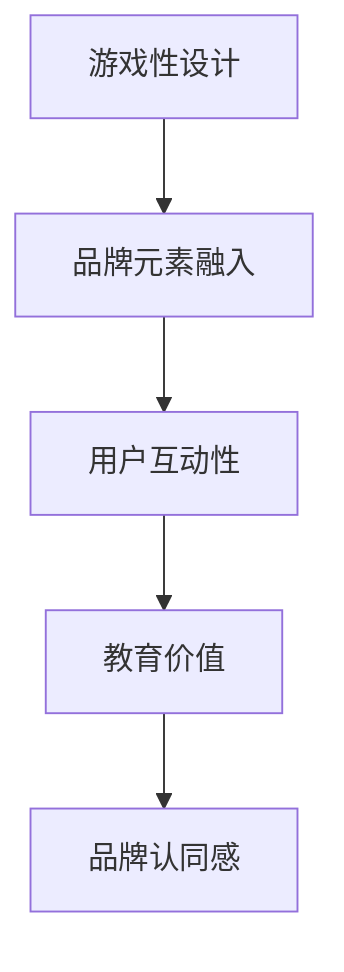

                 

# 开发个人品牌互动游戏：寓教于乐

在数字化时代，个人品牌的建立和维护已经成为了现代社会中不可或缺的一环。无论是企业家、专业人士还是普通大众，一个清晰、有力的个人品牌都能够极大地提升自身的竞争力和影响力。然而，打造个人品牌并非易事，它需要时间、精力和恰当的策略。在这个过程中，开发一款寓教于乐的互动游戏，不仅能增加品牌互动性，还能在娱乐中潜移默化地传递品牌价值，帮助用户提升个人品牌影响力。本文将探讨如何开发个人品牌互动游戏，并从技术角度阐述其实现过程。

## 1. 背景介绍

### 1.1 问题由来
在现代社会，个人品牌的构建面临着前所未有的挑战。互联网的快速发展使得信息爆炸，人们的注意力被分散在各个平台和应用中。如何在众多竞争者中脱颖而出，打造一个独特且持久的个人品牌，成为了一个重要课题。尽管传统的品牌推广手段如社交媒体、博客等仍然有效，但它们往往需要投入大量的时间和精力，且效果具有不确定性。

随着游戏行业的蓬勃发展，越来越多的企业开始将游戏作为品牌推广的利器。游戏不仅仅是一种娱乐方式，它能够以一种独特且深入人心的方式传递品牌价值，通过沉浸式的体验，激发用户的情感共鸣和品牌忠诚度。因此，将游戏与品牌推广相结合，开发寓教于乐的个人品牌互动游戏，成为了一种新的品牌推广策略。

### 1.2 问题核心关键点
在开发个人品牌互动游戏的过程中，以下几个核心关键点需要特别关注：

1. **游戏性设计**：一款成功的品牌互动游戏需要具备高度的游戏性，才能吸引用户持续参与。游戏性包括但不限于故事背景、角色设定、关卡设计等。
2. **品牌元素融入**：游戏应巧妙地融入品牌元素，如品牌口号、Logo、色调等，以强化品牌认知。
3. **用户互动性**：游戏应具有高度的用户互动性，能够激励用户分享和讨论，进一步扩大品牌影响力。
4. **教育价值**：游戏应具备一定的教育价值，帮助用户提升相关知识和技能，从而增强用户对品牌的认同感。

这些关键点需要开发者在开发过程中综合考虑，才能打造出一款既有趣又具有教育意义的个人品牌互动游戏。

## 2. 核心概念与联系

### 2.1 核心概念概述

在探讨如何开发个人品牌互动游戏之前，我们需要先理解几个核心概念：

1. **游戏性设计**：指游戏的设计和开发过程中，以提升用户游戏体验为核心，通过精心设计的玩法、规则、奖励机制等，吸引用户长时间投入。
2. **品牌元素融入**：指在游戏中巧妙地融入品牌的元素，如Logo、口号、颜色等，以增强品牌识别度。
3. **用户互动性**：指游戏设计中注重用户之间的互动，如论坛、社区、排行榜等，以增强用户粘性和品牌传播。
4. **教育价值**：指游戏内容具备一定的教育意义，能够帮助用户学习新知识或提升已有技能，从而增强用户对品牌的认同感。

这些概念相互联系，共同构成了一款成功的品牌互动游戏。

### 2.2 核心概念原理和架构的 Mermaid 流程图



这个流程图展示了核心概念之间的逻辑关系。游戏性设计是基础，品牌元素融入和用户互动性是提升游戏吸引力的手段，教育价值则是增强品牌认同感的关键。

## 3. 核心算法原理 & 具体操作步骤

### 3.1 算法原理概述

开发个人品牌互动游戏的过程可以分为以下几个步骤：

1. **需求分析**：分析品牌需求和目标用户群体，确定游戏的核心玩法、教育内容和品牌元素。
2. **游戏设计**：基于需求分析，设计游戏的故事背景、角色设定、关卡设计等。
3. **开发实现**：使用合适的游戏引擎和开发工具，实现游戏的功能和逻辑。
4. **测试优化**：在游戏开发的各个阶段进行测试，并根据用户反馈进行优化。
5. **上线推广**：完成游戏上线后，进行市场推广和用户互动，收集用户数据进行后续优化。

### 3.2 算法步骤详解

#### 3.2.1 需求分析

需求分析是开发个人品牌互动游戏的第一步。具体步骤如下：

1. **品牌调研**：了解品牌的核心价值、品牌故事、目标受众等。
2. **用户分析**：确定目标用户群体的特点、需求和偏好。
3. **核心玩法确定**：基于品牌需求和用户分析，确定游戏的核心玩法和教育内容。
4. **品牌元素设计**：融入品牌Logo、口号、颜色等元素，确保品牌识别度。

#### 3.2.2 游戏设计

游戏设计是开发过程中最重要的环节。具体步骤如下：

1. **故事背景设计**：设计游戏的故事背景，使品牌元素融入其中。
2. **角色设定**：创建游戏中的角色，使其与品牌形象相符。
3. **关卡设计**：设计游戏关卡，确保游戏的可玩性和教育价值。
4. **奖励机制**：设计合理的奖励机制，激励用户持续参与。

#### 3.2.3 开发实现

开发实现阶段需要使用合适的游戏引擎和开发工具。常见的游戏引擎包括Unity、Unreal Engine等。开发工具包括Visual Studio、Xcode等。具体步骤如下：

1. **引擎选择**：选择适合的游戏引擎，搭建游戏开发环境。
2. **编程实现**：使用合适的编程语言（如C#、C++、Python等），实现游戏的功能和逻辑。
3. **图形设计**：设计游戏界面和图形，确保品牌元素的融入。
4. **音频设计**：设计游戏背景音乐、音效等，增强游戏沉浸感。

#### 3.2.4 测试优化

测试优化阶段需要进行多次测试，并根据用户反馈进行优化。具体步骤如下：

1. **功能测试**：测试游戏的核心功能是否正常，确保游戏逻辑正确。
2. **用户体验测试**：测试用户在游戏中的体验，优化游戏界面和交互设计。
3. **性能测试**：测试游戏在不同设备和环境下的性能表现，优化游戏性能。
4. **用户反馈收集**：收集用户反馈，进行游戏优化和改进。

#### 3.2.5 上线推广

上线推广阶段需要进行市场推广和用户互动，具体步骤如下：

1. **市场推广**：通过社交媒体、广告、搜索引擎优化等方式进行市场推广。
2. **用户互动**：通过论坛、社区、排行榜等机制，增加用户互动，增强用户粘性。
3. **数据收集**：收集用户数据，分析用户行为和偏好，进行后续优化。

### 3.3 算法优缺点

开发个人品牌互动游戏的优点包括：

1. **品牌认知度提升**：通过游戏性设计和品牌元素融入，能够显著提升品牌的认知度和影响力。
2. **用户粘性增强**：游戏具备高度的互动性和教育价值，能够增强用户的粘性和忠诚度。
3. **市场推广效果显著**：游戏能够通过社交媒体、论坛等渠道进行广泛传播，扩大品牌影响。

开发个人品牌互动游戏的缺点包括：

1. **开发周期较长**：开发一款成功的品牌互动游戏需要大量的时间和精力，且具有较高的技术门槛。
2. **成本投入较高**：开发过程中需要投入大量的资金和人力资源，且存在不确定性。
3. **用户群体选择困难**：确定合适的用户群体较为困难，需要深入市场调研和用户分析。

### 3.4 算法应用领域

开发个人品牌互动游戏适用于多种品牌推广场景，如：

1. **企业品牌推广**：通过游戏传播企业品牌价值，提升企业形象和市场竞争力。
2. **教育机构推广**：通过游戏普及科学知识，提升教育机构品牌形象。
3. **个人品牌推广**：通过游戏展示个人才华和品牌理念，提升个人品牌影响力。

## 4. 数学模型和公式 & 详细讲解

### 4.1 数学模型构建

开发个人品牌互动游戏涉及多个学科的知识，如游戏设计、人工智能、数据分析等。这里我们主要关注数学模型和公式在其中的应用。

### 4.2 公式推导过程

以一个简单的教育类游戏为例，我们可以建立如下数学模型：

设$N$为游戏用户总数，$E$为用户的教育提升度（如数学知识掌握程度），$T$为用户参与游戏的时长，$C$为用户获得的奖励点数，则用户教育提升度的计算公式为：

$$
E = f(T, C)
$$

其中$f(T, C)$为函数，表示用户参与游戏时间$T$和获得的奖励点数$C$对教育提升度$E$的影响。具体公式为：

$$
E = \alpha T + \beta C + \gamma
$$

其中$\alpha$、$\beta$为影响因子，$\gamma$为教育基线值。

### 4.3 案例分析与讲解

假设某教育品牌开发了一款数学教育游戏，用户在参与游戏过程中，通过解数学题获得奖励点数。每解答一个问题，用户获得$1$个奖励点数。在每个关卡结束后，用户获得的奖励点数乘以一个系数，表示游戏难度的不同。

设$T$为用户在当前关卡中的游戏时间，$C$为该关卡中获得的奖励点数，则用户教育提升度的计算公式为：

$$
E = 0.1T + 0.2C + 0.5
$$

通过这个公式，品牌可以准确了解用户在每个关卡中的学习效果，从而进行后续教育内容的调整和优化。

## 5. 项目实践：代码实例和详细解释说明

### 5.1 开发环境搭建

开发环境搭建是开发过程中的重要环节，具体步骤如下：

1. **环境安装**：安装Python、Unity、Unreal Engine等开发环境。
2. **工具配置**：配置Visual Studio、Xcode等开发工具，确保代码的开发和调试。
3. **数据准备**：准备游戏所需的素材（如角色模型、背景音乐、音效等）。

### 5.2 源代码详细实现

以Unity引擎为例，游戏源代码的详细实现步骤如下：

1. **场景设计**：在Unity编辑器中设计游戏场景，添加游戏元素。
2. **角色动画**：创建游戏中的角色动画，确保角色动作流畅自然。
3. **游戏逻辑**：编写游戏逻辑脚本，实现游戏功能。
4. **用户互动**：设计用户互动机制，如论坛、排行榜等，增强用户粘性。

### 5.3 代码解读与分析

在Unity引擎中，我们主要使用C#语言进行游戏开发。以创建角色动画为例，具体代码如下：

```csharp
using UnityEngine;

public class CharacterAnimation : MonoBehaviour
{
    public Animator animator;

    void Update()
    {
        // 获取用户输入
        if (Input.GetMouseButtonDown(0))
        {
            // 播放角色动画
            animator.Play("Idle");
        }
    }
}
```

### 5.4 运行结果展示

运行上述代码后，用户可以通过点击鼠标按钮，触发角色动画的播放。这是一个简单的例子，实际开发中需要编写更复杂的代码，实现更多的游戏功能和逻辑。

## 6. 实际应用场景

### 6.1 企业品牌推广

某知名企业开发了一款基于其品牌故事的游戏，通过游戏传播企业价值观，提升企业形象和市场竞争力。该游戏通过丰富的故事情节和角色设定，吸引用户沉浸其中，同时在游戏中融入企业Logo、口号等元素，增强品牌识别度。

### 6.2 教育机构推广

某教育机构开发了一款数学教育游戏，通过游戏普及科学知识，提升教育机构品牌形象。该游戏通过解数学题的方式，在游戏中融入教育元素，帮助用户提升数学知识掌握程度，同时在游戏中穿插品牌元素，提升用户对品牌的认知度。

### 6.3 个人品牌推广

某知名作家开发了一款文学创作游戏，通过游戏展示其创作风格和品牌理念，提升个人品牌影响力。该游戏通过角色设定和故事情节，展示作家的创作世界，同时在游戏中融入作家的Logo、签名等元素，增强用户对品牌的认同感。

## 7. 工具和资源推荐

### 7.1 学习资源推荐

以下是几款用于开发个人品牌互动游戏的学习资源：

1. **《游戏设计艺术》**：一本经典的游戏设计书籍，涵盖了游戏设计的各个方面，包括故事背景、角色设定、关卡设计等。
2. **《Unity游戏开发入门教程》**：一本针对Unity引擎的游戏开发教程，帮助开发者快速掌握Unity引擎的使用。
3. **《人工智能导论》**：一本关于人工智能的入门书籍，帮助开发者了解人工智能在游戏中的应用。
4. **《Unreal Engine 5实战教程》**：一本针对Unreal Engine 5的游戏开发教程，帮助开发者快速掌握Unreal Engine的使用。

### 7.2 开发工具推荐

以下是几款常用的游戏开发工具：

1. **Unity**：一款功能强大的游戏引擎，支持多种平台和设备。
2. **Unreal Engine**：一款功能强大的游戏引擎，支持实时渲染和高质量图形。
3. **Visual Studio**：一款流行的开发环境，支持多种编程语言和游戏引擎。
4. **Xcode**：一款苹果官方的开发环境，支持iOS和macOS平台的游戏开发。

### 7.3 相关论文推荐

以下是几篇关于开发个人品牌互动游戏的相关论文：

1. **《互动式教育游戏设计》**：探讨了互动式教育游戏的概念和设计方法，提供了丰富的案例分析。
2. **《品牌传播与游戏化营销》**：研究了品牌传播与游戏化营销的结合，分析了其应用效果和影响。
3. **《人工智能在游戏开发中的应用》**：探讨了人工智能在游戏开发中的应用，提供了具体的实现方法和案例。

## 8. 总结：未来发展趋势与挑战

### 8.1 研究成果总结

开发个人品牌互动游戏在近年来取得了显著进展，尤其在品牌推广、教育普及等领域取得了广泛应用。通过寓教于乐的方式，能够显著提升品牌影响力和用户粘性，具有广阔的发展前景。

### 8.2 未来发展趋势

未来，个人品牌互动游戏的发展趋势包括：

1. **技术融合**：游戏与人工智能、虚拟现实等技术的融合将更加深入，带来更沉浸式的用户体验。
2. **教育价值提升**：游戏将更注重教育价值，帮助用户掌握更多知识和技能。
3. **跨平台推广**：游戏将支持多种平台和设备，实现跨平台推广和互动。
4. **用户互动性增强**：游戏将更注重用户互动性，增强用户粘性和品牌传播效果。

### 8.3 面临的挑战

开发个人品牌互动游戏面临的挑战包括：

1. **技术门槛高**：开发一款成功的品牌互动游戏需要较高的技术门槛，需要综合考虑游戏性设计、教育价值等多个方面。
2. **成本投入大**：开发过程中需要投入大量的资金和人力资源，且存在不确定性。
3. **用户群体选择困难**：确定合适的用户群体较为困难，需要深入市场调研和用户分析。

### 8.4 研究展望

未来的研究方向包括：

1. **技术创新**：研究和开发更多游戏引擎和技术工具，提高开发效率和游戏体验。
2. **教育价值提升**：开发更多具有教育价值的互动游戏，帮助用户掌握更多知识和技能。
3. **跨平台推广**：探索跨平台推广和互动的实现方法，提升品牌影响力。

## 9. 附录：常见问题与解答

**Q1：如何确定合适的用户群体？**

A: 确定合适的用户群体需要进行深入的市场调研和用户分析。可以通过社交媒体、问卷调查等方式，了解目标用户群体的特点、需求和偏好。同时，通过A/B测试等方法，验证不同用户群体对游戏的接受度和互动性。

**Q2：如何在游戏中融入品牌元素？**

A: 在游戏设计过程中，应巧妙地融入品牌Logo、口号、颜色等元素。可以通过UI设计、角色设定等方式，将品牌元素自然地融入游戏中。

**Q3：如何提高游戏的教育价值？**

A: 提高游戏的教育价值需要精心设计游戏内容和关卡，确保游戏既能吸引用户，又能帮助用户掌握相关知识和技能。可以通过游戏提示、教程等方式，引导用户逐步掌握游戏内容。

**Q4：如何在游戏中实现用户互动？**

A: 实现用户互动需要设计合理的论坛、社区、排行榜等机制。通过这些机制，用户可以互相交流、分享游戏心得，增强游戏互动性。

通过以上分析和阐述，希望读者能够全面了解开发个人品牌互动游戏的方法和技巧，能够结合品牌需求和用户特点，打造出既有趣又具有教育价值的互动游戏。开发一款成功的品牌互动游戏，不仅能够提升品牌影响力，还能够帮助用户提升自身价值，具有广阔的发展前景。

---

作者：禅与计算机程序设计艺术 / Zen and the Art of Computer Programming

