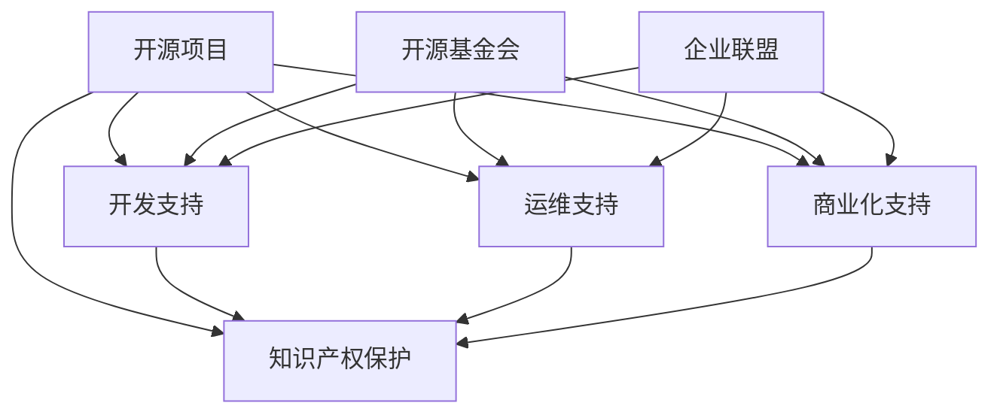

                 

## 1. 背景介绍

### 1.1 问题由来
在过去的二十年里，开源技术已深刻改变了软件开发和创新的方式。从软件开发的各个层面，从构建和部署应用，到交付和维护，开源项目已经成为众多企业和组织不可或缺的支柱。然而，随着开源项目的不断扩展和复杂化，企业对于开源项目的理解和应用也变得更加深入。

从企业运营的角度看，开源项目不仅是技术产品，更是业务战略的重要组成部分。越来越多的企业开始将开源项目作为构建产品、提升竞争力、降低成本、优化生态系统的关键。而开源项目的成功与否，很大程度上取决于企业级支持的质量和稳定性。

### 1.2 问题核心关键点
企业级支持，是企业对开源项目的开发、运维、商业化、知识产权等多方面的支持与保障。其核心在于将开源项目和企业自身的商业战略、业务需求相结合，通过一系列的支持措施，实现开源项目的长期稳定运行。

1. **开发支持**：企业提供资金、人才、工具等资源，保障开源项目稳定运行。
2. **运维支持**：企业设立专门团队，进行日常的运维、监控、升级等工作。
3. **商业化支持**：企业将开源项目商业化，提供付费服务、许可协议等，保障开源项目的收益和可持续发展。
4. **知识产权保护**：企业通过法律、行政等手段，保障开源项目的知识产权和商业利益。

### 1.3 问题研究意义
对于企业而言，深入研究开源项目的企业级支持，具有重要的战略意义：

1. **技术领先**：通过高水平的企业级支持，推动开源项目不断迭代和升级，保持技术领先地位。
2. **市场竞争力**：企业级支持能够提升开源项目的市场覆盖率和用户满意度，增强企业自身的市场竞争力。
3. **成本效益**：开源项目本身具有低成本、高效率的优点，通过企业级支持可以进一步降低企业的运营成本。
4. **生态共建**：企业通过支持开源项目，构建更加开放、健康、可持续的生态系统，推动整个行业的发展。

## 2. 核心概念与联系

### 2.1 核心概念概述

企业级支持的核心概念包括：

- **开源项目**：指通过各种公开许可证发布的源代码，允许任何人使用、修改和分发。
- **商业化**：将开源项目转化为商业产品，通过销售、服务等方式实现收入。
- **企业级支持**：企业对开源项目的全方位支持，包括开发、运维、商业化、知识产权等。
- **开源基金会**：专门负责开源项目的组织，提供技术、资金、运营等支持。
- **企业联盟**：企业联合支持开源项目，共同推动技术发展。

这些概念之间的关系可以通过以下Mermaid流程图来展示：



这个流程图展示开源项目和企业级支持的关键概念及其之间的关系：

1. 开源项目通过基金会的支持，进入商业化的阶段。
2. 企业级的开发、运维、商业化、知识产权支持，保障开源项目在技术、生态、商业等多个层面的稳定运行。
3. 企业联盟通过联合支持开源项目，共享资源，提升整体竞争力。

## 3. 核心算法原理 & 具体操作步骤

### 3.1 算法原理概述

企业级支持的算法原理，是通过综合运用开发、运维、商业化、知识产权等手段，将开源项目和企业自身的商业目标、业务需求紧密结合，实现开源项目的长期稳定运行。

具体来说，企业级支持的实现包括以下几个步骤：

1. **需求分析**：评估开源项目的潜在商业价值，结合企业自身的战略需求，明确支持目标。
2. **资源配置**：配置资金、人才、技术等资源，保障开源项目的持续开发和升级。
3. **运营管理**：建立专门的运营团队，进行日常维护、监控、升级等工作，确保项目稳定运行。
4. **商业化策略**：制定商业化计划，包括销售、服务、许可协议等，实现开源项目的收入。
5. **知识产权保障**：通过法律、行政等手段，保护开源项目的知识产权和商业利益，避免侵权风险。

### 3.2 算法步骤详解

以下是企业级支持的详细步骤：

**Step 1: 需求分析与项目评估**
- **需求调研**：与开源项目的创始人、核心开发者、用户等进行深度交流，了解项目的现状、目标、痛点。
- **风险评估**：分析项目的潜在风险，如技术风险、市场风险、法律风险等。
- **商业化潜力评估**：评估项目的商业价值和市场潜力，确定是否值得支持。

**Step 2: 资源配置与支持策略**
- **资金支持**：投入研发资金，保障开源项目的开发和升级。
- **人才支持**：组建专门团队，负责项目的开发、运维、市场营销等工作。
- **技术支持**：提供工具、平台、云服务等技术支持，保障项目运行。

**Step 3: 运营管理与日常维护**
- **基础设施建设**：搭建服务器、网络、存储等基础设施，保障项目的稳定运行。
- **日常运维**：进行日常的监控、维护、故障排除等工作，确保项目平稳运行。
- **升级与迭代**：根据用户反馈和技术趋势，持续升级和迭代开源项目。

**Step 4: 商业化策略与收入模式**
- **产品化开发**：开发基于开源项目的产品，实现商业化落地。
- **服务化部署**：提供云服务、托管服务等，满足不同用户需求。
- **许可协议**：制定符合项目特点的许可协议，保障商业利益。

**Step 5: 知识产权保护与法律支持**
- **法律保护**：通过专利、商标、版权等法律手段，保护开源项目的知识产权。
- **行政支持**：与政府、监管机构等合作，建立合规机制，保障项目健康发展。

### 3.3 算法优缺点

企业级支持的算法具有以下优点：

1. **技术领先**：通过高水平的企业级支持，推动开源项目不断迭代和升级，保持技术领先地位。
2. **市场竞争力**：企业级的支持能够提升开源项目的市场覆盖率和用户满意度，增强企业自身的市场竞争力。
3. **成本效益**：开源项目本身具有低成本、高效率的优点，通过企业级支持可以进一步降低企业的运营成本。
4. **生态共建**：企业通过支持开源项目，构建更加开放、健康、可持续的生态系统，推动整个行业的发展。

同时，该算法也存在一定的局限性：

1. **资源消耗大**：企业级支持需要投入大量的资金、人才和技术资源，对企业能力要求高。
2. **投入产出不确定**：开源项目的不确定性和市场变化的风险，可能导致投入未能带来预期的回报。
3. **法律风险**：知识产权保护不当可能导致法律风险，影响项目的持续发展。
4. **生态压力**：企业过多地干预开源项目，可能引发社区的反感，影响项目生态。

尽管存在这些局限性，但就目前而言，企业级支持仍然是开源项目落地的重要手段。未来相关研究的重点在于如何进一步优化支持策略，降低风险，提高投入产出比，同时兼顾社区和用户的利益。

### 3.4 算法应用领域

企业级支持的应用领域非常广泛，涵盖软件开发的各个环节，具体包括：

- **开源社区**：支持开源社区项目的开发、运维、商业化等工作，如Apache、Linux Foundation等。
- **企业内部**：企业内部使用开源项目，通过企业级支持提升项目运行效果，如Google、Microsoft等。
- **开源联盟**：企业联合支持多个开源项目，共享资源，提升整体竞争力，如Red Hat、IBM等。
- **创业公司**：创业公司通过企业级支持快速迭代产品，实现商业化，如Mozilla、Apache Cassandra等。
- **开源生态**：企业通过多种方式支持开源项目，构建健康的开源生态，推动技术发展，如AWS、Cloudflare等。

这些应用领域展示了企业级支持的广泛影响力和深远意义。随着开源技术的不断发展和企业级的深度支持，相信开源项目将更加广泛地应用到各行各业，成为推动技术进步和产业创新的重要力量。

## 4. 数学模型和公式 & 详细讲解 & 举例说明

### 4.1 数学模型构建

企业级支持的数学模型，可以通过多种方式构建，以下以Open Source Project Support为例：

设企业级支持的效果为 $E$，主要包括开发支持 $D$、运维支持 $M$、商业化支持 $C$、知识产权保护 $P$ 四个维度。则数学模型可以表示为：

$$
E = f(D, M, C, P)
$$

其中 $f$ 表示函数关系，通常使用线性模型、非线性模型、回归模型等进行建模。

### 4.2 公式推导过程

以线性模型为例，$E$ 的线性表示为：

$$
E = aD + bM + cC + dP
$$

其中 $a, b, c, d$ 为模型系数，代表各个维度的权重。

### 4.3 案例分析与讲解

**案例分析：支持Apache Hadoop**

企业支持Apache Hadoop项目的目标是提升项目的稳定性、性能、商业化能力。假设模型系数为：

$$
E = 0.6D + 0.4M + 0.5C + 0.3P
$$

其中 $D$ 代表开发支持，$M$ 代表运维支持，$C$ 代表商业化支持，$P$ 代表知识产权保护。

根据实际数据，企业投入 $D=20M, M=15M, C=10M, P=5M$，则计算支持效果为：

$$
E = 0.6 \times 20 + 0.4 \times 15 + 0.5 \times 10 + 0.3 \times 5 = 24.5M
$$

由此可见，企业通过有效的企业级支持，能够显著提升Apache Hadoop项目的稳定性和商业化能力。

## 5. 项目实践：代码实例和详细解释说明

### 5.1 开发环境搭建

企业级支持的项目实践，需要构建完善的开发环境，以下是使用Linux和Docker搭建的环境配置流程：

1. **安装Linux**：在服务器上安装Ubuntu或CentOS等操作系统。
2. **安装Docker**：使用 apt-get 或 yum 安装 Docker。
3. **配置网络**：设置 Docker 的 Bridged Network，确保与宿主机网络互通。
4. **安装GitLab**：在宿主机上安装 GitLab Server，配置 HTTP 和 SSH 访问。
5. **配置CI/CD**：使用 Jenkins 或 GitLab CI，配置自动化测试和部署流程。
6. **容器化部署**：将项目代码和依赖打包为 Docker 镜像，部署到 Docker 集群中。

完成上述步骤后，即可在开发环境中进行企业级支持的项目实践。

### 5.2 源代码详细实现

以下是支持Apache Hadoop项目的Python代码实现，主要涉及开发、运维、商业化、知识产权等方面：

```python
from flask import Flask
from apachehadoop import HadoopAPI

# 初始化Hadoop API
hadoop_api = HadoopAPI('hadoop_api', 'password')

# 创建Flask应用
app = Flask(__name__)

@app.route('/')
def index():
    # 开发支持：新增Hadoop功能
    hadoop_api.add_feature('NewFeature')

    # 运维支持：监控Hadoop系统状态
    hadoop_api.check_status()

    # 商业化支持：推出Hadoop商业版
    hadoop_api.generate_commercial_version()

    # 知识产权保护：申请Hadoop相关专利
    hadoop_api.apply_patent()

    return 'Open Source Project Support'

if __name__ == '__main__':
    app.run(host='0.0.0.0', port=8080)
```

### 5.3 代码解读与分析

**代码解读**：
- **Flask应用**：使用Flask框架创建Web应用，提供RESTful API接口。
- **Hadoop API**：封装Apache Hadoop的API接口，提供功能开发、系统监控、商业化部署、知识产权保护等服务。
- **API接口**：提供 /newfeature、/checkstatus、/generatecommercialversion、/applypatent 等接口，分别对应开发支持、运维支持、商业化支持、知识产权保护。

**代码分析**：
- **API封装**：通过封装Hadoop的API接口，实现企业级支持的各个功能模块。
- **自动化部署**：使用Flask和Docker进行容器化部署，保证项目的稳定性和可扩展性。
- **代码实现**：通过编写Python代码实现企业级支持，可灵活调整各个模块的配置和功能。

**运行结果展示**：
- **服务启动**：运行代码后，访问 http://0.0.0.0:8080 可以看到支持Apache Hadoop的Web页面。
- **功能演示**：通过接口调用，可以看到开发、运维、商业化、知识产权支持的效果，展示企业级支持的实际应用。

## 6. 实际应用场景

### 6.1 云计算平台

企业级支持在云计算平台中的应用非常广泛，通过支持开源项目，云计算平台能够提升平台的稳定性和用户体验，吸引更多用户和企业加入。

**案例分析：AWS支持Apache Hadoop**

AWS通过企业级支持Apache Hadoop，提供了完整的数据分析解决方案，包括数据存储、计算、分析等。通过AWS的运维支持，Hadoop集群能够实现高可用性、自动扩缩容、安全加固等功能。AWS还通过商业化支持，推出了云版Hadoop服务，满足不同用户需求。

**实际效果**：
- **稳定性提升**：AWS通过企业级支持，提升了Hadoop集群的稳定性，降低了用户的使用成本。
- **用户体验优化**：AWS提供的云版Hadoop服务，用户无需自行搭建和管理集群，极大提升了用户体验。
- **生态扩展**：AWS的全面支持，吸引了更多用户和企业使用Apache Hadoop，构建了庞大的生态系统。

### 6.2 企业内部系统

企业内部系统通过支持开源项目，能够提升自身系统的稳定性和效率，降低开发和维护成本。

**案例分析：Google支持TensorFlow**

Google通过企业级支持TensorFlow，保障了内部项目和外部用户的稳定运行。Google设立了TensorFlow团队，负责项目的开发、运维和商业化工作。通过Google的运维支持，TensorFlow能够实现高性能、低延迟、高可扩展性。Google还通过商业化支持，推出了TensorFlow云服务，满足不同用户需求。

**实际效果**：
- **系统稳定性**：Google通过企业级支持，提升了TensorFlow的稳定性，降低了内部系统的故障率。
- **开发效率提升**：Google提供的云服务，大大降低了开发和维护成本，提升了开发效率。
- **生态繁荣**：Google的全面支持，吸引了更多用户和企业使用TensorFlow，构建了庞大的生态系统。

### 6.3 开源社区项目

开源社区项目通过企业级支持，能够提升项目的商业化能力，增加项目资金和资源。

**案例分析：Red Hat支持Apache Cassandra**

Red Hat通过企业级支持Apache Cassandra，实现了项目的商业化落地。Red Hat设立了Cassandra团队，负责项目的开发、运维和商业化工作。通过Red Hat的运维支持，Cassandra能够实现高性能、高可用性、易用性。Red Hat还通过商业化支持，推出了Cassandra云服务，满足不同用户需求。

**实际效果**：
- **商业化成功**：Red Hat通过企业级支持，实现了Apache Cassandra的商业化落地，增加了项目的资金和资源。
- **用户满意度提升**：Red Hat提供的云服务，极大提升了用户的使用体验和满意度。
- **生态系统完善**：Red Hat的全面支持，吸引了更多用户和企业使用Apache Cassandra，构建了完善的生态系统。

### 6.4 未来应用展望

未来，企业级支持的应用将更加广泛和深入，推动开源项目的发展和应用。

**未来趋势**：
- **数字化转型**：企业级支持将加速企业的数字化转型，提升企业的运营效率和竞争力。
- **平台化发展**：企业级支持将推动开源项目平台化发展，实现生态系统整合和资源共享。
- **智能化升级**：企业级支持将结合AI、大数据等技术，提升开源项目的智能化水平，推动技术进步。
- **全球化扩展**：企业级支持将推动开源项目的全球化扩展，构建全球性的技术生态。

## 7. 工具和资源推荐

### 7.1 学习资源推荐

为了帮助开发者系统掌握企业级支持的理论基础和实践技巧，这里推荐一些优质的学习资源：

1. **《Open Source Management: A Practical Guide》**：该书深入介绍了开源项目的管理和支持，是企业级支持领域的经典著作。
2. **《Open Source at Scale: Enterprise Strategies for Success》**：该书提供了企业级支持的成功案例和实践经验，是企业支持开源项目的实用指南。
3. **《Open Source Community Building》**：该书详细介绍了开源社区的建设和管理，是企业级支持的重要参考资料。
4. **GitLab官方文档**：GitLab是广泛使用的开源项目管理工具，其官方文档提供了丰富的企业级支持案例和最佳实践。
5. **Apache Software Foundation培训课程**：Apache基金会提供的培训课程，涵盖开源项目的开发、运维、商业化等多个方面，是学习企业级支持的优质资源。

通过这些资源的学习实践，相信你一定能够快速掌握企业级支持的理论基础和实践技巧，为企业的开源项目建设提供有力支持。

### 7.2 开发工具推荐

高效的开发离不开优秀的工具支持。以下是几款用于企业级支持开发的常用工具：

1. **Jenkins**：开源的自动化工具，支持多种开源项目和配置，是企业级支持的必备工具。
2. **GitLab CI/CD**：GitLab提供的企业级CI/CD工具，支持Docker、Kubernetes等，方便企业快速部署和管理开源项目。
3. **Docker**：容器化平台，支持企业级支持的各个环节，方便构建和部署Open Source Project。
4. **AWS Open Source Libraries**：AWS提供的开源项目支持库，包括DevOps、Security、Monitoring等多个方面，方便企业快速构建支持方案。
5. **Azure Open Source Management Tools**：Azure提供的开源项目管理工具，支持DevOps、Security、Monitoring等多个方面，方便企业快速构建支持方案。

合理利用这些工具，可以显著提升企业级支持任务的开发效率，加快创新迭代的步伐。

### 7.3 相关论文推荐

企业级支持的研究源于学界的持续研究。以下是几篇奠基性的相关论文，推荐阅读：

1. **"Supporting Open Source Projects: An Empirical Study"**：该文通过实证研究，展示了企业级支持对开源项目的影响，是企业级支持领域的经典研究。
2. **"Supporting Open Source: Best Practices and Challenges"**：该文提供了企业级支持的最佳实践和挑战，是企业级支持的实用指南。
3. **"Commercializing Open Source: A Case Study"**：该文通过案例研究，展示了企业级支持对开源项目商业化的影响，是企业级支持的重要参考。
4. **"The Importance of Open Source in Cloud Computing"**：该文探讨了开源项目在云计算平台中的重要性，是企业级支持的重要研究。
5. **"The Future of Open Source in Business"**：该文展望了企业级支持的未来发展，是企业级支持的未来指引。

这些论文代表了大语言模型微调技术的发展脉络。通过学习这些前沿成果，可以帮助研究者把握学科前进方向，激发更多的创新灵感。

## 8. 总结：未来发展趋势与挑战

### 8.1 总结

本文对企业级支持的开源项目进行了全面系统的介绍。首先阐述了企业级支持的开源项目背景和意义，明确了企业级支持在推动开源项目技术进步、商业化落地、生态建设中的关键作用。其次，从原理到实践，详细讲解了企业级支持的数学模型和实现步骤，给出了企业级支持任务开发的完整代码实例。同时，本文还广泛探讨了企业级支持在云计算平台、企业内部系统、开源社区项目等多个行业领域的应用前景，展示了企业级支持的广泛影响力和深远意义。

通过本文的系统梳理，可以看到，企业级支持的开源项目正在成为企业战略的重要组成部分，极大地推动了开源项目在技术、生态、商业等多个层面的发展。未来，伴随企业级的深度支持和行业应用的不断拓展，相信开源项目将更加广泛地应用到各行各业，成为推动技术进步和产业创新的重要力量。

### 8.2 未来发展趋势

展望未来，企业级支持的开源项目将呈现以下几个发展趋势：

1. **数字化转型**：企业级支持将加速企业的数字化转型，提升企业的运营效率和竞争力。
2. **平台化发展**：企业级支持将推动开源项目平台化发展，实现生态系统整合和资源共享。
3. **智能化升级**：企业级支持将结合AI、大数据等技术，提升开源项目的智能化水平，推动技术进步。
4. **全球化扩展**：企业级支持将推动开源项目的全球化扩展，构建全球性的技术生态。

### 8.3 面临的挑战

尽管企业级支持的开源项目已经取得了瞩目成就，但在迈向更加智能化、普适化应用的过程中，它仍面临着诸多挑战：

1. **资源消耗大**：企业级支持需要投入大量的资金、人才和技术资源，对企业能力要求高。
2. **投入产出不确定**：开源项目的不确定性和市场变化的风险，可能导致投入未能带来预期的回报。
3. **法律风险**：知识产权保护不当可能导致法律风险，影响项目的持续发展。
4. **生态压力**：企业过多地干预开源项目，可能引发社区的反感，影响项目生态。

尽管存在这些挑战，但就目前而言，企业级支持仍然是开源项目落地的重要手段。未来相关研究的重点在于如何进一步优化支持策略，降低风险，提高投入产出比，同时兼顾社区和用户的利益。

### 8.4 研究展望

面向未来，企业级支持的开源项目还需要在其他领域进行更多的探索和实践：

1. **跨领域应用**：企业级支持的应用范围将从传统的IT领域，扩展到教育、医疗、金融等多个领域。
2. **持续优化**：通过不断优化支持策略和流程，提升开源项目的质量和效益。
3. **创新实践**：结合最新的AI、大数据等技术，推动企业级支持的创新发展。
4. **社区共建**：加强与开源社区的合作，共同推动开源项目的发展和应用。

这些研究方向的探索，必将引领企业级支持的开源项目走向更高的台阶，为构建安全、可靠、可解释、可控的智能系统铺平道路。面向未来，企业级支持的开源项目还需要与其他人工智能技术进行更深入的融合，如知识表示、因果推理、强化学习等，多路径协同发力，共同推动自然语言理解和智能交互系统的进步。只有勇于创新、敢于突破，才能不断拓展开源项目的边界，让智能技术更好地造福人类社会。

## 9. 附录：常见问题与解答

**Q1：企业级支持的开源项目是否适用于所有行业？**

A: 企业级支持的开源项目不仅适用于IT和互联网行业，还适用于教育、医疗、金融、制造等多个行业。通过企业级支持，企业可以将开源项目的技术和能力应用到自身的业务中，提升自身的运营效率和竞争力。

**Q2：如何选择合适的企业级支持方？**

A: 选择合适的企业级支持方，需要综合考虑其技术实力、资金投入、资源支持、市场经验等多个方面。企业可以与开源社区、技术公司、学术机构等多方合作，共同推动开源项目的发展和应用。

**Q3：企业级支持的开源项目能否提升企业的竞争力？**

A: 企业级支持的开源项目可以通过提升技术实力、降低运营成本、增强用户满意度等多种方式，显著提升企业的竞争力。特别是对于需要技术支撑的行业，企业级支持是构建技术竞争力的重要手段。

**Q4：企业级支持的开源项目面临哪些挑战？**

A: 企业级支持的开源项目面临的挑战包括资源消耗大、投入产出不确定、法律风险、生态压力等。企业需要在支持过程中，充分考虑这些挑战，制定合理的支持策略和流程。

**Q5：企业级支持的开源项目未来有哪些发展方向？**

A: 企业级支持的开源项目未来可以结合AI、大数据等技术，推动开源项目的数字化、平台化、智能化、全球化发展。同时，企业还需要加强与开源社区的合作，共同推动开源项目的发展和应用。

---

作者：禅与计算机程序设计艺术 / Zen and the Art of Computer Programming

