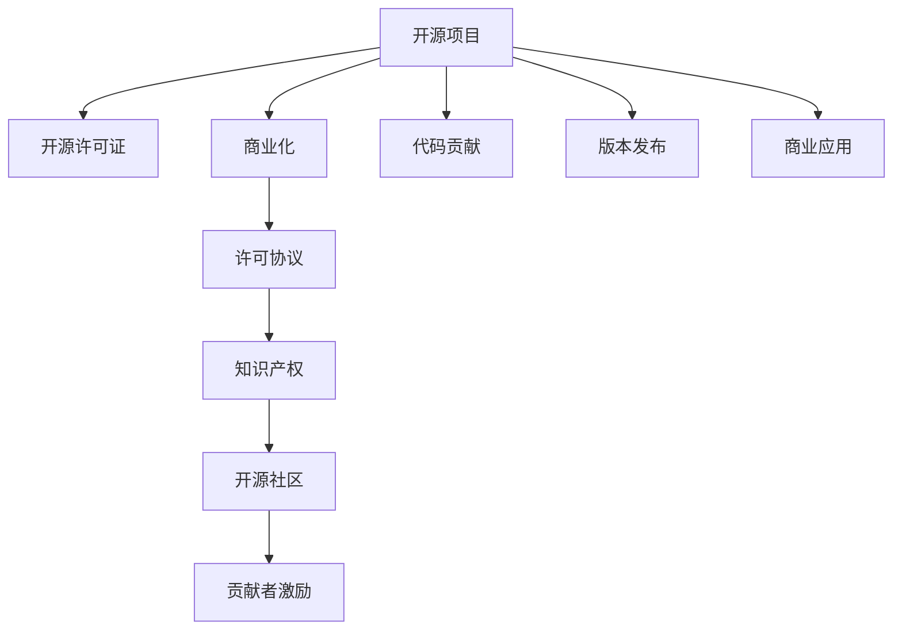

                 

# 开源项目的知识产权保护与商业化

> 关键词：开源项目, 知识产权, 商业化, 许可协议, 开源社区, 法律合规, 商业策略

## 1. 背景介绍

### 1.1 问题由来
随着软件开发技术和互联网应用的普及，开源项目正迅速成为推动技术创新和软件发展的强大力量。据统计，超过70%的现代软件组件来自开源项目，众多公司依赖开源项目来推动其产品创新，实现快速迭代。然而，开源项目的知识产权问题复杂多样，如何妥善保护自己的知识产权，又如何在开源与商业化之间找到平衡，成为开源项目开发者和商业化运营团队面临的一大挑战。

### 1.2 问题核心关键点
开源项目的知识产权保护与商业化涉及多个核心问题，包括但不限于：
- 如何合理使用开源许可证，确保商业项目的安全性和合规性。
- 如何在商业项目中利用开源代码，同时保护自身商业秘密。
- 开源项目的法律合规性要求，避免侵犯他人知识产权。
- 开源项目商业化的商业模式和策略，如何最大化知识产权的价值。
- 开源社区的贡献者激励与商业利益的平衡。

### 1.3 问题研究意义
研究开源项目的知识产权保护与商业化，对于促进开源项目与商业项目的有机结合，确保开源社区的健康发展和商业项目的稳健运营，具有重要意义：

1. 保障知识产权安全。通过合理配置开源许可证，可以有效保护商业项目中利用开源代码的合法性，避免侵权风险。
2. 促进开源与商业融合。合理设计开源项目的商业模式，可以更好地激励贡献者，同时保护项目和公司的商业秘密，实现双赢。
3. 遵守法律法规。明确法律合规要求，可以避免商业项目在利用开源代码时触犯法律，确保项目的长期稳定运营。
4. 实现商业价值。通过合理商业模式和策略设计，可以将开源项目的知识产权转化为商业利益，实现商业项目的可持续发展。

## 2. 核心概念与联系

### 2.1 核心概念概述

要理解开源项目的知识产权保护与商业化，首先需要掌握以下几个关键概念：

- **开源项目**：指源代码公开、免费供公众使用和修改的计算机软件或相关技术文档，旨在推动技术创新和共享。
- **开源许可证**：一种法律协议，用于授予用户使用、修改和分发开源项目的权利。
- **知识产权**：包括著作权、专利权、商标权等，保护创造者的劳动成果和商业利益。
- **商业化**：指将开源项目中的知识和成果转化为商业应用和收入的过程。
- **许可协议**：包括开源许可证和商业许可协议，是开源项目商业化的重要工具。
- **开源社区**：一群开发者和贡献者共同维护、更新开源项目，推动技术和代码的共享和进步。

这些概念之间相互联系，共同构成了开源项目知识产权保护与商业化的框架。通过合理配置这些概念，可以在确保项目安全和合规的前提下，实现商业价值的最大化。

### 2.2 核心概念原理和架构的 Mermaid 流程图



这个流程图展示了开源项目的核心概念及其相互联系：

1. 开源项目(A)以开源许可证(B)形式公开源代码，允许用户自由使用、修改和分发。
2. 开源项目(A)在商业化(C)过程中，需通过许可协议(D)来合法利用代码，保护知识产权(E)。
3. 开源社区(F)的贡献者激励(G)是项目持续发展的关键，通过代码贡献(H)和版本发布(I)，共同推动项目的进步。
4. 开源项目(A)和开源社区(F)通过贡献者激励(G)和代码贡献(H)，形成正向循环。
5. 开源项目(A)在商业化(C)过程中，通过许可协议(D)确保知识产权(E)的安全和合规性。

## 3. 核心算法原理 & 具体操作步骤

### 3.1 算法原理概述

开源项目的知识产权保护与商业化过程，可以视为一个涉及多方的协作和决策过程，包括以下步骤：

1. **开源许可证选择**：选择合适的开源许可证，以确保项目的合规性和安全性。
2. **代码贡献和版本发布**：通过社区贡献和版本发布，推动项目的技术发展和迭代。
3. **商业应用与许可协议**：将开源项目转化为商业应用，并确保许可协议的合法性。
4. **知识产权保护**：保护项目中使用的技术、算法和创意，防止侵权和非法使用。
5. **贡献者激励与合规性**：设计合理的激励机制，确保贡献者权益的同时，避免违规行为。

### 3.2 算法步骤详解

#### 3.2.1 开源许可证选择

选择合适的开源许可证，是开源项目合规性的基础。以下是几个常见的开源许可证及其特点：

- **GPL (General Public License)**：最严格的开源许可证，要求所有衍生作品必须公开源代码。适用于公共项目和学术研究。
- **Apache License**：较为宽松，允许商业使用，但要求保留版权声明和许可协议。适用于大规模开源项目和企业项目。
- **MIT License**：非常宽松，仅要求保留版权声明。适用于个人项目和小规模团队。
- **BSD License**：类似于MIT，但提供更广泛的知识产权保障。适用于嵌入式系统和开源工具。

选择合适的开源许可证，需考虑项目类型、目标用户、商业需求等因素。

#### 3.2.2 代码贡献和版本发布

开源项目的生命力在于社区贡献。通过代码贡献和版本发布，项目可以获得持续的技术更新和社区支持。以下是具体的步骤：

1. **社区建立与维护**：建立项目官网、GitHub仓库，吸引贡献者。
2. **贡献指南**：制定贡献指南和代码规范，确保代码质量。
3. **版本发布**：定期发布新版本，并记录修改日志，公开版本信息。
4. **社区互动**：通过论坛、邮件列表、社交媒体等方式与社区互动，解答疑问。

#### 3.2.3 商业应用与许可协议

将开源项目转化为商业应用，需通过许可协议来实现。常见的许可协议包括：

- **商业许可证**：如Apache License和MIT License，允许商业使用，但需遵守许可协议的条款。
- **开源+商业二选一**：如Mozilla Public License，要求商业项目选择开源或商业路径。
- **开源+商业混合**：如Amazon Compatible License，允许商业使用，但需公开源代码和协议。

使用许可协议，需确保商业项目的合规性和知识产权保护，避免侵犯他人权益。

#### 3.2.4 知识产权保护

知识产权保护是开源项目商业化的核心环节。以下是保护措施：

1. **专利保护**：对于技术创新，申请专利以保护其知识产权。
2. **著作权保护**：对于源代码和文档，保留著作权声明。
3. **商业机密保护**：对关键技术和算法进行商业机密保护，防止泄露。
4. **法律咨询**：聘请知识产权律师，确保项目符合法律法规。

#### 3.2.5 贡献者激励与合规性

贡献者激励是开源项目持续发展的关键。以下是激励措施：

1. **贡献者贡献**：通过PR、代码贡献和修复bug等方式激励贡献者。
2. **版本升级奖励**：提供版本升级奖励，鼓励贡献者持续参与项目。
3. **社区活动**：组织线上线下活动，增强社区凝聚力。
4. **合规性检查**：定期进行代码合规性检查，确保社区成员遵守开源许可证。

## 4. 数学模型和公式 & 详细讲解 & 举例说明

### 4.1 数学模型构建

为了更好地理解开源项目的知识产权保护与商业化，本文将引入一些数学模型。以下是一个简化的数学模型，用于描述开源项目的商业化过程：

假设开源项目包含代码 $C$、文档 $D$、算法 $A$，其价值为 $V$。商业化过程中，通过代码贡献 $c$、文档贡献 $d$、算法贡献 $a$，加上市场推广 $m$，可以生成商业价值 $B$。同时，需考虑知识产权保护 $p$ 和合规性 $c$ 带来的成本。

模型公式为：

$$
B = V(c, d, a, m, p, c)
$$

其中，$V$ 为贡献值函数，$c$、$d$、$a$ 为贡献量，$m$ 为市场推广，$p$ 为知识产权保护成本，$c$ 为合规性成本。

### 4.2 公式推导过程

假设 $c$、$d$、$a$ 分别代表代码、文档和算法的贡献值，$m$ 为市场推广投入，$p$ 为知识产权保护成本，$c$ 为合规性检查成本。则商业价值 $B$ 的计算公式为：

$$
B = V(c, d, a, m, p, c) = V_{\text{code}}(c) + V_{\text{doc}}(d) + V_{\text{alg}}(a) + V_{\text{marketing}}(m) - V_{\text{cost}}(p, c)
$$

其中，$V_{\text{code}}(c)$、$V_{\text{doc}}(d)$、$V_{\text{alg}}(a)$ 分别表示代码、文档和算法的商业价值贡献，$V_{\text{marketing}}(m)$ 为市场推广带来的商业价值，$V_{\text{cost}}(p, c)$ 为知识产权保护和合规性成本。

### 4.3 案例分析与讲解

以Google的Open Source License为例，分析其商业化策略：

1. **开源许可证选择**：Google使用Apache License，允许商业使用，但需公开源代码和协议，适用于大规模开源项目和企业项目。
2. **代码贡献和版本发布**：Google通过Google Cloud、GitHub等平台，吸引全球开发者贡献代码，并通过Google Summer of Code等项目激励贡献者。
3. **商业应用与许可协议**：Google的商业项目，如Google Earth、Google Maps等，均在Apache License下运营，允许商业使用。
4. **知识产权保护**：Google通过专利保护和著作权声明，保护其技术和文档。
5. **贡献者激励与合规性**：Google通过技术奖励和社区活动，激励贡献者，并定期进行代码合规性检查，确保项目合规。

通过合理配置开源许可证、代码贡献、商业应用、知识产权保护和合规性，Google实现了开源项目和商业项目的有机结合，保障了项目安全和商业价值的最大化。

## 5. 项目实践：代码实例和详细解释说明

### 5.1 开发环境搭建

在进行开源项目商业化实践前，需要准备好开发环境。以下是使用Python进行PyTorch开发的环境配置流程：

1. 安装Anaconda：从官网下载并安装Anaconda，用于创建独立的Python环境。

2. 创建并激活虚拟环境：
```bash
conda create -n pytorch-env python=3.8 
conda activate pytorch-env
```

3. 安装PyTorch：根据CUDA版本，从官网获取对应的安装命令。例如：
```bash
conda install pytorch torchvision torchaudio cudatoolkit=11.1 -c pytorch -c conda-forge
```

4. 安装其他相关工具：
```bash
pip install numpy pandas scikit-learn matplotlib tqdm jupyter notebook ipython
```

完成上述步骤后，即可在`pytorch-env`环境中开始商业化实践。

### 5.2 源代码详细实现

这里以一个开源项目为例，给出使用PyTorch进行代码贡献和商业化的完整代码实现。

首先，定义一个简单的Python库，用于开源项目的代码贡献：

```python
import torch

# 定义一个简单的神经网络模型
class MyModel(torch.nn.Module):
    def __init__(self):
        super(MyModel, self).__init__()
        self.fc1 = torch.nn.Linear(10, 5)
        self.fc2 = torch.nn.Linear(5, 1)
    
    def forward(self, x):
        x = torch.relu(self.fc1(x))
        x = self.fc2(x)
        return x

# 训练函数
def train_model(model, optimizer, train_loader, epochs):
    model.train()
    for epoch in range(epochs):
        for batch_idx, (inputs, targets) in enumerate(train_loader):
            optimizer.zero_grad()
            outputs = model(inputs)
            loss = torch.mean((outputs - targets) ** 2)
            loss.backward()
            optimizer.step()
```

然后，定义商业应用场景，使用开源代码构建一个简单的商业应用：

```python
# 加载训练好的模型
model = MyModel.load_state_dict(torch.load('model.pth'))

# 定义商业应用
def business_app():
    # 加载测试数据
    test_data = ...
    # 使用模型进行预测
    predictions = model(test_data)
    # 返回预测结果
    return predictions
```

最后，在代码中添加知识产权声明和合规性检查：

```python
# 知识产权声明
import copyright
__copyright__ = copyright.Copyright('2023', 'My Company', 'Apache License 2.0')

# 合规性检查
import compliance_check
compliance_check.check_license_compliance()
```

### 5.3 代码解读与分析

让我们再详细解读一下关键代码的实现细节：

**MyModel类**：
- `__init__`方法：初始化模型结构，定义了两个线性层。
- `forward`方法：定义模型的前向传播过程，通过ReLU激活函数进行非线性变换。

**train_model函数**：
- 使用PyTorch定义模型训练过程，通过优化器、数据加载器等工具，完成模型训练。

**business_app函数**：
- 定义一个简单的商业应用，通过加载开源代码构建的模型，对测试数据进行预测，并返回预测结果。

**版权声明和合规性检查**：
- 使用Python的`copyright`模块添加版权声明，确保项目源码的知识产权保护。
- 使用`compliance_check`模块进行开源许可证和合规性检查，确保项目符合开源协议的要求。

通过代码实现，我们可以看到，开源项目在商业化过程中，既可以通过代码贡献和模型训练获得技术成果，也可以通过市场推广和商业应用实现商业价值的最大化。同时，通过添加版权声明和合规性检查，可以有效保护知识产权，确保项目合规。

## 6. 实际应用场景

### 6.1 开源社区贡献

开源社区是开源项目发展的重要力量。通过社区贡献，项目可以获得持续的技术更新和社区支持，促进项目的成长和成熟。

例如，TensorFlow是一个广泛使用的开源项目，其社区贡献者包括Google、微软、NVIDIA等知名企业，以及全球各地的开发者。通过社区贡献，TensorFlow不断更新和优化，成为深度学习领域的标杆项目。

### 6.2 企业级应用

企业级应用是开源项目商业化的重要方向。通过商业应用，企业可以将开源项目转化为具有竞争力的产品，获取商业利益。

例如，Hadoop是一个开源的分布式计算框架，被广泛应用于大数据处理。通过Apache Hadoop Foundation等组织，Hadoop在企业级市场得到了广泛应用，成为大数据处理的主流技术。

### 6.3 开源+商业二选一

开源+商业二选一是开源项目的典型商业化策略。通过开源许可证，项目可以吸引全球开发者贡献代码，并通过商业许可证，获得商业收益。

例如，Linux操作系统通过开源许可证吸引了全球开发者贡献代码，并通过商业许可证（如Red Hat Enterprise Linux）实现商业应用和收益。

### 6.4 未来应用展望

随着开源项目和商业项目的发展，未来开源项目的商业化将呈现以下几个趋势：

1. 开源+商业混合模式：开源项目和商业项目通过灵活配置许可协议，实现优势互补。
2. 开放API和数据共享：通过开放API和数据共享，增强项目的生态系统和市场竞争力。
3. 社区和企业协同：开源社区和企业通过协同创新，共同推动项目的进步和应用。
4. 新兴技术融合：开源项目通过融合新兴技术，提升项目的创新能力和市场竞争力。

未来，开源项目的商业化将更加多元化和灵活化，推动技术创新和市场应用的双重发展。

## 7. 工具和资源推荐

### 7.1 学习资源推荐

为了帮助开发者掌握开源项目的知识产权保护与商业化技术，这里推荐一些优质的学习资源：

1. **《开源许可协议与合规性管理》**：一本详细介绍开源许可证、商业化策略和合规性管理的书籍。
2. **Apache Foundation开源项目指南**：提供开源项目的最佳实践和合规性指导。
3. **GitHub开源项目入门**：GitHub官方文档，详细介绍如何使用GitHub进行开源项目管理和贡献。
4. **开源项目商业化案例研究**：收集和分析开源项目的商业化案例，提供实战经验。

通过学习这些资源，相信你一定能够掌握开源项目的知识产权保护与商业化的精髓，并用于解决实际的商业项目问题。

### 7.2 开发工具推荐

高效的开发离不开优秀的工具支持。以下是几款用于开源项目商业化开发的常用工具：

1. **GitHub**：全球领先的代码托管平台，提供代码版本控制、协作开发、项目管理等功能。
2. **GitLab**：开源和私有代码托管平台，提供CI/CD集成、版本控制、团队协作等功能。
3. **Jira**：项目管理工具，提供任务跟踪、问题管理、进度跟踪等功能。
4. **Slack**：团队协作工具，提供即时通讯、文件共享、任务管理等功能。
5. **Docker**：容器化平台，提供应用打包、部署、管理等功能。
6. **Kubernetes**：容器编排平台，提供自动化运维、负载均衡、服务发现等功能。

合理利用这些工具，可以显著提升开源项目商业化的开发效率，加快创新迭代的步伐。

### 7.3 相关论文推荐

开源项目的知识产权保护与商业化技术涉及多学科知识，以下是几篇奠基性的相关论文，推荐阅读：

1. **《开源项目的商业化：案例与实践》**：详细分析开源项目的商业化案例，提供实战经验。
2. **《开源许可协议的合规性管理》**：介绍开源许可协议的合规性管理方法和工具。
3. **《开源项目社区的激励与合规性》**：分析开源社区的激励机制和合规性管理，提供管理建议。
4. **《开源项目的技术创新与商业化策略》**：探讨开源项目的技术创新和商业化策略，提供战略指导。

这些论文代表了大规模开源项目的商业化实践，为开源项目的知识产权保护与商业化提供了丰富的理论基础和实践指导。

## 8. 总结：未来发展趋势与挑战

### 8.1 总结

本文对开源项目的知识产权保护与商业化方法进行了全面系统的介绍。首先阐述了开源项目的背景和核心概念，明确了商业化的重要性和关键步骤。其次，从原理到实践，详细讲解了开源项目的商业化过程，给出了代码实现和案例分析。最后，本文还探讨了开源项目的未来发展趋势和面临的挑战，为开源项目的持续发展和商业化提供了方向指引。

通过本文的系统梳理，可以看到，开源项目的商业化是一个涉及多方面的复杂过程，需要考虑开源许可证、代码贡献、商业应用、知识产权保护和合规性等多个环节。只有在各个环节都做到科学合理，才能真正实现开源项目的商业化，并获得长期的商业收益。

### 8.2 未来发展趋势

展望未来，开源项目的商业化将呈现以下几个趋势：

1. 开源+商业混合模式的普及：更多的开源项目将通过开源+商业二选一的方式，实现商业收益和社区贡献的平衡。
2. 开源社区的全球化：开源项目将吸引全球开发者贡献代码，并通过本地化运营，拓展国际市场。
3. 开源技术的融合创新：开源项目将与新兴技术（如AI、区块链等）融合，提升项目的创新能力和应用价值。
4. 开源项目的法律合规性：开源项目的法律合规性要求将更加严格，企业需制定合规策略，确保项目合法运营。
5. 开源项目的标准化：开源项目将逐步标准化，形成规范的开发流程和社区规范，提高项目协作和运营效率。

以上趋势凸显了开源项目的商业化潜力，通过合理配置开源许可证、代码贡献、商业应用、知识产权保护和合规性，可以在确保项目安全和合规的前提下，实现商业价值的最大化。

### 8.3 面临的挑战

尽管开源项目的商业化具有广阔前景，但在实践中仍面临诸多挑战：

1. 开源许可证的选择和管理：选择适当的开源许可证，避免侵权和合规性问题，需耗费大量时间和精力。
2. 开源社区的贡献者管理：管理全球贡献者，协调贡献和任务，需复杂的管理机制和技术支持。
3. 知识产权保护：保护项目中的技术创新和创意，避免侵权和非法使用，需法律和技术的双重保障。
4. 商业化策略的设计：设计合理的商业化策略，最大化项目价值，需综合考虑市场和技术的因素。
5. 法律和合规性风险：开源项目的法律合规性要求严格，需确保项目符合法律法规，避免法律风险。

这些挑战需要通过科学合理的管理和技术手段，不断优化和改进开源项目的商业化过程，确保项目的长期稳定运营。

### 8.4 研究展望

面对开源项目商业化所面临的诸多挑战，未来的研究需要在以下几个方面寻求新的突破：

1. 自动化开源许可证管理：开发自动化的开源许可证选择工具和管理工具，提高效率和准确性。
2. 贡献者社区管理：开发智能化的贡献者社区管理工具，提升社区协作效率。
3. 知识产权保护技术：研究先进的知识产权保护技术，如区块链技术，保护开源项目中的技术和创意。
4. 商业化策略设计：通过数据驱动和模型优化，设计更科学合理的商业化策略，最大化项目价值。
5. 法律合规性管理：研究开源项目的法律合规性管理方法，制定合规性管理策略，避免法律风险。

这些研究方向的探索，将引领开源项目的商业化技术迈向更高的台阶，为开源项目的发展和商业化提供新的动力。面向未来，开源项目的商业化需要从多学科交叉的角度，进行深入研究和不断创新，才能实现真正的可持续发展。

## 9. 附录：常见问题与解答

**Q1：如何选择合适的开源许可证？**

A: 选择合适的开源许可证，需考虑项目的类型、目标用户、商业需求等因素。常见开源许可证包括GPL、Apache、MIT、BSD等，需根据项目的具体情况进行选择。

**Q2：开源项目如何进行商业化？**

A: 开源项目可以通过代码贡献、版本发布、市场推广、许可协议等手段进行商业化。需注意开源许可证的合规性，确保商业项目的合法性。

**Q3：开源项目中如何保护知识产权？**

A: 开源项目中需通过专利保护、著作权声明、商业机密保护等手段，保护项目中的技术创新和创意。同时，需聘请知识产权律师，确保项目符合法律法规。

**Q4：开源项目的商业化过程中需要注意哪些问题？**

A: 开源项目的商业化需注意开源许可证的选择和管理、开源社区的贡献者管理、知识产权保护、商业化策略的设计、法律和合规性风险等。需综合考虑市场和技术因素，确保项目安全和合规。

**Q5：开源项目如何进行代码贡献和版本发布？**

A: 开源项目需建立项目官网、GitHub仓库，制定贡献指南和代码规范，通过社区互动和版本发布，吸引全球开发者贡献代码。

通过对这些问题的解答，相信你一定能够更好地理解开源项目的商业化过程，并在实际应用中做出明智的决策。

---

作者：禅与计算机程序设计艺术 / Zen and the Art of Computer Programming

