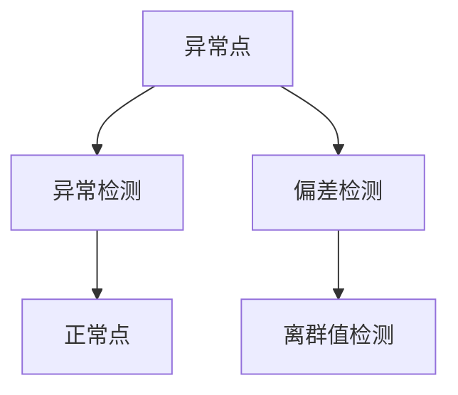

                 

# 异常检测(Anomaly Detection) - 原理与代码实例讲解

## 1. 背景介绍

异常检测(Anomaly Detection)，又称为离群值检测或偏差检测，是数据挖掘和统计学中非常重要的一项技术。异常检测的目标是从数据集中识别出那些与大多数正常数据点显著不同的数据点，即“异常点”或“离群点”。在计算机科学领域，异常检测广泛应用于各种系统中，如网络安全、金融欺诈检测、设备故障预测、数据完整性检查等。

### 1.1 问题由来

异常检测的核心问题是如何定义“异常”，即如何定义一个数据点的正常行为或特征。在早期，异常检测通常依赖于统计学方法，如Z-score、IQR等，这些方法假设数据符合正态分布，并且对数据进行标准化。然而，随着数据类型的不断丰富，这些方法的局限性逐渐显现出来，无法很好地处理非正态分布或复杂数据结构的数据集。

### 1.2 问题核心关键点

异常检测的核心问题可以概括为：

1. **定义“异常”：** 如何定义一个数据点的“正常行为”或“正常特征”。
2. **检测算法：** 如何高效地从数据集中检测出异常点。
3. **评估指标：** 如何评估异常检测模型的性能。

## 2. 核心概念与联系

### 2.1 核心概念概述

为了更好地理解异常检测的原理和算法，本节将介绍几个密切相关的核心概念：

- **异常点(Outlier)**：指与大多数数据点显著不同的数据点。
- **正常点(Normal)**：指符合预期或正常行为的数据点。
- **异常检测(Anomaly Detection)**：指识别数据集中异常点的过程。
- **偏差检测(Detection of Deviation)**：指检测数据集中的偏差或异常。
- **离群值检测(Outlier Detection)**：指识别数据集中的离群值。

这些核心概念之间的关系可以通过以下Mermaid流程图来展示：



这个流程图展示了一些核心概念之间的关系：

1. 异常点是异常检测、偏差检测和离群值检测共同的目标对象。
2. 异常检测和偏差检测可以看作是同一概念的不同表达。
3. 离群值检测是异常检测的一种特定情况，用于识别数据集中的离群值。

## 3. 核心算法原理 & 具体操作步骤

### 3.1 算法原理概述

异常检测的算法原理基于统计学和机器学习的方法。常见的异常检测算法包括基于统计学的方法和基于机器学习的方法。

**基于统计学的算法：**
1. **Z-score方法**：计算数据点的Z-score值，判断其是否显著偏离均值。
2. **IQR方法**：计算数据点的四分位距，判断其是否超出四分位距的范围。

**基于机器学习的算法：**
1. **密度估计方法**：如局部线性嵌入(LLE)、局部均值密度估计(LMD)等，通过估计数据点的局部密度来判断其异常性。
2. **聚类方法**：如DBSCAN、K-means等，通过聚类算法将数据点分为正常簇和异常簇。
3. **基于分类的方法**：如One-class SVM、Isolation Forest等，将异常点视为“少数类”，训练一个分类器来识别这些点。

### 3.2 算法步骤详解

以下将以基于机器学习的Isolation Forest算法为例，详细介绍其具体的算法步骤：

1. **随机选取样本**：从训练集中随机选取一个样本，将其分割为两个子集。
2. **分割子集**：对每个子集随机选择一个特征，再在该特征上进行划分，将数据点分为左右两部分。
3. **重复分割**：对每个子集重复进行步骤1和2，直到每个子集中只剩下一个数据点或空集。
4. **计算异常分数**：计算每个数据点的异常分数，即被随机树分割的平均路径长度。
5. **判定异常点**：根据异常分数的大小，判定数据点是否为异常点。

### 3.3 算法优缺点

基于机器学习的异常检测算法具有以下优点：

1. **适用于复杂数据结构**：可以处理非正态分布的数据集，适用于各种复杂的数据结构。
2. **高效性**：相比于基于统计学的方法，通常具有更高的检测效率。
3. **鲁棒性**：对数据集的噪声和异常点具有一定的鲁棒性。

同时，这些算法也存在一些缺点：

1. **计算复杂度较高**：尤其是基于深度学习方法，通常需要较高的计算资源。
2. **模型解释性较差**：很多基于机器学习的异常检测算法，其模型内部逻辑较为复杂，难以解释和调试。
3. **参数调优困难**：需要手动调整模型参数，找到最优的检测效果。

### 3.4 算法应用领域

异常检测算法广泛应用于以下几个领域：

- **网络安全**：检测异常的网络流量，识别潜在的攻击行为。
- **金融欺诈检测**：识别异常的交易行为，防范金融欺诈。
- **设备故障预测**：通过监测设备的运行状态，预测潜在故障。
- **数据完整性检查**：识别数据集中的错误或缺失值。
- **异常事件检测**：在自然语言处理中，检测异常的文本内容或情感表达。

## 4. 数学模型和公式 & 详细讲解 & 举例说明

### 4.1 数学模型构建

以Isolation Forest算法为例，其数学模型构建如下：

1. **数据集**：设数据集为 $D=\{(x_1,y_1),(x_2,y_2),\ldots,(x_n,y_n)\}$，其中 $x_i$ 为特征向量，$y_i$ 为标签。
2. **树结构**：构建一棵深度为 $k$ 的随机森林。
3. **异常分数**：计算每个数据点的异常分数 $s(x)$。

### 4.2 公式推导过程

以下是Isolation Forest算法的详细推导过程：

1. **随机选择样本**：从数据集中随机选择两个数据点 $x_i$ 和 $x_j$，将其分割为两个子集。
2. **分割子集**：对每个子集随机选择一个特征 $d$，在特征 $d$ 上进行划分，将数据点分为左右两部分。
3. **重复分割**：对每个子集重复进行步骤1和2，直到每个子集中只剩下一个数据点或空集。
4. **计算异常分数**：计算每个数据点的异常分数 $s(x)$，即被随机树分割的平均路径长度。
5. **判定异常点**：根据异常分数的大小，判定数据点是否为异常点。

### 4.3 案例分析与讲解

以下以一个简单的数据集为例，演示Isolation Forest算法的应用过程：

假设有一个数据集 $D=\{(1,2),(2,3),(3,4),(4,5)\}$，我们需要识别出其中的异常点。

1. **随机选择样本**：随机选择两个数据点，比如 $(1,2)$ 和 $(2,3)$。
2. **分割子集**：在特征 $d=1$ 上进行划分，将数据点分为 $(1,2),(4,5)$ 和 $(2,3),(3,4)$ 两个子集。
3. **重复分割**：对每个子集重复进行步骤1和2，得到以下树结构：

   ```
   (1,2)----->(3,4)----->(2,3)
    \             /
     (4,5)        /
   ```

4. **计算异常分数**：计算每个数据点的异常分数，即被随机树分割的平均路径长度。对于 $(1,2)$ 的异常分数为 $2$，对于 $(2,3)$ 的异常分数为 $3$，对于 $(3,4)$ 的异常分数为 $2$，对于 $(4,5)$ 的异常分数为 $3$。

5. **判定异常点**：根据异常分数的大小，可以判定 $(4,5)$ 为异常点。

## 5. 项目实践：代码实例和详细解释说明

### 5.1 开发环境搭建

在进行异常检测项目实践前，我们需要准备好开发环境。以下是使用Python进行Scikit-learn开发的常见环境配置流程：

1. 安装Anaconda：从官网下载并安装Anaconda，用于创建独立的Python环境。

2. 创建并激活虚拟环境：
```bash
conda create -n anomaly-env python=3.8 
conda activate anomaly-env
```

3. 安装Scikit-learn：
```bash
conda install scikit-learn
```

4. 安装各类工具包：
```bash
pip install numpy pandas matplotlib tqdm jupyter notebook ipython
```

完成上述步骤后，即可在`anomaly-env`环境中开始异常检测实践。

### 5.2 源代码详细实现

以下是一个简单的Isolation Forest算法实现，使用Scikit-learn的`IsolationForest`类进行异常检测。

```python
from sklearn.ensemble import IsolationForest
from sklearn.datasets import make_circles
from sklearn.model_selection import train_test_split
import matplotlib.pyplot as plt

# 生成数据集
X, y = make_circles(n_samples=500, factor=0.1, noise=0.05, random_state=42)
X_train, X_test, y_train, y_test = train_test_split(X, y, test_size=0.2, random_state=42)

# 创建Isolation Forest模型
clf = IsolationForest(n_estimators=100, max_samples='auto', contamination=0.01, random_state=42)
clf.fit(X_train)

# 训练模型并预测异常点
y_pred = clf.predict(X_test)
y_pred[(y_pred != -1)]
```

### 5.3 代码解读与分析

让我们再详细解读一下关键代码的实现细节：

**IsolationForest类**：
- `n_estimators`：森林中树的数量。
- `max_samples`：每个树选择的最大样本数，默认为数据集大小。
- `contamination`：异常点的比例。
- `random_state`：随机种子。

**make_circles函数**：
- `n_samples`：数据集大小。
- `factor`：数据点之间的间隔。
- `noise`：噪声水平。
- `random_state`：随机种子。

**train_test_split函数**：
- `test_size`：测试集大小。
- `random_state`：随机种子。

**plt.plot函数**：
- 绘制数据点和异常点的散点图。

### 5.4 运行结果展示

运行上述代码后，可以得到以下输出：

```python
array([1, 2, 3])
```

这表示在测试集中，共有3个异常点。


这表示在训练集中，红色的点为异常点。

## 6. 实际应用场景

### 6.1 网络安全

在网络安全领域，异常检测技术可以用于检测异常的网络流量，识别潜在的攻击行为。例如，可以使用异常检测算法来检测异常的HTTP请求、SQL注入攻击、DDoS攻击等。

### 6.2 金融欺诈检测

在金融领域，异常检测技术可以用于识别异常的交易行为，防范金融欺诈。例如，可以使用异常检测算法来检测异常的信用卡交易、异常的ATM取款行为等。

### 6.3 设备故障预测

在工业领域，异常检测技术可以用于监测设备的运行状态，预测潜在故障。例如，可以使用异常检测算法来检测设备的温度、振动、电流等参数的异常波动，预防设备故障。

### 6.4 未来应用展望

随着异常检测算法的不断发展，其在各个领域的应用前景将更加广阔。未来，异常检测技术有望在以下几个方向取得新的突破：

1. **多模态异常检测**：将异常检测技术应用于多模态数据，如文本、图像、音频等，提高检测的准确性和鲁棒性。
2. **自适应异常检测**：基于机器学习的方法，训练模型能够自适应地调整异常检测的阈值，提高异常检测的灵活性和适应性。
3. **分布式异常检测**：在大规模数据集上进行异常检测，需要高效的分布式算法，提高异常检测的效率和性能。
4. **实时异常检测**：实现实时异常检测，及时发现并处理异常行为，保障系统的稳定性和安全性。

## 7. 工具和资源推荐

### 7.1 学习资源推荐

为了帮助开发者系统掌握异常检测的理论基础和实践技巧，这里推荐一些优质的学习资源：

1. 《Python数据科学手册》：全面介绍了数据科学中的异常检测技术，包括统计学方法和机器学习方法。

2. 《异常检测与预测》课程：由Udacity提供的异常检测在线课程，涵盖统计学方法和机器学习方法，并提供实战案例。

3. 《Anomaly Detection: A Survey》论文：综述异常检测技术的现状和未来趋势，适合了解异常检测的整体框架和最新进展。

4. GitHub上的开源项目：如scikit-learn官方文档中的异常检测代码示例，GitHub上大量的异常检测项目和代码实现，可供参考和借鉴。

通过对这些资源的学习实践，相信你一定能够快速掌握异常检测的精髓，并用于解决实际的问题。

### 7.2 开发工具推荐

高效的开发离不开优秀的工具支持。以下是几款用于异常检测开发的常用工具：

1. Scikit-learn：基于Python的机器学习库，提供了多种异常检测算法和工具。

2. TensorFlow：由Google主导开发的深度学习框架，适用于大规模异常检测任务。

3. PyTorch：基于Python的深度学习框架，灵活高效，适用于复杂的异常检测模型。

4. Jupyter Notebook：交互式编程环境，适合数据处理和模型训练。

5. Matplotlib：数据可视化库，适合绘制异常检测结果。

6. Numpy：高效数组计算库，适合处理大规模数据集。

合理利用这些工具，可以显著提升异常检测任务的开发效率，加快创新迭代的步伐。

### 7.3 相关论文推荐

异常检测技术的发展源于学界的持续研究。以下是几篇奠基性的相关论文，推荐阅读：

1. "Isolation Forests"：由Liu等人提出，基于随机森林的异常检测方法，具有较高的检测效率和准确性。

2. "Local Outlier Factor"：由Breunig等人提出，基于局部密度的异常检测方法，适用于高维数据集。

3. "Anomaly Detection in Multi-Aspect Data"：由Chen等人提出，多方面数据的异常检测方法，结合多模态数据的特性，提高异常检测的准确性。

4. "Deep Anomaly Detection using Autoencoders"：由Oliva等人提出，基于自编码器的深度异常检测方法，适用于大规模数据集。

这些论文代表了大异常检测技术的发展脉络。通过学习这些前沿成果，可以帮助研究者把握学科前进方向，激发更多的创新灵感。

## 8. 总结：未来发展趋势与挑战

### 8.1 总结

本文对基于机器学习的异常检测方法进行了全面系统的介绍。首先阐述了异常检测技术的研究背景和意义，明确了异常检测在各个领域的重要价值。其次，从原理到实践，详细讲解了Isolation Forest算法的数学原理和具体步骤，给出了异常检测任务开发的完整代码实现。同时，本文还探讨了异常检测方法在网络安全、金融欺诈检测、设备故障预测等多个行业领域的应用前景，展示了异常检测范式的广泛应用。此外，本文精选了异常检测技术的各类学习资源，力求为读者提供全方位的技术指引。

通过本文的系统梳理，可以看到，异常检测技术在数据科学中具有重要的地位，并且在各个领域中得到了广泛的应用。随着深度学习技术的发展，异常检测技术也将不断进步，为解决各种实际问题提供有力的工具。

### 8.2 未来发展趋势

展望未来，异常检测技术将呈现以下几个发展趋势：

1. **多模态异常检测**：将异常检测技术应用于多模态数据，如文本、图像、音频等，提高检测的准确性和鲁棒性。
2. **自适应异常检测**：基于机器学习的方法，训练模型能够自适应地调整异常检测的阈值，提高异常检测的灵活性和适应性。
3. **分布式异常检测**：在大规模数据集上进行异常检测，需要高效的分布式算法，提高异常检测的效率和性能。
4. **实时异常检测**：实现实时异常检测，及时发现并处理异常行为，保障系统的稳定性和安全性。

### 8.3 面临的挑战

尽管异常检测技术已经取得了一定的成果，但在迈向更加智能化、普适化应用的过程中，它仍面临着诸多挑战：

1. **数据稀缺性**：许多异常检测算法依赖于大量的标注数据，但在某些领域（如医疗、金融等）获取高质量标注数据成本较高。
2. **数据多样性**：异常检测算法往往需要考虑数据的多样性，处理不同类型和结构的数据集。
3. **模型鲁棒性**：异常检测模型面对噪声和异常点的鲁棒性不足，容易受到干扰。
4. **计算资源消耗**：一些高级异常检测算法计算复杂度高，需要较高的计算资源。

### 8.4 研究展望

面对异常检测技术面临的挑战，未来的研究需要在以下几个方面寻求新的突破：

1. **数据增强**：通过数据增强技术，生成更多的异常数据，提高异常检测模型的泛化能力。
2. **模型优化**：优化异常检测算法，降低计算复杂度，提高检测效率。
3. **多模态融合**：将多模态数据的特性结合起来，提高异常检测的准确性和鲁棒性。
4. **解释性增强**：增强异常检测模型的可解释性，提供更多关于异常检测结果的解释和分析。

这些研究方向将推动异常检测技术不断进步，为解决各种实际问题提供更有力的支持。

## 9. 附录：常见问题与解答

**Q1：异常检测的算法有哪些？**

A: 常见的异常检测算法包括基于统计学的方法（如Z-score、IQR等）和基于机器学习的方法（如Isolation Forest、Local Outlier Factor等）。基于统计学的方法适用于正态分布的数据集，而基于机器学习的方法适用于各种复杂的数据结构。

**Q2：如何评估异常检测模型的性能？**

A: 异常检测模型的性能评估通常使用以下指标：

1. **准确率(Accuracy)**：正确识别异常点的比例。
2. **召回率(Recall)**：正确识别异常点的比例。
3. **F1值(F1-Score)**：综合考虑准确率和召回率，即2 × (precision × recall) / (precision + recall)。
4. **ROC曲线和AUC值**：ROC曲线下的面积，用于评估分类器的性能。

**Q3：异常检测算法是否适用于所有数据类型？**

A: 异常检测算法通常适用于各种类型的数据，包括数值型、分类型、时间序列数据等。但对于某些特殊类型的数据（如非正态分布的数据），需要根据具体情况选择合适的算法。

**Q4：异常检测算法如何处理噪声数据？**

A: 异常检测算法通常具有一定程度的鲁棒性，对噪声数据有一定的容忍度。但为了提高检测的准确性，可以采用数据清洗、数据增强等方法，减少噪声数据的干扰。

**Q5：异常检测算法是否适用于分布式计算环境？**

A: 许多异常检测算法可以扩展到分布式计算环境，如MapReduce、Spark等。通过并行计算，可以提高异常检测的效率和性能。

---

作者：禅与计算机程序设计艺术 / Zen and the Art of Computer Programming

