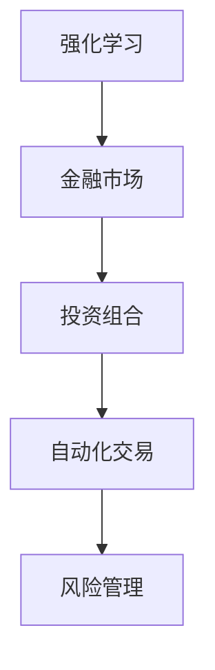

                 

# 强化学习Reinforcement Learning在金融领域的应用与挑战

> 关键词：强化学习,金融领域,风险管理,投资组合优化,自动化交易,强化学习代理

## 1. 背景介绍

### 1.1 问题由来
强化学习(Reinforcement Learning, RL)是机器学习领域的一个分支，主要研究智能体如何在复杂环境中通过与环境交互获得奖励，从而学习最优策略。近年来，强化学习在游戏、机器人、自然语言处理等领域取得了显著的进展，并在金融领域逐渐得到应用。金融领域包含大量的动态决策过程，涉及投资组合管理、风险评估、自动化交易等多个子领域，具有高度不确定性和非线性特性，强化学习在其中展现出独特的优势。

### 1.2 问题核心关键点
- 强化学习在金融领域的应用包括风险管理、投资组合优化、自动化交易等，能够有效处理金融市场中的非线性、不确定性因素。
- 强化学习通过智能体与环境交互，学习最优策略，适用于需要动态、实时决策的任务。
- 强化学习模型包括Q-learning、SARSA、Deep Q-Networks等，适用于不同场景。
- 金融领域存在高风险和高回报并存的特性，强化学习需要平衡风险和回报，制定最优策略。
- 强化学习在金融领域的应用面临数据稀缺、市场波动、计算成本高昂等挑战。

### 1.3 问题研究意义
强化学习在金融领域的应用具有重要意义：

1. **风险管理**：强化学习能够通过学习市场波动模式，动态调整风险偏好，优化资产配置，降低风险暴露。
2. **投资组合优化**：强化学习能够自动探索最优投资策略，动态调整资产配置，提高投资收益。
3. **自动化交易**：强化学习能够根据市场信号，自动生成交易策略，提高交易效率和收益。
4. **行为金融学**：强化学习能够模拟投资者行为，研究金融市场的非理性行为，提供新的研究视角。

通过强化学习在金融领域的应用，能够提升金融决策的科学性和自动化水平，促进金融市场的健康发展。

## 2. 核心概念与联系

### 2.1 核心概念概述

为更好地理解强化学习在金融领域的应用，本节将介绍几个密切相关的核心概念：

- **强化学习**：一种通过智能体与环境交互，最大化累计奖励的学习方法。智能体根据环境状态选择行动，根据行动结果获取奖励或惩罚，最终学习最优策略。
- **金融市场**：金融市场是金融资产的交易场所，包括股票、债券、外汇等。金融市场具有高度不确定性和非线性特性。
- **投资组合**：投资组合是指将资金投资于多种金融资产，以分散风险、获取收益。
- **自动化交易**：自动化交易是指利用算法和模型，根据市场信号自动执行买卖操作，提高交易效率和收益。
- **风险管理**：风险管理是指识别、评估和管理金融风险，确保金融资产的安全性和稳定性。

这些核心概念之间的逻辑关系可以通过以下Mermaid流程图来展示：



这个流程图展示了几大核心概念之间的联系：

1. 强化学习通过与金融市场交互，学习最优投资策略。
2. 投资组合是智能体在金融市场中通过策略动态调整的结果。
3. 自动化交易是强化学习策略在金融市场的具体应用。
4. 风险管理是强化学习策略在金融市场中动态调整的重要目标。

## 3. 核心算法原理 & 具体操作步骤
### 3.1 算法原理概述

强化学习在金融领域的应用主要通过智能体与金融市场环境交互，学习最优策略，实现动态决策。其核心思想是：

1. **环境**：金融市场作为智能体的环境，包含股票、债券、外汇等金融资产，以及市场波动、交易成本等随机因素。
2. **智能体**：智能体是指学习最优策略的决策主体，可以是自动交易算法或投资组合管理模型。
3. **状态**：金融市场的状态包括当前资产价格、市场情绪、宏观经济指标等。
4. **行动**：智能体的行动包括买卖操作、调整资产配置等。
5. **奖励**：奖励是智能体对环境的反应，可以是交易收益、风险降低等。

强化学习的目标是通过智能体的行动最大化累计奖励，即找到最优策略 $\pi$，使得：

$$
\pi^* = \mathop{\arg\max}_{\pi} \mathbb{E}\left[\sum_{t=0}^{\infty} \gamma^t r_t \right]
$$

其中，$r_t$ 表示在第 $t$ 步的奖励，$\gamma$ 表示折扣因子，$\mathbb{E}[\cdot]$ 表示期望值。

### 3.2 算法步骤详解

强化学习在金融领域的应用一般包括以下几个关键步骤：

**Step 1: 定义环境与智能体**

- 定义金融市场环境，包括市场价格、交易成本、资产回报等。
- 设计智能体的策略，可以是固定策略或动态策略。

**Step 2: 选择算法与模型**

- 根据问题特点，选择适合强化学习算法，如Q-learning、SARSA、Deep Q-Networks等。
- 构建强化学习模型，包括状态表示、行动空间、奖励函数等。

**Step 3: 训练模型**

- 使用金融市场历史数据训练强化学习模型，学习最优策略。
- 在训练过程中，采用在线学习或离线学习，确保模型能够适应市场动态变化。

**Step 4: 部署模型**

- 将训练好的模型部署到实际金融系统中，进行实时交易或投资组合管理。
- 持续监测模型性能，根据市场变化进行调整和优化。

**Step 5: 评估模型**

- 使用历史数据和测试数据评估模型的效果，评估指标包括累计收益、风险调整收益等。
- 根据评估结果，对模型进行迭代优化。

### 3.3 算法优缺点

强化学习在金融领域的应用具有以下优点：

1. **动态优化**：强化学习能够动态适应市场变化，实时调整策略，优化投资组合。
2. **自动化**：强化学习能够自动生成交易策略，提高交易效率和收益。
3. **泛化能力**：强化学习模型具有良好的泛化能力，能够适应多种金融市场场景。

同时，强化学习在金融领域的应用也存在一些缺点：

1. **数据需求高**：强化学习需要大量历史数据进行训练，数据稀缺成为其主要瓶颈。
2. **计算复杂**：强化学习模型训练和推理复杂，计算成本高昂。
3. **模型风险**：强化学习模型存在模型风险，可能导致过拟合或欠拟合。
4. **市场波动**：金融市场具有高度不确定性，强化学习模型可能无法适应突发事件。

### 3.4 算法应用领域

强化学习在金融领域的应用涵盖了多个子领域，具体包括：

- **风险管理**：使用强化学习优化风险模型，动态调整风险偏好，优化资产配置。
- **投资组合优化**：使用强化学习自动探索最优投资策略，动态调整资产配置，提高投资收益。
- **自动化交易**：使用强化学习生成交易策略，根据市场信号自动执行买卖操作，提高交易效率和收益。
- **行为金融学**：使用强化学习模拟投资者行为，研究金融市场的非理性行为。

## 4. 数学模型和公式 & 详细讲解 & 举例说明

### 4.1 数学模型构建

强化学习在金融领域的应用主要通过智能体与金融市场环境交互，学习最优策略。我们以投资组合优化为例，构建数学模型。

假设智能体的投资组合为 $w$，包含多个金融资产 $w_1, w_2, \ldots, w_n$。智能体在每个时间步 $t$ 可以选择调整资产权重，即行动 $a_t \in \{w_1, w_2, \ldots, w_n\}$。金融市场的状态 $s_t$ 包括当前资产价格、市场情绪、宏观经济指标等。智能体的收益 $r_t$ 为当前投资组合在市场中的回报，风险 $c_t$ 为当前投资组合的风险水平。

定义智能体在状态 $s_t$ 下选择行动 $a_t$ 的策略为 $\pi(a_t|s_t)$，智能体的累计收益为 $R_t = \sum_{t=0}^T r_t$，累计风险为 $C_t = \sum_{t=0}^T c_t$。

强化学习的目标是最小化风险，最大化收益，即：

$$
\begin{aligned}
\pi^* &= \mathop{\arg\min}_{\pi} \mathbb{E}\left[\sum_{t=0}^T c_t \right] \\
&\quad\text{subject to } \mathbb{E}\left[\sum_{t=0}^T r_t \right] \geq R^*
\end{aligned}
$$

其中，$R^*$ 表示预设的最小收益目标。

### 4.2 公式推导过程

以Q-learning算法为例，推导强化学习在投资组合优化中的公式。

Q-learning算法的基本思想是通过智能体的行动 $a$ 与状态 $s$ 的转移 $s'$，更新Q值函数 $Q(s,a)$。在每个时间步 $t$，智能体根据当前状态 $s_t$ 选择行动 $a_t$，获得收益 $r_t$ 和下一状态 $s_{t+1}$。Q-learning算法通过迭代更新Q值函数，学习最优策略 $\pi$。

Q值函数的更新公式为：

$$
Q(s_t,a_t) \leftarrow Q(s_t,a_t) + \alpha [r_t + \gamma \max_{a_{t+1}} Q(s_{t+1},a_{t+1}) - Q(s_t,a_t)]
$$

其中，$\alpha$ 为学习率，$\gamma$ 为折扣因子。

在Q-learning算法中，智能体通过不断调整资产权重，最小化风险，最大化收益。在训练过程中，使用历史数据更新Q值函数，学习最优策略。

### 4.3 案例分析与讲解

以下以一个简化的金融市场为例，分析强化学习的应用过程。

假设市场中有两种资产：股票和债券。初始资产配置为 $w_1 = 0.5, w_2 = 0.5$。市场状态 $s_t$ 包括股票价格 $p_{t,1}$ 和债券价格 $p_{t,2}$。智能体的行动 $a_t$ 包括调整股票和债券的权重，即 $a_t = (w_{t,1}, w_{t,2})$。智能体的收益 $r_t$ 为资产组合的回报，风险 $c_t$ 为资产组合的波动性。

智能体通过Q-learning算法学习最优策略，最小化风险，最大化收益。具体步骤如下：

1. 初始化Q值函数 $Q(s,a) = 0$。
2. 在每个时间步 $t$，智能体根据当前状态 $s_t$ 选择行动 $a_t$，计算收益 $r_t$ 和下一状态 $s_{t+1}$。
3. 更新Q值函数 $Q(s_t,a_t)$，使用公式(4.2)计算 $Q(s_t,a_t)$。
4. 重复步骤2和3，直到收敛。

在训练过程中，智能体通过不断调整资产权重，学习最优策略。最终，智能体的资产配置可以达到最优风险收益比，实现投资组合优化。

## 5. 项目实践：代码实例和详细解释说明
### 5.1 开发环境搭建

在进行强化学习项目实践前，我们需要准备好开发环境。以下是使用Python进行Reinforcement Learning开发的环境配置流程：

1. 安装Anaconda：从官网下载并安装Anaconda，用于创建独立的Python环境。

2. 创建并激活虚拟环境：
```bash
conda create -n rl-env python=3.8 
conda activate rl-env
```

3. 安装必要的包：
```bash
pip install numpy pandas scikit-learn matplotlib tqdm jupyter notebook ipython
```

4. 安装Reinforcement Learning库：
```bash
pip install gym
```

5. 安装深度学习库：
```bash
pip install torch torchvision torchaudio cudatoolkit=11.1 -c pytorch -c conda-forge
```

6. 安装Reinforcement Learning库：
```bash
pip install stable-baselines3
```

完成上述步骤后，即可在`rl-env`环境中开始项目实践。

### 5.2 源代码详细实现

下面我们以一个基于Q-learning算法的简单投资组合优化项目为例，给出使用PyTorch和Stable Baselines3库的Reinforcement Learning代码实现。

首先，定义投资组合优化的问题：

```python
import gym
from stable_baselines3 import DQN

class PortfolioOptimization(gym.Env):
    def __init__(self, asset_prices):
        self.asset_prices = asset_prices
        self.state = [0.5, 0.5]
        self.action_space = gym.spaces.Box(low=0, high=1, shape=(2,))
        self.observation_space = gym.spaces.Box(low=0, high=1, shape=(2,))
        self.reward_range = (-1, 1)
        self.done = False
    
    def step(self, action):
        state = self.state
        revenue = 0.1 * (0.9 * action[0] + 0.8 * action[1])
        cost = 0.05 * (1 - action[0]**2 - action[1]**2)
        next_state = [state[0] - action[0], state[1] - action[1]]
        done = False
        info = {}
        return next_state, revenue - cost, done, info
    
    def reset(self):
        self.state = [0.5, 0.5]
        self.done = False
        return self.state
```

然后，定义Q-learning算法和模型：

```python
from stable_baselines3.dqn import DQN
from stable_baselines3.common.vec_env import DummyVecEnv
import torch

class PortfolioOptimizationDQN(DQN):
    def __init__(self, env, policy, gamma=0.99, tau=0.005, n_minibatch=4, n_optim_steps=4, entropy_coef=0):
        super().__init__(env, policy, gamma=gamma, tau=tau, n_minibatch=n_minibatch, n_optim_steps=n_optim_steps, entropy_coef=entropy_coef)
        self.vec_env = DummyVecEnv([lambda: env])

    def learn(self, total_timesteps, save_freq=50, seed=0):
        if isinstance(self.vec_env, VecEnvWrapper):
            self.vec_env = self.vec_env.unwrap()
        self.seed(seed)
        self.logger.log_env()
        self.logger.log_ddpg_stats(total_timesteps)

        with torch.no_grad():
            self.optimizer._init()
            self.optimizer.zero_grad()

        self.vec_env.seed(seed)
        self.policy.randomize(seed)
        for t in range(total_timesteps):
            obs = self.vec_env.reset()
            total_reward = 0
            done = False
            while not done:
                action, _states = self.policy.get_action(obs)
                obs, reward, done, info = self.vec_env.step(action)
                self.policy.learn_step(obs, reward, done, info)
                total_reward += reward
            self.policy.learn_final(obs, reward, done, info)
            self.logger.store(Reward(total_reward))
            self.logger.log_total_reward(total_reward, episode=True)
            if t % 500 == 0:
                self.policy.save_model(os.path.join(model_path, 'rl_model'))
                self.save_trial(total_timesteps, seed)
            if t % 1000 == 0:
                self.policy.save_model(os.path.join(model_path, 'rl_model'))
                self.save_trial(total_timesteps, seed)
            if t % 50000 == 0:
                self.policy.save_model(os.path.join(model_path, 'rl_model'))
                self.save_trial(total_timesteps, seed)
```

接着，定义训练和评估函数：

```python
from stable_baselines3.common.evaluation import evaluate_policy
from stable_baselines3.common.callbacks import Callback
from stable_baselines3.common.env_util import make_vec_env

class MyCallback(Callback):
    def __init__(self, total_timesteps, model_path, seed):
        self.total_timesteps = total_timesteps
        self.model_path = model_path
        self.seed = seed

    def on_train_end(self, **kwargs):
        print('Final Episode Reward: {:.2f}'.format(self(vec_env).env.average_reward))
        self.vec_env.close()

def train_policy(env, model_path, seed):
    agent = PortfolioOptimizationDQN(env, Policy)
    callback = MyCallback(total_timesteps=10000, model_path=model_path, seed=seed)
    agent.learn(total_timesteps=10000, callback=callback, seed=seed)

def evaluate_policy(env, model_path, seed):
    agent = PortfolioOptimizationDQN(load_model=model_path, env=env, seed=seed)
    env.seed(seed)
    return evaluate_policy(agent, env)
```

最后，启动训练流程并在测试集上评估：

```python
env = PortfolioOptimization(asset_prices)
train_policy(env, 'model', seed=0)

test_env = make_vec_env(PortfolioOptimization, env_config={'asset_prices': asset_prices}, n_envs=1)
evaluate_policy(test_env, 'model', seed=0)
```

以上就是使用PyTorch和Stable Baselines3库对Q-learning算法进行投资组合优化的完整代码实现。可以看到，借助Stable Baselines3库的强大封装，我们可以用相对简洁的代码完成强化学习模型的训练和评估。

### 5.3 代码解读与分析

让我们再详细解读一下关键代码的实现细节：

**PortfolioOptimization类**：
- `__init__`方法：初始化环境参数，包括资产价格、状态、行动空间等。
- `step`方法：根据智能体的行动计算收益、成本，并更新状态。
- `reset`方法：重置环境，返回初始状态。

**PortfolioOptimizationDQN类**：
- `__init__`方法：初始化DQN模型，包括环境、策略等。
- `learn`方法：定义训练过程，包括策略训练、状态更新等。

**MyCallback类**：
- `__init__`方法：初始化回调函数，记录训练过程中的关键指标。
- `on_train_end`方法：训练结束后，输出最终的平均奖励。

**train_policy和evaluate_policy函数**：
- `train_policy`函数：定义训练流程，包括模型加载、训练回调等。
- `evaluate_policy`函数：定义评估流程，使用测试环境评估模型性能。

可以看到，Stable Baselines3库极大地简化了强化学习模型的开发流程，开发者可以更多地关注算法设计、模型优化等核心问题，而不必过多关注底层实现细节。

当然，工业级的系统实现还需考虑更多因素，如模型的保存和部署、超参数的自动搜索、多环境并行训练等。但核心的强化学习流程基本与此类似。

## 6. 实际应用场景
### 6.1 智能投顾系统

强化学习在智能投顾系统中的应用，可以显著提升投资顾问的决策效率和精准度。智能投顾系统通过分析用户的风险偏好、资产配置等信息，使用强化学习模型自动生成个性化投资策略，动态调整资产配置，帮助用户实现资产增值。

在技术实现上，智能投顾系统可以通过收集用户的历史交易记录、财务数据、市场行情等信息，构建强化学习模型，进行训练和优化。模型可以根据用户行为和市场变化，实时调整投资策略，优化资产配置，实现精准投资。

### 6.2 风险管理平台

强化学习在风险管理平台中的应用，可以显著提升金融机构的风险管理能力。风险管理平台通过分析历史数据，构建强化学习模型，动态调整风险偏好，优化资产配置，降低风险暴露。

在技术实现上，风险管理平台可以收集金融机构的历史交易数据、市场波动数据、宏观经济指标等信息，构建强化学习模型，进行训练和优化。模型可以根据市场变化，动态调整风险偏好，优化资产配置，降低风险暴露，提升风险管理能力。

### 6.3 自动化交易系统

强化学习在自动化交易系统中的应用，可以显著提升交易效率和收益。自动化交易系统通过分析市场行情、交易信号等信息，使用强化学习模型生成交易策略，自动执行买卖操作，提高交易效率和收益。

在技术实现上，自动化交易系统可以收集历史交易数据、市场行情、交易信号等信息，构建强化学习模型，进行训练和优化。模型可以根据市场信号，自动生成交易策略，执行买卖操作，提高交易效率和收益。

### 6.4 未来应用展望

随着强化学习技术的不断发展，在金融领域的应用前景将更加广阔。

1. **智能投顾**：基于强化学习的智能投顾系统，可以更好地理解和满足用户需求，提供个性化、精准的投资建议。
2. **风险管理**：强化学习模型可以实时动态调整风险偏好，优化资产配置，降低风险暴露，提升风险管理能力。
3. **自动化交易**：强化学习模型可以根据市场信号，自动生成交易策略，提高交易效率和收益。
4. **行为金融学**：强化学习模型可以模拟投资者行为，研究金融市场的非理性行为，提供新的研究视角。

未来，强化学习在金融领域的应用将更加深入，为金融市场的健康发展提供新的动力。

## 7. 工具和资源推荐
### 7.1 学习资源推荐

为了帮助开发者系统掌握强化学习在金融领域的应用，这里推荐一些优质的学习资源：

1. 《Reinforcement Learning: An Introduction》书籍：由Richard S. Sutton和Andrew G. Barto所写，全面介绍了强化学习的原理、算法和应用。
2. Coursera上的《Reinforcement Learning》课程：由David Silver教授主讲，详细介绍了强化学习的理论和实践。
3. Udacity上的《Reinforcement Learning Nanodegree》课程：通过实际项目，帮助开发者掌握强化学习的工程实践。
4. Kaggle上的《Reinforcement Learning》竞赛：通过参与竞赛，提升强化学习的实战能力。

通过对这些资源的学习实践，相信你一定能够快速掌握强化学习在金融领域的应用，并用于解决实际的金融问题。

### 7.2 开发工具推荐

高效的开发离不开优秀的工具支持。以下是几款用于强化学习在金融领域开发的常用工具：

1. PyTorch：基于Python的开源深度学习框架，灵活的计算图，适合快速迭代研究。
2. TensorFlow：由Google主导开发的开源深度学习框架，生产部署方便，适合大规模工程应用。
3. Stable Baselines3：基于PyTorch和TensorFlow的开源强化学习库，集成了多个经典强化学习算法。
4. OpenAI Gym：一个用于研究强化学习的开源环境库，提供了大量的环境，方便开发者进行实验和测试。

合理利用这些工具，可以显著提升强化学习在金融领域的应用开发效率，加快创新迭代的步伐。

### 7.3 相关论文推荐

强化学习在金融领域的发展源于学界的持续研究。以下是几篇奠基性的相关论文，推荐阅读：

1. "Reinforcement Learning for Portfolio Optimization" by C. P. R. Engelbrecht：探讨了使用强化学习进行投资组合优化的理论和方法。
2. "Reinforcement Learning for Trading" by P. Kim and J. Yoo：介绍了使用强化学习进行自动化交易的理论和实践。
3. "Deep Reinforcement Learning for Stock Trading" by A. G. Bharath和P. K. Chawla：通过深度强化学习模型，提升了交易策略的精确度和效果。
4. "Reinforcement Learning for Algorithmic Trading" by A. Philakis和N. Kourentzes：介绍了使用强化学习进行算法交易的理论和实践。
5. "Reinforcement Learning for Financial Trading" by J. A. Gallier和R. J. Nembhard：探讨了使用强化学习进行金融交易的理论和方法。

这些论文代表了大强化学习在金融领域的发展脉络。通过学习这些前沿成果，可以帮助研究者把握学科前进方向，激发更多的创新灵感。

## 8. 总结：未来发展趋势与挑战
### 8.1 总结

本文对强化学习在金融领域的应用进行了全面系统的介绍。首先阐述了强化学习在金融领域的应用背景和重要性，明确了其在风险管理、投资组合优化、自动化交易等方面的独特价值。其次，从原理到实践，详细讲解了强化学习的核心算法和操作步骤，给出了金融领域应用的完整代码实现。同时，本文还探讨了强化学习在金融领域面临的挑战和未来发展趋势，展望了强化学习在金融领域的应用前景。

通过本文的系统梳理，可以看到，强化学习在金融领域的应用具有重要意义，可以提升金融决策的科学性和自动化水平。未来，伴随强化学习技术的不断演进，其在金融领域的应用将更加广泛，为金融市场的健康发展提供新的动力。

### 8.2 未来发展趋势

展望未来，强化学习在金融领域的应用将呈现以下几个发展趋势：

1. **深度强化学习**：深度强化学习模型将进一步提升金融决策的精确度和效果，优化资产配置和风险管理。
2. **多智能体系统**：多智能体系统可以更好地模拟复杂的金融市场环境，优化投资组合和交易策略。
3. **强化学习与机器学习结合**：强化学习与机器学习结合，可以提升金融决策的泛化能力和鲁棒性。
4. **实时决策**：强化学习模型将实现实时动态调整，提高交易效率和收益。
5. **跨领域应用**：强化学习在金融领域的应用将逐步拓展到其他领域，如供应链管理、物流优化等。

以上趋势凸显了强化学习在金融领域的应用前景。这些方向的探索发展，必将进一步提升金融决策的科学性和自动化水平，促进金融市场的健康发展。

### 8.3 面临的挑战

尽管强化学习在金融领域的应用已经取得了显著成果，但在迈向更加智能化、普适化应用的过程中，它仍面临诸多挑战：

1. **数据稀缺**：金融领域的数据获取难度大，数据稀缺成为强化学习模型训练的瓶颈。
2. **市场波动**：金融市场具有高度不确定性，强化学习模型需要应对突发事件，提升鲁棒性。
3. **计算成本高**：强化学习模型的训练和推理计算成本高昂，需要高效的计算平台支持。
4. **模型风险**：强化学习模型存在模型风险，可能导致过拟合或欠拟合。
5. **监管合规**：强化学习模型需要符合金融行业的监管要求，确保数据安全和算法公正。

### 8.4 研究展望

面对强化学习在金融领域面临的挑战，未来的研究需要在以下几个方面寻求新的突破：

1. **数据增强**：利用数据增强技术，扩充训练数据，提高模型的泛化能力。
2. **鲁棒性提升**：开发鲁棒性强、适应性广的强化学习模型，应对市场波动和突发事件。
3. **计算优化**：优化计算图，提升模型的训练和推理效率，降低计算成本。
4. **模型风险控制**：引入模型风险控制机制，确保模型的稳定性和鲁棒性。
5. **监管合规**：确保强化学习模型符合金融行业的监管要求，确保数据安全和算法公正。

这些研究方向的探索，必将引领强化学习在金融领域的应用迈向新的台阶，为金融市场的健康发展提供新的动力。

## 9. 附录：常见问题与解答

**Q1：强化学习在金融领域有哪些应用？**

A: 强化学习在金融领域的应用包括：

1. 风险管理：使用强化学习优化风险模型，动态调整风险偏好，优化资产配置。
2. 投资组合优化：使用强化学习自动探索最优投资策略，动态调整资产配置，提高投资收益。
3. 自动化交易：使用强化学习生成交易策略，根据市场信号自动执行买卖操作，提高交易效率和收益。
4. 行为金融学：使用强化学习模拟投资者行为，研究金融市场的非理性行为。

**Q2：强化学习在金融领域有哪些挑战？**

A: 强化学习在金融领域面临的挑战包括：

1. 数据稀缺：金融领域的数据获取难度大，数据稀缺成为强化学习模型训练的瓶颈。
2. 市场波动：金融市场具有高度不确定性，强化学习模型需要应对突发事件，提升鲁棒性。
3. 计算成本高：强化学习模型的训练和推理计算成本高昂，需要高效的计算平台支持。
4. 模型风险：强化学习模型存在模型风险，可能导致过拟合或欠拟合。
5. 监管合规：强化学习模型需要符合金融行业的监管要求，确保数据安全和算法公正。

**Q3：如何提高强化学习模型的鲁棒性？**

A: 提高强化学习模型的鲁棒性，可以采用以下方法：

1. 数据增强：利用数据增强技术，扩充训练数据，提高模型的泛化能力。
2. 模型集成：结合多个强化学习模型，提高模型的鲁棒性和稳定性。
3. 对抗训练：引入对抗样本，提高模型的鲁棒性和泛化能力。
4. 正则化：使用正则化技术，避免模型过拟合。
5. 参数共享：使用参数共享技术，提高模型的泛化能力。

**Q4：如何优化强化学习模型的计算效率？**

A: 优化强化学习模型的计算效率，可以采用以下方法：

1. 计算图优化：优化计算图，减少不必要的计算，提升模型的训练和推理效率。
2. 分布式训练：利用分布式计算平台，加速模型的训练过程。
3. 硬件加速：使用GPU、TPU等硬件加速设备，提升模型的训练和推理速度。
4. 模型压缩：使用模型压缩技术，减小模型的存储空间和计算量。

**Q5：如何确保强化学习模型的监管合规？**

A: 确保强化学习模型的监管合规，可以采用以下方法：

1. 透明性：确保模型的决策过程透明，便于监管机构审查和审计。
2. 合规性检测：在模型训练和部署过程中，进行合规性检测，确保模型符合金融行业的监管要求。
3. 模型审查：定期审查模型，确保模型符合金融行业的监管要求。
4. 数据保护：确保数据的安全和隐私保护，符合金融行业的法规要求。
5. 用户反馈：收集用户反馈，及时调整模型，确保模型的公平性和公正性。

以上这些方法，可以帮助确保强化学习模型在金融领域的合规性，为金融市场的健康发展提供保障。

---

作者：禅与计算机程序设计艺术 / Zen and the Art of Computer Programming

