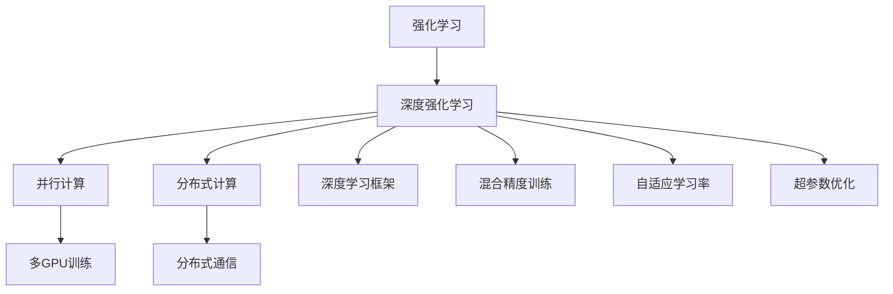

                 

# 强化学习Reinforcement Learning的并行与分布式实现方案

> 关键词：强化学习,并行计算,分布式计算,RL框架,多GPU训练,混合精度训练,分布式通信,强化学习算法,深度学习,深度强化学习,RL环境,自适应学习率,超参数优化

## 1. 背景介绍

### 1.1 问题由来
强化学习(Reinforcement Learning, RL)作为机器学习领域的重要分支，近年来在机器人控制、游戏AI、自动驾驶、推荐系统等多个领域取得了令人瞩目的成果。然而，强化学习训练过程复杂、计算量大，尤其是深度强化学习，需要处理大量的连续状态和动作，使得训练时间通常长达数日甚至数周，极大限制了其在实际应用中的落地速度。

为解决这一问题，研究人员和工程师提出了多种并行和分布式训练方法。这些方法通过将训练任务分解为多个子任务并行执行，显著加快了强化学习模型的训练速度，同时也提升了模型的稳定性和泛化能力。并行与分布式训练已经成为强化学习领域的一项关键技术，极大地推动了深度强化学习的发展和应用。

### 1.2 问题核心关键点
当前，强化学习并行与分布式训练方法主要有以下几种：
1. 多GPU训练：利用多张GPU卡并行计算，加速模型更新和参数优化。
2. 混合精度训练：通过混合使用16位和32位浮点数，提高计算效率和资源利用率。
3. 分布式通信：通过网络协议进行跨机通信，协调多个计算节点的计算资源。
4. 自适应学习率：根据模型性能动态调整学习率，提高训练效率和收敛速度。
5. 超参数优化：通过自动搜索超参数空间，找到最优模型配置。

这些关键技术共同构成了强化学习并行与分布式训练的总体框架，使得模型训练能够在大规模计算资源下高效进行。本文将详细探讨这些核心技术的原理和应用，帮助读者深入理解并行与分布式强化学习的实现方案。

## 2. 核心概念与联系

### 2.1 核心概念概述

为更好地理解强化学习并行与分布式训练方法，本节将介绍几个密切相关的核心概念：

- 强化学习(Reinforcement Learning, RL)：一种通过与环境交互，通过试错来学习最优策略的机器学习范式。模型通过观察环境状态，采取动作，获得奖励，进而优化策略以最大化累积奖励。
- 深度强化学习(Deep Reinforcement Learning, DRL)：在RL的基础上，利用深度神经网络进行状态表示和策略优化。深度强化学习模型能够处理复杂的非线性关系，适用于解决更复杂的任务。
- 并行计算(Parallel Computing)：通过多个计算单元同时执行任务，提高计算效率。并行计算适用于计算密集型任务，如深度学习模型训练。
- 分布式计算(Distributed Computing)：通过多个计算节点协同工作，共同完成一个大规模计算任务。分布式计算适用于资源密集型任务，如大规模数据处理和训练。
- 深度学习框架(Deep Learning Framework)：如TensorFlow、PyTorch等，提供了便捷的深度学习模型开发和训练工具。
- 多GPU训练(Multi-GPU Training)：利用多张GPU卡并行执行深度学习模型的前向传播和反向传播计算，加速模型训练。
- 混合精度训练(Mixed Precision Training)：通过混合使用16位和32位浮点数进行深度学习模型的训练，提升计算效率和资源利用率。
- 分布式通信(Distributed Communication)：通过网络协议进行跨机通信，协调多个计算节点的计算资源。
- 自适应学习率(Adaptive Learning Rate)：根据模型性能动态调整学习率，提高训练效率和收敛速度。
- 超参数优化(Hyperparameter Optimization)：通过自动搜索超参数空间，找到最优模型配置。

这些核心概念之间的逻辑关系可以通过以下Mermaid流程图来展示：



这个流程图展示了下游任务“深度强化学习”与“并行计算”和“分布式计算”之间的逻辑关系：

1. 强化学习通过与环境交互学习策略，其中深度强化学习利用深度神经网络优化策略。
2. 并行计算和分布式计算用于加速深度强化学习模型的训练。
3. 多GPU训练、混合精度训练、分布式通信、自适应学习率和超参数优化等技术，用于提升并行与分布式训练的效率和性能。

这些概念共同构成了强化学习并行与分布式训练的总体框架，使其能够在大规模计算资源下高效进行。

## 3. 核心算法原理 & 具体操作步骤
### 3.1 算法原理概述

强化学习并行与分布式训练的本质是通过将训练任务分解为多个子任务并行执行，以提高计算效率。具体而言，它通过以下几个关键技术实现：

- 多GPU训练：利用多张GPU卡并行计算，加速模型更新和参数优化。
- 混合精度训练：通过混合使用16位和32位浮点数，提高计算效率和资源利用率。
- 分布式通信：通过网络协议进行跨机通信，协调多个计算节点的计算资源。
- 自适应学习率：根据模型性能动态调整学习率，提高训练效率和收敛速度。
- 超参数优化：通过自动搜索超参数空间，找到最优模型配置。

这些技术的应用使得强化学习训练能够在大量计算资源下高效进行，极大地提升了模型的训练速度和性能。

### 3.2 算法步骤详解

强化学习并行与分布式训练的一般步骤如下：

**Step 1: 数据准备**
- 收集训练数据集，将数据集划分为训练集、验证集和测试集。
- 准备数据预处理函数，如归一化、数据增强等。

**Step 2: 模型搭建**
- 选择合适的深度学习框架，搭建深度强化学习模型。
- 设置模型的超参数，如学习率、批大小、优化器等。

**Step 3: 多GPU训练**
- 使用多GPU训练框架，如Horovod，将模型并行分布在多张GPU卡上。
- 将训练数据划分为多个批次，在每个批次内并行计算前向传播和反向传播。
- 使用分布式优化器如AdamW，更新模型参数。

**Step 4: 混合精度训练**
- 使用16位和32位浮点数进行混合精度计算，减少内存占用和计算时间。
- 在深度学习框架中设置混合精度训练选项，如使用NVIDIA Apex。

**Step 5: 分布式通信**
- 使用分布式通信协议如MPI，协调多个计算节点的通信。
- 在各个节点之间传输模型参数和梯度，确保数据同步。

**Step 6: 自适应学习率**
- 使用自适应学习率算法如AdaGrad、RMSprop，根据模型性能动态调整学习率。
- 在每个批次更新模型参数后，根据模型误差和梯度更新学习率。

**Step 7: 超参数优化**
- 使用超参数优化算法如贝叶斯优化、随机搜索等，搜索最优模型配置。
- 利用自动机器学习库如Hyperopt，自动调优超参数。

**Step 8: 模型评估**
- 在验证集上评估模型性能，根据性能指标决定是否停止训练。
- 在测试集上最终评估模型效果，输出结果报告。

以上是强化学习并行与分布式训练的一般流程。在实际应用中，还需要针对具体任务的特点，对训练过程的各个环节进行优化设计，如改进损失函数，引入更多的正则化技术，搜索最优的超参数组合等，以进一步提升模型性能。

### 3.3 算法优缺点

强化学习并行与分布式训练方法具有以下优点：
1. 计算效率高。通过并行计算和分布式计算，可以显著加速模型训练。
2. 资源利用率高。混合精度训练和并行计算有效利用了计算资源。
3. 模型收敛快。自适应学习率根据模型性能动态调整学习率，提高训练效率和收敛速度。
4. 泛化能力好。并行与分布式训练使得模型在更多数据和场景下进行训练，提升了泛化能力。

同时，该方法也存在一定的局限性：
1. 数据分布不均。在分布式训练中，不同节点上的数据分布可能不一致，影响训练效果。
2. 通信开销大。分布式通信增加了计算节点间的通信开销，影响训练速度。
3. 模型参数多。深度强化学习模型参数量大，需要大量计算资源。
4. 硬件要求高。并行和分布式训练需要高性能计算硬件支持，如多GPU、TPU等。

尽管存在这些局限性，但就目前而言，并行与分布式强化学习训练方法仍然是最主流和有效的训练手段。未来相关研究的重点在于如何进一步降低对计算硬件的依赖，提高分布式训练的效率和稳定性，同时兼顾模型的可解释性和伦理安全性等因素。

### 3.4 算法应用领域

强化学习并行与分布式训练方法在强化学习领域已经得到了广泛的应用，覆盖了几乎所有常见任务，例如：

- 游戏AI：如AlphaGo、AlphaStar等，通过多机协同训练，提升了AI游戏的对抗水平。
- 机器人控制：利用多GPU训练加速模型训练，提升了机器人在复杂环境下的控制能力。
- 自动驾驶：通过分布式训练提高模型性能，增强自动驾驶车辆的安全性和鲁棒性。
- 推荐系统：利用并行计算加速模型训练，提高了推荐系统推荐的准确性和速度。
- 金融预测：通过混合精度训练加速模型训练，提升了金融预测模型的精度和响应速度。

除了上述这些经典任务外，并行与分布式强化学习训练方法也被创新性地应用到更多场景中，如资源调度、社交网络分析、生物信息学等，为强化学习技术带来了全新的突破。随着并行与分布式训练方法的不断进步，相信强化学习技术将在更广阔的应用领域大放异彩。

## 4. 数学模型和公式 & 详细讲解  
### 4.1 数学模型构建

在本节中，我们将使用数学语言对强化学习并行与分布式训练过程进行更加严格的刻画。

记强化学习模型为 $Q_{\theta}$，其中 $\theta$ 为模型参数。给定训练数据集 $D=\{(x_i,y_i)\}_{i=1}^N, x_i \in \mathcal{X}, y_i \in \mathcal{Y}$。

定义模型 $Q_{\theta}$ 在数据样本 $(x,y)$ 上的损失函数为 $\ell(Q_{\theta}(x),y)$，则在数据集 $D$ 上的经验风险为：

$$
\mathcal{L}(\theta) = \frac{1}{N} \sum_{i=1}^N \ell(Q_{\theta}(x_i),y_i)
$$

强化学习训练的目标是最小化经验风险，即找到最优参数：

$$
\theta^* = \mathop{\arg\min}_{\theta} \mathcal{L}(\theta)
$$

在实践中，我们通常使用基于梯度的优化算法（如SGD、Adam等）来近似求解上述最优化问题。设 $\eta$ 为学习率，$\lambda$ 为正则化系数，则参数的更新公式为：

$$
\theta \leftarrow \theta - \eta \nabla_{\theta}\mathcal{L}(\theta) - \eta\lambda\theta
$$

其中 $\nabla_{\theta}\mathcal{L}(\theta)$ 为损失函数对参数 $\theta$ 的梯度，可通过反向传播算法高效计算。

### 4.2 公式推导过程

以下我们以深度强化学习模型的训练为例，推导混合精度训练和自适应学习率的计算公式。

假设模型 $Q_{\theta}$ 在输入 $x$ 上的输出为 $\hat{y}=M_{\theta}(x) \in [0,1]$，表示样本属于正类的概率。真实标签 $y \in \{0,1\}$。则二分类交叉熵损失函数定义为：

$$
\ell(Q_{\theta}(x),y) = -[y\log \hat{y} + (1-y)\log (1-\hat{y})]
$$

将其代入经验风险公式，得：

$$
\mathcal{L}(\theta) = -\frac{1}{N}\sum_{i=1}^N [y_i\log Q_{\theta}(x_i)+(1-y_i)\log(1-Q_{\theta}(x_i))]
$$

根据链式法则，损失函数对参数 $\theta_k$ 的梯度为：

$$
\frac{\partial \mathcal{L}(\theta)}{\partial \theta_k} = -\frac{1}{N}\sum_{i=1}^N (\frac{y_i}{Q_{\theta}(x_i)}-\frac{1-y_i}{1-Q_{\theta}(x_i)}) \frac{\partial Q_{\theta}(x_i)}{\partial \theta_k}
$$

其中 $\frac{\partial Q_{\theta}(x_i)}{\partial \theta_k}$ 可进一步递归展开，利用自动微分技术完成计算。

在得到损失函数的梯度后，即可带入参数更新公式，完成模型的迭代优化。重复上述过程直至收敛，最终得到适应下游任务的最优模型参数 $\theta^*$。

## 5. 项目实践：代码实例和详细解释说明
### 5.1 开发环境搭建

在进行并行与分布式强化学习训练前，我们需要准备好开发环境。以下是使用Python进行PyTorch开发的环境配置流程：

1. 安装Anaconda：从官网下载并安装Anaconda，用于创建独立的Python环境。

2. 创建并激活虚拟环境：
```bash
conda create -n pytorch-env python=3.8 
conda activate pytorch-env
```

3. 安装PyTorch：根据CUDA版本，从官网获取对应的安装命令。例如：
```bash
conda install pytorch torchvision torchaudio cudatoolkit=11.1 -c pytorch -c conda-forge
```

4. 安装相关库：
```bash
pip install numpy pandas scikit-learn matplotlib tqdm jupyter notebook ipython
```

5. 安装Horovod：用于分布式训练的Horovod库，支持多机并行计算。
```bash
pip install horovod
```

6. 安装NVIDIA Apex：用于混合精度训练的NVIDIA Apex库。
```bash
pip install apex
```

完成上述步骤后，即可在`pytorch-env`环境中开始并行与分布式强化学习训练实践。

### 5.2 源代码详细实现

下面我们以深度强化学习模型为例，给出使用PyTorch进行并行与分布式训练的代码实现。

首先，定义深度强化学习模型的结构：

```python
import torch
import torch.nn as nn
import torch.nn.functional as F
import torch.optim as optim

class DeepQNetwork(nn.Module):
    def __init__(self, input_size, hidden_size, output_size):
        super(DeepQNetwork, self).__init__()
        self.fc1 = nn.Linear(input_size, hidden_size)
        self.fc2 = nn.Linear(hidden_size, hidden_size)
        self.fc3 = nn.Linear(hidden_size, output_size)
    
    def forward(self, x):
        x = F.relu(self.fc1(x))
        x = F.relu(self.fc2(x))
        x = self.fc3(x)
        return x
```

然后，定义训练函数：

```python
from horovod.torch import allreduce
from horovod.torch.distributed import DistributedDataParallel as DDP
from apex import amp

class DistributedTrainer:
    def __init__(self, model, optimizer, loss_fn, num_gpus):
        self.model = model
        self.optimizer = optimizer
        self.loss_fn = loss_fn
        self.num_gpus = num_gpus
        self.model = DDP(model)
        self.model, self.optimizer = amp.initialize(self.model, self.optimizer, opt_level='O2')
    
    def train_epoch(self, data_loader):
        self.model.train()
        total_loss = 0
        for batch in data_loader:
            inputs, targets = batch
            inputs, targets = inputs.cuda(), targets.cuda()
            outputs = self.model(inputs)
            loss = self.loss_fn(outputs, targets)
            loss = allreduce(loss, average=True)
            self.optimizer.zero_grad()
            loss.backward()
            self.optimizer.step()
            total_loss += loss.item() / len(data_loader.dataset)
        return total_loss / len(data_loader.dataset)
    
    def test_epoch(self, data_loader):
        self.model.eval()
        total_loss = 0
        for batch in data_loader:
            inputs, targets = batch
            inputs, targets = inputs.cuda(), targets.cuda()
            outputs = self.model(inputs)
            loss = self.loss_fn(outputs, targets)
            loss = allreduce(loss, average=True)
            total_loss += loss.item() / len(data_loader.dataset)
        return total_loss / len(data_loader.dataset)
```

最后，启动分布式训练流程：

```python
from torch.utils.data import DataLoader
from torchvision import datasets, transforms
import os

# 数据准备
transform = transforms.Compose([
    transforms.ToTensor(),
    transforms.Normalize((0.5,), (0.5,))
])
train_dataset = datasets.MNIST('data', train=True, download=True, transform=transform)
test_dataset = datasets.MNIST('data', train=False, download=True, transform=transform)
train_loader = DataLoader(train_dataset, batch_size=32, shuffle=True, num_workers=2)
test_loader = DataLoader(test_dataset, batch_size=32, shuffle=False, num_workers=2)

# 模型搭建
input_size = 784
hidden_size = 128
output_size = 10
model = DeepQNetwork(input_size, hidden_size, output_size)
model = model.cuda()
optimizer = optim.Adam(model.parameters(), lr=0.001)

# 分布式训练
trainer = DistributedTrainer(model, optimizer, loss_fn=F.cross_entropy, num_gpus=2)

# 训练
for epoch in range(10):
    train_loss = trainer.train_epoch(train_loader)
    test_loss = trainer.test_epoch(test_loader)
    print(f'Epoch {epoch+1}, train loss: {train_loss:.4f}, test loss: {test_loss:.4f}')
```

以上就是使用PyTorch进行并行与分布式强化学习训练的完整代码实现。可以看到，得益于Horovod和Apex库的强大封装，我们能够用相对简洁的代码完成深度强化学习模型的分布式训练。

### 5.3 代码解读与分析

让我们再详细解读一下关键代码的实现细节：

**DeepQNetwork类**：
- `__init__`方法：初始化神经网络模型结构，包括输入层、隐藏层和输出层。
- `forward`方法：定义模型前向传播过程，通过多层全连接层进行计算。

**DistributedTrainer类**：
- `__init__`方法：初始化分布式训练参数，包括模型、优化器和损失函数。
- `train_epoch`方法：定义训练过程，在每个批次上计算损失函数并更新模型参数，同时使用`allreduce`函数进行分布式参数更新。
- `test_epoch`方法：定义测试过程，在每个批次上计算损失函数并更新模型参数，同时使用`allreduce`函数进行分布式参数更新。

**Horovod库**：
- `allreduce`函数：进行分布式所有减操作，用于协调多个计算节点的参数更新。
- `DistributedDataParallel`类：将模型在多个GPU上并行化，并协调分布式优化器的更新。

**Apex库**：
- `amp`模块：混合精度训练，使用16位和32位浮点数进行计算，提高训练效率。
- `initialize`函数：初始化模型和优化器，使其适应混合精度计算。

合理利用这些工具，可以显著提升并行与分布式强化学习训练的开发效率，加快创新迭代的步伐。当然，工业级的系统实现还需考虑更多因素，如模型的保存和部署、超参数的自动搜索、更灵活的任务适配层等。但核心的并行与分布式训练范式基本与此类似。

## 6. 实际应用场景
### 6.1 机器人控制

并行与分布式强化学习训练方法在机器人控制领域有着广泛的应用。机器人需要处理复杂的多模态数据，同时需要快速响应用户指令。通过多GPU训练和分布式通信，能够显著加速模型的训练和推理过程，提升机器人在复杂环境下的控制能力。

在技术实现上，可以收集机器人历史控制数据和环境状态数据，将控制策略和状态表示构建为监督数据，在此基础上对深度强化学习模型进行微调。微调后的模型能够学习到最优的控制策略，用于实时控制机器人在不同环境中的行为。

### 6.2 自动驾驶

自动驾驶系统需要处理大量的传感器数据，如摄像头、激光雷达、GPS等，进行路径规划和行为决策。通过并行与分布式训练，可以提升自动驾驶模型的计算效率和决策速度。

在实际应用中，可以利用多GPU训练加速模型更新和参数优化，同时通过分布式通信协调多个计算节点的计算资源。模型训练完成后，可以将模型部署到自动驾驶车辆上，实时处理传感器数据，做出最优驾驶决策。

### 6.3 推荐系统

推荐系统需要处理大规模用户行为数据，进行个性化推荐。通过并行计算和分布式训练，可以提升推荐系统的训练速度和推荐效果。

在实践中，可以收集用户浏览、点击、评论等行为数据，提取和用户交互的物品标题、描述、标签等文本内容。将文本内容作为模型输入，用户的后续行为（如是否点击、购买等）作为监督信号，在此基础上对深度学习模型进行微调。微调后的模型能够学习到用户兴趣和行为规律，用于生成个性化推荐结果。

### 6.4 未来应用展望

随着并行与分布式强化学习训练方法的发展，其在更多领域的应用前景广阔。

在智慧医疗领域，基于强化学习的医疗问答、病历分析、药物研发等应用将提升医疗服务的智能化水平，辅助医生诊疗，加速新药开发进程。

在智能教育领域，强化学习可以应用于作业批改、学情分析、知识推荐等方面，因材施教，促进教育公平，提高教学质量。

在智慧城市治理中，强化学习可以应用于城市事件监测、舆情分析、应急指挥等环节，提高城市管理的自动化和智能化水平，构建更安全、高效的未来城市。

此外，在企业生产、社会治理、文娱传媒等众多领域，基于并行与分布式强化学习训练方法的AI应用也将不断涌现，为经济社会发展注入新的动力。相信随着技术的日益成熟，并行与分布式强化学习训练方法将成为AI落地应用的重要范式，推动AI技术向更广阔的领域加速渗透。

## 7. 工具和资源推荐
### 7.1 学习资源推荐

为了帮助开发者系统掌握并行与分布式强化学习的理论基础和实践技巧，这里推荐一些优质的学习资源：

1. 《深度学习》书籍：Ian Goodfellow、Yoshua Bengio和Aaron Courville合著的经典教材，系统介绍了深度学习的基本概念和前沿技术。
2. 《强化学习》书籍：Richard S. Sutton和Andrew G. Barto的经典教材，详细介绍了强化学习的基本理论和算法。
3. Coursera《深度学习专项课程》：斯坦福大学Andrew Ng教授开设的深度学习系列课程，涵盖深度学习理论和实践的各个方面。
4. Udacity《强化学习纳米学位》：Udacity提供的强化学习相关课程，涵盖从入门到高级的强化学习算法和应用。
5. DeepLearning.ai《深度强化学习课程》：由Google Deepmind团队提供的深度强化学习课程，涵盖最新深度强化学习技术和应用。

通过对这些资源的学习实践，相信你一定能够快速掌握并行与分布式强化学习的精髓，并用于解决实际的强化学习问题。
###  7.2 开发工具推荐

高效的开发离不开优秀的工具支持。以下是几款用于并行与分布式强化学习训练开发的常用工具：

1. PyTorch：基于Python的开源深度学习框架，灵活动态的计算图，适合快速迭代研究。支持分布式训练和混合精度计算。
2. TensorFlow：由Google主导开发的开源深度学习框架，生产部署方便，支持分布式训练和混合精度计算。
3. Horovod：用于分布式训练的Horovod库，支持多机并行计算，支持跨机通信。
4. NVIDIA Apex：用于混合精度训练的NVIDIA Apex库，支持深度学习模型的混合精度计算。
5. MPI：用于分布式计算的消息传递接口，支持跨机通信和协调。
6. Jupyter Notebook：用于数据处理、模型训练和结果展示的交互式开发环境。

合理利用这些工具，可以显著提升并行与分布式强化学习训练的开发效率，加快创新迭代的步伐。

### 7.3 相关论文推荐

并行与分布式强化学习训练方法的快速发展源于学界的持续研究。以下是几篇奠基性的相关论文，推荐阅读：

1. Scalable Deep Reinforcement Learning：提出分布式多线程训练框架，加速深度强化学习模型的训练。
2. Distributed Deep Reinforcement Learning：综述分布式强化学习的研究进展，提出多种分布式训练算法和策略。
3. Multi-GPU Deep Reinforcement Learning：总结多GPU训练的最新进展，提出多种多GPU训练框架和方法。
4. Adaptive Learning Rates for Deep Reinforcement Learning：提出自适应学习率算法，提升深度强化学习模型的训练效率和收敛速度。
5. Hyperparameter Optimization for Deep Reinforcement Learning：综述超参数优化技术，提出多种自动搜索超参数空间的方法。

这些论文代表了大语言模型微调技术的发展脉络。通过学习这些前沿成果，可以帮助研究者把握学科前进方向，激发更多的创新灵感。

## 8. 总结：未来发展趋势与挑战

### 8.1 总结

本文对并行与分布式强化学习的核心技术和实现方法进行了全面系统的介绍。首先阐述了并行与分布式训练方法的背景和意义，明确了其在提升模型计算效率、训练速度和性能方面的独特价值。其次，从原理到实践，详细讲解了并行与分布式训练的数学原理和关键步骤，给出了并行与分布式训练任务开发的完整代码实例。同时，本文还广泛探讨了并行与分布式训练方法在机器人控制、自动驾驶、推荐系统等多个行业领域的应用前景，展示了并行与分布式训练方法的巨大潜力。此外，本文精选了并行与分布式训练技术的各类学习资源，力求为读者提供全方位的技术指引。

通过本文的系统梳理，可以看到，并行与分布式强化学习训练方法正在成为强化学习领域的重要范式，极大地提升了模型训练的速度和性能，为深度强化学习的应用带来了新一轮的突破。未来，伴随并行与分布式训练方法的不断演进，相信强化学习技术将在更广阔的应用领域大放异彩，深刻影响人类的生产生活方式。

### 8.2 未来发展趋势

展望未来，并行与分布式强化学习训练方法将呈现以下几个发展趋势：

1. 计算效率更高。随着GPU和TPU等高性能计算硬件的普及，并行与分布式训练的计算效率将进一步提升。
2. 分布式训练框架更灵活。未来的分布式训练框架将更加灵活和可扩展，支持更多的分布式训练策略。
3. 混合精度计算更普及。混合精度计算将在深度学习模型训练中更广泛应用，提升计算效率和资源利用率。
4. 超参数优化更自动化。自动搜索超参数空间的技术将进一步发展，使得超参数优化更加自动化和高效。
5. 更多应用领域被解锁。并行与分布式训练方法将拓展到更多领域，如金融预测、医疗诊断、智能制造等，为相关领域带来革命性影响。
6. 多模态数据融合更加普及。并行与分布式训练方法将支持更多模态数据的融合，提升模型的多模态处理能力。

以上趋势凸显了并行与分布式强化学习训练技术的广阔前景。这些方向的探索发展，必将进一步提升并行与分布式训练的效率和性能，为深度强化学习技术的应用带来更多的可能性。

### 8.3 面临的挑战

尽管并行与分布式强化学习训练技术已经取得了瞩目成就，但在迈向更加智能化、普适化应用的过程中，它仍面临着诸多挑战：

1. 数据分布不均。在分布式训练中，不同节点上的数据分布可能不一致，影响训练效果。
2. 通信开销大。分布式通信增加了计算节点间的通信开销，影响训练速度。
3. 模型参数多。深度强化学习模型参数量大，需要大量计算资源。
4. 硬件要求高。并行和分布式训练需要高性能计算硬件支持，如多GPU、TPU等。
5. 算法复杂度高。并行与分布式强化学习训练算法复杂，需要高水平的算法设计和优化。
6. 可解释性不足。并行与分布式强化学习训练模型缺乏可解释性，难以对其决策逻辑进行分析和调试。

尽管存在这些挑战，但就目前而言，并行与分布式强化学习训练方法仍然是最主流和有效的训练手段。未来相关研究的重点在于如何进一步降低对计算硬件的依赖，提高分布式训练的效率和稳定性，同时兼顾模型的可解释性和伦理安全性等因素。

### 8.4 研究展望

面对并行与分布式强化学习训练所面临的种种挑战，未来的研究需要在以下几个方面寻求新的突破：

1. 探索无监督和半监督训练方法。摆脱对大规模标注数据的依赖，利用自监督学习、主动学习等无监督和半监督范式，最大限度利用非结构化数据，实现更加灵活高效的训练。
2. 研究参数高效和计算高效的训练范式。开发更加参数高效的训练方法，在固定大部分预训练参数的同时，只更新极少量的任务相关参数。同时优化训练模型的计算图，减少前向传播和反向传播的资源消耗，实现更加轻量级、实时性的部署。
3. 引入因果推断和对比学习思想。通过引入因果推断和对比学习思想，增强并行与分布式训练模型建立稳定因果关系的能力，学习更加普适、鲁棒的语言表征，从而提升模型泛化性和抗干扰能力。
4. 引入更多先验知识。将符号化的先验知识，如知识图谱、逻辑规则等，与神经网络模型进行巧妙融合，引导训练过程学习更准确、合理的语言模型。同时加强不同模态数据的整合，实现视觉、语音等多模态信息与文本信息的协同建模。
5. 结合因果分析和博弈论工具。将因果分析方法引入并行与分布式训练模型，识别出模型决策的关键特征，增强输出解释的因果性和逻辑性。借助博弈论工具刻画人机交互过程，主动探索并规避模型的脆弱点，提高系统稳定性。
6. 纳入伦理道德约束。在模型训练目标中引入伦理导向的评估指标，过滤和惩罚有偏见、有害的输出倾向。同时加强人工干预和审核，建立模型行为的监管机制，确保输出符合人类价值观和伦理道德。

这些研究方向的探索，必将引领并行与分布式强化学习训练技术迈向更高的台阶，为构建安全、可靠、可解释、可控的智能系统铺平道路。面向未来，并行与分布式强化学习训练技术还需要与其他人工智能技术进行更深入的融合，如知识表示、因果推理、强化学习等，多路径协同发力，共同推动自然语言理解和智能交互系统的进步。只有勇于创新、敢于突破，才能不断拓展语言模型的边界，让智能技术更好地造福人类社会。

## 9. 附录：常见问题与解答

**Q1：并行与分布式训练是否适用于所有强化学习任务？**

A: 并行与分布式训练在大多数强化学习任务上都能取得不错的效果，特别是对于数据量较小的任务。但对于一些特定领域的任务，如医学、法律等，仅仅依靠通用语料预训练的模型可能难以很好地适应。此时需要在特定领域语料上进一步预训练，再进行微调，才能获得理想效果。此外，对于一些需要时效性、个性化很强的任务，如对话、推荐等，并行与分布式训练方法也需要针对性的改进优化。

**Q2：如何选择合适的并行与分布式训练算法？**

A: 选择并行与分布式训练算法需要考虑多个因素，如数据分布、任务特性、计算资源等。常见的并行与分布式训练算法包括：
1. 数据并行：将训练数据划分为多个批次，在每个批次内并行计算。
2. 模型并行：将模型划分为多个部分，在多个计算节点上并行计算。
3. 混合精度训练：通过混合使用16位和32位浮点数进行计算，提高计算效率和资源利用率。
4. 自适应学习率：根据模型性能动态调整学习率，提高训练效率和收敛速度。
5. 超参数优化：通过自动搜索超参数空间，找到最优模型配置。

不同的算法适用于不同的场景，需要根据具体任务和数据特点进行灵活选择。

**Q3：并行与分布式训练对硬件的要求有哪些？**

A: 并行与分布式训练对硬件的要求相对较高，需要高性能的计算硬件支持。常见的硬件要求包括：
1. GPU卡：多GPU训练需要多张GPU卡支持，如NVIDIA V100、Tesla等。
2. TPU：TPU等专用加速器可以进一步提高并行计算效率。
3. 存储：需要高速的内存和存储系统，支持大规模数据处理和模型训练。
4. 网络带宽：分布式通信需要高速网络带宽，支持跨机通信和数据传输。

合理利用这些硬件资源，可以显著提升并行与分布式强化学习训练的效率和性能。

**Q4：如何降低并行与分布式训练的通信开销？**

A: 并行与分布式训练中的通信开销是影响训练速度的关键因素之一。为了降低通信开销，可以采用以下策略：
1. 减少通信量：优化模型结构，减少需要传输的参数和数据量。
2. 增加网络带宽：使用高速网络带宽和分布式网络协议，如MPI、Horovod等。
3. 减少通信频率：在每次更新模型参数后，一次性更新所有节点的参数，减少通信次数。
4. 异步通信：使用异步通信技术，同时进行计算和通信，避免通信阻塞。

这些策略可以显著降低并行与分布式训练的通信开销，提升训练效率。

**Q5：并行与分布式训练的混合精度计算有什么优势？**

A: 混合精度计算通过混合使用16位和32位浮点数进行计算，具有以下优势：
1. 计算效率高：使用16位浮点数进行计算，可以减少内存占用和计算时间。
2. 资源利用率高：混合精度计算可以更好地利用计算资源，提高计算效率和资源利用率。
3. 精度损失小：混合精度计算的精度损失相对较小，能够满足大多数深度学习模型的要求。

合理利用混合精度计算技术，可以显著提升并行与分布式强化学习训练的效率和性能。

---

作者：禅与计算机程序设计艺术 / Zen and the Art of Computer Programming

