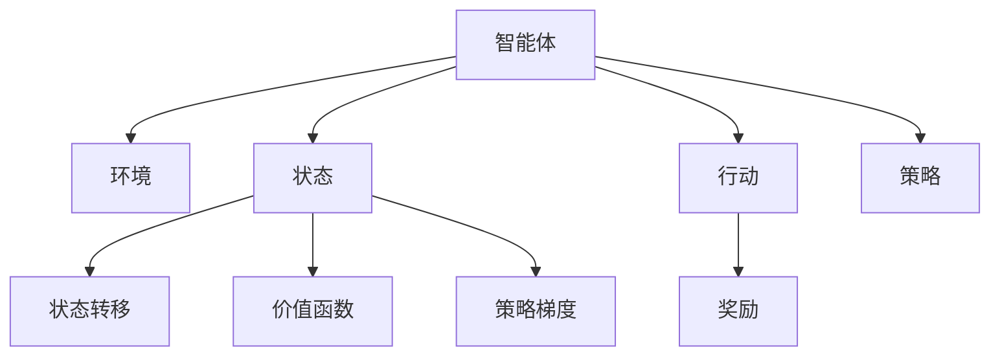

                 

# 强化学习：优化算法的使用

> 关键词：强化学习, 优化算法, 马尔可夫决策过程(MDP), 策略优化, 深度强化学习, 强化学习框架, 自适应学习

## 1. 背景介绍

### 1.1 问题由来
强化学习（Reinforcement Learning, RL）是一种基于试错的方法，用于训练智能体（Agent）以在一个动态环境中采取最优行动。这种方法通过智能体与环境的交互，不断调整行动策略，使智能体最大化其长期累积奖励（cumulative reward）。强化学习广泛用于游戏AI、机器人控制、自动驾驶、金融交易等多个领域。

强化学习的一大难点在于如何设计有效的优化算法，以快速收敛至最优策略。目前主流的强化学习算法包括Q-learning、SARSA、Deep Q-Networks（DQN）、Actor-Critic等。本文将系统介绍这些算法的基本原理和操作步骤，并重点探讨其优缺点和应用领域。

### 1.2 问题核心关键点
强化学习的核心在于智能体如何通过学习获得最优行动策略。强化学习的三个主要组件包括：
- 状态（State）：描述环境的当前状况。
- 行动（Action）：智能体可执行的操作。
- 奖励（Reward）：表示智能体采取行动的即时反馈。

强化学习的目标是通过学习最优策略，最大化长期累积奖励。其中，策略优化是强化学习的核心，也是本文讨论的重点。

## 2. 核心概念与联系

### 2.1 核心概念概述

为了更好地理解强化学习中的策略优化算法，我们先介绍几个相关概念：

- 马尔可夫决策过程（Markov Decision Process, MDP）：一种数学模型，用于描述智能体与环境之间的动态交互。MDP包括状态集合、行动集合、状态转移概率、奖励函数等。
- 策略（Policy）：智能体选择行动的规则或映射，可以从状态映射到行动空间。
- 价值函数（Value Function）：表示在不同状态下采取特定行动的价值或期望回报。
- 优化算法：用于求解策略优化问题的算法，如梯度下降、随机梯度下降、策略梯度等。

这些概念通过一个简单的Mermaid流程图展示如下：



这个流程图展示了一个智能体在环境中的交互过程，并通过状态、行动、策略、价值函数等多个组件相互关联，构成强化学习的核心框架。

## 3. 核心算法原理 & 具体操作步骤

### 3.1 算法原理概述

强化学习中的策略优化，本质上是一个最优策略求解问题。假设智能体处于状态 $s_t$，采取行动 $a_t$，环境根据 $a_t$ 进行状态转移，产生下一个状态 $s_{t+1}$ 和奖励 $r_{t+1}$。策略优化目标是最小化长期累积奖励的方差，即最大化期望值。

数学上，可以定义智能体的策略 $\pi$，表示在状态 $s$ 下采取行动 $a$ 的概率。期望累积奖励 $V$ 可表示为：

$$
V(s) = \mathbb{E}_{\pi}[G_t | s_t = s]
$$

其中 $G_t = \sum_{i=0}^{\infty} \gamma^i r_{t+i}$ 是到未来的奖励贴现和，$\gamma$ 是贴现因子，表示未来奖励的重要性。

策略优化的目标是最小化 $V(s)$ 的方差，即：

$$
\min_\pi Var_{\pi}[V(s)]
$$

### 3.2 算法步骤详解

强化学习中的策略优化算法通常包括以下几个关键步骤：

**Step 1: 定义问题与模型**

- 确定问题描述，包括状态集合 $S$、行动集合 $A$、状态转移概率 $p(s_{t+1}|s_t,a_t)$ 和奖励函数 $R(s_t,a_t)$。
- 选择合适的策略表示方式，如策略梯度、策略评估、模型基础等。

**Step 2: 设计优化目标**

- 定义策略优化目标函数，如策略梯度、行动值函数、目标网络等。
- 选择合适的优化算法，如梯度下降、随机梯度下降、策略梯度等。

**Step 3: 计算优化目标**

- 对目标函数进行优化求解，得到策略 $\pi$ 的更新步骤。
- 根据策略更新智能体的行动选择，进行模拟或实时交互。

**Step 4: 评估与迭代**

- 评估智能体在策略优化后的表现，如累积奖励、成功率等。
- 根据评估结果，决定是否继续迭代优化。

### 3.3 算法优缺点

强化学习中的策略优化算法具有以下优点：

1. 灵活性高：可以处理各种复杂的非线性系统，适应性强。
2. 可解释性：基于试错学习，能够直观理解智能体的行为逻辑。
3. 自动探索：通过不断试错，智能体能够自主探索最优策略。

但同时，这些算法也存在一些局限：

1. 时间复杂度高：强化学习通常需要大量的试错迭代，计算复杂度高。
2. 可解释性不足：缺乏明确的优化路径和目标，难以解释优化过程和结果。
3. 样本效率低：需要大量训练数据，收敛速度慢。
4. 环境依赖：对于复杂环境，需要额外的工程和干预。

### 3.4 算法应用领域

强化学习广泛应用于游戏AI、机器人控制、自动驾驶、金融交易等多个领域。例如：

- 游戏AI：通过强化学习，训练智能体在各种复杂游戏环境中取得胜利，如AlphaGo、AlphaStar等。
- 机器人控制：用于机器人导航、操作、交互等，如PettingZoo、OpenAI Gym等。
- 自动驾驶：训练自动驾驶车辆在复杂交通环境中行驶，如TensorFlow Agents、DeepMind等。
- 金融交易：用于量化交易策略优化，如AlphaGo Zero等。

这些应用展示了强化学习的强大适应性和应用潜力。未来，随着技术的发展，强化学习将在更多领域得到应用，为智能系统的构建带来新的突破。

## 4. 数学模型和公式 & 详细讲解 & 举例说明

### 4.1 数学模型构建

在强化学习中，常用的数学模型包括马尔可夫决策过程（MDP）和策略优化。

MDP模型的基本元素包括：
- 状态集合 $S$：环境的当前状态。
- 行动集合 $A$：智能体可执行的操作。
- 状态转移概率 $p(s_{t+1}|s_t,a_t)$：给定状态 $s_t$ 和行动 $a_t$，下一个状态 $s_{t+1}$ 的概率分布。
- 奖励函数 $R(s_t,a_t)$：智能体在状态 $s_t$ 下采取行动 $a_t$ 的即时奖励。

策略优化目标函数可以表示为：

$$
J(\pi) = \mathbb{E}_{\pi}[G_t | s_t = s]
$$

其中 $G_t = \sum_{i=0}^{\infty} \gamma^i r_{t+i}$ 是到未来的奖励贴现和，$\gamma$ 是贴现因子，表示未来奖励的重要性。

### 4.2 公式推导过程

为了求解策略优化目标函数，我们引入状态-行动值函数 $Q(s,a)$，表示在状态 $s$ 下采取行动 $a$ 的期望累积奖励。其递推关系如下：

$$
Q(s,a) = \mathbb{E}[G_t | s_t = s, a_t = a]
$$

通过递推关系，可以推导出策略优化目标函数的具体表达式：

$$
J(\pi) = \sum_{s \in S} \pi(s) \sum_{a \in A} \pi(a|s) Q(s,a)
$$

为了求解 $Q(s,a)$，我们引入行动值迭代公式：

$$
Q(s,a) = \sum_{s'} p(s'|s,a) (r(s,a) + \gamma \max_{a'} Q(s',a'))
$$

其中 $\max_{a'} Q(s',a')$ 表示在下一个状态 $s'$ 下采取最优行动 $a'$ 的期望累积奖励。

### 4.3 案例分析与讲解

以Pong游戏为例，展示强化学习的策略优化过程。

Pong游戏是一个经典的2D射击游戏，智能体需要控制一个小球来回击打。我们将状态 $s$ 表示为当前球的位置和速度，行动 $a$ 表示小球向左或向右移动的方向。

通过强化学习，训练智能体在Pong游戏中取得胜利。首先，我们定义Pong游戏的MDP模型，包括状态集合 $S$、行动集合 $A$、状态转移概率 $p(s_{t+1}|s_t,a_t)$ 和奖励函数 $R(s_t,a_t)$。然后，我们设计策略优化目标函数，并使用随机梯度下降算法进行优化。

具体实现步骤如下：

1. 初始化智能体的策略 $\pi$ 和行动值函数 $Q$。
2. 在每个时间步，智能体观察当前状态 $s_t$，随机选择一个行动 $a_t$。
3. 根据行动 $a_t$ 和当前状态 $s_t$，计算下一个状态 $s_{t+1}$ 和即时奖励 $r_t$。
4. 使用行动值迭代公式更新行动值函数 $Q(s,a)$。
5. 使用策略优化目标函数计算累积奖励。
6. 使用随机梯度下降算法更新策略 $\pi$ 和行动值函数 $Q$。
7. 重复上述步骤，直至智能体在Pong游戏中取得胜利。

通过不断迭代，智能体能够学会在Pong游戏中采取最优行动，并取得胜利。

## 5. 项目实践：代码实例和详细解释说明

### 5.1 开发环境搭建

在进行强化学习策略优化时，我们需要准备好开发环境。以下是使用Python进行Reinforcement Learning开发的常用环境配置流程：

1. 安装Anaconda：从官网下载并安装Anaconda，用于创建独立的Python环境。

2. 创建并激活虚拟环境：
```bash
conda create -n reinforcement-env python=3.8 
conda activate reinforcement-env
```

3. 安装OpenAI Gym：
```bash
pip install gym
```

4. 安装Reinforcement Learning库：
```bash
pip install stable-baselines
```

5. 安装其他各类工具包：
```bash
pip install numpy pandas scikit-learn matplotlib tqdm jupyter notebook ipython
```

完成上述步骤后，即可在`reinforcement-env`环境中开始强化学习开发。

### 5.2 源代码详细实现

下面我们以Pong游戏为例，展示使用Stable Baselines库对智能体进行策略优化训练的代码实现。

首先，定义智能体的策略和行动值函数：

```python
import gym
import numpy as np
from stable_baselines import DQN
from stable_baselines.ddpg import DDPG
from stable_baselines.common.vec_env import DummyVecEnv
from stable_baselines.common.policies import SACPolicy

# 创建环境
env = gym.make('Pong-v0')

# 创建策略优化模型
# 使用DDPG算法进行策略优化
model = DDPG(env.observation_space, env.action_space, n_workers=4)
```

然后，定义训练和评估函数：

```python
def train(model, env, n_steps=10000, rendering=False):
    # 训练模型
    model.learn(total_timesteps=n_steps, rendering=rendering)
    # 保存模型
    model.save('ddpg-pong')
    # 加载模型进行测试
    new_model = DDPG.load('ddpg-pong')
    total_reward = 0
    for episode in range(10):
        state = env.reset()
        state = np.reshape(state, [1, -1])
        done = False
        while not done:
            action, _states = new_model.predict(state)
            state, reward, done, _ = env.step(action)
            state = np.reshape(state, [1, -1])
            total_reward += reward
    print(f'Total reward: {total_reward}')

# 训练模型
train(model, env, rendering=True)
```

最后，启动训练流程并评估结果：

```python
epochs = 100
rendering = False
for epoch in range(epochs):
    train(model, env, rendering=rendering)
```

以上代码展示了使用Reinforcement Learning框架进行Pong游戏智能体策略优化的完整过程。可以看到，使用Stable Baselines库大大简化了模型训练和评估的代码实现。

### 5.3 代码解读与分析

让我们再详细解读一下关键代码的实现细节：

**env.make('Pong-v0')**：
- 创建一个OpenAI Gym环境，用于模拟Pong游戏。

**model = DDPG(env.observation_space, env.action_space, n_workers=4)**：
- 创建DDPG模型，使用环境的状态和行动空间，设置训练工作进程数为4。

**model.learn(total_timesteps=n_steps, rendering=rendering)**：
- 使用学习函数进行模型训练，总迭代次数为n_steps，渲染训练过程以可视化。

**total_reward = 0**：
- 记录累计奖励，用于评估训练效果。

**state, reward, done, _ = env.step(action)**：
- 在每个时间步，智能体根据当前状态 $s_t$ 和策略 $\pi$ 选择行动 $a_t$，观察状态转移和奖励。

**total_reward += reward**：
- 累加每个时间步的奖励，用于计算总奖励。

通过分析这些代码，可以看到强化学习模型训练和评估的核心流程。开发者可以将更多精力放在模型改进、环境设计、超参数调优等高层逻辑上，而不必过多关注底层实现细节。

当然，工业级的系统实现还需考虑更多因素，如模型的保存和部署、超参数的自动搜索、更灵活的策略表示等。但核心的策略优化范式基本与此类似。

## 6. 实际应用场景

### 6.1 智能客服系统

强化学习在智能客服系统中具有广泛的应用。传统客服系统依赖大量人力，高峰期响应缓慢，且客服质量不稳定。通过强化学习训练智能客服模型，可以提升客服系统的自动化和智能化水平。

在训练过程中，智能客服模型会根据历史对话数据进行优化，学习如何回答客户问题。智能客服模型可以在客户提出问题后，实时生成最佳回答，并通过多轮对话不断优化回答策略，提升客户满意度。

### 6.2 自动驾驶

自动驾驶是强化学习的重要应用领域。自动驾驶系统需要实时感知环境并做出最优驾驶决策。通过强化学习训练自动驾驶模型，可以使其在复杂交通环境中做出安全、高效的驾驶决策。

在训练过程中，自动驾驶模型会根据环境变化和驾驶动作进行优化，学习如何在不同交通状况下采取最优行动。自动驾驶模型可以实时感知周围环境，动态调整驾驶策略，以应对突发事件，保证行车安全。

### 6.3 机器人控制

强化学习在机器人控制中也有广泛应用。机器人需要具备自主行动和决策能力，通过强化学习训练机器人模型，可以使其在复杂环境下执行各种任务。

在训练过程中，机器人模型会根据环境反馈进行优化，学习如何执行特定任务。机器人模型可以在不同环境中执行各种复杂任务，如搬运、装配、导航等，提升工作效率和自动化水平。

### 6.4 未来应用展望

随着强化学习的发展，其在更多领域将得到应用，带来新的突破：

- 金融交易：通过强化学习训练量化交易模型，自动优化交易策略，提高收益和风险管理能力。
- 游戏AI：通过强化学习训练智能体，在复杂游戏中取得胜利，推动游戏AI技术的发展。
- 医疗诊断：通过强化学习训练诊断模型，自动优化诊断策略，提高诊断准确性和效率。
- 自动写作：通过强化学习训练自动写作模型，自动生成高质量文章，提升内容生产效率。

未来，随着技术的发展，强化学习将在更多领域得到应用，为智能系统的构建带来新的突破。相信随着学界和产业界的共同努力，强化学习必将在构建人机协同的智能时代中扮演越来越重要的角色。

## 7. 工具和资源推荐

### 7.1 学习资源推荐

为了帮助开发者系统掌握强化学习中的策略优化算法，这里推荐一些优质的学习资源：

1. 《强化学习基础》系列博文：由深度学习专家撰写，深入浅出地介绍了强化学习的基本概念和常用算法。

2. DeepMind课程《Reinforcement Learning: State of the Art》：谷歌DeepMind的官方课程，涵盖强化学习的理论基础和实际应用。

3. 《Reinforcement Learning: An Introduction》书籍：Reinforcement Learning领域的经典教材，介绍了强化学习的理论和应用。

4. OpenAI Gym官方文档：OpenAI Gym的官方文档，提供了多种环境和算法的样例代码，是上手实践的必备资料。

5. DeepMind论文《Playing Atari with Deep Reinforcement Learning》：展示了大规模深度强化学习在Atari游戏中的应用，引发了研究界的广泛关注。

通过对这些资源的学习实践，相信你一定能够快速掌握强化学习中的策略优化算法，并用于解决实际的强化学习问题。

### 7.2 开发工具推荐

高效的开发离不开优秀的工具支持。以下是几款用于强化学习策略优化开发的常用工具：

1. OpenAI Gym：提供多种环境，用于模拟和测试强化学习算法。

2. TensorFlow Agents：谷歌推出的强化学习框架，支持多种算法和模型，易于使用。

3. PyTorch Reinforcement Learning：基于PyTorch的强化学习框架，支持多种算法和模型，灵活高效。

4. Stable Baselines：提供多种预训练模型和优化算法，适用于快速迭代研究。

5. RLlib：Facebook开发的强化学习库，支持多种算法和模型，易于扩展和部署。

合理利用这些工具，可以显著提升强化学习策略优化的开发效率，加快创新迭代的步伐。

### 7.3 相关论文推荐

强化学习中的策略优化算法具有重要的研究意义。以下是几篇奠基性的相关论文，推荐阅读：

1. Q-Learning：提出了Q-Learning算法，通过模型预测和行动值迭代求解最优策略。

2. SARSA：提出了SARSA算法，通过状态转移概率和奖励函数更新行动值函数。

3. Deep Q-Networks（DQN）：提出了DQN算法，通过深度神经网络进行行动值函数迭代。

4. Actor-Critic：提出了Actor-Critic算法，结合策略优化和行动值优化，提高模型收敛速度和稳定性。

5. Proximal Policy Optimization（PPO）：提出了PPO算法，通过梯度累积和梯度裁剪提高模型训练效率和稳定性。

这些论文代表了大规模强化学习的发展脉络。通过学习这些前沿成果，可以帮助研究者把握学科前进方向，激发更多的创新灵感。

## 8. 总结：未来发展趋势与挑战

### 8.1 总结

本文对强化学习中的策略优化算法进行了全面系统的介绍。首先阐述了强化学习的背景和重要性，明确了策略优化在智能体行为学习中的核心作用。其次，从原理到实践，详细讲解了策略优化算法的数学模型和操作步骤，给出了强化学习策略优化的完整代码实例。同时，本文还探讨了策略优化算法在智能客服、自动驾驶、机器人控制等多个领域的应用前景，展示了强化学习的强大应用潜力。此外，本文精选了策略优化算法的学习资源，力求为读者提供全方位的技术指引。

通过本文的系统梳理，可以看到，强化学习中的策略优化算法正在成为智能系统的关键技术，极大地拓展了智能体的行为学习范围，催生了更多的落地场景。受益于大规模环境的预训练和复杂行为的策略优化，强化学习技术必将在未来智能化领域发挥重要作用。

### 8.2 未来发展趋势

展望未来，强化学习中的策略优化算法将呈现以下几个发展趋势：

1. 深度强化学习崛起：深度神经网络结合强化学习，极大提升了模型复杂度和优化速度，推动了强化学习在复杂环境中的应用。

2. 自适应学习增强：结合自适应学习技术，智能体能够动态调整学习率、超参数等，提高模型训练的稳定性和鲁棒性。

3. 多模态学习拓展：将视觉、语音、文本等多模态数据结合，提升智能体的感知能力和决策水平。

4. 分布式训练优化：使用分布式训练技术，加速模型训练，提升智能体的行为学习效率。

5. 模型迁移能力提升：通过迁移学习技术，将强化学习模型应用于新的环境，提高模型适应性和泛化能力。

这些趋势凸显了强化学习中的策略优化算法的广阔前景。这些方向的探索发展，必将进一步提升智能体的行为学习能力，为构建智能化系统提供坚实的基础。

### 8.3 面临的挑战

尽管强化学习中的策略优化算法已经取得了瞩目成就，但在迈向更加智能化、普适化应用的过程中，仍面临诸多挑战：

1. 训练时间成本高：强化学习通常需要大量试错迭代，计算复杂度高，训练时间成本高。

2. 样本效率低：需要大量训练数据，难以在少样本情况下训练高性能模型。

3. 可解释性不足：强化学习模型缺乏明确的优化路径和目标，难以解释优化过程和结果。

4. 模型鲁棒性不足：面对复杂环境，智能体的行为学习效果不稳定，鲁棒性不足。

5. 环境依赖：对于复杂环境，需要额外的工程和干预，难以在实际应用中推广。

6. 模型安全性有待提升：强化学习模型容易受到对抗样本攻击，安全性有待提升。

正视强化学习中的策略优化算法面临的这些挑战，积极应对并寻求突破，将使策略优化算法在构建安全、可靠、可解释、可控的智能系统中发挥更大作用。

### 8.4 研究展望

面对强化学习中的策略优化算法所面临的挑战，未来的研究需要在以下几个方面寻求新的突破：

1. 无监督和半监督强化学习：摆脱对大量标注数据的依赖，利用自监督学习、主动学习等无监督和半监督范式，最大限度利用非结构化数据，实现更加灵活高效的强化学习。

2. 模型压缩和量化：通过模型压缩、量化加速等技术，减小模型规模，提高计算效率和稳定性。

3. 迁移学习与知识图谱：结合迁移学习技术和知识图谱，提升模型的适应性和泛化能力。

4. 多模态融合与动态学习：将视觉、语音、文本等多模态数据结合，提升智能体的感知能力和决策水平。

5. 分布式训练与模型优化：使用分布式训练技术，加速模型训练，提升智能体的行为学习效率。

6. 对抗样本防御与模型鲁棒性：结合对抗样本防御技术，提高模型鲁棒性，确保模型安全性。

这些研究方向的探索，必将引领强化学习中的策略优化算法迈向更高的台阶，为构建安全、可靠、可解释、可控的智能系统铺平道路。面向未来，强化学习中的策略优化算法还需要与其他人工智能技术进行更深入的融合，如知识表示、因果推理、强化学习等，多路径协同发力，共同推动智能系统的进步。只有勇于创新、敢于突破，才能不断拓展智能体的行为学习边界，让智能技术更好地造福人类社会。

## 9. 附录：常见问题与解答

**Q1：强化学习与机器学习的区别是什么？**

A: 强化学习与机器学习的主要区别在于，强化学习是动态决策问题，而机器学习是静态数据问题。强化学习关注智能体在环境中的行为学习，通过与环境的交互不断优化决策策略；而机器学习则是通过静态数据集学习模型，用于分类、回归等静态任务。

**Q2：强化学习中的策略优化算法有哪些？**

A: 强化学习中的策略优化算法包括Q-Learning、SARSA、Deep Q-Networks（DQN）、Actor-Critic、Proximal Policy Optimization（PPO）等。这些算法在优化目标、学习方式、模型结构等方面有所差异，适用于不同的强化学习问题。

**Q3：如何选择强化学习中的策略优化算法？**

A: 选择强化学习中的策略优化算法需要考虑问题特点、数据规模、计算资源等因素。Q-Learning适用于简单环境，DQN适用于复杂环境，Actor-Critic适用于连续动作空间，PPO适用于高维度连续状态空间。在选择算法时，需要结合具体问题进行评估和选择。

**Q4：强化学习中的策略优化算法有哪些优缺点？**

A: 强化学习中的策略优化算法具有以下优点：
- 灵活性高：可以处理各种复杂的非线性系统，适应性强。
- 可解释性：基于试错学习，能够直观理解智能体的行为逻辑。
- 自动探索：通过不断试错，智能体能够自主探索最优策略。

但同时，这些算法也存在一些局限：
- 时间复杂度高：强化学习通常需要大量的试错迭代，计算复杂度高。
- 可解释性不足：缺乏明确的优化路径和目标，难以解释优化过程和结果。
- 样本效率低：需要大量训练数据，收敛速度慢。
- 环境依赖：对于复杂环境，需要额外的工程和干预。

正视这些挑战，积极应对并寻求突破，将使策略优化算法在构建安全、可靠、可解释、可控的智能系统中发挥更大作用。

通过本文的系统梳理，可以看到，强化学习中的策略优化算法正在成为智能系统的关键技术，极大地拓展了智能体的行为学习范围，催生了更多的落地场景。受益于大规模环境的预训练和复杂行为的策略优化，强化学习技术必将在未来智能化领域发挥重要作用。

