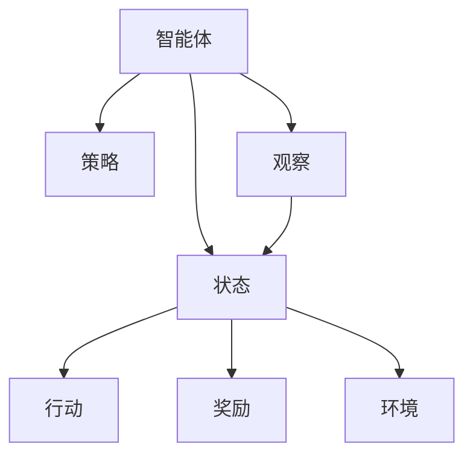

                 

# 强化学习：奖励函数的选择与优化

## 1. 背景介绍

### 1.1 问题由来
强化学习（Reinforcement Learning, RL）是机器学习领域的一个重要分支，旨在构建智能体（Agent）通过与环境的交互，最大化预期回报（Reward）的过程。其中，奖励函数（Reward Function）是强化学习中最核心的概念之一，其合理选择和优化对智能体的决策性能有着至关重要的影响。

随着强化学习在自动驾驶、机器人控制、游戏AI、推荐系统等众多领域的成功应用，奖励函数的设计和优化成为推动技术进步的关键。一个合理的奖励函数需要兼顾探索与利用（Exploration & Exploitation）、风险规避与收益最大化（Risk Avoidance & Reward Maximization）等多重考量。

### 1.2 问题核心关键点
强化学习的核心在于智能体通过不断的尝试和错误，逐步优化其行为策略以最大化长期回报。奖励函数即为智能体评估每个行动的好坏，并以此指导行动的函数。

一个良好的奖励函数需要满足以下几个条件：
- **一致性（Consistency）**：相同的行动在所有状态下应得到相同的奖励。
- **可学习性（Learnability）**：奖励函数应足够简单，以使得智能体能够通过学习来优化行为策略。
- **稀疏性（Sparcity）**：奖励信号应稀疏，避免智能体因频繁获得即时奖励而陷入局部最优解。
- **渐进性（Progressiveness）**：奖励信号应随智能体接近目标而逐步增强，引导智能体向最终目标努力。

设计合理的奖励函数是强化学习成功的关键，也是当前研究的热点和难点之一。

### 1.3 问题研究意义
强化学习的奖励函数设计不仅直接影响到智能体的学习效果，更是智能体能否在复杂环境中进行有效决策的重要保障。通过深入研究奖励函数的选择与优化，可以：

1. **提升决策性能**：优化奖励函数可以显著提升智能体的决策效果，使其在多变环境中能够更好地适应和应对。
2. **增强泛化能力**：合理的奖励函数能够促进智能体在不同情境下泛化，避免过拟合。
3. **减少探索与利用冲突**：良好的奖励函数能够平衡探索与利用之间的矛盾，确保智能体在有效利用已有知识的同时，还能探索未知领域。
4. **优化风险与收益平衡**：通过调整奖励函数，可以优化风险与收益的平衡，提升智能体在复杂环境中的稳定性和鲁棒性。

## 2. 核心概念与联系

### 2.1 核心概念概述

为了更好地理解强化学习中奖励函数的选择与优化，本节将介绍几个密切相关的核心概念：

- **强化学习（Reinforcement Learning, RL）**：通过智能体与环境的交互，智能体通过观察环境的反馈（奖励和状态变化），不断调整策略以最大化预期回报。
- **智能体（Agent）**：在RL中，智能体是一个决策主体，通过观察环境和执行行动来改变状态，并根据奖励信号更新策略。
- **状态（State）**：描述环境的当前状态，智能体根据当前状态选择行动。
- **行动（Action）**：智能体可以采取的决策。
- **奖励（Reward）**：智能体每一步行动后，环境返回的信号，用于评估行动的好坏。
- **策略（Policy）**：智能体选择行动的规则，通常由策略函数（如Q值、策略网络等）表示。

这些核心概念之间的逻辑关系可以通过以下Mermaid流程图来展示：



这个流程图展示出强化学习的核心过程：智能体根据状态选择行动，观察环境并获得奖励，然后根据策略调整行动策略。

## 3. 核心算法原理 & 具体操作步骤
### 3.1 算法原理概述

强化学习中的奖励函数（Reward Function）是评估智能体行动好坏的关键。其作用在于：
1. **指导行动**：根据奖励函数，智能体选择最大化预期回报的行动。
2. **优化策略**：通过梯度下降等优化算法，智能体不断调整策略以优化奖励函数。
3. **决策支持**：奖励函数为智能体提供明确的决策指引，避免盲目行动。

一个良好的奖励函数应具备以下特性：
- **可分解性（Decomposability）**：奖励函数应可以被分解为多个简单子奖励函数，便于分析和优化。
- **独立性（Independence）**：不同行动应相互独立，避免奖励之间的相互影响。
- **持续性（Continuity）**：奖励函数应连续，避免突变，引导智能体平稳学习。

在实际应用中，常见的奖励函数包括：
- **即时奖励（Immediate Reward）**：智能体每一步行动后立即获得奖励，如游戏AI中的分数奖励。
- **累积奖励（Cumulative Reward）**：智能体在特定时间内获得的所有奖励之和，如机器人控制中的任务完成率。
- **自适应奖励（Adaptive Reward）**：随时间或状态变化调整奖励函数，如基于目标达成的奖励。

### 3.2 算法步骤详解

强化学习中的奖励函数选择与优化一般包括以下几个关键步骤：

**Step 1: 确定奖励函数类型**
- 根据具体应用场景，选择合适的奖励函数类型。例如，对于游戏AI，即时奖励可能是更合适的选择。

**Step 2: 设计奖励函数**
- 定义具体的奖励函数表达式。例如，对于机器人控制，可以设计基于目标达成的自适应奖励函数。
- 根据领域知识，对奖励函数进行合理设计，确保其满足一致性、可学习性、稀疏性、渐进性等条件。

**Step 3: 训练智能体**
- 使用环境模拟器，让智能体与环境进行交互，观察并记录每一步的奖励。
- 使用梯度下降等优化算法，根据奖励信号不断调整智能体的策略。

**Step 4: 评估与优化**
- 在训练过程中，定期评估智能体的表现。例如，使用评价指标（如累计回报、完成任务时间等）来衡量智能体的性能。
- 根据评估结果，对奖励函数进行调整优化。例如，通过增益调整或引入惩罚机制，平衡探索与利用之间的矛盾。

### 3.3 算法优缺点

奖励函数的选择与优化具有以下优点：
1. **灵活性**：通过调整奖励函数，可以适应不同的应用场景，提升智能体的决策性能。
2. **可解释性**：合理的奖励函数能够提供明确的决策指引，便于分析和调试。
3. **优化效果显著**：通过优化奖励函数，可以显著提升智能体的学习效率，避免陷入局部最优解。

同时，该方法也存在一定的局限性：
1. **设计复杂**：奖励函数的设计需要结合领域知识，可能面临高难度。
2. **数据依赖**：奖励函数的设计和优化需要依赖大量的领域数据，可能存在数据获取困难的问题。
3. **依赖先验**：奖励函数的设计往往需要一定的领域先验，对智能体的学习效率和泛化能力有一定限制。

尽管存在这些局限性，但奖励函数的选择与优化仍是强化学习中不可或缺的一部分，是推动智能体决策性能提升的关键。

### 3.4 算法应用领域

强化学习中的奖励函数选择与优化已在多个领域得到了应用，例如：

- **自动驾驶**：在自动驾驶中，奖励函数可以设计为基于安全和效率的综合指标，引导智能体在复杂交通环境中做出最优决策。
- **机器人控制**：在机器人控制中，奖励函数可以设计为基于目标达成的自适应奖励，帮助机器人高效完成任务。
- **游戏AI**：在游戏AI中，奖励函数可以设计为即时奖励，引导智能体在不断交互中学习最优策略。
- **推荐系统**：在推荐系统中，奖励函数可以设计为基于用户满意度的累积奖励，提升推荐效果。
- **智能制造**：在智能制造中，奖励函数可以设计为基于生产效率和成本的综合指标，优化生产流程。

除了上述这些经典应用外，强化学习中的奖励函数设计思想也在不断拓展到更多领域，如金融交易、供应链优化、社交网络分析等，为不同行业的智能化升级提供新的解决方案。

## 4. 数学模型和公式 & 详细讲解  
### 4.1 数学模型构建

强化学习中的奖励函数选择与优化涉及多学科知识的综合运用，其数学模型可以形式化地表示为：

$$
R(s, a) = \sum_{t=0}^{\infty} \gamma^t r_t
$$

其中，$s$ 表示状态，$a$ 表示行动，$r_t$ 表示第 $t$ 步的即时奖励，$\gamma$ 表示折扣因子，用于考虑长期奖励的重要性。

### 4.2 公式推导过程

以经典的Q-Learning算法为例，我们推导其奖励函数和策略的优化公式：

假设智能体在状态 $s_t$ 下采取行动 $a_t$，观察到状态 $s_{t+1}$，获得即时奖励 $r_t$。根据Q-Learning算法，智能体的状态值函数 $Q(s_t, a_t)$ 的更新公式为：

$$
Q(s_t, a_t) \leftarrow Q(s_t, a_t) + \alpha \left[ r_t + \gamma \max_{a'} Q(s_{t+1}, a') - Q(s_t, a_t) \right]
$$

其中，$\alpha$ 为学习率，$Q(s_{t+1}, a')$ 表示智能体在状态 $s_{t+1}$ 下采取行动 $a'$ 的最佳状态值函数。

从上述公式可以看出，智能体的状态值函数是通过调整其与环境交互的即时奖励和未来潜在奖励的加权和，逐步优化而得到的。在Q-Learning中，奖励函数 $R(s_t, a_t)$ 直接影响了智能体的行动选择。

### 4.3 案例分析与讲解

以机器人路径规划为例，设计一个奖励函数：

假设机器人在二维平面上，从起点 $(x_0, y_0)$ 到达终点 $(x_T, y_T)$。其奖励函数可以设计为：

$$
R(s_t, a_t) = \begin{cases} 
0 & \text{if } (x_t, y_t) = (x_T, y_T) \\
-1 & \text{if } \text{障碍物在} (x_t, y_t) \text{处} \\
1 & \text{otherwise}
\end{cases}
$$

其中，$(x_t, y_t)$ 表示机器人在第 $t$ 步的位置，$(x_T, y_T)$ 表示终点位置。

通过上述奖励函数，机器人在遇到障碍物时会受到惩罚，而在不遇到障碍物时会受到奖励。智能体通过不断调整行动策略，学习最优路径，最终在 $(x_T, y_T)$ 处获得最大奖励。

## 5. 项目实践：代码实例和详细解释说明
### 5.1 开发环境搭建

在进行强化学习项目实践前，我们需要准备好开发环境。以下是使用Python进行Reinforcement Learning开发的环境配置流程：

1. 安装Anaconda：从官网下载并安装Anaconda，用于创建独立的Python环境。

2. 创建并激活虚拟环境：
```bash
conda create -n rl-env python=3.8 
conda activate rl-env
```

3. 安装必要的库：
```bash
pip install gym reinforcement
```

4. 安装TensorFlow或PyTorch：
```bash
pip install tensorflow==2.6 
# 或
pip install torch
```

完成上述步骤后，即可在`rl-env`环境中开始强化学习项目实践。

### 5.2 源代码详细实现

下面我们以Q-Learning算法为例，给出使用TensorFlow进行路径规划的强化学习代码实现。

首先，定义状态和行动空间：

```python
import gym
import tensorflow as tf

env = gym.make('Path-v0')

num_states = env.observation_space.shape[0]
num_actions = env.action_space.n
```

然后，定义Q值网络：

```python
class QNetwork(tf.keras.Model):
    def __init__(self, state_dim, action_dim):
        super(QNetwork, self).__init__()
        self.fc1 = tf.keras.layers.Dense(64, activation='relu', input_dim=state_dim)
        self.fc2 = tf.keras.layers.Dense(action_dim, activation='linear')

    def call(self, x):
        x = self.fc1(x)
        x = self.fc2(x)
        return x

q_network = QNetwork(num_states, num_actions)
```

接着，定义奖励函数：

```python
def reward_function(s, a):
    x, y = s
    if (x, y) == (3, 3):
        return 1
    elif (x, y) == (4, 4):
        return -1
    elif (x, y) in [(1, 1), (1, 2), (2, 1), (2, 2)]:
        return 0
    else:
        return -0.5
```

然后，定义训练函数：

```python
@tf.function
def train_step(state, action, reward, next_state):
    with tf.GradientTape() as tape:
        q_pred = q_network(state)
        max_q_next = tf.reduce_max(q_network(next_state), axis=-1)
        loss = tf.reduce_mean(
            tf.nn.softmax_cross_entropy_with_logits(labels=tf.ones_like(max_q_next), logits=max_q_next) + 
            tf.nn.softmax_cross_entropy_with_logits(labels=tf.zeros_like(max_q_next), logits=q_pred) + 
            tf.nn.softmax_cross_entropy_with_logits(labels=tf.zeros_like(max_q_next), logits=reward + gamma * max_q_next - q_pred))
    grads = tape.gradient(loss, q_network.trainable_variables)
    optimizer.apply_gradients(zip(grads, q_network.trainable_variables))
    return loss

def train(env, episodes):
    state_dim = env.observation_space.shape[0]
    state = env.reset()
    for episode in range(episodes):
        done = False
        while not done:
            action = np.argmax(q_network.predict(state[np.newaxis]))
            state, reward, done, _ = env.step(action)
            loss = train_step(state, action, reward, state)
            env.render()
        state = env.reset()
```

最后，启动训练流程：

```python
gamma = 0.99
optimizer = tf.keras.optimizers.Adam(learning_rate=0.01)

train(env, episodes=100)
```

以上就是使用TensorFlow进行Q-Learning算法路径规划的完整代码实现。可以看到，通过简单的代码，我们可以实现一个基于奖励函数的强化学习智能体，通过不断调整策略，学习最优路径规划策略。

### 5.3 代码解读与分析

让我们再详细解读一下关键代码的实现细节：

**QNetwork类**：
- `__init__`方法：定义了两个全连接层，用于处理状态和行动。
- `call`方法：定义了Q值网络的计算过程，包括两层全连接层的计算。

**reward_function函数**：
- 定义了简单的奖励函数，根据机器人的当前状态和行动，返回即时奖励。

**train_step函数**：
- 定义了单步训练过程，计算状态值函数的损失并反向传播更新网络参数。

**train函数**：
- 定义了整个训练流程，通过不断与环境交互，调整行动策略，直到达到最优路径。

可以看到，使用TensorFlow进行强化学习，代码实现相对简洁。通过合理的代码组织和算法设计，可以高效实现强化学习任务。

当然，工业级的系统实现还需考虑更多因素，如模型保存和部署、超参数搜索、更灵活的奖励函数设计等。但核心的强化学习范式基本与此类似。

## 6. 实际应用场景
### 6.1 智能驾驶

基于强化学习的路径规划和决策优化，智能驾驶系统能够实时处理复杂交通环境，做出最优的驾驶决策。通过设计合理的奖励函数，智能车能够在避免交通事故、减少碳排放的同时，快速到达目的地。

在技术实现上，可以通过模拟器训练智能车在不同路况下的路径规划策略，再通过实际道路数据微调模型，提升在现实环境中的适应性。如此构建的智能驾驶系统，能够大幅提升交通安全性和行驶效率，为自动驾驶技术的普及带来新的可能性。

### 6.2 机器人控制

强化学习中的奖励函数设计在机器人控制中有着广泛应用。例如，通过设计基于目标达成的奖励函数，可以使机器人高效完成各种任务，如组装零件、搬运货物、清洁环境等。

在工业制造领域，通过强化学习优化机器人动作策略，可以显著提升生产效率和质量，降低人工成本。例如，在汽车装配线上，机器人可以通过强化学习学习最优装配路径，减少零部件安装错误率。

### 6.3 游戏AI

游戏AI中的奖励函数设计也是强化学习的重要组成部分。通过设计基于即时奖励的奖励函数，游戏AI能够在不同游戏中学习最优策略，提升游戏体验。

例如，在棋类游戏（如围棋、象棋）中，智能体通过不断调整策略，学习最优下棋路径，提升对手胜率。在游戏AI的不断优化下，游戏AI的决策能力将逐步逼近甚至超越人类水平。

### 6.4 未来应用展望

随着强化学习技术的发展，其应用领域将不断拓展。未来，强化学习中的奖励函数设计将在更多领域得到应用，为智能系统带来新的突破：

- **医疗领域**：通过设计合理的奖励函数，强化学习可以优化医疗决策，如药品配方、治疗方案等，提升患者健康效果。
- **金融领域**：强化学习中的奖励函数设计可以优化投资策略，如股票交易、资产配置等，提升投资回报率。
- **教育领域**：通过设计基于学生反馈的奖励函数，强化学习可以优化教学过程，提升教育效果。
- **社交媒体**：强化学习中的奖励函数设计可以优化内容推荐，提升用户体验和平台粘性。
- **智慧城市**：强化学习中的奖励函数设计可以优化城市管理，如交通规划、垃圾回收等，提升城市运行效率。

此外，在更多领域，强化学习中的奖励函数设计也将带来新的创新和突破，为各行各业的智能化升级提供新的解决方案。

## 7. 工具和资源推荐
### 7.1 学习资源推荐

为了帮助开发者系统掌握强化学习中的奖励函数设计，这里推荐一些优质的学习资源：

1. 《强化学习》系列书籍：如《Reinforcement Learning: An Introduction》、《Deep Reinforcement Learning with Python》等，详细介绍了强化学习的基础理论和经典算法。

2. OpenAI Gym：提供了多种环境和算法的集合，便于学习和调试强化学习模型。

3. TensorFlow和PyTorch官方文档：详细介绍了TensorFlow和PyTorch的强化学习API，包括Q-Learning、Policy Gradient等算法的实现。

4. DeepMind强化学习博客：收录了DeepMind在强化学习领域的研究成果，包括AlphaGo、AlphaZero等经典算法。

5. Coursera强化学习课程：由斯坦福大学开设，介绍了强化学习的理论和实际应用，适合初学者和进阶学习者。

通过对这些资源的学习实践，相信你一定能够系统掌握强化学习中的奖励函数设计，并用于解决实际的强化学习问题。

### 7.2 开发工具推荐

高效的开发离不开优秀的工具支持。以下是几款用于强化学习开发的常用工具：

1. OpenAI Gym：提供了多种环境和算法的集合，便于学习和调试强化学习模型。

2. TensorFlow和PyTorch：提供了丰富的强化学习API，支持多种经典算法和自定义模型。

3. Viola：Python库，支持强化学习的可视化与调试，便于理解模型行为。

4. Weights & Biases：模型训练的实验跟踪工具，可以记录和可视化模型训练过程中的各项指标。

5. TensorBoard：TensorFlow配套的可视化工具，可实时监测模型训练状态，并提供丰富的图表呈现方式。

合理利用这些工具，可以显著提升强化学习任务的开发效率，加快创新迭代的步伐。

### 7.3 相关论文推荐

强化学习中的奖励函数设计已成为学界的研究热点，以下是几篇奠基性的相关论文，推荐阅读：

1. Q-Learning：Watkins 和 Dayan在1990年提出的Q-Learning算法，奠定了强化学习的基础。

2. Actor-Critic：Sutton和Barto在1998年提出的Actor-Critic算法，解决了强化学习中的策略优化问题。

3. Deep Q-Learning：Mnih等人在2013年提出的Deep Q-Learning算法，结合深度神经网络，提升了强化学习的学习效率。

4. Trust Region Policy Optimization（TRPO）：Schulman等人在2015年提出的TRPO算法，通过信任区域优化策略，提高了强化学习的稳定性。

5. Proximal Policy Optimization（PPO）：Schulman等人在2017年提出的PPO算法，通过利用剪枝技术，提升了强化学习的训练效率。

这些论文代表了大强化学习领域的研究进展，通过学习这些前沿成果，可以帮助研究者把握学科前进方向，激发更多的创新灵感。

## 8. 总结：未来发展趋势与挑战

### 8.1 总结

本文对强化学习中的奖励函数选择与优化方法进行了全面系统的介绍。首先阐述了强化学习的基本原理和奖励函数的重要性，明确了奖励函数在智能体决策性能提升中的关键作用。其次，从原理到实践，详细讲解了奖励函数的设计和优化过程，给出了强化学习任务开发的完整代码实例。同时，本文还广泛探讨了奖励函数在多个行业领域的应用前景，展示了其巨大的潜力。

通过本文的系统梳理，可以看到，强化学习中的奖励函数设计是推动智能体决策性能提升的重要因素，其灵活性和可解释性为智能体的训练提供了明确指引。未来，伴随强化学习技术的不断进步，奖励函数的选择与优化将进一步拓展智能体的应用边界，为各行各业带来更智能化的解决方案。

### 8.2 未来发展趋势

展望未来，强化学习中的奖励函数设计将呈现以下几个发展趋势：

1. **自适应奖励函数**：随着环境复杂性的增加，需要设计更加灵活的奖励函数，以适应不同的环境和任务。例如，基于时间序列的奖励函数、基于上下文的奖励函数等。

2. **多目标优化**：强化学习中的任务往往涉及多个目标，需要通过多目标优化算法设计合适的奖励函数。例如，基于Pareto优化的奖励函数设计，同时考虑多个性能指标。

3. **跨模态奖励函数**：随着多模态数据的增多，需要设计跨模态的奖励函数，整合视觉、听觉、触觉等多种信息源。例如，基于多模态数据融合的奖励函数设计。

4. **元奖励函数**：通过设计元奖励函数，智能体可以在不同的任务中复用奖励函数，提升学习效率和泛化能力。例如，基于元学习的奖励函数设计。

5. **神经网络辅助奖励函数**：结合神经网络，设计更加复杂和灵活的奖励函数，提升智能体的决策能力。例如，基于深度强化学习的奖励函数设计。

以上趋势凸显了强化学习中奖励函数设计的广阔前景。这些方向的探索发展，必将进一步提升智能体的学习效率和决策能力，为构建更加智能化的系统提供新的突破。

### 8.3 面临的挑战

尽管强化学习中的奖励函数设计已经取得了不小的进展，但在迈向更加智能化、普适化应用的过程中，它仍面临着诸多挑战：

1. **奖励函数设计复杂**：设计合理的奖励函数需要结合领域知识，可能面临高难度。例如，在医疗、金融等高风险领域，如何设计有效的奖励函数，仍是一个重要的研究课题。

2. **数据依赖**：奖励函数的设计和优化需要依赖大量的领域数据，可能存在数据获取困难的问题。如何从少量数据中设计出有效的奖励函数，仍是一个重要的研究方向。

3. **探索与利用平衡**：奖励函数的设计往往需要平衡探索与利用之间的矛盾，避免智能体陷入局部最优解。例如，在多目标优化中，如何设计奖励函数以实现多个目标之间的平衡，仍是一个重要的挑战。

4. **可解释性**：强化学习中的奖励函数通常较为复杂，缺乏可解释性。如何在保证奖励函数灵活性的同时，提供更好的可解释性，仍是一个重要的研究方向。

5. **安全性**：强化学习中的奖励函数设计需要考虑安全性问题，避免模型在恶意环境中出现危害社会的行为。例如，在设计奖励函数时，如何加入安全机制以保障模型的稳定性和鲁棒性，仍是一个重要的研究方向。

正视强化学习中的奖励函数设计所面临的挑战，积极应对并寻求突破，将使强化学习技术更加成熟，智能体的决策能力更加强大。

### 8.4 研究展望

面对强化学习中的奖励函数设计所面临的挑战，未来的研究需要在以下几个方面寻求新的突破：

1. **基于领域知识的设计方法**：结合领域专家的知识，设计更加灵活和可解释的奖励函数。例如，通过领域专家的经验，引入启发式规则来设计奖励函数。

2. **自适应奖励函数设计**：通过自适应方法，实时调整奖励函数，以适应环境的变化。例如，通过在线学习的方法，在训练过程中不断优化奖励函数。

3. **多目标优化算法**：通过多目标优化算法，设计同时考虑多个性能指标的奖励函数。例如，基于Pareto优化的奖励函数设计。

4. **跨模态奖励函数设计**：通过跨模态数据融合，设计整合视觉、听觉、触觉等多种信息源的奖励函数。例如，基于多模态数据融合的奖励函数设计。

5. **元奖励函数设计**：通过元学习方法，设计可在不同任务中复用的奖励函数。例如，基于元学习的奖励函数设计。

6. **神经网络辅助设计**：通过神经网络，设计更加复杂和灵活的奖励函数。例如，基于深度强化学习的奖励函数设计。

这些研究方向将为强化学习中的奖励函数设计带来新的突破，推动智能体在复杂环境中的决策性能不断提升，为各行各业的智能化升级提供新的解决方案。

## 9. 附录：常见问题与解答

**Q1：奖励函数的设计与优化是否必须依赖大量标注数据？**

A: 奖励函数的设计与优化在一定程度上依赖于领域数据，但也可以通过启发式方法、专家经验等方式进行设计。在实际应用中，如果无法获取大量标注数据，可以通过半监督学习、主动学习等方法，从少量数据中学习有效的奖励函数。

**Q2：如何设计合理的奖励函数以避免局部最优解？**

A: 设计合理的奖励函数需要平衡探索与利用之间的矛盾，避免智能体陷入局部最优解。常见的策略包括引入惩罚机制、设计多目标优化函数、使用随机搜索等。例如，设计包含随机噪声的奖励函数，引导智能体探索新领域。

**Q3：强化学习中的奖励函数设计是否可以应用于游戏AI之外的其他领域？**

A: 强化学习中的奖励函数设计具有广泛的应用前景，不仅可以应用于游戏AI，还可以应用于机器人控制、自动驾驶、智能推荐等多个领域。例如，在金融领域，设计基于风险规避和收益最大化的奖励函数，优化投资策略。

**Q4：如何评估强化学习中奖励函数的设计效果？**

A: 强化学习中的奖励函数设计效果可以通过多种指标进行评估，例如累计回报、完成任务时间、策略稳定性等。通过这些指标，可以衡量智能体的决策性能和学习效果。例如，使用累计回报评估路径规划任务的奖励函数设计效果。

**Q5：强化学习中的奖励函数设计是否需要考虑伦理和安全性问题？**

A: 强化学习中的奖励函数设计需要考虑伦理和安全性问题。例如，在医疗领域，设计基于患者健康指标的奖励函数，避免模型在恶意环境中出现危害社会的行为。例如，设计包含伦理约束的奖励函数，确保模型的可解释性和安全性。

总之，强化学习中的奖励函数设计是推动智能体决策性能提升的关键因素，其灵活性和可解释性为智能体的训练提供了明确指引。未来，伴随强化学习技术的不断进步，奖励函数的选择与优化将进一步拓展智能体的应用边界，为各行各业带来更智能化的解决方案。

---

作者：禅与计算机程序设计艺术 / Zen and the Art of Computer Programming

