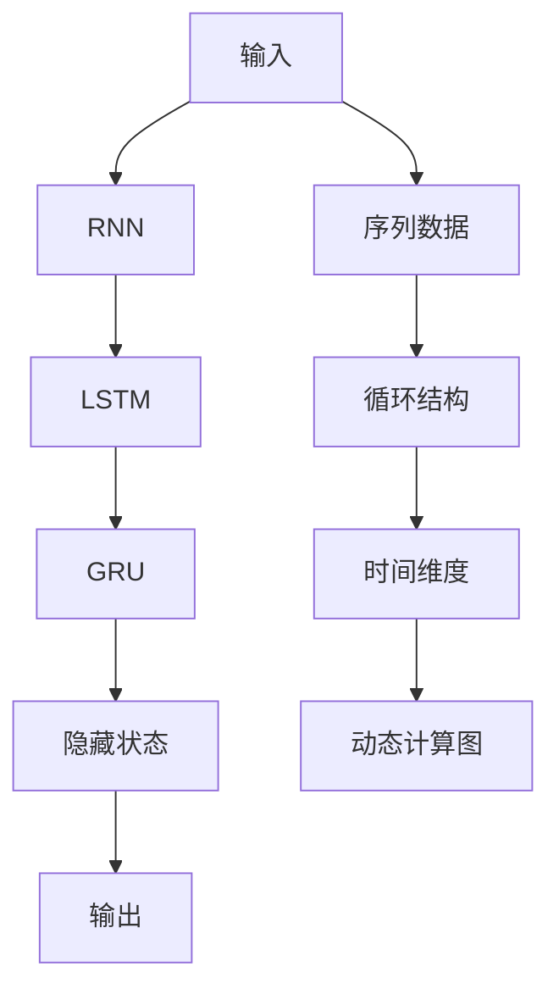

                 

# 循环神经网络RNN原理与代码实例讲解

> 关键词：循环神经网络(RNN), 长短期记忆网络(LSTM), 门控循环单元(GRU), 序列建模, 时间依赖性, 动态计算图

## 1. 背景介绍

循环神经网络（Recurrent Neural Network, RNN）是一类具有时间依赖性的神经网络，由于其独特的循环结构，能够处理序列数据，如文本、语音、时间序列等。在深度学习领域，RNN因其在时间序列建模方面的卓越表现，成为了自然语言处理、语音识别、时间序列预测等领域的重要工具。

### 1.1 问题由来
在深度学习早期，由于反向传播算法（Backpropagation）的局限性，神经网络在处理序列数据时面临较大的困难。传统的神经网络通常以固定权重对输入进行处理，难以捕捉数据的时间依赖关系。而RNN通过引入时间维度，通过循环结构允许信息在网络中传递和累积，从而有效解决了这一问题。

### 1.2 问题核心关键点
RNN的核心在于其循环结构，通过隐藏状态（Hidden State）来存储和传递序列信息。每一时间步（Time Step），网络都会接收新的输入，并将前一时间步的隐藏状态作为参数输入网络，更新新的隐藏状态。隐藏状态不仅反映了当前输入的特性，还包含了之前时间步的信息，使得网络能够学习序列数据的内在规律。

目前，RNN的主要变体包括LSTM（长短期记忆网络）、GRU（门控循环单元）等。这些变体通过不同的门控机制和结构设计，改善了原始RNN的梯度消失和梯度爆炸问题，提高了模型的训练效率和性能。

## 2. 核心概念与联系

### 2.1 核心概念概述

为更好地理解RNN的原理，本节将介绍几个密切相关的核心概念：

- 循环神经网络(RNN)：具有循环结构的神经网络，通过隐藏状态存储和传递序列信息。
- 长短期记忆网络(LSTM)：RNN的一种变体，通过引入遗忘门和输入门，解决了长期依赖问题，提高了模型的长期记忆能力。
- 门控循环单元(GRU)：LSTM的简化版本，同样具备门控机制，在保持高性能的同时，减少了参数量和计算复杂度。
- 序列建模：使用RNN处理序列数据，捕捉其内在的时间依赖性。
- 动态计算图：与传统的静态计算图不同，RNN通过循环结构动态构建计算图，计算过程随时间推移不断更新。

这些核心概念之间的逻辑关系可以通过以下Mermaid流程图来展示：



这个流程图展示了一系列RNN相关的核心概念及其之间的关系：

1. 输入数据首先被送入RNN。
2. RNN通过循环结构，在不同时间步动态构建计算图。
3. 在LSTM和GRU中，引入门控机制，提高模型的长期记忆和计算效率。
4. 隐藏状态存储和传递序列信息，最终输出预测结果。

## 3. 核心算法原理 & 具体操作步骤
### 3.1 算法原理概述

RNN的基本思想是通过循环结构，允许信息在时间维度上传递和累积。每一时间步，网络都会接收新的输入，并将前一时间步的隐藏状态作为参数输入网络，更新新的隐藏状态。

### 3.2 算法步骤详解

RNN的算法步骤如下：

1. **初始化**：设置模型的参数，包括权重矩阵 $W_{xh}$ 和 $W_{hh}$，以及偏置向量 $b_x$ 和 $b_h$。
2. **输入处理**：将每个时间步的输入 $x_t$ 转换为隐藏状态 $h_t$。
3. **隐藏状态更新**：通过前一时间步的隐藏状态 $h_{t-1}$ 和当前时间步的输入 $x_t$，计算当前时间步的隐藏状态 $h_t$。
4. **输出计算**：根据当前时间步的隐藏状态 $h_t$，计算输出 $y_t$。
5. **反向传播**：通过反向传播算法计算梯度，更新模型参数。

### 3.3 算法优缺点

RNN的优点在于其能够处理序列数据，捕捉数据的时间依赖关系。然而，RNN也存在一些固有的问题：

- **梯度消失和梯度爆炸**：由于RNN的循环结构，梯度在反向传播时可能会消失或爆炸，影响模型训练。
- **难以捕捉长期依赖关系**：原始RNN难以有效处理长期依赖问题，需要引入LSTM或GRU等变体。
- **计算复杂度高**：RNN需要处理所有时间步的输入，计算复杂度较高，难以处理大规模数据集。
- **对序列长度的敏感性**：RNN对序列长度较为敏感，输入过长的序列可能导致模型训练不稳定。

尽管存在这些缺点，但RNN在处理序列数据方面仍具有不可替代的价值，适用于许多NLP任务和时序预测任务。

### 3.4 算法应用领域

RNN及其变体被广泛应用于以下领域：

- 语言建模：通过预测下一个单词，捕捉文本的时间依赖关系。
- 机器翻译：将源语言文本翻译成目标语言，利用RNN处理序列对序列的映射。
- 语音识别：将语音信号转换为文本，捕捉语音的音素序列。
- 时间序列预测：预测未来数据点，利用RNN捕捉时间序列的趋势和周期性。
- 自然语言处理：如情感分析、命名实体识别、文本分类等，利用RNN处理文本序列。

此外，RNN还与其他深度学习技术结合，如卷积神经网络（CNN）、注意力机制等，进一步提升了其处理能力。

## 4. 数学模型和公式 & 详细讲解  
### 4.1 数学模型构建

RNN的数学模型可以通过递归的方式定义。假设 $x_t$ 表示时间步 $t$ 的输入，$h_t$ 表示时间步 $t$ 的隐藏状态，$y_t$ 表示时间步 $t$ 的输出，$W_{xh}$ 和 $W_{hh}$ 分别表示输入权重和隐藏权重矩阵，$b_x$ 和 $b_h$ 分别表示输入偏置和隐藏偏置向量，则RNN的数学模型为：

$$
h_t = f(x_t, h_{t-1}) = \tanh(W_{xh}x_t + b_x + W_{hh}h_{t-1} + b_h)
$$

其中 $\tanh$ 为激活函数，$f$ 为RNN的隐藏状态更新函数。

### 4.2 公式推导过程

RNN的隐藏状态更新函数可以通过递归形式表示，如下所示：

$$
h_t = \tanh(W_{xh}x_t + b_x + W_{hh}h_{t-1} + b_h)
$$

对于LSTM和GRU，通过引入不同的门控机制，改进原始RNN的隐藏状态更新方式。以LSTM为例，LSTM的隐藏状态更新函数为：

$$
h_t = \tanh(c_t)
$$

$$
c_t = f(r_t) * c_{t-1} + i_t * \tanh(W_{xh}x_t + b_x + W_{hh}h_{t-1} + b_h)
$$

$$
r_t = \sigma(W_{xh}x_t + b_x + W_{hh}h_{t-1} + b_h)
$$

$$
i_t = \sigma(W_{xh}x_t + b_x + W_{hh}h_{t-1} + b_h)
$$

其中 $c_t$ 为LSTM的细胞状态，$f$ 和 $\sigma$ 分别为Sigmoid和Tanh激活函数，$i_t$ 和 $r_t$ 分别为输入门和遗忘门。

### 4.3 案例分析与讲解

以语言模型为例，RNN通过预测下一个单词的概率分布，捕捉文本的时间依赖关系。假设当前时间步的输入为 $x_t$，前一时间步的隐藏状态为 $h_{t-1}$，下一个单词的概率分布为 $p(y_t|h_{t-1})$，则语言模型的数学模型为：

$$
p(y_t|h_{t-1}) = \frac{\exp(\text{softmax}(W_{hy}h_{t-1} + b_y))}{\sum_{y'=1}^{|\mathcal{V}|} \exp(\text{softmax}(W_{hy}h_{t-1} + b_y'))}
$$

其中 $W_{hy}$ 和 $b_y$ 分别为输出权重和偏置向量，$\text{softmax}$ 为softmax函数。

通过RNN，模型可以基于前一时间步的隐藏状态 $h_{t-1}$，动态计算当前时间步的输出概率分布 $p(y_t|h_{t-1})$，从而实现对文本序列的建模。

## 5. 项目实践：代码实例和详细解释说明
### 5.1 开发环境搭建

在进行RNN实践前，我们需要准备好开发环境。以下是使用Python进行TensorFlow开发的简单环境配置流程：

1. 安装Anaconda：从官网下载并安装Anaconda，用于创建独立的Python环境。

2. 创建并激活虚拟环境：
```bash
conda create -n tf-env python=3.8 
conda activate tf-env
```

3. 安装TensorFlow：根据CUDA版本，从官网获取对应的安装命令。例如：
```bash
conda install tensorflow
```

4. 安装各类工具包：
```bash
pip install numpy pandas scikit-learn matplotlib tqdm jupyter notebook ipython
```

完成上述步骤后，即可在`tf-env`环境中开始RNN实践。

### 5.2 源代码详细实现

这里我们以LSTM模型实现简单的文本分类任务为例，给出使用TensorFlow实现LSTM模型的代码实现。

首先，定义LSTM模型：

```python
import tensorflow as tf
from tensorflow.keras.layers import LSTM, Dense, Input

class LSTMClassifier(tf.keras.Model):
    def __init__(self, vocab_size, embedding_dim, hidden_units, output_units):
        super(LSTMClassifier, self).__init__()
        self.input = Input(shape=(None, ), dtype='int32')
        self.embedding = tf.keras.layers.Embedding(vocab_size, embedding_dim, mask_zero=True)
        self.lstm = LSTM(hidden_units, return_sequences=True)
        self.dense = Dense(output_units, activation='softmax')
    
    def call(self, inputs):
        x = self.embedding(inputs)
        x = self.lstm(x)
        x = self.dense(x)
        return x

# 设置超参数
vocab_size = 10000
embedding_dim = 64
hidden_units = 128
output_units = 3
```

然后，定义训练函数：

```python
def train_epoch(model, dataset, batch_size, optimizer):
    model.compile(loss='categorical_crossentropy', optimizer=optimizer, metrics=['accuracy'])
    for epoch in range(EPOCHS):
        model.fit(dataset, batch_size=batch_size, epochs=1)
        model.evaluate(dataset, batch_size=batch_size)
```

最后，启动训练流程并在测试集上评估：

```python
# 加载数据集
train_dataset = ...
dev_dataset = ...
test_dataset = ...

# 训练模型
optimizer = tf.keras.optimizers.Adam()
model = LSTMClassifier(vocab_size, embedding_dim, hidden_units, output_units)
train_epoch(model, train_dataset, batch_size, optimizer)

# 在测试集上评估模型
test_loss, test_acc = model.evaluate(test_dataset, batch_size=batch_size)
print('Test accuracy:', test_acc)
```

以上就是使用TensorFlow实现LSTM模型的完整代码实现。可以看到，通过TensorFlow的高级API，构建LSTM模型的过程非常简单高效。

### 5.3 代码解读与分析

让我们再详细解读一下关键代码的实现细节：

**LSTMClassifier类**：
- `__init__`方法：初始化LSTM模型的各个组件，包括输入层、嵌入层、LSTM层和输出层。
- `call`方法：定义模型的前向传播过程，包括嵌入、LSTM和输出层的计算。

**train_epoch函数**：
- 使用TensorFlow的高级API，定义模型的训练和评估过程，并输出训练结果。

**训练流程**：
- 设置训练数据集和测试数据集，定义超参数。
- 创建LSTM模型，并使用Adam优化器进行训练。
- 在训练集上训练模型，并在验证集上评估模型性能。

可以看到，TensorFlow使得RNN模型的实现变得非常简洁高效。开发者可以将更多精力放在数据处理、模型改进等高层逻辑上，而不必过多关注底层的实现细节。

当然，工业级的系统实现还需考虑更多因素，如模型的保存和部署、超参数的自动搜索、更灵活的任务适配层等。但核心的RNN模型基本与此类似。

## 6. 实际应用场景
### 6.1 语音识别

语音识别是RNN在信号处理领域的重要应用之一。传统语音识别系统通常基于隐马尔可夫模型（HMM），难以处理非线性时序特征。RNN通过捕捉语音信号的时序信息，提高了语音识别的准确率。

在实际应用中，RNN可以接收语音信号作为输入，通过LSTM或GRU处理，输出对应的文本序列。对于识别错误或缺失的音素，可以通过反馈机制进行修正，逐步提高语音识别的鲁棒性。

### 6.2 自然语言处理

RNN在自然语言处理领域有着广泛的应用，尤其是在语言模型和机器翻译中。语言模型通过预测下一个单词的概率分布，捕捉文本的时间依赖关系。机器翻译则通过RNN处理源语言和目标语言序列，实现文本对文本的映射。

通过RNN，模型能够处理长文本序列，捕捉其中的语义信息和上下文关系，从而实现对自然语言的理解和生成。在实际应用中，RNN还可以与其他深度学习技术结合，如卷积神经网络（CNN）、注意力机制等，进一步提升模型的性能。

### 6.3 时间序列预测

RNN在时间序列预测中也表现出色。通过捕捉时间序列的内在规律，RNN可以预测未来的数据点，应用于股票价格预测、天气预测、交通流量预测等场景。

在时间序列预测中，RNN通过LSTM或GRU处理历史数据，捕捉序列的趋势和周期性，从而实现对未来数据的预测。通过调整超参数和优化算法，RNN可以适应不同的数据分布，提高预测的精度和鲁棒性。

## 7. 工具和资源推荐
### 7.1 学习资源推荐

为了帮助开发者系统掌握RNN的理论基础和实践技巧，这里推荐一些优质的学习资源：

1. 《深度学习》系列书籍：由Ian Goodfellow、Yoshua Bengio、Aaron Courville合著，全面介绍了深度学习的核心概念和算法。
2. Coursera《深度学习专项课程》：由Andrew Ng开设的深度学习入门课程，包括多门相关课程，涵盖深度学习的基础知识和应用场景。
3. TensorFlow官方文档：TensorFlow的官方文档，提供了丰富的教程和示例代码，帮助开发者快速上手TensorFlow。
4. PyTorch官方文档：PyTorch的官方文档，提供了详细的API说明和代码示例，支持多种深度学习框架的实现。
5. Kaggle：数据科学竞赛平台，提供了大量深度学习竞赛和数据集，帮助开发者实践和验证深度学习模型的性能。

通过对这些资源的学习实践，相信你一定能够快速掌握RNN的精髓，并用于解决实际的深度学习问题。

### 7.2 开发工具推荐

高效的开发离不开优秀的工具支持。以下是几款用于RNN开发的常用工具：

1. TensorFlow：由Google主导开发的开源深度学习框架，支持动态图和静态图两种计算图，适合各种规模的深度学习项目。
2. PyTorch：由Facebook开发的开源深度学习框架，支持动态图，适合快速迭代研究。
3. Keras：高级API，建立在TensorFlow和Theano之上，支持快速搭建深度学习模型。
4. Weights & Biases：模型训练的实验跟踪工具，可以记录和可视化模型训练过程中的各项指标，方便对比和调优。
5. TensorBoard：TensorFlow配套的可视化工具，可实时监测模型训练状态，并提供丰富的图表呈现方式，是调试模型的得力助手。

合理利用这些工具，可以显著提升RNN模型的开发效率，加快创新迭代的步伐。

### 7.3 相关论文推荐

RNN及其变体的发展源于学界的持续研究。以下是几篇奠基性的相关论文，推荐阅读：

1. "Recurrent Neural Networks for Natural Language Processing"：Sepp Hochreiter和Jürgen Schmidhuber于1997年发表的论文，首次引入了RNN的概念，并展示了其在语言处理中的应用。
2. "Long Short-Term Memory"：Hochreiter和Schmidhuber于1997年发表的论文，提出了LSTM模型，解决了RNN的梯度消失问题，提高了模型的长期记忆能力。
3. "Gated Recurrent Unit"：Andrej Karpathy、Jeremy Lei TC Lin于2014年发表的论文，提出了GRU模型，通过简化LSTM的结构，提高了计算效率。
4. "Attention Is All You Need"：Ashish Vaswani等人在2017年发表的论文，提出了Transformer模型，引入了注意力机制，进一步提升了模型的性能。
5. "Dynamic RNN for Time Series Analysis"：Dingliang Yang等人在2020年发表的论文，提出了一种动态RNN模型，结合变长序列和动态计算图，提高了模型对复杂时间序列的建模能力。

这些论文代表了大RNN的发展脉络。通过学习这些前沿成果，可以帮助研究者把握学科前进方向，激发更多的创新灵感。

## 8. 总结：未来发展趋势与挑战

### 8.1 总结

本文对循环神经网络RNN原理与代码实例进行了全面系统的介绍。首先阐述了RNN和其变体在深度学习领域的重要地位，明确了RNN在处理序列数据方面的卓越表现。其次，从原理到实践，详细讲解了RNN的数学模型和关键步骤，给出了RNN任务开发的完整代码实例。同时，本文还广泛探讨了RNN方法在语音识别、自然语言处理、时间序列预测等多个领域的应用前景，展示了RNN的巨大潜力。此外，本文精选了RNN技术的各类学习资源，力求为读者提供全方位的技术指引。

通过本文的系统梳理，可以看到，RNN及其变体在处理序列数据方面仍具有不可替代的价值，适用于许多深度学习任务。RNN的应用领域正在不断扩展，未来将有更多突破性的成果涌现。

### 8.2 未来发展趋势

展望未来，RNN及其变体将呈现以下几个发展趋势：

1. 参数高效优化：为了处理更复杂、更长的序列数据，未来RNN的参数量仍将持续增长。开发更加参数高效的优化方法，如自适应优化、稀疏优化等，成为未来研究的热点。
2. 多任务学习：通过联合训练多个任务，RNN可以实现更全面的序列建模，提高模型的泛化能力。
3. 多模态融合：将RNN与其他深度学习技术（如CNN、注意力机制等）结合，实现跨模态信息融合，提高模型的性能。
4. 神经网络融合：将RNN与其他神经网络（如卷积神经网络、图神经网络等）结合，构建更强大的混合网络模型。
5. 模型压缩与加速：通过模型压缩、量化、优化器改进等技术，提高RNN模型的训练和推理效率。

这些趋势将推动RNN及其变体在深度学习领域的进一步发展，带来更多创新应用。

### 8.3 面临的挑战

尽管RNN在处理序列数据方面表现出色，但在实际应用中也面临一些挑战：

1. 计算复杂度高：RNN需要处理所有时间步的输入，计算复杂度较高，难以处理大规模数据集。
2. 梯度消失和梯度爆炸：由于RNN的循环结构，梯度在反向传播时可能会消失或爆炸，影响模型训练。
3. 难以捕捉长期依赖关系：原始RNN难以有效处理长期依赖问题，需要引入LSTM或GRU等变体。
4. 对序列长度的敏感性：RNN对序列长度较为敏感，输入过长的序列可能导致模型训练不稳定。

尽管存在这些挑战，但通过不断的技术改进和算法优化，RNN在深度学习领域的地位仍不可动摇。

### 8.4 研究展望

面对RNN面临的这些挑战，未来的研究需要在以下几个方面寻求新的突破：

1. 开发更加参数高效和计算高效的RNN变体，如自适应优化算法、稀疏优化等。
2. 结合注意力机制和其他深度学习技术，进一步提升RNN的性能和泛化能力。
3. 研究神经网络融合和跨模态信息融合技术，构建更强大的混合网络模型。
4. 结合动态计算图和多任务学习，实现更灵活、更高效的RNN模型。
5. 通过模型压缩和优化器改进，提高RNN模型的训练和推理效率。

这些研究方向将引领RNN技术迈向更高的台阶，为构建更加强大、更加灵活的深度学习模型提供新的思路。总之，RNN及其变体在深度学习领域仍然具有广阔的应用前景，未来将带来更多突破性的成果。

## 9. 附录：常见问题与解答

**Q1：RNN如何处理长序列数据？**

A: RNN的循环结构使得其能够处理长序列数据，但计算复杂度较高。对于长序列，可以考虑使用LSTM或GRU等变体，提高模型的长期记忆能力。另外，使用梯度裁剪、批量归一化等技术，可以缓解梯度消失和梯度爆炸问题，提高模型的训练稳定性。

**Q2：RNN如何避免梯度消失和梯度爆炸？**

A: RNN的梯度消失和梯度爆炸问题可以通过引入LSTM或GRU等变体来解决。LSTM通过遗忘门和输入门，控制隐藏状态的更新，解决了梯度消失问题。GRU通过简化LSTM的结构，提高了计算效率，同时保留了遗忘门和更新门，进一步减少了梯度消失和梯度爆炸的风险。

**Q3：RNN在处理文本数据时，如何选择词汇表大小？**

A: RNN的词汇表大小应该根据具体任务和数据集来确定。一般而言，词汇表大小越大，模型可以更好地捕捉语言的复杂性，但也可能导致过拟合和计算复杂度增加。建议在数据集较大且标注数据丰富的任务中，使用较大的词汇表。对于小规模数据集，可以通过词频排序等方式筛选出常用词汇，减小词汇表大小。

**Q4：RNN在实际应用中，如何解决计算资源不足的问题？**

A: 为了提高RNN的计算效率，可以采用一些优化策略，如梯度累积、混合精度训练、模型并行等。梯度累积可以将多个小批量的梯度累积到一个大批量中，减少梯度计算次数。混合精度训练将模型的参数转换为float16或bfloat16格式，减少计算资源占用。模型并行可以将计算任务分配到多个GPU或TPU上，并行计算，提高训练效率。

**Q5：RNN在处理文本数据时，如何选择超参数？**

A: RNN的超参数选择对于模型的性能和训练效率都有重要影响。一般来说，可以从以下几个方面进行调参：
1. 隐藏层大小：隐藏层大小决定了模型的容量和计算复杂度。通常可以通过交叉验证等方法，选择最优的隐藏层大小。
2. 学习率：学习率决定了模型的更新速度和收敛速度。通常可以采用网格搜索等方法，寻找最优的学习率。
3. 批量大小：批量大小决定了模型的训练效率和稳定性。通常建议选择较大的批量大小，但需要根据计算资源和内存限制进行调整。
4. 正则化强度：正则化强度决定了模型的泛化能力和过拟合风险。通常可以采用L2正则、Dropout等方法，控制模型的复杂度。

这些超参数的选择需要根据具体任务和数据集进行调整，建议进行多次实验，找到最优的超参数组合。

---

作者：禅与计算机程序设计艺术 / Zen and the Art of Computer Programming

