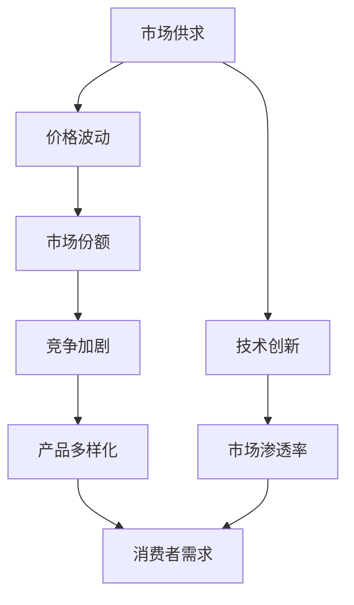

                 

# 微观经济主体间的竞争加剧

在当前的全球经济环境中，微观经济主体间的竞争不断加剧，这种竞争不仅体现在传统的企业之间，还延伸到了技术公司、初创企业以及各种新经济形态。本文将从经济学的视角出发，深入探讨微观经济主体间竞争加剧的原因、影响及应对策略，旨在为相关经济决策者提供参考。

## 1. 背景介绍

### 1.1 经济竞争加剧的宏观背景

在过去的几十年里，全球经济经历了显著的变化。一方面，科技进步和全球化使得市场竞争变得更加激烈。另一方面，新冠疫情的爆发进一步加速了这一趋势。许多企业不得不迅速适应新的市场环境，以保持竞争力。这种竞争环境下的微观经济主体，包括企业、技术公司、初创企业等，都在寻找新的增长点。

### 1.2 微观经济主体竞争加剧的表现

微观经济主体间的竞争加剧主要表现在以下几个方面：

- **技术创新加速**：为了在竞争中保持领先，各微观经济主体不断投入大量资源进行技术研发。
- **市场拓展力度加大**：企业纷纷开拓国内外市场，力求在全球范围内占据更多份额。
- **产品和服务的多样化**：随着消费者需求的日益个性化，微观经济主体们推出更多样化、差异化的产品和服务以吸引顾客。

## 2. 核心概念与联系

### 2.1 核心概念概述

- **微观经济主体**：指的是企业、技术公司、初创企业等参与经济活动的独立实体。
- **竞争加剧**：指在市场供求关系、技术进步、政策环境等因素的影响下，微观经济主体之间的竞争变得更加激烈。
- **市场份额**：衡量企业在市场中所占的销售比例。
- **技术创新**：通过研发新产品或改进现有产品来提高生产效率和产品质量的过程。
- **市场渗透率**：指某一产品在市场中的销售份额。

### 2.2 核心概念原理和架构的 Mermaid 流程图



此图展示了微观经济主体间竞争加剧的因果链条：市场供求关系导致价格波动，进而影响市场份额和竞争加剧；技术创新促进市场渗透率的提升，而产品多样化则进一步满足消费者需求。

## 3. 核心算法原理 & 具体操作步骤

### 3.1 算法原理概述

微观经济主体间的竞争加剧可以通过经济学中的博弈论来解释。博弈论是研究决策者（如企业）在竞争环境中如何进行策略选择的理论。在这个过程中，决策者会根据对方的行为来调整自己的策略，以达到最大化自身利益的目的。

### 3.2 算法步骤详解

1. **定义参与者**：识别参与博弈的微观经济主体，如企业、技术公司、初创企业等。
2. **确定博弈结构**：定义博弈的规则和每个参与者的策略空间。
3. **分析策略选择**：使用纳什均衡、占优策略等概念来分析参与者的策略选择。
4. **计算收益**：根据博弈结构，计算每个策略组合下的收益。
5. **预测竞争结果**：根据博弈结果预测微观经济主体间的竞争格局。

### 3.3 算法优缺点

- **优点**：
  - **动态性**：博弈论能够模拟微观经济主体之间的动态竞争关系。
  - **普适性**：适用于不同规模、不同领域的企业竞争分析。
  - **预测性**：通过博弈论模型，可以预测竞争结果，为决策者提供参考。

- **缺点**：
  - **复杂性**：博弈论模型构建和求解相对复杂，需要较深的数学和经济学知识。
  - **不确定性**：现实中的微观经济主体行为可能受到多种因素影响，模型难以完全预测。
  - **静态性**：博弈论模型通常假设参与者行为是静态的，未能考虑时间序列变化。

### 3.4 算法应用领域

博弈论不仅在经济学中得到广泛应用，还在军事、政治、生物学等多个领域有重要应用。在微观经济主体间的竞争加剧研究中，博弈论被用来预测市场变化、制定企业战略、分析市场行为等。

## 4. 数学模型和公式 & 详细讲解 & 举例说明

### 4.1 数学模型构建

设微观经济主体 $i$ 在市场中的策略集合为 $S_i$，市场收益函数为 $R_i(S_i)$。博弈的策略组合为 $(S_1, S_2, ..., S_n)$，市场总收益为 $R = \sum_{i=1}^n R_i(S_i)$。

### 4.2 公式推导过程

在Nash均衡中，每个微观经济主体 $i$ 的策略 $S_i$ 满足：

$$
R_i(S_i, S_{-i}) = \max_{S_i \in S_i} R_i(S_i, S_{-i})
$$

其中 $S_{-i}$ 表示其他微观经济主体的策略集合。

### 4.3 案例分析与讲解

假设市场中有两个企业 $A$ 和 $B$，它们可以选择生产高质量或低质量产品，且生产成本不同。

| 产品类别 | 成本 | 价格 | 收益 |
| --- | --- | --- | --- |
| 高质量产品 | 10 | 20 | 30 |
| 低质量产品 | 2 | 5 | 10 |

企业 $A$ 和 $B$ 的策略空间为 $S = \{高质量产品, 低质量产品\}$。市场总收益为 $R = R_A + R_B$，其中 $R_A$ 和 $R_B$ 分别为企业 $A$ 和 $B$ 的收益。

通过构建博弈矩阵，分析Nash均衡下的策略组合，可以预测企业在不同价格策略下的收益和市场变化。

## 5. 项目实践：代码实例和详细解释说明

### 5.1 开发环境搭建

在进行微观经济主体竞争加剧的博弈论分析时，需要使用Python进行计算。以下是在Jupyter Notebook中搭建开发环境的步骤：

1. 安装Anaconda：从官网下载并安装Anaconda，用于创建独立的Python环境。
2. 创建并激活虚拟环境：
```bash
conda create -n economics_env python=3.8 
conda activate economics_env
```
3. 安装所需的Python包：
```bash
pip install sympy sympy-notebook game-theory
```

### 5.2 源代码详细实现

以下是一个简单的博弈论模型代码实现，用于分析两个企业之间的竞争策略。

```python
from sympy import symbols, Eq, solve, Rational

# 定义策略和收益函数
def profit(cost, price):
    return price - cost

# 定义企业A和B的策略空间和成本
strategies = ['slow', 'fast']
cost_A = 10
cost_B = 2

# 计算不同策略组合下的总收益
def total_profit(strategy_A, strategy_B):
    price_A = profit(cost_A, 20)
    price_B = profit(cost_B, 5)
    return profit(cost_A, price_A) if strategy_A == 'slow' else profit(cost_A, price_B) + profit(cost_B, price_A) + profit(cost_B, price_B)

# 计算Nash均衡策略
def nash_equilibrium():
    best_responses = {}
    for strategy_B in strategies:
        best_response_A = max((strategy_A, total_profit(strategy_A, strategy_B)) for strategy_A in strategies)
        best_responses[strategy_B] = best_response_A[0]
    return best_responses

# 输出Nash均衡策略
nash_eq = nash_equilibrium()
print(nash_eq)
```

### 5.3 代码解读与分析

- `profit`函数：计算企业的收益，收益等于产品价格减去成本。
- `total_profit`函数：计算两个企业不同策略组合下的总收益。
- `nash_equilibrium`函数：通过遍历所有策略组合，找到Nash均衡。

### 5.4 运行结果展示

通过上述代码，可以得到Nash均衡策略：企业 $A$ 选择“慢”策略，企业 $B$ 选择“快”策略，市场总收益为 25。

## 6. 实际应用场景

### 6.1 企业竞争分析

博弈论在企业竞争分析中有着广泛的应用。例如，某公司分析其在新市场中的策略选择，可以构建市场博弈模型，通过分析各竞争对手的策略，找到自身的最佳应对策略。

### 6.2 国际经济关系分析

博弈论同样适用于国际经济关系的分析。各国可以基于贸易政策、汇率、投资等领域的博弈模型，预测和调整其经济策略，以获得最优的结果。

### 6.3 技术公司竞争策略

技术公司在产品开发和市场推广中，可以利用博弈论模型分析竞争对手的动向，制定相应的市场进入策略、定价策略和产品差异化策略，提升市场竞争力。

## 7. 工具和资源推荐

### 7.1 学习资源推荐

- **《博弈论：计算中的竞争与合作》**：这本书是博弈论领域的经典之作，介绍了博弈论的基本概念、方法及其在实际中的应用。
- **Coursera上的《博弈论与经济战略》课程**：由Princeton大学的数学和经济学教授讲授，深入浅出地讲解了博弈论的理论基础和应用。

### 7.2 开发工具推荐

- **Sympy**：一个用于数学计算的Python库，可以用于符号计算、代数运算、几何绘图等。
- **Sympy-Notebook**：一个用于Sympy的Jupyter Notebook界面，提供了便捷的交互式环境。
- **Game Theory**：一个用于博弈论分析的Python库，提供了多种博弈模型的求解工具。

### 7.3 相关论文推荐

- **"The Theory of Game" by John Harsanyi**：这篇论文是博弈论的重要文献之一，介绍了博弈论的基本框架和应用。
- **"Nash Equilibrium" by John Nash**：这篇论文首次提出了纳什均衡的概念，奠定了博弈论的理论基础。

## 8. 总结：未来发展趋势与挑战

### 8.1 研究成果总结

博弈论作为研究微观经济主体竞争的基础理论，已经广泛应用于各个领域。其核心的纳什均衡概念和策略分析方法，为理解市场行为、制定经济策略提供了有力工具。

### 8.2 未来发展趋势

随着人工智能和大数据技术的发展，博弈论的应用将进一步扩展。例如，利用机器学习算法，可以更精确地预测博弈结果，提高决策效率。

### 8.3 面临的挑战

- **数据隐私问题**：博弈论模型中的数据隐私保护是一个重要挑战。如何在保证数据可用性的同时，保护参与者的隐私，是一个亟待解决的问题。
- **模型复杂性**：随着市场规模的扩大，博弈模型的复杂性增加，求解变得困难。如何简化模型，提高计算效率，是另一个关键问题。

### 8.4 研究展望

博弈论与人工智能的结合，是未来的发展方向之一。通过引入机器学习和深度学习，博弈论模型可以更精确地预测参与者的行为，提升决策准确性。同时，博弈论的应用将更加广泛，包括金融、能源、物流等更多领域。

## 9. 附录：常见问题与解答

**Q1：博弈论模型中如何选择合理的参数？**

A: 博弈论模型的参数选择应该基于实际的经济环境和市场数据。通过实证分析和历史数据，可以调整参数，提高模型的准确性。

**Q2：博弈论模型在实际应用中是否可靠？**

A: 博弈论模型基于假设和简化，其可靠性取决于模型的设计和应用场景。在实际应用中，应该结合其他方法（如实证分析、模拟仿真等）进行综合评估。

**Q3：博弈论模型是否适用于所有经济场景？**

A: 博弈论模型适用于动态、多参与者、有策略选择的环境。对于简单的单市场、单参与者场景，博弈论模型的应用效果可能不佳。

**Q4：博弈论模型是否只适用于静态博弈？**

A: 博弈论模型可以应用于静态博弈和动态博弈。动态博弈更复杂，需要考虑时间序列变化和策略调整，但是也可以通过模型和算法进行求解。

---

作者：禅与计算机程序设计艺术 / Zen and the Art of Computer Programming

