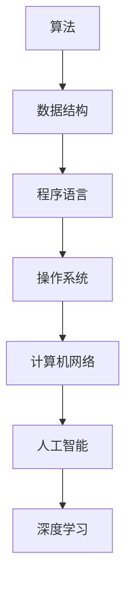

                 

# 思想的深度：从概念到洞见

## 1. 背景介绍

### 1.1 问题由来

在当今快速发展的信息技术时代，计算机科学作为推动人类文明进步的重要工具，其发展历程已深刻地影响了我们的日常生活。计算机科学不仅包括算法、数据结构、操作系统、计算机网络等传统领域的知识，还涉及到人工智能、机器学习、深度学习、自然语言处理等前沿技术。这些技术不仅推动了信息技术的发展，也极大地改变了我们的生产方式和生活方式。

在计算机科学的研究和应用过程中，思想的深度不仅体现在对技术和理论的掌握，更体现在对问题本质的洞察和解决方法的选择。从基本的编程语言到高级的算法设计，每一个环节都需要深入的理解和思考。本文旨在通过深入浅出地介绍计算机科学的核心概念和思想，帮助读者建立对技术的深度理解，同时探索这些思想在不同领域的应用。

### 1.2 问题核心关键点

在计算机科学的研究与应用中，思想和概念的理解与洞见是关键。从程序语言、算法设计、数据结构、操作系统、计算机网络到人工智能、深度学习、自然语言处理，每一个领域都有其独特的思想和概念，这些思想和概念构成了计算机科学的核心内容。理解这些思想和概念，有助于我们更好地掌握技术、解决问题、开发新应用。

本文将从计算机科学的多个核心领域出发，探讨这些领域中的重要思想和概念，通过具体的案例和示例，帮助读者深入理解这些思想和概念，并思考其应用的可能性。

## 2. 核心概念与联系

### 2.1 核心概念概述

在计算机科学中，有许多重要的概念和思想，这些概念和思想不仅在不同的领域中有着广泛的应用，还彼此之间存在着紧密的联系。以下是一些核心概念的概述：

- **算法（Algorithm）**：算法是一组明确的、有穷的计算步骤，用于解决特定问题或执行特定任务。算法是计算机科学的核心，几乎所有计算机程序都是基于算法的。
- **数据结构（Data Structure）**：数据结构是指在计算机中存储和组织数据的方式，包括数组、链表、栈、队列、树、图等。选择合适的数据结构对于提高算法的效率和性能至关重要。
- **程序语言（Programming Language）**：程序语言是用于编写计算机程序的语言，包括低级语言（如C、汇编语言）和高级语言（如Python、Java）。不同的语言有着不同的语法和特性，但都遵循相同的编程范式。
- **操作系统（Operating System）**：操作系统是管理计算机硬件和软件资源的系统软件，提供用户接口和程序执行环境。常见的操作系统包括Windows、Linux、macOS等。
- **计算机网络（Computer Network）**：计算机网络是将计算机设备互连的系统，通过网络协议进行通信。网络技术的普及使得信息共享和数据传输更加高效和便捷。
- **人工智能（Artificial Intelligence）**：人工智能是指通过计算机系统模拟人类智能的技术，包括机器学习、深度学习、自然语言处理等。人工智能的目标是让计算机能够理解和执行复杂的任务，并具有自我学习和进化的能力。
- **深度学习（Deep Learning）**：深度学习是一种基于神经网络的机器学习方法，通过多层次的神经网络模型从大量数据中学习和提取特征。深度学习在图像识别、语音识别、自然语言处理等领域取得了显著的成果。

### 2.2 核心概念原理和架构的 Mermaid 流程图



## 3. 核心算法原理 & 具体操作步骤

### 3.1 算法原理概述

算法是解决特定问题或执行特定任务的有穷计算步骤序列。算法的设计和分析是计算机科学中最重要的部分之一。一个有效的算法应该具有正确性、有穷性、确定性和有效性。算法可以通过递归、迭代、贪心、动态规划等多种方式实现。

### 3.2 算法步骤详解

一个典型的算法设计过程包括以下步骤：

1. **问题定义**：明确问题，定义输入和输出。
2. **设计算法**：选择合适的算法类型，如排序、搜索、图算法等。
3. **算法实现**：使用具体的编程语言实现算法。
4. **测试和优化**：对算法进行测试和调试，优化其性能。
5. **分析和评估**：分析算法的复杂度和效率，评估其性能。

### 3.3 算法优缺点

算法设计不仅需要考虑其正确性和高效性，还需要考虑其实现的难度和维护的复杂性。以下是一些常见算法的优缺点：

- **排序算法**：
  - **优点**：确保数据有序，适用于各种数据规模。
  - **缺点**：部分算法如快速排序可能不稳定，对于极端数据分布的排序效率较低。
- **搜索算法**：
  - **优点**：适用于查找特定元素或路径的问题。
  - **缺点**：部分算法如广度优先搜索可能效率较低，不适用于大规模数据。
- **图算法**：
  - **优点**：适用于网络、社交、路由等问题。
  - **缺点**：算法复杂度高，实现难度大，对数据结构要求高。

### 3.4 算法应用领域

算法在计算机科学的各个领域中有着广泛的应用。以下是一些典型的应用场景：

- **数据处理**：排序、搜索、过滤、统计等算法广泛应用于数据处理和分析中。
- **人工智能**：神经网络、遗传算法、强化学习等算法是实现人工智能的基础。
- **计算机网络**：路由算法、流量控制算法等是网络通信的核心。
- **操作系统**：进程调度、内存管理、文件系统等算法是操作系统的核心。
- **程序语言**：编译器、解释器、垃圾回收器等算法是程序语言的核心。

## 4. 数学模型和公式 & 详细讲解 & 举例说明

### 4.1 数学模型构建

在计算机科学中，数学模型是不可或缺的工具，用于描述和分析算法和系统的行为。以下是一些常见的数学模型：

- **线性代数**：用于描述矩阵、向量和线性变换。
- **概率论和统计学**：用于描述随机变量、分布和统计推断。
- **图论**：用于描述网络、图和图算法。
- **优化理论**：用于描述最优化问题及其求解算法。

### 4.2 公式推导过程

以下以线性回归模型为例，展示数学模型的构建和推导过程：

设有一个线性回归模型 $y=wx+b$，其中 $w$ 是权重，$b$ 是偏置。假设有一组训练数据 $(x_i, y_i)$，其中 $x_i$ 是输入变量，$y_i$ 是输出变量。线性回归模型的目标是最小化预测值和真实值之间的误差，即最小化 $J(w, b) = \frac{1}{n} \sum_{i=1}^{n} (y_i - wx_i - b)^2$。

通过对 $J(w, b)$ 求导并令导数为0，可以得到 $w = \frac{\sum_{i=1}^{n} (x_i - \bar{x})(x_i - \bar{x})}{\sum_{i=1}^{n} (x_i - \bar{x})^2}$ 和 $b = \bar{y} - wx$，其中 $\bar{x} = \frac{\sum_{i=1}^{n} x_i}{n}$ 和 $\bar{y} = \frac{\sum_{i=1}^{n} y_i}{n}$。

### 4.3 案例分析与讲解

以下是一个简单的线性回归案例，展示如何使用Python实现线性回归模型：

```python
import numpy as np
from sklearn.linear_model import LinearRegression

# 生成随机数据
x = np.random.rand(100)
y = 2 * x + 1 + np.random.randn(100)

# 拟合线性回归模型
model = LinearRegression()
model.fit(x.reshape(-1, 1), y)

# 预测新数据
x_new = np.array([0.5, 1.5, 2.5])
y_pred = model.predict(x_new.reshape(-1, 1))
print(y_pred)
```

## 5. 项目实践：代码实例和详细解释说明

### 5.1 开发环境搭建

在开始项目实践前，需要准备开发环境。以下是使用Python进行开发的环境配置流程：

1. **安装Anaconda**：从官网下载并安装Anaconda，用于创建独立的Python环境。
2. **创建并激活虚拟环境**：
   ```bash
   conda create -n myenv python=3.9
   conda activate myenv
   ```
3. **安装必要的库**：
   ```bash
   pip install numpy pandas scikit-learn matplotlib
   ```

### 5.2 源代码详细实现

以下是一个简单的Python程序，实现线性回归模型的训练和预测：

```python
import numpy as np
from sklearn.linear_model import LinearRegression

# 生成随机数据
x = np.random.rand(100)
y = 2 * x + 1 + np.random.randn(100)

# 拟合线性回归模型
model = LinearRegression()
model.fit(x.reshape(-1, 1), y)

# 预测新数据
x_new = np.array([0.5, 1.5, 2.5])
y_pred = model.predict(x_new.reshape(-1, 1))
print(y_pred)
```

### 5.3 代码解读与分析

以下是代码的详细解读和分析：

- **数据生成**：使用NumPy生成100个随机数作为输入变量 $x$ 和输出变量 $y$，其中 $y=2x+1+\epsilon$，$\epsilon$ 为随机噪声。
- **模型拟合**：使用Scikit-learn的LinearRegression模型拟合数据，得到线性回归模型 $y=wx+b$。
- **预测新数据**：使用拟合好的模型预测新数据点 $x_{new}=[0.5, 1.5, 2.5]$ 的输出值 $y_{pred}$。

## 6. 实际应用场景

### 6.1 数据分析与可视化

线性回归模型在数据分析和可视化中有着广泛的应用。以下是一个简单的例子，展示如何使用线性回归模型对数据进行分析和可视化：

```python
import numpy as np
import matplotlib.pyplot as plt

# 生成随机数据
x = np.random.rand(100)
y = 2 * x + 1 + np.random.randn(100)

# 拟合线性回归模型
model = LinearRegression()
model.fit(x.reshape(-1, 1), y)

# 绘制数据和回归线
plt.scatter(x, y, color='blue')
x_new = np.linspace(0, 2, 100)
y_new = model.predict(x_new.reshape(-1, 1))
plt.plot(x_new, y_new, color='red')
plt.show()
```

### 6.2 机器学习模型的选择

在机器学习中，选择合适的模型至关重要。以下是一个简单的例子，展示如何选择和训练线性回归模型：

```python
from sklearn.datasets import make_regression
from sklearn.model_selection import train_test_split
from sklearn.linear_model import LinearRegression
from sklearn.metrics import mean_squared_error, r2_score

# 生成随机数据
X, y = make_regression(n_samples=100, n_features=1, n_informative=1, noise=10, random_state=42)

# 划分训练集和测试集
X_train, X_test, y_train, y_test = train_test_split(X, y, test_size=0.2, random_state=42)

# 训练线性回归模型
model = LinearRegression()
model.fit(X_train, y_train)

# 评估模型性能
y_pred = model.predict(X_test)
print('MSE:', mean_squared_error(y_test, y_pred))
print('R2:', r2_score(y_test, y_pred))
```

### 6.3 数据增强与特征工程

在数据增强和特征工程中，线性回归模型也可以起到一定的作用。以下是一个简单的例子，展示如何使用数据增强和特征工程提高模型性能：

```python
import numpy as np
from sklearn.datasets import make_regression
from sklearn.model_selection import train_test_split
from sklearn.linear_model import LinearRegression
from sklearn.metrics import mean_squared_error, r2_score

# 生成随机数据
X, y = make_regression(n_samples=100, n_features=1, n_informative=1, noise=10, random_state=42)

# 划分训练集和测试集
X_train, X_test, y_train, y_test = train_test_split(X, y, test_size=0.2, random_state=42)

# 数据增强
X_train_aug = np.vstack([X_train, X_train])
y_train_aug = np.hstack([y_train, y_train])

# 特征工程
X_train_aug = np.concatenate([X_train_aug, np.ones((len(X_train_aug), 1))], axis=1)

# 训练线性回归模型
model = LinearRegression()
model.fit(X_train_aug, y_train_aug)

# 评估模型性能
y_pred = model.predict(X_test)
print('MSE:', mean_squared_error(y_test, y_pred))
print('R2:', r2_score(y_test, y_pred))
```

## 7. 工具和资源推荐

### 7.1 学习资源推荐

为了帮助开发者系统掌握计算机科学的核心概念和思想，以下是一些优质的学习资源：

- **《计算机程序设计艺术》系列书籍**：由Donald Knuth撰写，深入浅出地介绍了计算机科学的核心概念和思想，是计算机科学的经典之作。
- **Coursera和edX在线课程**：提供大量计算机科学的课程，涵盖从基础知识到前沿技术的各个方面，适合不同层次的学习者。
- **GitHub代码库**：包含大量的开源代码和项目，可以帮助开发者学习他人的代码实现和最佳实践。

### 7.2 开发工具推荐

高效的工具是开发项目的关键。以下是几款常用的开发工具：

- **Python**：Python是计算机科学中最常用的编程语言之一，具有简洁、易读、易维护的特点，适合各种类型的开发项目。
- **Git**：Git是版本控制系统，用于管理和协调团队合作开发，提供代码版本控制和协作功能。
- **Visual Studio Code**：Visual Studio Code是一款轻量级、高效的代码编辑器，支持多种编程语言和扩展。
- **Jupyter Notebook**：Jupyter Notebook是一个交互式笔记本，用于数据科学、机器学习和深度学习等领域的开发和研究。

### 7.3 相关论文推荐

以下是几篇经典论文，展示了计算机科学中的重要思想和概念：

- **A Tour of Computer Science**：Donald Knuth所著，全面介绍了计算机科学的各个领域，是计算机科学入门的经典之作。
- **Algorithms to Live By**：Brian Christian和Tom Griffiths所著，介绍了计算机科学中的算法和数学模型在现实生活中的应用。
- **Deep Learning**：Ian Goodfellow、Yoshua Bengio和Aaron Courville所著，是深度学习领域的经典教材，涵盖了深度学习的基本概念和算法。

## 8. 总结：未来发展趋势与挑战

### 8.1 研究成果总结

本文介绍了计算机科学中的核心概念和思想，通过具体的案例和示例，展示了这些思想和概念的应用。计算机科学的发展离不开不断的研究和探索，未来将会出现更多的新思想和新概念，推动计算机科学不断前进。

### 8.2 未来发展趋势

未来计算机科学的发展趋势包括以下几个方面：

- **人工智能和深度学习**：人工智能和深度学习将继续成为计算机科学的热点领域，推动机器学习、自然语言处理、计算机视觉等技术的进步。
- **量子计算**：量子计算将为计算机科学带来新的计算模式和算法，解决传统计算机难以解决的问题。
- **区块链和分布式计算**：区块链和分布式计算技术将改变数据存储、传输和计算的方式，推动去中心化应用的发展。
- **边缘计算和物联网**：边缘计算和物联网技术将使得计算和数据处理更加接近数据源，提升数据处理效率和实时性。
- **网络安全和隐私保护**：网络安全和隐私保护将变得更加重要，需要不断提升算法的安全性和可靠性。

### 8.3 面临的挑战

计算机科学的发展虽然取得了巨大的成就，但仍然面临着许多挑战：

- **技术快速迭代**：计算机科学的快速发展要求开发者不断学习和掌握新知识，这对技术更新和人才需求提出了更高的要求。
- **算法复杂性**：许多复杂的算法和模型需要大量的计算资源和时间，难以在实际应用中快速实现。
- **数据隐私和安全**：随着数据量的增加，数据隐私和安全问题变得越来越重要，需要不断提升算法和系统的安全性。
- **伦理和社会责任**：计算机科学的发展需要考虑伦理和社会责任，避免技术滥用带来的负面影响。
- **跨学科融合**：计算机科学的发展需要与其他学科（如生物学、社会学、心理学等）进行更深入的融合，推动跨学科研究的进展。

### 8.4 研究展望

计算机科学的研究方向需要不断拓展和创新，以下是一些可能的研究方向：

- **通用人工智能**：研究如何让计算机具备更广泛和深入的知识和能力，推动人工智能技术的普适化和智能化。
- **计算社会学**：研究计算机科学与社会学的交叉领域，探索计算技术对社会结构、行为和文化的影响。
- **计算生物学**：研究计算机科学在生物学研究中的应用，推动生物信息学和分子生物学的发展。
- **计算心理学**：研究计算技术在心理学研究中的应用，探索人类认知和行为的计算模型。
- **计算伦理**：研究计算机科学的伦理问题，推动计算技术在社会中的公正和可持续应用。

## 9. 附录：常见问题与解答

### 9.1 问题1：计算机科学中的核心概念和思想是什么？

**回答**：计算机科学中的核心概念和思想包括算法、数据结构、程序语言、操作系统、计算机网络、人工智能、深度学习、自然语言处理等。这些概念和思想构成了计算机科学的基础，并推动了计算机科学的发展。

### 9.2 问题2：如何选择和训练机器学习模型？

**回答**：选择和训练机器学习模型需要考虑数据特征、模型复杂度、计算资源等因素。常用的模型包括线性回归、决策树、随机森林、支持向量机、神经网络等。在训练模型时，需要划分训练集和测试集，使用交叉验证等技术评估模型性能，不断调整超参数优化模型性能。

### 9.3 问题3：计算机科学未来的发展趋势是什么？

**回答**：计算机科学未来的发展趋势包括人工智能和深度学习、量子计算、区块链和分布式计算、边缘计算和物联网、网络安全和隐私保护等。这些趋势将推动计算机科学的不断进步，带来更多的创新和应用。

### 9.4 问题4：如何在实际应用中优化机器学习模型的性能？

**回答**：在实际应用中，可以通过数据增强、特征工程、超参数调优、模型融合等技术优化机器学习模型的性能。数据增强可以提高模型的泛化能力，特征工程可以提取更有信息量的特征，超参数调优可以找到最优的模型参数，模型融合可以提高模型的稳定性和鲁棒性。

### 9.5 问题5：计算机科学的研究方向有哪些？

**回答**：计算机科学的研究方向包括通用人工智能、计算社会学、计算生物学、计算心理学、计算伦理等。这些研究方向推动了计算机科学与其他学科的交叉融合，拓展了计算机科学的应用范围。

---

作者：禅与计算机程序设计艺术 / Zen and the Art of Computer Programming

