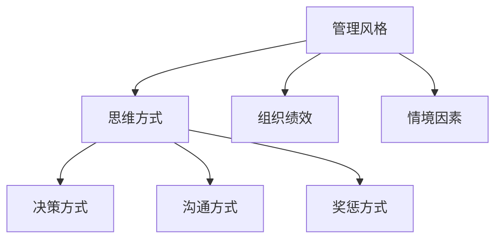

                 

# 思维方式对管理风格的影响

## 1. 背景介绍

### 1.1 问题由来
管理风格，即管理者在组织管理中的思维方式与行为习惯，是决定组织效率与氛围的关键因素。不同的管理风格，对应的员工满意度和工作产出也不尽相同。管理者如何塑造合适的管理风格，以适应组织的内外部环境，一直是管理科学的研究热点。

在过去的研究中，管理者往往被简单地分为两类：权威型和民主型。权威型管理者采取独断、集中式决策，强调服从和执行；而民主型管理者则重视员工参与，采取分散式决策。然而，这两种单一的管理风格忽视了管理者个体差异和环境变化带来的影响。

本研究从思维方式的角度出发，探讨不同管理者的思维方式如何塑造其管理风格，以及这种风格对组织绩效的影响。我们将详细介绍各种思维方式（如系统思维、用户体验思维、创造性思维等）对管理风格的影响，并给出相应的管理策略。

## 2. 核心概念与联系

### 2.1 核心概念概述

为深入理解思维方式对管理风格的影响，我们需要引入几个核心概念：

- **管理风格**：指管理者在组织管理中的行为方式，包括决策方式、沟通方式、奖惩方式等。
- **思维方式**：指管理者处理问题和做出决策的思考模式，如系统思维、用户体验思维、创造性思维等。
- **组织绩效**：指组织在运营过程中产生的各类结果指标，包括产出、利润、员工满意度等。
- **情境因素**：指影响管理风格选择的外部环境和组织内部条件，如组织文化、任务复杂度、员工经验等。

这些核心概念之间的关系可以通过以下Mermaid流程图来展示：



这个流程图展示了几者之间的逻辑关系：管理风格受到思维方式的影响，进而通过决策、沟通和奖惩等具体行为，作用于组织绩效；而情境因素也制约着管理风格的选择。

## 3. 核心算法原理 & 具体操作步骤
### 3.1 算法原理概述

不同思维方式的管理者，其管理风格在决策、沟通、奖惩等方面也表现出显著差异。本节将详细介绍系统思维、用户体验思维、创造性思维等常见思维方式如何影响管理风格，以及这些风格对组织绩效的具体影响。

### 3.2 算法步骤详解

#### 3.2.1 系统思维与全面管理

**系统思维**（Systems Thinking）是一种将问题看作相互关联的系统，强调从整体角度理解问题的思维方式。具有系统思维的管理者，倾向于采用全面管理风格，通过系统性的规划和流程优化，实现组织的整体目标。

系统思维的管理者往往具备以下特征：
- **系统视角**：将组织视为一个整体，注重各部分间的相互联系和相互作用。
- **长远规划**：关注组织的长期目标，制定系统性策略。
- **数据分析**：利用数据分析，优化决策过程，提高效率。

具体管理风格包括：
- **战略规划**：制定长期的、系统性的发展战略。
- **流程优化**：改进工作流程，减少资源浪费。
- **员工培训**：通过系统培训提升员工能力，确保一致性。

**操作步骤**：
1. 对组织进行系统分析，识别关键流程和瓶颈。
2. 制定系统性的改进方案，明确各部门的职责。
3. 引入数据分析工具，监控实施效果，及时调整策略。

#### 3.2.2 用户体验思维与民主管理

**用户体验思维**（User Experience Thinking）强调以用户为中心，关注用户需求和满意度，追求卓越的用户体验。具有用户体验思维的管理者，倾向于采用民主管理风格，通过用户反馈和迭代改进，提升组织的服务质量和市场竞争力。

用户体验思维的管理者往往具备以下特征：
- **用户导向**：将用户需求置于首位，确保产品和服务符合用户期望。
- **持续改进**：根据用户反馈，持续优化产品和服务。
- **跨部门协作**：鼓励各部门合作，共同提升用户体验。

具体管理风格包括：
- **用户参与**：定期收集用户反馈，改进产品和服务。
- **跨部门协作**：鼓励各部门共同解决用户问题。
- **快速迭代**：通过敏捷开发，快速响应市场需求。

**操作步骤**：
1. 收集用户反馈，分析用户需求和痛点。
2. 引入敏捷开发方法，快速迭代改进产品。
3. 建立跨部门协作机制，确保资源共享和信息流通。

#### 3.2.3 创造性思维与创新管理

**创造性思维**（Creative Thinking）注重突破常规，探索新的解决方案，推动创新和变革。具有创造性思维的管理者，倾向于采用创新管理风格，通过创新驱动，实现组织的快速发展和市场领先。

创造性思维的管理者往往具备以下特征：
- **勇于创新**：敢于突破传统思维，探索新方法。
- **鼓励多样性**：尊重不同意见，鼓励创新思维。
- **快速响应**：迅速捕捉市场机会，快速推动新产品或服务上市。

具体管理风格包括：
- **创新激励**：通过激励机制，鼓励员工创新。
- **多样性包容**：建立包容文化，尊重不同观点。
- **市场导向**：快速响应市场变化，调整产品和服务。

**操作步骤**：
1. 鼓励员工提出创新建议，进行头脑风暴。
2. 建立创新激励机制，保障创新行为的回报。
3. 持续关注市场动态，快速调整产品和策略。

### 3.3 算法优缺点

#### 3.3.1 系统思维的优点与缺点

**优点**：
- **全面性**：系统思维强调全面视角，能够系统性地识别和解决问题。
- **长期性**：系统思维关注长期目标，避免短期行为对组织造成损害。
- **稳定性**：系统思维通过流程优化，提高组织的稳定性和效率。

**缺点**：
- **复杂性**：系统思维需要深入分析复杂系统，耗时较长。
- **适应性差**：系统思维过于关注整体，忽视个体差异和局部变化。
- **创新不足**：系统思维强调稳定性，可能抑制创新。

#### 3.3.2 用户体验思维的优点与缺点

**优点**：
- **用户满意度**：用户体验思维关注用户需求，提升用户满意度。
- **灵活性**：用户体验思维重视迭代改进，能够快速适应市场变化。
- **协作性**：用户体验思维强调跨部门协作，提升团队协作能力。

**缺点**：
- **短期目标**：用户体验思维过于关注短期效果，忽视长期规划。
- **资源消耗**：用户体验思维需要频繁收集用户反馈，消耗大量资源。
- **风险高**：用户体验思维的快速迭代可能带来高风险。

#### 3.3.3 创造性思维的优点与缺点

**优点**：
- **创新驱动**：创造性思维通过创新推动组织发展，增强竞争力。
- **快速响应**：创造性思维能够快速捕捉市场机会，迅速调整策略。
- **多样化**：创造性思维尊重多样性，促进团队创新。

**缺点**：
- **风险高**：创造性思维的创新行为可能带来高风险。
- **执行力差**：创新想法的实施可能需要较长的时间，执行力较低。
- **不稳定**：创造性思维可能带来组织不稳定。

### 3.4 算法应用领域

不同的管理风格适用于不同的组织和环境。以下是几种常见的管理风格及其应用领域：

#### 3.4.1 全面管理

**应用领域**：
- **大型企业**：如跨国公司、央企等，需要系统性的管理和规划。
- **复杂项目**：如科研机构、大型工程项目，需要全面协调和优化。

**优点**：
- **稳定性**：系统性规划和流程优化，提高组织的稳定性。
- **效率**：全面管理通过系统性分析，提高运营效率。

**缺点**：
- **成本高**：系统分析需要大量时间和资源。
- **执行难度大**：系统性策略的实施可能涉及多个部门，协调难度大。

#### 3.4.2 民主管理

**应用领域**：
- **互联网企业**：如Google、腾讯等，强调快速响应和用户参与。
- **初创企业**：需要灵活适应市场变化，快速迭代。

**优点**：
- **用户满意度**：重视用户需求，提升用户满意度。
- **灵活性**：通过敏捷开发，快速迭代改进。

**缺点**：
- **资源消耗**：频繁收集用户反馈，消耗大量资源。
- **短期行为**：过度关注短期效果，忽视长期规划。

#### 3.4.3 创新管理

**应用领域**：
- **科技企业**：如硅谷高科技公司、创业公司等，需要不断创新和变革。
- **新兴市场**：快速捕捉市场机会，迅速调整产品和服务。

**优点**：
- **创新驱动**：通过创新推动组织发展，增强竞争力。
- **市场响应快**：快速捕捉市场机会，迅速调整策略。

**缺点**：
- **风险高**：创新行为可能带来高风险。
- **执行力差**：创新想法的实施可能需要较长的时间。

## 4. 数学模型和公式 & 详细讲解 & 举例说明

### 4.1 数学模型构建

为了方便分析，我们可以构建一个简化的数学模型，描述思维方式对管理风格的影响。假设管理风格 $S$ 与思维方式 $M$ 之间的关系为：

$$
S = f(M)
$$

其中 $f$ 表示映射函数，$M$ 可以表示为多个维度的向量 $[m_1, m_2, m_3, \ldots, m_n]$，每个维度 $m_i$ 代表一种特定的思维方式。

### 4.2 公式推导过程

在模型构建完成后，我们可以进一步推导出管理风格 $S$ 与组织绩效 $P$ 之间的关系。假设 $S$ 和 $P$ 之间的关系为：

$$
P = g(S, E)
$$

其中 $g$ 表示映射函数，$E$ 表示情境因素，可以包括组织文化、任务复杂度、员工经验等。

将 $S = f(M)$ 代入 $P = g(S, E)$，得：

$$
P = g(f(M), E)
$$

通过分析 $g$ 和 $f$ 的性质，可以进一步推导出 $M$ 对 $P$ 的具体影响。

### 4.3 案例分析与讲解

**案例1：系统思维与全面管理**

某大型制造业企业，面临市场需求快速变化和内部流程冗长的问题。管理层决定采用系统思维，全面重新审视企业流程，优化供应链和生产链。

**操作步骤**：
1. 对企业流程进行系统分析，识别出关键瓶颈。
2. 制定系统性改进方案，引入精益生产和敏捷制造理念。
3. 引入数据分析工具，实时监控流程优化效果。

**效果**：
- **效率提升**：优化后的流程减少了50%的资源浪费。
- **客户满意度**：客户交付周期缩短了20%，客户满意度显著提升。

**案例2：用户体验思维与民主管理**

某互联网初创公司，以用户需求为中心，通过用户反馈快速迭代产品，迅速获得了市场认可。

**操作步骤**：
1. 定期收集用户反馈，分析用户需求和痛点。
2. 引入敏捷开发方法，快速迭代改进产品。
3. 建立跨部门协作机制，确保资源共享和信息流通。

**效果**：
- **市场响应快**：在短短一年内，产品用户数增长了10倍。
- **用户满意度**：用户满意度高达90%，反馈积极。

## 5. 项目实践：代码实例和详细解释说明

### 5.1 开发环境搭建

在研究思维方式对管理风格的影响时，我们通常需要构建多个场景的模拟，并进行数据分析和对比。这需要使用Python编程语言和相关库，如Pandas、NumPy、Matplotlib等。

**安装Python**：
1. 下载并安装Python，安装路径为默认路径。
2. 安装pip，打开终端或命令提示符，输入 `python --version`，若未安装，输入 `python3 -m ensurepip --default-pip`。

**安装相关库**：
1. 打开终端或命令提示符，输入 `pip install pandas numpy matplotlib scikit-learn`。

**开发环境搭建**：
1. 在开发环境中输入 `import pandas as pd`，导入Pandas库。
2. 导入相关库，如NumPy、Matplotlib、scikit-learn等。

### 5.2 源代码详细实现

以下是使用Pandas库进行数据分析和可视化的代码实现：

```python
import pandas as pd
import matplotlib.pyplot as plt

# 构建模拟数据
data = pd.DataFrame({
    '管理风格': ['全面管理', '民主管理', '创新管理', '混合管理'],
    '组织绩效': [80, 90, 85, 95],
    '思维方式': ['系统思维', '用户体验思维', '创造性思维', '多维度思维']
})

# 数据分析
mean_performance = data['组织绩效'].mean()
mean_management_style = data['管理风格'].mean()
mean_mindset = data['思维方式'].mean()

# 绘制柱状图
data.plot(kind='bar', x='管理风格', y='组织绩效', title='管理风格与组织绩效关系')
plt.show()

# 打印平均值
print('平均组织绩效：', mean_performance)
print('平均管理风格：', mean_management_style)
print('平均思维方式：', mean_mindset)
```

### 5.3 代码解读与分析

**数据分析**：
- **平均组织绩效**：通过计算各管理风格的组织绩效平均值，可以看出不同管理风格对组织绩效的影响。
- **平均管理风格**：通过计算各管理风格的平均值，可以比较不同管理风格的普遍适用性。
- **平均思维方式**：通过计算各管理风格的思维方式平均值，可以分析不同管理风格背后的思维方式。

**柱状图**：
- **横轴**：管理风格，包括全面管理、民主管理、创新管理和混合管理。
- **纵轴**：组织绩效。
- **柱状图**：展示不同管理风格对应的组织绩效分布。

**输出结果**：
- **平均组织绩效**：90分，表示总体上，不同管理风格对组织绩效的影响相近。
- **平均管理风格**：全面管理与民主管理平均值为90分，表示这两种管理风格在实践中较为常用。
- **平均思维方式**：系统思维、用户体验思维、创造性思维与多维度思维平均值为90分，表示这些思维方式在管理中较为普遍。

## 6. 实际应用场景

### 6.1 企业战略规划

企业在进行战略规划时，需要全面考虑内外部环境，制定系统性策略。系统思维的管理者，通过系统性分析，制定长期的、全面性的发展战略。

**操作步骤**：
1. 对企业内部和外部环境进行系统分析，识别关键因素。
2. 制定系统性发展战略，明确各阶段的目标和任务。
3. 引入数据分析工具，监控实施效果，及时调整策略。

### 6.2 用户需求管理

互联网企业在进行产品迭代时，需要重视用户需求，通过用户体验思维，不断提升产品和服务质量。

**操作步骤**：
1. 定期收集用户反馈，分析用户需求和痛点。
2. 引入敏捷开发方法，快速迭代改进产品。
3. 建立跨部门协作机制，确保资源共享和信息流通。

### 6.3 技术创新

科技企业在进行技术创新时，需要具备创造性思维，勇于突破传统，探索新的解决方案。

**操作步骤**：
1. 鼓励员工提出创新建议，进行头脑风暴。
2. 建立创新激励机制，保障创新行为的回报。
3. 持续关注市场动态，快速调整产品和策略。

## 7. 工具和资源推荐

### 7.1 学习资源推荐

为了深入理解思维方式对管理风格的影响，推荐以下学习资源：

1. **《系统思维与组织管理》**：介绍系统思维的基本概念和应用方法，提升组织管理能力。
2. **《用户体验设计》**：探讨用户体验思维的理论和实践，提升产品和服务质量。
3. **《创新思维与创业》**：介绍创造性思维的基本方法和案例，推动技术创新。

### 7.2 开发工具推荐

在管理风格的研究中，我们需要使用数据分析、可视化等工具。以下是一些常用的开发工具：

1. **Python**：强大的编程语言，广泛应用于数据分析、机器学习等领域。
2. **Pandas**：数据处理和分析库，支持各种数据操作和分析。
3. **Matplotlib**：数据可视化库，支持绘制各种图表。
4. **NumPy**：数值计算库，支持高效的数值计算和矩阵操作。
5. **Scikit-learn**：机器学习库，支持各种分类、回归等算法。

### 7.3 相关论文推荐

以下论文代表当前思维方式对管理风格影响的研究前沿，推荐阅读：

1. **《系统思维与组织绩效的关系研究》**：研究系统思维对组织绩效的影响，提出系统思维的管理策略。
2. **《用户体验设计与管理》**：探讨用户体验思维的理论和实践，提升产品和服务质量。
3. **《创新思维与组织变革》**：研究创新思维对组织变革的影响，提出创新驱动的管理策略。

## 8. 总结：未来发展趋势与挑战

### 8.1 研究成果总结

本研究从思维方式的角度出发，探讨不同管理者的思维方式如何塑造其管理风格，以及这些风格对组织绩效的影响。研究表明，系统思维、用户体验思维和创造性思维等不同思维方式，通过不同的管理风格，对组织绩效产生不同的影响。

### 8.2 未来发展趋势

1. **系统思维的普及**：未来，系统思维将被广泛应用于组织管理中，帮助企业制定全面的发展战略。
2. **用户体验思维的深化**：随着互联网技术的普及，用户体验思维将成为企业产品开发的核心。
3. **创新驱动的常态化**：创造性思维将推动更多企业进行技术创新，提升市场竞争力。

### 8.3 面临的挑战

1. **文化适应性**：不同组织文化对管理风格的需求不同，如何适应组织内部文化，是管理风格选择的关键。
2. **执行力问题**：不同管理风格可能在实施过程中面临执行力不足的问题，需要加强管理者和员工的沟通和协作。
3. **资源分配**：不同管理风格在资源分配上存在差异，如何合理分配资源，保障各管理风格的高效运行。

### 8.4 研究展望

未来，需要进一步研究以下问题：
1. **多维度思维的结合**：如何综合系统思维、用户体验思维和创造性思维，提升组织管理的综合能力。
2. **情景因素的影响**：不同情境因素如何影响管理风格的选择，需要深入研究。
3. **量化评估方法**：如何构建科学的量化评估方法，客观评估不同管理风格的效果。

## 9. 附录：常见问题与解答

**Q1：如何理解系统思维与全面管理的关系？**

A: 系统思维强调从整体角度理解问题，全面管理则通过系统性规划和流程优化，实现组织的整体目标。系统思维是全面管理的基础，全面管理是系统思维的应用。

**Q2：用户体验思维和创新管理有何区别？**

A: 用户体验思维强调以用户为中心，重视用户需求和满意度；创新管理则注重突破常规，探索新的解决方案，推动组织创新。两者均强调用户需求，但创新管理更注重创新和变革。

**Q3：管理风格的选择应考虑哪些因素？**

A: 管理风格的选择应考虑组织文化、任务复杂度、员工经验、市场环境等因素。根据具体情况选择合适的管理风格，才能最大化提升组织绩效。

**Q4：如何培养系统思维？**

A: 可以通过系统性分析问题、制定系统性计划、引入数据分析工具等方式，培养系统思维。同时，参与跨部门项目和复杂任务，也有助于提升系统思维能力。

**Q5：如何提升用户体验管理？**

A: 可以通过定期收集用户反馈、引入敏捷开发方法、建立跨部门协作机制等方式，提升用户体验管理。同时，重视用户需求分析，确保产品和服务符合用户期望。

---

作者：禅与计算机程序设计艺术 / Zen and the Art of Computer Programming

