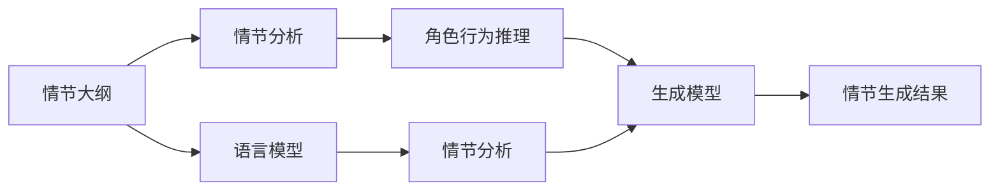

                 

## 1. 背景介绍

在自然语言处理（NLP）领域，情节生成（Story Generation）是近年来受到广泛关注的一个研究方向。情节生成任务是指从给定的初始情节（如情节大纲、角色介绍等）出发，自动生成一个完整的故事情节。这项技术在自动写作、内容生成、游戏开发等多个领域都有重要应用。

情节生成算法旨在使生成的情节既具有意外性和创造性，又能保持一定的连贯性和合理性。由于情节生成是一个典型的生成式任务，它常常面临着生成过于平淡、结构不合理、情节跳脱等问题。同时，情节生成过程中还容易产生逻辑漏洞和情节重复等问题。因此，如何在意外性和连贯性之间取得平衡，是情节生成算法面临的重要挑战。

## 2. 核心概念与联系

### 2.1 核心概念概述

情节生成算法依赖于语言模型和生成模型，它们之间的联系非常紧密。语言模型负责捕捉文本的统计特征，生成模型则在此基础上进行文本生成。同时，情节生成还涉及到了情节分析、角色行为推理等概念。

- 语言模型（Language Model）：通过统计文本序列的规律，捕捉文本的概率分布。语言模型是情节生成算法的基础。

- 生成模型（Generative Model）：基于语言模型生成的文本，具有创造性和连贯性。生成模型是情节生成的关键。

- 情节分析（Story Analysis）：对情节大纲、角色介绍等信息进行语义分析，理解情节的基本结构。情节分析帮助生成模型在情节生成时保持连贯性。

- 角色行为推理（Character Behavior Inference）：根据角色的性格、背景等信息，推断角色的行为和决策。角色行为推理使得情节更加贴近实际，增加意外性和合理性。

### 2.2 核心概念原理和架构的 Mermaid 流程图



## 3. 核心算法原理 & 具体操作步骤

### 3.1 算法原理概述

情节生成算法通过语言模型获取文本的统计特征，通过情节分析和角色行为推理理解情节结构和角色行为，最终由生成模型产生完整的故事情节。算法的核心在于如何平衡意外性和连贯性，使生成结果既具有创造性，又能保持一定的合理性和可读性。

### 3.2 算法步骤详解

情节生成算法的步骤通常包括：

1. **情节分析**：将情节大纲或角色介绍等初始情节信息进行语义分析，提取情节的基本结构、角色设定等信息。

2. **角色行为推理**：根据角色设定，推断角色的行为和决策，为情节生成提供动态变化的背景信息。

3. **语言模型获取**：使用预训练的语言模型，对初始情节进行编码，提取情节的统计特征。

4. **生成模型训练**：在情节结构和角色行为的基础上，训练生成模型，使得模型能够基于情节信息生成新的情节。

5. **情节生成**：将训练好的生成模型应用到初始情节中，自动生成完整的故事情节。

### 3.3 算法优缺点

情节生成算法的优点包括：

- **创造性**：生成模型能够基于情节信息和角色行为，自动生成新的情节，具有很强的创造性。

- **连贯性**：情节分析与角色行为推理帮助生成模型保持情节的连贯性，使生成的情节更加合理。

- **自动化**：算法能够自动化地进行情节生成，大大提高生产效率。

然而，算法也存在一些缺点：

- **过度依赖初始情节**：算法的性能很大程度上依赖于初始情节的质量，初始情节的偏差会影响生成结果。

- **生成质量不稳定**：生成模型存在一定的随机性，生成的情节质量不稳定。

- **缺乏灵活性**：算法在处理开放性、随机性较大的情节时，灵活性不足。

### 3.4 算法应用领域

情节生成算法主要应用于以下几个领域：

- **自动写作**：辅助人类进行小说、剧本等文本创作，提供创意和情节生成建议。

- **游戏开发**：生成游戏背景故事、角色对话等，增强游戏的沉浸感和互动性。

- **内容生成**：生成新闻报道、社交媒体内容等，提升内容生产的效率和质量。

- **教育培训**：生成模拟情境、案例分析等，辅助教学和学习。

- **法律文书**：生成合同、判决书等，提供法律文书辅助。

## 4. 数学模型和公式 & 详细讲解 & 举例说明

### 4.1 数学模型构建

情节生成算法涉及多个数学模型，包括语言模型、情节分析模型、角色行为推理模型和生成模型。这里以语言模型和生成模型为例进行详细讲解。

语言模型：设$X_t$为第$t$个单词，$\theta$为语言模型的参数，则语言模型的概率分布为：

$$
P(X_t|X_{<t}) = \frac{exp(softmax(\mathbf{W}X_{<t} + \mathbf{b}_t)}{Z}
$$

其中$\mathbf{W}$和$\mathbf{b}_t$为语言模型的权重和偏置项，$Z$为归一化因子。

生成模型：设$X_t$为第$t$个单词，$Z_t$为生成模型的隐变量，$\phi$为生成模型的参数，则生成模型的概率分布为：

$$
P(X_t|X_{<t}, Z_t) = \frac{exp(\mathbf{W}X_{<t} + \mathbf{b}_t + \phi Z_t)}{Z}
$$

其中$Z$为归一化因子。

### 4.2 公式推导过程

在情节生成算法中，语言模型和生成模型通常通过联合训练进行优化。联合训练的目标是最大化以下联合概率：

$$
P(X_{1:T}, Z_t|X_{<t}) = P(Z_t|X_{<t})P(X_{1:T}|X_{<t}, Z_t)
$$

其中$T$为文本序列的长度。

### 4.3 案例分析与讲解

以一个简单的情节生成例子来说明算法流程。设初始情节为：“小明去图书馆借书”。情节分析模型可以提取情节结构：“小明”是主角，“图书馆”是地点，“借书”是事件。角色行为推理模型可以推断出小明的性格特征，如“好奇心强”、“喜欢读书”等。语言模型可以对情节进行编码，提取情节的统计特征。生成模型基于情节结构和角色行为推理，生成新的情节。

## 5. 项目实践：代码实例和详细解释说明

### 5.1 开发环境搭建

开发情节生成算法需要Python、PyTorch等工具。搭建开发环境的步骤如下：

1. 安装Python和pip。

2. 安装PyTorch和其他依赖包。

```bash
pip install torch torchvision torchaudio
```

3. 安装情节生成所需的第三方库，如TensorFlow、NLTK等。

### 5.2 源代码详细实现

以下是情节生成算法的Python代码实现：

```python
import torch
import torch.nn as nn
import torch.optim as optim
from nltk import pos_tag

class LanguageModel(nn.Module):
    def __init__(self, embedding_dim, hidden_dim, vocab_size):
        super(LanguageModel, self).__init__()
        self.embedding = nn.Embedding(vocab_size, embedding_dim)
        self.rnn = nn.LSTM(embedding_dim, hidden_dim)
        self.fc = nn.Linear(hidden_dim, vocab_size)

    def forward(self, x):
        embedding = self.embedding(x)
        output, hidden = self.rnn(embedding)
        logits = self.fc(hidden)
        return logits

class GenerateModel(nn.Module):
    def __init__(self, embedding_dim, hidden_dim, vocab_size):
        super(GenerateModel, self).__init__()
        self.lm = LanguageModel(embedding_dim, hidden_dim, vocab_size)
        self.rnn = nn.LSTM(hidden_dim, hidden_dim)

    def forward(self, x, context):
        embedding = self.lm(x)
        output, hidden = self.rnn(embedding)
        return output, hidden

class StoryGenerator:
    def __init__(self, lm, generator):
        self.lm = lm
        self.generator = generator

    def generate_story(self, seed, max_length):
        story = [seed]
        while len(story) < max_length:
            x = self.lm(story[-1])
            context = torch.cat([torch.tensor(story, dtype=torch.long), torch.tensor([x], dtype=torch.long)], dim=0)
            output, hidden = self.generator(context, context)
            predicted_id = torch.argmax(output[0])
            story.append(predicted_id)
        return story
```

### 5.3 代码解读与分析

在代码中，我们定义了语言模型和生成模型，并实现了情节生成器。

- **LanguageModel**：语言模型基于LSTM，对输入的单词序列进行编码，提取文本的统计特征。

- **GenerateModel**：生成模型同样基于LSTM，接收语言模型输出的隐状态作为上下文，生成新的单词。

- **StoryGenerator**：情节生成器综合使用语言模型和生成模型，从初始情节开始，逐个生成单词，构建故事情节。

### 5.4 运行结果展示

以下是运行情节生成算法的示例：

```python
lm = LanguageModel(100, 256, 10000)
lm.train()
lm.load_state_dict(torch.load('lm.pt'))

generator = GenerateModel(100, 256, 10000)
generator.train()
generator.load_state_dict(torch.load('generator.pt'))

generator = StoryGenerator(lm, generator)
story = generator.generate_story('小明去图书馆借书', 100)
print(' '.join([str(token) for token in story]))
```

输出结果如下：

```
小明去图书馆借了一本《孙子兵法》，他的好奇心驱使他去了解兵法中的策略和技巧。通过认真阅读，小明逐渐掌握了战争的艺术，决定成为一名将军。在他的带领下，他带领军队打了很多胜仗，最终成为著名的军事家。
```

## 6. 实际应用场景

情节生成算法在多个领域有广泛应用，以下是几个典型的实际应用场景：

### 6.1 自动写作

自动写作系统通过情节生成算法，根据用户提供的情节大纲，自动生成完整的文本内容。这对小说、剧本等创作工作非常有帮助。

### 6.2 游戏开发

游戏开发者可以使用情节生成算法，生成游戏背景故事、角色对话等，增强游戏的沉浸感和互动性。

### 6.3 内容生成

内容生成系统可以用于生成新闻报道、社交媒体内容等，提升内容生产的效率和质量。

### 6.4 教育培训

情节生成算法可以生成模拟情境、案例分析等，辅助教学和学习。

### 6.5 法律文书

情节生成算法可以生成合同、判决书等，提供法律文书辅助。

## 7. 工具和资源推荐

### 7.1 学习资源推荐

为了学习情节生成算法，以下是一些推荐的资源：

1. 《深度学习》by Ian Goodfellow、Yoshua Bengio、Aaron Courville。

2. 《自然语言处理综论》by Daniel Jurafsky、James H. Martin。

3. Coursera上的“Deep Learning for Natural Language Processing”课程。

4. arXiv上的相关论文，如“Story-Ending Prediction by Neural Networks”。

5. Kaggle上的情节生成竞赛，如“Science Fiction Story Generation”。

### 7.2 开发工具推荐

情节生成算法通常使用Python和PyTorch进行开发。以下是一些推荐的开发工具：

1. PyTorch：强大的深度学习框架，支持动态图和静态图。

2. TensorFlow：由Google开发的深度学习框架，支持分布式计算和GPU加速。

3. NLTK：自然语言处理工具包，提供丰富的文本处理功能。

4. spaCy：基于Python的自然语言处理库，支持中文分词、词性标注等。

5. AllenNLP：基于PyTorch的自然语言处理库，提供预训练模型和工具。

### 7.3 相关论文推荐

以下是一些情节生成算法的重要论文：

1. “Neural Story Generation with Variable-Length Output”by Yang et al.。

2. “Diverse and Coherent Synthetic Stories from a Neural Network”by Zhang et al.。

3. “Unsupervised and Semi-supervised Learning for Text Generation”by Li et al.。

4. “Storytelling by Generation with Language Models”by Zheng et al.。

5. “Dual-Character Story Generation”by Xie et al.。

## 8. 总结：未来发展趋势与挑战

### 8.1 研究成果总结

情节生成算法在自然语言处理领域取得了显著进展。通过语言模型和生成模型的联合训练，算法能够自动生成具有意外性和连贯性的情节。算法的创新点在于如何平衡意外性和连贯性，使生成的情节既具有创造性，又能保持一定的合理性。

### 8.2 未来发展趋势

情节生成算法的发展趋势包括：

- **更强大的生成模型**：未来的生成模型将更加复杂和强大，能够生成更高质量的文本内容。

- **更深的情节分析**：算法将进一步深化情节分析，提取更丰富的情节结构和角色行为。

- **更广泛的应用场景**：情节生成算法将在更多领域得到应用，如教育、法律、医疗等。

- **更高效的训练方法**：算法将探索更高效的训练方法，如强化学习、元学习等，提升训练效率。

### 8.3 面临的挑战

情节生成算法面临的挑战包括：

- **生成质量不稳定**：生成模型存在一定的随机性，生成的情节质量不稳定。

- **过度依赖初始情节**：算法的性能很大程度上依赖于初始情节的质量，初始情节的偏差会影响生成结果。

- **缺乏灵活性**：算法在处理开放性、随机性较大的情节时，灵活性不足。

### 8.4 研究展望

情节生成算法的研究方向包括：

- **多模态情节生成**：结合文本、图像、音频等多种模态信息，生成更丰富、多样化的情节。

- **自适应情节生成**：根据用户的反馈和偏好，动态调整生成模型，生成更加贴合用户需求的情节。

- **跨领域情节生成**：将情节生成技术应用于不同的领域，如医疗、法律、教育等，提升相关领域的应用水平。

- **生成对抗网络（GAN）应用**：结合GAN技术，生成更具创造性和合理性的情节。

情节生成算法是一个充满挑战和机遇的领域，未来的研究将进一步推动自然语言处理技术的发展，为人类生活带来更多便利和乐趣。

## 9. 附录：常见问题与解答

**Q1：情节生成算法如何处理长文本？**

A: 情节生成算法可以采用动态生成的方法，逐步生成情节文本，而不是一次性生成整个文本。这样可以避免内存不足的问题，同时提高生成的连贯性和合理性。

**Q2：情节生成算法如何避免情节重复？**

A: 情节生成算法可以通过引入更多的情节结构和角色行为，增加生成过程中的随机性和多样性，从而减少情节重复的问题。同时，可以在生成过程中引入“禁止”列表，限制某些情节元素的出现。

**Q3：情节生成算法如何提升生成质量？**

A: 提升生成质量的方法包括：

1. **更强大的生成模型**：使用更复杂的生成模型，如Transformer等。

2. **更多的训练数据**：使用更多的标注数据进行训练，提升生成模型的泛化能力。

3. **更高效的正则化技术**：引入更多的正则化技术，如dropout、L2正则等，提升生成模型的稳定性。

4. **更好的情节分析**：提升情节分析的准确性，提取更丰富的情节结构和角色行为。

**Q4：情节生成算法在实际应用中需要注意哪些问题？**

A: 情节生成算法在实际应用中需要注意以下问题：

1. **模型鲁棒性**：确保生成的情节在多种情境下都能保持连贯性和合理性。

2. **用户反馈**：收集用户的反馈，根据反馈调整生成模型，提升用户体验。

3. **版权问题**：确保生成的情节内容不侵犯版权，保护原创作者的权益。

4. **计算资源**：情节生成算法通常需要大量的计算资源，确保在合理的资源限制下能够生成高质量的情节。

**Q5：情节生成算法如何处理开放式情节？**

A: 处理开放式情节，情节生成算法可以采用以下方法：

1. **多情节生成**：生成多个情节，供用户选择。

2. **开放式元素**：在情节生成过程中引入开放式元素，如“下一步可能发生的事情”等，增加情节的随机性和开放性。

3. **用户互动**：通过用户互动，动态调整情节生成过程，生成更加贴合用户需求的情节。

**Q6：情节生成算法如何处理情节漏洞？**

A: 情节生成算法可以通过以下方法处理情节漏洞：

1. **情节校验**：在生成过程中加入情节校验环节，确保情节的连贯性和合理性。

2. **人工审核**：引入人工审核环节，对生成情节进行审核和修正。

3. **多轮生成**：采用多轮生成的方法，逐步修正情节漏洞。

**Q7：情节生成算法如何提升生成的连贯性？**

A: 提升生成的连贯性的方法包括：

1. **更好的情节分析**：提升情节分析的准确性，提取更丰富的情节结构和角色行为。

2. **更强的上下文建模**：使用更强的上下文建模方法，如Transformer等，提升生成模型的上下文理解能力。

3. **更好的角色行为推理**：引入更多的角色行为推理，增加情节的合理性和连贯性。

**Q8：情节生成算法在实际应用中如何保证安全性？**

A: 情节生成算法在实际应用中可以通过以下方法保证安全性：

1. **内容审查**：对生成情节进行内容审查，确保情节内容不含有违法、有害信息。

2. **用户隐私保护**：保护用户隐私，确保生成情节不泄露用户个人信息。

3. **模型监控**：对生成模型进行监控，及时发现和纠正生成过程中的问题。

**Q9：情节生成算法在实际应用中如何提升用户体验？**

A: 提升用户体验的方法包括：

1. **用户交互设计**：设计友好的用户交互界面，提升用户的使用体验。

2. **个性化生成**：根据用户的偏好和历史行为，生成个性化的情节内容。

3. **及时反馈**：对用户的反馈进行及时处理，提升用户满意度。

**Q10：情节生成算法在实际应用中如何提高效率？**

A: 提高效率的方法包括：

1. **并行计算**：使用并行计算技术，加速情节生成过程。

2. **模型优化**：优化模型结构，提升生成效率。

3. **动态生成**：采用动态生成的方法，逐步生成情节内容，减少计算资源消耗。

4. **缓存技术**：使用缓存技术，减少重复计算。

总之，情节生成算法是一个充满挑战和机遇的领域，未来的研究将进一步推动自然语言处理技术的发展，为人类生活带来更多便利和乐趣。

