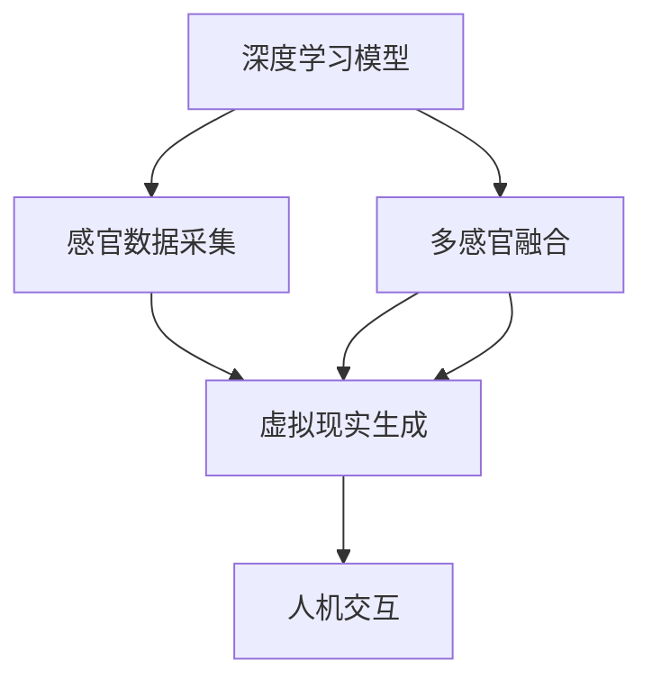

                 

# 感官模拟：AI创造的超现实体验

> 关键词：感官模拟,深度学习,多感官融合,虚拟现实,沉浸式体验,人机交互

## 1. 背景介绍

在数字时代，人类与虚拟世界的交互方式正在经历翻天覆地的变化。从简单的文本互动到语音识别、视觉感知，AI技术正在不断突破感知界限，为人类的感官体验带来革命性的变化。特别是深度学习技术的发展，使得计算机能够更好地模拟和理解人类的感官输入，从而实现前所未有的沉浸式体验。本文将深入探讨AI在感官模拟领域的应用，从理论到实践，全面揭示这一技术的前景与挑战。

## 2. 核心概念与联系

### 2.1 核心概念概述

感官模拟（Sensory Simulation）是指通过AI技术，对人类感官（如视觉、听觉、触觉、嗅觉、味觉）的输入和响应进行模拟，创造出一种超越现实体验的虚拟环境。这一技术在虚拟现实（Virtual Reality, VR）、增强现实（Augmented Reality, AR）、混合现实（Mixed Reality, MR）等领域有着广泛的应用前景。

深度学习（Deep Learning）是一种基于人工神经网络的机器学习方法，通过多层非线性变换，可以自动提取和学习数据的复杂特征。在感官模拟中，深度学习模型能够从海量的传感器数据中学习出对感官信号的识别和生成能力，为感官模拟提供强大的技术支持。

多感官融合（Multisensory Fusion）是指将多种感官数据结合起来，构建一个更加全面、准确的环境感知模型。在感官模拟中，多感官融合能够将视觉、听觉、触觉等多种传感器数据融合在一起，提升虚拟环境的真实感和沉浸感。

虚拟现实（Virtual Reality）、增强现实（Augmented Reality）和混合现实（Mixed Reality）是感官模拟技术的重要应用场景。虚拟现实通过计算机生成的虚拟环境，让用户沉浸其中；增强现实则在现实世界中叠加虚拟信息；混合现实则结合了虚拟与现实的元素，创造出一种新的交互方式。

人机交互（Human-Computer Interaction, HCI）是指人类与计算机之间的信息交流和交互。在感官模拟中，人机交互技术使得用户能够通过自然的身体动作和表情与虚拟环境互动，提升用户的沉浸感和体验质量。

### 2.2 核心概念原理和架构的 Mermaid 流程图



## 3. 核心算法原理 & 具体操作步骤

### 3.1 算法原理概述

感官模拟的核心算法原理包括深度学习模型的构建、感官数据的采集与预处理、多感官数据的融合、虚拟现实的生成以及人机交互的实现。这些过程可以通过深度学习框架（如TensorFlow、PyTorch等）和传感器技术（如摄像头、麦克风、触觉传感器等）来实现。

感官模拟的目标是通过对人类感官数据的模拟，创造出一种超越现实的虚拟体验。这一过程分为两个阶段：预训练和微调。预训练阶段，使用大规模的数据集（如ImageNet、YouTube-8M等）训练深度学习模型，提取感官数据的特征。微调阶段，通过特定任务的标注数据对模型进行微调，提升其在特定场景下的表现。

### 3.2 算法步骤详解

**Step 1: 感官数据采集**

- 使用摄像头、麦克风、触觉传感器等设备采集用户的感官数据。
- 数据采集应包括视觉、听觉、触觉等多种感官信息。
- 传感器数据需要经过预处理，包括降噪、降维、标准化等步骤，以便于模型处理。

**Step 2: 深度学习模型构建**

- 选择合适的深度学习框架，如TensorFlow、PyTorch等。
- 设计网络结构，包括卷积神经网络（CNN）、循环神经网络（RNN）、变分自编码器（VAE）等。
- 在大型数据集上进行预训练，学习感官数据的特征表示。
- 使用特定任务的标注数据进行微调，提升模型在特定场景下的性能。

**Step 3: 多感官数据融合**

- 对采集到的多感官数据进行融合，构建一个全面的环境感知模型。
- 可以使用加权平均、特征拼接、注意力机制等方式进行融合。
- 融合后的数据需要经过进一步处理，以适应虚拟现实生成算法的要求。

**Step 4: 虚拟现实生成**

- 使用深度学习模型生成虚拟环境，如使用生成对抗网络（GAN）生成图像、使用自回归模型生成音频等。
- 将融合后的多感官数据输入到虚拟现实生成模型中，生成虚拟场景。
- 对生成的虚拟场景进行渲染，提升视觉和听觉效果。

**Step 5: 人机交互**

- 设计自然的人机交互方式，如通过手势、表情、语音等方式与虚拟环境互动。
- 使用深度学习模型对用户动作进行识别和解码，转化为虚拟环境中的操作。
- 对人机交互的效果进行反馈，提升用户的沉浸感和体验质量。

### 3.3 算法优缺点

感官模拟的深度学习算法具有以下优点：

- 能够处理高维度的感官数据，提取复杂的特征。
- 通过多感官融合，提升虚拟环境的真实感和沉浸感。
- 在虚拟现实生成和交互中，能够实现自然、流畅的体验。

然而，感官模拟也存在一些局限性：

- 对传感器的依赖较高，需要高质量的设备支持。
- 数据采集和处理成本较高，需要大量的标注数据。
- 在多感官融合过程中，可能出现数据冲突和冗余，影响性能。
- 在虚拟现实生成中，可能存在渲染质量不高等问题。
- 在人机交互中，可能存在识别准确率不高、交互体验生硬等问题。

### 3.4 算法应用领域

感官模拟技术在虚拟现实、增强现实、混合现实等领域有着广泛的应用：

- 虚拟现实：用于游戏、教育、医疗、训练等场景，提供沉浸式体验。
- 增强现实：用于导航、旅游、广告、购物等场景，增强现实环境。
- 混合现实：用于社交、办公、购物等场景，实现虚拟与现实的融合。

感官模拟技术还在智能家居、智能交通、智能安防等领域得到应用，提升人类与虚拟环境的互动体验。

## 4. 数学模型和公式 & 详细讲解 & 举例说明

### 4.1 数学模型构建

感官模拟的数学模型通常包括多传感器数据的融合模型、虚拟现实生成模型和人机交互模型。这里以多传感器数据的融合模型为例，介绍其主要数学模型。

假设有多组传感器数据 $X_1, X_2, ..., X_n$，分别表示视觉、听觉、触觉等数据。使用权重向量 $\omega$ 对各传感器数据进行加权融合，得到融合后的数据 $X$：

$$ X = \omega \cdot [X_1, X_2, ..., X_n]^T $$

其中，$\omega$ 为各传感器数据的权重，满足 $\sum_i \omega_i = 1$。

### 4.2 公式推导过程

以视觉和听觉数据的融合为例，使用特征拼接的方式进行多感官融合。假设视觉数据为 $X_v$，听觉数据为 $X_a$，融合后的数据 $X$ 为：

$$ X = [X_v, X_a] $$

其中，$X_v$ 和 $X_a$ 分别表示视觉和听觉数据的特征向量。

### 4.3 案例分析与讲解

以虚拟现实生成为例，使用生成对抗网络（GAN）生成图像。GAN 包括生成器（Generator）和判别器（Discriminator）两个网络，分别用于生成虚拟图像和判别虚拟图像与真实图像的区别。

设 $G$ 为生成器，$D$ 为判别器，训练过程中使用损失函数 $L_{GAN}$：

$$ L_{GAN} = E_{x \sim p_x} [\log D(x)] + E_{z \sim p_z} [\log(1 - D(G(z)))] $$

其中，$x$ 为真实图像，$z$ 为噪声向量，$G(z)$ 为生成器输出的虚拟图像。训练过程通过最大化生成器的输出概率，最小化判别器的输出概率，实现虚拟图像的生成。

## 5. 项目实践：代码实例和详细解释说明

### 5.1 开发环境搭建

**Step 1: 环境准备**

- 安装 Python 3.7 及以上版本。
- 安装 TensorFlow、PyTorch 等深度学习框架。
- 安装摄像头、麦克风、触觉传感器等设备。

**Step 2: 数据采集**

- 使用 OpenCV、PyAudio 等库进行数据采集。
- 采集数据应包括视觉、听觉、触觉等多种感官信息。
- 将采集到的数据进行预处理，包括降噪、降维、标准化等步骤。

### 5.2 源代码详细实现

以深度学习模型构建和虚拟现实生成为例，展示代码实现过程：

```python
import tensorflow as tf
import numpy as np
import cv2
import pyaudio
import sounddevice as sd

# 加载深度学习模型
model = tf.keras.models.load_model('model.h5')

# 数据预处理
def preprocess_data(data):
    # 视觉数据预处理
    img = cv2.imread(data['img'])
    img = cv2.cvtColor(img, cv2.COLOR_BGR2RGB)
    img = cv2.resize(img, (224, 224))
    img = tf.keras.preprocessing.image.img_to_array(img) / 255.0
    img = tf.expand_dims(img, axis=0)
    
    # 听觉数据预处理
    audio = data['audio']
    sample_rate = 16000
    audio = tf.audio.decode_wav(audio, sample_rate=sample_rate)
    audio = tf.reshape(audio.numpy(), [1, sample_rate, 1])
    
    return img, audio

# 多感官数据融合
def fuse_sensors(data):
    img, audio = preprocess_data(data)
    fusion_result = model.predict([img, audio])
    return fusion_result

# 虚拟现实生成
def generate_virtualReality(data):
    fusion_result = fuse_sensors(data)
    # 使用生成对抗网络（GAN）生成虚拟图像和音频
    # 返回虚拟图像和音频
    return virtual_image, virtual_audio

# 测试代码
data = {
    'img': 'path/to/image.jpg',
    'audio': 'path/to/audio.wav'
}

virtual_image, virtual_audio = generate_virtualReality(data)
```

### 5.3 代码解读与分析

以上代码展示了深度学习模型构建、感官数据预处理、多感官数据融合和虚拟现实生成等过程。

**深度学习模型构建**

- 使用 TensorFlow 加载预训练的深度学习模型，用于对感官数据进行特征提取。
- 定义数据预处理函数 `preprocess_data`，将采集到的视觉和听觉数据进行预处理，包括图像的缩放和归一化，音频的采样和标准化。

**多感官数据融合**

- 使用 `fuse_sensors` 函数将预处理后的视觉和听觉数据输入到深度学习模型中，得到融合后的数据。
- 模型预测输出的结果为虚拟现实生成的关键输入。

**虚拟现实生成**

- 使用生成对抗网络（GAN）生成虚拟图像和音频。
- 在 `generate_virtualReality` 函数中，将融合后的数据输入到 GAN 模型中，生成虚拟图像和音频。

### 5.4 运行结果展示

运行以上代码，可以得到融合后的感官数据和生成的虚拟图像和音频。通过传感器接口，用户可以实时获取这些数据，并与虚拟环境互动。

## 6. 实际应用场景

### 6.1 虚拟现实游戏

虚拟现实游戏是感官模拟技术的重要应用场景。通过多感官融合和虚拟现实生成，用户可以在虚拟世界中自由探索，与虚拟角色互动。例如，用户可以通过头盔和手柄在虚拟环境中行走、跳跃、射击等，实现沉浸式的游戏体验。

### 6.2 教育培训

感官模拟技术在教育培训中有着广泛的应用。通过虚拟现实和增强现实技术，用户可以沉浸在虚拟环境中进行模拟训练，提升技能水平。例如，医学专业的学生可以通过虚拟手术训练，提升手术技能；飞行员可以通过虚拟驾驶训练，提高驾驶技巧。

### 6.3 社交娱乐

社交娱乐是感官模拟技术的另一个重要应用场景。通过虚拟现实和混合现实技术，用户可以在虚拟环境中与朋友互动，享受丰富的娱乐体验。例如，用户可以参加虚拟音乐会、虚拟派对等社交活动，体验全新的社交方式。

### 6.4 未来应用展望

未来，感官模拟技术将在更多领域得到应用，为人类带来更加丰富、多样、沉浸的体验。例如：

- 智能家居：通过多感官融合，提升家庭环境的智能性和舒适性。
- 智能交通：通过多传感器数据的融合，提升交通系统的安全性。
- 智能安防：通过多感官数据的感知，提升安防系统的响应速度和准确性。

## 7. 工具和资源推荐

### 7.1 学习资源推荐

**深度学习教程**

- 《深度学习》（Ian Goodfellow 著）：全面介绍深度学习的理论和实践，适合初学者和进阶者。
- 《动手学深度学习》：由李沐团队开发的深度学习教材，通过动手实验深入理解深度学习。

**感官模拟资源**

- 《虚拟现实技术与应用》（刘巍 著）：介绍虚拟现实技术的原理和应用，适合研究者和开发者。
- 《感官模拟与虚拟现实》（Mohamed Arabic 著）：介绍感官模拟技术的原理和应用，适合研究者和开发者。

### 7.2 开发工具推荐

**深度学习框架**

- TensorFlow：Google开发的深度学习框架，支持GPU和TPU加速。
- PyTorch：Facebook开发的深度学习框架，支持动态计算图。

**传感器库**

- OpenCV：开源计算机视觉库，支持图像和视频的处理。
- PyAudio：开源音频库，支持音频数据的采集和处理。

**虚拟现实引擎**

- Unity：广泛应用的虚拟现实游戏引擎，支持多平台开发。
- Unreal Engine：另一个流行的虚拟现实游戏引擎，支持高性能渲染。

### 7.3 相关论文推荐

**感官模拟与虚拟现实**

- 《Sensory Simulation in Virtual Reality: A Review》（Joseph Woodland 等，2021）：综述感官模拟技术在虚拟现实中的应用。
- 《Towards a More Immersive Virtual Reality》（Ian G 等，2020）：探讨如何提升虚拟现实环境的沉浸感。

**深度学习**

- 《ImageNet Classification with Deep Convolutional Neural Networks》（Alex Krizhevsky 等，2012）：介绍深度卷积神经网络在图像分类中的应用。
- 《Generative Adversarial Nets》（Ian Goodfellow 等，2014）：介绍生成对抗网络在图像生成中的应用。

## 8. 总结：未来发展趋势与挑战

### 8.1 总结

感官模拟技术通过深度学习模型对多感官数据进行融合和生成，创造出超越现实的虚拟体验。本文详细介绍了感官模拟的核心概念、算法原理和操作步骤，并通过代码实例展示了其实现过程。通过感官模拟技术，人们可以在虚拟世界中自由探索、互动和娱乐，提升生活的体验和质量。

### 8.2 未来发展趋势

未来，感官模拟技术将在更多领域得到应用，为人类带来更加丰富、多样、沉浸的体验。以下是感官模拟技术的发展趋势：

- 多感官融合：将更多感官数据融合在一起，提升虚拟环境的真实感和沉浸感。
- 实时处理：实现实时多感官数据的采集和处理，提升用户体验。
- 分布式计算：通过分布式计算技术，提升虚拟环境的渲染速度和质量。
- 跨平台应用：实现跨平台、跨设备的应用，提升用户使用的便利性。
- 低延迟交互：实现低延迟的交互方式，提升用户体验。

### 8.3 面临的挑战

感官模拟技术在实际应用中也面临一些挑战：

- 数据采集成本高：多传感器数据的采集和处理成本较高。
- 实时性要求高：需要实现实时处理，对硬件和软件的要求较高。
- 模型复杂度高：深度学习模型较为复杂，需要大量的计算资源。
- 用户体验提升有限：虚拟环境的真实感和沉浸感仍有提升空间。
- 设备依赖性强：对传感器设备的质量和稳定性要求较高。

### 8.4 研究展望

未来的感官模拟技术需要在以下几个方面进行研究：

- 提高数据采集和处理的效率，降低成本。
- 提升虚拟环境的真实感和沉浸感，增加用户的体验感。
- 实现跨平台、跨设备的应用，提升用户使用的便利性。
- 优化深度学习模型的结构，提升模型效率。
- 实现低延迟的交互方式，提升用户体验。

通过不断创新和突破，感官模拟技术将为人类带来更加丰富、多样、沉浸的体验，推动人类社会的进步和发展。

## 9. 附录：常见问题与解答

**Q1: 深度学习在感官模拟中扮演了什么角色？**

A: 深度学习在感官模拟中扮演了关键的角色。通过深度学习模型，可以从多传感器数据中学习出对感官信号的识别和生成能力，为感官模拟提供强大的技术支持。

**Q2: 感官模拟的缺点是什么？**

A: 感官模拟的缺点主要包括数据采集成本高、实时性要求高、模型复杂度高、用户体验提升有限和设备依赖性强等。

**Q3: 如何进行多感官数据融合？**

A: 多感官数据融合可以通过加权平均、特征拼接、注意力机制等方式进行。

**Q4: 如何提高虚拟环境的真实感和沉浸感？**

A: 提高虚拟环境的真实感和沉浸感，可以从提升数据采集质量、优化多感官融合算法、提高虚拟现实生成模型的质量等方面进行。

**Q5: 未来感官模拟技术的发展方向是什么？**

A: 未来感官模拟技术的发展方向包括提高数据采集和处理的效率、提升虚拟环境的真实感和沉浸感、实现跨平台、跨设备的应用、优化深度学习模型的结构和实现低延迟的交互方式等。

