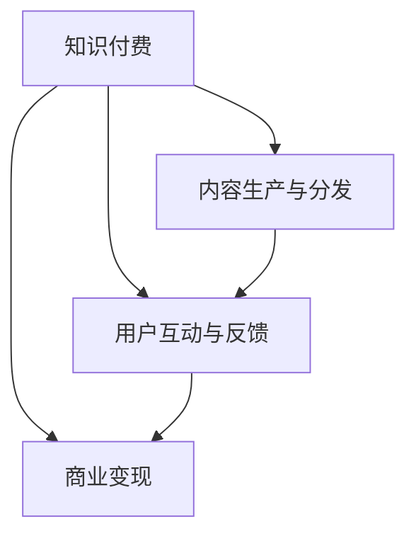

                 

# 打造个人IP：知识付费创业的关键

## 1. 背景介绍

在互联网时代，内容付费已经成为一个新的增长极。知识付费平台如雨后春笋般涌现，为有价值的知识提供了一条变现渠道。然而，知识付费的竞争非常激烈，仅有内容很难赢得市场。此时，打造个人IP（Influential Personality）成为了知识付费创业的关键。个人IP不仅代表着个性、风格、理念，还能通过内容与用户建立深度连接，带来持久的黏性。本文将深入探讨知识付费创业中个人IP的构建策略，为创业者提供一份详尽的指南。

## 2. 核心概念与联系

### 2.1 核心概念概述

- **知识付费**：指用户为获取特定知识或信息，支付费用的行为。知识付费平台通过提供高质量、有价值的内容，吸引用户订阅、购买。

- **个人IP**：指具有鲜明个性、独特风格和强烈影响力的个体品牌。个人IP通过与用户建立情感共鸣，构建起忠实粉丝群，形成持久影响力。

- **内容生产与分发**：知识付费平台的核心业务流程。生产高质量内容，通过算法和推荐系统分发至目标受众。

- **用户互动与反馈**：衡量内容价值的重要指标。通过互动和反馈数据，指导内容优化和产品迭代。

- **商业变现**：知识付费平台的终极目标。通过精准的广告投放、会员付费、内容销售等多种方式实现盈利。

这些概念之间的逻辑关系可以通过以下Mermaid流程图来展示：



这个流程图展示出知识付费平台的主要业务流程和核心要素。

## 3. 核心算法原理 & 具体操作步骤
### 3.1 算法原理概述

知识付费平台的内容推荐系统，本质上是一个基于用户行为和内容特征的推荐算法系统。其核心思想是：通过用户的历史行为数据，构建用户兴趣模型，再利用模型预测用户可能感兴趣的新内容，从而实现个性化内容推荐。

具体来说，推荐系统由以下几部分组成：

1. **用户画像构建**：收集用户的浏览历史、搜索记录、评分反馈等数据，构建用户兴趣模型。
2. **内容特征提取**：对内容进行特征提取，如标题、作者、标签、摘要等，用于计算用户与内容的相似度。
3. **推荐算法设计**：基于相似度计算算法，如协同过滤、矩阵分解、深度学习等，预测用户对内容的兴趣度。
4. **推荐结果排序**：根据预测的兴趣度，对推荐结果进行排序，并选择排名靠前的内容进行展示。

### 3.2 算法步骤详解

知识付费平台的推荐系统主要步骤如下：

**Step 1: 数据收集与预处理**

- 收集用户的行为数据，如浏览历史、搜索记录、评分反馈等。
- 对内容进行特征提取，如标题、作者、标签、摘要等，形成特征向量。
- 进行数据清洗和预处理，处理缺失值、噪声等数据问题。

**Step 2: 用户画像构建**

- 使用聚类算法（如K-Means、LDA等）对用户行为数据进行特征提取，形成用户兴趣向量。
- 通过多维特征融合算法（如EM算法、Boosting等），对用户兴趣向量进行融合，形成更加精细的用户画像。

**Step 3: 内容特征提取与编码**

- 使用自然语言处理技术（如TF-IDF、Word2Vec等）对内容进行特征提取，形成特征向量。
- 对特征向量进行编码，如独热编码、one-hot编码等，便于后续计算。

**Step 4: 相似度计算与推荐**

- 计算用户与内容的相似度，如余弦相似度、欧几里得距离等。
- 根据相似度计算结果，使用协同过滤、矩阵分解、深度学习等推荐算法，预测用户对内容的兴趣度。
- 根据预测结果，对推荐内容进行排序，选择排名靠前的内容进行展示。

**Step 5: 用户反馈与迭代优化**

- 收集用户对推荐的反馈数据，如点击率、购买率等。
- 基于反馈数据，进行模型评估和调优，提升推荐效果。

### 3.3 算法优缺点

知识付费平台的推荐系统具有以下优点：

1. 高效准确：利用机器学习算法，可以实现大规模个性化推荐，提高用户满意度。
2. 实时性高：基于在线用户行为数据，可以实时更新推荐内容，提升用户体验。
3. 成本低廉：使用算法自动推荐，减少了人工操作和运营成本。

同时，该算法也存在以下局限性：

1. 冷启动问题：新用户或新内容缺乏历史行为数据，推荐效果差。
2. 数据隐私：用户行为数据的收集和使用，可能带来隐私风险。
3. 模型公平性：推荐模型可能存在偏见，导致内容推荐不公正。
4. 过拟合风险：过度依赖用户行为数据，可能导致模型过拟合。

尽管存在这些局限性，但就目前而言，基于算法的推荐系统仍然是最主流的方法。未来相关研究的重点在于如何进一步提高推荐系统的精度、效率和公平性，同时兼顾数据隐私和安全。

### 3.4 算法应用领域

基于知识付费平台的推荐系统，已经广泛应用于各种NLP任务，如：

- 内容推荐：根据用户的历史浏览行为，推荐可能感兴趣的文章、书籍、课程等。
- 个性化定制：通过用户画像，定制个性化推荐方案，满足用户多样化需求。
- 用户行为分析：利用用户行为数据，分析用户兴趣变化趋势，优化推荐策略。
- 广告投放：通过精准的广告投放，提升平台的广告转化率和盈利能力。

除了上述这些经典应用外，推荐系统还被创新性地应用到更多场景中，如智能客服、金融产品推荐、商品推荐等，为不同行业提供解决方案。

## 4. 数学模型和公式 & 详细讲解 & 举例说明

### 4.1 数学模型构建

知识付费平台的推荐系统主要由以下几个数学模型构成：

1. **用户兴趣模型**：表示用户对不同内容的兴趣程度，一般使用向量形式表示，如$\vec{u}$。
2. **内容特征模型**：表示内容对不同用户的吸引力程度，一般使用向量形式表示，如$\vec{v}$。
3. **相似度模型**：表示用户与内容之间的相似度，一般使用余弦相似度、欧几里得距离等方法计算。

### 4.2 公式推导过程

以下我们以余弦相似度为例，推导推荐系统中的相似度计算公式。

假设用户兴趣向量为$\vec{u}=[u_1,u_2,u_3,\ldots,u_n]$，内容特征向量为$\vec{v}=[v_1,v_2,v_3,\ldots,v_n]$，则余弦相似度计算公式为：

$$
\cos(\theta) = \frac{\vec{u} \cdot \vec{v}}{||\vec{u}|| \cdot ||\vec{v}||}
$$

其中，$\cdot$表示向量点乘，$||\vec{u}||$表示向量$\vec{u}$的欧几里得范数。

将余弦相似度应用到推荐系统中，对于每个内容$c$，计算其与用户$u$的相似度$S(u,c)$，即可得到用户$u$对内容$c$的兴趣度：

$$
S(u,c) = \cos(\theta(u,c)) = \frac{\vec{u} \cdot \vec{v}(c)}{||\vec{u}|| \cdot ||\vec{v}(c)||}
$$

### 4.3 案例分析与讲解

以“得到”App为例，其内容推荐系统采用了基于协同过滤的推荐算法。具体步骤如下：

1. **数据收集**：收集用户的历史行为数据，如浏览、评分、购买等。
2. **用户画像构建**：使用协同过滤算法，计算用户与内容的相似度，形成用户兴趣向量。
3. **内容特征提取**：对内容进行特征提取，如作者、标签、摘要等，形成内容特征向量。
4. **相似度计算**：使用余弦相似度计算用户与内容的相似度，得到用户对内容的兴趣度。
5. **推荐结果排序**：根据兴趣度，对推荐内容进行排序，选择排名靠前的内容展示给用户。

在实际应用中，“得到”App还引入了个性化推荐算法、数据隐私保护等技术，进一步提升了推荐效果和用户体验。

## 5. 项目实践：代码实例和详细解释说明
### 5.1 开发环境搭建

在进行推荐系统开发前，我们需要准备好开发环境。以下是使用Python进行TensorFlow开发的环境配置流程：

1. 安装Anaconda：从官网下载并安装Anaconda，用于创建独立的Python环境。

2. 创建并激活虚拟环境：
```bash
conda create -n tf-env python=3.8 
conda activate tf-env
```

3. 安装TensorFlow：根据CUDA版本，从官网获取对应的安装命令。例如：
```bash
conda install tensorflow -c conda-forge
```

4. 安装其他依赖库：
```bash
pip install numpy pandas sklearn scikit-learn matplotlib tqdm jupyter notebook ipython
```

完成上述步骤后，即可在`tf-env`环境中开始推荐系统开发。

### 5.2 源代码详细实现

下面我们以基于协同过滤的推荐系统为例，给出使用TensorFlow进行推荐系统开发的PyTorch代码实现。

首先，定义协同过滤模型的用户画像和内容特征：

```python
import tensorflow as tf
import numpy as np

# 用户画像
user_interest = np.array([1, 1, 0, 0, 0, 0, 1, 1, 0, 0])
# 内容特征
content_features = np.array([0, 1, 1, 0, 0, 0, 1, 0, 0, 0])

# 相似度矩阵
similarity_matrix = np.dot(user_interest, content_features.T) / (np.linalg.norm(user_interest) * np.linalg.norm(content_features.T))
```

然后，定义推荐模型：

```python
# 定义推荐模型
class Recommender:
    def __init__(self):
        self.user_interest = tf.Variable(user_interest)
        self.content_features = tf.Variable(content_features)

    def recommend(self, content):
        # 计算相似度
        similarity = tf.matmul(self.user_interest, content_features, transpose_b=True) / (tf.linalg.norm(self.user_interest) * tf.linalg.norm(content_features))
        # 返回推荐内容
        return np.argmax(similarity)
```

最后，启动推荐流程：

```python
# 创建推荐器
recommender = Recommender()

# 推荐内容
content = np.array([1, 1, 0, 0, 0, 0, 1, 0, 0, 0])
recommendation = recommender.recommend(content)
print(f"推荐内容为：{recommendation}")
```

以上就是使用TensorFlow对协同过滤推荐系统进行开发的完整代码实现。可以看到，使用TensorFlow封装推荐算法，使得代码实现变得简洁高效。

### 5.3 代码解读与分析

让我们再详细解读一下关键代码的实现细节：

**协同过滤模型**：
- `user_interest`：表示用户兴趣向量，其中值为1表示用户对内容感兴趣，值为0表示用户对内容不感兴趣。
- `content_features`：表示内容特征向量，其中值为1表示内容具有该特征，值为0表示内容不具有该特征。
- `similarity_matrix`：表示用户与内容的相似度矩阵，其中值越大表示相似度越高。

**推荐模型**：
- `__init__`方法：初始化用户兴趣向量、内容特征向量等参数。
- `recommend`方法：计算用户与内容的相似度，返回相似度最大的内容索引。

**推荐流程**：
- 创建推荐器，并初始化用户兴趣向量、内容特征向量。
- 定义推荐内容，计算推荐结果，并输出推荐内容。

可以看到，TensorFlow的自动微分能力使得协同过滤算法的实现变得非常简单。开发者可以将更多精力放在模型优化和数据处理等高层逻辑上，而不必过多关注底层实现细节。

当然，工业级的系统实现还需考虑更多因素，如推荐模型的可扩展性、实时性、推荐效果的动态调整等。但核心的协同过滤推荐算法基本与此类似。

## 6. 实际应用场景
### 6.1 智能客服系统

基于知识付费平台的推荐系统，可以应用于智能客服系统的构建。传统客服往往需要配备大量人力，高峰期响应缓慢，且一致性和专业性难以保证。而使用推荐系统推荐的回答模板，可以7x24小时不间断服务，快速响应客户咨询，用自然流畅的语言解答各类常见问题。

在技术实现上，可以收集企业内部的历史客服对话记录，将问题和最佳答复构建成监督数据，在此基础上对推荐系统进行微调。微调后的推荐系统能够自动理解用户意图，匹配最合适的回答模板进行回复。对于客户提出的新问题，还可以接入检索系统实时搜索相关内容，动态组织生成回答。如此构建的智能客服系统，能大幅提升客户咨询体验和问题解决效率。

### 6.2 金融舆情监测

金融机构需要实时监测市场舆论动向，以便及时应对负面信息传播，规避金融风险。传统的人工监测方式成本高、效率低，难以应对网络时代海量信息爆发的挑战。基于知识付费平台的推荐系统，可以为金融舆情监测提供新的解决方案。

具体而言，可以收集金融领域相关的新闻、报道、评论等文本数据，并对其进行主题标注和情感标注。在此基础上对推荐系统进行微调，使其能够自动判断文本属于何种主题，情感倾向是正面、中性还是负面。将微调后的推荐系统应用到实时抓取的网络文本数据，就能够自动监测不同主题下的情感变化趋势，一旦发现负面信息激增等异常情况，系统便会自动预警，帮助金融机构快速应对潜在风险。

### 6.3 个性化推荐系统

当前的推荐系统往往只依赖用户的历史行为数据进行物品推荐，无法深入理解用户的真实兴趣偏好。基于知识付费平台的推荐系统，可以更好地挖掘用户行为背后的语义信息，从而提供更精准、多样的推荐内容。

在实践中，可以收集用户浏览、点击、评论、分享等行为数据，提取和用户交互的物品标题、描述、标签等文本内容。将文本内容作为模型输入，用户的后续行为（如是否点击、购买等）作为监督信号，在此基础上微调推荐系统。微调后的推荐系统能够从文本内容中准确把握用户的兴趣点。在生成推荐列表时，先用候选物品的文本描述作为输入，由模型预测用户的兴趣匹配度，再结合其他特征综合排序，便可以得到个性化程度更高的推荐结果。

### 6.4 未来应用展望

随着推荐系统的发展，未来将会在更多领域得到应用，为传统行业带来变革性影响。

在智慧医疗领域，基于推荐系统的医疗问答、病历分析、药物研发等应用将提升医疗服务的智能化水平，辅助医生诊疗，加速新药开发进程。

在智能教育领域，推荐系统可应用于作业批改、学情分析、知识推荐等方面，因材施教，促进教育公平，提高教学质量。

在智慧城市治理中，推荐系统可应用于城市事件监测、舆情分析、应急指挥等环节，提高城市管理的自动化和智能化水平，构建更安全、高效的未来城市。

此外，在企业生产、社会治理、文娱传媒等众多领域，基于推荐系统的应用也将不断涌现，为经济社会发展注入新的动力。相信随着技术的日益成熟，推荐系统必将在更广阔的应用领域大放异彩。

## 7. 工具和资源推荐
### 7.1 学习资源推荐

为了帮助开发者系统掌握推荐系统的理论基础和实践技巧，这里推荐一些优质的学习资源：

1. 《推荐系统》系列博文：由大模型技术专家撰写，深入浅出地介绍了推荐系统的原理、算法和实现方法。

2. 《机器学习》课程：斯坦福大学开设的经典课程，涵盖了推荐系统、协同过滤、矩阵分解等核心内容。

3. 《推荐系统实战》书籍：详细介绍了推荐系统的原理和实现，包括协同过滤、深度学习等技术。

4. Apache Mahout官方文档：开源推荐系统库的官方文档，提供了大量推荐算法和实际应用的样例代码。

5. Kaggle推荐系统竞赛：通过参与比赛，学习推荐系统的实际应用和优化方法。

通过对这些资源的学习实践，相信你一定能够快速掌握推荐系统的精髓，并用于解决实际的推荐问题。
###  7.2 开发工具推荐

高效的开发离不开优秀的工具支持。以下是几款用于推荐系统开发的常用工具：

1. TensorFlow：由Google主导开发的开源深度学习框架，生产部署方便，适合大规模工程应用。推荐系统的大部分算法都可以在TensorFlow中实现。

2. PyTorch：基于Python的开源深度学习框架，灵活动态的计算图，适合快速迭代研究。推荐系统的一些算法在PyTorch中也有高效实现。

3. Scikit-learn：基于Python的开源机器学习库，简单易用，适用于各种推荐算法的实现。

4. Weights & Biases：模型训练的实验跟踪工具，可以记录和可视化模型训练过程中的各项指标，方便对比和调优。与主流深度学习框架无缝集成。

5. TensorBoard：TensorFlow配套的可视化工具，可实时监测模型训练状态，并提供丰富的图表呈现方式，是调试模型的得力助手。

6. Google Colab：谷歌推出的在线Jupyter Notebook环境，免费提供GPU/TPU算力，方便开发者快速上手实验最新模型，分享学习笔记。

合理利用这些工具，可以显著提升推荐系统的开发效率，加快创新迭代的步伐。

### 7.3 相关论文推荐

推荐系统的发展源于学界的持续研究。以下是几篇奠基性的相关论文，推荐阅读：

1. Matrix Factorization Techniques for Recommender Systems：提出了基于矩阵分解的协同过滤方法，是推荐系统中最经典的算法之一。

2. Trust and Exploit in Multi-armed Bandits：研究了如何通过多臂老虎机（MAB）算法在推荐系统中优化探索和利用，提升推荐效果。

3. Deep Collaborative Filtering：提出了基于深度神经网络的协同过滤方法，在推荐系统中取得了很好的效果。

4. Neural Collaborative Filtering：进一步将深度学习应用于协同过滤算法，提升了推荐系统的精度和泛化能力。

5. Contextual Bandits for Ranking Item Recommendations：研究了在推荐系统中应用上下文强化学习，提升推荐结果的排序质量。

这些论文代表了大推荐系统的发展脉络。通过学习这些前沿成果，可以帮助研究者把握学科前进方向，激发更多的创新灵感。

## 8. 总结：未来发展趋势与挑战

### 8.1 总结

本文对知识付费平台推荐系统的构建策略进行了全面系统的介绍。首先阐述了知识付费平台推荐系统的重要性，明确了推荐系统在内容分发、用户互动、商业变现等方面的核心价值。其次，从原理到实践，详细讲解了推荐系统的数学模型和推荐算法，给出了推荐系统开发的完整代码实例。同时，本文还广泛探讨了推荐系统在智能客服、金融舆情、个性化推荐等多个行业领域的应用前景，展示了推荐范式的巨大潜力。此外，本文精选了推荐系统的各类学习资源，力求为读者提供全方位的技术指引。

通过本文的系统梳理，可以看到，基于推荐系统的知识付费平台，在内容分发和用户互动方面具有显著优势，能够提升用户体验，带来持久的黏性。推荐系统为知识付费平台打开了更广阔的市场，成为商业变现的重要手段。未来，伴随推荐算法的持续演进和技术的不断进步，推荐系统必将在更多领域得到应用，为人类生产生活带来深刻变革。

### 8.2 未来发展趋势

展望未来，推荐系统的发展呈现以下几个趋势：

1. 个性化推荐更加精准：利用深度学习和大数据技术，推荐系统能够从用户行为数据中挖掘出更加精细的兴趣模式，实现个性化推荐。

2. 实时推荐更加实时：随着推荐系统的实时化，推荐结果能够动态更新，满足用户的即时需求。

3. 推荐系统更智能：引入自然语言处理、图像处理等技术，推荐系统能够理解和处理多模态数据，提供更加丰富、多样化的推荐内容。

4. 推荐系统更可解释：推荐系统需要具备更好的可解释性，帮助用户理解推荐理由，提升用户信任度。

5. 推荐系统更公平：推荐算法需要考虑数据公平性和模型公平性，避免推荐结果的偏见和不公正。

以上趋势凸显了推荐系统的广阔前景。这些方向的探索发展，必将进一步提升推荐系统的精度、效率和公平性，为知识付费平台带来更加优质的用户体验和更高的商业价值。

### 8.3 面临的挑战

尽管推荐系统已经取得了瞩目成就，但在迈向更加智能化、普适化应用的过程中，它仍面临诸多挑战：

1. 数据稀疏问题：新用户或新内容缺乏历史行为数据，推荐效果差。如何有效解决冷启动问题，提升推荐系统的覆盖率和效果。

2. 数据隐私问题：用户行为数据的收集和使用，可能带来隐私风险。如何保护用户隐私，确保数据安全。

3. 算法公平性问题：推荐算法可能存在偏见，导致推荐结果不公正。如何设计公平算法，避免推荐结果的偏见。

4. 计算资源问题：大规模推荐系统需要大量计算资源，如何优化计算效率，降低成本。

5. 模型过拟合问题：推荐模型可能过拟合用户行为数据，导致推荐结果泛化能力差。如何设计模型，避免过拟合。

6. 可解释性问题：推荐系统需要具备更好的可解释性，帮助用户理解推荐理由，提升用户信任度。

正视推荐系统面临的这些挑战，积极应对并寻求突破，将使推荐系统在未来的应用中更加高效、公正、可信。

### 8.4 研究展望

面对推荐系统面临的种种挑战，未来的研究需要在以下几个方面寻求新的突破：

1. 探索无监督和半监督推荐方法。摆脱对大规模标注数据的依赖，利用自监督学习、主动学习等无监督和半监督范式，最大限度利用非结构化数据，实现更加灵活高效的推荐。

2. 研究参数高效和计算高效的推荐范式。开发更加参数高效的推荐方法，在固定大部分预训练参数的同时，只更新极少量的任务相关参数。同时优化推荐模型的计算图，减少前向传播和反向传播的资源消耗，实现更加轻量级、实时性的部署。

3. 引入更多先验知识。将符号化的先验知识，如知识图谱、逻辑规则等，与推荐系统进行巧妙融合，引导推荐过程学习更准确、合理的推荐结果。同时加强不同模态数据的整合，实现视觉、语音等多模态信息与文本信息的协同建模。

4. 结合因果分析和博弈论工具。将因果分析方法引入推荐系统，识别出推荐过程的关键特征，增强推荐结果的因果性和逻辑性。借助博弈论工具刻画人机交互过程，主动探索并规避推荐系统的脆弱点，提高系统稳定性。

5. 纳入伦理道德约束。在推荐系统的设计目标中引入伦理导向的评估指标，过滤和惩罚有偏见、有害的推荐结果，确保推荐结果符合人类价值观和伦理道德。

这些研究方向的探索，必将引领推荐系统技术迈向更高的台阶，为知识付费平台带来更加优质的用户体验和更高的商业价值。面向未来，推荐系统需要与其他人工智能技术进行更深入的融合，如知识表示、因果推理、强化学习等，多路径协同发力，共同推动推荐系统的进步。只有勇于创新、敢于突破，才能不断拓展推荐系统的边界，让推荐系统更好地服务于人类社会。

## 9. 附录：常见问题与解答

**Q1：推荐系统如何提高个性化推荐效果？**

A: 推荐系统通过收集用户的行为数据，构建用户画像，计算用户与内容的相似度，生成个性化推荐结果。具体方法包括协同过滤、矩阵分解、深度学习等。此外，结合用户反馈数据，不断优化推荐模型，提升个性化推荐效果。

**Q2：推荐系统如何处理冷启动问题？**

A: 冷启动问题可以通过以下几种方式解决：
1. 利用深度学习模型：通过用户行为数据和物品属性信息，预测用户对新内容的兴趣，实现快速推荐。
2. 引入协同过滤算法：利用已有的用户-物品评分矩阵，预测新用户对新物品的评分，生成推荐结果。
3. 采用混合推荐策略：结合基于内容的推荐和协同过滤的推荐，提升推荐效果。

**Q3：推荐系统如何保护用户隐私？**

A: 推荐系统在数据收集和处理过程中，需要采取以下措施保护用户隐私：
1. 匿名化处理：将用户数据进行匿名化处理，去除敏感信息。
2. 数据加密：采用数据加密技术，保护用户数据的存储和传输安全。
3. 隐私保护算法：使用差分隐私、同态加密等隐私保护算法，确保用户数据不被滥用。

**Q4：推荐系统如何提高推荐结果的公平性？**

A: 推荐系统需要设计公平算法，避免推荐结果的偏见和不公正。具体方法包括：
1. 采用公平性评估指标：设计公平性评估指标，如多样性、代表性等，评估推荐结果的公平性。
2. 引入对抗样本：通过对抗样本训练推荐模型，提高模型的鲁棒性和公平性。
3. 设计公平推荐策略：结合用户画像和内容特征，生成公平推荐结果，避免推荐结果的偏见。

**Q5：推荐系统如何降低计算成本？**

A: 推荐系统可以通过以下几种方式降低计算成本：
1. 数据压缩：对数据进行压缩存储，减小存储空间。
2. 分布式计算：使用分布式计算框架，如Hadoop、Spark等，提高计算效率。
3. 模型剪枝：对模型进行剪枝优化，减少模型参数和计算量。
4. 深度学习加速：利用GPU、TPU等加速硬件，提高深度学习模型的计算效率。

这些策略往往需要根据具体应用场景进行灵活组合，优化推荐系统的计算性能。

---

作者：禅与计算机程序设计艺术 / Zen and the Art of Computer Programming

