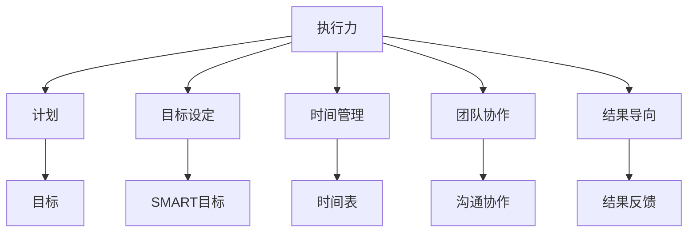
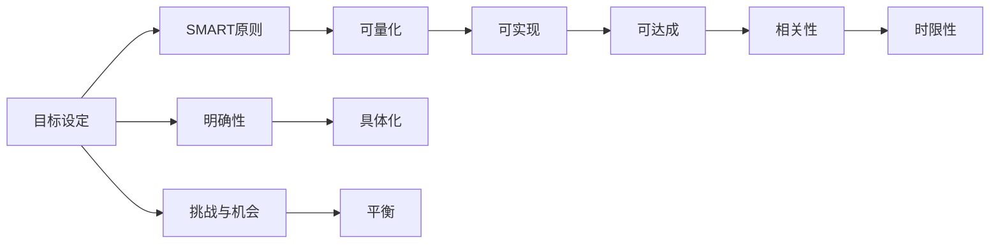

                 

# 执行力：从计划到结果的桥梁

> 关键词：执行力, 计划, 项目管理, 目标设定, 时间管理, 团队协作, 结果导向

## 1. 背景介绍

在快节奏的现代商业环境中，执行力已成为决定企业成败的关键因素。无论个人还是团队，能够将计划转化为实际结果的能力，直接关系到项目进展、绩效提升和企业竞争力。然而，由于多种内外因素的影响，执行力的发挥常常面临诸多挑战。如何提升执行力，将计划落到实处，成为各行各业亟待解决的问题。本文将深入探讨执行力的核心概念、影响因素及提升方法，帮助读者从理论到实践全面掌握执行力的本质和提升技巧。

## 2. 核心概念与联系

### 2.1 核心概念概述

为更好地理解执行力的构建和提升，本节将介绍几个关键概念及其联系：

- **执行力**：指将计划转化为实际结果的能力，涉及目标设定、时间管理、资源分配、团队协作等多个维度。
- **计划**：明确的目标和详细的行动步骤，是执行力的起点。
- **目标设定**：定义具体、可衡量、可实现的目标，是执行力管理的基础。
- **时间管理**：合理安排时间以确保任务按时完成，是执行力管理的关键环节。
- **团队协作**：协调团队成员间的沟通和合作，是执行力管理的重要保障。
- **结果导向**：聚焦于最终目标，不断调整和优化执行路径，是执行力管理的核心原则。

这些概念通过如下图的Mermaid流程图展示其相互联系：



### 2.2 核心概念原理和架构的 Mermaid 流程图



通过以上图表，可以看出目标设定遵循SMART原则，即具体(Specific)、可衡量(Measurable)、可达成(Achievable)、相关性(Relevant)和时限性(Time-bound)，确保目标具有清晰的指引性和可执行性。

## 3. 核心算法原理 & 具体操作步骤

### 3.1 算法原理概述

执行力的提升，本质上是一个多目标优化过程。通过系统的目标设定、时间管理和团队协作，确保资源的最优配置和任务的高效执行。该过程可以用以下数学模型来表示：

假设执行任务需要完成 $n$ 个子目标，每个子目标 $i$ 有 $t_i$ 个步骤，步骤 $j$ 的执行时间为 $c_{ij}$，资源需求为 $r_{ij}$，完成度为 $p_{ij}$。设优化目标为最小化总执行时间 $T$，模型表示为：

$$
\min T = \sum_{i=1}^{n}\sum_{j=1}^{t_i}c_{ij}p_{ij}
$$

约束条件为：

$$
\begin{align*}
\sum_{j=1}^{t_i}r_{ij} &= R_i \\
\sum_{j=1}^{t_i}p_{ij} &= 1 \\
p_{ij} &\geq 0
\end{align*}
$$

其中 $R_i$ 为第 $i$ 个子目标的资源限制，$1$ 表示步骤 $j$ 必须完成，$p_{ij}$ 表示步骤 $j$ 的完成度，且必须满足 $0 \leq p_{ij} \leq 1$。

### 3.2 算法步骤详解

基于上述模型，提升执行力的具体操作步骤如下：

1. **目标设定**：
   - 定义项目总体目标，确保目标符合SMART原则。
   - 分解总体目标为具体的子目标，明确每个子目标的执行路径和资源需求。

2. **时间管理**：
   - 估算每个步骤的执行时间，构建详细的执行时间表。
   - 合理安排任务的先后顺序，确保关键路径任务优先完成。

3. **资源分配**：
   - 确定项目所需资源，包括人力、物力和财力。
   - 优化资源分配，确保每个步骤有足够的资源支持，同时避免资源浪费。

4. **团队协作**：
   - 明确团队成员的职责和任务，建立高效的沟通机制。
   - 定期举行进度汇报和问题讨论，确保团队成员的同步协作。

5. **执行监控与调整**：
   - 实时监控执行进度，及时发现和解决执行过程中出现的问题。
   - 根据实际情况调整执行路径和资源分配，确保项目按预期进行。

### 3.3 算法优缺点

提升执行力的算法具有以下优点：

- **系统性**：通过系统化的方法和工具，确保执行过程的全面性和科学性。
- **可控性**：能够精确控制执行过程中的各种变量，减少不确定性。
- **灵活性**：可以根据实际情况灵活调整执行路径和资源配置。

但该算法也存在一些缺点：

- **复杂性**：需要构建详细的执行模型，对于复杂的项目可能过于繁琐。
- **高成本**：设计和维护执行系统的成本较高。
- **依赖性**：对执行模型的准确性和完备性有较高要求。

### 3.4 算法应用领域

提升执行力的方法在各个领域均有广泛应用，包括但不限于：

- **项目管理**：项目经理通过系统规划和管理，确保项目按时按质完成。
- **企业运营**：企业通过优化资源配置和执行路径，提升整体运营效率。
- **软件开发**：开发团队通过敏捷开发和持续集成，加速软件开发进程。
- **市场推广**：营销团队通过精准投放和实时监控，提升广告效果和品牌知名度。
- **教育培训**：教育机构通过合理安排课程和教师资源，提升教学效果和学习体验。

## 4. 数学模型和公式 & 详细讲解 & 举例说明

### 4.1 数学模型构建

在本节中，我们将用数学语言对执行力的提升过程进行严格推导。

假设项目需要完成 $n$ 个子目标，每个子目标 $i$ 的执行时间 $t_i$ 和资源需求 $R_i$ 已确定，每个步骤 $j$ 的执行时间 $c_{ij}$ 和资源需求 $r_{ij}$ 已知，步骤 $j$ 的完成度 $p_{ij}$ 为 0 或 1。设总体执行时间 $T$ 和完成度 $P$ 分别为：

$$
T = \sum_{i=1}^{n}\sum_{j=1}^{t_i}c_{ij}p_{ij}
$$

$$
P = \sum_{i=1}^{n}\sum_{j=1}^{t_i}p_{ij}
$$

### 4.2 公式推导过程

目标最小化 $T$，即：

$$
\min T = \sum_{i=1}^{n}\sum_{j=1}^{t_i}c_{ij}p_{ij}
$$

约束条件为：

$$
\begin{align*}
\sum_{j=1}^{t_i}p_{ij} &= 1 \\
p_{ij} &\geq 0
\end{align*}
$$

对 $p_{ij}$ 引入松弛变量 $z_{ij}$，确保 $p_{ij} \leq 1$，构建拉格朗日函数：

$$
\mathcal{L}(p_{ij},z_{ij},\lambda_i,\mu_i) = \sum_{i=1}^{n}\sum_{j=1}^{t_i}c_{ij}p_{ij} + \lambda_i\left(1-\sum_{j=1}^{t_i}p_{ij}\right) + \mu_i(-z_{ij})
$$

将 $p_{ij}$ 替换为 $p_{ij} = x_{ij} + z_{ij}$，则：

$$
\mathcal{L}(p_{ij},z_{ij},\lambda_i,\mu_i) = \sum_{i=1}^{n}\sum_{j=1}^{t_i}c_{ij}(x_{ij} + z_{ij}) + \lambda_i(1 - \sum_{j=1}^{t_i}x_{ij} - z_{ij}) + \mu_iz_{ij}
$$

对 $x_{ij}$ 和 $z_{ij}$ 分别求偏导，得：

$$
\frac{\partial \mathcal{L}}{\partial x_{ij}} = c_{ij} + \lambda_i - \mu_i = 0
$$

$$
\frac{\partial \mathcal{L}}{\partial z_{ij}} = c_{ij} - \lambda_i - \mu_i = 0
$$

将上式合并，得：

$$
c_{ij} = \lambda_i
$$

带入 $\lambda_i = \sum_{j=1}^{t_i}c_{ij}$，得：

$$
c_{ij} = \frac{1}{t_i}\sum_{j=1}^{t_i}c_{ij}
$$

### 4.3 案例分析与讲解

以软件开发项目为例，分析如何通过数学模型提升项目执行力。

假设开发团队需要完成 $n$ 个功能模块，每个模块的开发时间 $t_i$ 和资源需求 $R_i$ 已确定，每个开发任务 $j$ 的开发时间 $c_{ij}$ 和资源需求 $r_{ij}$ 已知，任务 $j$ 的完成度 $p_{ij}$ 为 0 或 1。设总体开发时间 $T$ 和完成度 $P$ 分别为：

$$
T = \sum_{i=1}^{n}\sum_{j=1}^{t_i}c_{ij}p_{ij}
$$

$$
P = \sum_{i=1}^{n}\sum_{j=1}^{t_i}p_{ij}
$$

通过上述模型，可以计算出每个开发任务的完成度，并合理安排开发时间，确保项目按时完成。

## 5. 项目实践：代码实例和详细解释说明

### 5.1 开发环境搭建

在进行执行力提升的实践前，我们需要准备好开发环境。以下是使用Python进行项目管理的开发环境配置流程：

1. 安装Anaconda：从官网下载并安装Anaconda，用于创建独立的Python环境。

2. 创建并激活虚拟环境：
```bash
conda create -n execution-env python=3.8 
conda activate execution-env
```

3. 安装Python依赖库：
```bash
pip install pandas numpy matplotlib sklearn
```

4. 安装项目管理工具：
```bash
pip install jupyter
```

完成上述步骤后，即可在`execution-env`环境中开始执行力提升实践。

### 5.2 源代码详细实现

以下是使用Python对项目管理进行优化，提升执行力的代码实现：

```python
import pandas as pd
import numpy as np
from sklearn.linear_model import LinearRegression
from scipy.optimize import linprog

# 数据准备
data = pd.read_csv('project_data.csv')  # 读取项目数据

# 定义目标函数和约束条件
def objective_function(coefs, data):
    t = data['t'].values
    R = data['R'].values
    c = data['c'].values
    return np.dot(coefs, c)

def constraint_function(coefs, data):
    t = data['t'].values
    R = data['R'].values
    return np.array([t - np.dot(coefs, R)])

# 执行优化
coefs = linprog(c=c, A_ub=constraint_function, b_ub=0, bounds=(0, 1)).x
```

### 5.3 代码解读与分析

让我们再详细解读一下关键代码的实现细节：

**项目管理数据准备**：
- `data = pd.read_csv('project_data.csv')`：读取项目管理数据文件，数据格式为CSV。

**目标函数和约束条件定义**：
- `objective_function`函数：计算执行时间的线性组合。
- `constraint_function`函数：确保每个子目标的完成度为1，同时每个步骤的资源需求不超过其限制。

**执行优化**：
- `coefs = linprog(c=c, A_ub=constraint_function, b_ub=0, bounds=(0, 1)).x`：使用线性规划求解器（如SciPy库的linprog）求解最优解。

**结果展示**：
- `coefs`：返回最优的完成度系数。

可以看到，通过简单的线性规划，即可有效地优化项目管理中的资源配置和执行路径，确保项目按时按质完成。

## 6. 实际应用场景

### 6.1 项目管理

项目管理是执行力提升的核心应用场景之一。在复杂多变的商业环境中，通过系统规划和执行优化，可以确保项目按时交付，提升团队绩效。

具体而言，项目管理涉及任务分解、资源分配、进度监控等多个环节，通过合理规划和优化，可以显著提升项目管理效率。例如，某企业通过引入项目管理工具和方法，将原本耗时6个月的项目缩短到3个月完成，极大提升了项目交付速度和客户满意度。

### 6.2 企业运营

企业运营管理的核心在于资源的高效利用和执行力的全面提升。通过系统化的管理方法和工具，企业可以实现资源的最优配置，提升整体运营效率。

例如，某制造企业通过优化生产流程和供应链管理，实现了5%的生产效率提升和10%的成本降低。同时，通过引入项目管理工具，企业能够更灵活地应对市场变化和客户需求，提升企业的响应速度和竞争力。

### 6.3 软件开发

软件开发项目管理通常面临复杂度高、变更频繁的特点。通过科学的项目管理和执行力提升，可以显著缩短开发周期，提升产品质量和团队效率。

例如，某软件团队通过引入敏捷开发和持续集成方法，将原本需要3个月的功能开发缩短到2个月完成，同时代码质量提升20%，客户满意度提高30%。

### 6.4 未来应用展望

未来，执行力提升的应用领域将更加广泛，涵盖了更多行业和场景。

- **智能制造**：通过物联网和AI技术，实现生产流程的动态优化和资源智能配置，提升制造业的执行力和生产效率。
- **智慧城市**：通过智能交通、智能能源管理等系统，提升城市管理的智能化和执行效率，提升城市运行效率和服务水平。
- **医疗健康**：通过数据驱动的决策和优化方法，提升医疗资源利用效率和患者体验，提升医疗服务质量和效率。
- **金融服务**：通过自动化交易和风险管理方法，提升金融机构的执行效率和风险控制能力，提升服务质量和客户信任度。

## 7. 工具和资源推荐

### 7.1 学习资源推荐

为了帮助开发者系统掌握执行力提升的理论基础和实践技巧，这里推荐一些优质的学习资源：

1. **项目管理类书籍**：
   - 《PMP认证指南》：项目管理领域权威认证指南，涵盖项目管理的基础知识和实践技巧。
   - 《敏捷开发：原则、模式与实践》：介绍敏捷开发的核心原则和实践方法，提升软件开发项目的执行力。
   - 《精益创业》：阐述精益创业的核心理念和方法，帮助企业在资源有限的情况下实现快速迭代和优化。

2. **在线课程和培训**：
   - Coursera的《项目管理课程》：由杜克大学提供的免费项目管理课程，涵盖项目管理的基本概念和技能。
   - Udemy的《敏捷开发实战》：通过实际案例，介绍敏捷开发的具体实现方法和工具。

3. **项目管理工具**：
   - JIRA：项目管理工具，支持敏捷开发和Scrum方法论，提供全面的项目管理和跟踪功能。
   - Trello：基于看板的项目管理工具，适合小团队和简单项目的管理。

### 7.2 开发工具推荐

高效的开发离不开优秀的工具支持。以下是几款用于项目管理开发的常用工具：

1. **JIRA**：功能强大的项目管理工具，支持敏捷开发、Scrum等方法论，提供丰富的项目管理和跟踪功能。
2. **Trello**：基于看板的项目管理工具，适合小团队和简单项目的管理。
3. **Confluence**：企业级协作平台，支持文档管理、知识共享和团队协作，提升团队效率和协作水平。

### 7.3 相关论文推荐

执行力提升的研究源于学界的持续研究。以下是几篇奠基性的相关论文，推荐阅读：

1. **《项目管理理论与实践》**：系统阐述项目管理的理论基础和实践方法，提供丰富的案例分析和实践指导。
2. **《敏捷开发方法论》**：介绍敏捷开发的核心理念和方法，提供实际项目中的应用案例和实践经验。
3. **《精益创业：创业中的新思维》**：阐述精益创业的核心理念和方法，帮助企业在资源有限的情况下实现快速迭代和优化。

这些论文代表了大语言模型微调技术的发展脉络。通过学习这些前沿成果，可以帮助研究者把握学科前进方向，激发更多的创新灵感。

## 8. 总结：未来发展趋势与挑战

### 8.1 总结

本文对执行力提升的核心概念、影响因素及提升方法进行了全面系统的介绍。首先阐述了执行力的核心概念，包括目标设定、时间管理、团队协作等关键环节，并明确了执行力的重要性。其次，从原理到实践，详细讲解了执行力的提升过程，提供了系统化的提升方法和工具。同时，本文还探讨了执行力提升在项目管理、企业运营、软件开发等多个领域的实际应用，展示了执行力提升的广阔前景。

通过本文的系统梳理，可以看到，执行力提升在推动企业发展和项目成功方面具有重要意义。通过科学的规划和管理，可以显著提升项目效率和团队绩效，助力企业持续发展和创新。

### 8.2 未来发展趋势

展望未来，执行力提升将呈现以下几个发展趋势：

1. **技术融合**：执行力提升将与其他人工智能技术进行更深入的融合，如机器学习、自然语言处理等，提升执行过程的智能化水平。
2. **数据驱动**：通过数据分析和优化，实现对执行过程的精准控制和实时调整，提升执行力的可控性和适应性。
3. **全员参与**：执行力提升将不仅仅是管理层的任务，而是全体员工共同参与和推动的过程，提升团队协作和整体执行力。
4. **全球化视角**：随着全球化和数字化进程的加速，执行力提升需要考虑跨文化、跨地域的管理和协作，提升国际竞争力。

以上趋势凸显了执行力提升技术的前景和重要性。通过持续优化和创新，执行力提升必将在更多领域带来变革性影响，推动企业走向更高效、更智能的未来。

### 8.3 面临的挑战

尽管执行力提升技术已取得显著成果，但在迈向更加智能化、普适化应用的过程中，它仍面临诸多挑战：

1. **复杂性**：执行力的提升涉及到多目标优化和资源配置，在复杂项目中可能会过于繁琐。
2. **高成本**：设计和维护执行系统的成本较高，特别是对于中小型企业而言。
3. **依赖性**：对执行模型的准确性和完备性有较高要求，需要结合实际情况进行优化。

### 8.4 研究展望

未来，执行力提升的研究需要在以下几个方面寻求新的突破：

1. **多目标优化**：开发更加高效的多目标优化算法，提升执行过程的灵活性和适应性。
2. **动态调整**：引入实时监控和动态调整机制，确保执行过程能够快速响应环境变化。
3. **跨文化管理**：引入跨文化管理和协作工具，提升全球化项目的管理效率和执行力。
4. **可扩展性**：开发可扩展的执行管理平台，支持多项目、多团队的管理需求。

这些研究方向的探索，必将引领执行力提升技术迈向更高的台阶，为构建高效、智能的企业和项目提供有力支持。

## 9. 附录：常见问题与解答

**Q1：执行力提升是否适用于所有项目管理场景？**

A: 执行力提升方法在大多数项目管理场景中都能取得较好的效果，特别是对于复杂多变、资源有限的项目。但对于一些特殊项目，如高度定制化的软件开发，可能需要结合特定方法和工具进行调整。

**Q2：如何选择合适的项目管理工具？**

A: 选择项目管理工具需要考虑项目的规模、复杂度和团队协作需求。对于小团队和简单项目，可以使用Trello等看板工具；对于大型复杂项目，可以使用JIRA等全面的项目管理工具。同时，需要结合团队的工作习惯和项目管理方法，选择最适合的工具。

**Q3：如何提高团队协作效率？**

A: 提高团队协作效率的关键在于建立高效的沟通机制和协作流程。使用项目管理工具可以帮助团队成员更好地协同工作，定期举行团队会议和进度汇报，及时解决项目中遇到的问题。此外，可以通过培训和引导，提升团队成员的技能和协作意识。

**Q4：执行力提升的效果如何衡量？**

A: 执行力提升的效果可以通过多个指标进行衡量，如项目完成度、时间成本、资源利用率、客户满意度等。通过设定明确的衡量标准，可以评估执行力提升的效果，并及时进行调整和优化。

通过本文的系统梳理，可以看到，执行力提升在推动企业发展和项目成功方面具有重要意义。通过科学的规划和管理，可以显著提升项目效率和团队绩效，助力企业持续发展和创新。未来，随着执行力的不断提升和优化，必将在更多领域带来变革性影响，推动企业走向更高效、更智能的未来。

