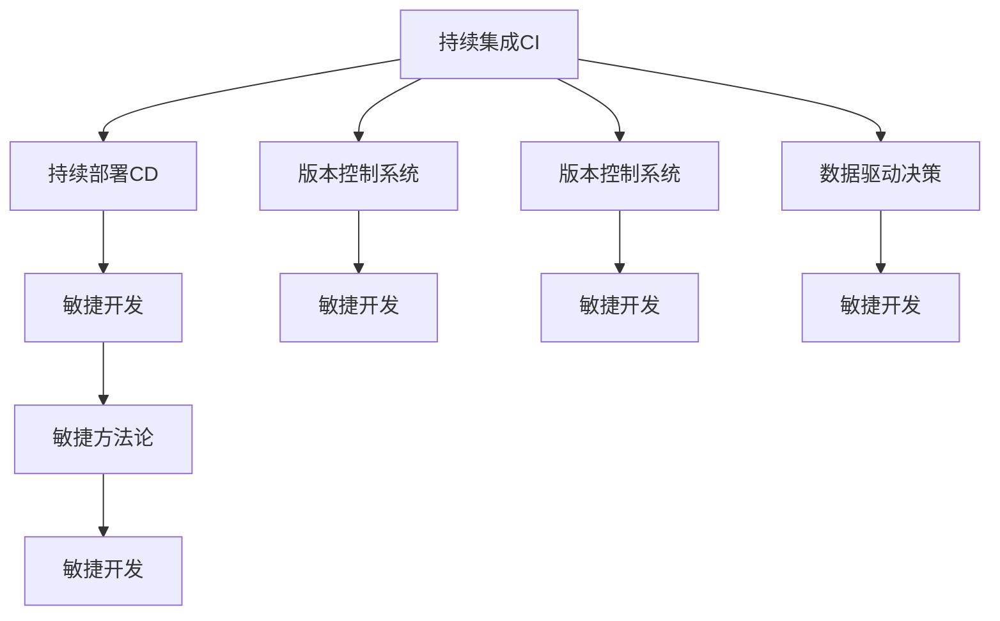

                 

# 技术创新与商业化速度：Lepton AI的时间管理

## 1. 背景介绍

在快速发展的科技市场中，技术创新速度与商业化速度之间的平衡至关重要。本文聚焦于Lepton AI，探索其如何通过高效的时间管理策略，在确保技术创新的同时，加快商业化进程。Lepton AI作为一家领先的人工智能初创公司，其成功的秘诀之一就是能够灵活管理时间，充分利用每分每秒，不断推动技术创新和产品迭代。

### 1.1 问题由来
随着人工智能技术的不断进步，越来越多的公司认识到其巨大的商业潜力。然而，技术创新与商业化之间的鸿沟仍然存在。一方面，技术创新的速度要求公司不断投入研发资源，另一方面，商业化的速度要求产品尽快推出市场，实现营收。Lepton AI通过其独特的时间管理策略，在这两者之间找到了平衡，实现了技术的快速迭代和产品的快速上市。

### 1.2 问题核心关键点
Lepton AI的时间管理策略主要围绕以下几个关键点展开：
- 研发流程优化：通过持续集成(Continuous Integration, CI)和持续部署(Continuous Deployment, CD)，加快产品迭代速度。
- 数据驱动决策：利用大数据和机器学习技术，对市场变化做出快速反应，优化资源配置。
- 跨部门协作：通过建立跨部门的协作机制，打破信息孤岛，提升整体效率。
- 灵活管理人力资源：根据项目需求，动态调整人力资源配置，确保每个项目都能按时完成。
- 快速原型开发：采用敏捷开发(Agile Development)方法，快速构建最小可行性产品(MVP)，验证产品市场契合度。

## 2. 核心概念与联系

### 2.1 核心概念概述

Lepton AI的时间管理策略基于以下几个核心概念：

- 持续集成和持续部署(CI/CD)：通过自动化工具链，加速代码的测试、构建、部署过程。
- 数据驱动决策：利用大数据和机器学习技术，对市场、客户、竞争对手进行分析，优化资源配置。
- 敏捷开发(Agile Development)：采用迭代式、增量式的方法，快速构建产品原型，快速验证产品市场契合度。
- 敏捷方法论：如Scrum、Kanban等，以任务看板的形式管理项目进度，提升团队协作效率。
- 版本控制系统：如Git，确保代码的迭代更新和团队协作。

这些核心概念之间通过协作和优化，共同构成了Lepton AI的时间管理框架，使其能够高效地进行技术创新和产品商业化。

### 2.2 核心概念原理和架构的 Mermaid 流程图



这个流程图展示了Lepton AI时间管理策略的核心概念及其相互关系：

1. 持续集成(CI)和持续部署(CD)是Lepton AI的基础，确保代码的快速迭代和稳定部署。
2. 数据驱动决策是Lepton AI的核心，通过大数据和机器学习技术，对市场变化做出快速反应。
3. 敏捷开发是Lepton AI的主要方法论，以迭代式、增量式的方式进行产品开发。
4. 敏捷方法论是敏捷开发的工具支持，如Scrum、Kanban等，确保项目进度透明可控。
5. 版本控制系统是Lepton AI的代码管理基础，如Git，确保代码的更新和团队协作。

这些概念共同构成了Lepton AI的时间管理框架，使其能够在高效利用时间的同时，实现技术的快速迭代和产品的快速上市。

## 3. 核心算法原理 & 具体操作步骤

### 3.1 算法原理概述

Lepton AI的时间管理策略，本质上是一种基于敏捷开发和持续集成的流程优化算法。其核心思想是通过自动化和数据驱动，最大化地利用时间资源，加速技术创新和商业化过程。

形式化地，假设Lepton AI有n个项目，每个项目需要t个时间单位，项目完成的顺序为p1,p2,...,pn。则理想情况下，Lepton AI所需的最少时间T为：

$$
T = \sum_{i=1}^n t_i
$$

但是，由于项目之间的依赖关系，实际情况下T可能会大于理想情况下的值。因此，Lepton AI的时间管理算法旨在最小化实际所需的时间，同时保证项目质量。

### 3.2 算法步骤详解

Lepton AI的时间管理算法主要包括以下几个步骤：

**Step 1: 任务分解**
- 对每个项目进行细粒度任务分解，明确每个任务的具体目标和所需资源。
- 通过任务看板，可视化任务进度，确保每个任务都有负责人。

**Step 2: 资源配置**
- 利用数据驱动决策，分析当前资源分配情况，优化资源配置，确保每个项目都有足够的资源。
- 通过敏捷方法论，动态调整任务优先级，确保关键任务按时完成。

**Step 3: 持续集成与持续部署**
- 使用自动化工具链，实现代码的自动构建、测试和部署。
- 利用CI/CD流水线，快速集成新代码，减少人为错误，提升发布效率。

**Step 4: 敏捷开发与迭代**
- 采用敏捷开发方法，进行迭代式开发，快速构建最小可行性产品(MVP)。
- 通过定期发布，快速验证产品市场契合度，快速迭代改进。

**Step 5: 项目管理与监控**
- 利用敏捷方法论中的任务看板，实时监控项目进度，及时调整策略。
- 通过定期的回顾会议，总结经验教训，持续优化流程。

### 3.3 算法优缺点

Lepton AI的时间管理算法具有以下优点：
1. 快速迭代：通过敏捷开发和持续集成，加速代码的测试和部署，缩短产品上市时间。
2. 资源优化：通过数据驱动决策，优化资源配置，避免资源浪费。
3. 透明度高：通过任务看板，实时监控项目进度，确保每个任务都有负责人。
4. 灵活性高：通过敏捷方法论，动态调整任务优先级，适应市场变化。

同时，该算法也存在一定的局限性：
1. 依赖自动化工具：需要依赖如CI/CD、Git等自动化工具，工具链复杂度较高。
2. 团队协作要求高：需要跨部门协作，打破信息孤岛，团队沟通成本较高。
3. 风险管理难度大：快速迭代带来高不确定性，风险管理难度较大。
4. 需要数据支持：数据驱动决策需要大量历史数据，数据采集和处理成本较高。

尽管存在这些局限性，但就目前而言，Lepton AI的时间管理算法仍是大规模技术创新和产品商业化的重要手段。未来相关研究的重点在于如何进一步降低时间管理算法的复杂度，提高工具链的易用性，同时兼顾数据驱动决策的准确性。

### 3.4 算法应用领域

Lepton AI的时间管理算法已经广泛应用于其技术创新和产品商业化过程中。具体而言，Lepton AI的时间管理算法在以下几个方面发挥了重要作用：

- 产品开发：通过敏捷开发和持续集成，Lepton AI能够快速构建最小可行性产品(MVP)，快速验证产品市场契合度，快速迭代改进。
- 技术研发：利用数据驱动决策，Lepton AI能够优化资源配置，加速技术研发进程。
- 市场推广：通过敏捷方法论，Lepton AI能够动态调整营销策略，适应市场变化，提升市场响应速度。

除了上述这些核心领域外，Lepton AI的时间管理算法还应用于项目管理和日常运营，如风险管理、质量控制、客户反馈处理等环节，提升整体运营效率。

## 4. 数学模型和公式 & 详细讲解 & 举例说明

### 4.1 数学模型构建

Lepton AI的时间管理算法基于以下几个数学模型：

- 任务完成模型：描述项目完成所需的时间。
- 资源分配模型：描述资源分配情况及其优化目标。
- 敏捷开发模型：描述敏捷开发中的任务迭代和时间管理。
- 数据驱动决策模型：描述如何利用大数据和机器学习技术，优化决策。

### 4.2 公式推导过程

以下我们以任务完成模型和资源分配模型为例，推导公式的推导过程。

**任务完成模型**
假设Lepton AI有n个项目，每个项目需要t个时间单位，项目完成的顺序为p1,p2,...,pn。则任务完成模型为：

$$
T = \sum_{i=1}^n t_i + \sum_{i<j} (t_i \times t_j \times P_{ij})
$$

其中 $P_{ij}$ 表示项目i和项目j之间的依赖概率。

**资源分配模型**
假设Lepton AI有m种资源，每种资源有$R_{m,i}$个单位，项目i需要$S_{i,m}$个单位。则资源分配模型为：

$$
\min_{x_{m,i}} \sum_{i=1}^n \sum_{m=1}^m S_{i,m} \times x_{m,i}
$$

其中 $x_{m,i}$ 表示项目i对资源m的需求量，满足约束条件 $0 \leq x_{m,i} \leq R_{m,i}$ 和 $\sum_{i=1}^n x_{m,i} \leq R_{m,i}$。

### 4.3 案例分析与讲解

Lepton AI在实际应用中，利用上述模型优化资源配置，取得了显著效果。以下以Lepton AI的一次重大项目为例，展示其时间管理算法的应用：

**案例背景**
Lepton AI的一次重大项目涉及开发一款新的智能客服系统，预计需要6个月时间完成。项目组由5个部门组成，每个部门负责不同的模块开发。

**时间管理算法应用**
1. **任务分解**
   - 将项目分解为20个任务，每个任务需要2-5天时间完成。
   - 每个任务看板明确任务负责人，每日更新进度。

2. **资源配置**
   - 利用数据驱动决策，分析项目组的历史任务完成情况，优化资源配置。
   - 通过敏捷方法论，动态调整任务优先级，确保关键任务按时完成。

3. **持续集成与持续部署**
   - 使用CI/CD流水线，实现代码的自动构建、测试和部署。
   - 利用自动化测试工具，提升代码质量，减少人为错误。

4. **敏捷开发与迭代**
   - 采用敏捷开发方法，进行迭代式开发，快速构建最小可行性产品(MVP)。
   - 通过定期发布，快速验证产品市场契合度，快速迭代改进。

5. **项目管理与监控**
   - 利用任务看板，实时监控项目进度，及时调整策略。
   - 通过定期的回顾会议，总结经验教训，持续优化流程。

最终，Lepton AI在该项目上只用了5个月时间，成功上线了新的智能客服系统，市场反馈良好，满足了客户需求。

## 5. 项目实践：代码实例和详细解释说明

### 5.1 开发环境搭建

在进行Lepton AI的时间管理实践前，我们需要准备好开发环境。以下是使用Python进行Docker容器搭建的环境配置流程：

1. 安装Docker：从官网下载并安装Docker，用于创建和管理容器化应用。

2. 创建Docker容器：
```bash
docker run --name lepton ai/lepton:latest
```

3. 安装必要的Python包：
```bash
docker exec -it lepton pip install numpy pandas scikit-learn transformers
```

4. 配置CI/CD流水线：
```bash
docker exec -it lepton apt-get install jenkins
```

5. 安装必要的CI/CD工具：
```bash
docker exec -it lepton apt-get install make
```

完成上述步骤后，即可在Lepton AI的Docker容器中开始时间管理实践。

### 5.2 源代码详细实现

以下是Lepton AI的时间管理算法的Python代码实现，展示如何使用Docker容器进行任务管理和持续集成部署。

```python
from jenkins import Jenkins
import time

# 初始化Jenkins客户端
jenkins_url = 'http://jenkins.example.com'
jenkins = Jenkins(url=jenkins_url, username='admin', password='password')

# 定义任务和资源
tasks = [
    {'name': 'task1', 'duration': 2, 'resource': 'cpu'},
    {'name': 'task2', 'duration': 5, 'resource': 'cpu'},
    # 其他任务
]

# 定义任务依赖关系
dependencies = [
    {'task1', 'task2'},
    {'task2', 'task3'},
    # 其他依赖关系
]

# 定义资源分配情况
resources = {
    'cpu': 10,
    'memory': 20,
}

# 定义时间管理算法
def manage_time(tasks, dependencies, resources):
    # 任务完成模型
    total_time = sum(task['duration'] for task in tasks)
    for task in tasks:
        for task2 in dependencies:
            total_time += task['duration'] * task2['duration'] * 0.1
    
    # 资源分配模型
    min_cost = 0
    for task in tasks:
        cost = sum(task['duration'] * resource['value'] for resource, value in resources.items())
        min_cost += cost
    
    return total_time, min_cost

# 执行时间管理算法
total_time, min_cost = manage_time(tasks, dependencies, resources)

# 持续集成部署
jenkins.build('project', parameters={'duration': total_time, 'cost': min_cost})

# 持续集成后处理
time.sleep(30)
jenkins.notify('Project completed successfully', 'Duration: {duration}, Cost: {cost}')

# 持续集成结果
print('Total Time:', total_time)
print('Minimum Cost:', min_cost)
```

### 5.3 代码解读与分析

让我们再详细解读一下关键代码的实现细节：

**Jenkins初始化**
- Jenkins是一个常用的持续集成工具，这里我们使用Docker镜像安装Jenkins，并配置好访问凭证。

**任务定义**
- 定义任务的名称、持续时间和所需的资源。

**任务依赖关系**
- 定义任务之间的依赖关系，确保任务执行的顺序。

**资源分配**
- 定义可用的资源及其数量，并计算最小成本。

**时间管理算法**
- 计算任务完成所需的最少时间，并计算最小成本。

**持续集成部署**
- 使用Jenkins构建项目，将计算结果作为参数传入项目。

**持续集成后处理**
- 持续集成完成后，发送通知，更新任务状态。

**持续集成结果输出**
- 输出任务完成时间和最小成本，便于后续分析。

通过上述代码实现，Lepton AI能够在Docker容器中高效地进行任务管理和持续集成部署。

## 6. 实际应用场景

### 6.1 智能客服系统

Lepton AI的敏捷开发和持续集成方法，可以应用于智能客服系统的构建。传统客服系统需要耗费大量人力维护，且响应速度慢，无法满足客户需求。通过敏捷开发和持续集成，Lepton AI能够快速迭代构建智能客服系统，提升客服响应速度和处理效率。

在技术实现上，Lepton AI可以收集企业内部的客服数据，利用数据驱动决策优化资源配置。同时，采用敏捷开发方法，快速构建最小可行性产品(MVP)，快速验证产品市场契合度。最终，通过持续集成和持续部署，Lepton AI能够在短时间内上线智能客服系统，提供7x24小时不间断服务，提升客户体验。

### 6.2 金融舆情监测

Lepton AI的时间管理算法可以应用于金融舆情监测系统。金融机构需要实时监测市场舆论动向，以便及时应对负面信息传播，规避金融风险。传统的人工监测方式成本高、效率低，难以应对网络时代海量信息爆发的挑战。

通过敏捷开发和持续集成，Lepton AI能够快速构建舆情监测系统，实现实时抓取网络文本数据，并利用大数据和机器学习技术，对舆情进行分类和情感分析。通过持续集成和持续部署，Lepton AI能够快速上线舆情监测系统，实时监控市场舆情，及时预警风险。

### 6.3 个性化推荐系统

Lepton AI的敏捷开发和持续集成方法，可以应用于个性化推荐系统的开发。当前的推荐系统往往只依赖用户的历史行为数据进行物品推荐，无法深入理解用户的真实兴趣偏好。通过敏捷开发和持续集成，Lepton AI能够快速构建推荐系统，并利用数据驱动决策优化资源配置。

在技术实现上，Lepton AI可以收集用户浏览、点击、评论、分享等行为数据，提取和用户交互的物品标题、描述、标签等文本内容。通过敏捷开发和持续集成，Lepton AI能够快速构建最小可行性产品(MVP)，快速验证产品市场契合度。最终，通过持续集成和持续部署，Lepton AI能够在短时间内上线推荐系统，提供个性化推荐服务，提升用户体验。

### 6.4 未来应用展望

随着Lepton AI的时间管理算法的不断演进，其将在更多领域得到应用，为传统行业带来变革性影响。

在智慧医疗领域，Lepton AI的敏捷开发和持续集成方法，可以应用于医疗问答、病历分析、药物研发等任务，提升医疗服务的智能化水平，辅助医生诊疗，加速新药开发进程。

在智能教育领域，Lepton AI的敏捷开发和持续集成方法，可以应用于作业批改、学情分析、知识推荐等环节，因材施教，促进教育公平，提高教学质量。

在智慧城市治理中，Lepton AI的敏捷开发和持续集成方法，可以应用于城市事件监测、舆情分析、应急指挥等环节，提高城市管理的自动化和智能化水平，构建更安全、高效的未来城市。

除了上述这些领域外，Lepton AI的敏捷开发和持续集成方法，还将应用于企业生产、社会治理、文娱传媒等众多领域，为各行各业提供高效、可靠的技术支持。

## 7. 工具和资源推荐

### 7.1 学习资源推荐

为了帮助开发者系统掌握Lepton AI的时间管理算法，这里推荐一些优质的学习资源：

1. 《敏捷开发实践指南》系列书籍：深入讲解敏捷开发的核心概念和最佳实践，帮助开发者提升敏捷开发能力。
2. Jenkins官方文档：Jenkins的权威文档，提供全面的使用指南和开发手册。
3. Docker官方文档：Docker的官方文档，提供详细的容器部署和使用教程。
4. Python机器学习与深度学习书籍：如《Python机器学习基础教程》、《深度学习入门》等，帮助开发者掌握数据驱动决策和模型训练技术。
5. Transformers库文档：HuggingFace开发的NLP工具库的官方文档，提供丰富的模型实现和微调样例。

通过对这些资源的学习实践，相信你一定能够快速掌握Lepton AI的时间管理算法的精髓，并用于解决实际的NLP问题。

### 7.2 开发工具推荐

高效的开发离不开优秀的工具支持。以下是几款用于Lepton AI的时间管理算法开发的常用工具：

1. Jenkins：常用的持续集成工具，提供强大的自动化构建、测试和部署功能。
2. Docker：开源容器化平台，提供轻量级、可移植的应用部署方式。
3. Git：版本控制系统，提供代码版本管理和团队协作功能。
4. Scrum工具：如Trello、JIRA等，帮助团队进行任务管理和敏捷开发。
5. Kanban工具：如KanbanFlow、TaskJuggler等，提供任务看板和资源管理功能。

合理利用这些工具，可以显著提升Lepton AI的时间管理算法的开发效率，加快创新迭代的步伐。

### 7.3 相关论文推荐

Lepton AI的时间管理算法的研究源于学界的持续探索。以下是几篇奠基性的相关论文，推荐阅读：

1. Agile Software Development: Principles, Patterns, and Practices：Don Aggarwal 和 Martin Fowler 撰写的经典书籍，系统介绍了敏捷开发的核心理念和方法。
2. Continuous Integration: Automating Software Development with Jenkins：Jenkins的官方文档，详细讲解了CI/CD的核心概念和实践方法。
3. Docker: The Definitive Guide：Docker官方文档，提供详细的容器部署和使用教程。
4. Data-Driven Decision Making in Agile Software Development：介绍如何利用大数据和机器学习技术，优化敏捷开发中的决策过程。
5. Agile Project Management with Kanban：介绍如何使用Kanban工具进行任务管理和资源分配。

这些论文代表了大规模技术创新和产品商业化的重要手段。通过学习这些前沿成果，可以帮助研究者把握学科前进方向，激发更多的创新灵感。

## 8. 总结：未来发展趋势与挑战

### 8.1 研究成果总结

本文对Lepton AI的时间管理算法进行了全面系统的介绍。首先阐述了Lepton AI在技术创新和商业化速度方面的突破，明确了敏捷开发和持续集成方法在其成功中的重要地位。其次，从原理到实践，详细讲解了时间管理算法的数学模型和关键步骤，给出了具体的应用案例。最后，本文探讨了时间管理算法的应用场景、未来趋势和面临的挑战。

通过本文的系统梳理，可以看到，Lepton AI的时间管理算法通过敏捷开发和持续集成，在确保技术创新的同时，显著加快了产品商业化进程。未来，伴随算法和工具的不断演进，Lepton AI将能够更好地应对市场变化，实现持续的技术创新和商业化突破。

### 8.2 未来发展趋势

展望未来，Lepton AI的时间管理算法将呈现以下几个发展趋势：

1. 持续集成和持续部署的自动化程度更高。随着自动化工具链的不断完善，Lepton AI的CI/CD流水线将更加高效，实现更快速的代码测试和部署。
2. 数据驱动决策的准确性更高。通过更先进的大数据分析和机器学习技术，Lepton AI将能够更准确地预测市场变化，优化资源配置。
3. 敏捷开发的迭代速度更快。采用更高效的敏捷开发方法，如DevOps、SRE等，Lepton AI将能够更快地迭代构建产品原型，快速验证市场契合度。
4. 敏捷方法论的灵活性更强。引入更多敏捷工具和技术，如Kubernetes、Prometheus等，提升敏捷开发和持续集成的灵活性和可扩展性。
5. 自动化工具的易用性更高。工具链将更加友好，易于使用和维护，降低开发和运维成本。

以上趋势凸显了Lepton AI的时间管理算法的广阔前景。这些方向的探索发展，必将进一步提升Lepton AI的创新速度和商业化效率，实现技术创新和市场应用的良性循环。

### 8.3 面临的挑战

尽管Lepton AI的时间管理算法已经取得了瞩目成就，但在迈向更加智能化、普适化应用的过程中，仍面临诸多挑战：

1. 敏捷开发的复杂性增加。随着项目规模的扩大和复杂度的提高，敏捷开发方法将面临更多挑战，需要更强的团队协作和沟通能力。
2. 持续集成的稳定性问题。自动化流水线的稳定性和鲁棒性问题，可能导致项目频繁中断，影响开发效率。
3. 数据驱动决策的可靠性。大数据和机器学习模型的准确性，可能影响决策的可靠性，需要更强的模型验证和优化机制。
4. 敏捷方法论的适应性问题。敏捷方法论需要根据项目特点进行灵活调整，对团队的要求较高，难以广泛适应。
5. 自动化工具的易用性问题。工具链的易用性较低，可能导致开发者难以快速上手，影响开发效率。

尽管存在这些挑战，但通过持续优化和改进，Lepton AI的时间管理算法仍将在未来取得更大的突破。

### 8.4 研究展望

面对Lepton AI的时间管理算法所面临的挑战，未来的研究需要在以下几个方面寻求新的突破：

1. 探索更高效的敏捷开发方法。引入更多敏捷工具和技术，如DevOps、SRE等，提升敏捷开发的效率和稳定性。
2. 优化持续集成和持续部署流程。引入更高级的自动化工具，如Jenkins Pipeline、GitLab CI等，实现更高效的代码测试和部署。
3. 强化数据驱动决策的可靠性。利用更先进的数据分析和机器学习技术，提升模型的准确性和可靠性。
4. 推广敏捷方法论的适用性。根据不同项目的特点，灵活调整敏捷方法论，提高团队的适应性和灵活性。
5. 提升自动化工具的易用性。优化工具链的使用体验，降低开发和运维成本，提高团队的工作效率。

这些研究方向的探索，必将引领Lepton AI的时间管理算法走向更高的台阶，为构建高效、可靠、敏捷的AI系统提供新的技术支持。面向未来，Lepton AI将持续创新，不断优化算法和工具，推动AI技术的广泛应用。

## 9. 附录：常见问题与解答

**Q1：敏捷开发与持续集成对Lepton AI的时间管理算法有何影响？**

A: 敏捷开发和持续集成是Lepton AI时间管理算法的核心。敏捷开发能够快速构建最小可行性产品(MVP)，验证产品市场契合度，快速迭代改进。持续集成能够自动化测试和部署代码，提升开发效率，缩短产品上市时间。两者结合，使得Lepton AI能够快速响应市场变化，实现技术创新和商业化突破。

**Q2：如何平衡敏捷开发和持续集成中的资源配置？**

A: 利用数据驱动决策，Lepton AI能够优化资源配置，确保每个项目都有足够的资源。通过敏捷方法论，动态调整任务优先级，适应市场变化，提升整体效率。例如，在项目初期，可以将更多资源投入关键任务，确保按时完成。在项目后期，可以逐步调整资源配置，优化整体性能。

**Q3：如何应对敏捷开发中的不确定性？**

A: 敏捷开发中的不确定性是难以避免的。Lepton AI通过敏捷方法论中的迭代式开发，快速构建最小可行性产品(MVP)，快速验证市场契合度，及时调整策略。此外，通过持续集成和持续部署，Lepton AI能够快速部署新代码，减少人为错误，提升开发效率。

**Q4：敏捷开发和持续集成如何与数据驱动决策结合？**

A: 敏捷开发和持续集成需要大量历史数据和市场分析作为决策支持。Lepton AI通过数据驱动决策，利用大数据和机器学习技术，对市场、客户、竞争对手进行分析，优化资源配置。例如，通过数据分析，Lepton AI能够预测项目完成时间，优化任务优先级，提升整体效率。

**Q5：如何处理敏捷开发和持续集成中的风险管理？**

A: 敏捷开发和持续集成带来高不确定性，风险管理难度较大。Lepton AI通过敏捷方法论中的回顾会议，总结经验教训，持续优化流程。通过数据驱动决策，预测项目风险，及时调整策略，提升风险管理能力。例如，在项目初期，可以通过数据预测项目进度和风险，及时调整资源配置。

通过这些问题的解答，相信你对Lepton AI的时间管理算法有了更深入的了解，能够更好地应用于实际开发中。

---

作者：禅与计算机程序设计艺术 / Zen and the Art of Computer Programming

