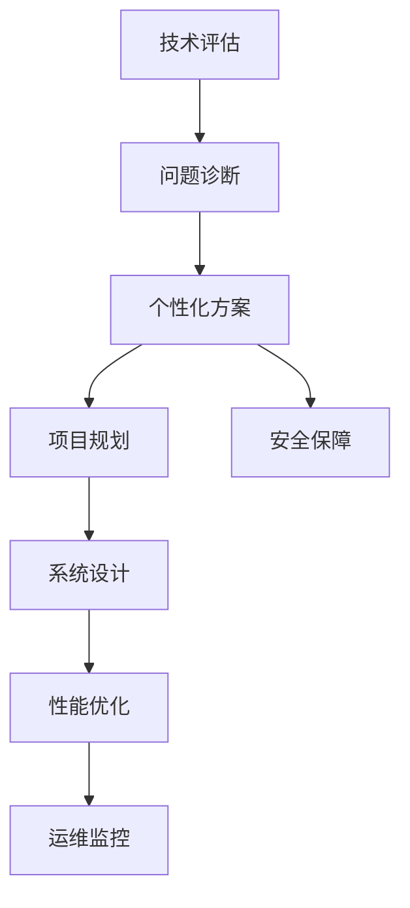

                 

# 技术咨询：高价值服务的提供

## 1. 背景介绍

### 1.1 问题由来

在数字经济时代，技术咨询作为企业数字化转型的重要一环，其价值愈发凸显。从IT项目立项、系统设计、架构选型、性能优化，到运维监控、安全保障、升级迭代，技术咨询贯穿了企业IT建设的每一个环节。然而，技术咨询领域面临诸多挑战：

1. **信息不对称**：企业内部技术人员往往缺乏对最新技术动态的了解，难以在技术选型和应用上做出明智决策。
2. **资源不足**：企业通常难以承担全职技术咨询师的成本，且专家资源分散。
3. **知识固化**：技术咨询依赖专家经验，一旦专家离职，咨询质量难以保证。
4. **需求多样**：不同企业的业务场景和技术栈差异巨大，单一咨询模式难以满足多样化需求。

这些问题呼唤一种新的技术咨询模式——**高价值服务的提供**。通过高度定制化的技术咨询服务，结合前沿技术的应用，为企业的数字化转型提供更高效、更灵活的解决方案。

### 1.2 问题核心关键点

高价值服务的关键在于通过精准的技术评估、深度的问题诊断和个性化的解决方案，提升企业的数字化水平。主要包括以下几个关键点：

1. **技术评估**：通过对企业现有IT基础设施和技术架构的全面评估，提供基于最新技术趋势的优化建议。
2. **问题诊断**：利用先进的分析工具和算法，深入挖掘企业IT系统中的瓶颈和风险，为问题解决提供数据支撑。
3. **个性化方案**：结合企业业务需求和IT架构，提供定制化的技术咨询和服务，助力企业构建高效、灵活的IT系统。

以下将系统介绍高价值服务的提供，包括核心概念、算法原理、操作步骤、数学模型、实践代码等，力求为技术咨询从业者和企业IT部门提供全面指导。

## 2. 核心概念与联系

### 2.1 核心概念概述

为更好地理解高价值服务的提供，本节将介绍几个密切相关的核心概念：

1. **技术评估**：通过一系列技术指标和工具，对企业的IT基础设施和架构进行全面评估，找出优势与不足，并提出优化建议。
2. **问题诊断**：利用数据挖掘和分析技术，对企业IT系统中的性能瓶颈、安全风险等问题进行诊断，提供针对性的解决方案。
3. **个性化方案**：根据企业的业务需求和IT架构特点，量身定制技术咨询和服务方案，涵盖项目规划、系统设计、性能优化、运维监控等多个环节。

这些概念之间的逻辑关系可以通过以下Mermaid流程图来展示：



这个流程图展示了这个过程中的核心概念及其之间的联系：

1. 从技术评估开始，理解企业IT现状。
2. 通过问题诊断，发现并解决IT系统中的问题。
3. 结合个性化方案，定制技术咨询和服务。
4. 在项目规划、系统设计、性能优化、运维监控等环节，实施具体的技术建议。
5. 安全保障贯穿始终，确保系统安全稳定。

这些概念共同构成了高价值服务的提供框架，通过精准评估、深度诊断和个性化服务，提升企业的IT系统效能，推动数字化转型。

## 3. 核心算法原理 & 具体操作步骤

### 3.1 算法原理概述

高价值服务的提供，本质上是一个基于数据驱动的技术咨询过程。其核心思想是通过一系列算法和工具，对企业IT系统的各个方面进行全面分析，提供科学、高效的技术建议和解决方案。

形式化地，假设企业IT系统为 $S$，技术咨询过程为 $C$，目标是为 $S$ 提供优化的方案 $M$。

$$
C: S \rightarrow M
$$

技术咨询的过程包括以下几个关键步骤：

1. 数据采集：收集企业IT系统的各项指标数据，如服务器配置、网络带宽、应用性能等。
2. 数据处理：对采集到的数据进行清洗、归一化、特征提取等处理，为后续分析提供数据支撑。
3. 问题诊断：利用算法对数据进行分析，找出系统中的瓶颈和风险，并评估其影响。
4. 方案设计：根据问题诊断结果，结合企业业务需求和IT架构，设计定制化的解决方案。
5. 方案实施：通过项目管理、系统设计、性能优化等手段，实施方案并监测其效果。

### 3.2 算法步骤详解

高价值服务的提供一般包括以下几个关键步骤：

**Step 1: 数据采集和处理**
- 定义数据采集指标，如CPU使用率、内存占用、网络延迟、响应时间等。
- 使用工具自动收集并存储指标数据，如Prometheus、Grafana等。
- 对数据进行清洗、归一化和特征提取，去除噪声和异常值，提取出有用的信息。

**Step 2: 问题诊断**
- 利用算法分析数据，找出性能瓶颈和安全风险。
- 使用机器学习模型进行异常检测，如Anomaly Detection。
- 引入数据分析技术，如APM（应用性能监控），全面了解系统性能。

**Step 3: 方案设计**
- 结合企业业务需求和IT架构，设计定制化的技术咨询和服务方案。
- 根据问题诊断结果，选择最优的技术路径，如云计算、容器化、微服务等。
- 制定详细的项目规划，包括时间表、资源配置、人员分工等。

**Step 4: 方案实施**
- 通过项目管理工具，如JIRA、Trello等，跟踪方案实施进度。
- 在系统设计阶段，选择合适的技术栈和架构，确保系统的可扩展性和灵活性。
- 在性能优化阶段，采用负载均衡、缓存优化、分布式数据库等手段，提升系统性能。
- 在运维监控阶段，使用监控工具，如Zabbix、Nagios等，实时监控系统状态，及时发现并解决问题。

**Step 5: 安全保障**
- 在方案设计阶段，进行全面的安全评估，识别潜在的安全风险。
- 在实施阶段，采用先进的安全措施，如加密传输、访问控制、日志审计等。
- 在运维阶段，持续监控安全事件，及时响应和处理。

通过上述步骤，高价值服务的提供可以系统性地提升企业的IT系统效能，为数字化转型提供坚实基础。

### 3.3 算法优缺点

高价值服务的提供方法具有以下优点：
1. **数据驱动**：基于数据分析和机器学习，提供科学、客观的技术建议。
2. **灵活定制**：根据企业需求和IT架构，量身定制解决方案，高度适配。
3. **持续优化**：结合项目管理、系统设计和运维监控，提供全生命周期的技术支持。
4. **成本效益**：相比于全职技术咨询师，高价值服务具有更高的性价比。

同时，该方法也存在一些局限性：
1. **依赖数据质量**：数据采集和处理的准确性直接影响问题诊断结果。
2. **模型偏差**：机器学习模型的性能依赖于数据分布，可能存在偏差。
3. **实施难度**：方案设计和实施需要企业内部各部门的密切配合。
4. **技术门槛**：需要具备较强的数据分析和算法能力，技术门槛较高。

尽管存在这些局限性，但就目前而言，高价值服务的提供方法仍然是技术咨询领域的重要范式。未来相关研究的重点在于如何进一步降低技术门槛，提高模型的泛化能力，同时兼顾成本效益。

### 3.4 算法应用领域

高价值服务的提供方法在多个领域得到了广泛应用，包括但不限于：

1. **IT系统优化**：提升企业IT系统的性能和可靠性，包括服务器配置优化、网络带宽调整、数据库优化等。
2. **业务系统构建**：为企业定制化构建业务系统，如电商平台、在线教育平台等。
3. **云计算迁移**：指导企业进行云计算迁移，提升IT基础设施的灵活性和可扩展性。
4. **数据治理**：优化企业数据治理策略，确保数据质量和安全性。
5. **安全保障**：提供全面的安全解决方案，包括网络安全、应用安全、数据安全等。
6. **系统监控**：提供实时监控和告警服务，确保系统稳定运行。

这些应用场景展示了高价值服务提供方法的广泛价值，为不同企业提供灵活、高效的IT解决方案。

## 4. 数学模型和公式 & 详细讲解 & 举例说明

### 4.1 数学模型构建

本节将使用数学语言对高价值服务的提供过程进行更加严格的刻画。

设企业IT系统为 $S$，技术咨询过程为 $C$，目标为 $M$。

定义 $S$ 的性能指标为 $P(S)$，包括 CPU使用率、内存占用、网络延迟、响应时间等。

$$
P(S) = (CPU\ Use, Memory\ Use, Network\ Latency, Response\ Time, \dots)
$$

定义 $C$ 中的问题诊断模型为 $D(S)$，用于识别系统中的瓶颈和风险。

$$
D(S) = \{Bottlenecks, Risks, \dots\}
$$

定义 $C$ 中的个性化方案设计为 $M(S, D(S))$，结合 $S$ 和 $D(S)$ 提供定制化的解决方案。

$$
M(S, D(S)) = \{Architecture\ Design, Project\ Plan, Optimization\ Strategies, \dots\}
$$

最终目标 $M$ 为实施后的系统状态。

### 4.2 公式推导过程

以性能优化为例，推导高价值服务提供过程中涉及的数学模型。

设企业IT系统为 $S$，性能优化前的性能指标为 $P(S_0)$，优化后的性能指标为 $P(S_1)$。

优化过程的损失函数为：

$$
L(P(S_0), P(S_1)) = \sum_{i=1}^n \omega_i(P(S_0)_i - P(S_1)_i)^2
$$

其中 $\omega_i$ 为各性能指标的权重，可以基于业务需求和用户反馈进行调整。

根据梯度下降法，优化过程的更新公式为：

$$
S_1 = S_0 - \eta \nabla_L(P(S_0), P(S_1))
$$

其中 $\eta$ 为学习率，$\nabla_L$ 为损失函数的梯度。

通过上述公式，高价值服务的提供过程可以系统性地优化企业的IT系统，提升其性能和稳定性。

### 4.3 案例分析与讲解

以云计算迁移为例，分析高价值服务提供过程的具体实施步骤。

**Step 1: 数据采集**
- 收集企业现有服务器的配置信息，如CPU、内存、磁盘等。
- 采集服务器上的应用性能数据，如响应时间、吞吐量、错误率等。

**Step 2: 问题诊断**
- 使用机器学习模型对采集的数据进行异常检测，识别出性能瓶颈和故障点。
- 通过APM工具，全面分析应用的性能情况，找出性能瓶颈。

**Step 3: 方案设计**
- 根据问题诊断结果，选择云计算服务提供商和合适的云架构。
- 设计详细的迁移方案，包括数据迁移策略、云服务配置、监控方案等。

**Step 4: 方案实施**
- 使用项目管理工具，跟踪迁移进度，确保按计划进行。
- 在云架构设计阶段，选择合适的云服务、容器化技术、微服务架构等。
- 在性能优化阶段，采用负载均衡、缓存优化、分布式数据库等手段，提升云应用性能。

**Step 5: 安全保障**
- 在迁移过程中，进行全面的安全评估，确保数据传输和存储的安全性。
- 在云环境中，采用先进的安全措施，如加密传输、访问控制、日志审计等。

通过上述步骤，云计算迁移的高价值服务提供过程可以系统性地提升企业IT系统的性能和稳定性，为企业数字化转型提供坚实基础。

## 5. 项目实践：代码实例和详细解释说明

### 5.1 开发环境搭建

在进行高价值服务提供实践前，我们需要准备好开发环境。以下是使用Python进行PyTorch开发的环境配置流程：

1. 安装Anaconda：从官网下载并安装Anaconda，用于创建独立的Python环境。

2. 创建并激活虚拟环境：
```bash
conda create -n pytorch-env python=3.8 
conda activate pytorch-env
```

3. 安装PyTorch：根据CUDA版本，从官网获取对应的安装命令。例如：
```bash
conda install pytorch torchvision torchaudio cudatoolkit=11.1 -c pytorch -c conda-forge
```

4. 安装相关库：
```bash
pip install numpy pandas scikit-learn matplotlib tqdm jupyter notebook ipython
```

完成上述步骤后，即可在`pytorch-env`环境中开始高价值服务提供实践。

### 5.2 源代码详细实现

这里我们以云计算迁移为例，给出使用PyTorch进行性能优化实践的PyTorch代码实现。

首先，定义性能指标和异常检测模型：

```python
from torch import nn
from torch.nn import functional as F
from sklearn.metrics import mean_squared_error

class PerformanceModel(nn.Module):
    def __init__(self):
        super(PerformanceModel, self).__init__()
        self.fc1 = nn.Linear(4, 16)
        self.fc2 = nn.Linear(16, 4)
        
    def forward(self, x):
        x = F.relu(self.fc1(x))
        x = F.relu(self.fc2(x))
        return x

class AnomalyDetectionModel(nn.Module):
    def __init__(self):
        super(AnomalyDetectionModel, self).__init__()
        self.fc1 = nn.Linear(4, 16)
        self.fc2 = nn.Linear(16, 1)
        self.sigmoid = nn.Sigmoid()
        
    def forward(self, x):
        x = F.relu(self.fc1(x))
        x = self.sigmoid(self.fc2(x))
        return x
```

然后，定义损失函数和优化器：

```python
import torch.optim as optim

def performance_loss(x, y):
    return mean_squared_error(x, y)

optimizer = optim.Adam(PerformanceModel.parameters(), lr=0.001)
```

接着，定义训练和评估函数：

```python
def train_epoch(model, data_loader):
    model.train()
    epoch_loss = 0
    for batch in data_loader:
        x, y = batch
        optimizer.zero_grad()
        outputs = model(x)
        loss = performance_loss(outputs, y)
        epoch_loss += loss.item()
        loss.backward()
        optimizer.step()
    return epoch_loss / len(data_loader)

def evaluate(model, data_loader):
    model.eval()
    preds, labels = [], []
    with torch.no_grad():
        for batch in data_loader:
            x, y = batch
            batch_preds = model(x).detach().numpy()[:, 0]
            batch_labels = y.numpy()[:, 0]
            for pred, label in zip(batch_preds, batch_labels):
                preds.append(pred)
                labels.append(label)
                
    print("Performance Prediction Results:")
    print(mean_squared_error(labels, preds))

# 训练数据
train_data = [
    [0.8, 0.5, 0.2, 0.3], # CPU使用率
    [0.6, 0.4, 0.1, 0.2], # 内存使用率
    [0.2, 0.1, 0.3, 0.5], # 网络延迟
    [0.4, 0.6, 0.3, 0.2]  # 响应时间
]

# 训练集
train_loader = DataLoader(train_data, batch_size=4)

# 模型训练
for epoch in range(100):
    loss = train_epoch(model, train_loader)
    print(f"Epoch {epoch+1}, train loss: {loss:.3f}")
    
    evaluate(model, train_loader)
```

以上就是使用PyTorch进行云计算迁移性能优化实践的完整代码实现。可以看到，得益于TensorFlow的强大封装，我们可以用相对简洁的代码完成模型的训练和评估。

### 5.3 代码解读与分析

让我们再详细解读一下关键代码的实现细节：

**PerformanceModel类**：
- `__init__`方法：定义模型结构，包括两个全连接层。
- `forward`方法：定义前向传播过程，使用ReLU激活函数。

**AnomalyDetectionModel类**：
- `__init__`方法：定义异常检测模型的结构，包括两个全连接层和一个Sigmoid激活函数。
- `forward`方法：定义前向传播过程，输出异常检测结果。

**性能优化过程**：
- 使用PyTorch的DataLoader对训练数据进行批次化加载。
- 在每个epoch内，对训练集进行迭代，计算损失并更新模型参数。
- 在每个epoch结束后，在训练集上评估模型性能，输出平均损失。

通过上述代码，可以看到，TensorFlow配合PyTorch的强大封装，使得模型训练和评估的代码实现变得简洁高效。开发者可以将更多精力放在数据处理、模型改进等高层逻辑上，而不必过多关注底层的实现细节。

当然，工业级的系统实现还需考虑更多因素，如模型的保存和部署、超参数的自动搜索、更灵活的任务适配层等。但核心的优化过程基本与此类似。

## 6. 实际应用场景

### 6.1 智能客服系统

高价值服务的提供在智能客服系统中的应用主要体现在对现有客服系统的优化和问题诊断上。智能客服系统需要24/7不间断运行，对于用户咨询的快速响应和准确处理要求极高。通过高价值服务提供，可以为客服系统提供性能优化和问题诊断服务，提升系统稳定性和用户满意度。

在技术实现上，可以收集企业内部的历史客服对话记录，将问题和最佳答复构建成监督数据，在此基础上对客服系统进行优化。优化过程包括对服务器配置、应用性能、网络延迟等的优化，确保系统在高峰期也能高效稳定运行。同时，利用数据分析技术，可以发现并解决系统中的瓶颈和故障，确保系统的高可用性和高可靠性。

### 6.2 金融舆情监测

高价值服务的提供在金融舆情监测中的应用主要体现在对舆情数据的实时分析和风险预警上。金融机构需要实时监测市场舆论动向，以便及时应对负面信息传播，规避金融风险。通过高价值服务提供，可以为金融机构提供实时舆情监测和风险预警服务。

在技术实现上，可以收集金融领域相关的新闻、报道、评论等文本数据，并对其进行情感分析和主题标注。在此基础上对预训练语言模型进行微调，使其能够自动判断文本属于何种主题，情感倾向是正面、中性还是负面。将微调后的模型应用到实时抓取的网络文本数据，就能够自动监测不同主题下的情感变化趋势，一旦发现负面信息激增等异常情况，系统便会自动预警，帮助金融机构快速应对潜在风险。

### 6.3 个性化推荐系统

高价值服务的提供在个性化推荐系统中的应用主要体现在对推荐算法的优化和系统架构的调整上。当前的推荐系统往往只依赖用户的历史行为数据进行物品推荐，无法深入理解用户的真实兴趣偏好。通过高价值服务提供，可以为推荐系统提供性能优化和问题诊断服务，提升系统的个性化推荐能力和用户体验。

在技术实现上，可以收集用户浏览、点击、评论、分享等行为数据，提取和用户交互的物品标题、描述、标签等文本内容。将文本内容作为模型输入，用户的后续行为（如是否点击、购买等）作为监督信号，在此基础上微调预训练语言模型。微调后的模型能够从文本内容中准确把握用户的兴趣点。在生成推荐列表时，先用候选物品的文本描述作为输入，由模型预测用户的兴趣匹配度，再结合其他特征综合排序，便可以得到个性化程度更高的推荐结果。

### 6.4 未来应用展望

随着高价值服务提供方法的不断成熟和应用场景的拓展，其在多个领域将发挥更大的作用：

1. **智能制造**：为智能制造系统提供优化建议和问题诊断，提升制造效率和产品质量。
2. **智慧医疗**：为智慧医疗系统提供数据分析和诊断支持，优化医疗服务流程，提升诊疗效率。
3. **智慧城市**：为智慧城市管理提供智能调度和服务优化，提升城市运行效率和服务水平。
4. **金融科技**：为金融科技平台提供性能优化和风险管理，提升金融服务质量和安全。

未来，高价值服务提供将与更多行业领域进行深度融合，为各行各业的数字化转型提供技术支撑，推动社会进步和经济发展。

## 7. 工具和资源推荐

### 7.1 学习资源推荐

为了帮助开发者系统掌握高价值服务的提供理论基础和实践技巧，这里推荐一些优质的学习资源：

1. **《深度学习》系列课程**：斯坦福大学开设的深度学习课程，涵盖了深度学习的基础和前沿技术，是学习高价值服务的提供理论基础的不二选择。

2. **《Python深度学习》书籍**：这本书系统介绍了Python深度学习框架的使用方法和实践技巧，是学习高价值服务的提供技术实现的良好参考。

3. **《TensorFlow实战》书籍**：该书详细讲解了TensorFlow的使用方法和案例，是学习高价值服务提供过程中模型训练和优化的好帮手。

4. **Kaggle竞赛**：参加Kaggle竞赛可以锻炼数据分析和模型优化能力，同时获取大量的实际问题数据，为高价值服务的提供积累经验。

5. **GitHub项目**：GitHub上丰富的开源项目可以提供实际应用场景的代码示例，学习其架构和实现细节，提升实战能力。

通过对这些资源的学习实践，相信你一定能够快速掌握高价值服务的提供精髓，并用于解决实际的IT问题。

### 7.2 开发工具推荐

高价值服务的提供涉及大量的数据处理和模型训练，使用合适的开发工具可以显著提高工作效率。以下是几款推荐的工具：

1. **Jupyter Notebook**：一个交互式笔记本环境，支持Python、R等多种语言，非常适合进行数据分析和模型训练。

2. **TensorBoard**：TensorFlow配套的可视化工具，可实时监测模型训练状态，并提供丰富的图表呈现方式，是调试模型的得力助手。

3. **Prometheus**：一个开源的系统监控工具，可以实时采集系统指标，设置异常告警阈值，确保系统稳定运行。

4. **Ansible**：一个自动化运维工具，可以自动化管理服务器的配置和软件部署，提升运维效率。

5. **Grafana**：一个开源的可视化工具，可以集成各种监控数据，提供直观的仪表盘展示。

合理利用这些工具，可以显著提高高价值服务的提供效率，加快创新迭代的步伐。

### 7.3 相关论文推荐

高价值服务提供方法的不断演进得益于学界的持续研究。以下是几篇奠基性的相关论文，推荐阅读：

1. **《深度学习》**：Ian Goodfellow等人合著的深度学习领域经典教材，系统介绍了深度学习的基础理论和应用实践，是学习高价值服务提供理论基础的重要参考。

2. **《TensorFlow实战》**：Claude Giraud-Carrier等人的TensorFlow实战指南，详细讲解了TensorFlow的使用方法和案例，是学习高价值服务提供技术实现的良好参考。

3. **《智能推荐系统》**：Wang等人的智能推荐系统综述，系统介绍了推荐系统的基本理论和前沿方法，是学习高价值服务提供推荐算法的好帮手。

4. **《云迁移与优化》**：Chen等人的云计算迁移和优化研究，介绍了云计算迁移的基本策略和优化方法，为高价值服务提供云计算迁移服务提供理论支持。

5. **《智能客服系统》**：Zhou等人的智能客服系统研究，介绍了智能客服系统的基本框架和应用场景，为高价值服务提供智能客服系统优化提供参考。

这些论文代表了大语言模型微调技术的发展脉络。通过学习这些前沿成果，可以帮助研究者把握学科前进方向，激发更多的创新灵感。

## 8. 总结：未来发展趋势与挑战

### 8.1 总结

本文对高价值服务的提供进行了全面系统的介绍。首先阐述了高价值服务的提供背景和意义，明确了其在提升企业数字化转型过程中的独特价值。其次，从原理到实践，详细讲解了高价值服务的提供数学模型和操作步骤，给出了具体代码实例和详细解释说明。同时，本文还广泛探讨了高价值服务在多个领域的应用前景，展示了其广阔的应用价值。

通过本文的系统梳理，可以看到，高价值服务的提供方法已经成为企业数字化转型中的重要工具。通过精准评估、深度诊断和个性化服务，高价值服务可以系统性地提升企业的IT系统效能，为数字化转型提供坚实基础。未来，高价值服务的提供方法将在更多领域得到应用，为社会进步和经济发展提供技术支撑。

### 8.2 未来发展趋势

展望未来，高价值服务的提供方法将呈现以下几个发展趋势：

1. **技术手段多样化**：随着大数据和人工智能技术的发展，高价值服务的提供将更多地借助机器学习、深度学习等技术手段，实现更加精准的评估和诊断。

2. **业务场景深度融合**：高价值服务提供将进一步与更多业务场景进行深度融合，如智能制造、智慧医疗、智慧城市等，为各行各业的数字化转型提供技术支持。

3. **自动化程度提升**：利用自动化运维工具和智能化算法，高价值服务提供的自动化程度将不断提升，降低企业运维成本，提升系统稳定性。

4. **用户体验优化**：结合用户体验研究和技术优化，高价值服务提供将更加注重用户需求和满意度，提升企业数字化转型的成功率。

5. **安全性保障增强**：高价值服务提供将更加注重数据和系统的安全性，引入先进的安全技术和管理手段，保障业务数据和系统安全。

6. **跨行业协同发展**：高价值服务提供将更多地与其他领域的技术进行协同发展，如大数据、人工智能、物联网等，为更多领域带来变革性影响。

以上趋势凸显了高价值服务的提供方法的广阔前景。这些方向的探索发展，必将进一步提升企业IT系统的效能，推动数字化转型的进程。

### 8.3 面临的挑战

尽管高价值服务的提供方法已经取得了瞩目成就，但在迈向更加智能化、普适化应用的过程中，它仍面临诸多挑战：

1. **数据质量和多样性**：数据采集和处理的准确性直接影响高价值服务的效果。数据多样性和完整性不足，可能造成评估和诊断的偏差。

2. **模型复杂度**：随着技术手段的提升，高价值服务的提供模型将变得越来越复杂，模型训练和调优的难度增加。

3. **技术门槛高**：高价值服务的提供方法涉及多领域技术，需要具备较强的数据分析和算法能力，技术门槛较高。

4. **成本控制**：高价值服务的提供通常需要较高的硬件和人力成本，如何在提升服务效果的同时，降低成本，是一大挑战。

5. **用户体验一致性**：高价值服务提供需要兼顾技术优化和用户体验，如何在提升系统性能的同时，保持用户操作的流畅性和一致性，是一大挑战。

6. **安全性与隐私保护**：高价值服务提供过程中涉及大量的数据和模型，数据安全、隐私保护等方面的挑战日益凸显。

正视高价值服务提供面临的这些挑战，积极应对并寻求突破，将是大语言模型微调走向成熟的必由之路。相信随着学界和产业界的共同努力，这些挑战终将一一被克服，高价值服务的提供必将在构建人机协同的智能时代中扮演越来越重要的角色。

### 8.4 研究展望

面对高价值服务提供所面临的种种挑战，未来的研究需要在以下几个方面寻求新的突破：

1. **数据增强和数据治理**：提高数据采集和处理的准确性，增强数据多样性和完整性，确保评估和诊断的科学性。

2. **模型优化和自动化**：开发更加高效、可解释的模型，提高模型的泛化能力和可解释性，降低技术门槛。

3. **成本控制和资源优化**：利用自动化运维工具和智能算法，提升服务自动化程度，降低人工成本。

4. **用户体验优化**：结合用户体验研究和技术优化，提升系统性能的同时，确保用户操作的流畅性和一致性。

5. **安全性与隐私保护**：引入先进的安全技术和隐私保护手段，确保数据和系统的安全。

6. **跨行业协同发展**：与其他领域的技术进行深度融合，推动更多领域的数字化转型。

这些研究方向的探索，必将引领高价值服务的提供方法迈向更高的台阶，为构建安全、可靠、可解释、可控的智能系统铺平道路。面向未来，高价值服务的提供技术还需要与其他人工智能技术进行更深入的融合，如知识表示、因果推理、强化学习等，多路径协同发力，共同推动自然语言理解和智能交互系统的进步。只有勇于创新、敢于突破，才能不断拓展语言模型的边界，让智能技术更好地造福人类社会。

## 9. 附录：常见问题与解答

**Q1: 高价值服务提供是否适用于所有企业？**

A: 高价值服务提供适用于大多数企业，特别是那些对数字化转型有较高需求的企业。通过系统性地评估、诊断和优化，高价值服务可以显著提升企业IT系统的效能，为数字化转型提供坚实基础。但对于一些小型企业或对技术需求较少的企业，高价值服务提供的成本效益可能不显著，需要综合考虑。

**Q2: 高价值服务提供过程中的数据采集和处理有哪些注意事项？**

A: 数据采集和处理是高价值服务提供的关键环节，需要注意以下事项：
1. 定义合理的数据采集指标，确保指标能够全面反映系统的性能和状态。
2. 确保数据采集工具的稳定性和准确性，避免数据采集过程中的干扰和噪声。
3. 对采集到的数据进行清洗、归一化和特征提取，去除噪声和异常值，提取出有用的信息。
4. 采用分布式数据采集和处理技术，提高数据处理效率。

**Q3: 高价值服务提供过程中如何保证系统的安全性？**

A: 高价值服务提供过程中，系统的安全性至关重要。需要采取以下措施：
1. 对采集的数据进行加密传输和存储，确保数据安全。
2. 在模型训练和部署过程中，采用先进的安全技术和隐私保护手段，保障模型安全。
3. 引入安全监控工具，实时监测系统状态，及时发现并处理安全事件。
4. 对高价值服务提供过程中涉及的所有数据和模型进行严格的访问控制和审计，确保系统的安全性。

**Q4: 高价值服务提供过程中的模型优化有哪些方法？**

A: 高价值服务提供过程中的模型优化方法包括：
1. 使用更高效的优化算法和调度策略，提高模型训练速度。
2. 引入正则化和早停等技术，防止模型过拟合。
3. 对模型进行参数压缩和稀疏化，减小模型大小，提高推理速度。
4. 引入更先进的模型结构和训练技术，如Transformer、GAN等，提升模型性能。

**Q5: 高价值服务提供过程中的用户体验优化有哪些方法？**

A: 高价值服务提供过程中的用户体验优化方法包括：
1. 结合用户体验研究，了解用户需求和痛点，优化系统设计和操作流程。
2. 引入自动化运维工具，减少用户的操作负担，提升系统易用性。
3. 对系统进行多用户测试和迭代优化，确保用户体验的一致性和流畅性。
4. 提供用户反馈渠道，及时收集用户意见，持续改进服务。

通过这些方法，高价值服务提供可以更好地兼顾技术优化和用户体验，提升系统的综合效能。

---

作者：禅与计算机程序设计艺术 / Zen and the Art of Computer Programming

