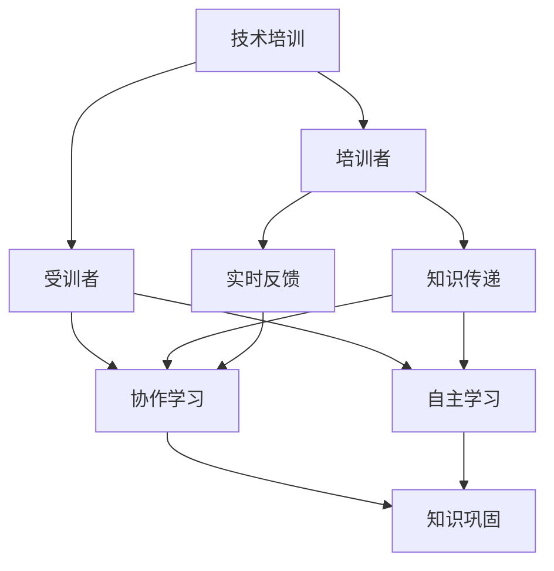

                 

# 技术培训：从受训者到培训者

> 关键词：技术培训, 受训者, 培训者, 知识传递, 教育技术, 终身学习

## 1. 背景介绍

### 1.1 问题由来
在当今快速变化的技术环境中，企业对技术人才的需求不断增长。然而，高水平的技术人才并不容易培养。传统的以教师为中心的培训方式，往往效果不佳，难以满足日益复杂的技术要求。随着在线教育、知识共享平台的兴起，利用技术手段进行自主学习和协作学习成为新的趋势。从受训者向培训者的转变，不仅是角色的转变，更是技术和知识的传递方式的革新。

### 1.2 问题核心关键点
本文聚焦于技术培训，特别是从受训者到培训者的转变。主要探讨以下核心问题：
- 培训过程中知识和技能的传递方式有哪些？
- 如何高效、有效地进行技术培训？
- 培训者的角色如何重塑？

## 2. 核心概念与联系

### 2.1 核心概念概述

为更好地理解技术培训的转变，本节将介绍几个密切相关的核心概念：

- 技术培训(Technical Training)：通过有组织的学习活动，提高个人或团队在技术领域的专业能力和实践技能。
- 受训者(Learner)：在技术培训过程中，通过学习、实践来提升自身技能和知识水平的人。
- 培训者(Trainer)：负责设计、实施和评估技术培训活动，引导受训者掌握技术知识和技能的个体或团队。
- 知识传递(Transfer of Knowledge)：从培训者到受训者，知识的传递过程。
- 协作学习(Collaborative Learning)：多个受训者共同参与、互动，共享学习资源，提高学习效果。
- 自主学习(Self-Learning)：受训者自主规划学习路径，利用在线资源、工具，独立进行知识学习。
- 实时反馈(Real-time Feedback)：在培训过程中，及时获取培训者的反馈，以改进学习效果。
- 知识巩固(Knowledge Reinforcement)：通过复习、实践，巩固学到的知识和技术技能。

这些核心概念之间的逻辑关系可以通过以下Mermaid流程图来展示：



这个流程图展示了一系列概念之间的联系：

1. 技术培训是整个学习过程的起点。
2. 受训者通过协作学习和自主学习获取知识。
3. 培训者负责设计培训方案，并通过知识传递引导受训者学习。
4. 实时反馈帮助受训者及时改进学习效果。
5. 知识巩固确保学到的知识能够长期保留和应用。

这些概念共同构成了技术培训的完整体系，使得从受训者到培训者的转变不仅仅是角色的变化，更是知识传递方式的变革。

## 3. 核心算法原理 & 具体操作步骤
### 3.1 算法原理概述

技术培训的核心目标是提升受训者的技术能力和实践技能。这通常通过以下步骤实现：

- 受训者通过学习获取新知识和技术。
- 受训者通过实践应用所学内容，增强技能。
- 培训者通过评估和反馈，引导受训者掌握关键技能。
- 受训者通过知识巩固，将所学内容转化为长期能力。

形式化地，假设技术培训的目标是使受训者掌握某项技能 $S$，则培训过程可以表示为：

$$
\text{Skill} = \text{Learner} \rightarrow \text{Trainer} \rightarrow \text{Knowledge} \rightarrow \text{Practice} \rightarrow \text{Feedback} \rightarrow \text{Reinforcement}
$$

其中，$\text{Skill}$ 表示受训者掌握的技能，$\text{Learner}$ 表示受训者，$\text{Trainer}$ 表示培训者，$\text{Knowledge}$ 表示培训过程中传递的知识，$\text{Practice}$ 表示受训者的实践活动，$\text{Feedback}$ 表示培训者提供的实时反馈，$\text{Reinforcement}$ 表示受训者对知识巩固的过程。

### 3.2 算法步骤详解

技术培训的过程可以分为以下几个关键步骤：

**Step 1: 需求分析**
- 确定培训目标和要求，明确受训者需要掌握的技能和知识。
- 评估受训者的基础能力和知识水平，制定个性化的培训计划。

**Step 2: 设计培训方案**
- 选择合适的培训内容和方法，如在线课程、实践项目、工作坊等。
- 设计培训路径和进度，包括理论学习、实践操作、知识巩固等环节。
- 确定培训资源，如培训工具、学习平台、教材等。

**Step 3: 实施培训**
- 根据培训方案，组织受训者进行学习，包括在线视频、课堂教学、文献阅读等。
- 引导受训者参与实践活动，如编程练习、实验操作、项目开发等。
- 培训者提供实时反馈，解答受训者疑问，指导实践活动。

**Step 4: 评估和改进**
- 通过测试、项目评审等方式评估受训者的学习效果，提供反馈和建议。
- 收集受训者的意见和建议，改进培训方案和教学方法。

**Step 5: 知识巩固和应用**
- 受训者通过复习、实践巩固所学内容，增强记忆和理解。
- 将所学知识应用于实际工作，提升技术能力。

### 3.3 算法优缺点

技术培训具有以下优点：
1. 提高受训者的技术能力和实践技能，促进个人职业发展。
2. 促进知识传播和技能传承，提升团队整体竞争力。
3. 提供个性化的学习路径，满足不同受训者的需求。
4. 利用在线资源和工具，提高培训的可及性和灵活性。

同时，技术培训也存在一些局限性：
1. 培训时间和成本较高，尤其是面对大规模的团队。
2. 受训者可能缺乏自驱力，难以完成自我激励的学习。
3. 培训内容和方法可能与实际工作脱节，影响培训效果。
4. 培训者的经验和技能可能制约培训的深度和广度。

尽管存在这些局限性，但技术培训仍然是提高技术能力和促进技术进步的重要手段。未来相关研究的方向是如何在提高效率的同时，更好地满足受训者的个性化需求，提升培训效果。

### 3.4 算法应用领域

技术培训在多个领域得到了广泛应用，包括但不限于：

- 软件开发：开发人员通过培训学习新的编程语言、框架和技术。
- 数据分析：数据科学家通过培训掌握数据处理、分析、可视化的新工具和方法。
- 网络安全：安全工程师通过培训学习最新的安全技术和工具，提升防护能力。
- 项目管理：项目经理通过培训学习项目管理、团队协作和沟通技巧。
- 人工智能：人工智能工程师通过培训学习深度学习、自然语言处理等前沿技术。

## 4. 数学模型和公式 & 详细讲解 & 举例说明

### 4.1 数学模型构建

本节将使用数学语言对技术培训的过程进行更加严格的刻画。

假设受训者在学习某项技能 $S$ 的过程中，学习效率和学习效果可以用数学模型来描述。设受训者的初始技能水平为 $s_0$，通过 $n$ 次培训后，技能水平提升至 $s_n$。则技能提升的数学模型可以表示为：

$$
s_n = s_0 + \sum_{i=1}^n f(s_i)
$$

其中 $f(s_i)$ 表示第 $i$ 次培训后技能水平提升的量。

### 4.2 公式推导过程

以下我们以编程技能培训为例，推导学习效果和培训时间的关系。

假设受训者每周进行 $k$ 次培训，每次培训时间 $t$，每次培训的效果为 $e_i$。则受训者在 $m$ 周后的技能水平提升为：

$$
s_m = s_0 + kmt
$$

设每次培训的效果为 $e_i$，则总培训效果为：

$$
\sum_{i=1}^m e_i = mt
$$

因此，技能提升的公式可以进一步表示为：

$$
s_m = s_0 + \sum_{i=1}^m e_i
$$

在实际应用中，$e_i$ 的计算取决于培训内容、培训方式和受训者的个体差异。通常，$e_i$ 可以通过测试、项目评审等方式来评估。

### 4.3 案例分析与讲解

**案例分析：软件开发人员培训**

假设一位软件开发人员初始技能水平为 $s_0=3$，经过 $n=10$ 次培训，每周培训 $k=3$ 次，每次培训时间 $t=2$ 小时，每次培训效果 $e_i$ 的期望值为 $0.1$，则 $m=4$ 周后的技能水平提升为：

$$
s_4 = 3 + 3 \times 4 \times 2 \times 0.1 = 5.2
$$

其中 $0.1$ 表示每次培训后技能提升的量，这是一个简化的数学模型，实际应用中可能需要更复杂的模型来描述学习效果。

## 5. 项目实践：代码实例和详细解释说明
### 5.1 开发环境搭建

在进行技术培训的项目实践前，我们需要准备好开发环境。以下是使用Python进行在线教育平台开发的环境配置流程：

1. 安装Anaconda：从官网下载并安装Anaconda，用于创建独立的Python环境。

2. 创建并激活虚拟环境：
```bash
conda create -n edx python=3.8 
conda activate edx
```

3. 安装Python在线教育平台开发所需的库：
```bash
pip install django psycopg2-binary scipy scikit-learn pydotplus jinja2
```

4. 安装在线教育平台后端框架：
```bash
pip install django[postgres] django-course
```

5. 安装前端框架：
```bash
npm install --save react react-dom react-router-dom
```

6. 安装数据库和服务器环境：
```bash
sudo apt-get install postgresql postgresql-contrib
sudo apt-get install python3-pg8
```

7. 安装并配置PostgreSQL：
```bash
sudo -u postgres psql
CREATE DATABASE training;
CREATE USER training WITH PASSWORD 'training';
ALTER USER training SET search_path TO training;
GRANT ALL PRIVILEGES ON DATABASE training TO training;
```

8. 安装完成后，启动PostgreSQL服务：
```bash
sudo systemctl start postgresql
sudo systemctl enable postgresql
```

完成上述步骤后，即可在`edx`环境中开始在线教育平台的开发实践。

### 5.2 源代码详细实现

这里我们以在线编程训练平台为例，展示如何使用Python进行技术培训的代码实现。

首先，定义训练课程类：

```python
class Course:
    def __init__(self, name, description, topics, pre_requisites):
        self.name = name
        self.description = description
        self.topics = topics
        self.pre_requisites = pre_requisites
        self.students = []
        self.assessments = []
    
    def add_student(self, student):
        self.students.append(student)
    
    def add_assessment(self, assessment):
        self.assessments.append(assessment)
```

然后，定义学生类：

```python
class Student:
    def __init__(self, name, skills, progress):
        self.name = name
        self.skills = skills
        self.progress = progress
    
    def update_skill(self, topic, level):
        self.skills[topic] = level
        self.progress[topic] += 1
```

接着，定义评估类：

```python
class Assessment:
    def __init__(self, topic, level, feedback):
        self.topic = topic
        self.level = level
        self.feedback = feedback
```

最后，定义在线教育平台类：

```python
class OnlineEduPlatform:
    def __init__(self):
        self.courses = []
    
    def add_course(self, course):
        self.courses.append(course)
    
    def train_student(self, student, course):
        course.add_student(student)
        for topic in course.topics:
            while student.skills[topic] < 5:
                assessment = self.generate_assessment(topic)
                course.add_assessment(assessment)
                student.update_skill(topic, student.skills[topic] + 1)
    
    def generate_assessment(self, topic):
        # 生成评估
        level = 1
        feedback = "Need more practice"
        return Assessment(topic, level, feedback)
```

以上就是使用Python进行在线教育平台开发的完整代码实现。可以看到，通过定义课程、学生和评估类，并实现相应的操作，我们可以构建一个简单的在线教育平台，实现技术培训和知识传递的功能。

### 5.3 代码解读与分析

让我们再详细解读一下关键代码的实现细节：

**Course类**：
- `__init__`方法：初始化课程的基本信息，包括课程名、描述、学习内容、前置要求。
- `add_student`方法：将学生添加到课程中。
- `add_assessment`方法：将评估添加到课程中。

**Student类**：
- `__init__`方法：初始化学生的基本信息，包括姓名、技能、进度。
- `update_skill`方法：更新学生在某个话题上的技能水平，并记录进度。

**Assessment类**：
- `__init__`方法：初始化评估的基本信息，包括评估内容、难度、反馈。

**OnlineEduPlatform类**：
- `__init__`方法：初始化在线教育平台，用于存储课程。
- `add_course`方法：将课程添加到平台中。
- `train_student`方法：根据课程，训练学生，更新学生的技能水平。
- `generate_assessment`方法：生成评估，用于在学生完成训练后进行反馈。

**训练流程**：
- 在在线教育平台中，通过`train_student`方法，将学生添加到课程中，并根据课程内容进行技能培训。
- 在每次训练后，通过`update_skill`方法，更新学生的技能水平和进度。
- 通过`generate_assessment`方法，生成评估，用于在学生完成训练后进行反馈。

在实际应用中，可能需要进一步优化和扩展该平台，如增加学员管理、学习进度统计、课程推荐等功能，以提供更加全面的在线教育服务。

## 6. 实际应用场景
### 6.1 在线教育平台

在线教育平台已成为技术培训的重要工具。传统的线下培训方式不仅成本高、效率低，还难以满足个性化学习需求。而在线教育平台通过互联网技术，打破了时间和空间的限制，提供了灵活、便捷的学习方式。

在实践中，可以通过开发在线教育平台，提供丰富的课程资源、互动教学功能，引导受训者自主学习和协作学习。平台还可以利用大数据和人工智能技术，实现个性化推荐、实时评估和反馈，提升学习效果。

### 6.2 企业内训

企业内训是提升员工技术能力和职业素养的重要手段。通过在线教育平台，企业可以快速部署大规模内训项目，实现高效率、低成本的技术培训。

企业内训通常涉及多个部门和岗位，需要制定多层次、多维度的培训计划。平台可以通过在线课程、虚拟工作坊、在线研讨等方式，满足不同层次和需求的培训需求。此外，平台还可以整合企业内部的技术文档、项目案例等资源，为员工提供丰富的学习材料。

### 6.3 社区培训

社区培训是社会化学习的重要形式，能够促进技术知识在社区内的传播和应用。通过在线教育平台，社区可以组织各类技术讲座、编程马拉松、开源项目等活动，鼓励社区成员共同学习和分享。

社区培训的组织者可以是技术爱好者、开源项目贡献者等，他们可以借助平台发布活动信息，组织线上线下活动，分享技术心得。平台还可以提供论坛、博客等社交功能，方便社区成员互动交流，增强学习效果。

## 7. 工具和资源推荐
### 7.1 学习资源推荐

为了帮助开发者掌握技术培训的理论与实践，这里推荐一些优质的学习资源：

1. 《深度学习》系列书籍：由深度学习领域权威学者编写，涵盖深度学习的基础知识、前沿技术及其在实际应用中的应用。
2. Coursera、edX、Udacity等在线教育平台：提供各类技术培训课程，包括编程、数据科学、人工智能等领域的经典课程。
3. Khan Academy、Codecademy等在线学习平台：提供编程、数学、科学等基础知识的学习资源，适合零基础学习者。
4. GitHub、Stack Overflow等开源社区：提供丰富的开源项目和代码资源，帮助开发者提升编程技能和工程实践能力。
5. Kaggle数据科学竞赛平台：提供各类数据科学竞赛，帮助开发者锻炼数据处理、模型构建和可视化技能。

通过对这些资源的学习和实践，相信你一定能够系统掌握技术培训的精髓，为受训者提供高效、全面的技术培训。

### 7.2 开发工具推荐

高效的开发离不开优秀的工具支持。以下是几款用于技术培训开发的常用工具：

1. Django：Python的Web框架，支持快速开发和部署Web应用。
2. Django Course：开源的在线课程管理平台，提供丰富的教学管理和评估功能。
3. React：流行的前端框架，支持构建高质量的Web界面。
4. PostgreSQL：功能强大的开源数据库，支持高并发、高可用性。
5. Git：版本控制系统，支持团队协作开发。
6. Docker：容器化技术，支持应用部署和资源管理。

合理利用这些工具，可以显著提升技术培训开发的效率，加快创新迭代的步伐。

### 7.3 相关论文推荐

技术培训的不断发展源于学界的持续研究。以下是几篇奠基性的相关论文，推荐阅读：

1. "Investigating the Effectiveness of Microlearning on Knowledge Retention in Online Courses"（探讨在线微学习对知识保留的影响）。
2. "Collaborative Learning with Multi-Agents in Virtual Environments"（研究多智能体在虚拟环境中的协作学习）。
3. "Self-Learning System for Technical Training"（介绍技术培训的自学习系统）。
4. "A Framework for Designing Effective Online Training Programs"（提出在线培训课程设计框架）。
5. "Real-time Feedback in Online Education"（探讨在线教育中的实时反馈机制）。

这些论文代表了大规模技术培训的发展脉络。通过学习这些前沿成果，可以帮助研究者把握学科前进方向，激发更多的创新灵感。

## 8. 总结：未来发展趋势与挑战
### 8.1 总结

本文对技术培训从受训者到培训者的转变进行了全面系统的介绍。首先阐述了技术培训的背景和意义，明确了培训过程中知识和技能的传递方式。其次，从原理到实践，详细讲解了技术培训的数学模型和具体操作步骤。同时，本文还广泛探讨了技术培训在在线教育、企业内训、社区培训等多个领域的应用前景，展示了技术培训范式的巨大潜力。此外，本文精选了技术培训的相关资源，力求为读者提供全方位的技术指引。

通过本文的系统梳理，可以看到，技术培训不仅仅是角色的转变，更是知识传递方式的变革。未来的技术培训将更多地依赖在线教育、协作学习等现代技术手段，进一步提升培训的效率和效果。技术培训在促进个人和团队的职业成长、推动技术进步方面，将发挥越来越重要的作用。

### 8.2 未来发展趋势

展望未来，技术培训将呈现以下几个发展趋势：

1. 个性化培训将成为常态。利用大数据和人工智能技术，为每个受训者提供个性化的学习路径，提高学习效率。
2. 虚拟现实(VR)、增强现实(AR)技术将广泛应用于技术培训，提供沉浸式的学习体验。
3. 游戏化学习将成为新的培训方式，通过游戏规则和奖励机制，激发受训者的学习兴趣和动力。
4. 社区驱动的培训模式将越来越流行，开源社区、技术论坛等平台将成为知识共享和学习的有效渠道。
5. 持续学习和终身学习将成为主流，技术培训不再是一次性的，而是贯穿于职业生涯的全过程。

这些趋势凸显了技术培训的广阔前景。未来的技术培训将更加灵活、高效、个性化，满足不同受训者的需求，提升学习效果。

### 8.3 面临的挑战

尽管技术培训在技术教育和职业发展中发挥着重要作用，但在其发展过程中，仍面临诸多挑战：

1. 培训内容与实际需求脱节。传统的培训课程往往不具备针对性和时效性，难以满足受训者的实际需求。
2. 培训资源和设施不均衡。部分地区和企业难以获得高质量的培训资源和设施，影响培训效果。
3. 受训者自驱力和积极性不足。在线学习需要受训者的自我管理和自我激励，部分受训者可能难以适应。
4. 培训效果的评估和反馈机制不完善。缺乏有效的评估和反馈机制，影响培训效果的提升。

尽管存在这些挑战，但通过持续的技术创新和教育改革，这些问题有望逐步得到解决。技术培训作为提高技术能力和促进技术进步的重要手段，将继续发挥重要作用。

### 8.4 研究展望

面对技术培训面临的挑战，未来的研究需要在以下几个方面寻求新的突破：

1. 开发更加智能化的个性化学习平台，利用大数据和人工智能技术，实现个性化推荐、实时评估和反馈。
2. 引入虚拟现实、增强现实等技术，提供沉浸式学习体验，提升学习效果。
3. 研究和应用游戏化学习机制，通过游戏规则和奖励机制，激发受训者的学习兴趣和动力。
4. 开发社区驱动的培训模式，利用开源社区、技术论坛等平台，促进知识共享和传播。
5. 探索终身学习系统，构建持续学习和职业发展路径，支持受训者终身学习和职业成长。

这些研究方向的探索，必将引领技术培训技术迈向更高的台阶，为技术教育和职业发展提供更加高效、灵活、个性化的培训方案。

## 9. 附录：常见问题与解答

**Q1：受训者如何进行自主学习？**

A: 受训者可以通过以下方式进行自主学习：
1. 利用在线资源，如MOOC平台、开源社区、技术博客等，获取技术知识和学习材料。
2. 通过观看在线课程、阅读技术书籍、参与技术讨论等方式，提升自身技术能力。
3. 利用在线工具和平台，如代码编辑器、版本控制系统、项目管理工具等，进行实践操作。
4. 参加在线研讨会、技术讲座、编程马拉松等活动，拓展技术视野。

**Q2：培训者如何设计有效的培训方案？**

A: 培训者可以通过以下步骤设计有效的培训方案：
1. 了解受训者的基础能力和需求，制定个性化的培训计划。
2. 选择合适的培训内容和方法，如在线课程、实践项目、工作坊等。
3. 设计培训路径和进度，包括理论学习、实践操作、知识巩固等环节。
4. 利用大数据和人工智能技术，进行个性化推荐和实时反馈，提升培训效果。
5. 定期评估培训效果，根据反馈进行改进和优化。

**Q3：如何提高技术培训的互动性和参与度？**

A: 提高技术培训的互动性和参与度可以通过以下方法：
1. 利用在线平台提供互动功能，如在线讨论、实时问答、协作编辑等。
2. 组织小组讨论、技术分享、编程马拉松等线下活动，增强受训者之间的互动。
3. 引入游戏化元素，如积分系统、等级制度、排行榜等，激发受训者的学习兴趣。
4. 通过社交媒体、社区论坛等平台，建立受训者之间的交流和合作。

**Q4：技术培训中的知识巩固和应用如何实现？**

A: 技术培训中的知识巩固和应用可以通过以下方法实现：
1. 安排定期的复习和测试，巩固受训者所学知识。
2. 通过项目实战、编程练习等方式，将所学知识应用于实际问题解决。
3. 提供反馈和指导，帮助受训者解决实践中的问题。
4. 利用在线平台和工具，记录受训者的学习轨迹和成果，进行持续评估和改进。

**Q5：如何衡量技术培训的效果？**

A: 衡量技术培训的效果可以通过以下指标：
1. 受训者技能提升程度，如编程能力、数据处理能力、项目管理能力等。
2. 受训者在培训后的工作表现，如项目质量、工作效率、创新能力等。
3. 受训者在培训后的反馈和满意度，通过问卷调查、面谈等方式获取。
4. 培训效果对企业的业务影响，如成本节约、效率提升、创新成果等。

通过对这些指标的评估，可以客观衡量技术培训的效果，及时调整和优化培训方案。

---

作者：禅与计算机程序设计艺术 / Zen and the Art of Computer Programming

