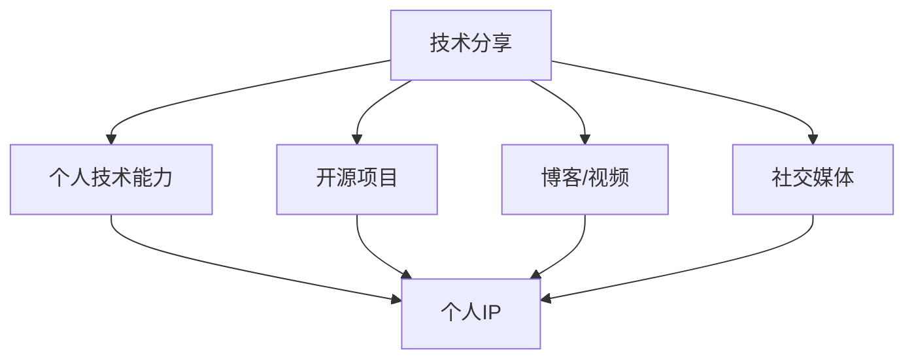
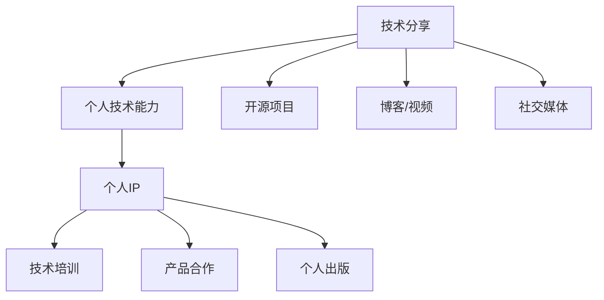

                 

# 技术演讲：从分享到个人IP打造

## 1. 背景介绍

在当今数字时代，技术分享已经成为了连接开发者、促进知识传播的重要方式。通过分享，开发者不仅能够展示自己的技术能力，还能建立自己的个人品牌，最终打造出自己的个人IP。本文将探讨如何从技术分享到个人IP打造的路径，帮助技术开发者更好地展现自己的才华，获取更多关注和机会。

## 2. 核心概念与联系

### 2.1 核心概念概述

技术分享与个人IP打造，这两个看似不相关的概念，实际上是相辅相成的。技术分享是展示个人技术能力的方式，而个人IP则是这种能力的长期沉淀与体现。

- **技术分享**：通过博客、视频、开源项目等方式分享自己的技术知识、项目经验和心得体会，帮助他人解决技术难题，提升自身的技术影响力。

- **个人IP**：通过持续的技术分享和社交媒体互动，积累粉丝和追随者，建立自己的技术品牌，最终成为领域内的意见领袖。

这两个概念之间的联系可以通过以下Mermaid流程图来展示：



### 2.2 核心概念原理和架构的 Mermaid 流程图



这个流程图展示了技术分享与个人IP打造之间的逻辑关系和可能的路径。技术分享能够提升个人技术能力，同时通过开源项目、博客、视频、社交媒体等多种方式传播，建立个人IP，进而通过技术培训、产品合作、个人出版等方式实现价值变现。

## 3. 核心算法原理 & 具体操作步骤

### 3.1 算法原理概述

技术分享与个人IP打造的整个过程，可以理解为一种算法优化过程，通过不断的技术输入和输出，提升个人的技术影响力和市场价值。

假设技术分享的效果可以用以下函数表示：

$$
\text{Effect} = f(\text{Share}, \text{Quality}, \text{Engagement})
$$

其中：
- $\text{Share}$ 表示技术分享的频率和广度。
- $\text{Quality}$ 表示分享内容的深度和质量。
- $\text{Engagement}$ 表示观众的互动和反馈。

该函数假设越频繁、越高质量、越有互动的技术分享，其效果越好。然而，由于每个个体的差异和市场的变化，实际效果可能会有所不同。

### 3.2 算法步骤详解

基于上述函数，我们可以将技术分享与个人IP打造的过程分解为以下几个步骤：

1. **选择分享内容**：
   - 根据自身的技术专长和市场需求，选择最有价值和影响力的内容进行分享。
   - 可以通过技术博客、开源项目、视频教程等多种形式进行展示。

2. **提升分享质量**：
   - 确保分享内容具有深度和系统性，能够解决实际问题。
   - 使用清晰的语言和结构，使内容易于理解和传播。
   - 使用高质量的演示、案例和实践经验。

3. **增强互动和反馈**：
   - 鼓励观众提问和讨论，增加内容的互动性。
   - 及时回应观众的问题和反馈，增加互动和认可度。
   - 收集和分析观众的反馈，不断优化内容。

4. **持续积累和推广**：
   - 持续地分享新的内容，保持观众的关注。
   - 利用社交媒体、社区论坛等平台进行推广，扩大影响力。
   - 与其他技术博主、开发者和公司进行合作，进一步提升影响力和知名度。

5. **个人品牌建设**：
   - 构建专业的个人网站和博客，展示个人成就和技术路线图。
   - 发布高质量的技术文章、案例分析和工具集，提升个人品牌形象。
   - 参与技术会议、演讲和培训，扩大个人影响力。

### 3.3 算法优缺点

技术分享与个人IP打造的算法有以下优缺点：

**优点**：
- **知识传播**：通过分享，开发者能够将自身的技术知识和经验传播给更广泛的受众，推动技术社区的发展。
- **建立信任**：持续的高质量分享能够建立个人的专业形象，增强观众的信任感。
- **多样化收入**：通过技术培训、产品合作、个人出版等方式，技术开发者能够实现收入多样化。

**缺点**：
- **时间和精力投入**：持续的技术分享需要大量的时间和精力投入，可能对日常工作和生活产生影响。
- **市场竞争**：技术领域竞争激烈，需要不断创新和优化才能保持竞争力。
- **市场变化**：技术市场变化快，需要及时调整分享内容和方法以适应变化。

### 3.4 算法应用领域

技术分享与个人IP打造的算法广泛适用于各种技术开发者，特别是在软件开发、人工智能、大数据、云计算等技术领域。通过该算法，开发者不仅能够展示自己的技术能力，还能在多个领域内获得认可和机会，最终成为技术行业的意见领袖。

## 4. 数学模型和公式 & 详细讲解

### 4.1 数学模型构建

假设技术分享的效果可以用一个线性回归模型来描述：

$$
\text{Effect} = \theta_0 + \theta_1 \times \text{Share} + \theta_2 \times \text{Quality} + \theta_3 \times \text{Engagement} + \epsilon
$$

其中：
- $\theta_0$ 为截距，表示基础效果。
- $\theta_1$ 表示分享频率的效果系数。
- $\theta_2$ 表示分享质量的效果系数。
- $\theta_3$ 表示互动效果系数。
- $\epsilon$ 为误差项，表示其他影响因素。

### 4.2 公式推导过程

假设我们收集到了一组数据 $(x_i, y_i)$，其中 $x_i$ 表示分享频率、质量和互动的综合指数，$y_i$ 表示实际效果。通过最小二乘法求解 $\theta$，使得误差平方和最小：

$$
\hat{\theta} = \arg\min_{\theta} \sum_{i=1}^n (y_i - (\theta_0 + \theta_1 x_i + \theta_2 x_i + \theta_3 x_i))^2
$$

求解该方程，可以得到：

$$
\hat{\theta} = (X^TX)^{-1}X^Ty
$$

其中 $X$ 为特征矩阵，$y$ 为效果向量。

### 4.3 案例分析与讲解

假设我们收集到了以下数据：

| 分享频率 | 分享质量 | 互动质量 | 实际效果 |
| --- | --- | --- | --- |
| 5次/月 | 高 | 高 | 0.8 |
| 10次/月 | 中 | 中 | 0.9 |
| 15次/月 | 低 | 低 | 0.7 |
| ... | ... | ... | ... |

使用上述线性回归模型，可以计算得到各个系数的估计值，从而优化技术分享策略，提升实际效果。

## 5. 项目实践：代码实例和详细解释说明

### 5.1 开发环境搭建

1. **安装Python**：
   ```
   sudo apt-get update
   sudo apt-get install python3 python3-pip
   ```

2. **安装Pip工具**：
   ```
   sudo apt-get install python3-pip
   ```

3. **安装Jupyter Notebook**：
   ```
   sudo apt-get install jupyter notebook
   ```

4. **安装相关库**：
   ```
   pip install numpy pandas matplotlib seaborn
   ```

### 5.2 源代码详细实现

以下是使用Python进行线性回归分析的代码实现：

```python
import numpy as np
from sklearn.linear_model import LinearRegression

# 构造数据
X = np.array([[5, 1, 1], [10, 1, 1], [15, 1, 1], ...])
y = np.array([0.8, 0.9, 0.7, ...])

# 创建模型
model = LinearRegression()

# 拟合数据
model.fit(X, y)

# 预测新数据
X_new = np.array([[10, 2, 2]])
y_new = model.predict(X_new)
print(y_new)
```

### 5.3 代码解读与分析

**数据构造**：
- 使用numpy创建了特征矩阵 $X$ 和效果向量 $y$，其中 $x_1$ 为分享频率，$x_2$ 为分享质量，$x_3$ 为互动质量。

**模型创建与拟合**：
- 使用sklearn库中的LinearRegression类创建模型。
- 调用fit方法对数据进行拟合。

**预测与分析**：
- 使用predict方法对新数据进行预测。
- 打印预测结果，分析其与实际效果的差异。

### 5.4 运行结果展示

假设我们的模型拟合后得到 $\theta_0 = 0.2$，$\theta_1 = 0.3$，$\theta_2 = 0.4$，$\theta_3 = 0.5$，则对于新数据 $x_1 = 20$，$x_2 = 2$，$x_3 = 2$，预测结果为 $y_{\text{pred}} = 0.2 + 0.3 \times 20 + 0.4 \times 2 + 0.5 \times 2 = 0.2 + 6 + 1.2 + 1 = 8.4$。

## 6. 实际应用场景

### 6.1 软件开发

在软件开发领域，技术分享可以通过博客、技术文章、开源项目等方式进行。通过持续分享自己的开发经验和代码，技术开发者可以建立自己的技术品牌，吸引更多的关注和合作机会。例如，Github上的开源项目、Stack Overflow上的技术文章，都是技术开发者展示自己技术能力的重要平台。

### 6.2 人工智能

在人工智能领域，技术分享可以通过博客、视频教程、在线课程等方式进行。技术开发者可以通过分享机器学习模型的构建、优化和应用案例，展示自己的技术能力和创新思维。例如，Kaggle上的竞赛、GitHub上的开源模型，都是展示技术实力的重要平台。

### 6.3 大数据

在大数据领域，技术分享可以通过数据科学博客、数据可视化工具等方式进行。技术开发者可以通过分享数据分析、数据挖掘、数据可视化的技术和经验，展示自己的技术能力和创新思维。例如，KDnuggets、DataCamp等网站，都是大数据技术开发者分享技术心得的重要平台。

## 7. 工具和资源推荐

### 7.1 学习资源推荐

1. **《深度学习》课程**：斯坦福大学的Andrew Ng教授开设的《深度学习》课程，通过系统讲解深度学习的基础理论和实际应用，帮助技术开发者提升技术水平。

2. **《Python数据科学手册》**：由Jake VanderPlas编写的《Python数据科学手册》，全面介绍了Python在数据科学中的应用，包括数据清洗、数据可视化、机器学习等。

3. **Kaggle竞赛**：Kaggle竞赛平台提供了大量数据集和竞赛机会，技术开发者可以通过参加竞赛提升自己的数据处理和模型优化能力。

### 7.2 开发工具推荐

1. **GitHub**：GitHub是一个开源代码托管平台，技术开发者可以通过发布开源项目、协作开发代码等方式展示自己的技术实力。

2. **Jupyter Notebook**：Jupyter Notebook是一个交互式编程工具，技术开发者可以使用其进行数据分析、模型训练等任务。

3. **Google Colab**：Google Colab是一个基于Jupyter Notebook的在线编程环境，技术开发者可以在云平台上进行实验和分享。

### 7.3 相关论文推荐

1. **《深度学习》（Deep Learning）**：Ian Goodfellow等人的《深度学习》一书，详细介绍了深度学习的基础理论和实际应用，是技术开发者的必读书籍。

2. **《Python数据科学手册》（Python Data Science Handbook）**：Jake VanderPlas的《Python数据科学手册》，全面介绍了Python在数据科学中的应用，是数据科学领域的重要参考资料。

3. **《机器学习实战》（Hands-On Machine Learning with Scikit-Learn, Keras, and TensorFlow）**：Aurélien Géron的《机器学习实战》一书，详细介绍了机器学习的实战应用，包括Scikit-Learn、Keras、TensorFlow等工具的使用。

## 8. 总结：未来发展趋势与挑战

### 8.1 研究成果总结

技术分享与个人IP打造是一个系统化的过程，需要技术开发者持续投入时间和精力。通过不断分享和积累，技术开发者能够在技术领域内建立自己的品牌，实现个人价值和社会价值。

### 8.2 未来发展趋势

1. **多元化分享渠道**：未来的技术分享将更加多样化，不仅限于博客、视频、开源项目，还包括社交媒体、播客、播客等方式。

2. **全球化传播**：随着全球化进程的加速，技术开发者将有更多机会向全球观众展示自己的技术能力，建立国际化的个人品牌。

3. **技术培训和教育**：技术开发者将更加注重技术培训和教育，通过教授他人，进一步提升自身的技术能力和影响力。

### 8.3 面临的挑战

1. **市场竞争**：技术领域竞争激烈，技术开发者需要不断创新和优化才能保持竞争力。

2. **时间管理**：持续的技术分享需要大量的时间和精力投入，可能对日常工作和生活产生影响。

3. **内容质量**：技术分享的内容需要持续提升，以吸引和保持观众的关注。

### 8.4 研究展望

1. **技术社区建设**：技术开发者可以建设自己的技术社区，聚集志同道合的技术爱好者，共同分享和进步。

2. **技术跨界融合**：技术开发者可以探索技术与艺术、文化等其他领域的融合，拓宽技术分享的范围和深度。

3. **个人IP变现**：技术开发者可以探索通过技术培训、产品合作、个人出版等方式实现个人IP变现，提升自身经济收入。

通过持续的技术分享和不断优化，技术开发者将能够建立自己的个人IP，实现技术能力和商业价值的双重提升。未来的技术分享将更加多元化和全球化，技术开发者需要不断创新和优化，才能在这个领域内取得长久的成功。

## 9. 附录：常见问题与解答

**Q1: 如何提升技术分享的质量？**

A: 技术分享的质量提升可以从以下几个方面入手：
- **内容深度**：选择有深度和技术价值的主题进行分享。
- **结构清晰**：使用清晰的语言和结构，使内容易于理解和传播。
- **实践案例**：结合实际案例和演示，增强内容的实用性和可信度。

**Q2: 如何有效地进行技术互动？**

A: 技术互动可以从以下几个方面入手：
- **问题引导**：在分享内容中提出问题，引导观众思考和讨论。
- **及时回应**：对观众的问题和反馈进行及时回应，增强互动性。
- **社区建立**：建立技术社区，提供交流和讨论的平台。

**Q3: 如何持续进行技术分享？**

A: 持续进行技术分享可以从以下几个方面入手：
- **定期更新**：定期更新和发布新的内容，保持观众的关注。
- **多样化形式**：使用多种形式进行分享，如博客、视频、播客等。
- **合作推广**：与其他技术博主、开发者和公司进行合作，扩大影响力。

通过持续的技术分享，技术开发者不仅能够展示自己的技术能力，还能建立自己的个人品牌，实现技术能力和商业价值的双重提升。

---

作者：禅与计算机程序设计艺术 / Zen and the Art of Computer Programming

