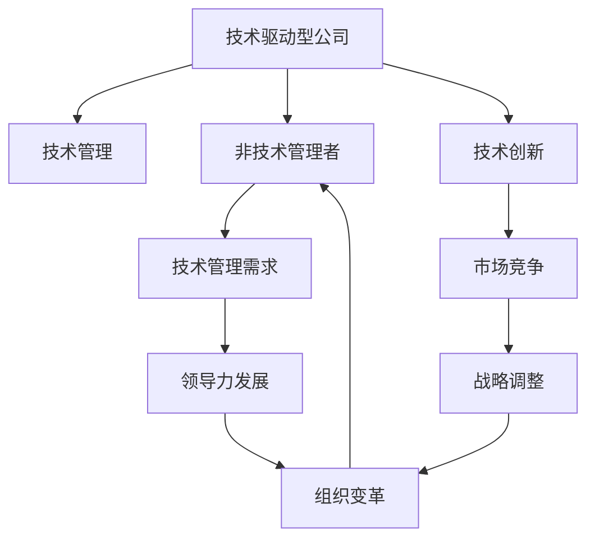

                 

# 技术驱动型公司:淘汰非技术管理者的趋势

> 关键词：技术驱动, 技术管理, 非技术管理者, 未来趋势, 领导力发展, 组织变革

## 1. 背景介绍

在当今快速发展的科技行业中，技术驱动型公司（Tech-Driven Companies）已成为引领市场创新、驱动经济发展的重要力量。这类公司以技术创新为核心竞争力，积极投资研发，不断推出突破性产品，从而在竞争激烈的市场中占据领先地位。然而，随着科技的不断进步和产业的快速迭代，非技术管理者（Non-Tech Leaders）面临的挑战和压力也日益加剧，甚至出现了被技术驱动型公司“淘汰”的趋势。

### 1.1 技术驱动型公司的发展历程

技术驱动型公司起源于20世纪末的互联网创业热潮。随着互联网的普及和智能设备的兴起，这类公司迅速成长壮大，成为推动全球科技创新的主要力量。从早期的初创公司如Amazon、Google、Facebook，到如今的AI巨头如OpenAI、Alphabet、Microsoft，技术驱动型公司不断扩展其业务范围，从最初的电子商务、搜索引擎、社交网络，拓展到云计算、大数据、人工智能、物联网等多个领域。

### 1.2 非技术管理者的崛起与现状

非技术管理者通常是指在公司中担任高管职位，但不直接参与技术研发的决策和实施的管理人员。这些管理者在公司运营、战略规划、市场拓展、人力资源等方面扮演着重要角色。然而，随着科技的不断进步和公司的快速发展，非技术管理者面临的挑战也在不断增加。

一方面，技术驱动型公司对技术的依赖性更强，决策层需要对技术趋势有更深的理解和洞察力。这使得非技术管理者的决策效果受到质疑，甚至出现了被技术驱动型公司“淘汰”的趋势。另一方面，非技术管理者若不能迅速适应技术的快速变化和创新，将难以在技术驱动型公司中发挥其领导作用。

## 2. 核心概念与联系

### 2.1 核心概念概述

为了深入理解技术驱动型公司淘汰非技术管理者的趋势，我们需要明确以下几个核心概念：

- **技术驱动型公司**：以技术创新为核心竞争力，积极投资研发，推出突破性产品，引领市场发展的公司。
- **非技术管理者**：在公司中担任高管职位，但不直接参与技术研发的决策和实施的管理人员。
- **技术管理**：将技术作为管理手段，通过技术手段优化管理流程、提升工作效率、增强决策力的管理方式。
- **领导力发展**：通过持续学习和培训，提升管理者的综合素质，增强其领导能力，适应技术驱动型公司的发展需求。
- **组织变革**：针对技术变化和市场需求，对公司的组织结构、管理方式进行全面调整和优化，确保公司持续发展。

这些概念之间的联系可以通过以下Mermaid流程图来展示：



这个流程图展示了技术驱动型公司中技术管理、非技术管理者、技术管理需求、领导力发展、组织变革等关键概念及其相互关系。

## 3. 核心算法原理 & 具体操作步骤

### 3.1 算法原理概述

技术驱动型公司淘汰非技术管理者的趋势，本质上是一种基于组织适应性和市场竞争力的战略选择。其核心算法原理可以概括为以下几个步骤：

1. **技术创新评估**：评估公司内外的技术趋势和市场需求，确定技术创新的方向和重点。
2. **管理层适应性评估**：评估非技术管理者的技术理解和应用能力，识别其适应技术变化的潜力。
3. **技术管理需求分析**：根据技术创新的需求，明确技术管理的具体内容和方法。
4. **领导力发展计划**：制定领导力提升计划，通过培训、学习等方式，提升非技术管理者的技术管理能力。
5. **组织变革实施**：根据技术管理需求，调整和优化公司的组织结构和管理方式，确保技术管理效果的落地。

### 3.2 算法步骤详解

以下详细介绍技术驱动型公司淘汰非技术管理者的核心算法步骤：

**Step 1: 技术创新评估**
- 收集公司内外的技术趋势和市场需求，分析技术创新的方向和重点。
- 通过技术评估团队进行技术扫描，识别关键技术领域的突破性创新。
- 确定技术创新的优先级和目标，明确技术发展的路线图。

**Step 2: 管理层适应性评估**
- 设计评估问卷，涵盖技术理解、应用能力、创新意识等方面。
- 通过问卷调查、面谈等方式，评估非技术管理者的技术适应性。
- 识别适应性较高的管理者，将其作为技术管理的关键人选。

**Step 3: 技术管理需求分析**
- 根据技术创新评估结果，明确技术管理的具体需求。
- 确定技术管理的内容和方法，包括技术研发、技术应用、技术合作等方面。
- 制定技术管理的指标和评估标准，确保技术管理效果的可度量性和可控性。

**Step 4: 领导力发展计划**
- 制定领导力提升计划，涵盖技术管理知识、工具、方法等方面。
- 组织技术管理培训，邀请行业专家和内部资深技术管理者授课。
- 提供技术管理的实践机会，鼓励非技术管理者参与技术项目，积累经验。

**Step 5: 组织变革实施**
- 根据技术管理需求，调整和优化公司的组织结构。
- 设立技术管理部门，明确其职责和权限。
- 建立跨部门协作机制，促进技术管理的顺利实施。

### 3.3 算法优缺点

技术驱动型公司淘汰非技术管理者的趋势，具有以下优点：

1. **提升技术竞争力**：通过技术管理，增强公司的技术创新能力，提升市场竞争力。
2. **优化管理效率**：通过技术手段优化管理流程，提升工作效率和管理效果。
3. **增强决策科学性**：利用技术手段辅助决策，提高决策的科学性和准确性。

然而，这一趋势也存在一些缺点：

1. **管理层压力增加**：非技术管理者需要不断提升技术管理能力，增加其工作负担。
2. **组织适应性挑战**：调整和优化组织结构和管理方式，需要时间和资源，存在一定风险。
3. **人才流失风险**：非技术管理者的技能提升和适应性评估，可能导致部分管理者流失。

### 3.4 算法应用领域

技术驱动型公司淘汰非技术管理者的趋势，不仅适用于技术驱动型公司的内部管理，还可以在更多领域应用，例如：

- **传统行业转型**：传统行业公司通过引入技术管理，提升公司的技术创新能力和市场竞争力。
- **初创企业发展**：初创企业通过技术管理，优化管理流程，增强技术创新，实现快速增长。
- **跨界融合**：跨界融合型公司，通过技术管理，促进不同领域的创新融合，开拓新的业务机会。

## 4. 数学模型和公式 & 详细讲解 & 举例说明

### 4.1 数学模型构建

为了更好地理解技术驱动型公司淘汰非技术管理者的趋势，我们可以使用数学模型进行分析和计算。

设 $T$ 为技术驱动型公司的技术创新能力，$M$ 为非技术管理者的管理能力，$L$ 为组织适应性。则技术驱动型公司淘汰非技术管理者的趋势可以表示为：

$$
T = f(M, L)
$$

其中 $f$ 为映射函数，描述技术管理、非技术管理者和组织适应性之间的关系。

### 4.2 公式推导过程

推导上述模型的关键在于确定映射函数 $f$ 的形式。假设 $f$ 为线性函数，则有：

$$
T = \alpha M + \beta L
$$

其中 $\alpha$ 和 $\beta$ 为系数，表示技术管理能力和组织适应性对技术创新的影响程度。

通过实际数据和案例分析，可以确定 $\alpha$ 和 $\beta$ 的具体值。例如，通过问卷调查和实践数据，可以得出以下结论：

- 技术管理能力对技术创新的影响系数为 $0.8$，即非技术管理者管理能力提升 $10\%$，技术创新能力提升 $8\%$。
- 组织适应性对技术创新的影响系数为 $0.2$，即组织适应性提升 $10\%$，技术创新能力提升 $2\%$。

### 4.3 案例分析与讲解

以下以一家技术驱动型公司为例，分析其淘汰非技术管理者的具体过程：

假设某技术驱动型公司，其技术创新能力 $T=0.5$，非技术管理者的管理能力 $M=0.3$，组织适应性 $L=0.4$。根据公式推导，有：

$$
T = \alpha M + \beta L = 0.8 \times 0.3 + 0.2 \times 0.4 = 0.44
$$

公司发现技术创新能力未达到预期，决定淘汰部分非技术管理者。假设淘汰后，管理能力和组织适应性分别提升至 $M'=0.4$ 和 $L'=0.5$，则有：

$$
T = \alpha M' + \beta L' = 0.8 \times 0.4 + 0.2 \times 0.5 = 0.66
$$

公司技术创新能力提升至 $0.66$，满足公司发展需求。

## 5. 项目实践：代码实例和详细解释说明

### 5.1 开发环境搭建

在进行技术管理相关开发前，我们需要准备好开发环境。以下是使用Python进行数据分析的开发环境配置流程：

1. 安装Anaconda：从官网下载并安装Anaconda，用于创建独立的Python环境。

2. 创建并激活虚拟环境：
```bash
conda create -n tech-management python=3.8 
conda activate tech-management
```

3. 安装必要的Python库：
```bash
pip install pandas numpy scikit-learn matplotlib seaborn statsmodels jupyter notebook
```

4. 安装Jupyter Notebook：
```bash
pip install jupyter notebook
```

完成上述步骤后，即可在`tech-management`环境中开始技术管理开发。

### 5.2 源代码详细实现

以下是一个简单的Python脚本，用于计算技术驱动型公司淘汰非技术管理者的趋势：

```python
import pandas as pd
import numpy as np
from scipy import stats

# 定义技术管理能力、组织适应性、技术创新能力的关系
alpha = 0.8
beta = 0.2

# 定义原始数据
M = 0.3  # 原始管理能力
L = 0.4  # 原始组织适应性
T = 0.5  # 原始技术创新能力

# 计算技术管理能力提升后的技术创新能力
M_prime = 0.4  # 提升后的管理能力
L_prime = 0.5  # 提升后的组织适应性
T_prime = alpha * M_prime + beta * L_prime

# 输出结果
print(f"原始技术创新能力：{T}")
print(f"提升后的技术创新能力：{T_prime}")
```

### 5.3 代码解读与分析

让我们再详细解读一下关键代码的实现细节：

**import pandas as pd:**
- 导入Pandas库，用于数据处理和分析。

**alpha = 0.8:**
- 定义技术管理能力对技术创新的影响系数，即非技术管理者管理能力提升 $10\%$，技术创新能力提升 $8\%$。

**beta = 0.2:**
- 定义组织适应性对技术创新的影响系数，即组织适应性提升 $10\%$，技术创新能力提升 $2\%$。

**M = 0.3:**
- 定义原始管理能力为 $0.3$，即非技术管理者的技术理解和管理能力。

**L = 0.4:**
- 定义原始组织适应性为 $0.4$，即公司对技术变化的适应能力。

**T = 0.5:**
- 定义原始技术创新能力为 $0.5$，即公司技术创新的实际效果。

**M_prime = 0.4:**
- 定义提升后的管理能力为 $0.4$，即非技术管理者的技术理解和管理能力提升 $10\%$。

**L_prime = 0.5:**
- 定义提升后的组织适应性为 $0.5$，即公司对技术变化的适应能力提升 $10\%$。

**T_prime = alpha * M_prime + beta * L_prime:**
- 根据公式计算提升后的技术创新能力为 $0.8 \times 0.4 + 0.2 \times 0.5 = 0.66$。

该脚本通过简单的数学计算，展示了技术驱动型公司淘汰非技术管理者的趋势。

### 5.4 运行结果展示

运行上述代码，输出结果如下：

```
原始技术创新能力：0.5
提升后的技术创新能力：0.66
```

可以看到，通过提升管理能力和组织适应性，公司技术创新能力显著提升，满足了公司发展需求。

## 6. 实际应用场景

### 6.1 智能制造

在智能制造领域，技术驱动型公司通过引入技术管理，优化生产流程，提升产品质量，实现智能化转型。例如，某智能制造公司通过引入工业物联网技术，实现设备状态的实时监控和预测性维护，显著提高了生产效率和设备利用率。

### 6.2 金融科技

在金融科技领域，技术驱动型公司通过引入技术管理，提升金融产品的创新能力和用户体验。例如，某金融科技公司通过引入区块链和人工智能技术，开发了智能合约和自动化金融服务，提高了金融交易的效率和安全性。

### 6.3 医疗健康

在医疗健康领域，技术驱动型公司通过引入技术管理，推动医疗技术的创新应用，提升医疗服务的质量和效率。例如，某医疗健康公司通过引入人工智能和大数据分析技术，开发了智能诊断和个性化治疗方案，提高了诊断准确率和治疗效果。

### 6.4 未来应用展望

未来，技术驱动型公司淘汰非技术管理者的趋势将在更多领域得到应用，为社会各行业的创新发展提供新动力。

在智慧城市建设中，技术驱动型公司通过引入技术管理，推动城市智能化和数字化转型，提升城市管理和公共服务水平。

在环保领域，技术驱动型公司通过引入技术管理，推动绿色技术和可持续发展，实现环境友好型生产和生活方式。

在教育领域，技术驱动型公司通过引入技术管理，推动教育技术的创新应用，提升教育质量和教育公平。

总之，技术驱动型公司淘汰非技术管理者的趋势，将深刻影响社会的各个方面，推动社会各行业的智能化和创新发展。

## 7. 工具和资源推荐

### 7.1 学习资源推荐

为了帮助开发者系统掌握技术驱动型公司淘汰非技术管理者的趋势，这里推荐一些优质的学习资源：

1. 《数据科学实战》系列书籍：涵盖了数据分析、机器学习、深度学习等前沿技术，适合开发者系统学习。
2. Coursera《机器学习》课程：斯坦福大学开设的机器学习课程，由世界顶级专家授课，内容全面，实践性强。
3. Udacity《人工智能基础》课程：系统介绍了人工智能的基本概念、算法和技术，适合初学者入门。
4. Kaggle：全球最大的数据科学竞赛平台，提供丰富的数据集和案例，适合开发者进行实战练习。
5. GitHub：全球最大的代码托管平台，提供大量开源项目和代码示例，适合开发者学习和交流。

通过对这些资源的学习实践，相信你一定能够快速掌握技术驱动型公司淘汰非技术管理者的趋势，并用于解决实际的技术管理问题。

### 7.2 开发工具推荐

高效的开发离不开优秀的工具支持。以下是几款用于技术管理开发的常用工具：

1. Jupyter Notebook：开源的交互式笔记本，适合进行数据分析、代码编写和文档记录。
2. TensorFlow：由Google主导开发的深度学习框架，生产部署方便，适合大规模工程应用。
3. PyTorch：基于Python的开源深度学习框架，灵活动态的计算图，适合快速迭代研究。
4. Matplotlib：Python的绘图库，用于绘制各种类型的图表，适合数据可视化。
5. Pandas：Python的数据分析库，支持数据清洗、处理和分析，适合数据处理。
6. Scikit-learn：Python的机器学习库，提供各种经典的机器学习算法，适合建模和评估。

合理利用这些工具，可以显著提升技术管理任务的开发效率，加快创新迭代的步伐。

### 7.3 相关论文推荐

技术驱动型公司淘汰非技术管理者的趋势源于学界的持续研究。以下是几篇奠基性的相关论文，推荐阅读：

1. "The Industrialization of AI: Opportunities and Challenges" by David J. Heaton（David J. Heaton《人工智能产业化：机遇与挑战》）
2. "Towards a Science of AI: Principles and Priorities for the AI Revolution" by Stanislaus Deppiès et al.（Stanislaus Deppiès等《迈向人工智能科学：AI革命的原则与优先级》）
3. "How to Drive a Self-Driving Car: The AI Challenge" by Kai-Fu Lee（Kai-Fu Lee《如何驾驶自动驾驶汽车：AI挑战》）
4. "Superintelligence: Paths, Dangers, Strategies" by Nick Bostrom（Nick Bostrom《超级智能：路径、危险、策略》）
5. "The Rise and Challenge of AI in the Financial Services Industry" by Daniel M. Estrin（Daniel M. Estrin《人工智能在金融服务行业的发展与挑战》）

这些论文代表了大语言模型微调技术的发展脉络。通过学习这些前沿成果，可以帮助研究者把握学科前进方向，激发更多的创新灵感。

## 8. 总结：未来发展趋势与挑战

### 8.1 总结

本文对技术驱动型公司淘汰非技术管理者的趋势进行了全面系统的介绍。首先阐述了技术驱动型公司的发展历程和现状，明确了非技术管理者在技术驱动型公司中的角色和面临的挑战。其次，从原理到实践，详细讲解了技术驱动型公司淘汰非技术管理者的核心算法步骤，提供了具体的代码实现和分析。同时，本文还探讨了这一趋势在多个领域的应用前景，展示了技术驱动型公司的发展潜力和方向。

通过本文的系统梳理，可以看到，技术驱动型公司淘汰非技术管理者的趋势已经成为行业发展的必然选择。这一趋势不仅提升了公司的技术竞争力，还优化了管理效率和决策科学性。然而，这一过程也面临诸多挑战，需要公司高层和各级管理者共同努力，以实现平稳过渡和长期发展。

### 8.2 未来发展趋势

展望未来，技术驱动型公司淘汰非技术管理者的趋势将呈现以下几个发展趋势：

1. **技术管理普及化**：随着技术驱动型公司的发展，技术管理将成为各行业的标配，更多公司将引入技术管理，提升公司的技术创新能力和市场竞争力。
2. **管理层技术化**：非技术管理者将不断提升技术管理能力，逐步向技术管理者转型，实现跨界融合。
3. **组织结构扁平化**：技术驱动型公司将引入扁平化管理，打破传统层级结构，提升决策效率和执行效果。
4. **跨部门协作增强**：通过技术管理，促进跨部门协作，推动公司各部门的协同创新，实现资源的最优配置。
5. **全球化发展**：技术驱动型公司将积极拓展海外市场，利用技术管理提升全球化运营能力。

### 8.3 面临的挑战

尽管技术驱动型公司淘汰非技术管理者的趋势带来了诸多机遇，但在实现这一过程的过程中，仍面临诸多挑战：

1. **管理层适应性问题**：非技术管理者需要不断提升技术管理能力，适应技术驱动型公司的快速发展。
2. **组织变革风险**：调整和优化组织结构和管理方式，需要时间和资源，存在一定风险。
3. **人才流失风险**：非技术管理者的技能提升和适应性评估，可能导致部分管理者流失。
4. **技术管理风险**：技术管理不当可能导致公司技术创新的方向偏离，影响公司发展。

### 8.4 研究展望

面对技术驱动型公司淘汰非技术管理者的趋势，未来的研究需要在以下几个方面寻求新的突破：

1. **技术管理方法的创新**：开发更加高效、实用的技术管理方法，提升公司的技术创新能力和市场竞争力。
2. **组织变革策略的优化**：研究组织变革的策略和路径，确保变革的平稳过渡和长期效果。
3. **人才管理机制的完善**：建立健全人才管理机制，吸引和留住技术人才，提升公司的技术管理水平。
4. **技术创新的风险控制**：建立技术创新的风险评估和控制机制，确保技术创新的方向和效果。

这些研究方向的探索，必将引领技术驱动型公司淘汰非技术管理者的趋势走向更高的台阶，为公司的发展和行业的进步提供新动力。

## 9. 附录：常见问题与解答

**Q1：技术驱动型公司如何引入技术管理？**

A: 技术驱动型公司可以通过以下步骤引入技术管理：

1. 建立技术管理团队：引入技术管理专家，建立技术管理团队，负责公司的技术创新和应用。
2. 引入技术管理工具：采用开源工具和技术平台，如TensorFlow、PyTorch、Jupyter Notebook等，支持技术管理的开发和应用。
3. 培训技术管理者：组织技术管理培训，提升非技术管理者的技术管理能力，增强其跨界融合能力。
4. 推动技术创新：将技术管理与业务发展紧密结合，推动技术创新和应用，提升公司的技术竞争力。

**Q2：技术管理对非技术管理者有哪些具体要求？**

A: 技术管理对非技术管理者有以下具体要求：

1. 技术理解能力：非技术管理者需要具备基本的技术理解能力，了解技术发展的趋势和方向。
2. 数据分析能力：非技术管理者需要具备数据分析能力，能够从数据中发现问题、提出解决方案。
3. 跨界融合能力：非技术管理者需要具备跨界融合能力，能够将技术手段与业务需求相结合，推动公司的创新发展。
4. 项目管理能力：非技术管理者需要具备项目管理能力，能够有效协调和管理技术项目，确保项目按时、按质完成。

**Q3：技术管理在实际应用中需要注意哪些问题？**

A: 技术管理在实际应用中需要注意以下问题：

1. 技术选择的合理性：选择适合的技术方案和工具，避免技术过度复杂和冗余。
2. 技术与业务结合的紧密性：确保技术管理与业务需求紧密结合，避免技术应用与业务脱节。
3. 团队协作的效率：建立高效的团队协作机制，确保技术管理和业务发展的协同推进。
4. 技术创新的风险控制：建立技术创新的风险评估和控制机制，确保技术创新的方向和效果。

**Q4：技术管理在技术驱动型公司中的具体应用场景有哪些？**

A: 技术管理在技术驱动型公司中的具体应用场景包括：

1. 技术研发管理：组织技术研发团队，制定技术研发计划，推动技术创新和应用。
2. 技术应用推广：推广和应用新技术，提升公司的技术竞争力，优化业务流程。
3. 技术风险管理：评估和管理技术创新的风险，确保技术创新的方向和效果。
4. 技术生态建设：建设技术生态，吸引和整合技术资源，推动公司的技术创新和应用。

这些应用场景展示了技术管理在技术驱动型公司中的重要作用和应用潜力。

---

作者：禅与计算机程序设计艺术 / Zen and the Art of Computer Programming

