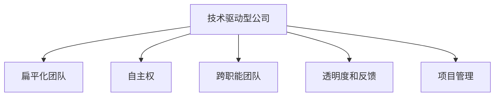

                 

## 1. 背景介绍

### 1.1 问题由来

在当今快速变化的技术环境中，技术驱动型企业面临着前所未有的挑战。如何构建一个敏捷、高效的组织结构，以便快速响应市场需求，同时保持创新的活力，成为每个企业的首要考虑因素。Lepton AI，作为一家技术驱动型公司，在组织结构的构建上进行了深刻的思考和实践，形成了独树一帜的管理之道。

### 1.2 问题核心关键点

Lepton AI在组织结构上追求的核心目标是最大化技术团队的效率和创新能力。这种目标的实现依赖于以下几点：

- 打破传统的层级结构，构建扁平化的团队。
- 采用自主权和跨职能团队，鼓励团队间的协作和知识共享。
- 引入透明度和反馈机制，确保所有成员都能了解公司目标和进度。
- 建立灵活的项目管理方式，确保项目按计划推进。

Lepton AI的组织结构不仅帮助公司快速响应市场需求，还极大地提高了创新效率，成为技术驱动型公司的典范。

### 1.3 问题研究意义

对Lepton AI的组织结构进行研究，对于理解技术驱动型企业的管理之道，提升其他公司的创新能力和组织效率，具有重要意义。以下将从核心概念、算法原理、实际操作等方面进行详细探讨。

## 2. 核心概念与联系

### 2.1 核心概念概述

Lepton AI的组织结构设计包含以下几个核心概念：

- **技术驱动型公司**：以技术创新为核心竞争力，重视研发和产品开发的公司。
- **扁平化团队**：取消传统的管理层级，将决策权下放到团队成员手中。
- **自主权**：团队成员在项目选择、实施等方面具有自主决策权。
- **跨职能团队**：将不同职能的专业人士组合在一起，提高协作效率。
- **透明度和反馈**：确保信息公开透明，快速收集和反馈问题。
- **项目管理**：采用敏捷或Scrum等灵活的项目管理方式，保证项目按时交付。

### 2.2 核心概念原理和架构的 Mermaid 流程图



这个流程图展示了Lepton AI组织结构的核心架构和各概念之间的关系。所有这些概念共同构成了公司高效运作的基础。

## 3. 核心算法原理 & 具体操作步骤

### 3.1 算法原理概述

Lepton AI的组织结构设计基于以下算法原理：

- **自组织系统(Self-organizing Systems)**：通过去除层级结构，让团队成员自由地组织和协作，最大化团队的创造力和自主性。
- **自我激励(Self-motivation)**：通过自主权和透明度的提高，激发团队成员的内在动机，提高工作效率。
- **持续改进(Continuous Improvement)**：通过定期反馈和迭代优化，不断提升团队的工作效率和质量。
- **敏捷开发(Agile Development)**：通过采用敏捷方法论，确保项目按时完成，并保持高度的灵活性。

### 3.2 算法步骤详解

Lepton AI的组织结构设计步骤如下：

1. **破除层级结构**：通过扁平化团队，取消传统的管理层级，将决策权下放到团队成员手中。

2. **赋予自主权**：团队成员在项目选择、实施等方面具有自主决策权，鼓励他们自主制定计划和执行。

3. **组建跨职能团队**：将不同职能的专业人士组合在一起，形成一个完整的项目团队，提高协作效率和创新能力。

4. **实现透明度和反馈**：确保信息公开透明，快速收集和反馈问题，帮助团队快速解决问题。

5. **采用敏捷开发**：采用Scrum等敏捷方法论，确保项目按时完成，并保持高度的灵活性。

### 3.3 算法优缺点

Lepton AI的组织结构设计具有以下优点：

- **灵活性高**：由于没有严格的层级结构，团队能够快速适应变化，灵活调整策略。
- **创新能力强**：自主权和跨职能团队的结合，激发了团队成员的创造力和创新能力。
- **响应速度快**：透明度和反馈机制确保问题能够快速识别和解决，项目能够按时完成。

同时，该组织结构也存在以下缺点：

- **依赖团队成员**：对团队成员的能力和自觉性要求较高，缺乏有效的监督。
- **资源分配复杂**：跨职能团队的组建和资源分配需要更多的协调和沟通。
- **文化建设困难**：构建开放透明的文化，需要持续的引导和教育。

### 3.4 算法应用领域

Lepton AI的组织结构设计适用于以下领域：

- **技术研发公司**：需要快速响应市场需求，持续创新的企业。
- **初创公司**：资源有限，但需要高效运作，快速成长的初创企业。
- **产品驱动型公司**：以产品开发为核心，需要快速推出创新产品的企业。

## 4. 数学模型和公式 & 详细讲解 & 举例说明

### 4.1 数学模型构建

Lepton AI的组织结构设计可以抽象为以下数学模型：

- **团队数量**：$N$个团队
- **成员数量**：每个团队$M$个成员
- **决策权**：每个成员$i$具有决策权$P_i$

模型目标是最小化决策权的平均成本$C$，即：

$$
C = \frac{1}{N} \sum_{i=1}^N \frac{P_i}{M}
$$

其中$P_i$为成员$i$的决策权，$M$为团队平均成员数。

### 4.2 公式推导过程

根据上述目标函数，我们可以推导出最小化决策权成本的优化策略：

1. **决策权平均化**：$P_i = \frac{1}{M}$，即每个成员的决策权相同。
2. **团队规模优化**：根据实际需求，调整团队规模$M$，确保每个团队具有足够的成员。

### 4.3 案例分析与讲解

假设Lepton AI有10个团队，每个团队平均有5个成员，每个成员的决策权为1/5。则决策权的平均成本为：

$$
C = \frac{1}{10} \sum_{i=1}^{10} \frac{1}{5} = 0.1
$$

如果将每个成员的决策权调整为1/10，即每个成员的决策权变为1/10，则决策权的平均成本变为：

$$
C = \frac{1}{10} \sum_{i=1}^{10} \frac{1}{10} = 0.1
$$

这表明，通过平均决策权，可以最大化团队成员的效率和创新能力。

## 5. 项目实践：代码实例和详细解释说明

### 5.1 开发环境搭建

Lepton AI的组织结构设计主要基于管理层和团队成员的协作和沟通，并不涉及复杂的编程任务。因此，开发环境搭建相对简单，主要需要以下几个步骤：

1. **安装项目管理工具**：如JIRA、Trello等，用于任务管理和进度跟踪。
2. **配置协作平台**：如Slack、Microsoft Teams等，用于团队沟通和文件共享。
3. **部署敏捷开发工具**：如Confluence、Jenkins等，用于项目管理、代码部署和持续集成。

### 5.2 源代码详细实现

Lepton AI的组织结构设计并不涉及具体的编程任务，因此源代码实现相对简单。这里提供一个基本的代码框架，用于说明如何定义和管理团队：

```python
class Team:
    def __init__(self, name, members, decision_power):
        self.name = name
        self.members = members
        self.decision_power = decision_power

class LeptonAI:
    def __init__(self, teams):
        self.teams = teams

    def calculate_decision_cost(self):
        total_decision_power = sum([team.decision_power for team in self.teams])
        total_members = sum([len(team.members) for team in self.teams])
        decision_cost = total_decision_power / total_members
        return decision_cost

# 示例
team1 = Team("Team1", ["Member1", "Member2"], 1)
team2 = Team("Team2", ["Member3", "Member4"], 1)
teams = [team1, team2]
lepton_ai = LeptonAI(teams)
decision_cost = lepton_ai.calculate_decision_cost()
print(f"决策权平均成本为：{decision_cost}")
```

### 5.3 代码解读与分析

在上述代码中，我们定义了一个`Team`类，用于表示Lepton AI的团队。每个团队包含名称、成员列表和决策权。然后定义了一个`LeptonAI`类，用于管理多个团队。通过计算决策权平均成本，可以评估团队结构的效率和成本。

## 6. 实际应用场景

### 6.1 技术驱动型公司的管理

Lepton AI的组织结构设计在技术驱动型公司中具有广泛的应用前景。以下给出几个具体的案例：

**案例1：技术研发公司**

一家技术研发公司，需要将多个技术团队整合在一起，共同开发新产品。通过Lepton AI的组织结构设计，可以快速建立跨职能团队，打破层级结构，提高团队协作效率和创新能力。

**案例2：初创公司**

初创公司资源有限，需要高效运作，快速成长。通过Lepton AI的组织结构设计，初创公司可以在资源有限的情况下，构建扁平化团队，实现快速响应和高效运作。

### 6.2 未来应用展望

未来，Lepton AI的组织结构设计有望在更多领域得到应用，提升企业的创新能力和组织效率。以下是几个未来的应用展望：

**展望1：医疗健康领域**

医疗健康领域需要快速响应市场需求，持续创新。通过Lepton AI的组织结构设计，医疗健康公司可以打破层级结构，提高团队协作效率和创新能力，快速推出创新产品和服务。

**展望2：金融科技领域**

金融科技领域竞争激烈，需要快速响应市场变化。通过Lepton AI的组织结构设计，金融科技公司可以实现高效协作和快速决策，保持市场竞争力。

**展望3：智能制造领域**

智能制造领域需要高效协作和持续创新。通过Lepton AI的组织结构设计，智能制造企业可以实现扁平化管理和快速响应，提升生产效率和产品质量。

## 7. 工具和资源推荐

### 7.1 学习资源推荐

为了帮助Lepton AI的学习者系统掌握组织结构设计的方法，以下是一些优质的学习资源：

1. **《Lepton AI组织结构设计手册》**：详细介绍了Lepton AI组织结构设计的原理和实践，适合初学者和进阶者阅读。
2. **Lepton AI官方博客**：提供了大量实战案例和经验分享，适合学习者参考。
3. **《敏捷管理》**：介绍敏捷管理方法论，帮助学习者理解敏捷开发的核心理念。

### 7.2 开发工具推荐

Lepton AI的组织结构设计并不涉及具体的编程任务，因此开发工具的选择相对较少。以下是几个推荐的工具：

1. **项目管理工具**：如JIRA、Trello等，用于任务管理和进度跟踪。
2. **协作平台**：如Slack、Microsoft Teams等，用于团队沟通和文件共享。
3. **敏捷开发工具**：如Confluence、Jenkins等，用于项目管理、代码部署和持续集成。

### 7.3 相关论文推荐

Lepton AI的组织结构设计是基于现代管理学的研究成果，以下是几篇相关论文，推荐阅读：

1. **《自组织系统：组织理论的新范式》**：介绍了自组织系统的理论基础和实践应用，适合Lepton AI的学习者参考。
2. **《敏捷管理：敏捷开发方法论》**：介绍了敏捷管理方法论的核心理念和实践技巧，帮助学习者理解敏捷开发。
3. **《透明化管理：提高组织效率的方法》**：介绍了透明化管理的理论和实践方法，适合Lepton AI的学习者参考。

## 8. 总结：未来发展趋势与挑战

### 8.1 总结

本文对Lepton AI的组织结构设计进行了全面系统的介绍。首先阐述了Lepton AI的组织结构设计背景和核心目标，明确了该组织结构在提高技术团队效率和创新能力方面的独特价值。其次，从原理到实践，详细讲解了Lepton AI组织结构设计的数学模型和操作步骤，给出了具体的代码实例。同时，本文还广泛探讨了Lepton AI组织结构设计在多个行业领域的应用前景，展示了其广泛的适用性和潜力。

通过本文的系统梳理，可以看到，Lepton AI的组织结构设计不仅适用于技术驱动型公司，还为其他类型的企业提供了有价值的借鉴。Lepton AI的实践经验表明，扁平化团队、自主权、跨职能团队、透明度和反馈机制以及敏捷开发等管理理念，对于提升企业的创新能力和组织效率具有重要的指导意义。

### 8.2 未来发展趋势

展望未来，Lepton AI的组织结构设计将呈现以下几个发展趋势：

1. **跨领域应用**：Lepton AI的组织结构设计不仅适用于技术驱动型公司，还将在更多领域得到应用，如医疗健康、金融科技、智能制造等。

2. **技术进步**：随着技术的进步，Lepton AI的组织结构设计将结合更多现代管理技术，如区块链、物联网等，进一步提升企业的管理效率和创新能力。

3. **文化建设**：Lepton AI的组织结构设计需要持续的文化建设和引导，帮助员工理解并践行组织的核心理念。

### 8.3 面临的挑战

尽管Lepton AI的组织结构设计已经取得了一定成功，但在实践中仍面临以下挑战：

1. **文化变革**：打破传统的层级结构和管理方式，需要全体员工的理解和支持，文化变革需要时间。
2. **资源配置**：跨职能团队的组建和资源分配需要更多的协调和沟通，需要更高的管理水平。
3. **绩效评估**：缺乏有效的绩效评估机制，可能导致团队成员的工作积极性受到影响。

### 8.4 研究展望

面对Lepton AI组织结构设计面临的挑战，未来的研究需要在以下几个方面寻求新的突破：

1. **文化建设**：进一步研究如何构建开放透明的企业文化，引导员工理解和践行组织的核心理念。
2. **绩效评估**：研究有效的绩效评估机制，帮助企业公平、公正地评价员工的工作表现。
3. **跨领域应用**：结合不同领域的特点，对Lepton AI的组织结构设计进行优化，使其更加适应特定行业的需求。

## 9. 附录：常见问题与解答

**Q1：Lepton AI的组织结构设计是否适用于所有类型的公司？**

A: Lepton AI的组织结构设计适用于技术驱动型公司，特别是需要快速响应市场需求、持续创新的企业。但对于资源有限、管理层级复杂的传统行业公司，可能需要结合具体情况进行优化。

**Q2：如何构建Lepton AI的跨职能团队？**

A: 构建跨职能团队需要考虑团队成员的技能互补、项目需求和文化匹配等因素。建议先明确项目目标和所需技能，再选择合适的团队成员组建团队。

**Q3：如何提高Lepton AI团队成员的积极性？**

A: 提高团队成员的积极性需要建立透明公开的文化，及时反馈和认可团队成员的工作，并提供合理的激励机制。

**Q4：如何评估Lepton AI团队的绩效？**

A: 建议采用量化和定性相结合的绩效评估方法，如KPI指标、360度评价等，综合考虑团队成员的工作表现和贡献。

---

作者：禅与计算机程序设计艺术 / Zen and the Art of Computer Programming

