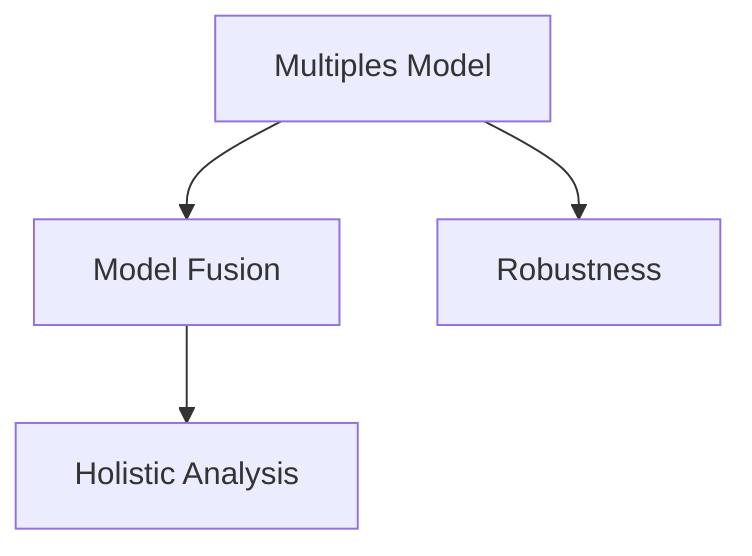

                 

## 1. 背景介绍

### 1.1 问题由来

在当今快速发展的数字化时代，管理者面临的决策复杂性和数据多样性不断增加。传统的数据驱动决策方法已无法满足日益增长的需求。如何在数据的大海中快速发现洞见，做出科学有效的决策，成为管理者面临的首要挑战。多元模型思维（Multi-Model Thinking），作为一种新兴的决策支持技术，为管理者提供了一个全面的、综合的数据分析框架。

### 1.2 问题核心关键点

多元模型思维的核心在于利用多个模型，综合其优势，提升决策的准确性和可靠性。主要体现在以下几个方面：

- 模型多样性：引入多种不同类型的模型，覆盖不同的数据特征和场景。
- 模型融合：通过组合多个模型，取长补短，提高整体性能。
- 鲁棒性增强：使用多元模型可以减少单一模型因数据偏差或异常而导致的错误决策。
- 综合分析：从不同模型的输出中提取信息，得出更全面的洞见。

### 1.3 问题研究意义

掌握多元模型思维，对于提升管理者的决策水平，优化组织运营，推动企业发展具有重要意义：

- 提升决策效率：通过多元模型支持，管理者可以快速分析大量数据，做出科学决策。
- 增强决策可靠性：多元模型可以减少单一模型的偏差，提高决策的准确性和鲁棒性。
- 优化资源配置：多元模型可以更全面地分析数据，优化资源配置，提升运营效率。
- 促进创新发展：多元模型思维推动企业应用新技术，推动创新，保持竞争优势。

## 2. 核心概念与联系

### 2.1 核心概念概述

为更好地理解多元模型思维，本节将介绍几个密切相关的核心概念：

- 多元模型：指在决策过程中使用多个不同类型或结构的模型。包括但不限于回归模型、分类模型、聚类模型、时序模型等。
- 模型融合（Model Fusion）：将多个模型输出的结果进行组合，形成综合的决策依据。融合方法包括硬投票、软投票、堆叠（Stacking）等。
- 鲁棒性（Robustness）：模型能够在不同数据分布和异常值存在的情况下，保持性能稳定。
- 综合分析（Holistic Analysis）：从多个模型的不同视角出发，分析问题，得出更全面的洞见。

这些核心概念之间的逻辑关系可以通过以下Mermaid流程图来展示：



这个流程图展示了大模型思维的关键要素及其之间的关系：

1. 多个模型构建多元视角。
2. 模型融合整合多样信息。
3. 鲁棒性增强决策稳定性。
4. 综合分析提升决策质量。

## 3. 核心算法原理 & 具体操作步骤
### 3.1 算法原理概述

多元模型思维的本质是一个多层次、多视角的综合决策过程。其核心思想是通过组合多个模型，形成综合的决策依据，提高决策的准确性和可靠性。

具体而言，假设要解决一个预测问题，我们可以构建多个模型，并引入模型融合方法来组合它们的输出。形式化地，假设多个模型为 $M_1, M_2, ..., M_n$，它们在数据集 $D$ 上的预测结果分别为 $y_1, y_2, ..., y_n$。则综合决策的输出可以定义为：

$$
y = f(y_1, y_2, ..., y_n)
$$

其中 $f$ 为融合函数，可以是硬投票、软投票、堆叠等。

### 3.2 算法步骤详解

基于多元模型思维的决策过程，通常包括以下几个关键步骤：

**Step 1: 模型选择与构建**

- 根据问题类型，选择多个不同的模型。例如，回归问题可以选择线性回归、决策树、随机森林等；分类问题可以选择逻辑回归、支持向量机、神经网络等。
- 使用训练数据训练模型，获取模型参数。

**Step 2: 模型融合**

- 使用合适的融合方法，将多个模型的预测结果进行组合。例如，硬投票法将多个模型预测结果的预测值直接投票，得到最终预测；软投票法给每个模型的预测结果赋予权重，进行加权平均。
- 设计融合函数，计算最终的预测结果。

**Step 3: 性能评估与优化**

- 在测试数据集上评估模型的预测性能，如准确率、召回率、F1分数等。
- 根据性能评估结果，调整模型参数和融合方法，提升模型性能。

**Step 4: 综合分析**

- 从不同模型的视角出发，分析数据和结果，提取有价值的信息。
- 综合多个模型的输出，得出更全面的洞见，辅助决策。

### 3.3 算法优缺点

多元模型思维的优点包括：

- 提升决策的准确性和鲁棒性：通过综合多个模型的预测结果，可以减少单一模型的偏差和错误，提高决策的准确性。
- 提升决策的可靠性：多元模型减少了对单一模型的依赖，增强了系统的鲁棒性，防止因异常值或数据偏差导致的错误决策。
- 覆盖更多数据特征：多个模型可以分别处理不同类型的特征，提供全面的分析视角。

同时，多元模型思维也存在一些局限性：

- 模型构建复杂：需要构建和调优多个模型，增加了开发和维护的复杂度。
- 计算成本高：需要训练和测试多个模型，增加了计算资源的需求。
- 模型解释性差：多个模型的融合结果可能难以解释，难以进行深入分析。

尽管存在这些局限性，但多元模型思维在提升决策质量、优化资源配置等方面仍然具有不可替代的优势，是大数据分析和决策支持的重要手段。

### 3.4 算法应用领域

多元模型思维在多个领域中得到了广泛应用，以下是几个典型的应用场景：

- 金融风险管理：通过组合信用评分模型、市场预测模型等，综合评估信贷风险和市场波动，制定合理的风险控制策略。
- 健康医疗决策：结合病历分析模型、基因组分析模型等，综合评估患者的健康风险，制定个性化的治疗方案。
- 供应链管理：通过组合需求预测模型、库存优化模型等，综合评估供应链的各个环节，优化资源配置和运营效率。
- 市场趋势分析：结合销售预测模型、社交媒体分析模型等，综合评估市场趋势，制定精准的营销策略。

## 4. 数学模型和公式 & 详细讲解 & 举例说明

### 4.1 数学模型构建

本节将使用数学语言对多元模型思维的决策过程进行更加严格的刻画。

假设要解决一个二分类问题，我们构建了两个模型 $M_1$ 和 $M_2$，它们在数据集 $D$ 上的预测结果分别为 $y_1 = (y_{11}, y_{12}, ..., y_{1n})$ 和 $y_2 = (y_{21}, y_{22}, ..., y_{2n})$，其中 $y_{ij} \in \{0,1\}$。假设融合函数为硬投票（Majority Voting），则综合预测结果为：

$$
y = \begin{cases}
1, & \text{如果} \ \sum\limits_{i=1}^n (y_{1i} + y_{2i}) \geq n/2 \\
0, & \text{如果} \ \sum\limits_{i=1}^n (y_{1i} + y_{2i}) < n/2
\end{cases}
$$

### 4.2 公式推导过程

以线性回归和随机森林为例，推导多元模型融合的公式。

假设线性回归模型 $M_1$ 的预测结果为 $y_{11} = \hat{y}_{11}$，随机森林模型 $M_2$ 的预测结果为 $y_{21} = \hat{y}_{21}$。则硬投票法下的综合预测结果为：

$$
y = \begin{cases}
1, & \text{如果} \ \hat{y}_{11} + \hat{y}_{21} \geq 1 \\
0, & \text{如果} \ \hat{y}_{11} + \hat{y}_{21} < 1
\end{cases}
$$

类似地，如果使用加权平均（Weighted Average）的融合方法，则有：

$$
y = \frac{\alpha \hat{y}_{11} + \beta \hat{y}_{21}}{\alpha + \beta}
$$

其中 $\alpha$ 和 $\beta$ 为模型的权重，可以通过交叉验证等方法进行优化。

### 4.3 案例分析与讲解

考虑一个贷款申请审批问题，假设我们构建了线性回归模型 $M_1$ 和随机森林模型 $M_2$，它们分别用于预测申请人是否违约。在实际应用中，我们可以通过以下步骤进行模型融合：

1. 使用历史数据训练两个模型，获取它们的预测结果。
2. 通过交叉验证等方法，确定模型的权重。
3. 使用融合函数（如硬投票或加权平均），计算综合预测结果。
4. 在测试数据集上评估综合模型的性能，调整权重和融合方法，优化模型。

## 5. 项目实践：代码实例和详细解释说明
### 5.1 开发环境搭建

在进行多元模型融合实践前，我们需要准备好开发环境。以下是使用Python进行Scikit-learn开发的环境配置流程：

1. 安装Anaconda：从官网下载并安装Anaconda，用于创建独立的Python环境。

2. 创建并激活虚拟环境：
```bash
conda create -n sklearn-env python=3.8 
conda activate sklearn-env
```

3. 安装Scikit-learn：
```bash
pip install scikit-learn
```

4. 安装各类工具包：
```bash
pip install numpy pandas scikit-learn matplotlib tqdm jupyter notebook ipython
```

完成上述步骤后，即可在`sklearn-env`环境中开始多元模型融合实践。

### 5.2 源代码详细实现

这里我们以二分类问题为例，给出使用Scikit-learn进行模型融合的Python代码实现。

首先，导入必要的库和数据集：

```python
from sklearn.ensemble import RandomForestClassifier, AdaBoostClassifier
from sklearn.linear_model import LogisticRegression
from sklearn.metrics import accuracy_score
from sklearn.model_selection import train_test_split
import pandas as pd

# 加载数据集
data = pd.read_csv('data.csv')
X = data.drop('target', axis=1)
y = data['target']
```

然后，构建和训练多个模型：

```python
# 构建模型
model1 = LogisticRegression()
model2 = RandomForestClassifier()
model3 = AdaBoostClassifier()

# 划分训练集和验证集
X_train, X_val, y_train, y_val = train_test_split(X, y, test_size=0.2, random_state=42)

# 训练模型
model1.fit(X_train, y_train)
model2.fit(X_train, y_train)
model3.fit(X_train, y_train)

# 预测结果
y_pred1 = model1.predict(X_val)
y_pred2 = model2.predict(X_val)
y_pred3 = model3.predict(X_val)
```

接着，进行模型融合：

```python
# 硬投票融合
voting_model = VotingClassifier(estimators=[('lr', model1), ('rf', model2), ('ada', model3)], voting='soft')
voting_model.fit(X_train, y_train)
y_pred_voting = voting_model.predict(X_val)

# 计算准确率
acc_voting = accuracy_score(y_val, y_pred_voting)
print(f"Voting Model Accuracy: {acc_voting}")
```

最后，输出结果：

```python
print(f"LR Accuracy: {accuracy_score(y_val, y_pred1)}")
print(f"RF Accuracy: {accuracy_score(y_val, y_pred2)}")
print(f"AdaBoost Accuracy: {accuracy_score(y_val, y_pred3)}")
print(f"Voting Accuracy: {acc_voting}")
```

### 5.3 代码解读与分析

让我们再详细解读一下关键代码的实现细节：

**数据加载和模型构建**：
- 使用`pandas`库加载数据集，获取特征和标签。
- 构建多个模型，包括逻辑回归、随机森林和AdaBoost。

**模型训练和预测**：
- 使用`train_test_split`方法划分训练集和验证集。
- 在训练集上分别训练每个模型。
- 在验证集上进行预测，并保存结果。

**模型融合**：
- 使用`VotingClassifier`类进行模型融合，可以指定不同的投票策略（如硬投票、加权投票等）。
- 训练融合后的模型，并使用验证集进行预测。
- 计算融合模型的准确率，并与单一模型进行对比。

可以看到，Scikit-learn提供的`VotingClassifier`类极大地简化了多元模型融合的实现过程。开发者只需选择合适的模型和融合策略，即可快速构建出综合决策模型。

当然，在实际应用中，还需要对模型进行更全面的优化和调整，如调整模型参数、选择合适的权重、优化融合策略等。但核心的多元模型融合思路基本与此类似。

## 6. 实际应用场景
### 6.1 金融风险管理

多元模型思维在金融风险管理中有着广泛应用。金融机构需要综合分析客户的信用评分、历史交易记录、市场预测等多种数据，以评估其风险水平。具体而言，可以构建多个模型，如信用评分模型、市场预测模型、异常检测模型等，通过多元模型融合，综合评估客户的信用风险，制定合理的信贷策略。

### 6.2 健康医疗决策

在健康医疗领域，多元模型思维可以用于综合分析患者的病历、基因组数据、临床诊断等多种数据，辅助医生做出科学的治疗决策。例如，可以构建基因分析模型、临床诊断模型、病理分析模型等，通过多元模型融合，全面评估患者的健康风险和治疗效果。

### 6.3 供应链管理

多元模型思维在供应链管理中也有着重要作用。通过综合需求预测模型、库存优化模型、物流预测模型等多种模型，可以全面评估供应链的各个环节，优化资源配置和运营效率，提升供应链的响应速度和稳定性。

### 6.4 市场趋势分析

多元模型思维在市场趋势分析中也发挥着关键作用。通过综合销售预测模型、社交媒体分析模型、市场调查模型等多种数据源，可以全面评估市场的变化趋势，制定精准的营销策略，提升市场竞争力。

## 7. 工具和资源推荐
### 7.1 学习资源推荐

为了帮助开发者系统掌握多元模型思维的理论基础和实践技巧，这里推荐一些优质的学习资源：

1. 《Data Mining and Statistical Learning》课程：由John W. Lafferty、Arthur B. Lee和Shai Shalev-Shwartz三位专家共同讲授，涵盖了数据挖掘、统计学习等基础知识和多元模型构建方法。
2. 《Machine Learning Yearning》书籍：由Andrew Ng撰写，详细介绍了机器学习模型构建、评估和优化等核心技术，包括多元模型融合和模型调优策略。
3. 《Hands-On Machine Learning with Scikit-Learn, Keras, and TensorFlow》书籍：由Aurélien Géron撰写，介绍了Scikit-learn、Keras和TensorFlow等工具库的使用方法，并详细讲解了多元模型融合的实现过程。
4. 《Pattern Recognition and Machine Learning》书籍：由Christopher M. Bishop撰写，深入讲解了模式识别和机器学习的原理和算法，包括多元模型构建和优化。

通过对这些资源的学习实践，相信你一定能够快速掌握多元模型思维的精髓，并用于解决实际的决策问题。

### 7.2 开发工具推荐

高效的开发离不开优秀的工具支持。以下是几款用于多元模型融合开发的常用工具：

1. Scikit-learn：基于Python的开源机器学习库，提供了丰富的模型和融合方法，适合快速迭代研究。
2. TensorFlow：由Google主导开发的开源深度学习框架，生产部署方便，适合大规模工程应用。
3. XGBoost：高效的梯度提升算法库，支持多种模型类型和融合策略，适合高效求解优化问题。
4. PyTorch：基于Python的开源深度学习框架，灵活性高，适合快速实验和部署。
5. Keras：高级神经网络API，支持多种模型构建和融合方法，适合快速实现复杂模型。

合理利用这些工具，可以显著提升多元模型融合任务的开发效率，加快创新迭代的步伐。

### 7.3 相关论文推荐

多元模型思维的研究源于学界的持续探索。以下是几篇奠基性的相关论文，推荐阅读：

1. ensemble: A method for constructing predictive models and calibrating probability forecasts.（集成方法构建预测模型和概率预测校准）：提出了集成学习的思想，通过组合多个模型，提升预测性能。
2. An introduction to Random Forests.（随机森林简介）：详细介绍了随机森林模型的构建和优化方法，强调了模型多样性和融合策略的重要性。
3. Blending ensemble methods for regression and classification problems.（回归和分类问题的融合方法）：介绍了多种融合策略，如硬投票、加权投票、堆叠等，并展示了其在实际应用中的效果。
4. ensemble learning: The art and science of predictive modeling.（集成学习的艺术与科学）：深入讲解了集成学习的基本原理和应用方法，强调了多元模型融合的重要性。

这些论文代表了大模型融合技术的发展脉络。通过学习这些前沿成果，可以帮助研究者把握学科前进方向，激发更多的创新灵感。

## 8. 总结：未来发展趋势与挑战

### 8.1 总结

本文对多元模型思维进行了全面系统的介绍。首先阐述了多元模型思维的研究背景和意义，明确了多元模型在大数据分析和决策支持中的独特价值。其次，从原理到实践，详细讲解了多元模型融合的数学原理和关键步骤，给出了多元模型融合任务开发的完整代码实例。同时，本文还广泛探讨了多元模型思维在金融风险管理、健康医疗决策、供应链管理等众多领域的应用前景，展示了多元模型融合的巨大潜力。此外，本文精选了多元模型融合技术的各类学习资源，力求为读者提供全方位的技术指引。

通过本文的系统梳理，可以看到，多元模型思维在大数据分析和决策支持中的重要作用。通过组合多个模型，形成综合的决策依据，可以有效提升决策的准确性和可靠性。未来，伴随多元模型融合技术的持续演进，相信在更多领域将得到广泛应用，为数据驱动的决策提供更可靠的支持。

### 8.2 未来发展趋势

展望未来，多元模型融合技术将呈现以下几个发展趋势：

1. 模型类型多样化：随着大数据和深度学习的发展，更多类型的模型将被引入多元模型融合中，如神经网络、深度学习、强化学习等。
2. 模型性能提升：新的模型结构和算法将不断涌现，提升多元模型融合的预测准确性和鲁棒性。
3. 融合策略优化：更智能的融合策略，如动态融合、自适应融合等，将进一步提升多元模型融合的效果。
4. 多源数据融合：多元模型融合将逐渐扩展到多源数据的融合，包括结构化数据、非结构化数据、时序数据等。
5. 自动化调参：利用机器学习自动化调参技术，优化多元模型融合的参数设置，提高融合效果。

以上趋势凸显了多元模型融合技术的广阔前景。这些方向的探索发展，必将进一步提升多元模型融合的质量和应用范围，为数据驱动的决策提供更可靠的支持。

### 8.3 面临的挑战

尽管多元模型融合技术已经取得了显著成果，但在应用过程中仍面临诸多挑战：

1. 模型构建复杂：构建多个模型并实现融合，增加了开发和维护的复杂度。
2. 计算成本高：训练和测试多个模型，增加了计算资源的需求。
3. 模型解释性差：多元模型融合的结果难以解释，难以进行深入分析。
4. 数据多样性：不同类型的数据源可能需要不同的预处理和特征提取方法，增加了数据融合的难度。
5. 异常值处理：异常值对模型性能的影响较大，需要设计鲁棒性的融合策略。

尽管存在这些挑战，但多元模型融合在提升决策质量、优化资源配置等方面仍然具有不可替代的优势，是大数据分析和决策支持的重要手段。

### 8.4 研究展望

面对多元模型融合面临的种种挑战，未来的研究需要在以下几个方面寻求新的突破：

1. 引入更多的先验知识：将符号化的先验知识，如知识图谱、逻辑规则等，与神经网络模型进行巧妙融合，引导多元模型融合过程学习更准确、合理的语言模型。
2. 引入多模态数据融合：结合视觉、语音、文本等多种模态数据，实现跨模态的多元模型融合，提升模型的综合分析能力。
3. 引入自动化调参方法：利用机器学习自动化调参技术，优化多元模型融合的参数设置，提高融合效果。
4. 引入因果分析方法：通过引入因果推断方法，识别出模型决策的关键特征，增强输出的解释性和逻辑性。
5. 引入博弈论工具：利用博弈论工具刻画人机交互过程，主动探索并规避模型的脆弱点，提高系统的稳定性。

这些研究方向的探索，必将引领多元模型融合技术迈向更高的台阶，为构建安全、可靠、可解释、可控的智能系统铺平道路。面向未来，多元模型融合技术还需要与其他人工智能技术进行更深入的融合，如知识表示、因果推理、强化学习等，多路径协同发力，共同推动数据驱动的决策支持系统的进步。只有勇于创新、敢于突破，才能不断拓展多元模型融合的边界，让智能技术更好地造福人类社会。

## 9. 附录：常见问题与解答

**Q1：多元模型思维是否适用于所有决策问题？**

A: 多元模型思维适用于数据量较大、特征复杂、决策质量要求高的决策问题。但对于简单的决策问题，如单个数据点分类等，多元模型思维的优势并不明显。此外，对于需要实时响应和决策的场景，如高频交易等，多元模型融合可能也不适用。

**Q2：如何选择合适的模型进行融合？**

A: 选择模型时，需要考虑模型的多样性和相关性。尽量选择不同类型的模型，如回归模型、分类模型、聚类模型等，同时考虑模型的预测性能和计算效率。可以使用交叉验证等方法评估模型的性能，选择最优模型进行融合。

**Q3：多元模型融合过程中需要注意哪些问题？**

A: 多元模型融合过程中，需要注意以下问题：
1. 数据预处理：不同模型的特征和数据类型可能不同，需要进行统一的数据预处理和特征提取。
2. 模型权重：不同模型的预测性能不同，需要选择合适的权重进行模型融合。
3. 异常值处理：异常值对模型性能的影响较大，需要设计鲁棒性的融合策略。
4. 模型解释性：多元模型融合的结果可能难以解释，需要设计易于解释的融合方法。

这些问题的处理，需要根据具体任务和数据特点进行灵活调整，才能得到理想的效果。

**Q4：多元模型融合在实际应用中应注意哪些问题？**

A: 在实际应用中，需要注意以下问题：
1. 模型部署：将多元模型融合模型部署到生产环境中，需要考虑模型的可扩展性和计算效率。
2. 模型监控：实时监控模型的性能和稳定性，设置异常告警阈值，确保模型运行正常。
3. 数据隐私：多元模型融合涉及大量数据，需要考虑数据的隐私和安全问题，确保数据合规使用。
4. 模型更新：多元模型融合模型需要定期更新和优化，以应对数据分布的变化和模型的退化。

合理利用这些工具，可以显著提升多元模型融合任务的开发效率，加快创新迭代的步伐。

总之，多元模型融合技术为数据驱动的决策提供了全面的支持，但如何有效处理数据、模型和融合策略，还需要进一步的研究和探索。相信随着技术的不断演进，多元模型融合将在更多领域得到应用，为数据驱动的决策提供更加可靠和高效的支持。

