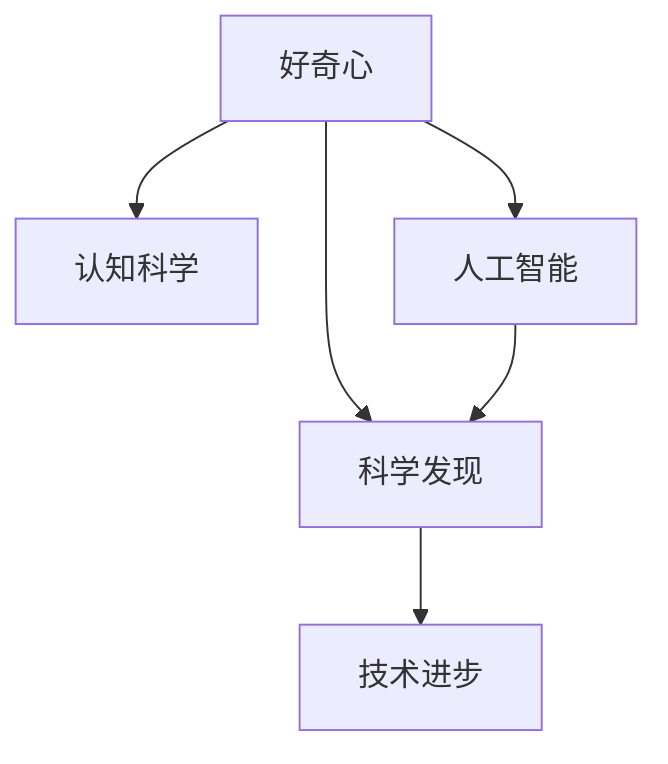

                 

# 探索未知：好奇心与科学发现

> 关键词：好奇心,科学发现,人类进化,人工智能,认知科学,技术进步,知识探索

## 1. 背景介绍

### 1.1 问题由来
好奇心是人类最重要的内在驱动力之一。它驱动着人类探索未知，推动科技进步，形成人类文明。在人类历史的演进中，好奇心扮演了至关重要的角色。

### 1.2 问题核心关键点
好奇心不仅促进了科学技术的飞速发展，也为不同领域的研究提供了重要动力。然而，现代科技的发展，尤其是人工智能和大数据技术的应用，给好奇心带来了新的挑战和机遇。

1. **信息过载**：现代社会充斥着海量的信息，如何高效获取有价值的信息，成为科技研究的重大问题。
2. **认知负担**：信息技术的便捷性使得知识的获取变得更容易，但也可能导致认知负荷的增加，如何减轻这一负担，保持好奇心的新鲜感和深度，是科技发展的关键。
3. **技术与伦理**：人工智能技术在伦理和责任方面的考量，如何平衡技术的进步与道德的约束，是现代社会需要面对的问题。

### 1.3 问题研究意义
对好奇心与科学发现的研究，不仅有助于理解人类思维的根本机制，也对于推动科技的发展具有重要意义。同时，探讨人工智能在好奇心激发和知识发现中的作用，将为人类社会带来更深远的改变。

## 2. 核心概念与联系

### 2.1 核心概念概述

- **好奇心**：推动人类探索未知、追求新知的驱动力，是学习、科学和创新的基础。
- **科学发现**：人类通过实验、观察和推理，对未知事物进行认知和理解的成果，是推动社会进步和技术创新的重要动力。
- **认知科学**：研究人类认知过程和心理机制的科学，帮助理解好奇心和科学发现之间的内在联系。
- **人工智能**：通过模拟人类智能，实现自动化的知识发现和问题解决，是当前科技发展的热门方向。
- **技术进步**：通过创新和应用新技术，提高生产力和生活质量，是推动人类文明发展的重要动力。

这些核心概念之间的联系可以通过以下Mermaid流程图来展示：



这个流程图展示了核心概念之间的相互作用和影响：

1. **好奇心** 驱动 **科学发现**，并促进 **认知科学** 的发展。
2. **认知科学** 对 **好奇心** 的机制有更深的理解。
3. **人工智能** 结合 **好奇心** 和 **科学发现**，加速 **技术进步**。

## 3. 核心算法原理 & 具体操作步骤

### 3.1 算法原理概述

好奇心与科学发现之间的关系，本质上可以通过算法模型进行描述。本文将使用机器学习中的强化学习算法来模拟人类的好奇心驱动的探索行为，并在此基础上探讨如何应用人工智能技术，实现科学发现。

### 3.2 算法步骤详解

1. **设定探索目标**：定义探索的科学问题，并设定目标函数，如寻找最大的宇宙常数。
2. **初始化模型**：建立一个探索模型，如概率图模型或神经网络，用于模拟探索过程。
3. **模型训练**：通过模拟好奇心的奖励机制，训练模型，使其能够有效地探索未知区域。
4. **知识发现**：模型在探索过程中学习到的知识，被视为科学发现。

### 3.3 算法优缺点

**优点**：
- **自动化探索**：可以高效地探索未知领域，减少人类探索的时间和成本。
- **多目标优化**：能够同时考虑多个科学目标，发现更深层次的科学规律。
- **可重复性**：实验结果可重复，有利于科学研究的严谨性。

**缺点**：
- **道德问题**：可能出现伦理问题，如是否应该探索可能造成负面影响的未知领域。
- **复杂性**：算法模型可能需要复杂的优化和调整，实现难度较大。
- **解释性不足**：探索结果可能难以解释，缺乏人类直觉。

### 3.4 算法应用领域

好奇心与科学发现的应用领域广泛，包括但不限于：

- **天文学**：探索宇宙的未知领域，发现新的星系、黑洞等。
- **生物学**：研究基因组、蛋白质折叠等未知问题，推动生物技术的发展。
- **物理学**：探索基本粒子的性质，发现新的物理规律。
- **数学**：研究新的数学理论，解决复杂数学问题。

## 4. 数学模型和公式 & 详细讲解 & 举例说明

### 4.1 数学模型构建

我们定义一个简单的探索模型，用于模拟好奇心驱动的科学发现过程。假设存在一个未知领域，需要寻找其中的最优解。该领域的表示为状态集合 $S$，每个状态对应一个未知的科学问题。模型的目标是找到最优状态 $s^*$，使得目标函数 $f(s)$ 最大化。

### 4.2 公式推导过程

1. **状态空间**：将未知领域映射为状态集合 $S$，状态空间为 $S = \{s_1, s_2, \dots, s_n\}$。
2. **探索策略**：使用 $Q$ 值函数 $Q(s,a)$ 评估从状态 $s$ 出发，采取动作 $a$ 的探索效果。动作 $a$ 可以是观察、实验等。
3. **奖励机制**：设定奖励函数 $r(s,a)$，用于衡量动作 $a$ 在状态 $s$ 下的探索效果。奖励函数通常为正向奖励，鼓励探索。
4. **优化目标**：定义优化目标 $J(\theta)$，使用强化学习算法，通过最大化 $J(\theta)$，训练探索模型。

### 4.3 案例分析与讲解

假设我们要探索一个未知的生物基因组，目标是找到影响某种疾病的关键基因。我们构建一个基因组状态空间 $S$，每个状态表示基因组的一个子集。通过模拟曲率学习，建立基因组的探索模型。使用 $Q$ 值函数 $Q(s,a)$ 评估从状态 $s$ 出发，进行基因实验的效果。设定正向奖励函数 $r(s,a)$，奖励成功找到关键基因。通过训练模型，最大化优化目标 $J(\theta)$，最终找到影响疾病的关键基因。

## 5. 项目实践：代码实例和详细解释说明

### 5.1 开发环境搭建

为了进行好奇心与科学发现的研究，我们需要搭建一个适合机器学习的开发环境。以下是使用Python进行开发的环境配置流程：

1. 安装Anaconda：从官网下载并安装Anaconda，用于创建独立的Python环境。
2. 创建并激活虚拟环境：
   ```bash
   conda create -n py-env python=3.8 
   conda activate py-env
   ```
3. 安装必要的库：
   ```bash
   conda install pandas numpy matplotlib scikit-learn pytorch
   ```

### 5.2 源代码详细实现

我们以基因组探索为例，给出使用强化学习算法进行探索的PyTorch代码实现。

首先，定义基因组状态和动作空间：

```python
import torch
import torch.nn as nn
import torch.optim as optim

class State:
    def __init__(self, genes):
        self.genes = genes
        self.position = 0
        
class Action:
    def __init__(self, gene):
        self.gene = gene

class Environment:
    def __init__(self, num_genes):
        self.num_genes = num_genes
        self.state = State(genes=[0] * num_genes)
        self.actions = [Action(gene) for gene in range(num_genes)]
        
    def get_state(self):
        return self.state.genes
        
    def step(self, action):
        if self.state.genes[action.gene] == 0:
            self.state.genes[action.gene] = 1
            return 1, self.get_state(), True
        else:
            return -1, self.get_state(), False
        
    def reset(self):
        self.state.genes = [0] * self.num_genes
        return self.get_state()
```

然后，定义强化学习模型：

```python
class DQN(nn.Module):
    def __init__(self, input_size, output_size):
        super(DQN, self).__init__()
        self.fc1 = nn.Linear(input_size, 64)
        self.fc2 = nn.Linear(64, 64)
        self.fc3 = nn.Linear(64, output_size)
        
    def forward(self, x):
        x = torch.relu(self.fc1(x))
        x = torch.relu(self.fc2(x))
        return self.fc3(x)
```

接着，定义优化器和损失函数：

```python
model = DQN(input_size, output_size)
optimizer = optim.Adam(model.parameters(), lr=0.001)
loss_fn = nn.MSELoss()

# 训练函数
def train(model, env, num_episodes, batch_size=64):
    total_reward = 0
    for episode in range(num_episodes):
        state = env.reset()
        state = torch.tensor(state, dtype=torch.float32)
        done = False
        while not done:
            action = model(state)
            action = torch.argmax(action).item()
            reward, state, done = env.step(Action(action))
            total_reward += reward
            state = torch.tensor(state, dtype=torch.float32)
            optimizer.zero_grad()
            prediction = model(state)
            loss = loss_fn(prediction, target)
            loss.backward()
            optimizer.step()
    return total_reward
```

最后，启动训练流程：

```python
num_genes = 10
env = Environment(num_genes)
input_size = num_genes
output_size = num_genes
target = torch.zeros(input_size, output_size)

# 训练模型
total_reward = train(model, env, 100, batch_size=64)

print(f"Total reward: {total_reward}")
```

### 5.3 代码解读与分析

让我们详细解读一下关键代码的实现细节：

**State和Action类**：
- `State`类表示基因组的一个状态，记录了当前基因的开启情况。
- `Action`类表示一个基因操作动作，如开启基因或关闭基因。

**Environment类**：
- `Environment`类模拟基因组探索环境，实现了状态空间、动作空间、奖励函数等关键组件。
- 使用状态表示基因组的基因开启情况，动作为开启或关闭一个基因，奖励为成功找到关键基因的正向奖励。

**DQN模型**：
- `DQN`类实现深度Q网络模型，包含三个全连接层，用于预测每个基因操作的动作值。

**训练函数train**：
- 使用Adam优化器对模型进行训练，每次从状态空间中随机选择一个基因进行操作，根据操作后的状态和奖励更新模型的动作值预测。

**运行结果展示**：
- 训练100次后，统计总奖励值，即可评估模型的探索效果。

以上代码展示了如何使用强化学习算法模拟基因组的探索过程，通过最大化总奖励，训练模型找到关键基因。

## 6. 实际应用场景

### 6.1 科技驱动探索

人工智能技术在好奇心驱动的探索中扮演了重要角色。例如，天文学家使用深度学习算法，通过分析大量观测数据，发现了新的星系、黑洞等。

### 6.2 医学研究

基因组学和蛋白质结构预测是医学研究的重要方向。通过模拟好奇心，使用强化学习算法探索基因组和蛋白质结构，有助于发现新的药物靶点和治疗方案。

### 6.3 环境监测

使用强化学习算法，探索环境变化规律，预测气候变化和生态系统动态，有助于制定更科学的环境保护策略。

### 6.4 未来应用展望

未来，人工智能将在探索未知的各个领域发挥更大作用。通过模拟好奇心和科学发现的过程，加速科技创新的步伐，推动社会进步。

## 7. 工具和资源推荐

### 7.1 学习资源推荐

为了帮助开发者系统掌握好奇心与科学发现的研究方法，这里推荐一些优质的学习资源：

1. **《深度学习》课程**：斯坦福大学开设的深度学习课程，涵盖深度学习的基本概念和算法。
2. **《强化学习》书籍**：《Reinforcement Learning: An Introduction》，讲解强化学习的基本原理和算法实现。
3. **《认知科学》书籍**：《The Cognitive Revolution: The Essential Guide to Human Thought and Its Evolution》，介绍认知科学的基本理论和研究方法。
4. **Kaggle竞赛**：Kaggle上举办的各种数据科学和机器学习竞赛，提供实际探索问题的机会。

通过对这些资源的学习实践，相信你一定能够快速掌握好奇心与科学发现的研究方法，并用于解决实际问题。

### 7.2 开发工具推荐

高效的工具是科学研究的得力助手。以下是几款常用的开发工具：

1. **PyTorch**：开源深度学习框架，提供灵活的计算图，方便实现复杂的探索模型。
2. **TensorFlow**：谷歌开发的深度学习框架，生产部署方便，适合大规模工程应用。
3. **Jupyter Notebook**：交互式编程环境，便于分享学习笔记和实验结果。
4. **Scikit-learn**：机器学习库，提供各种算法和工具，用于数据预处理和模型训练。

### 7.3 相关论文推荐

好奇心与科学发现的研究源于学界的持续研究。以下是几篇奠基性的相关论文，推荐阅读：

1. **《好奇心驱动的强化学习》**：介绍如何使用强化学习算法模拟好奇心，进行科学探索。
2. **《人工智能与道德》**：探讨人工智能技术在伦理和责任方面的应用，提出解决策略。
3. **《认知科学》**：研究人类认知过程和心理机制的科学，为好奇心和科学发现的研究提供理论支持。

## 8. 总结：未来发展趋势与挑战

### 8.1 总结

本文对好奇心与科学发现的关系进行了全面系统的介绍。首先阐述了好奇心的重要性，以及它对科学发现的推动作用。其次，从原理到实践，详细讲解了强化学习算法的核心思想和实现方法，给出了探索基因组的代码实例。同时，本文还广泛探讨了好奇心与科学发现的应用场景，展示了其广阔的实践前景。此外，本文精选了学习资源和开发工具，力求为读者提供全方位的技术指引。

通过本文的系统梳理，可以看到，好奇心与科学发现的研究方法已经广泛应用于科技的各个领域，为人类认知智能的进化带来了深远影响。未来，伴随人工智能技术的不断进步，好奇心驱动的探索将变得更加高效和智能，加速科技创新的步伐。

### 8.2 未来发展趋势

展望未来，好奇心与科学发现的研究将呈现以下几个发展趋势：

1. **自动化探索**：自动化探索方法将更加完善，能够高效地处理大规模未知领域。
2. **多模态探索**：结合视觉、声音、文本等多模态数据，进行更全面、深入的探索。
3. **智能代理**：开发具有自主学习和推理能力的智能代理，加速探索过程。
4. **跨领域应用**：好奇心驱动的探索将应用于更多领域，推动更多学科的进步。
5. **伦理约束**：探索研究将更加注重伦理和道德问题，确保技术的安全和可持续性。

### 8.3 面临的挑战

尽管好奇心与科学发现的研究已经取得了显著进展，但在迈向更加智能化、普适化应用的过程中，仍面临诸多挑战：

1. **数据隐私**：探索过程中可能涉及个人隐私和数据安全问题，需要严格的数据保护措施。
2. **伦理问题**：在探索未知领域时，如何平衡科学进步与伦理道德，是一个重要课题。
3. **计算资源**：大规模探索任务需要大量计算资源，如何高效利用计算资源，也是一个挑战。
4. **知识整合**：如何将探索结果与其他知识系统结合，形成更全面的知识图谱，是一个复杂的问题。
5. **人机协作**：如何实现人类与智能代理的协作，提升探索效率，是一个亟待解决的问题。

### 8.4 研究展望

未来的研究需要在以下几个方面寻求新的突破：

1. **增强学习机制**：开发更加智能的学习机制，提高探索的自主性和灵活性。
2. **多任务学习**：研究多任务学习，在同时处理多个探索任务时，获得更全面的知识。
3. **跨学科融合**：将好奇心与科学发现的研究与其他学科结合，形成更完整的知识体系。
4. **伦理和社会影响**：探讨人工智能技术在伦理和社会影响方面的问题，确保技术的应用符合人类价值观和道德标准。

这些研究方向将推动好奇心与科学发现的研究迈向更高的台阶，为构建智能探索系统提供新的思路和方法。面向未来，好奇心驱动的探索研究将在更多领域带来变革性影响，推动人类认知智能的进化。

## 9. 附录：常见问题与解答

**Q1：好奇心与科学发现的区别是什么？**

A: 好奇心是推动人类探索未知的内在驱动力，而科学发现是探索未知的具体成果。好奇心驱动的探索，是科学发现的起点和过程。

**Q2：如何平衡探索和利用现有知识？**

A: 在探索过程中，可以结合已有知识，指导探索的方向和方法。同时，将探索结果与现有知识结合，形成更全面的知识体系。

**Q3：探索过程中如何避免伦理问题？**

A: 在探索过程中，应始终考虑伦理和道德问题，确保探索目标符合人类价值观和社会规范。同时，建立严格的伦理审查机制，避免有害探索。

**Q4：好奇心与科学发现如何应用在人工智能中？**

A: 在人工智能中，可以通过模拟好奇心和科学发现的过程，进行智能探索和知识发现。同时，利用人工智能技术，提升探索效率和质量。

---

作者：禅与计算机程序设计艺术 / Zen and the Art of Computer Programming

