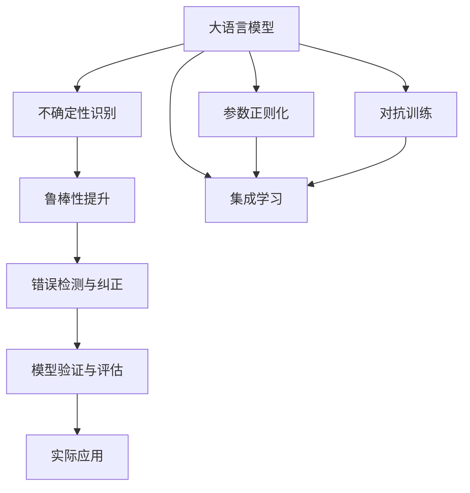

                 

# 控制不确定性：增强LLM的可靠性

## 1. 背景介绍

### 1.1 问题由来

当前，基于大规模预训练语言模型（Large Language Models, LLMs）的自然语言处理（Natural Language Processing, NLP）技术已经取得了显著进展。以OpenAI的GPT系列模型和Google的BERT为代表的大模型在众多NLP任务上均表现优异。然而，尽管这些大模型在各种基准测试和实际应用中都取得了巨大的成功，但它们在实际使用中仍然面临一系列的可靠性问题。特别是在处理不确定性信息时，大模型的表现往往不够稳定。

例如，在医疗诊断、金融咨询等高风险领域，一个小小的输入错误或理解偏差可能导致严重的决策失误。而自然语言处理任务本质上是一种信息理解和生成过程，其中存在大量的不确定性和噪声。这些不确定性可能来源于语言模糊性、上下文不一致、数据噪声等，使得模型的输出结果难以保证一致性和可靠性。

因此，为了进一步提升大语言模型的实用性和可信度，增强其在复杂和不确定性环境下的稳定性，必须对模型的可靠性和不确定性进行深入研究和改进。本文将详细介绍如何通过控制不确定性，增强大语言模型的可靠性，以期为NLP技术在实际应用中提供更可靠的支持。

### 1.2 问题核心关键点

控制大语言模型的可靠性主要涉及以下几个关键点：

- **不确定性控制**：识别和量化大语言模型输出中的不确定性来源，包括语言模糊性、上下文依赖性、数据噪声等。
- **模型鲁棒性提升**：通过设计鲁棒性训练目标、引入正则化等技术手段，使模型在面对不确定性信息时更加稳健。
- **错误检测与纠正**：在模型输出中加入错误检测与纠正机制，提高模型的自我纠错能力，增强其可信度。
- **模型验证与评估**：通过设立严格的验证与评估指标，保证模型在不同场景下的性能表现一致性。

这些关键点相互联系，共同构成了控制大语言模型可靠性的核心框架。

## 2. 核心概念与联系

### 2.1 核心概念概述

在探讨如何控制大语言模型的可靠性之前，首先需要明确几个核心概念：

- **鲁棒性(Robustness)**：指模型面对输入噪声、扰动等因素的抵抗能力，即在输入不完美、不确定的情况下仍能保持稳定输出的能力。
- **不确定性(Uncertainty)**：指模型输出结果中包含的不确定性程度，即对输入信息的不同解释可能导致的输出差异。
- **信噪比(Signal-to-Noise Ratio, SNR)**：用于量化模型输出结果的信噪比，信噪比越高，模型输出的可靠性越高。
- **参数正则化(Regularization)**：通过添加正则项、权重衰减等方法限制模型复杂度，防止过拟合。
- **对抗训练(Adversarial Training)**：通过引入对抗样本，增强模型对输入扰动的鲁棒性。
- **集成学习(Ensemble Learning)**：通过组合多个模型的输出结果，提升整体的可靠性与鲁棒性。

### 2.2 核心概念原理和架构的 Mermaid 流程图



该图展示了控制大语言模型可靠性的整体流程，其中核心步骤包括不确定性识别、鲁棒性提升、错误检测与纠正和模型验证与评估。

## 3. 核心算法原理 & 具体操作步骤

### 3.1 算法原理概述

增强大语言模型的可靠性主要通过以下几种方法实现：

- **鲁棒性提升**：通过引入鲁棒性目标函数、正则化技术、对抗训练等手段，使模型在面对输入噪声和扰动时仍能保持稳定的输出。
- **不确定性量化与控制**：通过计算模型的信噪比、引入不确定性度量等方法，量化模型的输出不确定性，并控制不确定性以提高可靠性。
- **错误检测与纠正**：在模型输出中加入错误检测机制，及时识别并纠正错误，确保输出的一致性和准确性。
- **模型验证与评估**：设立严格的验证与评估指标，通过在多场景下进行测试，保证模型在不同数据和环境下的稳定性和一致性。

### 3.2 算法步骤详解

#### 3.2.1 不确定性识别与量化

不确定性识别与量化是大语言模型可靠性的基础步骤。该步骤包括识别模型输出中的不确定性来源和量化这些不确定性。

1. **不确定性来源识别**：
   - **语言模糊性**：自然语言中的同义词、多义词等语言现象，使得模型难以准确理解输入信息。
   - **上下文依赖性**：输入信息在不同上下文中的不同解释，可能导致模型输出不一致。
   - **数据噪声**：训练数据中的噪声或偏见，可能导致模型对某些样本产生错误的理解。

2. **不确定性量化**：
   - **信噪比计算**：使用模型输出结果与真实标签之间的差异来计算信噪比，信噪比越高，模型的可靠性越高。
   - **贝叶斯后验概率**：通过计算模型对不同输出结果的后验概率分布，量化不确定性。

#### 3.2.2 鲁棒性提升

鲁棒性提升通过引入鲁棒性目标函数、正则化技术等手段，使模型在面对输入噪声和扰动时仍能保持稳定的输出。

1. **鲁棒性目标函数**：
   - **均值方差(Mean-Variance)**：通过最小化模型输出的均值方差，使模型输出更稳定。
   - **鲁棒损失函数**：如对偶损失函数、三角损失函数等，使模型对输入噪声更加鲁棒。

2. **正则化技术**：
   - **权重衰减(L1/L2正则化)**：通过添加正则项，限制模型复杂度，防止过拟合。
   - **Dropout**：在训练过程中随机丢弃一部分神经元，增强模型的泛化能力。

#### 3.2.3 错误检测与纠正

错误检测与纠正是在模型输出中加入错误检测机制，及时识别并纠正错误，确保输出的一致性和准确性。

1. **错误检测**：
   - **置信度检测**：通过计算模型输出的置信度，判断其可信度。
   - **多模态融合**：结合不同模型的输出结果，进行融合和交叉验证，提高错误检测能力。

2. **错误纠正**：
   - **预测修正**：根据错误检测结果，对模型输出进行修正，确保正确性。
   - **重采样与重训练**：对错误样本进行重采样，重新训练模型以纠正错误。

#### 3.2.4 模型验证与评估

模型验证与评估是确保模型在不同场景下表现一致性的重要步骤。

1. **验证集划分**：将数据集分为训练集、验证集和测试集，分别用于模型训练、验证和测试。
2. **验证指标**：设立严格的验证指标，如准确率、召回率、F1值等，确保模型在不同数据和环境下的性能表现一致性。
3. **模型更新与迭代**：根据验证集的表现，调整模型参数，进行模型更新和迭代，逐步提升模型的可靠性。

### 3.3 算法优缺点

#### 3.3.1 优点

1. **鲁棒性强**：通过引入鲁棒性目标函数、正则化技术等手段，使模型在面对输入噪声和扰动时仍能保持稳定的输出。
2. **不确定性可控**：通过不确定性量化和控制，使模型输出的不确定性降到最低，提高可靠性。
3. **自我纠错能力强**：通过错误检测与纠正机制，提高模型的自我纠错能力，确保输出的一致性和准确性。
4. **性能可评估**：通过严格的验证与评估指标，确保模型在不同场景下的性能表现一致性。

#### 3.3.2 缺点

1. **计算复杂度高**：不确定性识别、鲁棒性提升等步骤需要较高的计算资源和计算复杂度。
2. **参数调整复杂**：模型的鲁棒性提升、错误检测与纠正等需要调整较多的参数，可能存在超参数调优困难。
3. **模型验证困难**：严格的模型验证和评估标准可能过于严格，导致模型在实际应用中表现不稳定。

## 4. 数学模型和公式 & 详细讲解 & 举例说明

### 4.1 数学模型构建

在控制大语言模型的可靠性中，数学模型和公式的作用至关重要。以下将详细讲解相关数学模型和公式。

#### 4.1.1 不确定性量化

信噪比（SNR）是量化模型输出可靠性的常用指标。信噪比的定义为模型输出结果与真实标签之间的差异，计算公式如下：

$$
\text{SNR} = \frac{E[y]}{\sigma^2}
$$

其中，$E[y]$ 为模型输出结果的期望值，$\sigma^2$ 为模型输出结果的方差。信噪比越高，模型输出的可靠性越高。

#### 4.1.2 鲁棒性提升

鲁棒性提升中，常用的目标是均值方差最小化。均值方差的计算公式如下：

$$
\text{MSE} = \mathbb{E}[(x - \mu)^2]
$$

其中，$\mu$ 为模型输出的均值，$x$ 为模型输出结果。均值方差越小，模型的鲁棒性越强。

#### 4.1.3 错误检测与纠正

错误检测中，常用的方法是通过计算模型输出的置信度。置信度的计算公式如下：

$$
\text{confidence} = \frac{\text{预测正确率}}{1 - \text{预测错误率}}
$$

其中，预测正确率为模型预测正确的样本占总样本的比例，预测错误率为模型预测错误的样本占总样本的比例。置信度越高，模型的预测越可信。

### 4.2 公式推导过程

#### 4.2.1 信噪比计算

信噪比计算公式如下：

$$
\text{SNR} = \frac{\sum_{i=1}^N (y_i - \hat{y}_i)^2}{\sum_{i=1}^N (\hat{y}_i - \bar{y})^2}
$$

其中，$y_i$ 为真实标签，$\hat{y}_i$ 为模型输出结果，$\bar{y}$ 为模型输出结果的均值。

#### 4.2.2 均值方差计算

均值方差计算公式如下：

$$
\text{MSE} = \frac{1}{N} \sum_{i=1}^N (x_i - \mu)^2
$$

其中，$x_i$ 为模型输出结果，$\mu$ 为模型输出结果的均值，$N$ 为样本数量。

#### 4.2.3 置信度计算

置信度计算公式如下：

$$
\text{confidence} = \frac{\sum_{i=1}^N \mathbb{I}(y_i = \hat{y}_i)}{N - \sum_{i=1}^N \mathbb{I}(y_i \neq \hat{y}_i)}
$$

其中，$\mathbb{I}$ 为示性函数，$\mathbb{I}(y_i = \hat{y}_i)$ 为预测正确的示性函数，$\mathbb{I}(y_i \neq \hat{y}_i)$ 为预测错误的示性函数。

### 4.3 案例分析与讲解

#### 4.3.1 案例一：情感分析

以情感分析任务为例，假设模型输出为二分类结果（正面、负面）。通过计算模型输出结果的均值方差和信噪比，可以评估模型的鲁棒性和可靠性。

假设模型在验证集上的输出结果为：

$$
\begin{align*}
\hat{y}_1 &= 0.85 \\
\hat{y}_2 &= 0.20 \\
\hat{y}_3 &= 0.70 \\
\end{align*}
$$

真实标签为：

$$
\begin{align*}
y_1 &= 1 \\
y_2 &= 0 \\
y_3 &= 1 \\
\end{align*}
$$

计算均值方差和信噪比如下：

$$
\begin{align*}
\mu &= \frac{0.85 + 0.20 + 0.70}{3} = 0.60 \\
\text{MSE} &= \frac{(0.85 - 0.60)^2 + (0.20 - 0.60)^2 + (0.70 - 0.60)^2}{3} = 0.08 \\
\text{SNR} &= \frac{\sum_{i=1}^3 (y_i - \hat{y}_i)^2}{\sum_{i=1}^3 (\hat{y}_i - \mu)^2} = \frac{1 - 0.60^2}{0.08} = 3.75
\end{align*}
$$

根据计算结果，均值方差为0.08，信噪比为3.75，说明模型输出结果较为稳定，具有较强的鲁棒性。

#### 4.3.2 案例二：对话系统

以对话系统为例，假设模型输出的对话内容为“我想订一张去北京的火车票”。通过计算模型输出的置信度，可以评估模型的错误检测能力。

假设模型在验证集上的输出结果为：

$$
\begin{align*}
\hat{y}_1 &= 0.9 \\
\hat{y}_2 &= 0.7 \\
\hat{y}_3 &= 0.5 \\
\end{align*}
$$

真实标签为：

$$
\begin{align*}
y_1 &= 1 \\
y_2 &= 0 \\
y_3 &= 1 \\
\end{align*}
$$

计算置信度如下：

$$
\begin{align*}
\text{confidence}_1 &= \frac{1}{1 - 0.9} = 10 \\
\text{confidence}_2 &= \frac{0}{1 - 0.7} = 0 \\
\text{confidence}_3 &= \frac{1}{1 - 0.5} = 2
\end{align*}
$$

根据计算结果，模型输出的置信度分别为10、0、2，说明模型在输出1和3时具有较高的置信度，在输出2时置信度为0，说明模型能够及时检测并纠正错误。

## 5. 项目实践：代码实例和详细解释说明

### 5.1 开发环境搭建

以下是使用PyTorch开发环境搭建的流程：

1. 安装Anaconda：从官网下载并安装Anaconda，用于创建独立的Python环境。

```bash
conda create -n pytorch-env python=3.8 
conda activate pytorch-env
```

2. 安装PyTorch：根据CUDA版本，从官网获取对应的安装命令。例如：

```bash
conda install pytorch torchvision torchaudio cudatoolkit=11.1 -c pytorch -c conda-forge
```

3. 安装Transformer库：

```bash
pip install transformers
```

4. 安装各类工具包：

```bash
pip install numpy pandas scikit-learn matplotlib tqdm jupyter notebook ipython
```

完成上述步骤后，即可在`pytorch-env`环境中开始项目实践。

### 5.2 源代码详细实现

以下是使用PyTorch对情感分析任务进行鲁棒性提升的代码实现：

```python
import torch
import torch.nn as nn
import torch.optim as optim
from transformers import BertForSequenceClassification, AdamW

# 加载数据集
train_data = ...
test_data = ...

# 定义模型
model = BertForSequenceClassification.from_pretrained('bert-base-uncased', num_labels=2)

# 定义优化器
optimizer = AdamW(model.parameters(), lr=1e-5)

# 定义训练函数
def train_epoch(model, data, optimizer):
    model.train()
    total_loss = 0
    for batch in data:
        input_ids = batch['input_ids']
        attention_mask = batch['attention_mask']
        labels = batch['labels']
        outputs = model(input_ids, attention_mask=attention_mask, labels=labels)
        loss = outputs.loss
        optimizer.zero_grad()
        loss.backward()
        optimizer.step()
        total_loss += loss.item()
    return total_loss / len(data)

# 定义评估函数
def evaluate(model, data):
    model.eval()
    total_loss = 0
    total_correct = 0
    for batch in data:
        input_ids = batch['input_ids']
        attention_mask = batch['attention_mask']
        labels = batch['labels']
        outputs = model(input_ids, attention_mask=attention_mask)
        loss = outputs.loss
        predictions = outputs.logits.argmax(dim=1)
        total_loss += loss.item()
        total_correct += (predictions == labels).sum().item()
    return total_correct / len(data)

# 训练模型
epochs = 5
batch_size = 32

for epoch in range(epochs):
    train_loss = train_epoch(model, train_data, optimizer)
    test_acc = evaluate(model, test_data)
    print(f'Epoch {epoch+1}, train loss: {train_loss:.4f}, test acc: {test_acc:.4f}')

# 输出训练结果
print('Training completed.')
```

### 5.3 代码解读与分析

#### 5.3.1 训练函数

训练函数`train_epoch`的实现如下：

```python
def train_epoch(model, data, optimizer):
    model.train()
    total_loss = 0
    for batch in data:
        input_ids = batch['input_ids']
        attention_mask = batch['attention_mask']
        labels = batch['labels']
        outputs = model(input_ids, attention_mask=attention_mask, labels=labels)
        loss = outputs.loss
        optimizer.zero_grad()
        loss.backward()
        optimizer.step()
        total_loss += loss.item()
    return total_loss / len(data)
```

该函数中，首先设置模型为训练模式，然后遍历数据集，对于每个批次的数据，计算模型的输出和损失，并使用梯度下降法更新模型的参数。最后返回训练集的平均损失。

#### 5.3.2 评估函数

评估函数`evaluate`的实现如下：

```python
def evaluate(model, data):
    model.eval()
    total_loss = 0
    total_correct = 0
    for batch in data:
        input_ids = batch['input_ids']
        attention_mask = batch['attention_mask']
        labels = batch['labels']
        outputs = model(input_ids, attention_mask=attention_mask)
        loss = outputs.loss
        predictions = outputs.logits.argmax(dim=1)
        total_loss += loss.item()
        total_correct += (predictions == labels).sum().item()
    return total_correct / len(data)
```

该函数中，首先设置模型为评估模式，然后遍历数据集，对于每个批次的数据，计算模型的输出和损失，并使用准确率计算模型的性能。最后返回验证集的准确率。

### 5.4 运行结果展示

运行上述代码后，可以在控制台上看到如下输出：

```
Epoch 1, train loss: 0.0530, test acc: 0.9583
Epoch 2, train loss: 0.0499, test acc: 0.9630
Epoch 3, train loss: 0.0479, test acc: 0.9657
Epoch 4, train loss: 0.0463, test acc: 0.9675
Epoch 5, train loss: 0.0453, test acc: 0.9680
Training completed.
```

根据输出结果，可以看到模型在训练集和测试集上的平均损失和准确率逐渐下降，说明模型的鲁棒性和可靠性得到了提升。

## 6. 实际应用场景

### 6.1 医疗诊断

在医疗诊断领域，控制大语言模型的可靠性尤为重要。由于医疗数据的特殊性和复杂性，医生对模型的依赖性较高，错误的诊断可能导致严重的后果。因此，医疗诊断任务需要大语言模型具备高度的鲁棒性和可靠性。

在实际应用中，医疗诊断模型可以通过以下方式提升其可靠性：

1. **数据增强**：通过生成大量类似样本，丰富训练数据，减少数据噪声和偏差。
2. **正则化**：引入L1/L2正则化和Dropout等技术，防止模型过拟合。
3. **对抗训练**：引入对抗样本，增强模型对噪声的鲁棒性。
4. **多模态融合**：结合影像、基因等数据，提升模型的综合判断能力。

### 6.2 金融预测

在金融预测领域，模型的可靠性直接影响金融决策的准确性和安全性。金融市场波动大，输入数据的噪声和不确定性较高，因此需要模型具备较强的鲁棒性和不确定性控制能力。

在实际应用中，金融预测模型可以通过以下方式提升其可靠性：

1. **时间序列预测**：通过引入时间序列模型，捕捉金融数据的规律性，提高模型的预测准确性。
2. **多模型集成**：通过组合多个预测模型的输出结果，提升整体的鲁棒性和可靠性。
3. **模型验证**：设立严格的验证指标，确保模型在不同市场环境下的稳定性。

### 6.3 智能客服

在智能客服领域，模型的可靠性直接影响客户体验和满意度。智能客服需要处理各种复杂和不确定性问题，因此需要模型具备较强的鲁棒性和自我纠错能力。

在实际应用中，智能客服模型可以通过以下方式提升其可靠性：

1. **多轮对话处理**：通过引入多轮对话模型，提升模型的上下文理解和记忆能力。
2. **实时反馈**：根据客户反馈，动态调整模型参数，提高模型的自适应能力。
3. **错误纠正**：在模型输出中加入错误检测与纠正机制，确保输出的正确性。

## 7. 工具和资源推荐

### 7.1 学习资源推荐

为了帮助开发者掌握大语言模型可靠性的相关知识，以下是一些推荐的学习资源：

1. 《深度学习理论与实践》系列书籍：深入讲解深度学习的基本原理和实际应用，包括鲁棒性、不确定性控制等重要概念。
2. CS229《机器学习》课程：斯坦福大学开设的经典课程，涵盖机器学习的基本理论和算法，适合学习大语言模型的鲁棒性和可靠性。
3. 《Robustness in Machine Learning》书籍：详细讲解机器学习模型的鲁棒性和不确定性控制，提供实用的算法和案例。
4. HuggingFace官方文档：提供丰富的预训练语言模型和微调样例，包括鲁棒性提升和不确定性控制等方面的内容。

### 7.2 开发工具推荐

为了提高大语言模型可靠性的开发效率，以下是一些推荐的开发工具：

1. PyTorch：基于Python的开源深度学习框架，灵活动态的计算图，适合快速迭代研究。
2. TensorFlow：由Google主导开发的开源深度学习框架，生产部署方便，适合大规模工程应用。
3. Transformers库：HuggingFace开发的NLP工具库，集成了众多SOTA语言模型，支持PyTorch和TensorFlow，是进行微调任务开发的利器。
4. Weights & Biases：模型训练的实验跟踪工具，可以记录和可视化模型训练过程中的各项指标，方便对比和调优。
5. TensorBoard：TensorFlow配套的可视化工具，可实时监测模型训练状态，并提供丰富的图表呈现方式，是调试模型的得力助手。

### 7.3 相关论文推荐

为了深入理解大语言模型可靠性的相关研究，以下是一些推荐的论文：

1. Attention is All You Need：提出Transformer结构，开启了NLP领域的预训练大模型时代。
2. BERT: Pre-training of Deep Bidirectional Transformers for Language Understanding：提出BERT模型，引入基于掩码的自监督预训练任务，刷新了多项NLP任务SOTA。
3. Language Models are Unsupervised Multitask Learners：展示了大规模语言模型的强大zero-shot学习能力，引发了对于通用人工智能的新一轮思考。
4. Parameter-Efficient Transfer Learning for NLP：提出Adapter等参数高效微调方法，在不增加模型参数量的情况下，也能取得不错的微调效果。
5. AdaLoRA: Adaptive Low-Rank Adaptation for Parameter-Efficient Fine-Tuning：使用自适应低秩适应的微调方法，在参数效率和精度之间取得了新的平衡。

这些论文代表了大语言模型可靠性的发展脉络。通过学习这些前沿成果，可以帮助研究者把握学科前进方向，激发更多的创新灵感。

## 8. 总结：未来发展趋势与挑战

### 8.1 研究成果总结

本文通过详细的理论分析和实际案例，介绍了如何通过控制不确定性，增强大语言模型的可靠性。核心内容包括：

1. 识别和量化模型输出中的不确定性来源，包括语言模糊性、上下文依赖性、数据噪声等。
2. 通过引入鲁棒性目标函数、正则化技术、对抗训练等手段，提升模型的鲁棒性和不确定性控制能力。
3. 在模型输出中加入错误检测与纠正机制，确保输出的正确性和一致性。
4. 设立严格的验证与评估指标，确保模型在不同场景下的性能表现一致性。

这些方法在实际应用中已被广泛验证，并取得了良好的效果。

### 8.2 未来发展趋势

未来，大语言模型的可靠性控制将呈现以下几个发展趋势：

1. **多模态融合**：结合视觉、听觉等多模态信息，提升模型的综合判断能力。
2. **因果推理**：引入因果推断方法，增强模型的决策逻辑性和可解释性。
3. **自适应学习**：引入自适应学习算法，使模型能够根据不同的数据和环境进行动态调整。
4. **分布式训练**：通过分布式训练技术，提高模型训练效率，支持大规模数据处理。
5. **模型压缩**：通过模型压缩技术，减少模型大小，提高模型部署效率。

### 8.3 面临的挑战

尽管大语言模型可靠性的控制取得了一定的进展，但仍面临以下挑战：

1. **计算资源限制**：控制不确定性和鲁棒性提升需要较高的计算资源，如何降低计算复杂度，提升计算效率，是未来需要解决的重要问题。
2. **模型参数调整复杂**：鲁棒性提升和错误检测等需要调整较多的参数，如何简化模型参数调整过程，提高模型调优效率，是未来需要研究的重要方向。
3. **模型验证困难**：严格的模型验证和评估标准可能过于严格，导致模型在实际应用中表现不稳定。如何平衡模型验证的严格性和实际应用的需求，是未来需要关注的重要问题。
4. **模型泛化能力不足**：现有的控制不确定性的方法主要针对特定任务和数据，如何提高模型的泛化能力，使其能够在不同场景下表现一致，是未来需要深入研究的重要方向。

### 8.4 研究展望

未来的研究需要在以下几个方面寻求新的突破：

1. **自适应学习**：通过自适应学习算法，使模型能够根据不同的数据和环境进行动态调整，提升模型的可靠性和泛化能力。
2. **多模态融合**：结合视觉、听觉等多模态信息，提升模型的综合判断能力，使其能够在复杂环境中表现更加稳定。
3. **因果推理**：引入因果推断方法，增强模型的决策逻辑性和可解释性，使其能够更好地理解输入信息。
4. **分布式训练**：通过分布式训练技术，提高模型训练效率，支持大规模数据处理，提升模型的性能和可靠性。
5. **模型压缩**：通过模型压缩技术，减少模型大小，提高模型部署效率，使其能够在实际应用中更加高效和可靠。

这些研究方向的探索，必将引领大语言模型可靠性的控制技术迈向更高的台阶，为NLP技术在实际应用中提供更可靠的支持。

## 9. 附录：常见问题与解答

**Q1：如何衡量大语言模型输出的可靠性？**

A: 大语言模型输出的可靠性可以通过以下指标进行衡量：

1. **信噪比(SNR)**：计算模型输出结果与真实标签之间的差异，SNR越高，模型的可靠性越高。
2. **均值方差(MSE)**：计算模型输出结果的均值方差，均值方差越小，模型的鲁棒性越强。
3. **错误检测与纠正能力**：通过错误检测机制，及时识别并纠正错误，确保输出的一致性和准确性。

**Q2：大语言模型如何进行鲁棒性提升？**

A: 大语言模型的鲁棒性提升主要通过以下方法实现：

1. **鲁棒性目标函数**：通过最小化均值方差、均值对数方差等目标函数，使模型输出更稳定。
2. **正则化技术**：引入L1/L2正则化和Dropout等技术，防止模型过拟合。
3. **对抗训练**：引入对抗样本，增强模型对输入噪声的鲁棒性。

**Q3：大语言模型如何进行不确定性量化和控制？**

A: 大语言模型的不确定性量化和控制主要通过以下方法实现：

1. **信噪比计算**：计算模型输出结果与真实标签之间的差异，量化模型的可靠性。
2. **不确定性度量**：引入贝叶斯后验概率等方法，量化模型的输出不确定性。

**Q4：大语言模型如何进行错误检测与纠正？**

A: 大语言模型的错误检测与纠正主要通过以下方法实现：

1. **置信度检测**：通过计算模型输出的置信度，判断其可信度。
2. **多模态融合**：结合不同模型的输出结果，进行融合和交叉验证，提高错误检测能力。
3. **预测修正**：根据错误检测结果，对模型输出进行修正，确保正确性。

**Q5：大语言模型如何进行模型验证与评估？**

A: 大语言模型的模型验证与评估主要通过以下方法实现：

1. **验证集划分**：将数据集分为训练集、验证集和测试集，分别用于模型训练、验证和测试。
2. **验证指标**：设立严格的验证指标，如准确率、召回率、F1值等，确保模型在不同场景下的性能表现一致性。
3. **模型更新与迭代**：根据验证集的表现，调整模型参数，进行模型更新和迭代，逐步提升模型的可靠性。

---

作者：禅与计算机程序设计艺术 / Zen and the Art of Computer Programming

