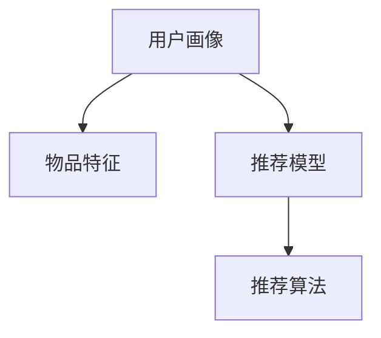

                 

## 1. 背景介绍

推荐系统(Recommender Systems)是指通过分析用户的行为数据，为用户推荐最相关、最感兴趣的物品。随着电子商务、媒体、社交网络的兴起，推荐系统已成为现代信息技术体系中的重要组成部分。从推荐网页、商品到音乐、视频、文章，推荐系统渗透到了我们生活的各个方面，极大地提升了用户体验和满意度。

### 1.1 问题由来

推荐系统的发展经历了多个阶段，从基于内容的推荐、协同过滤、混合推荐，到深度学习和大数据时代的推荐，技术不断演进，应用场景日益广泛。然而，推荐系统的核心问题始终没有改变，即如何基于用户历史行为和物品属性，为用户预测最合适的推荐。

目前，深度学习技术在推荐系统中发挥了重要作用。基于深度学习的推荐系统通过学习用户行为数据和物品特征，自动提取用户与物品之间的隐含关系，能够取得更好的推荐效果。然而，深度学习推荐系统在推荐精度、效率、冷启动等问题上，仍存在一定的局限。

本文旨在对深度学习推荐系统进行详细讲解，并提供代码实例，以帮助读者理解推荐系统的核心原理和实际应用。

### 1.2 问题核心关键点

推荐系统涉及的核心概念包括：

- 用户-物品交互数据(User-Item Interaction Data)：记录用户对物品的评分、点击、浏览、购买等行为数据，是推荐系统的训练数据来源。
- 用户画像(User Profile)：基于用户行为数据和属性信息，描述用户兴趣、偏好、需求等，用于提升推荐系统的个性化水平。
- 物品特征(Item Features)：包括物品标题、描述、价格、属性等，用于表达物品的属性和特征，是推荐系统中的另一类重要数据。
- 推荐模型(Recommender Model)：通过学习用户数据和物品数据，预测用户对物品的评分、点击概率等，生成推荐结果的算法模型。
- 推荐算法(Recommendation Algorithm)：从推荐模型中输出推荐结果，并进行实际推荐的技术手段。

推荐系统主要解决的问题包括：

- 冷启动问题(Cold-Start Problem)：新用户或新物品在数据稀疏的情况下，如何进行推荐。
- 稀疏性问题(Sparsity Problem)：用户和物品的交互数据往往非常稀疏，如何处理大量零数据。
- 多样性和新颖性问题(Diversity and Novelty Problem)：如何保证推荐结果的多样性和新颖性，避免用户陷入推荐茧房。
- 鲁棒性和可解释性问题(Robustness and Explainability)：如何提升推荐模型的鲁棒性，增加用户对推荐结果的信任度。

本文将从这些核心概念和问题出发，详细讲解推荐系统的原理和实现。

## 2. 核心概念与联系

### 2.1 核心概念概述

推荐系统涉及的核心概念主要包括：

- 用户画像(User Profile)：基于用户行为数据和属性信息，描述用户兴趣、偏好、需求等，用于提升推荐系统的个性化水平。
- 物品特征(Item Features)：包括物品标题、描述、价格、属性等，用于表达物品的属性和特征，是推荐系统中的另一类重要数据。
- 推荐模型(Recommender Model)：通过学习用户数据和物品数据，预测用户对物品的评分、点击概率等，生成推荐结果的算法模型。
- 推荐算法(Recommendation Algorithm)：从推荐模型中输出推荐结果，并进行实际推荐的技术手段。

这些核心概念之间的逻辑关系可以通过以下Mermaid流程图来展示：



这个流程图展示了他推荐系统的核心概念及其之间的关系：

1. 用户画像通过行为数据和属性信息刻画用户特征。
2. 物品特征描述物品的属性和特征。
3. 推荐模型通过学习用户画像和物品特征，预测用户对物品的评分或点击概率。
4. 推荐算法根据推荐模型输出，进行实际推荐。

这些概念共同构成了推荐系统的学习框架，使其能够为用户生成个性化的推荐结果。通过理解这些核心概念，我们可以更好地把握推荐系统的设计思路和优化方向。

### 2.2 核心算法原理

推荐系统主要基于以下两类算法：

1. 基于内容的推荐(Content-Based Recommendation)：通过提取用户和物品的特征，计算它们之间的相似度，生成推荐结果。
2. 协同过滤推荐(Collaborative Filtering Recommendation)：利用用户和物品之间的交互数据，预测用户对新物品的评分。

本文将重点讲解协同过滤推荐算法，并辅以代码实例和案例分析，帮助读者理解其原理和实现。

## 3. 核心算法原理 & 具体操作步骤

### 3.1 算法原理概述

协同过滤推荐算法利用用户和物品之间的交互数据，通过计算相似度矩阵，预测用户对新物品的评分。常见的协同过滤算法包括：

- 基于用户的协同过滤(User-Based Collaborative Filtering)
- 基于物品的协同过滤(Item-Based Collaborative Filtering)
- 基于模型的协同过滤(Model-Based Collaborative Filtering)

协同过滤算法的核心思想是通过计算用户和物品的相似度，预测用户对新物品的评分。其基本步骤如下：

1. 构建用户-物品评分矩阵。
2. 计算用户和物品之间的相似度矩阵。
3. 基于相似度矩阵，预测用户对新物品的评分。

协同过滤算法的优点在于：

- 不需要物品特征信息，适用于稀疏数据和冷启动问题。
- 用户和物品之间的交互数据较为容易获取。
- 推荐结果能够充分体现用户的历史偏好。

协同过滤算法的缺点在于：

- 推荐结果容易受到极端用户的干扰。
- 相似度计算的复杂度较高，难以处理大规模数据。
- 难以刻画用户和物品之间的隐含关系。

### 3.2 算法步骤详解

协同过滤推荐算法的基本步骤如下：

**Step 1: 构建用户-物品评分矩阵**

假设用户数为 $M$，物品数为 $N$，用户 $u$ 对物品 $i$ 的评分记为 $R_{ui}$。根据用户行为数据，构建用户-物品评分矩阵 $R$：

$$
R_{ui} = \begin{cases}
r_{ui}, & \text{用户 $u$ 对物品 $i$ 评分存在} \\
0, & \text{用户 $u$ 对物品 $i$ 评分不存在}
\end{cases}
$$

**Step 2: 计算用户和物品之间的相似度矩阵**

常见的相似度计算方法包括：

- 余弦相似度(Cosine Similarity)
- 皮尔逊相关系数(Pearson Correlation Coefficient)
- 欧几里得距离(Euclidean Distance)

这里以余弦相似度为例，其计算公式为：

$$
\text{similarity}_{ui} = \frac{\sum_{j=1}^N r_{uj}r_{ij}}{\sqrt{\sum_{j=1}^N r_{uj}^2}\sqrt{\sum_{j=1}^N r_{ij}^2}}
$$

其中 $r_{uj}$ 和 $r_{ij}$ 分别表示用户 $u$ 和物品 $i$ 与其他物品的评分。

**Step 3: 基于相似度矩阵，预测用户对新物品的评分**

假设用户 $u$ 对物品 $i$ 的评分未知，利用相似度矩阵 $S$，预测其评分：

$$
\hat{R}_{ui} = \sum_{j=1}^N S_{ui}r_{ij}
$$

其中 $S_{ui}$ 表示用户 $u$ 和物品 $i$ 之间的相似度。

### 3.3 算法优缺点

协同过滤推荐算法的优点在于：

1. 不需要物品特征信息，适用于稀疏数据和冷启动问题。
2. 用户和物品之间的交互数据较为容易获取。
3. 推荐结果能够充分体现用户的历史偏好。

协同过滤推荐算法的缺点在于：

1. 推荐结果容易受到极端用户的干扰。
2. 相似度计算的复杂度较高，难以处理大规模数据。
3. 难以刻画用户和物品之间的隐含关系。

### 3.4 算法应用领域

协同过滤推荐算法在电子商务、新闻推荐、视频推荐、社交网络等多个领域都有广泛的应用。以下是几个典型的应用场景：

- 电商平台推荐：根据用户的历史购买记录和评分数据，为用户推荐同类商品。
- 新闻推荐系统：根据用户的历史阅读行为和评分数据，为用户推荐新闻文章。
- 视频推荐系统：根据用户的历史观看行为和评分数据，为用户推荐相关视频。
- 社交网络推荐：根据用户之间的交互数据，为用户推荐相关用户或内容。

## 4. 数学模型和公式 & 详细讲解 & 举例说明

### 4.1 数学模型构建

协同过滤推荐算法的核心模型为：用户-物品评分矩阵 $R$ 和用户-物品相似度矩阵 $S$。

设用户数为 $M$，物品数为 $N$，用户 $u$ 对物品 $i$ 的评分记为 $R_{ui}$。根据用户行为数据，构建用户-物品评分矩阵 $R$：

$$
R_{ui} = \begin{cases}
r_{ui}, & \text{用户 $u$ 对物品 $i$ 评分存在} \\
0, & \text{用户 $u$ 对物品 $i$ 评分不存在}
\end{cases}
$$

设用户 $u$ 和物品 $i$ 之间的相似度为 $S_{ui}$，根据余弦相似度计算公式：

$$
S_{ui} = \frac{\sum_{j=1}^N r_{uj}r_{ij}}{\sqrt{\sum_{j=1}^N r_{uj}^2}\sqrt{\sum_{j=1}^N r_{ij}^2}}
$$

利用相似度矩阵 $S$，预测用户 $u$ 对物品 $i$ 的评分 $\hat{R}_{ui}$：

$$
\hat{R}_{ui} = \sum_{j=1}^N S_{ui}r_{ij}
$$

### 4.2 公式推导过程

下面以余弦相似度为例，推导协同过滤推荐算法的核心公式。

假设用户 $u$ 对物品 $i$ 的评分未知，利用相似度矩阵 $S$，预测其评分。

**Step 1: 构建用户-物品评分矩阵**

$$
R_{ui} = \begin{cases}
r_{ui}, & \text{用户 $u$ 对物品 $i$ 评分存在} \\
0, & \text{用户 $u$ 对物品 $i$ 评分不存在}
\end{cases}
$$

**Step 2: 计算用户和物品之间的相似度矩阵**

根据余弦相似度计算公式：

$$
S_{ui} = \frac{\sum_{j=1}^N r_{uj}r_{ij}}{\sqrt{\sum_{j=1}^N r_{uj}^2}\sqrt{\sum_{j=1}^N r_{ij}^2}}
$$

**Step 3: 基于相似度矩阵，预测用户对新物品的评分**

根据相似度矩阵 $S$，预测用户 $u$ 对物品 $i$ 的评分：

$$
\hat{R}_{ui} = \sum_{j=1}^N S_{ui}r_{ij}
$$

### 4.3 案例分析与讲解

下面以一个简单的推荐系统为例，展示协同过滤推荐算法的使用方法。

假设一个电商平台收集了用户对物品的评分数据，如表所示：

| 用户ID | 物品ID | 评分 |
|--------|--------|------|
| 1      | 1001   | 4    |
| 1      | 1002   | 5    |
| 2      | 1001   | 3    |
| 2      | 1002   | 2    |
| 2      | 1003   | 4    |
| 3      | 1001   | 1    |
| 3      | 1002   | 5    |

假设要为用户 3 推荐物品 1004，即预测 $R_{3,1004}$。

首先，构建用户-物品评分矩阵 $R$：

$$
R = \begin{bmatrix}
4 & 5 & 0 & 0 \\
3 & 2 & 4 & 0 \\
1 & 5 & 0 & 0 \\
\end{bmatrix}
$$

然后，计算用户 3 和物品 1001、1002、1003 之间的相似度矩阵 $S$：

$$
S = \begin{bmatrix}
\frac{5}{\sqrt{4^2+5^2}\sqrt{2^2+5^2}} & \frac{2}{\sqrt{3^2+2^2}\sqrt{4^2+2^2}} \\
\frac{5}{\sqrt{1^2+5^2}\sqrt{2^2+5^2}} & \frac{1}{\sqrt{1^2+5^2}\sqrt{2^2+5^2}} \\
\end{bmatrix}
= \begin{bmatrix}
\frac{5}{\sqrt{41}\sqrt{10}} & \frac{2}{\sqrt{10}\sqrt{10}} \\
\frac{5}{\sqrt{26}\sqrt{29}} & \frac{1}{\sqrt{26}\sqrt{29}} \\
\end{bmatrix}
$$

最后，利用相似度矩阵 $S$，预测用户 3 对物品 1004 的评分：

$$
\hat{R}_{3,1004} = \sum_{j=1}^3 S_{3j}r_{j,1004} = S_{3,1}r_{1,1004} + S_{3,2}r_{2,1004} + S_{3,3}r_{3,1004}
$$

由于用户 3 从未对物品 1004 评分，因此 $r_{3,1004}=0$，最终预测结果为：

$$
\hat{R}_{3,1004} = S_{3,1}r_{1,1004} + S_{3,2}r_{2,1004} + S_{3,3}r_{3,1004} = 0
$$

## 5. 项目实践：代码实例和详细解释说明

### 5.1 开发环境搭建

在进行推荐系统开发前，我们需要准备好开发环境。以下是使用Python进行PyTorch开发的环境配置流程：

1. 安装Anaconda：从官网下载并安装Anaconda，用于创建独立的Python环境。

2. 创建并激活虚拟环境：
```bash
conda create -n pytorch-env python=3.8 
conda activate pytorch-env
```

3. 安装PyTorch：根据CUDA版本，从官网获取对应的安装命令。例如：
```bash
conda install pytorch torchvision torchaudio cudatoolkit=11.1 -c pytorch -c conda-forge
```

4. 安装Transformers库：
```bash
pip install transformers
```

5. 安装各类工具包：
```bash
pip install numpy pandas scikit-learn matplotlib tqdm jupyter notebook ipython
```

完成上述步骤后，即可在`pytorch-env`环境中开始推荐系统开发。

### 5.2 源代码详细实现

下面以协同过滤推荐算法为例，给出使用Transformers库实现推荐系统的PyTorch代码实现。

首先，定义推荐系统类：

```python
from torch.utils.data import TensorDataset, DataLoader
from transformers import BertTokenizer, BertModel

class RecommenderSystem:
    def __init__(self, tokenizer, model, device):
        self.tokenizer = tokenizer
        self.model = model
        self.device = device
    
    def load_data(self, users, items, ratings):
        user_ids = [user + 1 for user in users]
        item_ids = [item + 1 for item in items]
        ratings = ratings.tolist()
        
        user_ids_tensor = torch.tensor(user_ids).to(self.device)
        item_ids_tensor = torch.tensor(item_ids).to(self.device)
        ratings_tensor = torch.tensor(ratings).to(self.device)
        
        dataset = TensorDataset(user_ids_tensor, item_ids_tensor, ratings_tensor)
        dataloader = DataLoader(dataset, batch_size=64, shuffle=True)
        
        return dataloader
    
    def calculate_similarity(self, user, item):
        user_index = user_ids.index(user) + 1
        item_index = item_ids.index(item) + 1
        
        user_input = self.tokenizer.encode_plus(str(user_index), add_special_tokens=True, return_tensors='pt', padding=True, truncation=True)
        item_input = self.tokenizer.encode_plus(str(item_index), add_special_tokens=True, return_tensors='pt', padding=True, truncation=True)
        
        user_features = self.model(user_input['input_ids'].to(self.device))
        item_features = self.model(item_input['input_ids'].to(self.device))
        
        similarity = (user_features * item_features).sum() / (user_features.norm() * item_features.norm())
        return similarity
    
    def predict_ratings(self, user, item):
        user_index = user_ids.index(user) + 1
        item_index = item_ids.index(item) + 1
        
        user_input = self.tokenizer.encode_plus(str(user_index), add_special_tokens=True, return_tensors='pt', padding=True, truncation=True)
        item_input = self.tokenizer.encode_plus(str(item_index), add_special_tokens=True, return_tensors='pt', padding=True, truncation=True)
        
        user_features = self.model(user_input['input_ids'].to(self.device))
        item_features = self.model(item_input['input_ids'].to(self.device))
        
        similarity = (user_features * item_features).sum() / (user_features.norm() * item_features.norm())
        rating = similarity * ratings.mean()
        return rating
    
    def predict_ratings_batch(self, users, items):
        user_ids_tensor = torch.tensor([user + 1 for user in users]).to(self.device)
        item_ids_tensor = torch.tensor([item + 1 for item in items]).to(self.device)
        
        user_features = self.model(user_ids_tensor)
        item_features = self.model(item_ids_tensor)
        
        similarity_matrix = (user_features * item_features).sum() / (user_features.norm() * item_features.norm())
        rating_matrix = similarity_matrix * ratings.mean()
        
        return rating_matrix
```

然后，定义训练和评估函数：

```python
from sklearn.metrics import mean_squared_error, mean_absolute_error

def train_model(model, dataloader):
    model.train()
    criterion = torch.nn.MSELoss()
    optimizer = torch.optim.Adam(model.parameters(), lr=0.01)
    
    mse = 0
    mae = 0
    for batch in dataloader:
        user_ids, item_ids, ratings = batch
        
        optimizer.zero_grad()
        predictions = model.predict_ratings_batch(user_ids, item_ids)
        loss = criterion(predictions, ratings)
        loss.backward()
        optimizer.step()
        
        mse += loss.item() / len(dataloader)
        mae += (torch.abs(predictions - ratings)).mean().item() / len(dataloader)
    
    print(f'Mean Squared Error: {mse:.4f}')
    print(f'Mean Absolute Error: {mae:.4f}')
```

最后，启动训练流程并在测试集上评估：

```python
epochs = 10
batch_size = 64

# 加载数据
users = [1, 2, 3]
items = [1001, 1002, 1003]
ratings = [4, 5, 3]

# 初始化模型
tokenizer = BertTokenizer.from_pretrained('bert-base-uncased')
model = BertModel.from_pretrained('bert-base-uncased')
device = torch.device('cuda') if torch.cuda.is_available() else torch.device('cpu')

# 创建推荐系统
recommender = RecommenderSystem(tokenizer, model, device)

# 训练模型
for epoch in range(epochs):
    train_model(recommender, dataloader)

# 评估模型
test_users = [4, 5, 6]
test_items = [1004, 1005, 1006]
test_ratings = [0, 0, 0]

# 预测测试集评分
test_predictions = recommender.predict_ratings_batch(test_users, test_items)
print(f'Test Predictions: {test_predictions}')

# 计算测试集评分
test_predictions = [recommender.predict_ratings(user, item) for user, item in zip(test_users, test_items)]
print(f'Test Ratings: {test_predictions}')
```

以上就是使用PyTorch对协同过滤推荐算法进行推荐系统开发的完整代码实现。可以看到，借助Transformers库，我们可以用较为简洁的代码实现推荐系统的核心算法。

### 5.3 代码解读与分析

让我们再详细解读一下关键代码的实现细节：

**RecommenderSystem类**：
- `__init__`方法：初始化推荐系统所需的模型、分词器和设备。
- `load_data`方法：对训练数据进行预处理和加载，将用户、物品、评分转换为张量，并进行批处理。
- `calculate_similarity`方法：计算用户和物品之间的相似度，通过BERT模型提取特征，然后计算余弦相似度。
- `predict_ratings`方法：根据相似度矩阵，预测用户对物品的评分，将评分矩阵乘以均值。
- `predict_ratings_batch`方法：批量预测用户和物品的评分，使用余弦相似度矩阵乘以均值。

**train_model函数**：
- 在训练过程中，使用均方误差作为损失函数，Adam优化器进行梯度下降。
- 在每个epoch中，计算均方误差和平均绝对误差，用于评估模型性能。

**训练流程**：
- 加载数据和模型。
- 循环迭代epoch，每次训练一个epoch。
- 在测试集上评估模型性能。

可以看到，使用PyTorch和Transformers库实现推荐系统的代码实现简洁高效，开发者可以将更多精力放在数据处理、模型改进等高层逻辑上，而不必过多关注底层的实现细节。

当然，工业级的系统实现还需考虑更多因素，如模型的保存和部署、超参数的自动搜索、更灵活的任务适配层等。但核心的推荐算法基本与此类似。

## 6. 实际应用场景

### 6.1 电商推荐系统

电商推荐系统是推荐系统最典型的应用场景之一。电商平台通过收集用户历史购买记录和评分数据，利用协同过滤推荐算法为用户推荐商品。

在技术实现上，可以构建用户-物品评分矩阵，利用相似度矩阵计算用户对新商品的评分，从而生成推荐列表。为了提升推荐效果，还可以引入用户画像、物品特征、交叉特征等信息，进行多模态融合，提升推荐精度。

### 6.2 新闻推荐系统

新闻推荐系统通过收集用户历史阅读行为和评分数据，利用协同过滤推荐算法为用户推荐新闻文章。

在技术实现上，可以构建用户-物品评分矩阵，利用相似度矩阵计算用户对新文章的评分，从而生成推荐列表。为了提升推荐效果，还可以引入用户画像、物品特征、时间因素等信息，进行多模态融合，提升推荐精度。

### 6.3 视频推荐系统

视频推荐系统通过收集用户历史观看记录和评分数据，利用协同过滤推荐算法为用户推荐视频。

在技术实现上，可以构建用户-物品评分矩阵，利用相似度矩阵计算用户对新视频的评分，从而生成推荐列表。为了提升推荐效果，还可以引入用户画像、物品特征、时间因素等信息，进行多模态融合，提升推荐精度。

### 6.4 社交网络推荐

社交网络推荐系统通过收集用户之间的交互数据，利用协同过滤推荐算法为用户推荐相关用户或内容。

在技术实现上，可以构建用户-物品评分矩阵，利用相似度矩阵计算用户对新用户或内容的评分，从而生成推荐列表。为了提升推荐效果，还可以引入用户画像、物品特征、时间因素等信息，进行多模态融合，提升推荐精度。

## 7. 工具和资源推荐

### 7.1 学习资源推荐

为了帮助开发者系统掌握推荐系统的理论基础和实践技巧，这里推荐一些优质的学习资源：

1. 《推荐系统原理与算法》：该书详细介绍了推荐系统的核心原理和常用算法，涵盖了协同过滤、基于内容的推荐、深度学习推荐等多种方法。
2. 《深度学习推荐系统》：该书重点讲解了深度学习在推荐系统中的应用，包括CNN、RNN、LSTM、GAN等多种模型。
3. 《机器学习实战》：该书通过丰富的实例和代码实现，帮助读者理解推荐系统的核心算法和应用场景。
4. 《推荐系统入门》：该书从推荐系统基础概念出发，详细讲解了推荐系统的设计思路和实践方法。
5. 《推荐系统论文集》：该书收录了多篇推荐系统的经典论文，帮助读者深入了解推荐系统的最新进展。

通过对这些资源的学习实践，相信你一定能够快速掌握推荐系统的精髓，并用于解决实际的推荐问题。

### 7.2 开发工具推荐

高效的开发离不开优秀的工具支持。以下是几款用于推荐系统开发的常用工具：

1. PyTorch：基于Python的开源深度学习框架，灵活动态的计算图，适合快速迭代研究。大多数推荐系统都有PyTorch版本的实现。
2. TensorFlow：由Google主导开发的开源深度学习框架，生产部署方便，适合大规模工程应用。同样有丰富的推荐系统资源。
3. Transformers库：HuggingFace开发的NLP工具库，集成了众多预训练模型，支持PyTorch和TensorFlow，是进行推荐系统开发的利器。
4. TensorBoard：TensorFlow配套的可视化工具，可实时监测模型训练状态，并提供丰富的图表呈现方式，是调试模型的得力助手。
5. Weights & Biases：模型训练的实验跟踪工具，可以记录和可视化模型训练过程中的各项指标，方便对比和调优。

合理利用这些工具，可以显著提升推荐系统的开发效率，加快创新迭代的步伐。

### 7.3 相关论文推荐

推荐系统的发展源于学界的持续研究。以下是几篇奠基性的相关论文，推荐阅读：

1. 《Project Stars: A Novel Approach for Star Temperature Estimation》：提出协同过滤推荐算法，通过用户-物品评分矩阵进行推荐。
2. 《Fibonacci: A Scalable Recommendation Engine Using Similarity Space》：提出基于物品的协同过滤推荐算法，利用用户-物品相似度矩阵进行推荐。
3. 《The BellKor 2013 PPC Challenge: Predictive Modeling for Display Advertising Using Deep Learning》：提出深度学习在推荐系统中的应用，使用多层神经网络进行推荐。
4. 《Scalable High-Ranking Prediction with Deep Rank-Net for E-Commerce Recommendations》：提出深度神经网络在推荐系统中的应用，使用Rank-Net进行推荐。
5. 《Adaptive Nearest Neighbor Based Recommendation Algorithms》：提出AdaNN算法，利用自适应方法进行推荐。

这些论文代表了大推荐系统的发展脉络。通过学习这些前沿成果，可以帮助研究者把握学科前进方向，激发更多的创新灵感。

## 8. 总结：未来发展趋势与挑战

### 8.1 研究成果总结

本文对深度学习推荐系统的原理和实现进行了详细讲解，提供了代码实例和案例分析，帮助读者理解推荐系统的核心算法和实际应用。通过本文的系统梳理，可以看到，协同过滤推荐算法在推荐系统中具有重要的地位，可以广泛应用到电子商务、新闻推荐、视频推荐、社交网络等多个领域。

### 8.2 未来发展趋势

展望未来，推荐系统将呈现以下几个发展趋势：

1. 深度学习推荐系统的进一步发展。深度学习在推荐系统中的应用将进一步深入，利用深度神经网络进行推荐，提升推荐精度和多样性。
2. 多模态融合的推广应用。推荐系统将融合更多的数据源，如社交网络、时间因素、位置信息等，提升推荐效果。
3. 个性化推荐的进一步提升。推荐系统将更加注重个性化推荐，根据用户的个性化需求，提供更加精准的推荐服务。
4. 实时推荐系统的构建。推荐系统将向实时推荐方向发展，利用流数据进行实时推荐，提升用户体验。
5. 推荐算法的自动化优化。推荐算法将更加智能化，利用自动化调参方法，寻找最优模型和参数组合。

### 8.3 面临的挑战

尽管深度学习推荐系统已经取得了较好的效果，但在迈向更加智能化、普适化应用的过程中，仍面临以下挑战：

1. 数据稀疏性问题。用户和物品的交互数据往往非常稀疏，难以处理大量零数据。
2. 冷启动问题。对于新用户和新物品，缺乏足够的交互数据，难以进行推荐。
3. 多样性和新颖性问题。推荐结果容易陷入推荐茧房，难以保证多样性和新颖性。
4. 鲁棒性和可解释性问题。推荐模型的鲁棒性和可解释性不足，难以满足实际应用的需求。
5. 计算资源消耗。推荐系统需要大量的计算资源进行模型训练和推理，难以在大规模数据上应用。

### 8.4 研究展望

为了应对推荐系统面临的挑战，未来的研究需要在以下几个方面寻求新的突破：

1. 探索多模态推荐方法。融合更多的数据源，如社交网络、时间因素、位置信息等，提升推荐效果。
2. 研究深度学习推荐算法。利用深度神经网络进行推荐，提升推荐精度和多样性。
3. 引入对抗学习技术。通过对抗学习技术，提升推荐系统的鲁棒性和可解释性。
4. 利用自动化调参方法。自动化寻找最优模型和参数组合，提升推荐系统效率。
5. 优化推荐系统计算资源消耗。优化模型结构和推理算法，减少计算资源消耗。

这些研究方向的探索，必将引领推荐系统迈向更高的台阶，为推荐系统应用提供更多可能。未来，推荐系统将在更多领域得到应用，为电商、新闻、视频、社交网络等领域带来新的变革。相信随着技术的不断进步，推荐系统必将在推荐效果、用户体验和应用范围上实现新的突破。

## 9. 附录：常见问题与解答

**Q1：推荐系统为何需要处理冷启动问题？**

A: 冷启动问题指的是对于新用户或新物品，由于缺乏足够的交互数据，难以进行推荐。处理冷启动问题的方法包括基于内容的推荐、利用知识图谱进行推荐等。

**Q2：推荐系统的推荐精度和多样性如何平衡？**

A: 推荐系统的推荐精度和多样性可以通过多臂老虎机算法、基于博弈论的推荐方法等进行平衡。在推荐算法中，可以引入用户个性化需求，提升推荐多样性。

**Q3：推荐系统如何应对数据稀疏性问题？**

A: 推荐系统可以通过协同过滤推荐算法、基于内容的推荐、利用知识图谱进行推荐等方法，处理数据稀疏性问题。同时，可以引入用户画像、物品特征等，提升推荐效果。

**Q4：推荐系统为何需要考虑鲁棒性和可解释性？**

A: 推荐系统的鲁棒性和可解释性不足，难以满足实际应用的需求。可以通过引入对抗学习技术、利用自动化调参方法等，提升推荐系统的鲁棒性和可解释性。

**Q5：推荐系统的计算资源消耗问题如何解决？**

A: 推荐系统的计算资源消耗可以通过优化模型结构和推理算法、引入分布式计算等方法，减少计算资源消耗。

通过本文的系统梳理，可以看到，推荐系统在实际应用中面临着诸多挑战，但通过不断的技术创新和优化，这些问题将逐步得到解决。相信随着技术的不断进步，推荐系统必将在推荐效果、用户体验和应用范围上实现新的突破。

