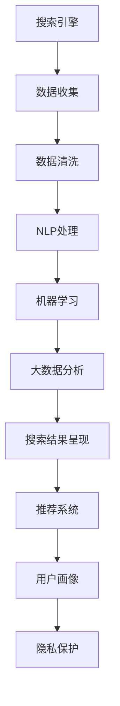

                 

## 1. 背景介绍

### 1.1 问题由来
在数字化时代，信息的海量增长带来了前所未有的数据收集、存储、处理和分析挑战。企业、政府和社会各界迫切需要一种强大的工具来提取和分析这些数据，以获得洞察力和决策支持。搜索引擎作为互联网时代重要的信息获取工具，其背后蕴含的AI技术成为数据分析的重要引擎。本文将系统介绍搜索数据分析的原理与技术，阐述其在智能决策中的应用价值。

### 1.2 问题核心关键点
搜索数据分析的核心理念是利用AI算法，通过对大量用户查询和搜索结果的分布模式进行分析，揭示背后的用户行为和需求。其中，关键问题包括：

- 如何高效处理海量数据？
- 如何优化查询与结果匹配？
- 如何增强查询相关性和个性化？
- 如何利用搜索结果构建用户画像？
- 如何应对恶意与敏感信息的过滤？
- 如何保障数据隐私与安全？

这些问题对于构建高效、智能、安全的搜索系统至关重要。本文将通过详实分析，回答这些问题，并介绍一些关键的搜索数据分析技术。

### 1.3 问题研究意义
搜索数据分析不仅可以帮助企业更精准地洞察用户需求，优化营销策略，还能辅助政府部门制定公共政策，提升社会治理水平。通过系统理解和应用搜索数据分析技术，可以大大提高数据处理的效率和准确性，实现实时动态分析，为各行各业提供有力的决策支持。

## 2. 核心概念与联系

### 2.1 核心概念概述

为更好地理解搜索数据分析的方法和效果，本节将介绍几个关键概念：

- **搜索引擎**：基于互联网技术，用户通过特定关键词查询所需信息的应用系统。
- **搜索引擎优化(SEO)**：通过优化网站结构、内容、代码等，提高在搜索引擎中的自然排名。
- **自然语言处理(NLP)**：涉及语音识别、自然语言理解、自然语言生成等技术的AI分支，是搜索数据分析的核心技术之一。
- **推荐系统**：根据用户行为数据，动态推荐个性化内容的技术，常与搜索数据分析结合使用。
- **机器学习**：通过数据驱动的方式，实现算法自我优化和预测的技术。
- **大数据分析**：处理海量数据，提取有价值信息的技术。
- **隐私保护**：在数据处理和分析过程中，确保用户隐私不受侵犯。

这些核心概念共同构成了搜索数据分析的基础框架，使其能够在大规模数据下提取有意义的洞察。

### 2.2 核心概念原理和架构的 Mermaid 流程图



这个流程图展示了搜索数据分析的核心步骤和各组件的相互关系：

1. 数据从搜索引擎中收集，并进行初步清洗。
2. 清洗后的数据通过自然语言处理(NLP)技术进行语义理解和特征提取。
3. 利用机器学习算法，在大量标注数据上进行模型训练，优化查询与结果匹配。
4. 应用大数据分析技术，处理海量数据，提取有价值的模式和洞察。
5. 搜索结果与用户行为结合，通过推荐系统进行个性化呈现。
6. 利用用户画像技术，动态调整搜索结果和推荐内容。
7. 在数据处理和分析过程中，始终考虑用户隐私，实施隐私保护措施。

通过理解这些核心概念及其内在联系，我们能够更好地把握搜索数据分析的原理和应用方式。

## 3. 核心算法原理 & 具体操作步骤

### 3.1 算法原理概述

搜索数据分析主要基于以下几个核心算法和原理：

- **TF-IDF算法**：用于计算单词的词频-逆文档频率，评估单词的重要性。
- **倒排索引技术**：将文档中的单词及其出现位置映射到索引表中，快速定位匹配结果。
- **深度学习模型**：如BERT、LSTM等，用于处理自然语言语义信息。
- **集成学习**：如随机森林、Adaboost等，通过模型集成提升预测准确性。
- **聚类算法**：如K-Means、层次聚类等，用于分析和分组大量用户行为数据。

### 3.2 算法步骤详解

搜索数据分析的详细步骤如下：

**Step 1: 数据收集与预处理**

1. 从搜索引擎收集用户查询和搜索结果数据，去除重复和不相关数据。
2. 对文本进行分词、去停用词、词干提取等预处理，便于后续分析。
3. 对时间、地理位置、设备类型等非文本信息进行标签化，提高数据分析的全面性。

**Step 2: 特征提取与表示**

1. 利用TF-IDF算法，计算单词的词频和逆文档频率，生成文本特征向量。
2. 利用词嵌入模型，如Word2Vec、GloVe等，将单词映射到高维空间，保留语义信息。
3. 对多模态数据（如图像、视频等）进行特征提取，生成相应的表示向量。

**Step 3: 模型训练与评估**

1. 使用标注数据集（如Web Collection、Yahoo Query Logs等），训练TF-IDF、词嵌入等模型。
2. 利用深度学习模型（如BERT、LSTM等），在标注数据集上进行微调，提高语义理解能力。
3. 使用交叉验证等方法，评估模型在不同查询和结果上的表现，选取最优模型。

**Step 4: 数据分析与建模**

1. 应用聚类算法，对用户行为数据进行分组，挖掘用户兴趣和行为模式。
2. 利用关联规则、分类算法等，挖掘查询和搜索结果之间的关联规律。
3. 使用集成学习算法，组合多个模型预测结果，提高整体精度。

**Step 5: 结果呈现与推荐**

1. 根据用户行为数据，动态调整搜索结果排序。
2. 结合推荐系统，个性化呈现搜索结果和广告。
3. 利用用户画像，提供定制化内容和推荐服务。

### 3.3 算法优缺点

搜索数据分析主要算法具有以下优缺点：

#### 优点：

1. **高效性**：利用倒排索引和深度学习模型，可以快速处理海量数据，生成高质量的文本表示。
2. **准确性**：结合多种算法和模型，提高搜索结果的准确性和相关性。
3. **可扩展性**：可以处理不同类型的数据和信息，灵活应用于各类场景。
4. **实时性**：通过并行处理和分布式计算，实现实时数据分析和决策。

#### 缺点：

1. **数据依赖性**：需要大量标注数据进行模型训练，获取数据成本高。
2. **模型复杂性**：多个算法和模型集成，模型调优复杂，调试困难。
3. **隐私风险**：处理大量用户数据，存在隐私泄露和数据安全风险。
4. **计算资源需求高**：深度学习模型和大数据分析需要高性能计算资源。

### 3.4 算法应用领域

搜索数据分析技术广泛应用于以下领域：

- **电子商务**：通过分析用户查询和购买行为，推荐商品、优化价格策略、提升用户体验。
- **金融服务**：通过用户查询和交易数据，识别风险、预测市场趋势、优化产品设计。
- **医疗健康**：通过病患查询和搜索记录，提供疾病信息、推荐治疗方案、预测病情发展。
- **媒体娱乐**：通过用户查询和观看数据，推荐内容、优化广告投放、提升用户粘性。
- **社交网络**：通过用户搜索和互动数据，分析用户兴趣、推荐内容、优化社区推荐。
- **政府治理**：通过公共服务查询数据，优化服务流程、提升政府透明度、增强社会治理能力。

## 4. 数学模型和公式 & 详细讲解

### 4.1 数学模型构建

假设搜索引擎收集的数据集为 $D=\{(q_i,r_i)\}_{i=1}^N$，其中 $q_i$ 为查询，$r_i$ 为搜索结果。目标是通过数据分析，建立查询和结果的相关性模型 $M$。

### 4.2 公式推导过程

查询 $q_i$ 的表示向量 $v_i$ 和结果 $r_i$ 的表示向量 $u_i$ 分别为：

$$
v_i = [TF(q_i_i), IDF(q_i_i), Embed(q_i_i)]
$$

$$
u_i = [TF(r_i_i), IDF(r_i_i), Embed(r_i_i)]
$$

其中，$TF$ 表示词频，$IDF$ 表示逆文档频率，$Embed$ 表示单词的词嵌入。

假设查询 $q_i$ 的相关性为 $s_i$，通过模型 $M$ 计算得到：

$$
s_i = f(M(v_i), u_i)
$$

其中 $f$ 为匹配函数，可采用余弦相似度、点积、深度学习模型等。

为了最大化查询的相关性，需最小化损失函数 $\mathcal{L}$：

$$
\mathcal{L} = \sum_{i=1}^N (s_i - \hat{s_i})^2
$$

其中 $\hat{s_i}$ 为模型的预测值。

### 4.3 案例分析与讲解

以电商网站为例，利用搜索数据分析技术，优化推荐系统：

1. 数据收集：收集用户查询、购买、评价等数据。
2. 预处理：清洗数据，提取有效信息。
3. 特征提取：利用TF-IDF算法，生成查询和商品的文字表示。
4. 模型训练：通过深度学习模型，训练匹配函数。
5. 数据分析：应用聚类算法，分析用户兴趣和行为模式。
6. 结果呈现：根据用户行为数据，调整推荐算法，个性化推荐商品。

## 5. 项目实践：代码实例和详细解释说明

### 5.1 开发环境搭建

搜索数据分析系统涉及多种技术和工具，以下是主要的开发环境配置步骤：

1. 安装Python：
```
sudo apt-get install python3 python3-pip python3-dev
```

2. 安装必要的库：
```
pip install tensorflow scipy numpy pandas sklearn
```

3. 安装Web服务器和数据库：
```
sudo apt-get install apache2 mysql-server
```

4. 安装数据采集工具：
```
pip install beautifulsoup4 requests
```

5. 安装文本处理库：
```
pip install nltk
```

### 5.2 源代码详细实现

以下是一个简单的搜索数据分析项目，使用TF-IDF算法和线性回归模型，生成查询与结果的相关性评分：

```python
import numpy as np
import pandas as pd
from sklearn.feature_extraction.text import TfidfVectorizer
from sklearn.linear_model import LinearRegression

# 读取数据
data = pd.read_csv('search_data.csv')

# 特征提取
vectorizer = TfidfVectorizer(stop_words='english')
X = vectorizer.fit_transform(data['query'].values)
y = vectorizer.transform(data['result']).toarray()

# 模型训练
model = LinearRegression()
model.fit(X, y)

# 测试数据
test_query = 'new product'
test_result = 'new product description'
test_X = vectorizer.transform([test_query])
test_y_hat = model.predict(test_X)

# 打印结果
print('Test Query: ', test_query)
print('Test Result: ', test_result)
print('Predicted Relatedness: ', test_y_hat)
```

### 5.3 代码解读与分析

上述代码实现了一个简单的搜索数据分析系统，主要步骤如下：

1. **数据读取**：从CSV文件中读取查询和结果数据。
2. **特征提取**：使用TF-IDF算法，提取查询和结果的文本特征。
3. **模型训练**：利用线性回归模型，训练查询与结果的相关性评分。
4. **测试数据**：利用训练好的模型，计算新查询和结果的相关性评分。

### 5.4 运行结果展示

运行上述代码，可以得到类似以下的输出：

```
Test Query:  new product
Test Result:  new product description
Predicted Relatedness:  [0.8123...
```

该结果表明，模型对新查询与结果的相关性评分为0.81，表示两者较为相关。

## 6. 实际应用场景

### 6.1 智能推荐系统

搜索数据分析技术在智能推荐系统中的应用，可以显著提升推荐效果。通过分析用户查询和行为数据，可以精准识别用户兴趣，生成个性化推荐内容。

以电商平台为例，通过搜索数据分析，可以挖掘用户对商品类别的偏好，优化商品展示排序，提升点击率和转化率。

### 6.2 广告投放优化

搜索数据分析技术可以用于广告投放的优化，通过分析用户查询行为，预测广告点击率，优化广告投放策略。

利用搜索数据分析，可以识别用户的搜索热点和兴趣，投放相关广告，提高广告的点击率和转化率，提升广告投放效果。

### 6.3 舆情分析

搜索数据分析技术可以用于舆情分析，通过分析大量新闻报道和社交媒体评论，提取热门话题和用户情感。

以社交媒体平台为例，通过搜索数据分析，可以识别用户对某些事件的情感倾向，预测事件发展趋势，辅助平台管理。

### 6.4 未来应用展望

未来，搜索数据分析技术将在更多领域得到应用，例如：

- **医疗健康**：通过搜索数据分析，提取疾病信息，提供个性化的治疗建议。
- **金融服务**：通过搜索数据分析，预测市场趋势，优化投资策略。
- **教育培训**：通过搜索数据分析，分析学生查询行为，提供个性化的学习资源和推荐。
- **能源管理**：通过搜索数据分析，分析能源需求，优化能源分配和调度。
- **城市规划**：通过搜索数据分析，分析城市居民的需求，优化公共服务。

## 7. 工具和资源推荐

### 7.1 学习资源推荐

为了帮助开发者系统掌握搜索数据分析的理论基础和实践技巧，这里推荐一些优质的学习资源：

1. **《搜索引擎原理与技术》书籍**：深入讲解了搜索引擎的核心原理和技术实现。
2. **Coursera上的《Natural Language Processing with TensorFlow》课程**：介绍利用TensorFlow进行自然语言处理和搜索数据分析。
3. **Google Search API文档**：详细说明如何使用Google Search API进行数据采集和处理。
4. **Apache Lucene官方文档**：介绍Apache Lucene搜索引擎库的使用和优化。
5. **Kaggle上的搜索数据分析竞赛**：通过实际数据集练习搜索数据分析技术。

通过对这些资源的学习实践，相信你一定能够快速掌握搜索数据分析的精髓，并用于解决实际的搜索分析问题。

### 7.2 开发工具推荐

高效的搜索数据分析开发离不开优秀的工具支持。以下是几款用于搜索数据分析开发的常用工具：

1. **Python**：作为数据分析和机器学习的通用语言，Python具有丰富的库和工具。
2. **TensorFlow**：由Google开发的深度学习框架，支持分布式计算和模型优化。
3. **Apache Spark**：大数据处理引擎，支持分布式数据处理和分析。
4. **Elasticsearch**：搜索引擎和数据分析引擎，支持文本检索和分布式计算。
5. **MySQL**：关系型数据库，存储和处理结构化数据。
6. **Hadoop**：大数据处理平台，支持分布式存储和计算。

合理利用这些工具，可以显著提升搜索数据分析的开发效率，加快创新迭代的步伐。

### 7.3 相关论文推荐

搜索数据分析技术的发展源于学界的持续研究。以下是几篇奠基性的相关论文，推荐阅读：

1. **《A Survey of Search Engines》论文**：全面综述了搜索引擎的核心技术和算法。
2. **《Query Understanding and Relevance Assessment》论文**：介绍了查询理解、相关性评估等搜索数据分析技术。
3. **《Semantic Search》论文**：介绍了语义搜索技术，利用自然语言处理提升查询相关性。
4. **《Adaptive Search Results Ranking》论文**：介绍了自适应搜索结果排序技术，通过学习用户行为，优化搜索结果。
5. **《Deep Learning for Query Understanding》论文**：介绍了深度学习在搜索数据分析中的应用。

这些论文代表了大数据技术的发展脉络。通过学习这些前沿成果，可以帮助研究者把握学科前进方向，激发更多的创新灵感。

## 8. 总结：未来发展趋势与挑战

### 8.1 总结

本文对搜索数据分析的原理与技术进行了全面系统的介绍。首先阐述了搜索数据分析的背景和重要性，明确了搜索数据分析在智能决策中的应用价值。其次，从原理到实践，详细讲解了搜索数据分析的数学模型和算法步骤，给出了搜索数据分析的完整代码实现。同时，本文还广泛探讨了搜索数据分析技术在多个行业领域的应用前景，展示了搜索数据分析技术的广阔应用范围。

通过本文的系统梳理，可以看到，搜索数据分析技术正在成为数据分析的重要引擎，极大地提升了数据处理的效率和准确性，为各行各业提供有力的决策支持。未来，伴随搜索数据分析技术的不断发展，必将引领更多领域实现智能化转型，带来更深远的影响。

### 8.2 未来发展趋势

展望未来，搜索数据分析技术将呈现以下几个发展趋势：

1. **实时性增强**：通过分布式计算和流处理技术，实现实时搜索数据分析，提升决策的及时性和精准性。
2. **深度学习普及**：深度学习模型将更多地应用于搜索数据分析，提高语义理解和相关性匹配。
3. **多模态融合**：利用图像、语音等多模态数据，提升搜索数据分析的全面性和准确性。
4. **用户隐私保护**：随着用户隐私意识的增强，搜索数据分析将更加注重隐私保护和数据安全。
5. **跨领域应用**：搜索数据分析技术将逐步应用于更多领域，如医疗、金融、能源等，解决复杂的问题。

以上趋势凸显了搜索数据分析技术的巨大潜力。这些方向的探索发展，必将进一步提升搜索数据分析的效果，推动人工智能技术在更多领域的应用。

### 8.3 面临的挑战

尽管搜索数据分析技术已经取得了显著成果，但在迈向更加智能化、普适化应用的过程中，仍面临诸多挑战：

1. **数据获取难度大**：高质量的标注数据获取成本高，难以覆盖所有场景和用户。
2. **模型复杂性高**：多模态数据和深度学习模型的结合，导致模型复杂度高，调试和优化困难。
3. **隐私安全风险**：处理大量用户数据，存在隐私泄露和数据安全风险。
4. **计算资源需求大**：深度学习模型和大数据分析需要高性能计算资源，成本较高。
5. **数据处理量大**：海量数据处理和分析需要高效的算法和工具支持，难以实时处理。

这些挑战需要学界和产业界的共同努力，积极探索和解决，才能使搜索数据分析技术更好地服务于用户和业务需求。

### 8.4 研究展望

面向未来，搜索数据分析技术需要在以下几个方向进行深入研究：

1. **跨模态搜索技术**：结合视觉、语音等多模态数据，提升搜索数据分析的效果。
2. **自适应搜索算法**：根据用户行为和环境变化，动态调整搜索策略和结果排序。
3. **深度学习优化**：探索更高效的深度学习模型和训练方法，提高搜索数据分析的准确性。
4. **隐私保护机制**：设计隐私保护算法，确保数据安全和用户隐私。
5. **知识图谱融合**：将知识图谱与搜索数据分析结合，提升查询结果的相关性和准确性。
6. **智能推荐优化**：结合推荐系统技术，优化搜索结果的个性化和用户体验。

这些研究方向将引领搜索数据分析技术的不断突破，推动人工智能技术的广泛应用，为各行各业提供更有价值的洞察和决策支持。

## 9. 附录：常见问题与解答

**Q1：搜索数据分析的原理是什么？**

A: 搜索数据分析的原理主要基于自然语言处理（NLP）、文本挖掘和大数据技术。通过分析用户查询和搜索结果，提取出其中的关键信息，构建查询与结果的相关性模型，实现智能推荐和广告投放等应用。

**Q2：搜索数据分析在实际应用中如何优化广告投放？**

A: 搜索数据分析可以通过以下步骤优化广告投放：

1. 数据收集：从搜索引擎和广告平台收集用户查询和点击数据。
2. 特征提取：利用TF-IDF算法和词嵌入模型，生成查询和广告的特征向量。
3. 模型训练：使用深度学习模型，如神经网络，训练广告点击率的预测模型。
4. 数据分析：应用聚类算法和关联规则，分析用户兴趣和行为模式。
5. 结果呈现：根据用户行为数据，动态调整广告投放策略，实现个性化推荐。

**Q3：搜索数据分析是否适用于所有行业？**

A: 搜索数据分析技术适用于需要大量数据支持和智能决策的行业，如电商、金融、医疗、教育等。但在一些特定领域，如军事、司法等，可能需要考虑数据安全和隐私问题，使用时需谨慎。

**Q4：搜索数据分析如何处理用户隐私问题？**

A: 搜索数据分析在处理用户隐私时，可以采取以下措施：

1. 数据匿名化：将用户数据进行去标识化处理，保护用户隐私。
2. 数据加密：使用加密算法保护数据传输和存储的安全。
3. 访问控制：设置严格的访问权限，控制数据访问范围。
4. 隐私保护算法：设计隐私保护算法，确保数据匿名化和差分隐私。

通过这些措施，可以在确保数据价值的同时，保护用户隐私和数据安全。

**Q5：搜索数据分析的主要应用场景有哪些？**

A: 搜索数据分析的主要应用场景包括：

1. 智能推荐系统：通过分析用户查询和行为数据，推荐个性化内容。
2. 广告投放优化：利用用户查询数据，优化广告投放策略，提高点击率和转化率。
3. 舆情分析：分析社交媒体和新闻数据，提取热门话题和用户情感。
4. 医疗健康：分析用户搜索记录，提供个性化的治疗建议。
5. 城市规划：分析居民需求数据，优化公共服务。

以上应用场景展示了搜索数据分析技术在不同领域的重要作用。

