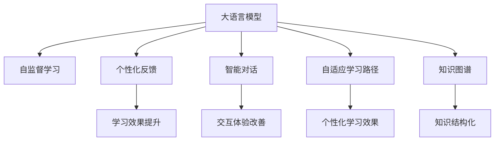

                 

# 教育模拟：LLM 增强的学习环境

> 关键词：教育模拟,大语言模型,自然语言处理(NLP),自监督学习,在线教育,AI 辅助教学

## 1. 背景介绍

### 1.1 问题由来
在过去的几十年中，教育技术的发展为学生提供了多种多样的学习工具和资源。然而，传统的教育模式仍然以教师为中心，难以充分激发学生的积极性和创造力。大语言模型（Large Language Models, LLMs）的兴起为教育技术的创新提供了新的契机。

近年来，基于深度学习的大语言模型在自然语言处理（Natural Language Processing, NLP）领域取得了突破性进展，特别是 GPT-3、BERT 等模型的问世。这些模型通过大规模无标签文本数据进行自监督预训练，具备强大的语言理解和生成能力。这些能力使得大语言模型在教育模拟和辅助教学中具备广泛的应用前景。

### 1.2 问题核心关键点
教育模拟的核心在于构建一个可以模拟真实教育环境，并根据学生的学习行为进行个性化反馈的系统。传统的教育模拟系统通常依赖于预设的教学内容和反馈规则，无法根据学生的个性化需求进行动态调整。而基于大语言模型（LLM）的教育模拟系统，能够通过自然语言处理能力，实现更加智能和个性化的教学。

教育模拟系统的核心关键点包括：

1. **自监督学习**：使用大规模无标签文本数据进行预训练，获取通用的语言表示。
2. **个性化反馈**：根据学生的学习行为和问题，动态生成个性化反馈，帮助学生快速纠正错误。
3. **智能对话**：使用大语言模型进行智能对话，模拟教师与学生的交互，提高教学效果。
4. **自适应学习路径**：根据学生的学习进度和表现，动态调整教学内容和难度，实现个性化学习。
5. **知识图谱辅助**：利用知识图谱辅助教学，提供更全面和准确的知识结构。

### 1.3 问题研究意义
大语言模型在教育模拟中的应用，可以极大地提升教学效果，促进个性化学习。通过智能对话和个性化反馈，大语言模型可以提供更加灵活、个性化的教学体验，满足不同学生的学习需求。同时，基于大语言模型的教育模拟系统，还可以通过自然语言处理技术，进行更加深入的教学分析和评价，为教育工作者提供有价值的教学参考。

## 2. 核心概念与联系

### 2.1 核心概念概述

为了更好地理解基于大语言模型的教育模拟方法，本节将介绍几个关键概念及其之间的关系：

- **大语言模型（LLM）**：以自回归（如 GPT）或自编码（如 BERT）模型为代表的大规模预训练语言模型。通过大规模无标签文本数据进行自监督预训练，学习通用的语言表示，具备强大的语言理解和生成能力。

- **自监督学习（SSL）**：一种无监督学习方法，通过无标签数据进行训练，学习到数据的潜在结构，常用的自监督任务包括掩码语言模型、下一句预测等。

- **个性化反馈**：根据学生的学习行为和问题，动态生成个性化反馈，帮助学生快速纠正错误，提升学习效果。

- **智能对话**：使用大语言模型进行智能对话，模拟教师与学生的交互，提供实时反馈和指导。

- **自适应学习路径**：根据学生的学习进度和表现，动态调整教学内容和难度，实现个性化学习。

- **知识图谱**：一种结构化的知识表示方法，用于描述实体、属性和它们之间的关系，辅助教育模拟系统进行知识结构化表达。

这些概念之间的逻辑关系可以通过以下 Mermaid 流程图来展示：



这个流程图展示了大语言模型在教育模拟中的关键组件及其相互关系：

1. 大语言模型通过自监督学习获取通用语言表示，为个性化反馈、智能对话、自适应学习路径和知识图谱辅助提供基础。
2. 个性化反馈和智能对话提高学习效果和交互体验，自适应学习路径实现个性化教学，知识图谱辅助教学，提高知识结构化表示能力。

## 3. 核心算法原理 & 具体操作步骤
### 3.1 算法原理概述

基于大语言模型的教育模拟方法，本质上是一个自监督学习过程，旨在通过大规模无标签文本数据进行预训练，然后在教育模拟任务上微调，获取用于个性化反馈、智能对话和自适应学习路径等组件的语言模型。

形式化地，假设教育模拟任务的训练集为 $D=\{(x_i,y_i)\}_{i=1}^N$，其中 $x_i$ 为输入（如学生的问题），$y_i$ 为输出（如教师的回复或答案）。模型通过自监督学习获取通用语言表示，然后通过有监督微调学习教育模拟任务，即找到最优参数 $\theta$ 使得：

$$
\theta^* = \mathop{\arg\min}_{\theta} \mathcal{L}(M_{\theta},D)
$$

其中 $\mathcal{L}$ 为针对教育模拟任务设计的损失函数，用于衡量模型预测输出与真实标签之间的差异。常见的损失函数包括交叉熵损失、均方误差损失等。

### 3.2 算法步骤详解

基于大语言模型的教育模拟方法一般包括以下几个关键步骤：

**Step 1: 准备预训练模型和数据集**
- 选择合适的预训练语言模型 $M_{\theta}$ 作为初始化参数，如 GPT、BERT 等。
- 准备教育模拟任务的标注数据集 $D$，划分为训练集、验证集和测试集。一般要求标注数据与预训练数据的分布不要差异过大。

**Step 2: 添加任务适配层**
- 根据教育模拟任务类型，在预训练模型顶层设计合适的输出层和损失函数。
- 对于问答类任务，通常在顶层添加线性分类器和交叉熵损失函数。
- 对于生成类任务，通常使用语言模型的解码器输出概率分布，并以负对数似然为损失函数。

**Step 3: 设置微调超参数**
- 选择合适的优化算法及其参数，如 AdamW、SGD 等，设置学习率、批大小、迭代轮数等。
- 设置正则化技术及强度，包括权重衰减、Dropout、Early Stopping 等。
- 确定冻结预训练参数的策略，如仅微调顶层，或全部参数都参与微调。

**Step 4: 执行梯度训练**
- 将训练集数据分批次输入模型，前向传播计算损失函数。
- 反向传播计算参数梯度，根据设定的优化算法和学习率更新模型参数。
- 周期性在验证集上评估模型性能，根据性能指标决定是否触发 Early Stopping。
- 重复上述步骤直到满足预设的迭代轮数或 Early Stopping 条件。

**Step 5: 测试和部署**
- 在测试集上评估微调后模型 $M_{\hat{\theta}}$ 的性能，对比微调前后的精度提升。
- 使用微调后的模型对新样本进行推理预测，集成到实际的教育模拟系统中。
- 持续收集新的数据，定期重新微调模型，以适应数据分布的变化。

以上是基于大语言模型的教育模拟的一般流程。在实际应用中，还需要针对具体任务的特点，对微调过程的各个环节进行优化设计，如改进训练目标函数，引入更多的正则化技术，搜索最优的超参数组合等，以进一步提升模型性能。

### 3.3 算法优缺点

基于大语言模型的教育模拟方法具有以下优点：
1. 简单高效。只需准备少量标注数据，即可对预训练模型进行快速适配，获得较大的性能提升。
2. 通用适用。适用于各种教育模拟任务，包括问答、对话、生成等，设计简单的任务适配层即可实现微调。
3. 参数高效。利用参数高效微调技术，在固定大部分预训练权重不变的情况下，仍可取得不错的提升。
4. 效果显著。在学术界和工业界的诸多教育模拟任务上，基于微调的方法已经刷新了最先进的性能指标。

同时，该方法也存在一定的局限性：
1. 依赖标注数据。教育模拟的效果很大程度上取决于标注数据的质量和数量，获取高质量标注数据的成本较高。
2. 迁移能力有限。当目标任务与预训练数据的分布差异较大时，微调的性能提升有限。
3. 可解释性不足。微调模型的决策过程通常缺乏可解释性，难以对其推理逻辑进行分析和调试。

尽管存在这些局限性，但就目前而言，基于大语言模型的微调方法仍是大语言模型应用的最主流范式。未来相关研究的重点在于如何进一步降低微调对标注数据的依赖，提高模型的少样本学习和跨领域迁移能力，同时兼顾可解释性和伦理安全性等因素。

### 3.4 算法应用领域

基于大语言模型微调的教育模拟方法，在教育领域已经得到了广泛的应用，涵盖教育测评、智能辅导、在线教育等多个方面，具体包括：

- 教育测评：构建自动化的教育测评系统，能够根据学生的回答生成个性化反馈，帮助教师快速评估学生学习效果。
- 智能辅导：使用大语言模型构建智能辅导系统，提供实时反馈和指导，帮助学生解决学习中的疑难问题。
- 在线教育：开发基于大语言模型的在线教育平台，提供个性化学习资源和智能课程推荐，提升学生的学习体验。
- 虚拟实验室：利用大语言模型构建虚拟实验室，模拟实验环境和实验操作，辅助学生进行实验学习和科学研究。

除了上述这些经典应用外，大语言模型微调的教育模拟方法也被创新性地应用到更多场景中，如教学内容生成、学习路径优化、知识图谱构建等，为教育技术的创新提供了新的路径。随着预训练模型和微调方法的不断进步，相信教育模拟技术将在更多领域大放异彩，极大地推动教育技术的进步和应用。

## 4. 数学模型和公式 & 详细讲解 & 举例说明
### 4.1 数学模型构建

本节将使用数学语言对基于大语言模型的教育模拟过程进行更加严格的刻画。

记教育模拟任务的训练集为 $D=\{(x_i,y_i)\}_{i=1}^N$，其中 $x_i$ 为输入（如学生的问题），$y_i$ 为输出（如教师的回复或答案）。假设模型 $M_{\theta}$ 在输入 $x$ 上的输出为 $\hat{y}=M_{\theta}(x) \in [0,1]$，表示样本属于正类的概率。真实标签 $y \in \{0,1\}$。

定义模型 $M_{\theta}$ 在数据样本 $(x,y)$ 上的损失函数为 $\ell(M_{\theta}(x),y)$，则在数据集 $D$ 上的经验风险为：

$$
\mathcal{L}(\theta) = \frac{1}{N}\sum_{i=1}^N \ell(M_{\theta}(x_i),y_i)
$$

微调的优化目标是最小化经验风险，即找到最优参数：

$$
\theta^* = \mathop{\arg\min}_{\theta} \mathcal{L}(\theta)
$$

在实践中，我们通常使用基于梯度的优化算法（如SGD、Adam等）来近似求解上述最优化问题。设 $\eta$ 为学习率，$\lambda$ 为正则化系数，则参数的更新公式为：

$$
\theta \leftarrow \theta - \eta \nabla_{\theta}\mathcal{L}(\theta) - \eta\lambda\theta
$$

其中 $\nabla_{\theta}\mathcal{L}(\theta)$ 为损失函数对参数 $\theta$ 的梯度，可通过反向传播算法高效计算。

### 4.2 公式推导过程

以下我们以问答任务为例，推导交叉熵损失函数及其梯度的计算公式。

假设模型 $M_{\theta}$ 在输入 $x$ 上的输出为 $\hat{y}=M_{\theta}(x) \in [0,1]$，表示样本属于正类的概率。真实标签 $y \in \{0,1\}$。则二分类交叉熵损失函数定义为：

$$
\ell(M_{\theta}(x),y) = -[y\log \hat{y} + (1-y)\log (1-\hat{y})]
$$

将其代入经验风险公式，得：

$$
\mathcal{L}(\theta) = -\frac{1}{N}\sum_{i=1}^N [y_i\log M_{\theta}(x_i)+(1-y_i)\log(1-M_{\theta}(x_i))]
$$

根据链式法则，损失函数对参数 $\theta_k$ 的梯度为：

$$
\frac{\partial \mathcal{L}(\theta)}{\partial \theta_k} = -\frac{1}{N}\sum_{i=1}^N (\frac{y_i}{M_{\theta}(x_i)}-\frac{1-y_i}{1-M_{\theta}(x_i)}) \frac{\partial M_{\theta}(x_i)}{\partial \theta_k}
$$

其中 $\frac{\partial M_{\theta}(x_i)}{\partial \theta_k}$ 可进一步递归展开，利用自动微分技术完成计算。

在得到损失函数的梯度后，即可带入参数更新公式，完成模型的迭代优化。重复上述过程直至收敛，最终得到适应教育模拟任务的最优模型参数 $\theta^*$。

## 5. 项目实践：代码实例和详细解释说明
### 5.1 开发环境搭建

在进行教育模拟实践前，我们需要准备好开发环境。以下是使用Python进行PyTorch开发的环境配置流程：

1. 安装Anaconda：从官网下载并安装Anaconda，用于创建独立的Python环境。

2. 创建并激活虚拟环境：
```bash
conda create -n pytorch-env python=3.8 
conda activate pytorch-env
```

3. 安装PyTorch：根据CUDA版本，从官网获取对应的安装命令。例如：
```bash
conda install pytorch torchvision torchaudio cudatoolkit=11.1 -c pytorch -c conda-forge
```

4. 安装Transformers库：
```bash
pip install transformers
```

5. 安装各类工具包：
```bash
pip install numpy pandas scikit-learn matplotlib tqdm jupyter notebook ipython
```

完成上述步骤后，即可在`pytorch-env`环境中开始教育模拟实践。

### 5.2 源代码详细实现

下面我以问答任务为例，给出使用Transformers库对BERT模型进行教育模拟微调的PyTorch代码实现。

首先，定义问答任务的数据处理函数：

```python
from transformers import BertTokenizer
from torch.utils.data import Dataset
import torch

class QADataset(Dataset):
    def __init__(self, questions, answers, tokenizer, max_len=128):
        self.questions = questions
        self.answers = answers
        self.tokenizer = tokenizer
        self.max_len = max_len
        
    def __len__(self):
        return len(self.questions)
    
    def __getitem__(self, item):
        question = self.questions[item]
        answer = self.answers[item]
        
        encoding = self.tokenizer(question, return_tensors='pt', max_length=self.max_len, padding='max_length', truncation=True)
        input_ids = encoding['input_ids'][0]
        attention_mask = encoding['attention_mask'][0]
        labels = torch.tensor([int(answer)], dtype=torch.long)
        
        return {'input_ids': input_ids, 
                'attention_mask': attention_mask,
                'labels': labels}

# 定义标签与id的映射
answer2id = {'A': 0, 'B': 1, 'C': 2, 'D': 3, 'E': 4}
id2answer = {v: k for k, v in answer2id.items()}

# 创建dataset
tokenizer = BertTokenizer.from_pretrained('bert-base-cased')

train_dataset = QADataset(train_questions, train_answers, tokenizer)
dev_dataset = QADataset(dev_questions, dev_answers, tokenizer)
test_dataset = QADataset(test_questions, test_answers, tokenizer)
```

然后，定义模型和优化器：

```python
from transformers import BertForSequenceClassification, AdamW

model = BertForSequenceClassification.from_pretrained('bert-base-cased', num_labels=len(answer2id))

optimizer = AdamW(model.parameters(), lr=2e-5)
```

接着，定义训练和评估函数：

```python
from torch.utils.data import DataLoader
from tqdm import tqdm
from sklearn.metrics import classification_report

device = torch.device('cuda') if torch.cuda.is_available() else torch.device('cpu')
model.to(device)

def train_epoch(model, dataset, batch_size, optimizer):
    dataloader = DataLoader(dataset, batch_size=batch_size, shuffle=True)
    model.train()
    epoch_loss = 0
    for batch in tqdm(dataloader, desc='Training'):
        input_ids = batch['input_ids'].to(device)
        attention_mask = batch['attention_mask'].to(device)
        labels = batch['labels'].to(device)
        model.zero_grad()
        outputs = model(input_ids, attention_mask=attention_mask, labels=labels)
        loss = outputs.loss
        epoch_loss += loss.item()
        loss.backward()
        optimizer.step()
    return epoch_loss / len(dataloader)

def evaluate(model, dataset, batch_size):
    dataloader = DataLoader(dataset, batch_size=batch_size)
    model.eval()
    preds, labels = [], []
    with torch.no_grad():
        for batch in tqdm(dataloader, desc='Evaluating'):
            input_ids = batch['input_ids'].to(device)
            attention_mask = batch['attention_mask'].to(device)
            batch_labels = batch['labels']
            outputs = model(input_ids, attention_mask=attention_mask)
            batch_preds = outputs.logits.argmax(dim=2).to('cpu').tolist()
            batch_labels = batch_labels.to('cpu').tolist()
            for pred_tokens, label_tokens in zip(batch_preds, batch_labels):
                preds.append(pred_tokens[:len(label_tokens)])
                labels.append(label_tokens)
                
    print(classification_report(labels, preds))
```

最后，启动训练流程并在测试集上评估：

```python
epochs = 5
batch_size = 16

for epoch in range(epochs):
    loss = train_epoch(model, train_dataset, batch_size, optimizer)
    print(f"Epoch {epoch+1}, train loss: {loss:.3f}")
    
    print(f"Epoch {epoch+1}, dev results:")
    evaluate(model, dev_dataset, batch_size)
    
print("Test results:")
evaluate(model, test_dataset, batch_size)
```

以上就是使用PyTorch对BERT进行教育模拟问答任务微调的完整代码实现。可以看到，得益于Transformers库的强大封装，我们可以用相对简洁的代码完成BERT模型的加载和微调。

### 5.3 代码解读与分析

让我们再详细解读一下关键代码的实现细节：

**QADataset类**：
- `__init__`方法：初始化问题和答案，分词器等关键组件。
- `__len__`方法：返回数据集的样本数量。
- `__getitem__`方法：对单个样本进行处理，将问题和答案输入编码为token ids，将答案编码为数字，并对其进行定长padding，最终返回模型所需的输入。

**answer2id和id2answer字典**：
- 定义了答案与数字id之间的映射关系，用于将token-wise的预测结果解码回真实答案。

**训练和评估函数**：
- 使用PyTorch的DataLoader对数据集进行批次化加载，供模型训练和推理使用。
- 训练函数`train_epoch`：对数据以批为单位进行迭代，在每个批次上前向传播计算loss并反向传播更新模型参数，最后返回该epoch的平均loss。
- 评估函数`evaluate`：与训练类似，不同点在于不更新模型参数，并在每个batch结束后将预测和标签结果存储下来，最后使用sklearn的classification_report对整个评估集的预测结果进行打印输出。

**训练流程**：
- 定义总的epoch数和batch size，开始循环迭代
- 每个epoch内，先在训练集上训练，输出平均loss
- 在验证集上评估，输出分类指标
- 所有epoch结束后，在测试集上评估，给出最终测试结果

可以看到，PyTorch配合Transformers库使得BERT微调的代码实现变得简洁高效。开发者可以将更多精力放在数据处理、模型改进等高层逻辑上，而不必过多关注底层的实现细节。

当然，工业级的系统实现还需考虑更多因素，如模型的保存和部署、超参数的自动搜索、更灵活的任务适配层等。但核心的微调范式基本与此类似。

## 6. 实际应用场景
### 6.1 智能辅导系统

基于大语言模型的教育模拟技术，可以广泛应用于智能辅导系统的构建。传统的辅导方式往往依赖于教师的经验和知识储备，难以满足大量学生的个性化需求。而使用大语言模型构建的智能辅导系统，能够提供全天候、个性化的辅导服务，提升学生的学习效果。

在技术实现上，可以收集学生的提问记录和辅导反馈，构建监督数据集。将学生的问题作为输入，辅导师的答案作为输出，在此基础上对预训练语言模型进行微调。微调后的模型能够根据学生的问题，生成个性化的反馈和建议，辅助学生解决问题。对于学生提出的新问题，还可以接入检索系统实时搜索相关内容，动态组织生成回答。如此构建的智能辅导系统，能大幅提升学生的学习体验和效果。

### 6.2 个性化学习路径

基于大语言模型的教育模拟技术，可以提供个性化的学习路径，帮助学生制定最优的学习计划。传统的教育系统往往按照固定的课程顺序和内容进行教学，难以根据学生的学习进度和兴趣进行动态调整。而使用大语言模型构建的教育模拟系统，可以动态分析学生的学习行为和表现，根据其学习进度和兴趣，调整教学内容和难度，实现个性化学习。

具体而言，可以收集学生的学习记录和反馈，构建监督数据集。将学生的学习进度和表现作为输入，教学内容作为输出，在此基础上对预训练语言模型进行微调。微调后的模型能够根据学生的学习进度和表现，动态调整教学内容和难度，实现个性化学习。这种学习路径不仅能够提高学生的学习效率，还能够激发其学习兴趣，提升学习效果。

### 6.3 虚拟实验室

基于大语言模型的教育模拟技术，可以构建虚拟实验室，模拟实验环境和实验操作，辅助学生进行实验学习和科学研究。传统的实验教学需要大量的实验室资源和设备，难以覆盖大量的学生。而使用大语言模型构建的虚拟实验室，可以在线上实现实验模拟，大大降低了实验成本。

具体而言，可以构建虚拟实验室的数据集，包括实验步骤、实验结果和实验现象等。将实验步骤和实验结果作为输入，虚拟实验室的输出作为监督信号，在此基础上对预训练语言模型进行微调。微调后的模型能够根据实验步骤，生成虚拟实验室的操作指令和实验结果，辅助学生进行实验学习和科学研究。这种虚拟实验室不仅可以提高学生的学习效率，还可以为科学研究提供更广泛的应用场景。

### 6.4 未来应用展望

随着大语言模型和教育模拟技术的不断发展，基于大语言模型的教育模拟系统将在更多领域得到应用，为教育技术的创新提供新的路径。

在智慧教育领域，基于大语言模型的教育模拟系统，可以通过自然语言处理技术，进行更加深入的教学分析和评价，为教育工作者提供有价值的教学参考。此外，基于大语言模型的教育模拟系统，还可以实现更智能的教学互动，如智能对话、智能测评等，提高教学效果。

在智慧校园建设中，基于大语言模型的教育模拟系统，可以提供个性化的学习路径和智能辅导服务，提高学生的学习效率和学习体验。同时，基于大语言模型的虚拟实验室，可以模拟实验环境和实验操作，辅助学生进行实验学习和科学研究。

在社会教育领域，基于大语言模型的教育模拟系统，可以实现更智能的教育测评和智能辅导，帮助学生进行个性化学习和问题解决。此外，基于大语言模型的虚拟实验室，可以为在线教育、远程教育等提供更广泛的应用场景，提升教育的普及性和可及性。

此外，在企业培训、在线职业教育等领域，基于大语言模型的教育模拟系统，也可以提供个性化的学习路径和智能辅导服务，提升培训效果和职业素质。

总之，基于大语言模型的教育模拟技术，将在更多领域大放异彩，为教育技术的创新提供新的路径，推动教育技术的进步和应用。相信随着技术的日益成熟，教育模拟技术必将在构建人机协同的智能教育中扮演越来越重要的角色。

## 7. 工具和资源推荐
### 7.1 学习资源推荐

为了帮助开发者系统掌握大语言模型在教育模拟中的应用，这里推荐一些优质的学习资源：

1. 《Transformer从原理到实践》系列博文：由大模型技术专家撰写，深入浅出地介绍了Transformer原理、BERT模型、教育模拟等前沿话题。

2. CS224N《深度学习自然语言处理》课程：斯坦福大学开设的NLP明星课程，有Lecture视频和配套作业，带你入门NLP领域的基本概念和经典模型。

3. 《Natural Language Processing with Transformers》书籍：Transformers库的作者所著，全面介绍了如何使用Transformers库进行NLP任务开发，包括教育模拟在内的诸多范式。

4. HuggingFace官方文档：Transformers库的官方文档，提供了海量预训练模型和完整的教育模拟样例代码，是上手实践的必备资料。

5. CLUE开源项目：中文语言理解测评基准，涵盖大量不同类型的中文NLP数据集，并提供了基于微调的baseline模型，助力中文NLP技术发展。

通过对这些资源的学习实践，相信你一定能够快速掌握大语言模型在教育模拟中的应用，并用于解决实际的NLP问题。
###  7.2 开发工具推荐

高效的开发离不开优秀的工具支持。以下是几款用于大语言模型教育模拟开发的常用工具：

1. PyTorch：基于Python的开源深度学习框架，灵活动态的计算图，适合快速迭代研究。大部分预训练语言模型都有PyTorch版本的实现。

2. TensorFlow：由Google主导开发的开源深度学习框架，生产部署方便，适合大规模工程应用。同样有丰富的预训练语言模型资源。

3. Transformers库：HuggingFace开发的NLP工具库，集成了众多SOTA语言模型，支持PyTorch和TensorFlow，是进行教育模拟任务开发的利器。

4. Weights & Biases：模型训练的实验跟踪工具，可以记录和可视化模型训练过程中的各项指标，方便对比和调优。与主流深度学习框架无缝集成。

5. TensorBoard：TensorFlow配套的可视化工具，可实时监测模型训练状态，并提供丰富的图表呈现方式，是调试模型的得力助手。

6. Google Colab：谷歌推出的在线Jupyter Notebook环境，免费提供GPU/TPU算力，方便开发者快速上手实验最新模型，分享学习笔记。

合理利用这些工具，可以显著提升大语言模型教育模拟任务的开发效率，加快创新迭代的步伐。

### 7.3 相关论文推荐

大语言模型和教育模拟技术的发展源于学界的持续研究。以下是几篇奠基性的相关论文，推荐阅读：

1. Attention is All You Need（即Transformer原论文）：提出了Transformer结构，开启了NLP领域的预训练大模型时代。

2. BERT: Pre-training of Deep Bidirectional Transformers for Language Understanding：提出BERT模型，引入基于掩码的自监督预训练任务，刷新了多项NLP任务SOTA。

3. Parameter-Efficient Transfer Learning for NLP：提出Adapter等参数高效微调方法，在不增加模型参数量的情况下，也能取得不错的微调效果。

4. Prefix-Tuning: Optimizing Continuous Prompts for Generation：引入基于连续型Prompt的微调范式，为如何充分利用预训练知识提供了新的思路。

5. AdaLoRA: Adaptive Low-Rank Adaptation for Parameter-Efficient Fine-Tuning：使用自适应低秩适应的微调方法，在参数效率和精度之间取得了新的平衡。

这些论文代表了大语言模型教育模拟技术的发展脉络。通过学习这些前沿成果，可以帮助研究者把握学科前进方向，激发更多的创新灵感。

## 8. 总结：未来发展趋势与挑战
### 8.1 总结

本文对基于大语言模型的教育模拟方法进行了全面系统的介绍。首先阐述了大语言模型和教育模拟技术的研究背景和意义，明确了教育模拟在构建智能教育环境中的独特价值。其次，从原理到实践，详细讲解了教育模拟的数学原理和关键步骤，给出了教育模拟任务开发的完整代码实例。同时，本文还广泛探讨了教育模拟方法在智能辅导、个性化学习路径、虚拟实验室等教育应用中的广泛应用，展示了教育模拟技术的广阔前景。

通过本文的系统梳理，可以看到，基于大语言模型的教育模拟技术正在成为教育技术的创新范式，极大地提升了教学效果和个性化学习体验。随着预训练语言模型和教育模拟方法的不断进步，相信教育模拟技术将在更多领域大放异彩，深刻影响教育技术的进步和应用。

### 8.2 未来发展趋势

展望未来，大语言模型教育模拟技术将呈现以下几个发展趋势：

1. **模型规模持续增大**：随着算力成本的下降和数据规模的扩张，预训练语言模型的参数量还将持续增长。超大规模语言模型蕴含的丰富语言知识，有望支撑更加复杂多变的教育模拟任务。

2. **教育模拟技术日趋多样化**：除了传统的问答、对话、生成等任务，未来会涌现更多教育模拟任务，如智能测评、知识图谱辅助教学等，推动教育模拟技术的不断创新。

3. **知识图谱辅助教学成为常态**：利用知识图谱辅助教学，提供更全面和准确的知识结构，帮助学生更好地理解课程内容。

4. **个性化学习路径更加智能**：基于学生的学习行为和反馈，动态调整教学内容和难度，实现更加个性化的学习路径。

5. **教育模拟系统的跨领域应用**：教育模拟技术将不仅仅应用于教育领域，还可以跨领域应用，如社会教育、企业培训等，推动跨领域教育技术的发展。

以上趋势凸显了大语言模型教育模拟技术的广阔前景。这些方向的探索发展，必将进一步提升教育模拟系统的性能和应用范围，为教育技术的创新提供新的路径。

### 8.3 面临的挑战

尽管大语言模型教育模拟技术已经取得了瞩目成就，但在迈向更加智能化、普适化应用的过程中，它仍面临诸多挑战：

1. **标注数据成本高**：教育模拟的效果很大程度上取决于标注数据的质量和数量，获取高质量标注数据的成本较高。如何进一步降低教育模拟对标注样本的依赖，是未来研究的重要方向。

2. **模型鲁棒性不足**：当前教育模拟模型面对域外数据时，泛化性能往往大打折扣。对于测试样本的微小扰动，教育模拟模型的预测也容易发生波动。如何提高教育模拟模型的鲁棒性，避免灾难性遗忘，还需要更多理论和实践的积累。

3. **推理效率有待提高**：大语言模型虽然精度高，但在实际部署时往往面临推理速度慢、内存占用大等效率问题。如何在保证性能的同时，简化模型结构，提升推理速度，优化资源占用，将是重要的优化方向。

4. **可解释性亟需加强**：当前教育模拟模型通常缺乏可解释性，难以对其决策过程进行分析和调试。对于教学中的重要问题，如学生反馈和作业评分，模型的可解释性尤为重要。如何赋予教育模拟模型更强的可解释性，将是亟待攻克的难题。

5. **安全性有待保障**：教育模拟模型可能学习到有害的信息，如性别歧视、种族偏见等，传递到学生学习中，产生误导性、歧视性的输出，给实际应用带来安全隐患。如何从数据和算法层面消除模型偏见，避免恶意用途，确保输出的安全性，也将是重要的研究课题。

6. **知识整合能力不足**：现有的教育模拟模型往往局限于课程内容，难以灵活吸收和运用更广泛的先验知识。如何让教育模拟过程更好地与外部知识库、规则库等专家知识结合，形成更加全面、准确的信息整合能力，还有很大的想象空间。

正视教育模拟面临的这些挑战，积极应对并寻求突破，将是大语言模型教育模拟技术走向成熟的必由之路。相信随着学界和产业界的共同努力，这些挑战终将一一被克服，大语言模型教育模拟技术必将在构建人机协同的智能教育中扮演越来越重要的角色。

### 8.4 未来突破

面对大语言模型教育模拟所面临的种种挑战，未来的研究需要在以下几个方面寻求新的突破：

1. **探索无监督和半监督教育模拟方法**：摆脱对大规模标注数据的依赖，利用自监督学习、主动学习等无监督和半监督范式，最大限度利用非结构化数据，实现更加灵活高效的教育模拟。

2. **研究参数高效和计算高效的微调范式**：开发更加参数高效的微调方法，在固定大部分预训练参数的同时，只更新极少量的任务相关参数。同时优化教育模拟模型的计算图，减少前向传播和反向传播的资源消耗，实现更加轻量级、实时性的部署。

3. **融合因果和对比学习范式**：通过引入因果推断和对比学习思想，增强教育模拟模型建立稳定因果关系的能力，学习更加普适、鲁棒的语言表征，从而提升模型泛化性和抗干扰能力。

4. **引入更多先验知识**：将符号化的先验知识，如知识图谱、逻辑规则等，与神经网络模型进行巧妙融合，引导教育模拟过程学习更准确、合理的语言模型。同时加强不同模态数据的整合，实现视觉、语音等多模态信息与文本信息的协同建模。

5. **结合因果分析和博弈论工具**：将因果分析方法引入教育模拟模型，识别出模型决策的关键特征，增强输出解释的因果性和逻辑性。借助博弈论工具刻画人机交互过程，主动探索并规避模型的脆弱点，提高系统稳定性。

6. **纳入伦理道德约束**：在模型训练目标中引入伦理导向的评估指标，过滤和惩罚有害的输出倾向。同时加强人工干预和审核，建立模型行为的监管机制，确保输出符合人类价值观和伦理道德。

这些研究方向的探索，必将引领大语言模型教育模拟技术迈向更高的台阶，为构建安全、可靠、可解释、可控的智能教育系统铺平道路。面向未来，大语言模型教育模拟技术还需要与其他人工智能技术进行更深入的融合，如知识表示、因果推理、强化学习等，多路径协同发力，共同推动自然语言理解和智能交互系统的进步。只有勇于创新、敢于突破，才能不断拓展教育模拟的边界，让智能教育技术更好地造福人类社会。

## 9. 附录：常见问题与解答
----------------------------------------------------------------

**Q1：大语言模型在教育模拟中是否适合所有教育任务？**

A: 大语言模型在大多数教育任务上都能取得不错的效果，特别是对于数据量较小的任务。但对于一些特定领域的教育任务，如医学、法律等，仅仅依靠通用语料预训练的模型可能难以很好地适应。此时需要在特定领域语料上进一步预训练，再进行教育模拟微调，才能获得理想效果。

**Q2：教育模拟过程中的学习率如何设定？**

A: 教育模拟的学习率一般要比预训练时小1-2个数量级，如果使用过大的学习率，容易破坏预训练权重，导致过拟合。一般建议从1e-5开始调参，逐步减小学习率，直至收敛。也可以使用warmup策略，在开始阶段使用较小的学习率，再逐渐过渡到预设值。需要注意的是，不同的优化器(如AdamW、Adafactor等)以及不同的学习率调度策略，可能需要设置不同的学习率阈值。

**Q3：教育模拟系统在落地部署时需要注意哪些问题？**

A: 将教育模拟系统转化为实际应用，还需要考虑以下因素：

1. 模型裁剪：去除不必要的层和参数，减小模型尺寸，加快推理速度。
2. 量化加速：将浮点模型转为定点模型，压缩存储空间，提高计算效率。
3. 服务化封装：将模型封装为标准化服务接口，便于集成调用。
4. 弹性伸缩：根据请求流量动态调整资源配置，平衡服务质量和成本。
5. 监控告警：实时采集系统指标，设置异常告警阈值，确保服务稳定性。
6. 安全防护：采用访问鉴权、数据脱敏等措施，保障数据和模型安全。

大语言模型教育模拟为教育技术提供了新的路径，但如何将强大的性能转化为稳定、高效、安全的业务价值，还需要工程实践的不断打磨。唯有从数据、算法、工程、业务等多个维度协同发力，才能真正实现教育模拟技术在垂直行业的规模化落地。总之，教育模拟需要开发者根据具体任务，不断迭代和优化模型、数据和算法，方能得到理想的效果。

---

作者：禅与计算机程序设计艺术 / Zen and the Art of Computer Programming

