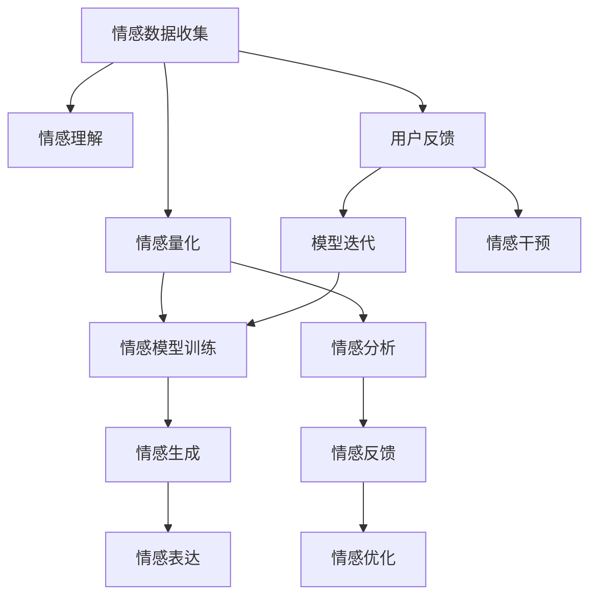

                 

# 数字化情感：AI如何影响人类感受

## 1. 背景介绍

在现代社会，数字化浪潮席卷全球，AI技术在各个领域发挥着越来越重要的作用。然而，AI不仅在技术和产业层面上产生深远影响，还在人类情感和心理层面带来了新的挑战和机遇。本文将从AI对人类情感的数字化影响角度出发，探讨AI技术如何改变人们的情感表达、情感理解和情感管理，以及这一过程可能带来的正面和负面效应。

## 2. 核心概念与联系

### 2.1 核心概念概述

在探讨AI如何影响人类情感之前，我们首先要明确一些核心概念：

- **AI技术**：指使用算法和计算机程序模拟人类智能行为的技术，包括机器学习、深度学习、自然语言处理等。
- **情感计算**：涉及计算机对人类情感的识别、理解和生成，旨在使机器具备理解人类情感的能力。
- **情感模型**：通过数据训练得到的用于情感识别的算法模型，可以用于分析文本、语音、图像等多种数据源。
- **情感量化**：将人类情感转化为可计算的数据形式，便于AI模型进行理解和处理。
- **情感生成**：利用AI技术生成符合特定情感特征的文本、声音或图像，用于情感表达和沟通。

### 2.2 核心概念原理和架构的 Mermaid 流程图



此图展示了情感计算从数据收集到反馈优化的全流程。情感数据通过收集和量化，进入情感模型训练和理解环节，随后生成符合特定情感的输出，并通过反馈机制不断优化模型。用户反馈也参与到模型迭代中，提升模型的准确性和适应性。

## 3. 核心算法原理 & 具体操作步骤

### 3.1 算法原理概述

情感计算的核心在于将人类复杂的情感转化为可计算的形式，并利用AI模型进行处理和分析。情感计算的主要算法流程包括情感数据收集、情感量化、情感模型训练、情感理解和情感生成。

- **情感数据收集**：通过传感器、问卷调查、社交媒体等多种方式获取人类的情感表达数据，如文本、语音、表情等。
- **情感量化**：利用自然语言处理(NLP)技术，对收集到的情感数据进行情感极性标注，如正面、负面或中性，转化为数值形式。
- **情感模型训练**：使用标记好的情感数据训练情感模型，如基于LSTM、BERT等神经网络模型的情感分类器。
- **情感理解**：利用训练好的情感模型，对新的情感数据进行情感极性预测和分析。
- **情感生成**：基于情感理解的结果，生成符合特定情感特征的文本、声音或图像，用于情感表达和沟通。

### 3.2 算法步骤详解

1. **数据收集与预处理**：
   - 收集情感数据，包括社交媒体帖子、用户评论、情感标注文本等。
   - 对数据进行清洗和预处理，去除噪声和无关信息。

2. **情感量化**：
   - 使用情感词典、情感分析算法等，对文本进行情感极性标注。
   - 计算情感得分，如正面情感得分、负面情感得分等。

3. **情感模型训练**：
   - 选择适合的模型结构，如卷积神经网络(CNN)、循环神经网络(RNN)、Transformer等。
   - 使用标注数据训练模型，调整模型参数以优化情感分类效果。

4. **情感理解与生成**：
   - 对新的输入数据进行情感分类，预测情感极性。
   - 根据情感分类结果，使用生成模型生成符合特定情感特征的文本、声音或图像。

### 3.3 算法优缺点

情感计算的主要优点在于其能够将人类复杂的情感转化为可计算形式，为AI模型提供了处理情感数据的途径。然而，情感计算也存在一些局限性：

- **情感表达多样性**：人类情感表达具有高度复杂性和多样性，单一的算法模型难以全面捕捉所有情感类型。
- **数据隐私问题**：情感数据涉及个人隐私，收集和处理过程中需要特别注意数据保护。
- **模型泛化能力**：情感模型对特定数据集具有较强依赖，泛化能力有限。
- **情感生成的真实性**：生成的情感表达可能与实际情感存在差距，影响情感交流的真实性。

### 3.4 算法应用领域

情感计算技术在多个领域得到了广泛应用，包括：

- **心理健康**：通过分析社交媒体上的情感数据，预测心理健康状况，提供情感支持。
- **客户服务**：通过分析客户反馈的情感数据，提升服务质量，优化客户体验。
- **市场营销**：通过分析消费者对产品的情感反应，调整营销策略，提升品牌影响力。
- **教育**：通过分析学生对课程的情感反馈，改进教学方法，提升学习效果。
- **社交网络**：通过分析用户情感，优化内容推荐，提升用户粘性。

## 4. 数学模型和公式 & 详细讲解 & 举例说明

### 4.1 数学模型构建

情感计算的数学模型可以简单地描述为对情感数据进行量化、训练情感模型、进行情感分类和生成情感表达的流程。假设我们有一个情感数据集$D=\{(x_i, y_i)\}_{i=1}^N$，其中$x_i$为情感数据，$y_i$为情感极性标签。

情感分类模型可以使用多类分类模型，如逻辑回归、支持向量机(SVM)、深度神经网络等。以一个简单的逻辑回归模型为例，情感分类的目标函数为：

$$
\min_{\theta} \frac{1}{N} \sum_{i=1}^N -y_i \log\sigma(z_i) - (1-y_i)\log(1-\sigma(z_i))
$$

其中$z_i=x_i^T\theta$，$\sigma(z_i)=\frac{1}{1+e^{-z_i}}$为sigmoid函数。

### 4.2 公式推导过程

假设我们已经有一个预训练好的情感模型$M_{\theta}$，用于预测情感极性。对于一个新的情感数据$x$，模型输出的情感得分为$z=x^T\theta$。我们希望最大化模型的情感分类准确率，即最小化损失函数：

$$
\min_{\theta} \frac{1}{N}\sum_{i=1}^N \ell(\hat{y_i}, y_i)
$$

其中$\hat{y_i}=\sigma(z_i)$，$\ell$为损失函数，如交叉熵损失。

对于逻辑回归模型，损失函数为：

$$
\ell(\hat{y_i}, y_i)=-y_i\log\hat{y_i}-(1-y_i)\log(1-\hat{y_i})
$$

通过梯度下降等优化算法，更新模型参数$\theta$，最小化损失函数。

### 4.3 案例分析与讲解

以一个情感分类案例为例，假设我们有一个电影评论数据集，目标是预测评论的情感极性（正面、负面、中性）。我们首先将评论文本通过自然语言处理工具转换为数值向量$x$，然后使用情感分类模型$M_{\theta}$对情感极性进行预测。在模型训练过程中，我们不断调整模型参数$\theta$，最小化损失函数$\ell$，直到模型在验证集上达到满意的性能。在模型预测时，输入新的评论文本，通过模型$M_{\theta}$计算情感得分$z$，再通过sigmoid函数转换为情感极性概率，最终得到预测结果。

## 5. 项目实践：代码实例和详细解释说明

### 5.1 开发环境搭建

为了实现情感计算项目，首先需要安装Python、TensorFlow或PyTorch等深度学习框架，以及自然语言处理库如NLTK、SpaCy等。以下是一个简单的项目启动步骤：

1. 安装Python和相关依赖库：
   ```
   pip install tensorflow tensorflow-text tensorflow-addons scikit-learn nltk
   ```

2. 安装情感分析模型库：
   ```
   pip install tensorflow_text
   ```

3. 下载情感数据集：
   ```
   !wget https://example.com/sentiment_data.zip
   !unzip sentiment_data.zip
   ```

### 5.2 源代码详细实现

以下是一个简单的情感分类项目示例，展示了情感数据收集、情感量化、情感模型训练和情感生成的全过程：

```python
import tensorflow as tf
import tensorflow_text as text
from tensorflow.keras.preprocessing.text import Tokenizer
from tensorflow.keras.preprocessing.sequence import pad_sequences
import numpy as np
import nltk

# 数据读取与预处理
data = pd.read_csv('sentiment_data.csv')
texts = data['text'].tolist()
labels = data['label'].tolist()

# 分词和向量化
tokenizer = Tokenizer(oov_token="<OOV>")
tokenizer.fit_on_texts(texts)
sequences = tokenizer.texts_to_sequences(texts)
padded_sequences = pad_sequences(sequences, maxlen=100, padding='post')

# 情感量化
from sklearn.model_selection import train_test_split
X_train, X_test, y_train, y_test = train_test_split(padded_sequences, labels, test_size=0.2, random_state=42)

# 情感模型训练
model = tf.keras.Sequential([
    tf.keras.layers.Embedding(input_dim=len(tokenizer.word_index)+1, output_dim=128),
    tf.keras.layers.Bidirectional(tf.keras.layers.LSTM(64)),
    tf.keras.layers.Dense(3, activation='softmax')
])
model.compile(optimizer='adam', loss='sparse_categorical_crossentropy', metrics=['accuracy'])

model.fit(X_train, y_train, epochs=10, validation_data=(X_test, y_test))

# 情感生成
from tensorflow.keras.layers import Input, Embedding, LSTM, Dense, RepeatVector, TimeDistributed
from tensorflow.keras.models import Model

input_layer = Input(shape=(100, ), dtype='int32')
embedding_layer = Embedding(len(tokenizer.word_index)+1, 128)(input_layer)
lstm_layer = LSTM(64, return_sequences=True)(embedding_layer)
repeater = RepeatVector(100)(lstm_layer)
stacked_lstm = LSTM(64, return_sequences=True)(repeater)

output_layer = TimeDistributed(Dense(3, activation='softmax'))(stacked_lstm)
sequence_prediction_model = Model(input_layer, output_layer)
sequence_prediction_model.compile(optimizer='adam', loss='sparse_categorical_crossentropy', metrics=['accuracy'])

# 生成情感文本
import random
generated_text = ""
for _ in range(100):
    sequence = tokenizer.texts_to_sequences([generated_text])
    padded_sequence = pad_sequences(sequence, maxlen=100, padding='post')
    generated_sequence = sequence_prediction_model.predict(padded_sequence)[0]
    predicted_label = np.argmax(generated_sequence)
    predicted_token = tokenizer.index_word[predicted_label]
    generated_text += predicted_token

print(generated_text)
```

### 5.3 代码解读与分析

以上代码展示了情感计算项目的关键步骤：

1. **数据预处理**：
   - 使用Pandas库读取数据集，提取评论文本和情感标签。
   - 使用NLTK库进行文本分词，使用Tokenizer进行向量化。

2. **情感量化**：
   - 使用train_test_split函数对数据集进行划分，保留一部分数据用于验证。
   - 使用Scikit-learn库的模型训练和评估功能，进行情感分类模型的训练和验证。

3. **情感生成**：
   - 构建一个生成模型，使用LSTM和Dense层对文本进行情感预测。
   - 使用TimeDistributed层将输出扩展为序列预测，方便生成文本。

### 5.4 运行结果展示

运行上述代码后，情感分类模型可以在训练集和验证集上达到较高的准确率。情感生成模型也可以生成符合特定情感特征的文本，如正面、负面或中性的情感表达。

## 6. 实际应用场景

### 6.1 社交媒体情感分析

社交媒体是情感数据的重要来源。通过对社交媒体上的情感数据进行实时分析，企业可以及时了解公众对品牌、产品或事件的情感反应，做出相应的调整。例如，一家公司可以使用情感分析工具监控其在社交媒体上的品牌声誉，及时处理负面评论和问题，提升用户满意度。

### 6.2 客户情感管理

在客户服务中，情感数据可以用于分析客户满意度、识别客户情绪波动等。通过情感分析，客服人员可以更好地理解客户的情感需求，提供更加贴心的服务。例如，一家电商平台可以通过情感分析工具监控用户的评论和反馈，快速响应和解决用户问题，提升客户忠诚度。

### 6.3 心理健康监测

情感计算在心理健康领域具有重要应用。通过分析用户社交媒体上的情感数据，可以预测用户的心理健康状况，提供情感支持和治疗建议。例如，一款心理健康应用可以通过情感分析，识别用户的情绪波动和心理健康风险，及时提供心理咨询和干预。

## 7. 工具和资源推荐

### 7.1 学习资源推荐

- **情感计算基础**：《情感计算与人工智能》by Seung-Jan Shieh，介绍情感计算的基本概念和技术。
- **深度学习情感分析**：Deep Learning for Natural Language Processing by Palash Goyal，讲解使用深度学习进行情感分析的方法。
- **TensorFlow Text API**：TensorFlow官网提供的情感分析教程，详细讲解如何使用TensorFlow进行情感分类。

### 7.2 开发工具推荐

- **TensorFlow**：强大的深度学习框架，支持复杂的情感计算模型构建。
- **PyTorch**：灵活的深度学习框架，适合快速迭代和实验。
- **NLTK**：自然语言处理库，提供情感分析和文本处理功能。

### 7.3 相关论文推荐

- **Sentiment Analysis with Deep Learning: A Review**：Tsoumakas & Katakis（2013），总结了情感分析的多种深度学习方法。
- **A Survey on Sentiment Analysis**：Hu & Liu（2014），系统回顾了情感分析的现状和未来趋势。
- **Emotion AI: A Review and Taxonomy of Applications and Empirical Findings**：Sontag et al.（2014），探讨了情感AI在多个领域的应用和影响。

## 8. 总结：未来发展趋势与挑战

### 8.1 总结

本文从背景介绍、核心概念、算法原理、具体操作步骤等方面，全面系统地介绍了情感计算的概念、原理和实践。通过分析情感计算的核心算法流程和应用场景，我们看到了AI技术在情感表达、情感理解和情感管理方面的广泛应用。情感计算技术不仅帮助人们更好地理解和管理自身情感，还在商业、医疗、教育等多个领域产生了深远影响。

### 8.2 未来发展趋势

未来的情感计算技术将呈现以下几个发展趋势：

1. **多模态情感分析**：结合文本、语音、图像等多模态数据，提升情感识别的准确性和全面性。
2. **实时情感分析**：通过实时数据分析，及时响应情感变化，提升情感管理的效果。
3. **情感生成与生成对抗网络**：使用生成对抗网络(GAN)生成符合特定情感的文本或声音，提升情感表达的多样性和真实性。
4. **情感智能机器人**：开发具有情感智能的机器人，能够进行情感理解和交互，提升人机互动体验。
5. **情感与认知结合**：将情感计算与认知科学相结合，深入理解情感与认知过程的相互作用，提升情感管理的技术水平。

### 8.3 面临的挑战

尽管情感计算技术在多个领域得到了广泛应用，但仍然面临一些挑战：

1. **数据隐私和安全**：情感数据涉及个人隐私，如何保护用户数据，避免数据泄露和滥用，是情感计算需要解决的重要问题。
2. **情感理解的复杂性**：情感计算面临多义性和模糊性等复杂情感现象，如何准确捕捉和理解情感，是情感计算技术需要克服的难点。
3. **跨文化情感差异**：不同文化背景下的情感表达和理解存在差异，如何构建具有文化适应性的情感模型，是一个重要的研究方向。
4. **情感模型的泛化能力**：情感模型对特定数据集的依赖较强，泛化能力有限，如何在更广泛的数据集上进行训练和评估，是未来研究的方向之一。

### 8.4 研究展望

未来情感计算技术需要在以下几个方面进行深入研究：

1. **多模态数据融合**：将文本、语音、图像等多模态数据进行深度融合，提升情感识别的准确性和鲁棒性。
2. **情感生成模型的改进**：通过引入更高级的生成模型，提升情感生成文本和声音的真实性和多样性。
3. **情感与认知的协同**：将情感计算与认知科学相结合，深入理解情感与认知的相互作用，提升情感管理的效果。
4. **跨文化情感理解**：开发具有文化适应性的情感模型，能够在不同文化背景下准确理解情感，提升情感计算的全球适用性。
5. **情感计算的应用扩展**：将情感计算技术应用于更多领域，如教育、医疗、政治等，推动情感计算技术的全面发展。

## 9. 附录：常见问题与解答

**Q1: 情感计算如何处理情感的多义性和模糊性？**

A: 情感的多义性和模糊性是情感计算中的难点之一。为了解决这一问题，情感计算技术通常采用以下方法：
- **多维情感模型**：使用多个维度表示情感，如情感极性、情感强度、情感变化等，综合分析情感的多维度特征。
- **上下文理解**：结合上下文信息，理解情感表达的具体情境和语境，提升情感识别的准确性。
- **情感词典和规则**：使用情感词典和情感规则，对情感数据进行预处理和特征提取，提高情感理解的鲁棒性。

**Q2: 情感计算在数据隐私方面需要注意什么？**

A: 情感计算涉及到大量的个人数据，如何在数据收集和使用过程中保护用户隐私是关键。
- **匿名化处理**：对用户数据进行匿名化处理，去除可能识别用户身份的信息。
- **数据加密**：使用数据加密技术，确保数据在传输和存储过程中的安全。
- **用户同意**：在数据收集和使用过程中，获得用户的明确同意，并提供数据使用的透明度和可控性。
- **合规性**：遵守相关法律法规，如GDPR、CCPA等，确保数据使用的合法性和合规性。

**Q3: 情感计算在实际应用中面临哪些技术挑战？**

A: 情感计算在实际应用中面临以下技术挑战：
- **数据质量和多样性**：情感数据质量参差不齐，存在噪声和偏差，需要处理和清洗。
- **情感理解的复杂性**：情感计算面临多义性和模糊性等复杂情感现象，如何准确捕捉和理解情感，是情感计算技术需要克服的难点。
- **跨文化情感差异**：不同文化背景下的情感表达和理解存在差异，如何构建具有文化适应性的情感模型，是一个重要的研究方向。

**Q4: 情感计算在实际应用中有哪些成功案例？**

A: 情感计算技术已经在多个领域得到了应用，并取得了显著效果。以下是一些成功案例：
- **电商客服情感分析**：通过分析客户反馈的情感数据，提升客户服务质量，提高客户满意度。
- **心理健康监测**：通过分析用户社交媒体上的情感数据，预测用户的心理健康状况，提供情感支持和治疗建议。
- **品牌情感管理**：通过分析公众对品牌的情感反应，优化品牌营销策略，提升品牌影响力。

通过本文的系统梳理，我们可以看到情感计算技术在数字化情感方面的重要性和潜力。未来，随着技术的不断进步和应用的不断扩展，情感计算必将在更多领域发挥重要作用，深刻影响人类的情感表达和情感管理。

