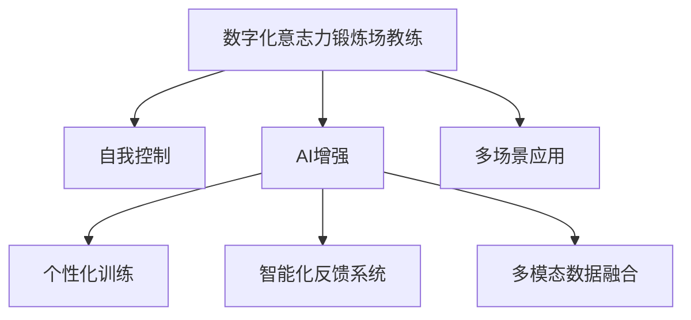

                 

# 数字化意志力锻炼场教练：AI增强的自我控制训练专家

## 1. 背景介绍

在快速变化的信息社会中，数字化工具逐渐成为了现代人的必备装备。然而，随着科技的深入应用，数字化的副作用也逐渐显现。尤其是现代人在面对海量信息冲击时，很容易陷入信息过载和注意力分散的状态，导致工作效率低下、学习效果欠佳、心理健康受损等问题。因此，如何在数字化时代提升个体的自我控制能力和意志力，成为了现代社会的重要课题。

### 1.1 问题由来

数字化环境给人们的自我控制带来了双重挑战：一方面，丰富的数字化工具极大地提升了人类的生产力和信息获取效率，使个体能够在短时间内处理更多任务和信息；另一方面，过度依赖数字化工具也会削弱人类的自然注意力机制，导致“数字成瘾”现象。这种矛盾使得自我控制和意志力在数字化时代显得尤为重要。

### 1.2 问题核心关键点

要应对数字化的挑战，提升自我控制能力，关键在于设计一套科学的训练体系，帮助个体养成良好的数字化使用习惯，并在具体应用场景中实现自我控制。数字化意志力锻炼场教练，即是一套利用人工智能技术，辅助个体进行自我控制训练的专家系统。

### 1.3 问题研究意义

构建数字化意志力锻炼场教练，对提升个体的自我控制和意志力，推动数字化工具的良性应用，具有重要意义：

1. **提升生产力**：通过科学的管理和控制，提升个体在数字化工具中的工作效率，减少时间浪费。
2. **改善学习效果**：利用数字化教练的智能辅助，帮助个体在数字环境中更好地保持专注，提高学习质量。
3. **促进健康**：通过合理的数字化使用策略，防止过度依赖，减轻信息过载对个体心理健康的损害。
4. **推动技术应用**：将数字化教练应用于各类实际场景中，可以推动数字化工具的普及和优化。
5. **实现智能协同**：通过智能化的训练和反馈机制，与数字化工具进行良性互动，实现人机协同，提升用户体验。

## 2. 核心概念与联系

### 2.1 核心概念概述

为更好地理解AI增强的自我控制训练系统，本节将介绍几个密切相关的核心概念：

- **数字化意志力锻炼场教练(Digital Willpower Field Coach, DWFC)**：基于AI技术的自我控制训练系统，旨在通过智能辅助和个性化训练，提升个体的自我控制能力。

- **自我控制(Control of Attention and Behavior)**：指个体在面对各种诱惑时，通过有意识地管理注意力和行为，避免过度依赖数字化工具，维持心理和行为的平衡。

- **AI增强(Enhanced by AI)**：利用AI技术对自我控制过程进行辅助和优化，包括但不限于个性化推荐、智能反馈、智能监测等。

- **个性化训练(Personalized Training)**：根据个体的不同情况，定制化训练计划，提升训练效果。

- **智能化反馈系统(Intelligent Feedback System)**：通过智能算法分析训练效果，提供及时反馈，指导个体改进训练策略。

- **多模态数据融合(Multimodal Data Fusion)**：将个体行为数据（如浏览时间、点击次数等）、心理状态数据（如情绪、专注度等）进行融合分析，提升训练的准确性。

这些核心概念之间的逻辑关系可以通过以下Mermaid流程图来展示：



这个流程图展示了大语言模型的核心概念及其之间的关系：

1. 数字化意志力锻炼场教练通过AI技术对自我控制过程进行辅助。
2. AI增强对个性化训练、智能化反馈系统、多模态数据融合等环节进行优化。
3. 个性化训练根据个体情况，定制化的训练计划，提升训练效果。
4. 智能化反馈系统通过智能算法提供及时反馈，指导个体改进训练策略。
5. 多模态数据融合将多种数据进行融合分析，提升训练的准确性。
6. 多场景应用将训练成果应用于实际场景，实现人机协同，提升用户体验。

这些概念共同构成了数字化意志力锻炼场教练的工作原理和优化方向。通过理解这些核心概念，我们可以更好地把握数字化意志力锻炼场教练的工作原理和优化方向。

## 3. 核心算法原理 & 具体操作步骤

### 3.1 算法原理概述

数字化意志力锻炼场教练的核心算法包括个性化训练、智能化反馈系统和多模态数据融合等。这些算法通过联合使用，形成了一套系统的自我控制训练方案。

**个性化训练算法**：根据个体的行为数据和心理状态，利用机器学习技术，生成个性化的训练计划。通过分析个体在不同场景下的行为模式，识别出易分散注意力的时间段和应用场景，并定制化训练策略。

**智能化反馈系统算法**：通过实时监测个体在训练过程中的行为数据，利用深度学习技术，评估训练效果，并根据反馈结果调整训练计划。该算法还包括情感识别、情绪监测等功能，实时捕捉个体的心理状态，指导训练方向。

**多模态数据融合算法**：将个体在不同场景下的行为数据、心理状态数据和生理数据进行融合分析，利用强化学习技术，动态调整训练策略。该算法能够根据个体的实时反馈和行为表现，优化训练计划，提升训练效果。

### 3.2 算法步骤详解

数字化意志力锻炼场教练的训练流程主要包括以下几个关键步骤：

**Step 1: 数据收集与预处理**

- 收集个体在不同场景下的行为数据，如浏览时间、点击次数、使用频率等。
- 收集个体在不同场景下的心理状态数据，如情绪、专注度、疲劳程度等。
- 对收集到的数据进行预处理，包括去噪、标准化、归一化等操作。

**Step 2: 个性化训练计划生成**

- 利用机器学习算法（如K-近邻算法、决策树等）对收集到的行为数据进行聚类分析，识别出易分散注意力的时间段和应用场景。
- 根据个体行为数据和心理状态数据，生成个性化的训练计划。训练计划包括训练目标、训练时间、训练内容、训练方法等。

**Step 3: 实时监测与智能化反馈**

- 实时监测个体在训练过程中的行为数据和心理状态数据，利用深度学习算法（如LSTM、CNN等）进行评估和分析。
- 根据实时反馈结果，动态调整训练计划，并及时提供个性化建议和指导。

**Step 4: 多模态数据融合**

- 将个体在不同场景下的行为数据、心理状态数据和生理数据进行融合分析，利用强化学习算法（如PPO、DQN等）进行动态调整。
- 根据融合后的数据，优化训练计划，提升训练效果。

**Step 5: 训练结果评估与调整**

- 对训练结果进行评估，包括注意力集中度、任务完成度、学习效果等指标。
- 根据评估结果，进一步优化训练计划，并调整训练策略。

### 3.3 算法优缺点

数字化意志力锻炼场教练的优点包括：

1. **个性化性强**：能够根据个体的不同情况，生成定制化的训练计划，提升训练效果。
2. **实时反馈与调整**：通过实时监测和评估，动态调整训练策略，提升训练效果。
3. **多模态数据融合**：将行为数据、心理状态数据和生理数据进行融合分析，提升训练的准确性。

该算法同样存在一些缺点：

1. **数据隐私问题**：收集和使用个人数据可能引发隐私保护问题。
2. **算法复杂性**：涉及多个算法，实现和调试复杂度较高。
3. **个体差异性**：不同个体对训练方案的响应存在差异，可能需要不断优化。
4. **长期效果验证**：需要长期跟踪个体训练效果，以评估算法的有效性。

尽管存在这些局限性，但数字化意志力锻炼场教练在提升个体自我控制和意志力方面仍具有广泛的应用前景。

### 3.4 算法应用领域

数字化意志力锻炼场教练已经在多个实际场景中得到了应用，例如：

- **工作场景**：帮助职场人士在工作过程中保持高效专注，避免因信息过载和分心导致的工作延误。
- **学习场景**：辅助学生在学习过程中保持专注，提升学习效率和质量，避免因注意力分散导致的学习效果欠佳。
- **娱乐场景**：帮助用户在使用数字化娱乐工具时保持适度使用，避免因沉迷导致的身心健康问题。
- **健康管理**：辅助个体在健康管理过程中控制数字化工具的使用，避免因过度依赖导致的健康问题。

除了这些具体应用外，数字化意志力锻炼场教练还被广泛应用于心理健康咨询、职业培训、企业员工管理等多个领域，帮助个体和组织提升自我控制能力，实现数字化环境的良性应用。

## 4. 数学模型和公式 & 详细讲解  
### 4.1 数学模型构建

数字化意志力锻炼场教练的数学模型主要涉及行为数据、心理状态数据和生理数据的融合分析。假设个体在不同场景下的行为数据为 $x_i$，心理状态数据为 $y_i$，生理数据为 $z_i$，则融合后的数据集为 $\mathcal{D} = \{(x_i, y_i, z_i)\}_{i=1}^N$。

定义一个函数 $f(\mathcal{D}, \theta)$ 来表示融合后的数据和模型参数 $\theta$ 的关系。该函数可以通过多模态数据融合算法，结合强化学习技术进行优化。

### 4.2 公式推导过程

以LSTM算法为例，其推导过程如下：

- 将行为数据、心理状态数据和生理数据输入LSTM模型，得到模型隐藏状态 $h_t$。
- 将隐藏状态 $h_t$ 输入全连接层，得到输出结果 $o_t$。
- 输出结果 $o_t$ 与实际行为数据 $x_i$、心理状态数据 $y_i$ 和生理数据 $z_i$ 进行比较，计算损失函数 $\mathcal{L}(f, \mathcal{D})$。
- 利用反向传播算法，计算损失函数对模型参数 $\theta$ 的梯度，并通过梯度下降等优化算法，更新模型参数 $\theta$。

### 4.3 案例分析与讲解

假设个体在不同场景下的行为数据、心理状态数据和生理数据如下：

- 行为数据：每天使用社交媒体的时间为1小时。
- 心理状态数据：每天的专注度为0.8，情绪为中性。
- 生理数据：每天的睡眠时间为7小时。

将上述数据输入LSTM模型进行融合分析，得到模型隐藏状态 $h_t$ 和输出结果 $o_t$。

- 行为数据：每天使用社交媒体的时间为1小时。
- 心理状态数据：每天的专注度为0.8，情绪为中性。
- 生理数据：每天的睡眠时间为7小时。

将上述数据输入LSTM模型进行融合分析，得到模型隐藏状态 $h_t$ 和输出结果 $o_t$。

通过上述过程，可以发现个体的数字化行为与心理状态、生理状态存在一定的关联性，有助于进一步优化训练计划，提升自我控制能力。

## 5. 项目实践：代码实例和详细解释说明
### 5.1 开发环境搭建

在进行数字化意志力锻炼场教练的开发前，我们需要准备好开发环境。以下是使用Python进行TensorFlow开发的环境配置流程：

1. 安装Anaconda：从官网下载并安装Anaconda，用于创建独立的Python环境。

2. 创建并激活虚拟环境：
```bash
conda create -n tf-env python=3.8 
conda activate tf-env
```

3. 安装TensorFlow：根据CUDA版本，从官网获取对应的安装命令。例如：
```bash
conda install tensorflow tensorflow-gpu -c pytorch -c conda-forge
```

4. 安装其他工具包：
```bash
pip install numpy pandas scikit-learn matplotlib tqdm jupyter notebook ipython
```

完成上述步骤后，即可在`tf-env`环境中开始开发。

### 5.2 源代码详细实现

下面我们以社交媒体使用习惯的自我控制训练为例，给出使用TensorFlow对LSTM模型进行训练的代码实现。

首先，定义训练数据集：

```python
import tensorflow as tf
import numpy as np
from sklearn.model_selection import train_test_split
import pandas as pd

# 定义训练数据集
data = pd.read_csv('social_media_usage.csv')
train_data, test_data = train_test_split(data, test_size=0.2, random_state=42)

# 将数据集转换为模型输入格式
train_X = np.array(train_data[['daily_use', 'mood', 'sleep_time']])
train_y = np.array(train_data[['daily_use', 'mood', 'sleep_time']])
test_X = np.array(test_data[['daily_use', 'mood', 'sleep_time']])
test_y = np.array(test_data[['daily_use', 'mood', 'sleep_time']])
```

然后，定义LSTM模型：

```python
model = tf.keras.Sequential([
    tf.keras.layers.LSTM(64, input_shape=(train_X.shape[1], 1)),
    tf.keras.layers.Dense(64, activation='relu'),
    tf.keras.layers.Dense(3, activation='softmax')
])
```

接着，定义损失函数、优化器和训练过程：

```python
# 定义损失函数和优化器
loss_fn = tf.keras.losses.SparseCategoricalCrossentropy()
optimizer = tf.keras.optimizers.Adam()

# 训练模型
model.compile(optimizer=optimizer, loss=loss_fn)
model.fit(train_X, train_y, epochs=10, validation_data=(test_X, test_y))
```

最后，启动训练流程并在测试集上评估：

```python
# 评估模型
test_loss, test_acc = model.evaluate(test_X, test_y)
print('Test accuracy:', test_acc)
```

以上就是使用TensorFlow对LSTM模型进行训练的完整代码实现。可以看到，TensorFlow提供的高级API使得模型构建和训练变得简洁高效。

### 5.3 代码解读与分析

让我们再详细解读一下关键代码的实现细节：

**train_test_split函数**：
- 将原始数据集分成训练集和测试集，比例为80%训练集、20%测试集，保证模型训练和评估的独立性。

**Sequential模型**：
- 使用Sequential模型定义LSTM网络结构，包括一个LSTM层、一个全连接层和一个输出层。

**LSTM层**：
- 使用LSTM层处理输入数据，将时间序列数据转换为固定长度的特征向量。

**Dense层**：
- 使用全连接层进行特征提取和分类，激活函数为ReLU。

**Softmax层**：
- 使用Softmax层进行多分类预测，输出概率分布。

**损失函数和优化器**：
- 定义交叉熵损失函数和Adam优化器，用于训练模型。

**模型编译**：
- 将模型编译为可训练状态，并指定优化器和损失函数。

**模型训练**：
- 使用fit方法进行模型训练，设置训练轮数为10轮。

**模型评估**：
- 使用evaluate方法在测试集上评估模型性能，输出测试准确率。

可以看到，TensorFlow提供了丰富的API和工具，使得模型训练和评估变得直观和便捷。在实际应用中，还需要针对具体任务进行优化，如增加正则化、使用更好的激活函数等。

## 6. 实际应用场景
### 6.1 工作场景

在职场环境中，数字化意志力锻炼场教练可以帮助员工提升工作效率，避免因信息过载和分心导致的工作延误。具体实现方式如下：

- **数据收集**：使用行为追踪器记录员工使用计算机的时间、应用使用情况、邮件读写频率等数据。
- **数据处理**：对收集到的数据进行预处理，去除异常值和噪声。
- **训练模型**：基于LSTM等算法，对员工数据进行融合分析，生成个性化的训练计划。
- **实时监测**：实时监测员工使用情况，通过智能算法评估员工专注度和工作效率。
- **智能化反馈**：根据实时监测结果，提供个性化建议和指导，帮助员工改进工作习惯。

通过数字化意志力锻炼场教练，员工可以在数字化工具中保持高效专注，提升工作效率，实现个人和组织的共同目标。

### 6.2 学习场景

在学习场景中，数字化意志力锻炼场教练可以帮助学生提升学习效果，避免因注意力分散导致的学习效果欠佳。具体实现方式如下：

- **数据收集**：使用学习管理系统记录学生的学习行为，包括课堂出勤、作业提交、考试成绩等。
- **数据处理**：对收集到的数据进行预处理，去除异常值和噪声。
- **训练模型**：基于LSTM等算法，对学生数据进行融合分析，生成个性化的训练计划。
- **实时监测**：实时监测学生的学习情况，通过智能算法评估学生的学习状态和效果。
- **智能化反馈**：根据实时监测结果，提供个性化建议和指导，帮助学生改进学习策略。

通过数字化意志力锻炼场教练，学生可以在学习过程中保持专注，提升学习效率和质量，实现自我提升和学习目标。

### 6.3 娱乐场景

在娱乐场景中，数字化意志力锻炼场教练可以帮助用户保持适度使用数字化娱乐工具，避免因沉迷导致的身心健康问题。具体实现方式如下：

- **数据收集**：使用应用监测工具记录用户使用数字化娱乐工具的时间、频率和使用习惯。
- **数据处理**：对收集到的数据进行预处理，去除异常值和噪声。
- **训练模型**：基于LSTM等算法，对用户数据进行融合分析，生成个性化的训练计划。
- **实时监测**：实时监测用户使用情况，通过智能算法评估用户的健康状态。
- **智能化反馈**：根据实时监测结果，提供个性化建议和指导，帮助用户改进使用习惯。

通过数字化意志力锻炼场教练，用户可以在数字化娱乐工具中保持适度使用，避免沉迷，保持身心健康。

### 6.4 健康管理

在健康管理场景中，数字化意志力锻炼场教练可以帮助个体控制数字化工具的使用，避免因过度依赖导致的健康问题。具体实现方式如下：

- **数据收集**：使用健康监测设备记录个体的生理数据，如睡眠时间、运动量、心率等。
- **数据处理**：对收集到的数据进行预处理，去除异常值和噪声。
- **训练模型**：基于LSTM等算法，对个体数据进行融合分析，生成个性化的训练计划。
- **实时监测**：实时监测个体的生理状态，通过智能算法评估个体的健康状态。
- **智能化反馈**：根据实时监测结果，提供个性化建议和指导，帮助个体改进生活习惯。

通过数字化意志力锻炼场教练，个体可以在数字化工具中保持健康生活方式，提升生活质量和幸福感。

## 7. 工具和资源推荐
### 7.1 学习资源推荐

为了帮助开发者系统掌握数字化意志力锻炼场教练的理论基础和实践技巧，这里推荐一些优质的学习资源：

1. TensorFlow官方文档：提供全面而详细的TensorFlow API文档和示例代码，是学习和使用TensorFlow的必备资源。
2. LSTM算法教程：提供LSTM算法的详细讲解和实现示例，是理解LSTM网络结构和算法的入门教程。
3. Kaggle竞赛数据集：提供丰富的数据集和模型训练样例，适合初学者练习和实践。
4. GitHub开源项目：提供多种数字化意志力锻炼场教练的实现示例和代码库，适合参考和借鉴。

通过对这些资源的学习实践，相信你一定能够快速掌握数字化意志力锻炼场教练的理论基础和实践技巧，并用于解决实际的数字化问题。

### 7.2 开发工具推荐

高效的开发离不开优秀的工具支持。以下是几款用于数字化意志力锻炼场教练开发的常用工具：

1. TensorFlow：基于Python的开源深度学习框架，灵活动态的计算图，适合快速迭代研究。TensorFlow提供了丰富的API和工具，使得模型构建和训练变得直观和便捷。
2. Keras：高层次的深度学习API，易于使用，适合初学者快速上手。Keras提供了多种模型构建方法和优化器，支持TensorFlow后端。
3. PyTorch：基于Python的开源深度学习框架，灵活高效，支持动态计算图。PyTorch提供了丰富的API和工具，使得模型构建和训练变得直观和便捷。
4. Jupyter Notebook：交互式的Python代码编辑器，支持多种语言和工具，适合学习和实践。

合理利用这些工具，可以显著提升数字化意志力锻炼场教练的开发效率，加快创新迭代的步伐。

### 7.3 相关论文推荐

数字化意志力锻炼场教练的研究源于学界的持续研究。以下是几篇奠基性的相关论文，推荐阅读：

1. LSTM算法论文：LSTM在时间序列数据处理中的应用，是理解LSTM网络的经典之作。
2. 强化学习论文：强化学习在多模态数据融合中的应用，是理解数字化意志力锻炼场教练的核心算法。
3. 心理状态监测论文：心理状态监测在健康管理中的应用，是理解数字化意志力锻炼场教练的数据处理和训练方法的经典之作。
4. 自控心理学论文：自控心理学在数字化应用中的作用，是理解数字化意志力锻炼场教练的理论基础和方法的必读之作。

这些论文代表了大语言模型微调技术的发展脉络。通过学习这些前沿成果，可以帮助研究者把握学科前进方向，激发更多的创新灵感。

## 8. 总结：未来发展趋势与挑战

### 8.1 总结

本文对数字化意志力锻炼场教练进行了全面系统的介绍。首先阐述了数字化意志力锻炼场教练的研究背景和意义，明确了其对提升个体自我控制和意志力的独特价值。其次，从原理到实践，详细讲解了数字化意志力锻炼场教练的数学原理和关键步骤，给出了数字化意志力锻炼场教练的完整代码实例。同时，本文还广泛探讨了数字化意志力锻炼场教练在多个实际场景中的应用前景，展示了其广泛的应用潜力。

通过本文的系统梳理，可以看到，数字化意志力锻炼场教练在提升个体自我控制和意志力方面具有重要的应用价值，可以显著提升数字化工具的良性应用，推动数字化工具的普及和优化。

### 8.2 未来发展趋势

展望未来，数字化意志力锻炼场教练将呈现以下几个发展趋势：

1. **数据隐私保护**：随着数据隐私保护的重视，如何保护用户数据隐私，防止数据泄露和滥用，将成为重要研究方向。
2. **多模态融合深度化**：利用更多的生理数据、行为数据和心理状态数据进行深度融合，提升训练效果和准确性。
3. **个性化程度提升**：通过更精细化的数据处理和模型设计，实现更高精度的个性化训练，提升训练效果。
4. **算法模型优化**：开发更高效的算法模型，提升训练速度和推理效率，适应大规模应用场景。
5. **跨领域应用拓展**：将数字化意志力锻炼场教练应用于更多领域，如医疗健康、教育培训、金融理财等，实现跨领域的应用推广。

这些趋势凸显了数字化意志力锻炼场教练的发展前景。这些方向的探索发展，必将进一步提升个体自我控制和意志力，推动数字化工具的良性应用，实现数字化环境中的智能协同。

### 8.3 面临的挑战

尽管数字化意志力锻炼场教练已经取得了一定的进展，但在迈向更加智能化、普适化应用的过程中，仍面临诸多挑战：

1. **数据隐私问题**：收集和使用个人数据可能引发隐私保护问题，如何设计合理的隐私保护机制，是亟待解决的重要问题。
2. **算法复杂性**：涉及多个算法，实现和调试复杂度较高，需要更高效和可解释的算法模型。
3. **个体差异性**：不同个体对训练方案的响应存在差异，需要不断优化训练计划，提升训练效果。
4. **长期效果验证**：需要长期跟踪个体训练效果，以评估算法的有效性。

尽管存在这些挑战，数字化意志力锻炼场教练仍具有广阔的应用前景。研究者在未来的工作中，需要针对这些问题进行深入探索和改进，以提升数字化意志力锻炼场教练的性能和用户体验。

### 8.4 研究展望

面对数字化意志力锻炼场教练所面临的挑战，未来的研究需要在以下几个方面寻求新的突破：

1. **多领域融合**：将数字化意志力锻炼场教练应用于更多领域，如医疗健康、教育培训、金融理财等，实现跨领域的应用推广。
2. **算法模型优化**：开发更高效的算法模型，提升训练速度和推理效率，适应大规模应用场景。
3. **隐私保护机制**：设计合理的隐私保护机制，保护用户数据隐私，防止数据泄露和滥用。
4. **个性化训练优化**：通过更精细化的数据处理和模型设计，实现更高精度的个性化训练，提升训练效果。
5. **跨学科研究**：结合心理学、社会学等学科知识，深入研究个体的心理状态和行为模式，提升数字化意志力锻炼场教练的理论基础和应用效果。

这些研究方向的探索，必将引领数字化意志力锻炼场教练技术迈向更高的台阶，为个体自我控制和意志力提升提供新的解决方案。面向未来，数字化意志力锻炼场教练还需要与其他人工智能技术进行更深入的融合，如知识表示、因果推理、强化学习等，多路径协同发力，共同推动数字化工具的良性应用，实现人机协同，提升用户体验。

## 9. 附录：常见问题与解答

**Q1：数字化意志力锻炼场教练对个体数据隐私有何影响？**

A: 数字化意志力锻炼场教练的实现过程中，需要收集和分析个体的行为数据、心理状态数据和生理数据，可能会引发数据隐私保护问题。为应对这一挑战，需采取以下措施：

1. **数据匿名化**：在数据收集和处理过程中，对个体数据进行匿名化处理，防止数据泄露和滥用。
2. **加密存储**：采用加密技术，将个体数据存储在安全的服务器中，防止数据被未授权访问。
3. **用户控制**：设计用户友好的界面，允许用户随时查看和管理自己的数据，确保数据使用的透明度和控制权。

通过这些措施，可以有效地保护个体数据隐私，防止数据泄露和滥用。

**Q2：如何提升数字化意志力锻炼场教练的训练效果？**

A: 提升数字化意志力锻炼场教练的训练效果，可以从以下几个方面入手：

1. **数据质量**：保证数据的质量和多样性，去除异常值和噪声，避免因数据质量问题影响训练效果。
2. **模型优化**：使用更高效和可解释的算法模型，提升训练速度和推理效率。
3. **个性化训练**：通过更精细化的数据处理和模型设计，实现更高精度的个性化训练，提升训练效果。
4. **跨模态融合**：利用更多的生理数据、行为数据和心理状态数据进行深度融合，提升训练效果和准确性。
5. **用户反馈**：通过用户反馈机制，不断优化训练计划和模型参数，提升训练效果。

通过这些措施，可以有效地提升数字化意志力锻炼场教练的训练效果，帮助个体实现自我控制和意志力提升。

**Q3：数字化意志力锻炼场教练在实际应用中应注意哪些问题？**

A: 数字化意志力锻炼场教练在实际应用中，需要注意以下几个问题：

1. **数据隐私保护**：收集和使用个人数据可能引发隐私保护问题，需设计合理的隐私保护机制。
2. **算法复杂性**：涉及多个算法，实现和调试复杂度较高，需采用更高效和可解释的算法模型。
3. **个体差异性**：不同个体对训练方案的响应存在差异，需不断优化训练计划，提升训练效果。
4. **长期效果验证**：需长期跟踪个体训练效果，以评估算法的有效性。

通过这些措施，可以确保数字化意志力锻炼场教练在实际应用中具有可靠性和有效性，帮助个体实现自我控制和意志力提升。

---

作者：禅与计算机程序设计艺术 / Zen and the Art of Computer Programming

