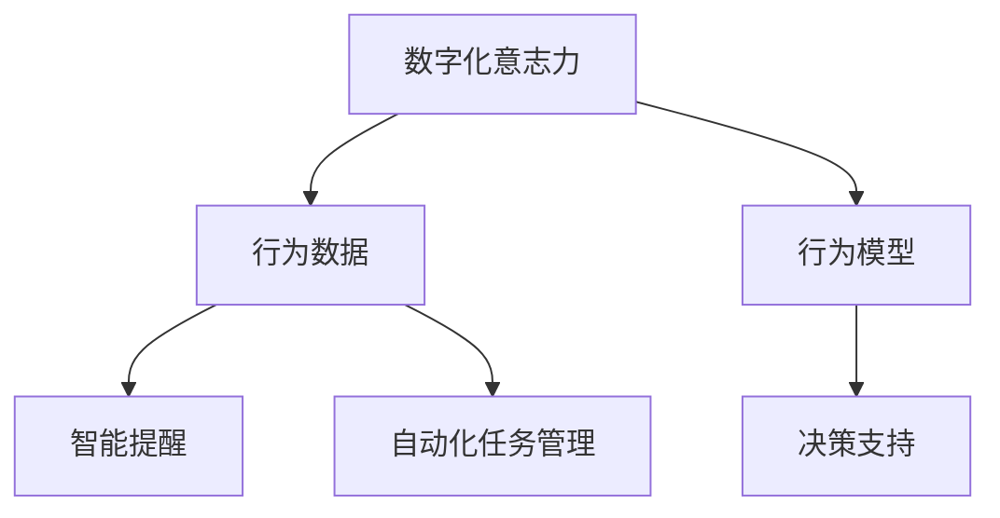

                 

# 数字化意志力：AI增强的自我控制

> 关键词：人工智能,数字化意志力,AI辅助决策,自动化管理,行为分析,算法优化

## 1. 背景介绍

### 1.1 问题由来

在数字时代，个人和企业面临的信息过载、时间管理、决策压力等挑战愈发严峻。如何利用技术手段提升自我控制能力，高效管理时间和资源，已成为现代社会的重要课题。人工智能(AI)技术的迅猛发展，为这一问题提供了全新的解决思路：通过数据驱动和算法优化，实现对人类行为的有效预测和管理，增强数字化意志力。

数字化意志力旨在借助AI工具，帮助人们更好地控制自身行为，克服拖延、提高专注、优化决策。其核心思想是通过数据分析、行为建模、决策支持等手段，增强人类对行为的可控性，从而提升个人效率和生活质量。

### 1.2 问题核心关键点

1. **数据驱动**：数字化意志力的实现依赖于对大量行为数据的收集和分析，通过构建详尽的行为模型，预测和优化个体行为。
2. **算法优化**：利用机器学习、深度学习等AI算法，对行为数据进行建模，实现行为预测和优化。
3. **自动化管理**：通过智能提醒、自动化任务调度等手段，实现对日常活动的自动化管理。
4. **行为分析**：深入分析用户行为特征，识别习惯、偏好和痛点，提供个性化的优化建议。
5. **算法透明度**：确保AI决策过程的可解释性和可解释性，提升用户信任度。

这些核心关键点共同构成了数字化意志力的技术框架，旨在通过AI技术的加持，提升个人自我控制能力。

## 2. 核心概念与联系

### 2.1 核心概念概述

为更好地理解数字化意志力的实现机制，本节将介绍几个密切相关的核心概念：

- **数字化意志力**：通过AI技术增强个人自我控制和决策能力，实现对时间、资源和行为的高效管理。
- **行为数据**：记录用户日常活动、心理状态、决策过程等数据，用于构建行为模型和进行行为预测。
- **行为模型**：通过机器学习算法，对行为数据进行建模，揭示行为背后的规律和特征。
- **决策支持**：利用AI算法对决策过程进行优化，辅助用户做出更好的决策。
- **智能提醒**：通过智能算法，对用户行为进行实时监控和提醒，促进时间管理。
- **自动化任务管理**：利用自动化工具，对用户任务进行规划和调度，提升效率。

这些核心概念之间的逻辑关系可以通过以下Mermaid流程图来展示：



这个流程图展示了几者之间的关系：

1. 行为数据是数字化意志力的基础。
2. 行为模型对行为数据进行建模，揭示行为规律。
3. 决策支持基于行为模型，优化决策过程。
4. 智能提醒和自动化任务管理则是决策支持和行为模型的具体应用。

## 3. 核心算法原理 & 具体操作步骤

### 3.1 算法原理概述

数字化意志力的实现原理是通过构建详尽的行为模型，对用户的行为进行预测和优化。具体而言，包括以下几个步骤：

1. **数据收集**：收集用户的行为数据，包括时间管理、任务执行、健康状态、情绪变化等。
2. **行为建模**：利用机器学习算法，对行为数据进行建模，揭示行为背后的规律和特征。
3. **决策优化**：根据行为模型，优化决策过程，帮助用户做出更优的选择。
4. **行为干预**：通过智能提醒、自动化任务管理等手段，对用户行为进行实时干预，增强自我控制。

### 3.2 算法步骤详解

#### 3.2.1 数据收集

数据收集是行为分析的基础。具体步骤如下：

1. **多渠道数据收集**：通过智能穿戴设备、手机应用、PC客户端等多种渠道，收集用户的各类行为数据。
2. **数据标准化**：对收集到的数据进行标准化处理，统一格式和时间轴。
3. **数据清洗**：剔除异常数据和噪音数据，确保数据质量。

#### 3.2.2 行为建模

行为建模是行为分析的核心。具体步骤如下：

1. **特征工程**：提取行为数据中的关键特征，如时间戳、任务类型、情绪评分等。
2. **模型选择**：选择合适的机器学习算法，如随机森林、神经网络、强化学习等。
3. **模型训练**：在大量标注数据上训练模型，优化模型参数。
4. **模型评估**：使用交叉验证、AUC-ROC等评估指标，评估模型性能。

#### 3.2.3 决策优化

决策优化是行为优化的重要环节。具体步骤如下：

1. **决策规则制定**：基于行为模型，制定决策规则，如任务优先级、时间分配、休息时长等。
2. **推荐算法设计**：设计推荐算法，根据决策规则和用户偏好，推荐最佳行为方案。
3. **实时决策支持**：在用户行为过程中，实时提供决策支持，引导用户做出最佳选择。

#### 3.2.4 行为干预

行为干预是数字化意志力的关键步骤。具体步骤如下：

1. **智能提醒**：通过智能算法，对用户行为进行实时监控，在关键时间节点提醒用户完成任务或休息。
2. **自动化任务管理**：利用自动化工具，对用户任务进行规划和调度，提升效率。
3. **行为记录与反馈**：记录用户的行为数据和干预效果，定期进行行为分析和优化。

### 3.3 算法优缺点

数字化意志力算法具有以下优点：

1. **数据驱动**：通过分析大量行为数据，实现对个体行为的精准预测和优化。
2. **自动化管理**：利用AI技术，实现对日常活动的自动化管理，减轻用户负担。
3. **决策支持**：通过决策优化算法，提供科学合理的决策建议，提升决策质量。
4. **行为干预**：通过实时干预和提醒，增强用户自我控制能力，改善行为习惯。

同时，该算法也存在一定的局限性：

1. **隐私风险**：行为数据的收集和分析可能涉及用户隐私，需要严格的数据保护措施。
2. **模型鲁棒性**：模型对数据质量和时间粒度的要求较高，一旦数据不全或偏差，可能影响模型效果。
3. **算法复杂度**：决策优化和行为干预算法较复杂，需要大量计算资源。
4. **用户接受度**：部分用户可能对AI干预存在抵触情绪，需慎重处理。

尽管存在这些局限性，但就目前而言，数字化意志力算法仍是一种高效提升自我控制能力的重要手段。未来相关研究的重点在于如何进一步提升算法透明度和可解释性，降低隐私风险，提高用户接受度，同时兼顾算法效率和效果。

### 3.4 算法应用领域

数字化意志力算法在个人和企业中的应用广泛，包括但不限于：

1. **时间管理**：通过智能提醒和自动化任务管理，帮助用户优化时间安排，提高效率。
2. **健康管理**：通过行为数据监测和分析，提供健康管理和饮食建议，促进身心健康。
3. **学习辅导**：利用行为模型和决策优化，提供个性化学习路径和资源推荐，提升学习效果。
4. **工作管理**：通过行为分析，优化工作流程和任务分配，提升团队协作和工作效率。
5. **项目管理**：对项目进度和任务执行进行实时监控和干预，确保项目按时完成。

除了这些常见应用外，数字化意志力算法还在企业人力资源管理、供应链优化、智能客服等多个领域得到了应用，为各行各业带来了新的管理思路和技术支撑。

## 4. 数学模型和公式 & 详细讲解 & 举例说明

### 4.1 数学模型构建

本节将使用数学语言对数字化意志力的实现过程进行更加严格的刻画。

记用户的行为数据为 $D=\{(x_i,y_i)\}_{i=1}^N$，其中 $x_i$ 为行为特征向量，$y_i$ 为行为标签。假设目标行为预测模型为 $f(x_i)$，则在数据集 $D$ 上的经验风险为：

$$
\mathcal{L}(f) = \frac{1}{N} \sum_{i=1}^N \ell(f(x_i),y_i)
$$

其中 $\ell(\cdot)$ 为损失函数，常用的有均方误差、交叉熵等。

### 4.2 公式推导过程

以下我们以时间管理为例，推导智能提醒算法中推荐系统的时间点预测模型。

假设用户的时间管理数据为 $(x_t)$，其中 $x_t$ 包括当前时间、待办任务列表、时间花费等特征。假设目标行为为在 $t$ 时刻是否开始一个新任务，则时间点预测模型的目标为：

$$
\hat{y}_t = f(x_t)
$$

模型训练的目标是最小化经验风险，即：

$$
\mathcal{L}(f) = \frac{1}{N} \sum_{i=1}^N \ell(f(x_t^i),y_t^i)
$$

其中 $y_t^i$ 为在 $t_i$ 时刻是否开始一个新任务。

利用机器学习算法（如随机森林、神经网络等），对用户行为数据进行建模，得到预测模型 $f(x_t)$。模型在训练集上训练，评估模型性能，最终得到预测模型：

$$
f(x_t) = \sum_{j=1}^d \beta_j x_{t,j} + b
$$

其中 $\beta$ 为模型参数，$x_{t,j}$ 为特征向量中的第 $j$ 个元素，$b$ 为偏置项。

通过预测模型，在实时场景中，当用户进入某个时间段时，系统实时计算预测概率 $\hat{y}_t$，根据概率大小判断是否需要发出提醒。如果 $\hat{y}_t > \theta$，则发出提醒，其中 $\theta$ 为预设的提醒阈值。

### 4.3 案例分析与讲解

以健康管理为例，展示如何使用数字化意志力算法对用户健康行为进行分析和优化。

**场景描述**：用户A是一名健身爱好者，希望通过数字化意志力算法优化自己的健身计划。

**数据收集**：用户A佩戴智能健身设备，收集各类健身数据，包括步数、心率、饮食、睡眠质量等。

**行为建模**：利用机器学习算法，对用户A的行为数据进行建模，得到行为规律和特征。

**决策优化**：根据行为模型，制定科学合理的健身计划，并实时提供决策支持。

**行为干预**：通过智能提醒，在健身前、中、后提醒用户调整饮食、休息和训练强度，确保健身效果。

## 5. 项目实践：代码实例和详细解释说明

### 5.1 开发环境搭建

在进行数字化意志力算法实践前，我们需要准备好开发环境。以下是使用Python进行TensorFlow开发的环境配置流程：

1. 安装Anaconda：从官网下载并安装Anaconda，用于创建独立的Python环境。

2. 创建并激活虚拟环境：
```bash
conda create -n tf-env python=3.8 
conda activate tf-env
```

3. 安装TensorFlow：根据CUDA版本，从官网获取对应的安装命令。例如：
```bash
conda install tensorflow -c tf -c conda-forge
```

4. 安装各类工具包：
```bash
pip install numpy pandas scikit-learn matplotlib tqdm jupyter notebook ipython
```

完成上述步骤后，即可在`tf-env`环境中开始数字化意志力算法的开发实践。

### 5.2 源代码详细实现

下面我们以时间管理为例，给出使用TensorFlow进行智能提醒系统的PyTorch代码实现。

首先，定义智能提醒系统的时间点预测模型：

```python
import tensorflow as tf
from tensorflow.keras.models import Sequential
from tensorflow.keras.layers import Dense
from sklearn.model_selection import train_test_split

# 假设行为数据为(x_t, y_t)，其中 x_t为特征向量，y_t为标签
# 构建随机森林模型，用于预测时间点t是否开始一个新任务
model = Sequential()
model.add(Dense(64, input_dim=5, activation='relu'))
model.add(Dense(1, activation='sigmoid'))

# 编译模型
model.compile(loss='binary_crossentropy', optimizer='adam', metrics=['accuracy'])

# 假设训练数据为(x_train, y_train)
x_train, x_test, y_train, y_test = train_test_split(x_train, y_train, test_size=0.2, random_state=42)

# 训练模型
model.fit(x_train, y_train, epochs=10, batch_size=32, validation_data=(x_test, y_test))

# 保存模型
model.save('time_reminder_model.h5')
```

然后，定义智能提醒系统的应用逻辑：

```python
from tensorflow.keras.models import load_model
from sklearn.metrics import confusion_matrix
from sklearn.metrics import accuracy_score

# 加载模型
model = load_model('time_reminder_model.h5')

# 假设用户当前时间为2022-10-01 09:00
current_time = '2022-10-01 09:00'

# 对当前时间进行预处理
current_time = preprocess(current_time)

# 使用模型预测是否开始新任务
y_pred = model.predict(current_time)

# 如果预测概率大于阈值，发出提醒
if y_pred > 0.5:
    print('提醒用户开始新任务')
else:
    print('当前时间不适合开始新任务')
```

### 5.3 代码解读与分析

让我们再详细解读一下关键代码的实现细节：

**预处理函数preprocess**：
- 对用户当前时间进行格式转换和处理，确保时间数据的一致性。

**时间点预测模型**：
- 使用TensorFlow的Keras API构建随机森林模型，包含一个输入层、一个隐藏层和一个输出层。
- 输入层维度为5，表示时间、任务类型、情绪评分等关键特征。
- 隐藏层包含64个神经元，激活函数为ReLU。
- 输出层为sigmoid激活函数，用于二分类任务。

**模型训练**：
- 在训练集上训练模型，设置10个epoch，批大小为32。
- 使用二分类交叉熵作为损失函数，Adam优化器进行优化。
- 在测试集上评估模型性能，输出准确率。

**模型应用**：
- 加载模型，对用户当前时间进行预处理。
- 使用模型预测是否开始新任务，根据预测概率与阈值比较，决定是否发出提醒。

该代码实现展示了数字化意志力算法的基本流程：数据收集、行为建模、决策优化和行为干预。通过智能提醒系统的实践，我们可以看到数字化意志力算法在实际应用中的具体体现。

## 6. 实际应用场景

### 6.1 智能健康管理

数字化意志力算法在健康管理中的应用，可以显著提升用户的健康监测和管理效率。通过智能穿戴设备收集用户的各类健康数据，结合行为建模和决策优化，用户可以实时了解自己的健康状况，并获取个性化的健康管理建议。

具体而言，数字化意志力算法可以实现以下功能：

1. **健康数据分析**：通过分析用户的心率、步数、睡眠质量等数据，实时监测用户的健康状态。
2. **个性化建议**：根据用户行为数据和健康状况，提供个性化的饮食、运动和休息建议。
3. **行为干预**：通过智能提醒和自动化管理，帮助用户养成健康的生活习惯。

例如，用户可以通过手机应用，实时查看自己的健康数据和个性化建议，系统根据数据分析结果，智能提醒用户进行适当的休息和运动，确保身心健康。

### 6.2 个性化学习辅导

在教育领域，数字化意志力算法可以显著提升学习效果，帮助学生制定科学的学习计划，优化学习资源和方式。

具体而言，数字化意志力算法可以实现以下功能：

1. **学习行为分析**：通过分析学生的时间管理、任务执行和学习效率等数据，了解学生的学习行为模式。
2. **个性化学习路径**：根据行为分析结果，制定个性化的学习路径和资源推荐，帮助学生高效学习。
3. **实时反馈与调整**：在学习过程中，实时提供决策支持和学习建议，帮助学生及时调整学习策略。

例如，学生可以通过智能学习系统，实时查看自己的学习行为数据和个性化建议，系统根据学习行为分析结果，推荐最优的学习资源和路径，并实时提供学习建议，帮助学生提升学习效果。

### 6.3 企业项目管理

在企业管理中，数字化意志力算法可以提升项目管理的效率和质量，确保项目按时完成，同时优化团队协作。

具体而言，数字化意志力算法可以实现以下功能：

1. **项目进度监测**：通过实时监测项目进度和任务执行情况，发现潜在问题和风险。
2. **任务优化与调度**：根据行为模型和决策优化，优化任务分配和执行顺序，提升项目效率。
3. **团队协作管理**：通过智能提醒和自动化管理，确保团队成员按时完成任务，提升团队协作效果。

例如，项目经理可以通过数字化意志力算法，实时监测项目进度和任务执行情况，及时发现潜在问题和风险，并调整任务分配和执行顺序，确保项目按时完成，同时提升团队协作效果。

## 7. 工具和资源推荐

### 7.1 学习资源推荐

为了帮助开发者系统掌握数字化意志力的理论基础和实践技巧，这里推荐一些优质的学习资源：

1. **《数据科学基础》系列课程**：由斯坦福大学、麻省理工学院等名校开设，全面介绍了数据科学和机器学习的基础概念和应用。
2. **《TensorFlow实战》书籍**：TensorFlow官方指南，详细介绍了TensorFlow的使用方法和实际案例。
3. **《Python机器学习》书籍**：介绍了机器学习在Python中的实现方法，适合初学者入门。
4. **Kaggle竞赛平台**：提供大量数据集和机器学习竞赛，提升实战能力。
5. **机器学习社区**：如GitHub、Stack Overflow等，可以快速获取和学习最新的机器学习技术和算法。

通过对这些资源的学习实践，相信你一定能够快速掌握数字化意志力的精髓，并用于解决实际的管理和决策问题。

### 7.2 开发工具推荐

高效的开发离不开优秀的工具支持。以下是几款用于数字化意志力算法开发的常用工具：

1. TensorFlow：由Google主导开发的开源深度学习框架，生产部署方便，适合大规模工程应用。
2. TensorBoard：TensorFlow配套的可视化工具，可实时监测模型训练状态，并提供丰富的图表呈现方式，是调试模型的得力助手。
3. Weights & Biases：模型训练的实验跟踪工具，可以记录和可视化模型训练过程中的各项指标，方便对比和调优。
4. HuggingFace Transformers库：提供丰富的预训练语言模型和Transformer实现，便于快速搭建和微调模型。
5. Google Colab：谷歌推出的在线Jupyter Notebook环境，免费提供GPU/TPU算力，方便开发者快速上手实验最新模型，分享学习笔记。

合理利用这些工具，可以显著提升数字化意志力算法的开发效率，加快创新迭代的步伐。

### 7.3 相关论文推荐

数字化意志力算法的发展源于学界的持续研究。以下是几篇奠基性的相关论文，推荐阅读：

1. **《时间序列预测与时间点预测》**：介绍了时间序列预测和点预测的数学模型和算法。
2. **《基于机器学习的行为分析》**：通过机器学习算法对用户行为进行建模，揭示行为背后的规律和特征。
3. **《强化学习在行为干预中的应用》**：利用强化学习算法，实现对用户行为的实时干预和优化。
4. **《数据驱动的决策优化》**：通过数据分析和算法优化，提升决策质量和效果。

这些论文代表了大规模语言模型微调技术的发展脉络。通过学习这些前沿成果，可以帮助研究者把握学科前进方向，激发更多的创新灵感。

## 8. 总结：未来发展趋势与挑战

### 8.1 总结

本文对数字化意志力算法的实现原理和应用场景进行了全面系统的介绍。首先阐述了数字化意志力的研究背景和意义，明确了AI技术在提升自我控制能力方面的独特价值。其次，从原理到实践，详细讲解了算法的核心步骤和关键环节，给出了实际应用中的完整代码实现。同时，本文还广泛探讨了算法在健康管理、学习辅导、项目管理等领域的实际应用，展示了算法的广泛前景。此外，本文精选了算法学习资源和工具，力求为读者提供全方位的技术指引。

通过本文的系统梳理，可以看到，数字化意志力算法正在成为AI技术提升自我控制能力的重要手段，为个人和企业带来了新的管理思路和技术支撑。未来，伴随AI技术的不断发展，数字化意志力算法必将进一步提升自我控制能力，成为智能管理的重要工具。

### 8.2 未来发展趋势

展望未来，数字化意志力算法将呈现以下几个发展趋势：

1. **算法多样性**：除了传统的机器学习算法，未来还将涌现更多深度学习、强化学习等新型算法，提升行为预测和优化的精度和效率。
2. **数据融合**：结合多源数据（如社交网络、物联网等），提升行为分析和决策优化的全面性和准确性。
3. **实时性增强**：通过分布式计算和边缘计算技术，实现实时行为分析和决策支持，提升用户体验。
4. **多模态融合**：结合语音、图像、文本等多种模态数据，提升行为分析和干预的准确性和可解释性。
5. **隐私保护**：在数据收集和分析过程中，采取隐私保护技术，确保用户数据的安全和隐私。
6. **个性化优化**：通过智能推荐和个性化学习，实现对用户行为的精细化和个性化优化。

这些趋势凸显了数字化意志力算法的广阔前景。这些方向的探索发展，必将进一步提升AI技术的自我控制能力，为个人和企业带来新的管理思路和技术支撑。

### 8.3 面临的挑战

尽管数字化意志力算法已经取得了一定的成效，但在迈向更加智能化、普适化应用的过程中，它仍面临诸多挑战：

1. **数据隐私**：在数据收集和分析过程中，如何平衡数据隐私和行为分析的必要性，需要进一步探索。
2. **模型鲁棒性**：在面对数据噪声和偏误时，如何提高算法的鲁棒性和稳定性，仍需深入研究。
3. **算法透明性**：如何在保证算法效果的同时，提高算法的透明性和可解释性，提升用户信任度。
4. **用户接受度**：如何设计用户友好的界面和交互方式，提升用户对AI干预的接受度。
5. **资源消耗**：在提高算法精度和效果的同时，如何降低计算和存储资源的消耗，实现高效优化。

这些挑战需要在技术、伦理和社会多方面进行综合考虑和解决，才能使数字化意志力算法更好地服务于社会和个人发展。

### 8.4 研究展望

面对数字化意志力算法所面临的种种挑战，未来的研究需要在以下几个方面寻求新的突破：

1. **隐私保护技术**：开发更先进的隐私保护技术，确保数据安全和隐私保护。
2. **鲁棒性增强**：研究更稳健的算法模型，提高算法的鲁棒性和抗干扰能力。
3. **透明性和可解释性**：引入可解释性算法和因果分析方法，提升算法的透明性和可解释性。
4. **多模态融合**：开发更多多模态融合技术，提升算法的全面性和准确性。
5. **个性化优化**：利用推荐系统和大数据技术，实现对用户行为的个性化优化。

这些研究方向的探索，必将引领数字化意志力算法迈向更高的台阶，为个人和企业带来新的管理思路和技术支撑。面向未来，数字化意志力算法还需要与其他AI技术进行更深入的融合，如知识表示、因果推理、强化学习等，多路径协同发力，共同推动AI技术在智能管理中的应用。只有勇于创新、敢于突破，才能不断拓展AI技术的边界，让智能管理更好地服务于社会和个人发展。

## 9. 附录：常见问题与解答

**Q1：数字化意志力算法是否适用于所有应用场景？**

A: 数字化意志力算法在多数应用场景中都能取得较好的效果，特别是对于数据量较大的场景，如健康管理、学习辅导等。但对于一些特殊场景，如医疗诊断、金融决策等，仍需结合领域专业知识进行优化。

**Q2：算法模型如何保证用户的隐私？**

A: 在数据收集和分析过程中，可以采用差分隐私、联邦学习等隐私保护技术，确保用户数据的匿名性和安全性。同时，明确告知用户数据用途，获得用户同意，保障数据隐私。

**Q3：算法模型的鲁棒性如何提升？**

A: 通过数据增强、模型集成、对抗样本训练等技术，提升算法的鲁棒性和泛化能力。同时，引入更多先验知识和领域知识，对模型进行校验和优化。

**Q4：算法如何提高透明度和可解释性？**

A: 采用可解释性算法和因果分析方法，确保算法的决策过程透明可理解。引入领域专家和用户反馈，不断优化算法设计，提升算法的透明性和可解释性。

**Q5：如何优化算法的资源消耗？**

A: 通过模型压缩、模型裁剪、分布式计算等技术，降低算法的计算和存储资源消耗。同时，结合边缘计算技术，实现实时行为分析和决策支持，提升系统效率。

这些问题的解答，展示了数字化意志力算法在实际应用中的复杂性和挑战性，同时也指明了未来研究和发展方向。相信通过不断探索和优化，数字化意志力算法必将在智能管理中发挥更大的作用，助力个人和企业迈向更高的管理水平。

---

作者：禅与计算机程序设计艺术 / Zen and the Art of Computer Programming

