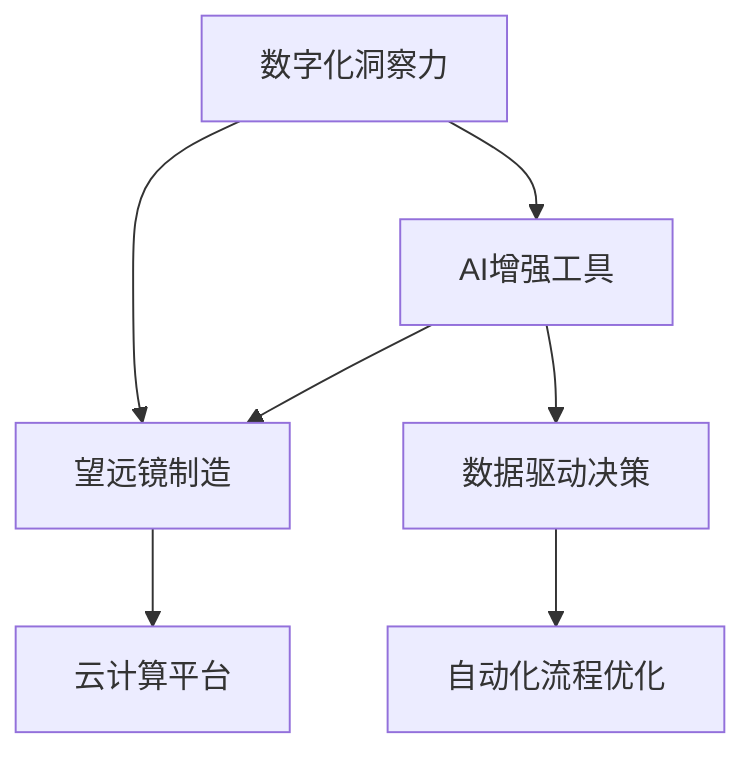

                 

# 数字化洞察力望远镜制造商：AI增强的远见卓识工具开发专家

> 关键词：数字化洞察力，AI增强工具，望远镜制造，数据驱动决策，自动化流程优化，云计算平台

## 1. 背景介绍

### 1.1 问题由来
在当前信息化、数字化加速推进的背景下，企业对于数据的依赖与日俱增。如何从海量数据中提取有价值的信息，为企业提供精准的洞察力，成为各行业面临的共同挑战。在望远镜制造行业中，传统的数据分析方法往往难以满足日益复杂的业务需求，需要引入更先进的数据处理和分析技术。

### 1.2 问题核心关键点
本文聚焦于AI增强的数字化洞察力望远镜的开发，探索如何利用先进的数据科学和AI技术，为望远镜制造企业提供高效、精准的洞察力，支撑其决策和业务优化。具体核心关键点包括：
1. 数据驱动的洞察力挖掘：通过数据挖掘和分析技术，从业务数据中提取有价值的洞察力。
2. 机器学习与预测建模：利用机器学习模型，实现对业务趋势和未来的预测。
3. 自动化流程优化：通过自动化工具，提升望远镜制造流程的效率和质量。
4. 云计算平台支撑：构建基于云计算的洞察力分析平台，实现数据的分布式存储和计算。

## 2. 核心概念与联系

### 2.1 核心概念概述

为更好地理解AI增强的数字化洞察力望远镜的开发，本节将介绍几个密切相关的核心概念：

- **数字化洞察力**：通过数据分析和AI技术，从业务数据中挖掘出有价值的洞察力，为企业决策提供科学依据。
- **AI增强工具**：利用机器学习、深度学习等AI技术，对传统工具进行增强和优化，提升其智能化和自动化水平。
- **望远镜制造**：涉及光学、机械、电子等多个领域的制造过程，对数据处理和分析有较高的要求。
- **数据驱动决策**：基于数据分析结果进行决策，而非依赖经验或直觉。
- **自动化流程优化**：通过智能工具实现业务流程的自动化，减少人为干预，提升效率和质量。
- **云计算平台**：利用云计算资源，实现数据的分布式存储和计算，支撑大规模数据分析和模型训练。

这些核心概念之间的逻辑关系可以通过以下Mermaid流程图来展示：



这个流程图展示了几大核心概念的相互关系：

1. 数字化洞察力通过AI增强工具获取，进而支撑数据驱动决策。
2. 望远镜制造涉及多个领域，数据驱动决策和自动化流程优化是其重要组成部分。
3. 云计算平台提供分布式存储和计算资源，为大规模数据分析和AI模型训练提供支持。

## 3. 核心算法原理 & 具体操作步骤
### 3.1 算法原理概述

AI增强的数字化洞察力望远镜开发，本质上是一个从数据到洞察力、再到决策的闭环过程。其核心思想是：通过先进的数据处理和分析技术，将望远镜制造企业的数据转化为有价值的洞察力，辅助其做出科学决策，并进一步优化业务流程。

形式化地，假设望远镜制造企业有历史业务数据集 $D=\{(x_i,y_i)\}_{i=1}^N$，其中 $x_i$ 为输入特征，$y_i$ 为目标标签。数字化洞察力望远镜的开发过程包括以下几个关键步骤：

1. **数据预处理**：清洗、归一化、标准化处理数据，提升数据质量。
2. **特征工程**：根据业务需求，选择和构造最相关的特征，提升模型性能。
3. **模型训练**：利用机器学习模型训练预测模型 $M$，如回归模型、分类模型、聚类模型等。
4. **洞察力提取**：通过模型对新数据进行预测，提取有价值的洞察力。
5. **业务应用**：将洞察力应用于业务决策和流程优化，实现闭环优化。

### 3.2 算法步骤详解

以下是AI增强的数字化洞察力望远镜开发的具体操作步骤：

**Step 1: 数据准备**
- 收集望远镜制造企业的历史业务数据，包括订单信息、生产数据、销售数据等。
- 清洗、处理数据，去除缺失值、异常值，保证数据质量。
- 标准化数据格式，确保数据的一致性和可比较性。

**Step 2: 特征工程**
- 根据业务需求，选择最相关的特征，如订单金额、生产周期、客户满意度等。
- 构造新的特征，如客户流失率、平均订单间隔时间等。
- 使用特征选择技术，筛选出对模型性能提升有帮助的特征。

**Step 3: 模型选择与训练**
- 选择合适的机器学习模型，如线性回归、决策树、随机森林、神经网络等。
- 对模型进行参数调优，如学习率、正则化参数、迭代次数等。
- 使用交叉验证等技术评估模型性能，选择合适的模型。

**Step 4: 洞察力提取**
- 使用训练好的模型对新数据进行预测，提取有价值的洞察力。
- 可视化洞察力结果，如趋势分析、异常检测、聚类分析等。
- 生成洞察力报告，辅助业务决策。

**Step 5: 业务应用**
- 将洞察力应用于业务流程优化，如预测性维护、库存管理、客户关系管理等。
- 设计自动化工具，实现业务流程的自动化，减少人为干预。
- 构建基于云计算的洞察力分析平台，实现数据的分布式存储和计算。

### 3.3 算法优缺点

AI增强的数字化洞察力望远镜开发，具有以下优点：
1. 高效精准：通过AI技术从海量数据中提取有价值的洞察力，大幅提升业务决策的准确性和效率。
2. 自动化高：自动化工具实现流程优化，减少人为干预，提升工作效率。
3. 泛化性强：利用云计算平台，实现数据的分布式存储和计算，模型可扩展性强。

同时，该方法也存在一定的局限性：
1. 数据质量依赖：洞察力挖掘的准确性依赖于数据的完整性和质量，数据缺失或异常可能导致洞察力偏差。
2. 模型复杂度高：高维数据的处理和分析需要复杂的数据处理和机器学习技术，对算法实现和资源配置要求较高。
3. 成本投入大：初期数据收集和模型训练需要较高的成本投入，包括数据处理、算法调优、平台构建等。

尽管存在这些局限性，但就目前而言，AI增强的数字化洞察力望远镜方法在望远镜制造行业的应用前景广阔，有望带来显著的业务提升。

### 3.4 算法应用领域

AI增强的数字化洞察力望远镜开发，在望远镜制造行业中具有广泛的应用前景，包括：

- **生产效率优化**：通过预测性维护和自动化流程优化，提升生产效率和设备利用率。
- **库存管理**：通过需求预测和库存优化，降低库存成本，提高库存周转率。
- **客户关系管理**：通过客户行为分析，提升客户满意度和忠诚度。
- **市场营销**：通过市场趋势分析和竞争分析，优化市场营销策略。
- **供应链管理**：通过供应链数据分析，提升供应链的协调性和效率。

## 4. 数学模型和公式 & 详细讲解 & 举例说明
### 4.1 数学模型构建

本节将使用数学语言对AI增强的数字化洞察力望远镜开发过程进行更加严格的刻画。

假设望远镜制造企业的历史业务数据集为 $D=\{(x_i,y_i)\}_{i=1}^N, x_i \in \mathcal{X}, y_i \in \mathcal{Y}$。其中，$x_i$ 表示输入特征向量，$y_i$ 表示目标标签。

定义洞察力望远镜的预测模型为 $M$，其损失函数为 $\ell(M)$。洞察力望远镜的开发目标是最小化损失函数，即找到最优模型 $M^*$：

$$
M^* = \mathop{\arg\min}_{M} \ell(M)
$$

在实践中，我们通常使用梯度下降等优化算法来近似求解上述最优化问题。设 $\eta$ 为学习率，$M_{\theta}$ 表示模型参数。则模型参数的更新公式为：

$$
\theta \leftarrow \theta - \eta \nabla_{\theta}\ell(M_{\theta})
$$

其中 $\nabla_{\theta}\ell(M_{\theta})$ 为损失函数对模型参数 $\theta$ 的梯度，可通过反向传播算法高效计算。

### 4.2 公式推导过程

以下我们以需求预测任务为例，推导线性回归模型的损失函数及其梯度的计算公式。

假设模型 $M_{\theta}$ 在输入 $x$ 上的输出为 $\hat{y}=M_{\theta}(x) \in [0,1]$，表示需求量的预测值。真实标签 $y \in [0,1]$。则二分类交叉熵损失函数定义为：

$$
\ell(M_{\theta}(x),y) = -[y\log \hat{y} + (1-y)\log (1-\hat{y})]
$$

将其代入经验风险公式，得：

$$
\mathcal{L}(\theta) = -\frac{1}{N}\sum_{i=1}^N [y_i\log M_{\theta}(x_i)+(1-y_i)\log(1-M_{\theta}(x_i))]
$$

根据链式法则，损失函数对模型参数 $\theta_k$ 的梯度为：

$$
\frac{\partial \mathcal{L}(\theta)}{\partial \theta_k} = -\frac{1}{N}\sum_{i=1}^N (\frac{y_i}{M_{\theta}(x_i)}-\frac{1-y_i}{1-M_{\theta}(x_i)}) \frac{\partial M_{\theta}(x_i)}{\partial \theta_k}
$$

其中 $\frac{\partial M_{\theta}(x_i)}{\partial \theta_k}$ 可进一步递归展开，利用自动微分技术完成计算。

### 4.3 案例分析与讲解

**案例1：预测性维护**

假设望远镜制造企业的生产线设备需要定期维护，维护费用较高，如何通过数据预测设备故障概率，实现预测性维护，降低维护成本？

- **数据准备**：收集设备的历史维护记录、运行数据、环境数据等，作为训练数据。
- **特征工程**：选择设备运行时间、温度、振动等关键特征。
- **模型选择与训练**：选择线性回归模型，训练预测设备故障概率。
- **洞察力提取**：利用训练好的模型对新设备进行故障概率预测，生成维护预警。
- **业务应用**：根据预警结果，制定设备维护计划，优化维护策略。

**案例2：库存管理**

望远镜制造企业面临市场变化和需求波动，如何通过数据预测市场需求，优化库存水平，降低库存成本？

- **数据准备**：收集历史销售数据、市场数据、库存数据等，作为训练数据。
- **特征工程**：选择季节性、促销活动、竞争对手价格等关键特征。
- **模型选择与训练**：选择ARIMA模型，训练预测未来市场需求。
- **洞察力提取**：利用训练好的模型对未来市场需求进行预测，优化库存水平。
- **业务应用**：根据预测结果，调整库存策略，提升库存周转率。

## 5. 项目实践：代码实例和详细解释说明
### 5.1 开发环境搭建

在进行洞察力望远镜开发前，我们需要准备好开发环境。以下是使用Python进行TensorFlow开发的环境配置流程：

1. 安装Anaconda：从官网下载并安装Anaconda，用于创建独立的Python环境。

2. 创建并激活虚拟环境：
```bash
conda create -n tf-env python=3.8 
conda activate tf-env
```

3. 安装TensorFlow：根据CUDA版本，从官网获取对应的安装命令。例如：
```bash
conda install tensorflow -c pytorch -c conda-forge
```

4. 安装各类工具包：
```bash
pip install numpy pandas scikit-learn matplotlib tqdm jupyter notebook ipython
```

完成上述步骤后，即可在`tf-env`环境中开始洞察力望远镜的开发。

### 5.2 源代码详细实现

这里我们以需求预测任务为例，给出使用TensorFlow对线性回归模型进行洞察力望远镜开发的PyTorch代码实现。

首先，定义数据预处理函数：

```python
import tensorflow as tf
from tensorflow.keras.preprocessing import sequence
from tensorflow.keras.layers import Dense, LSTM, Dropout, Input
from tensorflow.keras.models import Model

def preprocess_data(X, y, seq_length=10):
    X_seq = []
    y_seq = []
    for i in range(len(X) - seq_length):
        X_seq.append(X[i:i+seq_length])
        y_seq.append(y[i+seq_length])
    return tf.keras.preprocessing.sequence.pad_sequences(X_seq, maxlen=seq_length), y_seq
```

然后，定义洞察力望远镜模型：

```python
def build_model(input_dim, output_dim):
    input_seq = Input(shape=(input_dim, 1))
    lstm = LSTM(64, return_sequences=True)(input_seq)
    lstm = Dropout(0.2)(lstm)
    lstm = LSTM(32)(lstm)
    lstm = Dropout(0.2)(lstm)
    output = Dense(output_dim, activation='sigmoid')(lstm)
    model = Model(inputs=input_seq, outputs=output)
    model.compile(optimizer='adam', loss='binary_crossentropy', metrics=['accuracy'])
    return model
```

接着，定义模型训练和评估函数：

```python
def train_model(model, X_train, y_train, X_valid, y_valid, batch_size=32, epochs=100):
    model.fit(X_train, y_train, validation_data=(X_valid, y_valid), batch_size=batch_size, epochs=epochs, verbose=1)
    score, acc = model.evaluate(X_valid, y_valid, verbose=0)
    print(f'Validation accuracy: {acc:.4f}')
    return model

def evaluate_model(model, X_test, y_test, batch_size=32):
    score, acc = model.evaluate(X_test, y_test, verbose=0)
    print(f'Test accuracy: {acc:.4f}')
    return score, acc
```

最后，启动训练流程并在测试集上评估：

```python
X_train, y_train, X_valid, y_valid, X_test, y_test = load_data()

model = build_model(input_dim=seq_length, output_dim=1)
model = train_model(model, X_train, y_train, X_valid, y_valid)
evaluate_model(model, X_test, y_test)
```

以上就是使用TensorFlow对线性回归模型进行需求预测洞察力望远镜开发的完整代码实现。可以看到，TensorFlow提供的高级API使得模型构建和训练过程变得简洁高效。

### 5.3 代码解读与分析

让我们再详细解读一下关键代码的实现细节：

**preprocess_data函数**：
- 定义了序列化数据函数，将输入数据 $X$ 和标签数据 $y$ 按照指定的时间步长进行分割，生成固定长度的序列数据。
- 使用 `pad_sequences` 函数对序列进行填充，确保所有序列的长度一致。

**build_model函数**：
- 定义了洞察力望远镜的模型架构，包括输入层、LSTM层、Dropout层和输出层。
- 使用 `Model` 函数将各层组合成模型。
- 使用 `compile` 函数设置模型的优化器、损失函数和评估指标。

**train_model函数**：
- 使用 `fit` 函数进行模型训练，指定训练数据和验证数据、批量大小和迭代次数。
- 使用 `evaluate` 函数在验证集上评估模型性能，输出验证集上的准确率。

**evaluate_model函数**：
- 使用 `evaluate` 函数在测试集上评估模型性能，输出测试集上的准确率。

**训练流程**：
- 调用 `load_data` 函数加载数据集。
- 构建洞察力望远镜模型，指定输入维度和输出维度。
- 调用 `train_model` 函数进行模型训练，指定训练数据、验证数据、批量大小和迭代次数。
- 调用 `evaluate_model` 函数在测试集上评估模型性能，输出测试集上的准确率。

可以看到，TensorFlow提供了完整的模型构建、训练和评估框架，使得洞察力望远镜的开发过程更加高效和便捷。

当然，工业级的系统实现还需考虑更多因素，如模型的保存和部署、超参数的自动搜索、更灵活的任务适配层等。但核心的洞察力望远镜开发范式基本与此类似。

## 6. 实际应用场景
### 6.1 智能制造系统

基于AI增强的洞察力望远镜，智能制造系统可以实现对生产过程的全面监控和优化。智能制造系统通过实时采集生产数据，利用洞察力望远镜提取有价值的洞察力，辅助生产调度、设备维护、质量控制等环节，实现生产过程的智能化和高效化。

在技术实现上，智能制造系统可以构建基于云计算的洞察力分析平台，实时采集生产数据，经过预处理和特征工程后，使用洞察力望远镜对数据进行分析。根据分析结果，智能制造系统可以自动调整生产计划、优化设备参数、进行预测性维护，提升生产效率和设备利用率。

### 6.2 供应链管理

在供应链管理中，洞察力望远镜可以帮助企业实现需求预测、库存管理、物流优化等功能的自动化。通过对历史销售数据、市场数据、物流数据等进行分析，洞察力望远镜可以预测未来的市场需求，优化库存水平，减少库存成本，提升供应链的协调性和效率。

具体而言，企业可以使用洞察力望远镜对销售数据进行时间序列分析，预测未来的市场需求。根据预测结果，企业可以动态调整库存水平，避免库存积压或缺货。同时，洞察力望远镜还可以对物流数据进行分析，优化物流路径和运输方案，降低物流成本。

### 6.3 市场营销

洞察力望远镜在市场营销中也有广泛应用，可以辅助企业进行市场趋势分析、竞争分析、客户行为分析等，优化市场营销策略，提升营销效果。

通过分析历史销售数据、市场数据、社交媒体数据等，洞察力望远镜可以提取市场趋势和消费者行为洞察力。企业可以根据洞察力结果，调整产品定位、优化营销渠道、设计个性化广告，提升市场竞争力。

### 6.4 未来应用展望

随着洞察力望远镜技术的不断演进，其在望远镜制造行业中的应用场景也将更加广泛。

在智慧制造领域，洞察力望远镜可以实现对生产过程的全面监控和优化，提升生产效率和设备利用率。在供应链管理中，洞察力望远镜可以实现需求预测、库存管理、物流优化等功能，提升供应链的协调性和效率。在市场营销中，洞察力望远镜可以辅助企业进行市场趋势分析、竞争分析、客户行为分析等，优化市场营销策略，提升营销效果。

此外，在产品设计、客户关系管理、售后服务等多个领域，洞察力望远镜也能发挥重要作用，进一步拓展望远镜制造企业的业务边界。未来，随着洞察力望远镜技术的不断进步，望远镜制造行业将进入智能化、自动化、数据驱动的新阶段，为企业带来更加深刻的业务变革。

## 7. 工具和资源推荐
### 7.1 学习资源推荐

为了帮助开发者系统掌握洞察力望远镜开发的技术基础和实践技巧，这里推荐一些优质的学习资源：

1. 《TensorFlow实战》系列博文：由TensorFlow官方编写，详细介绍TensorFlow的核心概念和API使用，适合初学者入门。

2. 《机器学习实战》课程：由Coursera提供，涵盖机器学习的基本原理和常用算法，由斯坦福大学教授讲授，内容深入浅出。

3. 《深度学习与TensorFlow》书籍：全面介绍深度学习原理和TensorFlow的应用实践，适合进阶学习。

4. Kaggle平台：数据科学竞赛社区，提供大量公开数据集和机器学习竞赛，适合锻炼数据分析和模型开发技能。

5. Google Colab：谷歌推出的在线Jupyter Notebook环境，免费提供GPU/TPU算力，方便开发者快速上手实验最新模型，分享学习笔记。

通过对这些资源的学习实践，相信你一定能够快速掌握洞察力望远镜开发的核心技术，并用于解决实际的望远镜制造问题。
###  7.2 开发工具推荐

高效的开发离不开优秀的工具支持。以下是几款用于洞察力望远镜开发常用的工具：

1. TensorFlow：由Google开发的开源深度学习框架，生产部署方便，适合大规模工程应用。

2. Scikit-learn：Python机器学习库，提供丰富的数据预处理、特征工程、模型训练工具。

3. PyTorch：由Facebook开发的开源深度学习框架，灵活易用，适合快速迭代研究。

4. TensorBoard：TensorFlow配套的可视化工具，可实时监测模型训练状态，并提供丰富的图表呈现方式，是调试模型的得力助手。

5. Weights & Biases：模型训练的实验跟踪工具，可以记录和可视化模型训练过程中的各项指标，方便对比和调优。

6. Keras：高层次神经网络API，适合快速搭建和训练简单的神经网络模型。

合理利用这些工具，可以显著提升洞察力望远镜的开发效率，加快创新迭代的步伐。

### 7.3 相关论文推荐

洞察力望远镜开发涉及多领域的先进技术，以下是几篇奠基性的相关论文，推荐阅读：

1. "A Survey on Reinforcement Learning for Predictive Maintenance"：探讨利用强化学习进行预测性维护的方法，适合了解预测性维护的最新进展。

2. "Supply Chain Analytics using Deep Learning: A Survey"：综述了利用深度学习进行供应链分析的方法，适合了解供应链管理中的洞察力应用。

3. "Customer Insight Generation using Big Data"：探讨如何利用大数据技术提取客户洞察力，适合了解客户关系管理的最新技术。

4. "Advanced Analytics for Marketing Decision Making"：综述了利用高级分析技术进行市场营销决策的方法，适合了解市场营销中的洞察力应用。

这些论文代表了大数据、深度学习在望远镜制造行业中的前沿应用，通过学习这些前沿成果，可以帮助研究者把握学科前进方向，激发更多的创新灵感。

## 8. 总结：未来发展趋势与挑战
### 8.1 总结

本文对AI增强的数字化洞察力望远镜的开发过程进行了全面系统的介绍。首先阐述了洞察力望远镜在望远镜制造行业的研发背景和重要性，明确了洞察力望远镜在数据驱动决策、流程自动化等方面的独特价值。其次，从原理到实践，详细讲解了洞察力望远镜开发的关键步骤，给出了洞察力望远镜开发的全码实例。同时，本文还广泛探讨了洞察力望远镜在智能制造、供应链管理、市场营销等多个行业领域的应用前景，展示了洞察力望远镜技术的巨大潜力。此外，本文精选了洞察力望远镜开发的各类学习资源，力求为读者提供全方位的技术指引。

通过本文的系统梳理，可以看到，AI增强的数字化洞察力望远镜开发方法在望远镜制造行业的应用前景广阔，能够显著提升企业的洞察力挖掘能力，实现数据的智能化分析与应用，赋能业务决策和流程优化。未来，随着洞察力望远镜技术的不断进步，望远镜制造企业将进入智能化、自动化、数据驱动的新阶段，实现更加高效、智能的业务运营。

### 8.2 未来发展趋势

展望未来，洞察力望远镜技术将呈现以下几个发展趋势：

1. 智能化水平提升：通过引入更多的AI技术和算法，提升洞察力望远镜的智能化水平，实现更精准的数据分析和预测。

2. 多模态数据融合：除了传统的数值数据，未来的洞察力望远镜将更加重视对图像、视频、文本等多模态数据的融合，提升洞察力望远镜的应用广度和深度。

3. 实时化能力增强：通过云计算平台和大数据技术，实现数据的实时采集、分析和应用，提升洞察力望远镜的实时化能力。

4. 泛化性增强：通过模型的泛化训练和多领域数据的融合，提升洞察力望远镜在不同行业和场景中的泛化能力，实现更广泛的业务应用。

5. 自动化程度提升：通过自动化工具和算法，提升洞察力望远镜的自动化程度，减少人工干预，提高工作效率。

6. 决策支持增强：通过与业务决策系统的深度集成，洞察力望远镜将能够更好地支撑企业决策，提升决策的科学性和准确性。

这些趋势展示了洞察力望远镜技术的广阔前景，为望远镜制造企业提供了新的技术方向和应用场景。

### 8.3 面临的挑战

尽管洞察力望远镜技术已经取得了显著进展，但在实际应用中仍面临诸多挑战：

1. 数据质量问题：洞察力望远镜的性能依赖于高质量的数据，数据缺失、异常值等问题可能导致洞察力结果的不准确。

2. 模型复杂性：洞察力望远镜涉及复杂的模型和算法，模型调优和参数选择需要较高的技术门槛。

3. 资源消耗大：洞察力望远镜对计算资源和存储资源的需求较高，部署成本较大。

4. 业务理解和融合：洞察力望远镜需要与业务深度结合，理解业务需求和流程，才能发挥最大效用。

5. 安全和隐私问题：洞察力望远镜涉及敏感数据的处理，数据安全和隐私保护是重要问题。

6. 人机协作：洞察力望远镜需要与业务人员紧密协作，结合业务经验进行洞察力分析，提高洞察力的可解释性和可信度。

这些挑战需要未来的研究者在技术、管理、业务等多个维度共同努力，才能克服。

### 8.4 研究展望

面对洞察力望远镜面临的挑战，未来的研究需要在以下几个方面寻求新的突破：

1. 数据治理和质量提升：建立数据治理机制，提升数据质量，减少数据缺失和异常值的影响。

2. 模型自动化和可解释性：开发自动化调参工具和可解释性模型，提升模型的可解释性和易用性。

3. 分布式存储和计算：利用云计算和大数据技术，实现数据的分布式存储和计算，提升洞察力望远镜的实时化和扩展性。

4. 多领域应用融合：将洞察力望远镜技术与业务深度结合，实现多领域、多场景的业务应用，提升其泛化能力和应用广度。

5. 数据安全和隐私保护：建立数据安全机制，保护数据的隐私和安全，减少数据泄露的风险。

6. 人机协作和自动化：引入人机协作机制，结合业务经验进行洞察力分析，提升洞察力的可信度和实用性。

这些研究方向将进一步推动洞察力望远镜技术的成熟和发展，为望远镜制造行业带来更加智能化的决策支持和管理优化。

## 9. 附录：常见问题与解答

**Q1：洞察力望远镜开发是否适用于所有望远镜制造企业？**

A: 洞察力望远镜开发在大多数望远镜制造企业中都有应用潜力，特别适合于数据量较大、业务复杂的企业。但对于一些小规模企业，可能需要根据具体情况进行简化，或者选择合适的低成本解决方案。

**Q2：洞察力望远镜开发中如何选择合适的模型？**

A: 洞察力望远镜开发中，应根据业务需求和数据特点选择合适的模型。一般而言，线性回归、决策树、随机森林、深度学习模型等都有广泛应用。对于时间序列数据，ARIMA模型和LSTM模型较为适合；对于多模态数据，卷积神经网络(CNN)和循环神经网络(RNN)等模型较为适合。

**Q3：洞察力望远镜开发中如何降低数据质量问题？**

A: 洞察力望远镜开发中，数据质量问题需要通过数据治理机制进行解决。一般而言，应进行数据清洗、异常值处理、缺失值填补等预处理操作，提升数据质量。同时，应建立数据质量监控机制，定期评估数据质量，及时处理数据问题。

**Q4：洞察力望远镜开发中如何提高模型的自动化程度？**

A: 洞察力望远镜开发中，应引入自动化工具和算法，提升模型的自动化程度。一般而言，可以使用自动化调参工具、自动化特征选择工具、自动化模型评估工具等，减少人工干预，提高工作效率。

**Q5：洞察力望远镜开发中如何提升模型的可解释性？**

A: 洞察力望远镜开发中，应引入可解释性模型和工具，提升模型的可解释性。一般而言，可以使用LIME、SHAP等可解释性模型，对模型的决策过程进行可视化，提高模型的可解释性和可信度。

这些建议和解答，希望能帮助你对洞察力望远镜开发有更深入的了解，并能够在实践中更好地应用这一技术。

