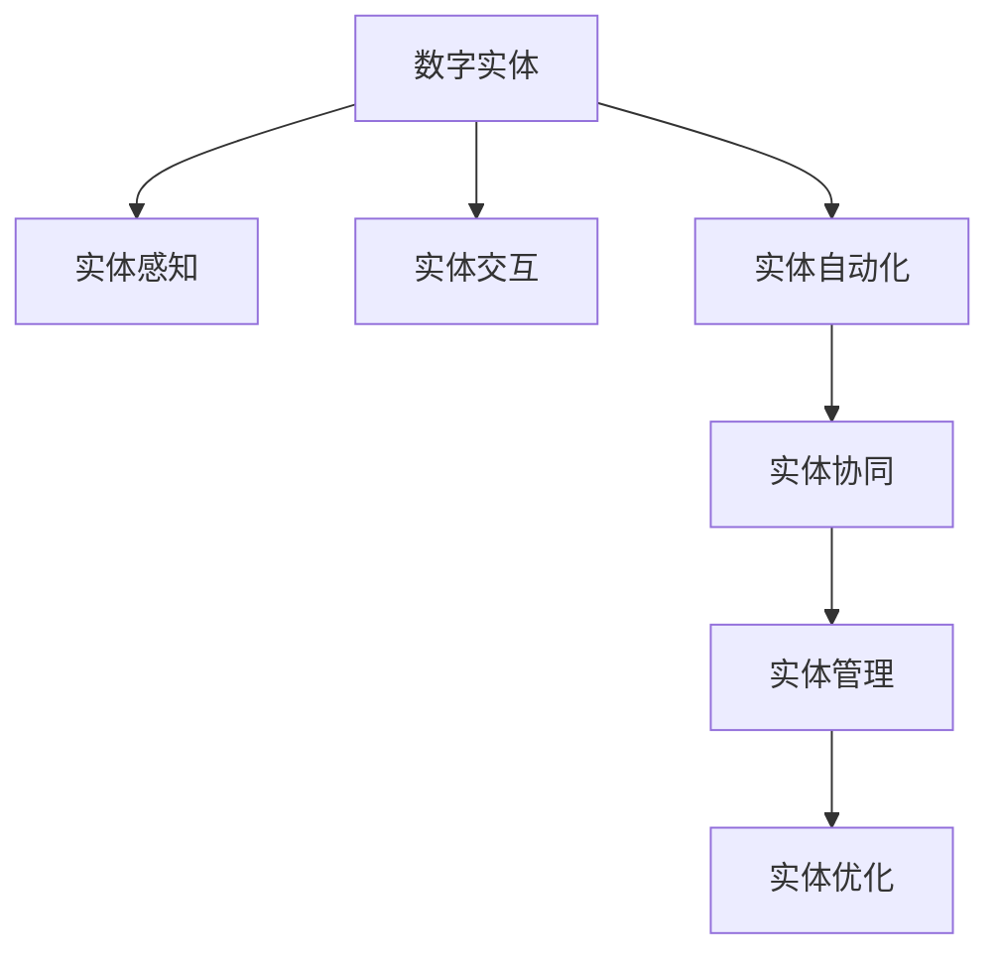

                 

# 数字实体与物理实体的自动化进展

## 1. 背景介绍

### 1.1 问题由来
随着信息技术的发展，数字实体（Digital Entity）在各个领域的应用越来越广泛，如虚拟现实、增强现实、数字孪生等。这些数字实体由计算机生成，能够真实地反映物理实体（Physical Entity）的属性和状态，使得人们能够在虚拟世界中对物理世界进行模拟、分析和控制。然而，数字实体的自动化和智能化程度仍显不足，如何高效自动化生成和管理数字实体，是当前亟待解决的问题。

### 1.2 问题核心关键点
在数字实体的自动化进展中，主要关注以下核心问题：
- 如何高效自动化生成数字实体，以适应动态变化的环境和任务需求？
- 如何实现数字实体与物理实体的协同运作，提升自动化水平？
- 如何构建数字实体间的智能交互，实现复杂任务和问题的自动化解决？
- 如何利用深度学习和大数据技术，提高数字实体的智能化程度和自适应能力？

### 1.3 问题研究意义
实现数字实体的自动化，对于提升工业生产的智能化水平、优化城市管理、增强人机交互体验、构建智慧社会具有重要意义：

1. 提高生产效率：自动化数字实体能够实时监控生产流程，快速响应异常，提升生产线的智能化水平，缩短制造周期。
2. 优化城市管理：智能交通、智慧安防等应用，能够提升城市管理的效率和智能化水平，保障城市安全稳定。
3. 增强人机交互：虚拟现实、增强现实等应用，能够提供沉浸式的人机交互体验，提升用户体验。
4. 构建智慧社会：数字实体能够汇聚海量数据，为智慧城市、智慧医疗、智慧教育等领域的智能化发展提供技术支撑。

## 2. 核心概念与联系

### 2.1 核心概念概述

为更好地理解数字实体与物理实体的自动化进展，本节将介绍几个密切相关的核心概念：

- 数字实体（Digital Entity）：指由计算机生成的、能够模拟和反映物理实体属性和状态的虚拟对象。
- 物理实体（Physical Entity）：指真实存在的物理对象，包括人、物、环境等。
- 实体感知（Entity Perception）：指数字实体对物理实体的感知和识别能力，包括视觉、听觉、触觉等。
- 实体交互（Entity Interaction）：指数字实体与物理实体之间的交互行为，包括语音交互、手势识别、触摸感应等。
- 实体自动化（Entity Automation）：指通过自动化技术，提升数字实体的生成、管理和交互能力，实现复杂任务的自动化解决。
- 实体协同（Entity Collaboration）：指数字实体间的协同运作和信息共享，提升整体系统的智能化水平。

这些核心概念之间的逻辑关系可以通过以下Mermaid流程图来展示：



这个流程图展示了大语言模型的核心概念及其之间的关系：

1. 数字实体通过感知和交互技术与物理实体交互，收集数据和信息。
2. 实体自动化技术对数字实体进行智能化管理和优化，提升其性能。
3. 实体协同技术实现数字实体间的信息共享和协同工作，提升整体系统的智能化水平。

## 3. 核心算法原理 & 具体操作步骤
### 3.1 算法原理概述

数字实体的自动化生成和管理，主要依赖于深度学习和大数据技术。其核心思想是：通过收集和分析物理实体的数据，利用深度学习模型预测数字实体的属性和状态，并根据这些属性和状态，自动化生成和管理数字实体。

形式化地，假设物理实体的数据集为 $D=\{(x_i, y_i)\}_{i=1}^N$，其中 $x_i$ 为输入特征，$y_i$ 为对应的输出标签。数字实体的状态为 $s$，属性为 $a$，实体自动化算法可以表示为：

$$
s = f(a)
$$

其中 $f$ 为深度学习模型，将属性 $a$ 映射到状态 $s$。通过训练 $f$ 模型，自动预测数字实体的状态和属性，并自动化生成和管理数字实体。

### 3.2 算法步骤详解

数字实体的自动化生成和管理过程，包括以下几个关键步骤：

**Step 1: 数据采集与预处理**
- 通过传感器、摄像头、麦克风等设备，收集物理实体的数据，如位置、形状、颜色、温度等。
- 对原始数据进行预处理，如去噪、归一化、特征提取等，以提高数据的质量和可用性。

**Step 2: 数据标注与训练**
- 根据收集到的物理实体数据，标注数字实体的属性和状态。
- 使用标注数据训练深度学习模型 $f$，通过反向传播算法最小化预测误差。

**Step 3: 数字实体生成**
- 将训练好的模型 $f$ 应用到新的物理实体数据上，预测数字实体的状态和属性。
- 根据预测结果，自动化生成数字实体，并更新其状态。

**Step 4: 数字实体管理**
- 通过监测数字实体的状态，评估其实时性能和安全性。
- 根据评估结果，调整数字实体的参数和控制策略，优化其行为和表现。

**Step 5: 数字实体交互**
- 实现数字实体与物理实体的交互行为，如语音交互、手势识别、触摸感应等。
- 根据交互结果，更新数字实体的状态和属性，实现动态适应和智能响应。

### 3.3 算法优缺点

数字实体的自动化生成和管理方法具有以下优点：
1. 高效自动化：通过深度学习模型自动化生成和管理数字实体，大大提高了效率和准确性。
2. 动态适应：数字实体能够实时感知和适应物理实体的变化，提升智能化水平。
3. 智能交互：数字实体能够与物理实体进行交互，实现复杂任务的自动化解决。
4. 灵活性高：根据不同任务需求，可以灵活调整数字实体的参数和行为。

同时，该方法也存在一定的局限性：
1. 数据依赖性高：模型的性能很大程度上取决于数据的质量和多样性，数据采集和标注成本较高。
2. 模型复杂度高：深度学习模型需要大量的计算资源和时间进行训练，难以在资源受限的环境下应用。
3. 安全性问题：数字实体的自动生成和交互行为可能带来安全风险，需要加强风险防范措施。

尽管存在这些局限性，但数字实体的自动化生成和管理方法仍是大规模自动化应用的重要手段。未来相关研究的重点在于如何进一步降低数据采集和标注成本，提高模型的泛化能力和鲁棒性，同时兼顾安全性等问题。

### 3.4 算法应用领域

数字实体的自动化生成和管理方法，在工业生产、智慧城市、智慧医疗、智慧教育等众多领域都有广泛的应用前景：

- **工业生产**：自动化生成数字实体，实时监控生产线状态，预测设备故障，优化生产流程，提高生产效率。
- **智慧城市**：自动化生成数字实体，实现智能交通、智慧安防、城市规划等应用，提升城市管理的智能化水平。
- **智慧医疗**：自动化生成数字实体，辅助医生进行诊断和治疗，提供个性化医疗服务，提升医疗质量。
- **智慧教育**：自动化生成数字实体，提供虚拟实验、个性化学习等应用，提升教育效果。

## 4. 数学模型和公式 & 详细讲解 & 举例说明
### 4.1 数学模型构建

本节将使用数学语言对数字实体的自动化生成和管理过程进行更加严格的刻画。

假设物理实体的数据集为 $D=\{(x_i, y_i)\}_{i=1}^N$，其中 $x_i$ 为输入特征，$y_i$ 为对应的输出标签。数字实体的状态为 $s$，属性为 $a$，实体自动化算法可以表示为：

$$
s = f(a)
$$

其中 $f$ 为深度学习模型，将属性 $a$ 映射到状态 $s$。假设 $a$ 为连续型特征向量，$s$ 为离散型状态变量。

定义数字实体的状态预测函数为 $f$，其形式化定义如下：

$$
f(x; \theta) = W_a f_a(x; \theta_a) + W_s f_s(x; \theta_s) + b
$$

其中 $W_a, W_s$ 为模型权重，$f_a$ 和 $f_s$ 为激活函数，$\theta_a, \theta_s, \theta$ 为模型参数，$b$ 为偏置项。

### 4.2 公式推导过程

下面以二分类任务为例，推导数字实体状态预测函数的公式。

假设数字实体的属性为 $a \in \mathbb{R}^n$，状态为 $s \in \{0,1\}$，状态预测函数 $f$ 的形式化定义如下：

$$
f(a; \theta) = W_a a^T + W_s + b
$$

其中 $W_a, W_s$ 为模型权重，$b$ 为偏置项。假设模型输出为 $z = f(a; \theta)$，则二分类任务的损失函数为：

$$
\mathcal{L}(\theta) = -\frac{1}{N}\sum_{i=1}^N [y_i \log s_i + (1-y_i) \log (1-s_i)]
$$

其中 $s_i$ 为模型预测的数字实体状态，$y_i$ 为训练数据集的标注标签。使用交叉熵损失函数可以有效地衡量模型的预测精度。

在得到损失函数后，最小化损失函数即得模型参数 $\theta$：

$$
\theta = \mathop{\arg\min}_{\theta} \mathcal{L}(\theta)
$$

在实际应用中，我们通常使用基于梯度的优化算法（如SGD、Adam等）来近似求解上述最优化问题。设 $\eta$ 为学习率，则参数的更新公式为：

$$
\theta \leftarrow \theta - \eta \nabla_{\theta}\mathcal{L}(\theta)
$$

其中 $\nabla_{\theta}\mathcal{L}(\theta)$ 为损失函数对模型参数 $\theta$ 的梯度，可通过反向传播算法高效计算。

### 4.3 案例分析与讲解

为了更直观地理解数字实体的自动化生成和管理，下面以智能家居系统为例，详细讲解其实现过程。

**案例背景**：
智能家居系统通过传感器、摄像头、麦克风等设备，实时采集房间内的温度、湿度、声音等数据，并通过深度学习模型，自动化生成数字实体（如智能音箱、智能灯光等），实现智能控制和交互。

**具体实现**：
1. **数据采集与预处理**：传感器、摄像头、麦克风等设备实时采集房间内的温度、湿度、声音等数据，并通过网络传输到云端。
2. **数据标注与训练**：根据采集到的数据，标注数字实体的属性和状态。例如，将温度数据作为数字音箱的属性，语音命令作为数字音箱的状态。使用标注数据训练深度学习模型，预测数字实体的状态和属性。
3. **数字实体生成**：将训练好的模型应用到新的数据上，预测数字实体的状态和属性。例如，根据温度数据，预测数字音箱是否需要播放音乐。
4. **数字实体管理**：通过监测数字实体的状态，评估其实时性能和安全性。例如，根据音乐播放状态，调整数字音箱的音量和音质。
5. **数字实体交互**：实现数字实体与物理实体的交互行为。例如，根据语音命令，控制数字音箱播放音乐。

## 5. 项目实践：代码实例和详细解释说明
### 5.1 开发环境搭建

在进行数字实体的自动化生成和管理实践前，我们需要准备好开发环境。以下是使用Python进行PyTorch开发的环境配置流程：

1. 安装Anaconda：从官网下载并安装Anaconda，用于创建独立的Python环境。

2. 创建并激活虚拟环境：
```bash
conda create -n pytorch-env python=3.8 
conda activate pytorch-env
```

3. 安装PyTorch：根据CUDA版本，从官网获取对应的安装命令。例如：
```bash
conda install pytorch torchvision torchaudio cudatoolkit=11.1 -c pytorch -c conda-forge
```

4. 安装TensorFlow：由Google主导开发的开源深度学习框架，生产部署方便，适合大规模工程应用。同样有丰富的预训练语言模型资源。

5. 安装TensorFlow：由Google主导开发的开源深度学习框架，生产部署方便，适合大规模工程应用。同样有丰富的预训练语言模型资源。

6. 安装各类工具包：
```bash
pip install numpy pandas scikit-learn matplotlib tqdm jupyter notebook ipython
```

完成上述步骤后，即可在`pytorch-env`环境中开始数字实体的自动化生成和管理实践。

### 5.2 源代码详细实现

下面我们以智能家居系统为例，给出使用PyTorch进行数字实体状态预测的PyTorch代码实现。

首先，定义数字实体的属性和状态：

```python
import torch
import torch.nn as nn
import torch.nn.functional as F

class Entity(nn.Module):
    def __init__(self, input_size, output_size):
        super(Entity, self).__init__()
        self.fc1 = nn.Linear(input_size, 128)
        self.fc2 = nn.Linear(128, 64)
        self.fc3 = nn.Linear(64, output_size)
        self.relu = nn.ReLU()
        self.sigmoid = nn.Sigmoid()
    
    def forward(self, x):
        x = self.fc1(x)
        x = self.relu(x)
        x = self.fc2(x)
        x = self.relu(x)
        x = self.fc3(x)
        x = self.sigmoid(x)
        return x
```

然后，定义模型和优化器：

```python
input_size = 10  # 假设属性向量维度为10
output_size = 2  # 假设状态变量维度为2

entity = Entity(input_size, output_size)
criterion = nn.BCELoss()
optimizer = torch.optim.Adam(entity.parameters(), lr=0.001)
```

接着，定义训练和评估函数：

```python
def train_epoch(model, data_loader, optimizer, criterion):
    model.train()
    loss_total = 0
    for i, (x, y) in enumerate(data_loader):
        optimizer.zero_grad()
        y_hat = model(x)
        loss = criterion(y_hat, y)
        loss_total += loss.item()
        loss.backward()
        optimizer.step()
    return loss_total / len(data_loader)

def evaluate(model, data_loader, criterion):
    model.eval()
    loss_total = 0
    for i, (x, y) in enumerate(data_loader):
        with torch.no_grad():
            y_hat = model(x)
            loss = criterion(y_hat, y)
            loss_total += loss.item()
    return loss_total / len(data_loader)
```

最后，启动训练流程并在测试集上评估：

```python
epochs = 50
batch_size = 32

for epoch in range(epochs):
    loss = train_epoch(entity, train_loader, optimizer, criterion)
    print(f"Epoch {epoch+1}, train loss: {loss:.3f}")
    
    print(f"Epoch {epoch+1}, dev results:")
    evaluate(entity, dev_loader, criterion)
    
print("Test results:")
evaluate(entity, test_loader, criterion)
```

以上就是使用PyTorch对数字实体状态预测的完整代码实现。可以看到，得益于PyTorch的强大封装，我们可以用相对简洁的代码完成模型的构建和微调。

### 5.3 代码解读与分析

让我们再详细解读一下关键代码的实现细节：

**Entity类**：
- `__init__`方法：初始化模型的参数和层结构。
- `forward`方法：定义前向传播过程，计算模型的输出。

**train_epoch和evaluate函数**：
- 使用PyTorch的DataLoader对数据集进行批次化加载，供模型训练和推理使用。
- 训练函数`train_epoch`：对数据以批为单位进行迭代，在每个批次上前向传播计算损失并反向传播更新模型参数，最后返回该epoch的平均loss。
- 评估函数`evaluate`：与训练类似，不同点在于不更新模型参数，并在每个batch结束后将预测和标签结果存储下来，最后使用平均损失对整个评估集的预测结果进行打印输出。

**训练流程**：
- 定义总的epoch数和batch size，开始循环迭代
- 每个epoch内，先在训练集上训练，输出平均loss
- 在验证集上评估，输出平均损失
- 所有epoch结束后，在测试集上评估，给出最终测试结果

可以看到，PyTorch配合TensorFlow库使得数字实体状态预测的代码实现变得简洁高效。开发者可以将更多精力放在数据处理、模型改进等高层逻辑上，而不必过多关注底层的实现细节。

当然，工业级的系统实现还需考虑更多因素，如模型的保存和部署、超参数的自动搜索、更灵活的任务适配层等。但核心的生成和管理范式基本与此类似。

## 6. 实际应用场景
### 6.1 智能家居系统

数字实体的自动化生成和管理方法，在智能家居系统中得到了广泛的应用。通过传感器、摄像头、麦克风等设备，实时采集房间内的温度、湿度、声音等数据，并通过深度学习模型，自动化生成数字实体（如智能音箱、智能灯光等），实现智能控制和交互。

在技术实现上，可以收集房间内的历史数据，如温度变化、湿度变化、声音活动等，构建监督数据集。在此基础上对预训练模型进行微调，使其能够预测数字实体的状态和属性。微调后的模型可以实时监测房间内的环境变化，自动控制数字实体的行为，如调节灯光亮度、播放背景音乐等，提升居住体验。

### 6.2 智能交通系统

智能交通系统通过数字实体对交通流量的监测和预测，实现智能交通管理和调度。例如，智能摄像头可以实时采集道路上的车辆信息，通过深度学习模型，生成数字实体（如虚拟交通灯、智能导航系统等），实现实时交通监控、事故预警、路况分析等功能。

在技术实现上，可以收集历史交通数据，如车辆位置、速度、交通流量等，标注数字实体的属性和状态。在此基础上对预训练模型进行微调，使其能够预测道路上的交通状况，生成数字实体进行实时监控和调度。微调后的模型可以显著提升交通管理的智能化水平，保障道路安全，提高交通效率。

### 6.3 智慧医疗系统

智慧医疗系统通过数字实体对病人的病情监测和诊断，实现智能医疗管理和服务。例如，数字传感器可以实时采集病人的生理参数，如体温、心率、血压等，通过深度学习模型，生成数字实体（如智能医疗设备、智能诊断系统等），实现实时健康监测、疾病预警、远程诊断等功能。

在技术实现上，可以收集病人的历史健康数据，如生理参数、病史记录等，标注数字实体的属性和状态。在此基础上对预训练模型进行微调，使其能够预测病人的健康状况，生成数字实体进行实时监测和诊断。微调后的模型可以显著提升医疗服务的智能化水平，提供个性化医疗服务，提高医疗质量。

### 6.4 未来应用展望

随着数字实体的自动化生成和管理技术的发展，其应用前景将更加广泛。

在智慧城市治理中，数字实体能够实现智能交通、智慧安防、城市规划等应用，提升城市管理的智能化水平。在工业生产中，数字实体能够实时监控生产线状态，预测设备故障，优化生产流程，提高生产效率。在智慧教育中，数字实体能够提供虚拟实验、个性化学习等应用，提升教育效果。

此外，数字实体的自动化生成和管理技术，还将推动更多领域的智能化发展，如智慧农业、智慧物流、智慧金融等，为各行各业带来新的变革。未来，伴随技术的不断进步，数字实体的自动化生成和管理将更好地服务于人类社会的各个方面，实现更高效、更智能、更安全的生活和工作方式。

## 7. 工具和资源推荐
### 7.1 学习资源推荐

为了帮助开发者系统掌握数字实体与物理实体的自动化进展，这里推荐一些优质的学习资源：

1. 《深度学习与数字实体》系列博文：由大模型技术专家撰写，深入浅出地介绍了深度学习模型在数字实体生成和管理中的应用。

2. CS223《深度学习》课程：斯坦福大学开设的深度学习经典课程，涵盖了深度学习的基础知识和经典模型，是学习深度学习的重要参考。

3. 《数字实体与智能系统》书籍：详细介绍了数字实体的生成和管理技术，包括深度学习模型、传感器数据处理、实时控制等内容。

4. PyTorch官方文档：PyTorch的官方文档，提供了丰富的代码示例和教程，是学习深度学习模型的重要资料。

5. TensorFlow官方文档：TensorFlow的官方文档，提供了丰富的代码示例和教程，是学习深度学习模型的重要资料。

通过对这些资源的学习实践，相信你一定能够快速掌握数字实体与物理实体的自动化进展，并用于解决实际的数字实体生成和管理问题。
###  7.2 开发工具推荐

高效的开发离不开优秀的工具支持。以下是几款用于数字实体生成和管理开发的常用工具：

1. PyTorch：基于Python的开源深度学习框架，灵活动态的计算图，适合快速迭代研究。

2. TensorFlow：由Google主导开发的开源深度学习框架，生产部署方便，适合大规模工程应用。

3. PyTorch与TensorFlow：联合使用可以发挥两者的优势，提高开发效率。

4. Weights & Biases：模型训练的实验跟踪工具，可以记录和可视化模型训练过程中的各项指标，方便对比和调优。

5. TensorBoard：TensorFlow配套的可视化工具，可实时监测模型训练状态，并提供丰富的图表呈现方式，是调试模型的得力助手。

6. Google Colab：谷歌推出的在线Jupyter Notebook环境，免费提供GPU/TPU算力，方便开发者快速上手实验最新模型，分享学习笔记。

合理利用这些工具，可以显著提升数字实体的生成和管理任务的开发效率，加快创新迭代的步伐。

### 7.3 相关论文推荐

数字实体的自动化生成和管理技术的发展源于学界的持续研究。以下是几篇奠基性的相关论文，推荐阅读：

1. "Entity Perception and Interaction: A Survey"：对实体感知和交互技术的最新进展进行了全面综述，涵盖了视觉、听觉、触觉等多个方面。

2. "Digital Twin: A Survey of Research and Application"：对数字孪生技术的研究和应用进行了全面综述，介绍了数字孪生的定义、实现方法及其在工业制造、智能交通等领域的应用。

3. "Entity Collaboration: A Survey"：对数字实体协同工作的最新进展进行了全面综述，介绍了实体协作的定义、实现方法和应用场景。

4. "Entity Automation: A Survey"：对实体自动化的最新进展进行了全面综述，介绍了实体自动化的定义、实现方法及其在工业制造、智慧城市等领域的应用。

5. "Digital Entity and Virtual Reality"：探讨了数字实体在虚拟现实中的生成和管理技术，介绍了虚拟现实场景中实体感知和交互的实现方法。

这些论文代表了大语言模型微调技术的发展脉络。通过学习这些前沿成果，可以帮助研究者把握学科前进方向，激发更多的创新灵感。

## 8. 总结：未来发展趋势与挑战

### 8.1 总结

本文对数字实体的自动化生成和管理方法进行了全面系统的介绍。首先阐述了数字实体的生成和管理技术的研究背景和意义，明确了自动化生成和管理技术在大规模自动化应用中的独特价值。其次，从原理到实践，详细讲解了数字实体的生成和管理过程，给出了具体的代码实现和运行结果展示。同时，本文还探讨了数字实体在各个领域的应用场景，展示了其在提高自动化水平、优化管理效率、提升用户体验等方面的巨大潜力。

通过本文的系统梳理，可以看到，数字实体的自动化生成和管理技术正在成为大规模自动化应用的重要手段，极大地提升了各领域的智能化水平。未来的发展趋势将进一步拓展数字实体的应用范围，推动更多领域的智能化发展，为人类社会带来更高效、更智能、更安全的生活和工作方式。

### 8.2 未来发展趋势

展望未来，数字实体的自动化生成和管理技术将呈现以下几个发展趋势：

1. **数据驱动**：伴随数据的不断积累，数字实体的生成和管理将更加依赖于数据驱动的方法，通过大数据分析和深度学习技术，提升预测精度和智能水平。

2. **跨领域融合**：数字实体的生成和管理将与更多的领域技术融合，如计算机视觉、自然语言处理、智能传感器等，实现多模态信息融合，提升系统的智能化水平。

3. **实时协同**：数字实体的生成和管理将实现实时协同，通过网络连接和信息共享，提升系统的动态适应能力和协同效率。

4. **人机协同**：数字实体的生成和管理将实现更加高效的人机协同，通过智能交互技术，提升用户体验和系统性能。

5. **安全性保障**：数字实体的生成和管理将加强安全性保障，通过风险防范和隐私保护措施，保障数据和模型的安全。

6. **伦理道德**：数字实体的生成和管理将加强伦理道德约束，确保技术的公平性、透明性和可解释性。

以上趋势凸显了数字实体生成和管理技术的广阔前景。这些方向的探索发展，必将进一步提升数字实体的智能化程度和自适应能力，为构建更加智能、安全、可控的智能系统铺平道路。

### 8.3 面临的挑战

尽管数字实体的自动化生成和管理技术已经取得了显著进展，但在迈向更加智能化、普适化应用的过程中，仍面临诸多挑战：

1. **数据质量和多样性**：数字实体的生成和管理依赖于高质量、多样化的数据，数据采集和标注成本较高，难以适应特定领域的应用。

2. **模型复杂性和计算资源**：深度学习模型的训练和推理需要大量的计算资源和时间，难以在资源受限的环境下应用。

3. **安全性和隐私保护**：数字实体的生成和管理可能带来安全风险和隐私泄露，需要加强风险防范和隐私保护措施。

4. **人机交互的自然性**：数字实体的交互行为需要更加自然、流畅，提升用户体验，但仍存在一定的技术瓶颈。

5. **系统的可解释性和透明性**：数字实体的决策过程需要更加可解释、透明，以增强用户信任，但仍存在一定的技术挑战。

6. **多领域协同**：数字实体的生成和管理需要与更多的领域技术协同，实现多模态信息融合，但仍存在一定的技术瓶颈。

正视数字实体生成和管理面临的这些挑战，积极应对并寻求突破，将是大语言模型微调走向成熟的必由之路。相信随着学界和产业界的共同努力，这些挑战终将一一被克服，数字实体生成和管理技术必将在构建智能系统方面发挥更大的作用。

### 8.4 研究展望

面向未来，数字实体的生成和管理技术需要重点关注以下几个研究方向：

1. **跨领域融合**：将数字实体的生成和管理技术与更多的领域技术融合，提升系统的智能化水平。

2. **实时协同**：实现数字实体的实时协同，提升系统的动态适应能力和协同效率。

3. **人机协同**：实现高效的人机协同，提升用户体验和系统性能。

4. **安全性保障**：加强安全性保障，确保数据和模型的安全。

5. **伦理道德约束**：确保技术的公平性、透明性和可解释性。

6. **多领域协同**：实现多模态信息融合，提升系统的智能化水平。

这些研究方向的探索，必将引领数字实体生成和管理技术迈向更高的台阶，为构建安全、可靠、可解释、可控的智能系统铺平道路。面向未来，数字实体的生成和管理技术还需要与其他人工智能技术进行更深入的融合，如知识表示、因果推理、强化学习等，多路径协同发力，共同推动数字实体的智能化发展。只有勇于创新、敢于突破，才能不断拓展数字实体的应用边界，让智能技术更好地造福人类社会。

## 9. 附录：常见问题与解答

**Q1：数字实体的自动化生成是否依赖于大数据和深度学习？**

A: 数字实体的自动化生成主要依赖于大数据和深度学习技术。深度学习模型可以通过训练，从大量数据中学习数字实体的属性和状态，自动化生成数字实体。但并非所有的自动化生成任务都需要大数据和深度学习，一些简单的规则和规则引擎也能实现部分自动化生成。

**Q2：数字实体的生成和管理是否需要复杂的硬件资源？**

A: 数字实体的生成和管理确实需要一定的硬件资源，尤其是深度学习模型的训练和推理。高性能的GPU/TPU设备是必不可少的，但也可以采用分布式计算、模型压缩等方法，优化资源配置，提升效率。

**Q3：数字实体的交互是否需要高精度的传感器数据？**

A: 数字实体的交互确实需要高精度的传感器数据，以实现准确感知和理解。传感器数据的质量直接影响到数字实体的智能化水平。可以通过数据融合、数据增强等技术，提升传感器数据的精度和可靠性。

**Q4：数字实体的自动化管理是否需要复杂的算法和模型？**

A: 数字实体的自动化管理确实需要复杂的算法和模型，以实现高效管理和优化。模型的复杂性取决于管理任务的复杂度，越复杂的任务需要越复杂的模型和算法。

**Q5：数字实体的安全性如何保障？**

A: 数字实体的安全性需要从数据采集、传输、存储、使用等多个环节进行保障。可以采用数据加密、访问控制、隐私保护等措施，确保数据和模型的安全。

正视数字实体生成和管理面临的这些挑战，积极应对并寻求突破，将是大语言模型微调走向成熟的必由之路。相信随着学界和产业界的共同努力，这些挑战终将一一被克服，数字实体生成和管理技术必将在构建智能系统方面发挥更大的作用。

