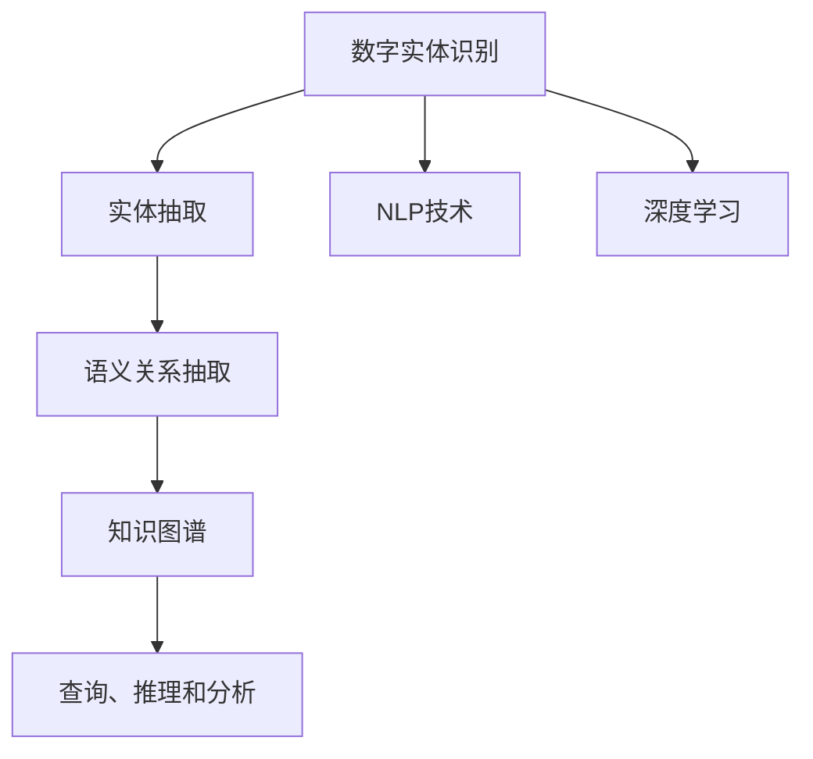

                 

## 1. 背景介绍

在数字实体自动化的浪潮中，如何通过自动化技术实现对各类数字实体的有效识别、提取和分析，一直是研究者关注的焦点。从最早的实体识别算法到今天基于深度学习的自然语言处理技术，这一领域经历了翻天覆地的变化。目前，数字实体自动化的发展已经进入了一个新的阶段，不仅在技术上取得了显著进步，更在多个实际应用中展现出了巨大的潜力。本文将全面回顾数字实体自动化的背景，梳理其核心概念，并结合最新的研究进展，探讨这一领域未来的发展方向。

## 2. 核心概念与联系

### 2.1 核心概念概述

在数字实体自动化的过程中，涉及的关键概念包括但不限于：

- **数字实体识别（Named Entity Recognition, NER）**：识别文本中具有特定意义的实体，如人名、地名、机构名等。
- **实体抽取（Entity Extraction）**：从非结构化文本中抽取出具有特定属性的实体，如时间、地点、价格等。
- **语义关系抽取（Semantic Relation Extraction）**：抽取文本中实体之间的语义关系，如主谓宾结构。
- **知识图谱（Knowledge Graph）**：将实体及其关系映射成结构化数据，形成可用于查询、推理和分析的知识体系。
- **自然语言处理（Natural Language Processing, NLP）**：利用计算机技术处理、分析和生成自然语言，包括文本分类、情感分析、机器翻译等。

这些概念之间存在紧密的联系，共同构成了数字实体自动化的技术框架。数字实体识别是基础，通过实体抽取和语义关系抽取，最终构建知识图谱，为后续的深度学习和推理分析提供数据支撑。

### 2.2 核心概念原理和架构的 Mermaid 流程图



## 3. 核心算法原理 & 具体操作步骤

### 3.1 算法原理概述

数字实体自动化的核心算法是基于深度学习（如卷积神经网络CNN、循环神经网络RNN、Transformer等）的自然语言处理技术。以BERT（Bidirectional Encoder Representations from Transformers）模型为例，其基于Transformer结构，通过预训练和微调，可以在特定任务上表现优异。

**算法原理**：
- **预训练**：使用大规模无标注数据，训练通用语言模型，获得丰富的语言表示。
- **微调**：使用特定任务的标注数据，微调预训练模型，使得模型能够适应新的任务需求。
- **实体识别**：使用微调后的模型，对输入文本进行实体识别，抽取文本中的实体。
- **关系抽取**：基于实体识别结果，进一步抽取实体之间的关系，形成语义结构。
- **知识图谱构建**：将实体及其关系整合，形成结构化知识体系。

### 3.2 算法步骤详解

1. **数据预处理**：
   - 对文本进行分词、标记、向量化等处理，确保输入数据符合模型要求。
   - 利用命名实体识别（NER）模型对文本进行实体标记。

2. **预训练模型选择**：
   - 选择合适的预训练模型，如BERT、GPT等。
   - 对预训练模型进行微调，适应目标任务的需求。

3. **实体抽取**：
   - 使用微调后的模型对输入文本进行实体识别，输出实体列表。
   - 对实体进行进一步分析，确定实体类型。

4. **关系抽取**：
   - 基于实体识别结果，利用深度学习模型抽取实体之间的关系。
   - 对抽取出的关系进行验证，去除错误或无意义的关系。

5. **知识图谱构建**：
   - 将抽取出的实体和关系整合，形成知识图谱。
   - 对知识图谱进行优化，确保其结构合理、便于查询和推理。

### 3.3 算法优缺点

**优点**：
- **高效性**：基于深度学习的算法能够快速处理大规模文本数据。
- **准确性**：深度学习模型在特定任务上表现优异，识别和抽取实体较为准确。
- **可扩展性**：可针对不同任务进行模型微调，适应多种实体抽取需求。

**缺点**：
- **计算资源消耗大**：深度学习模型需要大量的计算资源进行训练和推理。
- **数据质量要求高**：模型的训练效果高度依赖于标注数据的质量和数量。
- **模型复杂度**：深度学习模型较为复杂，调试和维护难度较大。

### 3.4 算法应用领域

数字实体自动化的应用领域非常广泛，包括但不限于：

- **金融行业**：通过识别和分析金融文本中的实体，实现风险评估、合规审查、反欺诈等功能。
- **医疗健康**：从医疗记录中抽取关键信息，辅助医生诊断和治疗。
- **政府公共服务**：从公共数据中抽取各类实体，提高数据利用效率。
- **电子商务**：对用户评论和商品描述进行分析，提升推荐和营销效果。
- **新闻媒体**：自动抽取新闻事件的关键信息，辅助新闻内容生产。

## 4. 数学模型和公式 & 详细讲解

### 4.1 数学模型构建

数字实体自动化的数学模型通常基于深度学习框架，以神经网络模型为基础。以BERT为例，其数学模型如下：

$$
\text{Embedding} = \text{BERT}(x) = \text{Softmax}(\text{Transformer}(x))
$$

其中，$x$ 为输入文本，$\textrm{Embedding}$ 为文本表示，$\textrm{Transformer}$ 为Transformer模型，$\textrm{Softmax}$ 为softmax函数。

### 4.2 公式推导过程

1. **输入表示**：
   - 将文本转换为模型能够处理的数字向量。
   - 使用BERT模型对文本进行编码，得到向量表示 $x$。

2. **Transformer模型**：
   - 基于自注意力机制，对输入向量 $x$ 进行编码，得到表示矩阵 $X$。
   - 对 $X$ 进行线性变换和softmax操作，得到表示矩阵 $Y$。

3. **实体识别**：
   - 使用微调后的BERT模型对输入文本进行实体识别，输出实体标签。
   - 对实体标签进行后处理，确定实体类型。

4. **关系抽取**：
   - 利用关系抽取模型对识别出的实体进行关系抽取，输出关系类型。
   - 对抽取出的关系进行验证和筛选，去除噪声和无关关系。

### 4.3 案例分析与讲解

以金融行业为例，分析如何利用数字实体自动化技术进行风险评估。

1. **数据准备**：
   - 收集金融领域的文本数据，如贷款申请、信用报告等。
   - 对文本进行预处理，去除停用词、标点等噪声。

2. **模型选择和微调**：
   - 选择BERT模型作为预训练模型。
   - 使用标注数据对BERT模型进行微调，使其能够识别贷款申请中的关键信息，如申请金额、贷款用途、还款方式等。

3. **实体抽取**：
   - 利用微调后的BERT模型对贷款申请文本进行实体抽取，确定申请人信息、贷款金额等关键实体。

4. **关系抽取**：
   - 基于实体抽取结果，抽取贷款申请中的关键关系，如申请人和金融机构之间的关系。
   - 对抽取出的关系进行验证，去除错误或无关关系。

5. **风险评估**：
   - 将抽取出的实体和关系整合，构建知识图谱。
   - 利用图谱中的信息进行风险评估，辅助银行和金融机构做出更科学的决策。

## 5. 项目实践：代码实例和详细解释说明

### 5.1 开发环境搭建

为了进行数字实体自动化的实践，需要搭建一个合适的开发环境。以下是一个Python 3.8的开发环境搭建流程：

1. **安装Anaconda**：
   ```bash
   conda install anaconda
   conda create --name spacy_nlp python=3.8
   conda activate spacy_nlp
   ```

2. **安装依赖包**：
   ```bash
   pip install spacy pytorch transformers sacremoses
   ```

3. **配置Spacy**：
   ```bash
   python -m spacy download en_core_web_sm
   ```

### 5.2 源代码详细实现

以BERT模型为例，以下是一个简单的实体识别代码实现：

```python
import torch
from transformers import BertForTokenClassification, BertTokenizer, AdamW
from tqdm import tqdm

# 加载预训练模型和分词器
tokenizer = BertTokenizer.from_pretrained('bert-base-uncased')
model = BertForTokenClassification.from_pretrained('bert-base-uncased', num_labels=10)

# 准备训练数据
train_texts = ['The CEO of Google is Sundar Pichai', 'Facebook is a social media company']
train_labels = [[0, 1, 0, 0, 0, 0, 0, 0, 0, 1], [1, 0, 0, 0, 0, 0, 0, 0, 0, 0]]

# 构建DataLoader
train_dataset = Dataset(train_texts, train_labels)
train_loader = DataLoader(train_dataset, batch_size=2, shuffle=True)

# 定义优化器和学习率
optimizer = AdamW(model.parameters(), lr=1e-5)
total_steps = len(train_loader)

# 训练过程
for epoch in range(3):
    model.train()
    total_loss = 0
    for batch in tqdm(train_loader):
        inputs, labels = batch
        inputs = tokenizer.encode(inputs, return_tensors='pt')
        labels = torch.tensor(labels, dtype=torch.long)
        outputs = model(inputs, labels=labels)
        loss = outputs.loss
        total_loss += loss.item()
        optimizer.zero_grad()
        loss.backward()
        optimizer.step()
    print(f"Epoch {epoch+1}, Loss: {total_loss/len(train_loader)}")
```

### 5.3 代码解读与分析

以上代码实现了一个简单的实体识别任务，使用了Spacy库和Hugging Face的BERT模型。

1. **数据准备**：
   - 准备训练数据，包含输入文本和实体标签。
   - 使用BertTokenizer对文本进行分词。

2. **模型微调**：
   - 加载BERT模型和分词器。
   - 定义优化器和学习率。
   - 使用DataLoader处理批量数据，进行训练。

3. **训练过程**：
   - 在每个epoch中，将模型设置为训练模式。
   - 对每个batch的数据进行前向传播，计算损失。
   - 更新模型参数，并记录训练损失。

4. **结果输出**：
   - 输出每个epoch的平均训练损失。

## 6. 实际应用场景

### 6.1 金融行业

在金融行业，数字实体自动化技术主要用于风险评估、合规审查和反欺诈等方面。例如，通过识别贷款申请中的关键实体，如申请人、贷款金额、还款方式等，可以辅助金融机构做出更科学的决策，降低违约风险。

### 6.2 医疗健康

在医疗健康领域，数字实体自动化技术可以从病历中抽取关键信息，辅助医生诊断和治疗。通过识别病人的基本信息、病情描述、诊断结果等实体，可以构建电子健康记录（EHR），提高医疗服务的效率和质量。

### 6.3 政府公共服务

政府公共服务领域，数字实体自动化技术主要用于数据整理、信息提取和查询。例如，从公开数据中抽取政府项目的名称、地点、预算等信息，可以快速生成报告，辅助政府决策。

### 6.4 未来应用展望

未来，数字实体自动化的应用将更加广泛和深入，有望在以下领域取得突破：

1. **自动化文档处理**：通过自动化文档处理，提升企业内部文档管理效率，减少人工工作量。
2. **智能客服**：利用实体抽取技术，提高智能客服系统的理解能力和回复准确性。
3. **智能搜索**：通过构建知识图谱，实现智能搜索，提升搜索引擎的精准度和用户体验。
4. **个性化推荐**：基于实体信息，实现更加精准的用户推荐，提升电子商务和内容平台的个性化服务。

## 7. 工具和资源推荐

### 7.1 学习资源推荐

1. **《自然语言处理综论》**：斯坦福大学CS224N课程的讲义，介绍了NLP领域的基础知识和前沿技术。
2. **《深度学习》**：Ian Goodfellow等人合著的经典教材，介绍了深度学习的基本原理和应用。
3. **Hugging Face官方文档**：提供了丰富的预训练模型和微调样例，适合快速上手实践。
4. **Kaggle竞赛平台**：提供了大量NLP竞赛数据集和样例代码，适合学习和实践实体识别等任务。

### 7.2 开发工具推荐

1. **PyTorch**：基于Python的深度学习框架，灵活性高，适合科研和工程开发。
2. **TensorFlow**：由Google开发的深度学习框架，支持分布式计算，适合大规模工程应用。
3. **Spacy**：开源的NLP库，支持词性标注、命名实体识别等任务。
4. **NLTK**：Python自然语言处理库，提供了丰富的工具和语料库。

### 7.3 相关论文推荐

1. **《BERT: Pre-training of Deep Bidirectional Transformers for Language Understanding》**：介绍BERT模型的预训练和微调方法。
2. **《Attention is All You Need》**：介绍Transformer结构，提出了自注意力机制。
3. **《Semantic Role Labeling for Lexical Entailment》**：介绍基于依存句法的语义角色标注方法。

## 8. 总结：未来发展趋势与挑战

### 8.1 研究成果总结

数字实体自动化技术在近年来取得了显著进展，从最初的实体识别算法到现在的深度学习模型，展示了强大的应用潜力。未来的研究将继续围绕以下几个方向进行：

1. **模型优化**：研究更加高效的模型结构，如BERT、GPT等。
2. **数据处理**：研究更加鲁棒的数据处理方法，如数据增强、噪声过滤等。
3. **应用拓展**：研究数字实体自动化技术在更多领域的应用，如自动化文档处理、智能搜索等。

### 8.2 未来发展趋势

1. **更加高效**：未来的模型将更加高效，能够在更短的时间内完成实体抽取和关系抽取任务。
2. **更加鲁棒**：未来的模型将更加鲁棒，能够在噪声数据和复杂文本中准确识别实体。
3. **更加智能**：未来的模型将更加智能，能够理解和生成复杂的自然语言。

### 8.3 面临的挑战

1. **计算资源消耗**：深度学习模型需要大量的计算资源，未来的研究需要优化模型结构，降低资源消耗。
2. **数据质量要求**：模型的训练效果高度依赖于标注数据的质量和数量，未来的研究需要提高标注数据的覆盖度和准确度。
3. **模型复杂度**：深度学习模型较为复杂，未来的研究需要简化模型结构，降低调试和维护难度。

### 8.4 研究展望

未来的研究将在以下几个方面进行探索：

1. **无监督学习**：研究无监督学习和半监督学习，摆脱对大规模标注数据的依赖。
2. **跨模态学习**：研究跨模态学习，将文本、图像、语音等数据结合，提升实体识别和关系抽取的效果。
3. **融合知识图谱**：研究知识图谱与深度学习的融合，提升模型的推理和查询能力。

## 9. 附录：常见问题与解答

**Q1: 数字实体自动化技术有哪些优点和缺点？**

A: 优点包括：
- **高效性**：基于深度学习的模型能够快速处理大规模文本数据。
- **准确性**：深度学习模型在特定任务上表现优异，识别和抽取实体较为准确。

缺点包括：
- **计算资源消耗大**：深度学习模型需要大量的计算资源进行训练和推理。
- **数据质量要求高**：模型的训练效果高度依赖于标注数据的质量和数量。
- **模型复杂度**：深度学习模型较为复杂，调试和维护难度较大。

**Q2: 如何提高数字实体自动化的效率？**

A: 提高数字实体自动化的效率可以从以下几个方面进行：
- **数据预处理**：优化数据预处理流程，去除停用词、标点等噪声，提高输入文本的质量。
- **模型优化**：研究更加高效的模型结构，如BERT、GPT等。
- **硬件加速**：使用GPU、TPU等硬件设备进行加速，提高训练和推理速度。

**Q3: 数字实体自动化技术在实际应用中有哪些挑战？**

A: 数字实体自动化技术在实际应用中面临的挑战包括：
- **数据质量要求高**：模型的训练效果高度依赖于标注数据的质量和数量。
- **计算资源消耗大**：深度学习模型需要大量的计算资源进行训练和推理。
- **模型复杂度**：深度学习模型较为复杂，调试和维护难度较大。

通过不断探索和优化，数字实体自动化技术将在未来取得更大的突破，为各行各业带来更加智能、高效的服务。

