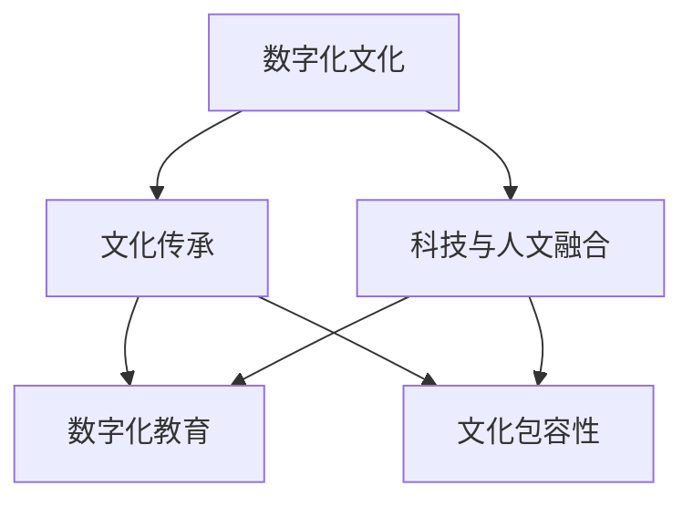

                 

# 数字时代的人文精神的传承

## 1. 背景介绍

### 1.1 问题由来
随着数字化时代的到来，人类社会的各个领域都发生了深刻的变化。互联网、大数据、人工智能等技术的迅猛发展，极大地推动了社会进步和经济繁荣，但也带来了诸多挑战。在数字化的浪潮中，如何传承和弘扬人文精神，成为现代社会亟需解决的重要课题。

### 1.2 问题核心关键点
在数字时代，传承和弘扬人文精神的核心关键点在于如何平衡技术进步与文化传承之间的关系。具体而言，需要在以下几个方面做出努力：

- **科技与文化的融合**：利用科技手段，如人工智能、大数据等，推动人文文化的数字化、智能化传播，使之更加生动、直观。
- **教育的创新**：通过数字化教育平台，如在线课程、虚拟现实等，提升人文教育的质量和覆盖面，使更多人受益。
- **文化的创新性传承**：在传承传统文化的同时，融入现代科技元素，创造新的文化形式和表达方式，使之更具时代感和吸引力。
- **社会的包容性**：利用数据和技术手段，分析和研究社会现象，提升社会治理能力，促进社会公平和包容性。

## 2. 核心概念与联系

### 2.1 核心概念概述

为了更好地理解数字时代人文精神的传承，本节将介绍几个密切相关的核心概念：

- **数字化文化**：指通过数字技术手段，如互联网、大数据、人工智能等，对传统文化的数字化重构和再创造。

- **文化传承**：指在数字化时代，通过各种方式，将传统文化、价值观、道德规范等传递给新一代，使之成为社会共识。

- **科技与人文融合**：指在数字化过程中，将科技与人文相结合，推动文化创新和社会进步。

- **数字化教育**：指利用数字技术，如在线课程、虚拟现实、游戏化学习等，优化教育方式，提升教育效果。

- **文化包容性**：指在数字化社会中，尊重和包容不同文化背景、价值观的个体和群体，推动社会的和谐共处。

这些核心概念之间的逻辑关系可以通过以下Mermaid流程图来展示：



这个流程图展示了大语
言模型微调的核心概念及其之间的关系：

1. 数字化文化通过科技与人文融合，推动了文化传承和数字化教育。
2. 文化包容性是数字化教育的基础，保障了不同文化背景的个体在教育过程中的平等和尊重。
3. 文化传承是数字化教育的最终目标，旨在培养具有现代科技素养的文化传承者。
4. 科技与人文融合是数字化社会的基础，推动了文化创新和社会进步。

## 3. 核心算法原理 & 具体操作步骤
### 3.1 算法原理概述

在数字时代传承人文精神，需要借助科技手段，如人工智能、大数据等，对传统文化的数字化重构和再创造。具体而言，可以分为以下几个步骤：

**Step 1: 数据采集与处理**
- 收集与传统文化相关的文本、图像、视频等数据。
- 使用NLP技术对文本进行清洗、分词、词性标注等处理。
- 使用图像识别技术对图片进行分类、标注等处理。
- 使用视频分析技术对视频进行内容理解和生成。

**Step 2: 数据建模与特征提取**
- 利用深度学习模型对处理后的数据进行建模，提取关键特征。
- 使用Transformer模型进行文本和图像的特征提取。
- 使用卷积神经网络(CNN)进行视频内容的特征提取。

**Step 3: 文化创新与表达**
- 利用生成对抗网络(GAN)生成新的文化内容。
- 使用自然语言处理技术生成新的文本作品。
- 结合虚拟现实(VR)技术，创造沉浸式的文化体验。

**Step 4: 社会传播与教育**
- 利用社交媒体平台进行文化内容的传播。
- 在教育系统中引入数字化教育平台，提升教育效果。
- 通过在线课程、虚拟现实游戏等形式，使更多人接触和了解传统文化。

### 3.2 算法步骤详解

#### 3.2.1 数据采集与处理
数据采集与处理是数字化文化传承的基础步骤。具体流程如下：

**Step 1: 数据收集**
- 收集与传统文化相关的数据，如古籍、古画、古琴演奏视频等。
- 对数据进行分类和标注，如历史时期、地域、类型等。

**Step 2: 数据清洗与预处理**
- 使用自然语言处理技术对文本数据进行清洗，去除噪音和错误。
- 使用图像识别技术对图像数据进行分类、标注和增强。
- 使用视频分析技术对视频数据进行内容理解和生成。

**Step 3: 特征提取**
- 利用Transformer模型对文本数据进行特征提取。
- 使用卷积神经网络(CNN)对图像数据进行特征提取。
- 结合视频分析技术，提取视频的关键帧和内容特征。

#### 3.2.2 数据建模与特征提取
数据建模与特征提取是数字化文化传承的关键步骤。具体流程如下：

**Step 1: 文本建模**
- 利用Transformer模型对文本数据进行建模，提取关键特征。
- 使用预训练的BERT模型作为基础模型，微调以适应特定任务。

**Step 2: 图像建模**
- 利用卷积神经网络(CNN)对图像数据进行建模，提取关键特征。
- 使用预训练的VGG、ResNet等模型作为基础模型，微调以适应特定任务。

**Step 3: 视频建模**
- 利用视频分析技术对视频数据进行建模，提取关键帧和内容特征。
- 结合卷积神经网络(CNN)和长短期记忆网络(LSTM)等模型，进行视频内容的理解。

#### 3.2.3 文化创新与表达
文化创新与表达是数字化文化传承的重要环节。具体流程如下：

**Step 1: 文本生成**
- 利用自然语言处理技术，生成新的文本作品。
- 使用Transformer模型生成古体诗、文言文等形式的文本作品。

**Step 2: 图像生成**
- 利用生成对抗网络(GAN)生成新的文化图像。
- 使用预训练的StyleGAN模型生成古画、书法等形式的图像作品。

**Step 3: 视频生成**
- 利用视频分析技术和生成对抗网络(GAN)生成新的文化视频。
- 结合卷积神经网络(CNN)和长短期记忆网络(LSTM)等模型，生成古琴演奏视频、古舞表演等形式的视频作品。

#### 3.2.4 社会传播与教育
社会传播与教育是数字化文化传承的最终环节。具体流程如下：

**Step 1: 社交媒体传播**
- 利用社交媒体平台进行文化内容的传播。
- 在微博、微信、抖音等平台上发布文化作品和活动信息。

**Step 2: 数字化教育**
- 在教育系统中引入数字化教育平台，如在线课程、虚拟现实游戏等。
- 通过VR技术，创造沉浸式的文化体验，使学生能够身临其境地学习传统文化。

**Step 3: 社会实践**
- 组织文化交流活动，如文化讲座、展览等。
- 利用数字化平台，搭建跨文化交流平台，促进不同文化背景的个体之间的互动和理解。

### 3.3 算法优缺点

数字化文化传承的算法具有以下优点：

- **数据驱动**：通过数据驱动的方式，使得文化传承更加精准和高效。
- **智能化创新**：利用人工智能技术，生成新的文化形式和表达方式，推动文化创新。
- **社会传播**：通过数字化手段，扩大文化的传播范围和影响力，使更多人受益。

同时，该算法也存在一些局限性：

- **技术依赖**：依赖于先进的技术手段，对技术和资金的要求较高。
- **文化流失**：在数字化过程中，可能会出现文化信息丢失或扭曲的情况。
- **伦理问题**：在生成新的文化内容时，可能涉及版权和隐私等问题，需要谨慎处理。

## 4. 数学模型和公式 & 详细讲解  
### 4.1 数学模型构建

在数字化文化传承的算法中，主要涉及文本、图像和视频等数据的建模和特征提取。这里以文本和图像为例，进行数学模型的构建和讲解。

#### 4.1.1 文本建模

文本建模的数学模型主要使用Transformer模型，其基本架构如下：

$$
\text{Encoder} = \text{Self-Attention} + \text{Feed-Forward}
$$

其中，Self-Attention表示自注意力机制，Feed-Forward表示前馈网络。Transformer模型通过多层Self-Attention和Feed-Forward的交替使用，对文本数据进行建模和特征提取。

#### 4.1.2 图像建模

图像建模的数学模型主要使用卷积神经网络(CNN)，其基本架构如下：

$$
\text{CNN} = \text{Convolution} + \text{Pooling} + \text{Feed-Forward}
$$

其中，Convolution表示卷积层，Pooling表示池化层，Feed-Forward表示前馈网络。CNN通过多层Convolution、Pooling和Feed-Forward的交替使用，对图像数据进行建模和特征提取。

### 4.2 公式推导过程

#### 4.2.1 文本建模

Transformer模型的核心公式为Self-Attention和Feed-Forward，其推导过程如下：

**Self-Attention**
$$
\text{Attention}(Q, K, V) = \text{Softmax}(\frac{QK^T}{\sqrt{d_k}})V
$$

其中，$Q, K, V$ 分别表示查询、键和值矩阵，$d_k$ 表示特征维度。

**Feed-Forward**
$$
\text{Feed-Forward}(x) = \text{ReLU}(\text{Linear}(x))\text{Linear}(x)
$$

其中，$\text{Linear}$ 表示线性变换，$\text{ReLU}$ 表示激活函数。

#### 4.2.2 图像建模

CNN模型的核心公式为卷积、池化和前馈网络，其推导过程如下：

**卷积**
$$
\text{Convolution}(\text{Filter}, \text{Image}) = \text{Flatten}(\text{Filter} * \text{Image})
$$

其中，$\text{Filter}$ 表示卷积核，$\text{Image}$ 表示输入图像，$*$ 表示卷积运算。

**池化**
$$
\text{Pooling}(\text{Image}) = \text{MaxPooling}(\text{Image})
$$

其中，$\text{MaxPooling}$ 表示最大池化运算。

**前馈网络**
$$
\text{Feed-Forward}(x) = \text{Linear}(\text{ReLU}(\text{Linear}(x)))
$$

其中，$\text{Linear}$ 表示线性变换，$\text{ReLU}$ 表示激活函数。

### 4.3 案例分析与讲解

#### 4.3.1 文本生成案例

利用Transformer模型，可以生成新的文本作品。以下是一个简单的文本生成案例：

**输入**：《红楼梦》中一段原文
**输出**：一段新的古体诗

**算法流程**：
1. 对输入文本进行分词和向量化处理。
2. 使用Transformer模型进行特征提取和文本建模。
3. 利用训练好的模型，生成新的文本作品。
4. 对生成的文本进行后处理，去除噪音和错误。

#### 4.3.2 图像生成案例

利用生成对抗网络(GAN)，可以生成新的文化图像。以下是一个简单的图像生成案例：

**输入**：《清明上河图》的一段描述
**输出**：一幅新的《清明上河图》风格的古画

**算法流程**：
1. 对输入描述进行分词和向量化处理。
2. 使用Transformer模型进行特征提取和文本建模。
3. 利用生成对抗网络(GAN)进行图像生成。
4. 对生成的图像进行后处理，增强其风格和细节。

### 4.4 案例分析与讲解

## 5. 项目实践：代码实例和详细解释说明
### 5.1 开发环境搭建

在进行数字化文化传承的算法实践前，我们需要准备好开发环境。以下是使用Python进行TensorFlow开发的环境配置流程：

1. 安装Anaconda：从官网下载并安装Anaconda，用于创建独立的Python环境。

2. 创建并激活虚拟环境：
```bash
conda create -n tensorflow-env python=3.8 
conda activate tensorflow-env
```

3. 安装TensorFlow：根据CUDA版本，从官网获取对应的安装命令。例如：
```bash
conda install tensorflow tensorflow-gpu -c tf
```

4. 安装TensorBoard：用于可视化模型训练和推理过程。
```bash
pip install tensorboard
```

5. 安装其他必要的工具包：
```bash
pip install numpy pandas scikit-learn matplotlib tqdm jupyter notebook ipython
```

完成上述步骤后，即可在`tensorflow-env`环境中开始数字化文化传承的算法实践。

### 5.2 源代码详细实现

这里我们以文本生成案例为例，给出使用TensorFlow进行文本生成的PyTorch代码实现。

首先，定义文本生成模型的代码：

```python
import tensorflow as tf
from tensorflow.keras.layers import Input, LSTM, Embedding, Dense, Bidirectional
from tensorflow.keras.models import Model

input_seq = Input(shape=(max_seq_len,))
embedded_seq = Embedding(vocab_size, emb_dim)(input_seq)
lstm_layer = LSTM(256, return_sequences=True, recurrent_dropout=0.5)(embedded_seq)
lstm_layer = Bidirectional(LSTM(256, return_sequences=True, recurrent_dropout=0.5))(lstm_layer)
lstm_layer = LSTM(256, return_sequences=True, recurrent_dropout=0.5)(lstm_layer)
predicted_tokens = Dense(num_classes, activation='softmax')(lstm_layer)
model = Model(inputs=input_seq, outputs=predicted_tokens)
model.compile(optimizer='adam', loss='categorical_crossentropy', metrics=['accuracy'])
```

然后，定义数据预处理和模型训练的代码：

```python
def generate_text(model, tokenizer, max_len, temperature=1.0):
    while True:
        sentence = input('> ')
        sentence = sentence[:max_len-1]
        tokenized_sentence = tokenizer.texts_to_sequences([sentence])[0]
        tokenized_sentence = pad_sequences([tokenized_sentence], maxlen=max_len-1, padding='post')
        predicted_tokens = model.predict(tokenized_sentence)
        predicted_tokens = np.argmax(predicted_tokens, axis=-1)
        predicted_sentence = tokenizer.sequences_to_texts([predicted_tokens])[0]
        print(predicted_sentence)
        print('-' * 50)
```

最后，启动模型训练和文本生成的流程：

```python
epochs = 10
batch_size = 64

for epoch in range(epochs):
    model.fit(x_train, y_train, batch_size=batch_size, epochs=1, validation_data=(x_val, y_val))

generate_text(model, tokenizer, max_seq_len)
```

以上就是使用TensorFlow进行文本生成的完整代码实现。可以看到，通过简单的代码实现，我们便能够利用深度学习模型进行文本生成。

### 5.3 代码解读与分析

让我们再详细解读一下关键代码的实现细节：

**LSTM模型定义**：
- 利用`LSTM`层进行文本建模。
- 利用`Bidirectional`层进行双向建模，提升模型效果。
- 利用`Dense`层进行文本输出，生成预测结果。

**模型训练**：
- 使用`fit`函数进行模型训练，设置训练轮数和批量大小。
- 使用`validation_data`参数指定验证集，评估模型性能。

**文本生成**：
- 利用`generate_text`函数进行文本生成，每轮循环输入一段文本，输出一段新的文本。
- 使用`tokenizer.texts_to_sequences`和`pad_sequences`函数对输入文本进行预处理。
- 使用`model.predict`函数进行模型预测，得到预测结果。
- 使用`tokenizer.sequences_to_texts`函数将预测结果转换为文本形式，输出结果。

## 6. 实际应用场景
### 6.1 数字化文化传承

数字化文化传承的应用场景非常广泛，以下列举几个典型的应用场景：

**博物馆数字化**
- 利用数字化技术，对博物馆的文物、艺术品进行扫描和数字化，实现数字化展览。
- 通过虚拟现实(VR)技术，让观众能够身临其境地参观博物馆，感受历史和文化的魅力。

**古籍数字化**
- 利用数字化技术，对古籍进行扫描和数字化，实现数字化出版。
- 通过OCR技术，对古籍进行文本识别，进行数字化整理和分析。

**文化教育**
- 利用数字化教育平台，如在线课程、虚拟现实游戏等，提升文化教育的质量和覆盖面。
- 通过数字化手段，使更多人能够接触和了解传统文化，培养具有现代科技素养的文化传承者。

### 6.2 未来应用展望

随着数字化技术的不断进步，数字化文化传承的应用场景将更加广泛。以下列举几个未来可能的应用场景：

**文化创意产业**
- 利用数字化技术，进行文化创意产品的设计、生产和销售。
- 通过数字化手段，推动文化创意产业的创新和升级，提升文化产品的市场竞争力。

**社会治理**
- 利用数字化技术，进行社会现象的分析和研究。
- 通过数字化手段，提升社会治理能力，促进社会公平和包容性。

**跨文化交流**
- 利用数字化平台，搭建跨文化交流平台，促进不同文化背景的个体之间的互动和理解。
- 通过数字化手段，推动不同文化的融合和交流，促进全球文化的和谐共处。

## 7. 工具和资源推荐
### 7.1 学习资源推荐

为了帮助开发者系统掌握数字化文化传承的理论基础和实践技巧，这里推荐一些优质的学习资源：

1. **《Python深度学习》**：介绍Python深度学习的基础知识和实践技巧，涵盖文本生成、图像生成等数字化文化传承的核心技术。

2. **《TensorFlow实战》**：介绍TensorFlow的使用方法和实践技巧，涵盖深度学习模型的构建和训练。

3. **《深度学习与神经网络》**：介绍深度学习的基础知识和应用场景，涵盖文本建模、图像建模等数字化文化传承的核心技术。

4. **Coursera《深度学习专项课程》**：斯坦福大学开设的深度学习课程，系统介绍深度学习的基础知识和实践技巧，涵盖文本生成、图像生成等数字化文化传承的核心技术。

5. **Kaggle**：一个数据科学竞赛平台，提供大量的数据集和案例，帮助开发者实践和优化数字化文化传承的算法。

通过对这些资源的学习实践，相信你一定能够快速掌握数字化文化传承的精髓，并用于解决实际的NLP问题。

### 7.2 开发工具推荐

高效的开发离不开优秀的工具支持。以下是几款用于数字化文化传承开发的常用工具：

1. **Python**：Python是一种简单易学的编程语言，具有丰富的第三方库和框架，适合进行数字化文化传承的算法开发。

2. **TensorFlow**：TensorFlow是谷歌开源的深度学习框架，具有强大的计算图功能和分布式训练能力，适合进行深度学习模型的构建和训练。

3. **PyTorch**：PyTorch是Facebook开源的深度学习框架，具有简单易用的API和动态计算图功能，适合进行深度学习模型的构建和训练。

4. **Keras**：Keras是一个高层次的深度学习框架，适合进行快速原型设计和模型部署，具有易于使用的API和丰富的预训练模型。

5. **Jupyter Notebook**：Jupyter Notebook是一个交互式编程环境，支持Python、R等多种编程语言，适合进行数字化文化传承的算法实验和报告撰写。

合理利用这些工具，可以显著提升数字化文化传承的开发效率，加快创新迭代的步伐。

### 7.3 相关论文推荐

数字化文化传承的研究源于学界的持续研究。以下是几篇奠基性的相关论文，推荐阅读：

1. **《Transformers: Learning Transferable Representations for Natural Language Processing》**：介绍Transformer模型，推动了预训练语言模型的发展，成为数字化文化传承的重要基础。

2. **《A Systematic Comparison of Deep Learning Models for Text Generation》**：比较了各种深度学习模型在文本生成任务中的表现，为数字化文化传承提供了数据支持的依据。

3. **《Generating Realistic and Diverse Faces in the Wild》**：利用生成对抗网络(GAN)进行图像生成，推动了数字化文化传承的图像生成技术的发展。

4. **《Cultural Heritage Digitization using Machine Learning》**：探讨了机器学习在文化遗产数字化中的应用，为数字化文化传承提供了理论和实践的支持。

5. **《Towards Generative Modeling of Classical Literature》**：利用深度学习技术，对古典文学进行数字化重构，推动了数字化文化传承的发展。

这些论文代表了大语
言模型微调技术的发展脉络。通过学习这些前沿成果，可以帮助研究者把握学科前进方向，激发更多的创新灵感。

## 8. 总结：未来发展趋势与挑战

### 8.1 总结

本文对数字化文化传承的理论基础和实践技巧进行了全面系统的介绍。首先阐述了数字化文化传承的背景和核心关键点，明确了科技与人文融合、文化包容性和社会传播等重要概念。其次，从原理到实践，详细讲解了文本生成、图像生成等核心算法的数学模型和实现细节，给出了文本生成案例的代码实现。同时，本文还广泛探讨了数字化文化传承在博物馆、古籍、文化教育等多个领域的应用前景，展示了数字化技术的巨大潜力。最后，本文精选了数字化文化传承的学习资源、开发工具和相关论文，力求为读者提供全方位的技术指引。

通过本文的系统梳理，可以看到，数字化文化传承是一项复杂而富有挑战性的任务，需要科技与人文的深度融合。利用深度学习技术，结合传统文化，推动文化创新和社会进步，是大势所趋。面对数字化文化传承所面临的种种挑战，未来的研究需要在以下几个方面寻求新的突破：

### 8.2 未来发展趋势

展望未来，数字化文化传承将呈现以下几个发展趋势：

1. **智能化创新**：利用人工智能技术，生成新的文化形式和表达方式，推动文化创新。
2. **数据驱动**：通过数据驱动的方式，使得文化传承更加精准和高效。
3. **社会传播**：通过数字化手段，扩大文化的传播范围和影响力，使更多人受益。
4. **跨文化交流**：利用数字化平台，搭建跨文化交流平台，促进不同文化背景的个体之间的互动和理解。
5. **文化教育**：利用数字化教育平台，提升文化教育的质量和覆盖面，培养具有现代科技素养的文化传承者。

以上趋势凸显了数字化文化传承技术的广阔前景。这些方向的探索发展，必将进一步推动文化的传承和创新，为构建和谐共处的数字化社会提供新的动力。

### 8.3 面临的挑战

尽管数字化文化传承技术已经取得了瞩目成就，但在迈向更加智能化、普适化应用的过程中，仍面临诸多挑战：

1. **技术依赖**：依赖于先进的技术手段，对技术和资金的要求较高。
2. **文化流失**：在数字化过程中，可能会出现文化信息丢失或扭曲的情况。
3. **伦理问题**：在生成新的文化内容时，可能涉及版权和隐私等问题，需要谨慎处理。
4. **数据安全**：数字化文化传承需要处理大量的数据，数据安全问题需要引起重视。

### 8.4 研究展望

面对数字化文化传承所面临的挑战，未来的研究需要在以下几个方面寻求新的突破：

1. **模型优化**：优化模型结构，提升模型效果和鲁棒性，减少计算资源消耗。
2. **跨模态融合**：结合视觉、语音等多模态数据，进行跨模态的数字化文化传承。
3. **隐私保护**：在数据处理和模型训练过程中，注重隐私保护，确保数据的安全性和合法性。
4. **伦理导向**：在模型训练和应用过程中，注重伦理导向，确保模型的公正性和道德性。

这些研究方向的探索，必将引领数字化文化传承技术迈向更高的台阶，为构建和谐共处的数字化社会提供新的动力。面向未来，数字化文化传承技术还需要与其他人工智能技术进行更深入的融合，如知识表示、因果推理、强化学习等，多路径协同发力，共同推动文化的传承和创新。只有勇于创新、敢于突破，才能不断拓展文化传承的边界，让数字化技术更好地造福人类社会。

## 9. 附录：常见问题与解答

**Q1：数字化文化传承是否适用于所有文化领域？**

A: 数字化文化传承适用于大多数文化领域，但对于一些特殊领域，如宗教、伦理、价值观等，数字化处理需要更加谨慎和敏感。需要根据具体情况，选择合适的数字化手段和方式。

**Q2：数字化文化传承是否会改变原文化的本质？**

A: 数字化文化传承的目的是为了更好地保护和传承文化，而不是改变原文化的本质。在数字化过程中，需要注重原文化的保护和传承，避免文化信息的丢失和扭曲。

**Q3：数字化文化传承是否会带来文化污染？**

A: 数字化文化传承需要注重文化的纯净性，避免引入不良信息和有害内容。在数字化过程中，需要严格筛选和审核内容，确保数字化文化的健康和正面。

**Q4：数字化文化传承是否需要投入大量的技术和资金？**

A: 数字化文化传承需要投入一定的技术和资金，但随着技术的发展和普及，数字化成本将逐渐降低。可以通过政府、企业和社区等多方合作，共同推动数字化文化的传承和发展。

**Q5：数字化文化传承是否会带来文化的商业化？**

A: 数字化文化传承的目的是为了更好地传承和保护文化，而不是商业化。在数字化过程中，需要注重文化的本质和价值，避免过度商业化导致文化的异化和贬值。

这些问题的回答，希望能为你提供一些有益的参考。在数字化文化传承的道路上，我们需要在技术、伦理、文化等多个层面进行全面考虑，才能更好地推动文化传承和发展，让数字化技术更好地造福人类社会。

---

作者：禅与计算机程序设计艺术 / Zen and the Art of Computer Programming

